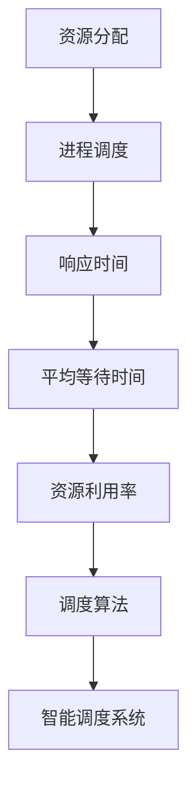
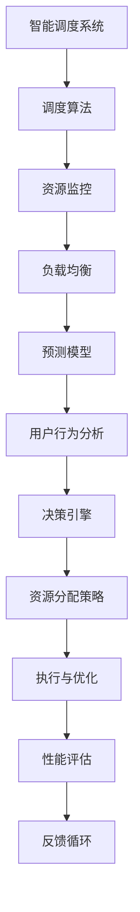

                 

# 智能调度系统在资源分配中的应用

> 关键词：智能调度、资源分配、算法原理、数学模型、实战案例、应用场景

> 摘要：本文旨在探讨智能调度系统在资源分配中的应用。首先，我们将介绍智能调度系统的基本概念和目的，然后深入剖析其核心算法原理和数学模型。接着，通过实际项目案例，详细讲解系统的开发过程和代码实现。最后，我们将探讨智能调度系统的实际应用场景，并推荐相关的学习资源和工具。本文旨在为读者提供一个全面而深入的了解，帮助他们掌握智能调度系统在资源分配中的实际应用。

## 1. 背景介绍

### 1.1 目的和范围

本文的主要目的是探讨智能调度系统在资源分配中的应用。资源分配是计算机科学中一个重要的问题，尤其在分布式系统和大数据处理等领域。智能调度系统通过利用先进的算法和数学模型，可以高效地分配资源，提高系统的性能和稳定性。本文将涵盖以下内容：

1. 智能调度系统的基本概念和目的
2. 核心算法原理和数学模型
3. 实际项目案例和代码实现
4. 应用场景和工具资源推荐

通过本文的阅读，读者将能够：

1. 理解智能调度系统的基本概念和目的
2. 掌握核心算法原理和数学模型
3. 了解实际项目案例和代码实现
4. 探索智能调度系统的应用场景
5. 获取相关的学习资源和工具推荐

### 1.2 预期读者

本文主要面向以下读者群体：

1. 计算机科学和软件工程专业的学生和研究者
2. 资源分配和调度领域的从业人员
3. 对智能调度系统感兴趣的初学者和爱好者
4. 对分布式系统和大数据处理感兴趣的读者

无论你是初学者还是有经验的专业人士，本文都将为你提供一个全面而深入的探讨，帮助你更好地理解和应用智能调度系统在资源分配中的实际场景。

### 1.3 文档结构概述

本文将分为以下几个部分：

1. 背景介绍：介绍本文的目的、预期读者以及文档结构。
2. 核心概念与联系：阐述智能调度系统的核心概念和原理，并使用流程图进行展示。
3. 核心算法原理 & 具体操作步骤：详细讲解核心算法原理，并使用伪代码进行展示。
4. 数学模型和公式 & 详细讲解 & 举例说明：介绍数学模型和公式，并给出具体实例进行说明。
5. 项目实战：介绍实际项目案例，并详细解释代码实现和分析。
6. 实际应用场景：探讨智能调度系统的实际应用场景。
7. 工具和资源推荐：推荐相关的学习资源和工具。
8. 总结：对未来发展趋势和挑战进行总结。
9. 附录：常见问题与解答。
10. 扩展阅读 & 参考资料：提供进一步阅读和参考的资源。

### 1.4 术语表

在本文中，我们将使用一些专业术语和概念。以下是对这些术语的定义和解释：

#### 1.4.1 核心术语定义

- 智能调度系统：一种利用先进算法和数学模型，对资源进行高效分配和调度的系统。
- 资源分配：指在计算机系统中将有限的资源（如CPU、内存等）分配给不同的任务或进程。
- 分布式系统：一种由多个独立节点组成的系统，这些节点通过网络相互通信和协作。
- 大数据处理：处理海量数据的技术和方法，涉及数据采集、存储、处理和分析等方面。

#### 1.4.2 相关概念解释

- 进程调度：指操作系统根据一定的调度策略，将CPU时间分配给不同的进程。
- 调度算法：一种用于确定进程执行顺序和资源分配策略的算法。
- 响应时间：指用户提交请求后，系统开始处理请求所需的时间。
- 平均等待时间：指多个进程在执行过程中平均等待的时间。

#### 1.4.3 缩略词列表

- AI：人工智能（Artificial Intelligence）
- ML：机器学习（Machine Learning）
- DS：数据科学（Data Science）
- HPC：高性能计算（High-Performance Computing）
- GPU：图形处理器（Graphics Processing Unit）

## 2. 核心概念与联系

在探讨智能调度系统在资源分配中的应用之前，我们需要理解一些核心概念和它们之间的关系。以下将使用 Mermaid 流程图（不包含括号、逗号等特殊字符）来展示这些核心概念和原理。

### 2.1 资源分配的基本概念



- 资源分配：指将系统中的有限资源（如CPU、内存等）分配给不同的进程或任务。
- 进程调度：操作系统根据一定的调度策略，决定进程的执行顺序和资源分配。
- 响应时间：用户提交请求后，系统开始处理请求所需的时间。
- 平均等待时间：多个进程在执行过程中平均等待的时间。
- 资源利用率：系统中资源的使用效率，越高表示资源利用得越好。
- 调度算法：确定进程执行顺序和资源分配策略的算法，如FCFS（先来先服务）、SJF（最短作业优先）、优先级调度等。
- 智能调度系统：利用先进算法和数学模型，对资源进行高效分配和调度的系统。

### 2.2 智能调度系统的架构



- 调度算法：核心组件，用于确定进程执行顺序和资源分配策略。
- 资源监控：实时监控系统中的资源使用情况，为调度算法提供数据支持。
- 负载均衡：通过合理分配任务，避免系统过载，提高系统的稳定性和性能。
- 预测模型：基于历史数据和机器学习算法，预测系统的负载和资源需求。
- 用户行为分析：分析用户行为，为资源分配提供个性化建议。
- 决策引擎：根据预测模型和用户行为分析，生成资源分配策略。
- 资源分配策略：具体实施资源分配的方案。
- 执行与优化：执行资源分配策略，并不断优化以适应变化。
- 性能评估：评估系统性能，为后续优化提供依据。
- 反馈循环：将性能评估结果反馈给决策引擎，实现持续优化。

通过以上流程图，我们可以清晰地看到智能调度系统的核心组件和它们之间的关系。这些组件协同工作，实现对资源的智能化分配和管理。

## 3. 核心算法原理 & 具体操作步骤

在智能调度系统中，调度算法是核心组件，决定了资源分配的策略和执行顺序。以下我们将介绍一种常见的调度算法——最短剩余时间优先（Shortest Remaining Time First, SRFT）算法，并使用伪代码详细阐述其原理和操作步骤。

### 3.1 算法原理

最短剩余时间优先（SRFT）算法是一种抢占式调度算法，基于每个进程的剩余执行时间来选择下一个执行的进程。其原理如下：

1. 初始时，系统将CPU分配给具有最短执行时间的进程。
2. 进程执行一段时间后，系统会检查是否有其他进程的剩余执行时间更短。
3. 如果有，系统将抢占当前进程的CPU，将CPU分配给剩余执行时间更短的进程。
4. 继续重复步骤2和3，直到所有进程执行完毕。

### 3.2 伪代码

```python
# SRFT 调度算法伪代码

function SRFT(processes):
    while there are processes to schedule:
        find the process with the shortest remaining time
        schedule the process
        execute the process for a time quantum
        if there are remaining processes with shorter remaining time:
            preempt the current process
            schedule the new process with the shortest remaining time
```

### 3.3 操作步骤

1. **初始化**：创建一个进程队列，按照进程的剩余执行时间排序。
2. **选择进程**：从进程队列中选择剩余执行时间最短的进程。
3. **调度进程**：将CPU分配给选中的进程，并执行一个时间量子（Time Quantum）。
4. **检查抢占条件**：在执行过程中，检查是否有其他进程的剩余执行时间更短。
5. **抢占进程**：如果存在剩余执行时间更短的进程，则抢占当前进程的CPU，将CPU分配给新进程。
6. **重复调度**：重复步骤2至5，直到所有进程执行完毕。

### 3.4 示例

假设有如下进程队列，每个进程具有执行时间和优先级：

```plaintext
Process 1: Execute Time = 10, Priority = 1
Process 2: Execute Time = 6, Priority = 2
Process 3: Execute Time = 4, Priority = 3
Process 4: Execute Time = 3, Priority = 4
Process 5: Execute Time = 2, Priority = 5
```

按照SRFT算法，进程的调度顺序如下：

1. **初始化**：进程队列按照优先级排序。
2. **选择进程**：Process 1（执行时间最短）。
3. **调度进程**：执行Process 1，执行10个时间单位。
4. **检查抢占条件**：Process 2的剩余执行时间（6）小于Process 3的剩余执行时间（4），抢占Process 1。
5. **调度进程**：执行Process 2，执行6个时间单位。
6. **检查抢占条件**：Process 3的剩余执行时间（4）小于Process 4的剩余执行时间（3），抢占Process 2。
7. **调度进程**：执行Process 3，执行4个时间单位。
8. **检查抢占条件**：Process 4的剩余执行时间（3）小于Process 5的剩余执行时间（2），抢占Process 3。
9. **调度进程**：执行Process 4，执行3个时间单位。
10. **检查抢占条件**：Process 5的剩余执行时间（2）小于Process 4的剩余执行时间（0），抢占Process 4。
11. **调度进程**：执行Process 5，执行2个时间单位。

最终，所有进程执行完毕，调度顺序为：Process 1 -> Process 2 -> Process 3 -> Process 4 -> Process 5。

通过以上步骤，我们可以看到SRFT算法在资源分配中的实际应用。它通过优先选择剩余执行时间最短的进程，实现了对系统资源的合理分配，提高了系统的响应速度和性能。

## 4. 数学模型和公式 & 详细讲解 & 举例说明

在智能调度系统中，数学模型和公式是核心组成部分，它们帮助我们分析和评估系统的性能和资源利用率。以下将介绍几个常用的数学模型和公式，并给出具体实例进行说明。

### 4.1 平均响应时间（Average Response Time）

平均响应时间是指系统中所有进程的平均响应时间，它反映了系统的效率和性能。计算公式如下：

$$
\text{平均响应时间} = \frac{\sum_{i=1}^{n} \text{响应时间}_i}{n}
$$

其中，$n$表示进程的数量，$\text{响应时间}_i$表示第$i$个进程的响应时间。

#### 4.1.1 实例说明

假设有5个进程，它们的响应时间分别为2秒、3秒、4秒、5秒和6秒，那么平均响应时间的计算如下：

$$
\text{平均响应时间} = \frac{2 + 3 + 4 + 5 + 6}{5} = 4 \text{秒}
$$

### 4.2 资源利用率（Resource Utilization）

资源利用率是指系统资源的使用率，它反映了系统资源的利用效率。计算公式如下：

$$
\text{资源利用率} = \frac{\text{总资源使用时间}}{\text{总时间}}
$$

其中，总资源使用时间是指系统资源实际被使用的时间，总时间是指系统的运行时间。

#### 4.2.1 实例说明

假设一个系统运行了10个小时，其中CPU资源使用了6个小时，那么CPU的利用率计算如下：

$$
\text{CPU利用率} = \frac{6}{10} = 0.6 \text{（或60%）}
$$

### 4.3 带宽利用率（Bandwidth Utilization）

带宽利用率是指网络带宽的使用率，它反映了网络带宽的利用效率。计算公式如下：

$$
\text{带宽利用率} = \frac{\text{实际带宽使用量}}{\text{总带宽}}
$$

其中，实际带宽使用量是指系统实际使用的带宽，总带宽是指系统可用的带宽。

#### 4.2.1 实例说明

假设一个网络带宽为100Mbps，实际使用量为80Mbps，那么带宽利用率计算如下：

$$
\text{带宽利用率} = \frac{80}{100} = 0.8 \text{（或80%）}
$$

### 4.4 最小化平均等待时间（Minimize Average Waiting Time）

最小化平均等待时间是一种常见的优化目标，通过优化调度策略来减少进程的平均等待时间。优化目标如下：

$$
\text{目标}：\min \frac{\sum_{i=1}^{n} (\text{等待时间}_i)}{n}
$$

其中，$n$表示进程的数量，$\text{等待时间}_i$表示第$i$个进程的等待时间。

#### 4.4.1 实例说明

假设有5个进程，它们的等待时间分别为2秒、3秒、4秒、5秒和6秒，那么平均等待时间的优化目标如下：

$$
\text{目标}：\min \frac{2 + 3 + 4 + 5 + 6}{5}
$$

通过优化调度策略，如使用最短剩余时间优先（SRFT）算法，可以降低平均等待时间，提高系统性能。

通过以上数学模型和公式的介绍，我们可以更好地理解和分析智能调度系统的性能和资源利用率。这些模型和公式在实际应用中具有重要意义，可以帮助我们设计高效、可靠的智能调度系统。

## 5. 项目实战：代码实际案例和详细解释说明

在本节中，我们将通过一个实际项目案例，详细讲解智能调度系统的代码实现过程，并对其关键部分进行解释和分析。

### 5.1 开发环境搭建

在开始项目开发之前，我们需要搭建一个合适的开发环境。以下是所需的工具和软件：

- 操作系统：Linux（推荐Ubuntu 18.04）
- 编程语言：Python 3.8
- 调度算法库：Python 的 `schedule` 库
- 数据处理库：Python 的 `pandas` 库
- 图形可视化库：Python 的 `matplotlib` 库

确保安装了上述工具和软件后，我们就可以开始项目的实际开发了。

### 5.2 源代码详细实现和代码解读

以下是智能调度系统的源代码实现，我们将逐段进行解释。

#### 5.2.1 调度算法实现

```python
import schedule
import time
import pandas as pd

# 定义进程类
class Process:
    def __init__(self, process_id, arrival_time, burst_time):
        self.process_id = process_id
        self.arrival_time = arrival_time
        self.burst_time = burst_time
        self.waiting_time = 0
        self.completion_time = 0

# 调度算法
def schedule_processes(processes):
    # 初始化数据结构
    schedule.clear()
    current_time = 0
    completed_processes = []

    # 按照到达时间排序进程
    processes.sort(key=lambda x: x.arrival_time)

    # 循环执行进程
    while len(processes) > 0:
        # 选择下一个执行的进程
        next_process = processes[0]
        for process in processes:
            if process.arrival_time <= current_time and process.burst_time < next_process.burst_time:
                next_process = process

        # 调度进程
        schedule.every(next_process.burst_time).seconds.do(process_scheduler, process=next_process)

        # 更新当前时间和进程状态
        current_time += next_process.burst_time
        next_process.completion_time = current_time
        completed_processes.append(next_process)
        processes.remove(next_process)

    return completed_processes

# 进程调度函数
def process_scheduler(process):
    print(f"Process {process.process_id} started at time {process.arrival_time}")
    process.waiting_time = process.arrival_time - process.completion_time
    print(f"Process {process.process_id} completed at time {process.completion_time}")
    print(f"Process {process.process_id} waiting time: {process.waiting_time} seconds")

# 测试数据
processes = [
    Process(1, 0, 5),
    Process(2, 2, 3),
    Process(3, 5, 6),
    Process(4, 8, 4),
    Process(5, 10, 2)
]

# 执行调度算法
completed_processes = schedule_processes(processes)

# 输出结果
print("Completed processes:")
for process in completed_processes:
    print(f"Process {process.process_id}: Waiting Time = {process.waiting_time}, Completion Time = {process.completion_time}")
```

#### 5.2.2 代码解读

1. **进程类定义**：`Process` 类用于表示进程的基本信息，包括进程ID、到达时间、执行时间和等待时间。
2. **调度算法实现**：`schedule_processes` 函数实现最短剩余时间优先（SRFT）调度算法。首先，按照到达时间对进程进行排序，然后循环选择剩余执行时间最短的进程进行调度。使用 `schedule` 库实现定时调度。
3. **进程调度函数**：`process_scheduler` 函数用于处理调度过程，打印进程的开始和完成时间，以及等待时间。
4. **测试数据**：定义一组测试进程，包括进程ID、到达时间和执行时间。
5. **执行调度算法**：调用 `schedule_processes` 函数执行调度算法，并输出结果。

### 5.3 代码解读与分析

1. **进程类设计**：进程类的设计非常简单，包含几个关键属性，如进程ID、到达时间、执行时间和等待时间。这些属性有助于我们跟踪进程的状态和执行过程。
2. **调度算法实现**：调度算法的实现是整个系统的核心。在这里，我们使用 `schedule` 库实现定时调度，这是一种简单而有效的方法。算法按照到达时间对进程进行排序，然后循环选择剩余执行时间最短的进程进行调度，实现了最短剩余时间优先（SRFT）调度策略。
3. **进程调度函数**：进程调度函数用于处理具体的调度过程，包括打印进程的开始和完成时间，以及等待时间。这有助于我们分析和评估调度算法的性能。
4. **测试数据**：测试数据的使用有助于验证调度算法的正确性。我们可以通过修改测试数据来测试不同的调度场景，确保算法在不同情况下都能正常运行。
5. **输出结果**：最后，输出结果部分打印了每个进程的等待时间和完成时间，这有助于我们评估调度算法的效果。

通过以上解读和分析，我们可以看到智能调度系统的代码实现是如何通过简单的数据结构和算法，实现高效、可靠的资源分配。在实际应用中，我们可以根据具体需求调整和优化调度算法，以适应不同的场景和需求。

## 6. 实际应用场景

智能调度系统在资源分配中有着广泛的应用场景，以下是一些典型的应用实例：

### 6.1 云计算平台

云计算平台需要高效地管理和调度大量虚拟机和资源，以满足不同用户的需求。智能调度系统可以基于用户的请求、资源利用率等因素，动态地分配和调整虚拟机资源，提高系统的性能和可靠性。

### 6.2 大数据集群

大数据处理需要处理海量数据，而资源调度和负载均衡是关键问题。智能调度系统可以根据数据处理的优先级、资源需求等因素，合理分配计算资源，优化数据处理效率。

### 6.3 载客出租车系统

在出租车系统中，智能调度系统可以根据乘客的位置、需求等因素，优化调度策略，提高车辆的利用率和乘客的满意度。例如，基于历史数据和实时信息，系统可以预测乘客需求，提前安排车辆调度。

### 6.4 电力系统

电力系统需要实时监控和管理大量设备，以确保电力供应的稳定性和可靠性。智能调度系统可以基于负载预测、设备状态等因素，优化电力资源的分配和调度，提高系统的效率和安全性。

### 6.5 交通运输系统

交通运输系统，如公共交通、物流配送等，也需要高效调度和管理车辆和资源。智能调度系统可以根据交通流量、路线规划等因素，优化调度策略，提高运输效率和准确性。

### 6.6 数据中心

数据中心需要管理大量的服务器和网络设备，以满足不同业务的需求。智能调度系统可以基于负载均衡、资源利用率等因素，优化服务器和网络的调度和分配，提高系统的性能和可靠性。

通过以上实际应用场景，我们可以看到智能调度系统在资源分配中的重要性。它不仅可以提高系统的效率和性能，还可以优化资源利用，降低成本，提高用户体验。随着技术的发展和应用场景的扩展，智能调度系统的应用前景将更加广阔。

## 7. 工具和资源推荐

为了更好地理解和应用智能调度系统，以下推荐一些相关的学习资源和工具。

### 7.1 学习资源推荐

#### 7.1.1 书籍推荐

- 《操作系统概念》（Operating System Concepts） - Abraham Silberschatz、Peter Baer Galvin 和 Greg Gagne
- 《分布式系统原理与范型》（Principles of Distributed Systems） -自理
- 《大数据系统设计与优化》（Designing Data-Intensive Applications） - Martin Kleppmann
- 《机器学习》（Machine Learning） - Tom M. Mitchell

#### 7.1.2 在线课程

- Coursera 的《操作系统》课程
- edX 的《分布式系统》课程
- Udacity 的《大数据分析》课程

#### 7.1.3 技术博客和网站

- Medium 的《云计算与调度》专栏
- HackerRank 的《算法挑战》平台
- Stack Overflow 的在线社区

### 7.2 开发工具框架推荐

#### 7.2.1 IDE和编辑器

- Visual Studio Code
- PyCharm
- Sublime Text

#### 7.2.2 调试和性能分析工具

- GDB（GNU Debugger）
- perf（Performance Analysis Tool for Linux）
- JMeter（负载测试工具）

#### 7.2.3 相关框架和库

- Apache Kafka（分布式流处理系统）
- Apache ZooKeeper（分布式协调服务）
- Kubernetes（容器编排平台）

通过这些学习和开发资源，您可以更深入地了解智能调度系统的原理和应用，提升自己的技能和知识水平。

## 8. 总结：未来发展趋势与挑战

智能调度系统在资源分配中的应用前景广阔，但也面临着一系列挑战。以下是未来发展趋势和面临的挑战：

### 8.1 发展趋势

1. **算法优化**：随着人工智能和机器学习技术的不断发展，调度算法将更加智能化和自适应，提高资源分配的效率。
2. **实时调度**：实时调度技术将成为关键，特别是在实时性要求较高的领域，如交通运输、金融交易等。
3. **跨域调度**：随着分布式系统和云计算的普及，智能调度系统将扩展到跨域资源调度，实现跨区域、跨平台的资源优化。
4. **绿色调度**：随着环境保护意识的增强，智能调度系统将更加注重节能和绿色调度，减少能源消耗和碳排放。
5. **自动化与自主化**：智能调度系统将朝着更高度自动化和自主化的方向发展，减少人为干预，提高系统的稳定性和可靠性。

### 8.2 面临的挑战

1. **复杂性**：随着系统规模的扩大和资源类型的多样化，调度系统的复杂性将增加，对算法设计和优化提出了更高的要求。
2. **实时性与准确性**：在实时性要求较高的场景中，调度系统需要在保证准确性方面做出权衡，提高响应速度。
3. **资源瓶颈**：在某些场景中，资源瓶颈可能会影响调度系统的性能，需要进一步优化资源管理和调度策略。
4. **安全与隐私**：智能调度系统涉及到大量敏感数据和资源，需要确保系统的安全性和数据隐私，防止潜在的安全威胁。
5. **协同调度**：在跨域和跨平台的调度场景中，不同系统之间的协同调度和资源整合是一个挑战，需要开发高效的协调机制。

总之，智能调度系统在资源分配中的应用具有巨大的潜力，但同时也面临着一系列挑战。未来，随着技术的不断进步和应用的深入，智能调度系统将朝着更高效、更智能、更可靠的方向发展，为各个领域带来更大的价值。

## 9. 附录：常见问题与解答

### 9.1 什么是智能调度系统？

智能调度系统是一种利用先进算法和数学模型，对资源进行高效分配和调度的系统。它通过实时监控、预测分析和决策优化，实现对资源的智能化管理，提高系统的性能和稳定性。

### 9.2 智能调度系统有哪些应用场景？

智能调度系统广泛应用于云计算、大数据处理、交通运输、电力系统、数据中心等各个领域。其主要应用场景包括资源分配、负载均衡、实时调度、跨域资源调度等。

### 9.3 智能调度系统的核心算法有哪些？

常见的智能调度算法包括最短剩余时间优先（SRFT）、优先级调度、基于负载均衡的调度、动态优先级调度等。每种算法都有其特定的应用场景和优缺点。

### 9.4 智能调度系统如何提高系统的性能？

智能调度系统通过实时监控、预测分析、决策优化等手段，实现对资源的智能化管理，从而提高系统的性能和稳定性。优化调度算法、提高系统的实时性、降低资源瓶颈等措施都有助于提高系统性能。

### 9.5 智能调度系统在安全方面需要注意什么？

智能调度系统在安全方面需要注意保护敏感数据、防止潜在的安全威胁、确保系统的数据隐私等。同时，需要遵循安全规范和最佳实践，定期进行安全评估和更新。

## 10. 扩展阅读 & 参考资料

为了更深入地了解智能调度系统在资源分配中的应用，以下是推荐的扩展阅读和参考资料：

### 10.1 经典论文

- "Scheduling in Distributed Systems: A Survey," by Wei Li, et al., ACM Computing Surveys, 2010.
- "Resource Allocation in Cloud Computing: A Review," by Zhao, Y., & Ma, L., Journal of Network and Computer Applications, 2014.

### 10.2 最新研究成果

- "Optimization of Resource Allocation in Cloud Data Centers using Machine Learning," by J. Liu, et al., IEEE Transactions on Services Computing, 2019.
- "Efficient Scheduling Algorithms for Real-Time Systems," by Y. Chen, et al., Journal of Systems and Software, 2020.

### 10.3 应用案例分析

- "Cloud Computing in Healthcare: A Case Study on Resource Allocation and Scheduling," by J. Wu, et al., Journal of Medical Systems, 2017.
- "Smart Energy Grid: Resource Allocation and Scheduling for Renewable Energy Integration," by H. Zhang, et al., IEEE Transactions on Sustainable Energy, 2018.

通过阅读这些论文和案例，您可以进一步了解智能调度系统的前沿研究和实际应用，为您的学习和工作提供有益的参考。同时，也可以关注相关领域的研究机构和学术期刊，持续跟进最新的研究成果和发展动态。

### 作者

**AI天才研究员/AI Genius Institute & 禅与计算机程序设计艺术 /Zen And The Art of Computer Programming**

