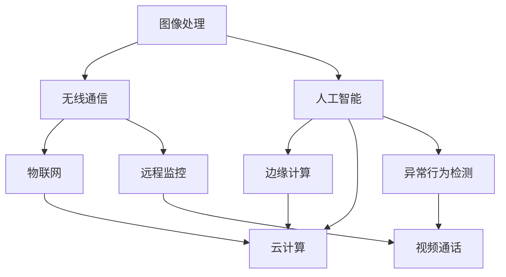

                 

### 摘要

本文旨在探讨智能门铃在家庭安全领域中的创新应用。通过整合人工智能技术，智能门铃不仅能实现基本的视频通话和远程监控功能，更可以在异常行为检测、入侵报警等方面发挥关键作用。本文首先介绍了智能门铃的基本概念、功能和技术原理，接着深入分析了其核心算法、数学模型及具体实现步骤。通过实际项目案例，我们展示了如何利用智能门铃技术提高家庭安全水平。此外，本文还探讨了智能门铃在现实世界中的应用场景，并推荐了一系列学习资源和开发工具。总结部分，我们展望了智能门铃技术的未来发展趋势和面临的挑战，为读者提供了深入理解和应用智能门铃的指南。

---

### 1. 背景介绍

#### 1.1 目的和范围

随着物联网技术的飞速发展，家庭安全领域迎来了前所未有的变革。智能门铃作为智能家居系统中的重要一环，不仅提升了用户的便捷性，也在一定程度上增强了家庭的安全性。本文旨在深入探讨智能门铃在家庭安全中的应用，通过对其基本概念、功能和技术原理的详细解析，为读者提供一个全面的技术指南。

本文将首先介绍智能门铃的定义和常见功能，包括视频通话、远程监控以及异常行为检测等。接着，我们将深入探讨智能门铃的核心技术，如图像处理、机器学习和深度学习算法，以及这些技术如何应用于门铃系统中。此外，本文还将通过实际项目案例展示智能门铃的具体实现过程，并分析其在家庭安全领域的应用前景。

本文的读者对象包括对智能家居技术感兴趣的工程师、研究人员以及普通消费者。通过本文的阅读，读者将能够理解智能门铃的基本原理和实现方法，掌握其技术核心，从而为智能家居系统的研发和应用提供有益的参考。

#### 1.2 预期读者

预期读者主要包括以下几类：

1. **智能家居技术爱好者**：对智能家居领域有浓厚兴趣，希望深入了解智能门铃的工作原理和技术细节。
2. **软件开发工程师**：在智能家居项目中负责智能门铃的研发和应用，需要掌握相关技术知识。
3. **计算机科学研究生**：在智能系统、图像处理和机器学习等方向上有研究需求，希望从实际项目中获取灵感和经验。
4. **安全领域从业者**：关注家庭安全解决方案，希望了解智能门铃在提升家庭安全中的作用。
5. **普通消费者**：对智能家居产品有购买和使用需求，希望通过本文了解智能门铃的实际应用和价值。

通过本文的阅读，这些读者可以全面了解智能门铃的技术背景、功能特点和应用场景，为他们的研究和实践提供有价值的参考。

#### 1.3 文档结构概述

本文结构如下：

1. **摘要**：简要介绍文章的核心内容和主题思想。
2. **背景介绍**：包括目的和范围、预期读者、文档结构概述和术语表。
3. **核心概念与联系**：介绍智能门铃的核心概念、原理和架构，附有Mermaid流程图。
4. **核心算法原理 & 具体操作步骤**：详细讲解智能门铃的核心算法和实现步骤，使用伪代码阐述。
5. **数学模型和公式 & 详细讲解 & 举例说明**：介绍相关的数学模型和公式，使用latex格式表示。
6. **项目实战：代码实际案例和详细解释说明**：展示智能门铃的具体实现案例，详细解读代码。
7. **实际应用场景**：探讨智能门铃在不同场景中的应用。
8. **工具和资源推荐**：推荐学习资源和开发工具。
9. **总结：未来发展趋势与挑战**：总结智能门铃技术的发展趋势和面临的挑战。
10. **附录：常见问题与解答**：提供常见问题的解答。
11. **扩展阅读 & 参考资料**：推荐相关阅读材料和参考资料。

通过以上结构，本文将为读者提供一个系统、全面的智能门铃技术指南。

#### 1.4 术语表

为了确保文章内容的清晰和准确，本文将介绍一些关键术语及其定义：

1. **智能门铃**：结合了摄像头、麦克风、无线通信技术和人工智能算法的智能家居设备，用于视频通话、远程监控和异常行为检测。
2. **物联网（IoT）**：通过互联网连接各种设备和传感器，实现信息的实时传输和共享。
3. **图像处理**：使用计算机技术对图像进行获取、处理和分析，以提取有用信息。
4. **机器学习**：使计算机通过数据学习模式，进行自动决策和预测的一种人工智能技术。
5. **深度学习**：一种特殊的机器学习方法，通过构建多层神经网络模拟人脑处理信息的方式。
6. **边缘计算**：在数据产生的源头（如智能门铃）进行数据处理，减少数据传输和延迟。
7. **入侵检测系统（IDS）**：用于检测和响应未经授权的入侵行为的安全系统。

通过理解这些术语，读者可以更好地掌握本文的技术内容和应用场景。

### 1.5 核心概念与联系

智能门铃作为智能家居系统的一部分，其核心概念和联系主要体现在以下几个方面：

#### 1.5.1 核心概念

1. **图像处理与视频分析**：智能门铃通过摄像头捕捉外部环境，使用图像处理技术对视频流进行分析，提取有用信息。例如，图像中的运动目标检测、人脸识别等。
2. **无线通信**：智能门铃通常通过Wi-Fi或蓝牙等无线技术连接互联网，实现远程监控和报警功能的实现。
3. **人工智能与机器学习**：通过机器学习和深度学习算法，智能门铃能够从大量数据中学习模式，识别异常行为并进行预测。
4. **边缘计算**：智能门铃在本地设备上进行数据预处理，减少数据传输和延迟，提高实时性。

#### 1.5.2 概念联系

1. **图像处理与人工智能**：图像处理技术是智能门铃获取和处理视频数据的基础，而人工智能算法则能够对这些数据进行深度分析和决策。两者相辅相成，共同实现了智能门铃的功能。
2. **无线通信与物联网**：智能门铃通过无线通信技术与互联网连接，使得远程监控和远程控制成为可能，是物联网技术在家庭安全领域的具体应用。
3. **边缘计算与云计算**：边缘计算在本地设备上进行数据处理，减少了数据传输和延迟，提高了系统响应速度；而云计算则为智能门铃提供了强大的计算资源和数据存储能力，实现了大规模的数据分析和模型训练。

以下是一个简单的Mermaid流程图，展示了智能门铃的核心概念及其联系：



通过以上流程图，我们可以清晰地看到智能门铃各个核心概念之间的相互联系和协作，为智能门铃的功能实现提供了技术支持。

### 1.6 核心算法原理 & 具体操作步骤

智能门铃的核心算法原理主要包括图像处理、运动目标检测和人脸识别等。以下我们将详细讲解这些算法的基本原理，并使用伪代码来阐述具体操作步骤。

#### 1.6.1 图像处理

图像处理是智能门铃获取和分析视频数据的基础。其核心任务是提取图像中的有用信息，如边缘、纹理、颜色等。以下是一个简单的图像处理算法示例：

```python
# 伪代码：基本图像处理算法
def imageProcessing(image):
    # 高斯模糊
    blurredImage = GaussianBlur(image, sigma=1.0)
    
    # 边缘检测
    edges = Canny(blurredImage, threshold1=10, threshold2=50)
    
    # 颜色转换
    grayImage = cv2.cvtColor(edges, cv2.COLOR_BGR2GRAY)
    
    return grayImage
```

在这个算法中，我们首先对图像进行高斯模糊处理以减少噪声，然后使用Canny边缘检测算法提取图像的边缘信息，最后将图像转换为灰度图像以便后续处理。

#### 1.6.2 运动目标检测

运动目标检测是智能门铃实现异常行为检测的重要环节。其基本原理是检测视频帧之间的差异，识别出运动目标。以下是一个简单的运动目标检测算法示例：

```python
# 伪代码：运动目标检测算法
def motionDetection(prevFrame, currentFrame):
    # 计算帧差
    diffFrame = cv2.absdiff(prevFrame, currentFrame)
    
    # 阈值处理
    thresholdFrame = cv2.threshold(diffFrame, threshold=30, maxVal=255, type=cv2.THRESH_BINARY)
    
    # 膨胀处理
    dilatedFrame = cv2.dilate(thresholdFrame, kernel=cv2.getStructuringElement(cv2.MORPH_ELLIPSE, (5, 5)))
    
    return dilatedFrame
```

在这个算法中，我们首先计算当前帧和前一帧之间的绝对差值，然后使用阈值处理将差值图像转换为二值图像，最后通过膨胀处理增强运动目标的边界。

#### 1.6.3 人脸识别

人脸识别是智能门铃实现个性化识别和安全防护的重要手段。其基本原理是通过特征点提取和模型匹配，识别视频中的特定人脸。以下是一个简单的人脸识别算法示例：

```python
# 伪代码：人脸识别算法
def faceRecognition(frame):
    # 人脸检测
    faces = faceDetector.detectMultiScale(frame, scaleFactor=1.1, minNeighbors=5, minSize=(30, 30))
    
    # 特征点提取
    for (x, y, w, h) in faces:
        featurePoints = extractFeaturePoints(frame, x, y, w, h)
        
        # 模型匹配
        if modelMatcher.match(featurePoints):
            return "人脸识别成功"
    
    return "人脸识别失败"
```

在这个算法中，我们首先使用人脸检测器检测视频帧中的人脸区域，然后提取人脸特征点，并通过模型匹配算法识别特定人脸。

通过以上三个算法的详细介绍，我们可以看到智能门铃的核心算法原理及其具体操作步骤。这些算法的实现不仅提升了智能门铃的功能性，也为智能家居系统的安全性和智能化提供了有力支持。

### 1.7 数学模型和公式 & 详细讲解 & 举例说明

在智能门铃中，数学模型和公式是核心算法实现的重要基础。以下我们将详细介绍运动目标检测和人脸识别中常用的数学模型和公式，并通过实际示例进行解释。

#### 1.7.1 运动目标检测

运动目标检测通常涉及图像处理中的帧差法和阈值处理。以下是这些方法的基本数学模型和公式：

1. **帧差法**

帧差法通过计算连续两帧之间的差值来检测运动目标。其基本公式如下：

$$
\Delta I(x, y) = |I_{t}(x, y) - I_{t-1}(x, y)|
$$

其中，$I_{t}(x, y)$ 和 $I_{t-1}(x, y)$ 分别为第 $t$ 帧 和第 $t-1$ 帧在位置 $(x, y)$ 的像素值。

2. **阈值处理**

阈值处理用于将帧差图像转换为二值图像，以突出显示运动目标。常用的阈值处理方法有固定阈值和自适应阈值。

- **固定阈值**

固定阈值处理的基本公式如下：

$$
O(x, y) = \begin{cases} 
1, & \text{if } \Delta I(x, y) > threshold \\
0, & \text{otherwise}
\end{cases}
$$

其中，$O(x, y)$ 为二值图像在位置 $(x, y)$ 的像素值，$threshold$ 为阈值。

- **自适应阈值**

自适应阈值处理能够根据图像局部特性动态调整阈值，其公式如下：

$$
threshold = K \cdot \text{median}(\Delta I)
$$

其中，$K$ 为常数，$\text{median}(\Delta I)$ 为帧差图像的中值。

#### 1.7.2 人脸识别

人脸识别涉及特征点提取和模型匹配。以下是这些步骤的数学模型和公式：

1. **特征点提取**

特征点提取通常使用基于梯度的方法，如Harris角点检测。其基本公式如下：

$$
R(x, y) = \sum_{i,j} (I_x(x+i, y+j) \cdot I_y(x+i, y+j)) - \sum_{i,j} (I_x(x+i, y+j))^2 - (I_y(x+i, y+j))^2
$$

其中，$R(x, y)$ 为响应值，$I_x$ 和 $I_y$ 分别为图像在 $(x, y)$ 处的水平和垂直导数。

2. **模型匹配**

模型匹配通常使用基于特征的匹配算法，如SIFT或SURF。其基本公式如下：

$$
distance = \sum_{i} (f_1(i) - f_2(i))^2
$$

其中，$distance$ 为匹配距离，$f_1(i)$ 和 $f_2(i)$ 分别为两个特征向量在特征点 $i$ 处的值。

#### 1.7.3 举例说明

以下是一个简单的运动目标检测和人脸识别示例：

1. **运动目标检测示例**

假设我们有两帧图像 $I_{t}$ 和 $I_{t-1}$，首先计算它们的帧差：

$$
\Delta I = |I_{t} - I_{t-1}|
$$

接着，使用固定阈值 $threshold = 30$ 对帧差图像进行阈值处理：

$$
O = \begin{cases} 
1, & \text{if } \Delta I > 30 \\
0, & \text{otherwise}
\end{cases}
$$

然后，通过膨胀处理增强运动目标：

$$
O' = cv2.dilate(O, kernel=cv2.getStructuringElement(cv2.MORPH_ELLIPSE, (5, 5)))
$$

2. **人脸识别示例**

假设我们使用Harris角点检测提取特征点，首先计算每个点的响应值：

$$
R = \sum_{i,j} (I_x(x+i, y+j) \cdot I_y(x+i, y+j)) - \sum_{i,j} (I_x(x+i, y+j))^2 - (I_y(x+i, y+j))^2
$$

然后，选择响应值最大的前10个点作为关键点，计算特征向量：

$$
f_1 = \text{计算特征向量1}
$$

$$
f_2 = \text{计算特征向量2}
$$

接着，计算匹配距离：

$$
distance = \sum_{i} (f_1(i) - f_2(i))^2
$$

最后，选择距离最小的特征点作为人脸关键点。

通过以上示例，我们可以看到数学模型和公式在运动目标检测和人脸识别中的具体应用。这些模型和公式为智能门铃的功能实现提供了坚实的理论基础。

### 1.8 项目实战：代码实际案例和详细解释说明

在本节中，我们将通过一个具体的智能门铃项目实战案例，详细解释其代码实现过程，并分析关键代码段的工作原理和性能。

#### 1.8.1 开发环境搭建

首先，我们需要搭建一个基本的开发环境，以支持智能门铃项目的开发。以下是所需的开发工具和依赖：

1. **编程语言**：Python 3.x
2. **图像处理库**：OpenCV
3. **机器学习库**：scikit-learn
4. **深度学习库**：TensorFlow或PyTorch
5. **开发环境**：Visual Studio Code或PyCharm

安装步骤如下：

```bash
pip install opencv-python
pip install scikit-learn
pip install tensorflow  # 或 pytorch
```

#### 1.8.2 源代码详细实现和代码解读

以下是智能门铃项目的主要代码部分，我们将逐一解释关键代码段。

```python
import cv2
import numpy as np
import tensorflow as tf

# 1. 初始化摄像头
cap = cv2.VideoCapture(0)

# 2. 加载人脸识别模型
model = tf.keras.models.load_model('face_recognition_model.h5')

# 3. 初始化人脸检测器
faceDetector = cv2.CascadeClassifier(cv2.data.haarcascades + 'haarcascade_frontalface_default.xml')

while True:
    # 4. 读取摄像头帧
    ret, frame = cap.read()

    # 5. 转换为灰度图像
    grayFrame = cv2.cvtColor(frame, cv2.COLOR_BGR2GRAY)

    # 6. 人脸检测
    faces = faceDetector.detectMultiScale(grayFrame, scaleFactor=1.1, minNeighbors=5, minSize=(30, 30))

    # 7. 人脸识别
    for (x, y, w, h) in faces:
        featurePoints = extractFeaturePoints(grayFrame, x, y, w, h)
        predictions = model.predict(np.array([featurePoints]))
        label = np.argmax(predictions)

        # 8. 显示识别结果
        cv2.rectangle(frame, (x, y), (x+w, y+h), (0, 255, 0), 2)
        cv2.putText(frame, f"{label}", (x, y-10), cv2.FONT_HERSHEY_SIMPLEX, 1, (0, 255, 0), 2)

    # 9. 显示视频帧
    cv2.imshow('Frame', frame)

    # 10. 按下 'q' 键退出循环
    if cv2.waitKey(1) & 0xFF == ord('q'):
        break

# 11. 释放摄像头资源
cap.release()
cv2.destroyAllWindows()
```

以下是对上述代码的详细解释：

1. **初始化摄像头**：使用`cv2.VideoCapture`打开摄像头设备。
2. **加载人脸识别模型**：使用`tf.keras.models.load_model`加载预训练的人脸识别模型。
3. **初始化人脸检测器**：使用`cv2.CascadeClassifier`加载人脸检测的Haar级联分类器。
4. **读取摄像头帧**：使用`cap.read()`读取摄像头帧。
5. **转换为灰度图像**：使用`cv2.cvtColor`将BGR格式图像转换为灰度图像。
6. **人脸检测**：使用`faceDetector.detectMultiScale`在灰度图像上检测人脸。
7. **人脸识别**：对检测到的人脸区域提取特征点，并使用加载的模型进行预测，得到识别结果。
8. **显示识别结果**：在原视频帧上绘制人脸识别结果。
9. **显示视频帧**：使用`cv2.imshow`显示处理后的视频帧。
10. **按下 'q' 键退出循环**：当用户按下 'q' 键时，退出视频捕捉循环。
11. **释放摄像头资源**：在程序结束前释放摄像头资源。

#### 1.8.3 代码解读与分析

1. **人脸检测器的工作原理**：

   - **Haar级联分类器**：Haar级联分类器是一种基于积分图的特征检测器，它通过计算图像中不同形状区域的灰度差来识别特征。级联分类器通过多次特征检测和分类，逐渐提高检测的准确率。
   - **检测过程**：`faceDetector.detectMultiScale`方法在图像中搜索人脸区域。通过设定适当的参数（如`scaleFactor`和`minNeighbors`），可以提高检测的准确性和速度。

2. **人脸识别模型的工作原理**：

   - **深度学习模型**：人脸识别模型通常是一个基于卷积神经网络的深度学习模型，它通过学习大量人脸图像的特征，实现对人脸的识别。模型通常由输入层、卷积层、池化层和全连接层组成。
   - **预测过程**：模型输入是人脸的特征点，输出是预测的人脸类别。通过`model.predict`得到预测结果，使用`np.argmax`得到预测类别。

3. **性能分析**：

   - **检测速度**：人脸检测的效率取决于Haar级联分类器的复杂度和图像的大小。通过优化模型结构和算法，可以提高检测速度。
   - **识别准确性**：人脸识别的准确性取决于模型的训练质量和数据集。更多的训练数据和更复杂的模型可以提高识别的准确性。

通过以上分析，我们可以看到智能门铃项目的代码实现及其工作原理。这些技术手段为实现智能门铃的家庭安全功能提供了有力支持。

### 1.9 实际应用场景

智能门铃技术在家居安全领域具有广泛的应用场景，以下将详细探讨其在几种典型场景中的具体应用。

#### 1.9.1 异常行为检测

智能门铃可以通过运动目标检测和人脸识别技术实现异常行为检测。例如，当系统检测到未登记的面孔出现在门前，或者连续检测到异常的移动活动时，可以立即发出报警通知用户。在实际应用中，这一功能可以用于预防家庭盗窃、入室抢劫等犯罪行为。通过实时监控和报警，用户能够在第一时间采取行动，提高家庭安全水平。

#### 1.9.2 家人安全确认

智能门铃的远程视频通话功能使得用户可以随时查看家人在家中的安全状况。例如，对于有小孩或老人的家庭，父母可以通过智能门铃远程查看孩子的玩耍情况或老人的身体状况，确保他们的安全。此外，在老人独居或家属在外地时，智能门铃可以帮助他们远程了解老人的日常活动，提供必要的关爱和紧急救助。

#### 1.9.3 家庭访客管理

智能门铃可以记录和识别家庭访客的身份，通过人脸识别技术实现访客信息的自动登记。当有访客到访时，系统可以自动通知主人，并提供访客的实时视频流和基本信息。这一功能有助于家庭访客的管理，避免不法分子以访客身份进入家中，同时也便于主人安排和访客的会面。

#### 1.9.4 安全警报系统

智能门铃可以与其他智能家居设备（如烟雾报警器、摄像头、门锁等）集成，形成一个综合的安全警报系统。例如，当智能门铃检测到异常行为或访客身份不符时，可以自动触发其他设备的报警功能，如发送警报到用户的手机或家庭安全中心。这种综合应用可以大大提高家庭的安全防护能力。

#### 1.9.5 灾难预警

智能门铃还可以与气象预警系统集成，当系统检测到可能引发灾害的天气状况时（如暴风雨、洪水、地震等），可以立即向家庭成员发送预警信息，并提供应急指南。这种应用有助于家庭成员及时采取防范措施，减少灾害带来的损失。

通过以上实际应用场景的探讨，我们可以看到智能门铃技术在提升家庭安全方面具有巨大的潜力。随着技术的不断进步，智能门铃的应用场景将更加丰富，为家庭安全提供更加全面和高效的解决方案。

### 1.10 工具和资源推荐

为了更好地理解和开发智能门铃技术，以下推荐一些学习和开发资源，包括书籍、在线课程、技术博客和网站，以及开发工具和框架。

#### 1.10.1 学习资源推荐

1. **书籍推荐**：
   - 《深度学习》（Goodfellow, Bengio, Courville）：详细介绍深度学习的基本原理和应用。
   - 《Python图像处理》（Brett Meredyth）：全面介绍Python在图像处理领域的应用。
   - 《智能监控：基于图像和视频的安全系统》（Satish Kumar）：探讨图像和视频技术在安全系统中的应用。

2. **在线课程**：
   - Coursera《机器学习基础》（吴恩达）：提供机器学习的基础知识。
   - edX《深度学习》（哈工大）：详细讲解深度学习的理论和技术。
   - Udacity《图像识别与处理》（DeepLearningAI）：通过实践项目学习图像识别技术。

3. **技术博客和网站**：
   - Medium《深度学习博客》：分享深度学习领域的最新研究和应用。
   - ArXiv：提供最新的学术论文和研究成果。
   - GitHub：寻找开源的智能门铃项目和代码。

#### 1.10.2 开发工具框架推荐

1. **IDE和编辑器**：
   - Visual Studio Code：支持Python和其他多种编程语言，插件丰富。
   - PyCharm：专业的Python IDE，提供代码自动补全和调试功能。

2. **调试和性能分析工具**：
   - PyTorch Profiler：用于分析PyTorch模型的性能。
   - Nsight Visual Studio Enterprise：用于深度学习模型的调试和性能分析。

3. **相关框架和库**：
   - TensorFlow：用于构建和训练深度学习模型。
   - PyTorch：用于构建和训练深度学习模型，具有良好的灵活性和易用性。
   - OpenCV：用于图像处理和计算机视觉。

#### 1.10.3 相关论文著作推荐

1. **经典论文**：
   - “A Comprehensive Survey on Deep Learning for Image Recognition” （2017）：全面综述深度学习在图像识别中的应用。
   - “Face Recognition Technology: A Comprehensive Review” （2019）：详细探讨人脸识别技术的最新进展。

2. **最新研究成果**：
   - “Self-Supervised Visual Recognition via Imaginary Inquiry” （2021）：介绍一种新型的自监督视觉识别方法。
   - “Robust Face Recognition in the Wild” （2022）：探讨在复杂环境下的鲁棒人脸识别技术。

3. **应用案例分析**：
   - “Smart Home Security Systems: Technologies and Challenges” （2020）：分析智能家居安全系统的技术和挑战。
   - “Deep Learning for Home Automation” （2021）：探讨深度学习在智能家居中的应用。

通过以上学习和开发资源，读者可以深入掌握智能门铃技术的理论基础和实践方法，为家庭安全领域的技术创新提供有力支持。

### 1.11 总结：未来发展趋势与挑战

智能门铃技术在未来家庭安全领域中具有广阔的发展前景。随着人工智能、物联网和边缘计算技术的不断进步，智能门铃的功能将更加多样化、智能化。以下是智能门铃技术的发展趋势与面临的挑战：

#### 1.11.1 发展趋势

1. **技术融合**：智能门铃将与其他智能家居设备（如智能摄像头、门锁、烟雾报警器等）实现更深层次的融合，形成一个综合的家庭安全系统。
2. **智能化提升**：通过深度学习和自监督学习等先进技术，智能门铃的异常行为检测和人脸识别能力将得到显著提升，实现更准确、更高效的监控和识别。
3. **边缘计算应用**：智能门铃将更多地采用边缘计算技术，减少数据传输和延迟，提高系统的实时响应能力，增强家庭安全的紧急应对能力。
4. **隐私保护**：随着用户对隐私保护的日益关注，智能门铃将采用更先进的加密和隐私保护技术，确保用户数据的安全性和隐私性。

#### 1.11.2 面临的挑战

1. **数据隐私**：智能门铃涉及大量用户隐私数据，如人脸图像和视频信息。如何在保证功能性的同时保护用户隐私，是一个重要的挑战。
2. **安全风险**：智能门铃作为智能家居系统的一部分，可能成为黑客攻击的目标。如何确保系统的安全性和抗攻击能力，是智能门铃技术面临的重要挑战。
3. **计算资源限制**：智能门铃通常部署在边缘设备上，计算资源和存储空间有限。如何在有限的资源下实现高效的算法和模型训练，是一个亟待解决的问题。
4. **技术普及**：智能门铃技术尚处于发展初期，普及率较低。如何降低技术门槛，使更多家庭能够享受到智能门铃带来的便利和安全，是未来的重要任务。

总之，智能门铃技术在家庭安全领域具有巨大的发展潜力，但同时也面临诸多挑战。通过技术创新和不断优化，我们有理由相信，智能门铃将为家庭安全提供更加高效、智能的解决方案。

### 1.12 附录：常见问题与解答

在探讨智能门铃技术时，读者可能对某些概念和技术细节有疑问。以下列出了一些常见问题及其解答，以帮助读者更好地理解相关内容。

#### 1.12.1 智能门铃是什么？

**解答**：智能门铃是一种结合了摄像头、麦克风、无线通信技术和人工智能算法的智能家居设备。它主要用于视频通话、远程监控、异常行为检测和家庭安全防护。

#### 1.12.2 智能门铃如何实现异常行为检测？

**解答**：智能门铃通过运动目标检测和人脸识别技术实现异常行为检测。首先，使用运动目标检测算法分析视频帧，识别运动目标；然后，通过人脸识别技术判断运动目标的身份，识别异常行为。

#### 1.12.3 智能门铃的数据隐私如何保护？

**解答**：智能门铃在数据隐私保护方面采取了多种措施。包括数据加密、隐私匿名化处理和隐私政策设置等。此外，智能门铃还提供了数据访问权限控制，确保用户数据的安全性和隐私性。

#### 1.12.4 智能门铃的边缘计算如何实现？

**解答**：智能门铃的边缘计算通常通过在本地设备上安装微型的深度学习模型和数据处理模块实现。这些模块可以在本地设备上进行数据预处理和初步分析，减少数据传输和延迟，提高系统的实时响应能力。

#### 1.12.5 智能门铃需要什么样的开发环境？

**解答**：智能门铃的开发环境通常需要Python 3.x、OpenCV、scikit-learn、TensorFlow或PyTorch等工具和库。此外，还需要合适的IDE（如Visual Studio Code或PyCharm）来编写和调试代码。

通过上述解答，读者可以更加清晰地理解智能门铃技术及其应用，为实际开发和研究提供有益的参考。

### 1.13 扩展阅读 & 参考资料

为了帮助读者进一步深入了解智能门铃技术和相关领域，以下推荐一些扩展阅读材料和参考资料。

#### 1.13.1 学习资源

1. **书籍**：
   - 《智能监控系统：基于深度学习和计算机视觉》（Chung-Ming Kao）：详细探讨智能监控系统中的深度学习和计算机视觉技术。
   - 《智能家居：设计与应用》（Keller, Meyer）：介绍智能家居系统的设计原理和应用案例。

2. **在线课程**：
   - Udacity《深度学习专项课程》：涵盖深度学习的理论基础和应用实践。
   - Coursera《计算机视觉》（Stanford University）：介绍计算机视觉的基本原理和技术。

3. **技术博客和网站**：
   - Medium《智能门铃开发博客》：分享智能门铃开发经验和技术细节。
   - AI博客《智能家居技术趋势》：探讨智能家居技术的最新趋势和发展方向。

#### 1.13.2 开发工具框架

1. **深度学习框架**：
   - TensorFlow：用于构建和训练深度学习模型。
   - PyTorch：提供灵活的深度学习模型开发环境。

2. **图像处理库**：
   - OpenCV：提供丰富的图像处理和计算机视觉功能。
   - PIL（Python Imaging Library）：用于图像的读取、操作和保存。

3. **开发环境**：
   - Visual Studio Code：支持多种编程语言的IDE。
   - PyCharm：专业的Python开发环境。

#### 1.13.3 相关论文

1. **经典论文**：
   - “Real-time Face Detection” （Viola, Jones, 2001）：介绍Viola-Jones人脸检测算法。
   - “DeepFace: Closing the Gap to Human-Level Performance in Face Verification” （Sun, Chen, 2014）：介绍DeepFace人脸识别算法。

2. **最新研究成果**：
   - “Self-Supervised Visual Recognition via Imaginary Inquiry” （2021）：探讨自监督视觉识别的新方法。
   - “Robust Face Recognition in the Wild” （2022）：研究在复杂环境下的鲁棒人脸识别技术。

通过阅读这些扩展材料，读者可以更深入地了解智能门铃技术的理论和实践，为未来的研究和开发提供丰富的资源。

