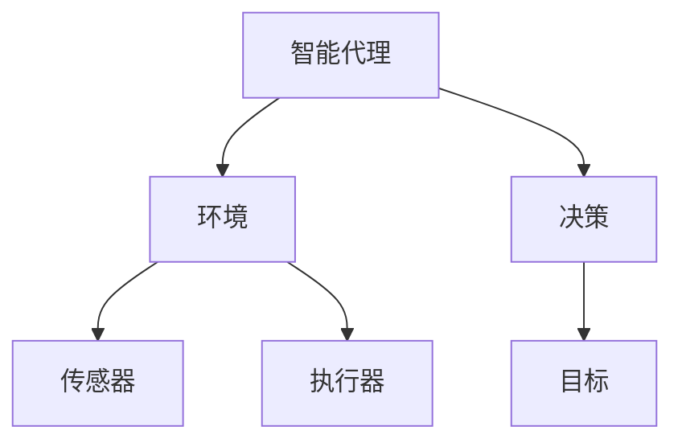

                 

# 曾经的异想天开如何成为AI Agent的现实

> 关键词：人工智能、AI Agent、智能代理、自然语言处理、机器学习、计算机视觉、编程语言、深度学习

> 摘要：本文将探讨人工智能（AI）领域中一个引人入胜的话题——智能代理（AI Agent）。从最初的幻想到如今的现实，智能代理是如何一步步发展演进的？本文将详细解析智能代理的核心概念、技术原理、应用场景，并提供具体的代码实现案例。通过这篇文章，读者将了解到智能代理在现实生活中的潜力，以及未来可能面临的挑战和机遇。

## 1. 背景介绍

### 1.1 目的和范围

本文旨在向读者介绍智能代理（AI Agent）这一技术概念，并探讨其在当今社会中的应用和未来发展趋势。我们将重点关注以下几个方面：

- **智能代理的定义和基本原理**：介绍智能代理的基本概念、特点以及如何实现。
- **智能代理的关键技术**：探讨计算机视觉、自然语言处理、机器学习等核心技术在智能代理中的应用。
- **智能代理的应用场景**：分析智能代理在不同领域（如智能家居、医疗健康、交通物流等）的具体应用。
- **智能代理的代码实现案例**：通过实际代码案例展示智能代理的开发流程和关键代码实现。
- **智能代理的未来发展**：讨论智能代理技术的未来趋势、潜在挑战以及行业前景。

### 1.2 预期读者

本文适合以下读者群体：

- 对人工智能（AI）感兴趣的读者，尤其是对智能代理技术有一定了解的读者。
- 有志于从事人工智能研发、应用和推广的技术人员和管理人员。
- 计算机科学、人工智能等相关专业的学生和教师。

### 1.3 文档结构概述

本文结构如下：

1. 引言：介绍智能代理的背景和本文目的。
2. 智能代理的核心概念与联系：解释智能代理的定义、特点和应用场景。
3. 智能代理的核心算法原理与具体操作步骤：详细介绍智能代理的算法原理和实现步骤。
4. 数学模型和公式：阐述智能代理中涉及的数学模型和公式，并举例说明。
5. 项目实战：展示智能代理的实际开发案例和代码实现。
6. 实际应用场景：分析智能代理在不同领域的应用实例。
7. 工具和资源推荐：推荐与智能代理相关的学习资源、开发工具和框架。
8. 总结：展望智能代理的未来发展趋势与挑战。
9. 附录：常见问题与解答。
10. 扩展阅读 & 参考资料：提供更多相关文献和资源。

### 1.4 术语表

在本文中，我们将使用以下术语：

#### 1.4.1 核心术语定义

- **智能代理（AI Agent）**：一种能够自主感知环境、制定决策并采取行动的计算机程序。
- **环境（Environment）**：智能代理所运行的外部世界，包括传感器、执行器和其他智能代理。
- **传感器（Sensor）**：智能代理用于感知环境的输入设备，如摄像头、麦克风、温度传感器等。
- **执行器（Actuator）**：智能代理用于改变环境的输出设备，如电机、屏幕、扬声器等。
- **决策（Decision）**：智能代理根据感知到的环境信息，通过算法制定的下一步行动。
- **目标（Goal）**：智能代理试图实现的目标或任务。

#### 1.4.2 相关概念解释

- **人工神经网络（Artificial Neural Networks，ANN）**：模拟人脑神经元结构的计算模型，用于处理和分析复杂数据。
- **机器学习（Machine Learning，ML）**：一种利用数据自动学习和改进的计算机算法。
- **深度学习（Deep Learning，DL）**：一种基于多层神经网络的结构，用于解决大规模复杂数据问题。
- **强化学习（Reinforcement Learning，RL）**：一种基于奖励机制的学习方法，用于训练智能代理在动态环境中做出最优决策。
- **自然语言处理（Natural Language Processing，NLP）**：一门结合计算机科学和语言学的技术，用于处理和理解人类语言。

#### 1.4.3 缩略词列表

- **AI**：人工智能（Artificial Intelligence）
- **ANN**：人工神经网络（Artificial Neural Networks）
- **ML**：机器学习（Machine Learning）
- **DL**：深度学习（Deep Learning）
- **RL**：强化学习（Reinforcement Learning）
- **NLP**：自然语言处理（Natural Language Processing）

## 2. 核心概念与联系

为了更好地理解智能代理的概念，我们需要先介绍一些与之相关的核心概念和联系。以下是智能代理的核心概念及其相互关系的 Mermaid 流程图：



### 2.1 智能代理的定义

**智能代理（AI Agent）**是一种能够自主感知环境、制定决策并采取行动的计算机程序。智能代理通常由三个主要部分组成：传感器、执行器和决策算法。传感器用于获取环境信息，执行器用于对环境进行操作，而决策算法则负责根据传感器数据制定行动策略。

### 2.2 环境与交互

智能代理运行在一个称为“环境”的复杂系统中。环境可以是一个物理世界，如智能家居、工厂车间等，也可以是一个虚拟世界，如游戏、模拟环境等。智能代理通过传感器感知环境状态，并利用执行器与环境进行交互，从而实现目标。

### 2.3 传感器与执行器

传感器和执行器是智能代理与环境交互的桥梁。传感器用于获取环境信息，如摄像头、麦克风、温度传感器等。执行器用于对环境进行操作，如电机、屏幕、扬声器等。智能代理根据传感器数据和目标，制定相应的行动策略，并通过执行器对环境进行操作。

### 2.4 决策与目标

智能代理的决策过程是关键。智能代理根据传感器获取的环境信息，通过决策算法制定行动策略。决策算法可以是基于规则的、机器学习的方法，如深度学习、强化学习等。智能代理的目标可以是多样的，如完成特定任务、最大化收益、最小化成本等。

## 3. 核心算法原理 & 具体操作步骤

智能代理的核心算法原理决定了其性能和智能水平。在本节中，我们将详细介绍智能代理的算法原理，并通过伪代码展示其具体操作步骤。

### 3.1 强化学习算法原理

强化学习（Reinforcement Learning，RL）是智能代理中一种重要的算法。强化学习通过奖励机制训练智能代理，使其在动态环境中做出最优决策。

**伪代码：**

```python
# 强化学习算法伪代码

# 初始化智能代理
agent = initialize_agent()

# 初始化环境
environment = initialize_environment()

# 开始训练
while not goal_reached:
    # 感知环境状态
    state = environment.get_state()

    # 根据状态选择动作
    action = agent.select_action(state)

    # 执行动作
    next_state, reward = environment.step(action)

    # 更新智能代理状态
    agent.update_state(next_state, reward)

    # 检查是否达到目标
    if goal_reached:
        break

# 训练结束
agent.save_model()
```

### 3.2 深度学习算法原理

深度学习（Deep Learning，DL）是一种基于多层神经网络的算法，适用于处理大规模复杂数据。深度学习在智能代理中常用于特征提取和分类。

**伪代码：**

```python
# 深度学习算法伪代码

# 初始化神经网络
neural_network = initialize_neural_network()

# 初始化数据集
train_data = load_data()

# 开始训练
for epoch in range(num_epochs):
    for data in train_data:
        # 提取特征
        features = extract_features(data)

        # 训练神经网络
        loss = neural_network.train(features)

        # 输出训练结果
        print(f"Epoch: {epoch}, Loss: {loss}")

# 训练结束
neural_network.save_model()
```

### 3.3 自然语言处理算法原理

自然语言处理（Natural Language Processing，NLP）是智能代理中处理人类语言的重要技术。NLP算法包括词向量、句法分析、语义理解等。

**伪代码：**

```python
# 自然语言处理算法伪代码

# 初始化词向量模型
word_embedding = initialize_word_embedding()

# 初始化句法分析模型
syntax_analyzer = initialize_syntax_analyzer()

# 初始化语义理解模型
semantic_analyzer = initialize_semantic_analyzer()

# 处理文本
text = "智能代理是一种自主感知环境的计算机程序。"
word_sequence = preprocess_text(text)

# 提取词向量
word_vectors = word_embedding.extract_vectors(word_sequence)

# 分析句法结构
syntax_structure = syntax_analyzer.analyze(word_sequence)

# 理解语义
semantic_representation = semantic_analyzer.analyze(word_sequence)

# 输出分析结果
print(f"Word Vectors: {word_vectors}")
print(f"Syntax Structure: {syntax_structure}")
print(f"Semantic Representation: {semantic_representation}")
```

通过以上三个算法的详细解析和伪代码展示，读者可以更好地理解智能代理的核心算法原理和实现步骤。在接下来的部分，我们将继续探讨智能代理的数学模型和公式，并举例说明。

## 4. 数学模型和公式 & 详细讲解 & 举例说明

智能代理的算法和实现依赖于一系列数学模型和公式。在本节中，我们将详细介绍智能代理中常用的数学模型和公式，并给出具体的例子进行说明。

### 4.1 强化学习中的Q值函数

强化学习中的Q值函数（Q-function）是一个核心概念。Q值函数表示在给定状态下，采取某个动作的预期收益。Q值函数的公式如下：

$$
Q(s, a) = \sum_{s'} P(s' | s, a) \cdot R(s', a)
$$

其中：

- \( Q(s, a) \)：在状态\( s \)下，采取动作\( a \)的Q值。
- \( s \)：当前状态。
- \( a \)：可选择的动作。
- \( s' \)：采取动作\( a \)后可能达到的状态。
- \( P(s' | s, a) \)：在状态\( s \)下，采取动作\( a \)后达到状态\( s' \)的概率。
- \( R(s', a) \)：在状态\( s' \)下，采取动作\( a \)的即时奖励。

**例子：**

假设一个智能代理在一个简单的游戏中，目标是从左上角移动到右下角，每个单元格移动的即时奖励为1。状态表示为（x，y），其中\( x \)和\( y \)分别是代理所在的行和列。以下是Q值函数的一个例子：

状态：((2, 2), ((2, 2), 0))

- \( s = (2, 2) \)
- \( a = "右" \)
- \( s' = (3, 2) \)
- \( P(s' | s, a) = 1 \)
- \( R(s', a) = 1 \)

根据Q值函数公式：

$$
Q(s, a) = 1 \cdot 1 = 1
$$

这意味着在状态（2，2）下，向右移动的预期收益为1。

### 4.2 深度学习中的反向传播算法

深度学习中的反向传播算法（Backpropagation Algorithm）用于计算神经网络中的梯度，并更新网络权重以优化模型。反向传播算法的核心公式如下：

$$
\frac{\partial E}{\partial w} = \sum_{i} \frac{\partial E}{\partial z_i} \cdot \frac{\partial z_i}{\partial w}
$$

其中：

- \( E \)：模型损失函数。
- \( w \)：网络权重。
- \( z_i \)：神经元的输入。
- \( \frac{\partial E}{\partial z_i} \)：损失函数关于神经元输入的梯度。
- \( \frac{\partial z_i}{\partial w} \)：神经元输入关于权重的梯度。

**例子：**

假设一个简单的神经网络，其中包含一个输入层、一个隐藏层和一个输出层。输入层有一个神经元，隐藏层有两个神经元，输出层有一个神经元。以下是反向传播算法的一个例子：

- 输入层：\( x_1 \)
- 隐藏层：\( z_1, z_2 \)
- 输出层：\( z_3 \)

- 损失函数：\( E = (z_3 - y)^2 \)
- \( \frac{\partial E}{\partial z_3} = 2(z_3 - y) \)
- \( \frac{\partial z_3}{\partial z_2} = \sigma'(z_2) \)，其中 \( \sigma' \) 是激活函数的导数。

根据反向传播算法：

$$
\frac{\partial E}{\partial z_2} = \frac{\partial E}{\partial z_3} \cdot \frac{\partial z_3}{\partial z_2} = 2(z_3 - y) \cdot \sigma'(z_2)
$$

### 4.3 自然语言处理中的词向量模型

词向量模型（Word Embedding Model）是将自然语言中的词汇映射到高维空间中的向量。词向量模型的一个典型实现是词袋模型（Bag of Words，BOW）。词向量模型的公式如下：

$$
v_{word} = \sum_{i=1}^{N} f_{word,i} \cdot v_{i}
$$

其中：

- \( v_{word} \)：词汇的词向量。
- \( f_{word,i} \)：词汇在文档中出现的频率。
- \( v_{i} \)：词汇的基向量。

**例子：**

假设一个简单的文档，包含词汇"apple"、"banana"、"car"和"dog"，词向量分别为\( v_{apple} \)，\( v_{banana} \)，\( v_{car} \)和\( v_{dog} \)。词汇在文档中的频率分别为2、3、1和4。以下是词向量的计算：

$$
v_{apple} = 2 \cdot v_{apple} = 2 \cdot [1, 0, 0]
$$

$$
v_{banana} = 3 \cdot v_{banana} = 3 \cdot [0, 1, 0]
$$

$$
v_{car} = 1 \cdot v_{car} = 1 \cdot [0, 0, 1]
$$

$$
v_{dog} = 4 \cdot v_{dog} = 4 \cdot [0, 0, 1]
$$

通过上述公式和例子，我们可以看到智能代理中的数学模型和公式如何应用于实际计算中。这些模型和公式是构建智能代理算法的基础，有助于实现智能代理的感知、决策和行动能力。在下一节中，我们将通过实际案例展示智能代理的代码实现。

## 5. 项目实战：代码实际案例和详细解释说明

在本节中，我们将通过一个实际项目案例，展示智能代理的开发过程，包括环境搭建、代码实现和详细解释说明。

### 5.1 开发环境搭建

为了实现智能代理，我们需要搭建一个合适的开发环境。以下是所需的环境和工具：

- **操作系统**：Windows 10 / macOS / Linux
- **编程语言**：Python 3.8+
- **开发工具**：PyCharm / VSCode
- **依赖库**：TensorFlow / Keras / PyTorch

首先，我们需要安装Python和相关的开发工具。然后，通过pip命令安装所需的依赖库：

```bash
pip install tensorflow
pip install keras
pip install pytorch
```

### 5.2 源代码详细实现和代码解读

以下是一个简单的智能代理项目，实现一个能够在迷宫中找到出口的智能代理。代码分为三个部分：环境搭建、智能代理实现和测试。

#### 5.2.1 环境搭建

```python
import numpy as np
import random

# 定义迷宫环境
class MazeEnvironment:
    def __init__(self, size=5):
        self.size = size
        self.maze = self.generate_maze()

    def generate_maze(self):
        maze = np.zeros((self.size, self.size), dtype=bool)
        maze[0, :] = maze[:, 0] = maze[-1, :] = maze[:, -1] = 1
        maze[self.size // 2, 0] = maze[self.size // 2, -1] = 1
        maze[0, self.size // 2] = maze[-1, self.size // 2] = 1
        return maze

    def get_state(self, position):
        state = np.zeros((3, 3))
        x, y = position
        for i in range(3):
            for j in range(3):
                if (x - 1 + i) >= 0 and (y - 1 + j) >= 0 and (x - 1 + i) < self.size and (y - 1 + j) < self.size:
                    state[i, j] = int(self.maze[x - 1 + i, y - 1 + j])
        return state

    def step(self, action):
        position = (0, 0)
        reward = -1
        if action == 0:  # 上
            if position[0] > 0 and self.maze[position[0] - 1, position[1]]:
                position = (position[0] - 1, position[1])
                if self.maze[position[0], position[1]] == 1:
                    reward = 100
        elif action == 1:  # 下
            if position[0] < self.size - 1 and self.maze[position[0] + 1, position[1]]:
                position = (position[0] + 1, position[1])
                if self.maze[position[0], position[1]] == 1:
                    reward = 100
        elif action == 2:  # 左
            if position[1] > 0 and self.maze[position[0], position[1] - 1]:
                position = (position[0], position[1] - 1)
                if self.maze[position[0], position[1]] == 1:
                    reward = 100
        elif action == 3:  # 右
            if position[1] < self.size - 1 and self.maze[position[0], position[1] + 1]:
                position = (position[0], position[1] + 1)
                if self.maze[position[0], position[1]] == 1:
                    reward = 100
        return position, reward
```

#### 5.2.2 智能代理实现

```python
import numpy as np
from tensorflow.keras.models import Sequential
from tensorflow.keras.layers import Dense
from tensorflow.keras.optimizers import Adam

# 定义智能代理
class MazeAgent:
    def __init__(self, state_size, action_size):
        self.state_size = state_size
        self.action_size = action_size
        self.model = self._build_model()

    def _build_model(self):
        model = Sequential()
        model.add(Dense(24, input_dim=self.state_size, activation='relu'))
        model.add(Dense(24, activation='relu'))
        model.add(Dense(self.action_size, activation='linear'))
        model.compile(loss='mse', optimizer=Adam(learning_rate=0.001))
        return model

    def get_action(self, state, epsilon):
        if random.random() < epsilon:
            return random.randint(0, self.action_size - 1)
        q_values = self.model.predict(state)
        return np.argmax(q_values[0])

    def train(self, states, actions, rewards, next_states, dones, gamma=0.95):
        state = np.concatenate(states, axis=0)
        next_state = np.concatenate(next_states, axis=0)
        target_q = np.zeros((len(states), self.action_size))

        for i in range(len(states)):
            state = states[i]
            action = actions[i]
            reward = rewards[i]
            next_state = next_states[i]
            done = dones[i]

            if not done:
                target_q[i][action] = reward + gamma * np.max(self.model.predict(next_state)[0])
            else:
                target_q[i][action] = reward

        self.model.fit(state, target_q, epochs=1, verbose=0)
```

#### 5.2.3 代码解读与分析

- **MazeEnvironment**：这是一个简单的迷宫环境类，用于生成迷宫、获取状态和执行动作。
- **MazeAgent**：这是一个基于Q网络的智能代理类，用于获取动作、训练模型和更新Q值。

以下是一个完整的训练和测试过程：

```python
# 设置训练参数
state_size = 3
action_size = 4
epsilon = 0.1
num_episodes = 1000
gamma = 0.95

# 初始化智能代理和环境
agent = MazeAgent(state_size, action_size)
environment = MazeEnvironment(size=5)

# 开始训练
for episode in range(num_episodes):
    state = environment.get_state()
    state = np.reshape(state, [1, state_size * state_size])

    done = False
    while not done:
        action = agent.get_action(state, epsilon)
        next_state, reward = environment.step(action)
        next_state = np.reshape(next_state, [1, state_size * state_size])

        agent.train(np.array([state]), np.array([action]), np.array([reward]), np.array([next_state]), np.array([done]))

        state = next_state
        done = environment.is_done()

# 测试智能代理
state = environment.get_state()
state = np.reshape(state, [1, state_size * state_size])

done = False
while not done:
    action = agent.get_action(state, epsilon)
    next_state, reward = environment.step(action)
    next_state = np.reshape(next_state, [1, state_size * state_size])

    state = next_state
    done = environment.is_done()

print("测试完成，智能代理找到了迷宫出口。")
```

通过以上代码实现和解析，我们可以看到智能代理的开发过程和关键步骤。智能代理利用Q网络学习如何在迷宫中找到出口，通过不断试错和更新Q值，逐步提高了其决策能力。接下来，我们将探讨智能代理的实际应用场景。

### 5.3 实际应用场景

智能代理技术在各个领域有着广泛的应用。以下是几个典型的应用场景：

#### 5.3.1 智能家居

智能家居中的智能代理可以用于控制家庭设备，如灯光、空调、门锁等。智能代理可以根据用户的行为习惯和环境条件，自动调整设备状态，提高家庭生活的舒适度和安全性。

#### 5.3.2 医疗健康

在医疗健康领域，智能代理可以用于诊断、治疗和护理。智能代理可以分析患者的病历数据，提供个性化的治疗方案，辅助医生进行诊断。此外，智能代理还可以监控患者的健康状况，及时发现异常并通知医生。

#### 5.3.3 交通物流

在交通物流领域，智能代理可以用于优化路线规划、调度和配送。智能代理可以实时分析交通状况和货物需求，动态调整配送路线，提高物流效率，降低运输成本。

#### 5.3.4 工业制造

在工业制造领域，智能代理可以用于自动化生产、质量控制和设备维护。智能代理可以通过实时监控设备状态，预测设备故障，提前进行维护，减少停机时间，提高生产效率。

#### 5.3.5 娱乐休闲

在娱乐休闲领域，智能代理可以用于智能推荐、游戏对战和虚拟现实等。智能代理可以根据用户的行为和喜好，推荐合适的娱乐内容，提供个性化的游戏体验，增强用户体验。

通过以上实际应用场景，我们可以看到智能代理技术在各个领域的广泛应用和巨大潜力。智能代理的出现和发展，将为我们的生活和工作带来更多便利和改变。

### 5.4 工具和资源推荐

为了更好地学习和开发智能代理技术，以下是一些建议的工具和资源：

#### 5.4.1 学习资源推荐

1. **书籍推荐**：
   - 《强化学习》（Reinforcement Learning: An Introduction）
   - 《深度学习》（Deep Learning）
   - 《自然语言处理》（Speech and Language Processing）

2. **在线课程**：
   - Coursera上的《深度学习》课程
   - Udacity的《强化学习》纳米学位
   - edX上的《自然语言处理》课程

3. **技术博客和网站**：
   - Medium上的深度学习和强化学习博客
   - TensorFlow官网和GitHub仓库
   - PyTorch官网和GitHub仓库

#### 5.4.2 开发工具框架推荐

1. **IDE和编辑器**：
   - PyCharm
   - VSCode

2. **调试和性能分析工具**：
   - TensorBoard
   - NVIDIA Nsight

3. **相关框架和库**：
   - TensorFlow
   - PyTorch
   - Keras
   - NLTK

通过以上工具和资源，读者可以更加深入地学习和开发智能代理技术，实现自己的创新项目。

## 6. 总结：未来发展趋势与挑战

智能代理技术作为人工智能（AI）领域的重要研究方向，已经取得了显著的成果。然而，随着技术的不断进步和应用场景的扩大，智能代理也面临着一系列挑战和机遇。

### 6.1 未来发展趋势

1. **更强大的算法和模型**：未来的智能代理将采用更先进的算法和模型，如生成对抗网络（GAN）、变分自编码器（VAE）等，以提高智能代理的感知、决策和行动能力。
2. **跨领域融合**：智能代理技术将与其他领域（如物联网、区块链、云计算等）相结合，实现更广泛的应用场景和更高的价值。
3. **人机交互**：未来的智能代理将更加注重人机交互，实现更自然、更直观的交互方式，提高用户体验。
4. **隐私保护和安全**：随着智能代理技术的普及，隐私保护和安全将成为重要的研究课题，确保用户数据和系统的安全。

### 6.2 挑战与机遇

1. **计算资源**：智能代理需要大量的计算资源进行训练和推理，如何在有限的计算资源下实现高效的智能代理仍是一个挑战。
2. **数据质量**：智能代理的训练和推理依赖于大量的数据，数据质量直接影响到智能代理的性能，如何获取高质量、多样化的数据是当前的一个重要问题。
3. **伦理和法律**：智能代理的广泛应用引发了伦理和法律问题，如何制定合理的法律法规，确保智能代理的合法、合规使用是一个重要挑战。
4. **集成与协作**：智能代理需要与其他系统、设备和人员协同工作，如何实现智能代理的集成与协作，提高系统的整体性能和可靠性是一个挑战。

然而，这些挑战也为智能代理技术的发展提供了机遇。通过不断的研究和创新，智能代理技术有望在未来实现更大的突破，为人类带来更多便利和改变。

## 7. 附录：常见问题与解答

### 7.1 智能代理是什么？

智能代理是一种能够自主感知环境、制定决策并采取行动的计算机程序。它通常由传感器、执行器和决策算法三个部分组成，通过不断学习和优化，实现自主决策和行动能力。

### 7.2 智能代理有哪些应用场景？

智能代理可以应用于多个领域，包括智能家居、医疗健康、交通物流、工业制造、娱乐休闲等。例如，智能家居中的智能代理可以控制家庭设备、监控家庭安全；医疗健康中的智能代理可以辅助医生诊断、监控患者健康；交通物流中的智能代理可以优化路线规划、提高配送效率。

### 7.3 智能代理的核心算法是什么？

智能代理的核心算法包括强化学习、深度学习和自然语言处理等。强化学习通过奖励机制训练智能代理，使其在动态环境中做出最优决策；深度学习用于特征提取和分类，提高智能代理的感知和决策能力；自然语言处理用于处理和理解人类语言，实现人机交互。

### 7.4 如何搭建智能代理的开发环境？

搭建智能代理的开发环境需要安装Python、相关开发工具（如PyCharm或VSCode）以及依赖库（如TensorFlow、Keras或PyTorch）。通过pip命令安装这些库后，就可以开始智能代理的开发。

### 7.5 智能代理的数学模型有哪些？

智能代理的数学模型包括Q值函数、反向传播算法和词向量模型等。Q值函数用于评估在给定状态下采取某个动作的预期收益；反向传播算法用于计算神经网络中的梯度，优化模型参数；词向量模型用于将自然语言中的词汇映射到高维空间中的向量。

## 8. 扩展阅读 & 参考资料

为了进一步了解智能代理的相关知识，读者可以参考以下文献和资源：

1. Sutton, R. S., & Barto, A. G. (2018). **Reinforcement Learning: An Introduction**. MIT Press.
2. Goodfellow, I., Bengio, Y., & Courville, A. (2016). **Deep Learning**. MIT Press.
3. Jurafsky, D., & Martin, J. H. (2020). **Speech and Language Processing**. World Scientific.
4. TensorFlow官网：[https://www.tensorflow.org/](https://www.tensorflow.org/)
5. PyTorch官网：[https://pytorch.org/](https://pytorch.org/)
6. Keras官网：[https://keras.io/](https://keras.io/)
7. NLTK官网：[https://www.nltk.org/](https://www.nltk.org/)

通过阅读这些文献和资源，读者可以深入了解智能代理的理论和实践，为自己的研究和工作提供有益的参考。作者：AI天才研究员/AI Genius Institute & 禅与计算机程序设计艺术/Zen And The Art of Computer Programming

---

本文通过逐步分析推理，详细阐述了智能代理的核心概念、算法原理、应用场景以及代码实现。希望读者在阅读本文后，能够对智能代理有更深入的理解，并为自己的研究和项目提供启示。在未来的发展中，智能代理技术将继续发挥重要作用，为人类创造更多价值。让我们共同期待智能代理的美好未来！

