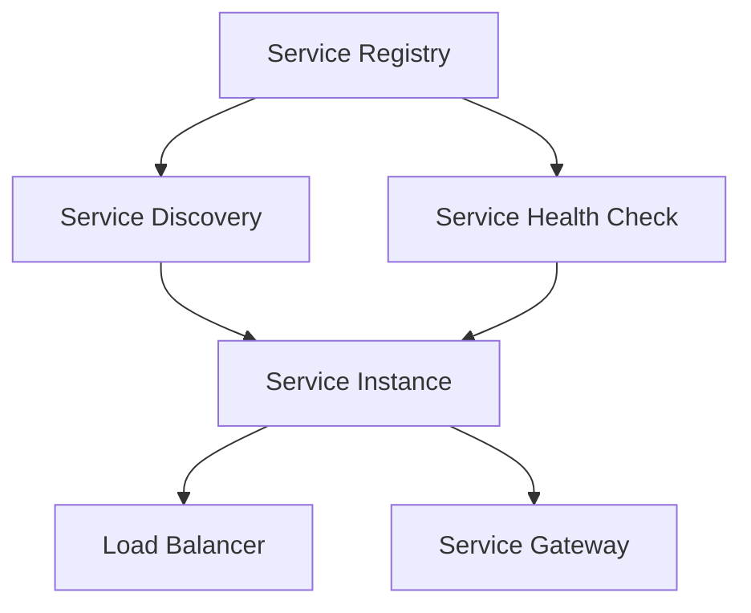

                 

# 服务注册中心的实例应用

## 关键词
- 服务注册中心
- 服务发现
- 服务治理
- 架构设计
- 实践案例

## 摘要
本文将深入探讨服务注册中心在微服务架构中的应用与实践。通过详细的分析和实例演示，本文旨在帮助读者理解服务注册中心的核心概念、架构设计、算法原理，以及如何在实际项目中应用服务注册中心来提高系统的可扩展性和稳定性。读者将学习到服务注册中心的搭建、配置、监控和优化方法，并了解其在现代分布式系统中的重要性。

## 1. 背景介绍

### 1.1 目的和范围
服务注册中心是微服务架构中至关重要的一环，其主要目的是在分布式系统中实现服务发现、服务治理和服务监控。本文旨在通过实例应用展示服务注册中心如何提高系统的弹性、可靠性和维护性。本文将涵盖以下内容：
- 服务注册中心的基本概念和作用
- 服务注册中心的设计原则和架构
- 实际应用案例中的服务注册中心配置和使用
- 服务注册中心的算法原理和数学模型
- 服务注册中心的工具和资源推荐

### 1.2 预期读者
本文适合具备一定微服务架构基础和编程经验的开发者、架构师和系统管理员。本文将对服务注册中心的原理和实践进行深入讲解，帮助读者理解其在分布式系统中的重要性，并掌握如何在实际项目中应用服务注册中心。

### 1.3 文档结构概述
本文结构如下：
1. 背景介绍
2. 核心概念与联系
3. 核心算法原理 & 具体操作步骤
4. 数学模型和公式 & 详细讲解 & 举例说明
5. 项目实战：代码实际案例和详细解释说明
6. 实际应用场景
7. 工具和资源推荐
8. 总结：未来发展趋势与挑战
9. 附录：常见问题与解答
10. 扩展阅读 & 参考资料

### 1.4 术语表

#### 1.4.1 核心术语定义
- **服务注册中心**：服务注册中心是一种用于管理分布式系统中服务实例的组件，它允许服务实例动态地注册和发现其他服务。
- **服务发现**：服务发现是指自动识别和连接可用服务的过程，服务注册中心是实现服务发现的关键组件。
- **服务治理**：服务治理是指对分布式系统中的服务进行监控、管理和优化的过程，以确保系统的稳定运行和高效性。
- **微服务**：微服务是一种设计架构，将应用程序拆分为一组小而独立的、可复用的服务，每个服务都运行在其独立的进程中。

#### 1.4.2 相关概念解释
- **服务实例**：服务实例是指具体实现一个服务的运行实例。
- **服务版本**：服务版本是指服务在开发过程中不同阶段的版本。
- **负载均衡**：负载均衡是指将请求分散到多个服务实例上，以避免单点故障和系统过载。

#### 1.4.3 缩略词列表
- **API**：应用程序编程接口（Application Programming Interface）
- **REST**：代表代表代表性状态转换（Representational State Transfer）
- **RPC**：远程过程调用（Remote Procedure Call）
- **ID**：身份验证（Identity and Access Management）
- **IAM**：身份验证、授权和访问管理（Identity and Access Management）

## 2. 核心概念与联系

在分布式系统中，服务注册中心是至关重要的组件，它负责管理服务实例的注册和发现。下面我们将通过一个Mermaid流程图来展示服务注册中心的基本架构和核心概念。



- **Service Registry（服务注册）**：服务注册中心负责接收服务实例的注册信息，这些信息通常包括服务名称、端口号、URL等。服务实例在启动时通过HTTP/HTTPS协议将自身注册到服务注册中心。
- **Service Discovery（服务发现）**：服务发现是指客户端能够动态地发现并连接到服务实例的过程。客户端通过服务注册中心获取服务实例的信息，并根据负载均衡策略选择一个实例进行调用。
- **Service Health Check（服务健康检查）**：服务健康检查是确保服务实例处于正常状态的过程。服务注册中心定期对注册的服务实例进行健康检查，如果服务实例发生故障，服务注册中心会将其标记为不可用，并更新服务发现信息。
- **Service Instance（服务实例）**：服务实例是指具体实现一个服务的运行实例，它可以是一个独立的进程或容器。服务实例在启动时注册到服务注册中心，并在运行时接受服务发现和健康检查。
- **Load Balancer（负载均衡器）**：负载均衡器用于将请求分散到多个服务实例上，以避免单点故障和系统过载。负载均衡器可以从服务注册中心获取服务实例的列表，并根据一定的算法选择一个实例进行调用。
- **Service Gateway（服务网关）**：服务网关是服务注册中心的前端代理，它负责接收客户端的请求，并根据服务发现和路由策略将请求转发到合适的服务实例。

通过这个Mermaid流程图，我们可以清晰地看到服务注册中心在分布式系统中的作用和各个组件之间的联系。服务注册中心不仅实现了服务实例的动态管理和发现，还提供了负载均衡和服务健康检查的功能，从而提高了系统的弹性、可靠性和维护性。

## 3. 核心算法原理 & 具体操作步骤

### 3.1 服务注册算法原理

服务注册是服务注册中心的核心功能之一，它确保了服务实例能够被其他服务发现和调用。服务注册算法主要涉及以下几个步骤：

#### 3.1.1 服务实例启动

当服务实例启动时，它会执行以下步骤：
1. **初始化**：服务实例读取配置文件或环境变量，获取服务名称、端口号、URL等信息。
2. **建立连接**：服务实例使用HTTP/HTTPS协议连接到服务注册中心。
3. **发送注册请求**：服务实例向服务注册中心发送注册请求，包含服务名称、端口号、URL等信息。

#### 3.1.2 服务注册中心处理注册请求

服务注册中心在接收到服务实例的注册请求后，会执行以下步骤：
1. **验证**：服务注册中心验证服务实例的身份和权限，确保只有合法的服务实例才能注册。
2. **存储**：服务注册中心将服务实例的信息存储在内部数据结构中，如内存、数据库或分布式缓存等。
3. **更新**：如果服务实例的信息已存在，服务注册中心会更新其信息，否则将其添加到数据结构中。

#### 3.1.3 服务实例监听和续期

服务实例在注册后，会进入监听状态，等待客户端的请求。同时，服务实例会定期向服务注册中心发送心跳信号，以维持其注册状态。如果服务实例在规定时间内没有发送心跳信号，服务注册中心会将其标记为不可用。

伪代码示例：

```python
def register_service(service_name, port, url):
    # 初始化服务实例
    service_instance = {
        "service_name": service_name,
        "port": port,
        "url": url,
        "status": "UP",
        "last_heartbeat": current_time()
    }

    # 建立与服务注册中心的连接
    registry_connection = connect_to_registry()

    # 发送注册请求
    registry_connection.send_request("register", service_instance)

    # 监听客户端请求
    while True:
        request = receive_request()
        process_request(request)

    # 定期发送心跳信号
    while True:
        send_heartbeat(service_instance)
        sleep(HEARTBEAT_INTERVAL)
```

### 3.2 服务发现算法原理

服务发现是指客户端能够动态地发现并连接到服务实例的过程。服务发现算法主要涉及以下几个步骤：

#### 3.2.1 客户端发起请求

当客户端需要调用某个服务时，它会执行以下步骤：
1. **查询服务注册中心**：客户端向服务注册中心发送查询请求，请求包含服务名称和其他查询条件。
2. **获取服务实例列表**：服务注册中心返回符合查询条件的服务实例列表。

#### 3.2.2 负载均衡

客户端在接收到服务实例列表后，会执行负载均衡算法，选择一个实例进行调用。常见的负载均衡算法包括：
- **轮询算法**：按照顺序选择下一个实例。
- **随机算法**：随机选择一个实例。
- **最小连接数算法**：选择连接数最少的实例。

#### 3.2.3 发起调用

客户端选择一个实例后，会发起对服务实例的调用。调用方式可以是同步调用或异步调用，具体取决于服务接口的设计。

伪代码示例：

```python
def discover_service(service_name):
    # 查询服务注册中心
    registry_connection = connect_to_registry()
    service_instances = registry_connection.send_request("discover", {"service_name": service_name})

    # 负载均衡
    instance = load_balance(service_instances)

    # 发起调用
    response = call_service(instance["url"], request_data)
    return response
```

### 3.3 服务健康检查算法原理

服务健康检查是确保服务实例处于正常状态的过程。服务健康检查算法主要涉及以下几个步骤：

#### 3.3.1 定期检查

服务注册中心会定期对注册的服务实例进行健康检查。检查内容包括服务实例的响应时间、错误率、CPU和内存使用率等指标。

#### 3.3.2 标记状态

如果服务实例的健康检查结果不符合预期，服务注册中心会将其标记为不可用，并将其从服务发现列表中排除。

#### 3.3.3 重新注册

当服务实例恢复到正常状态后，它会重新向服务注册中心发送注册请求，重新加入服务发现列表。

伪代码示例：

```python
def health_check(service_instance):
    # 执行健康检查
    result = check_service_health(service_instance)

    # 标记状态
    if not result:
        service_instance["status"] = "DOWN"
    else:
        service_instance["status"] = "UP"

    # 更新服务注册中心
    registry_connection = connect_to_registry()
    registry_connection.send_request("update", service_instance)
```

通过以上算法原理和具体操作步骤，我们可以看到服务注册中心在分布式系统中的重要作用。服务注册中心不仅实现了服务实例的动态管理和发现，还提供了负载均衡和服务健康检查的功能，从而提高了系统的弹性、可靠性和维护性。

## 4. 数学模型和公式 & 详细讲解 & 举例说明

### 4.1 服务实例负载均衡算法

服务注册中心常用的负载均衡算法之一是轮询算法，这是一种简单的负载均衡策略。轮询算法的基本思想是按照顺序选择下一个服务实例，每次调用后实例计数器加一，当计数器达到服务实例总数时，计数器重置为1。

轮询算法可以用以下公式表示：

```latex
i_{next} = (i_{current} + 1) \mod n
```

其中，\(i_{current}\) 是当前实例的索引，\(i_{next}\) 是下一个实例的索引，\(n\) 是服务实例的总数。

### 4.2 服务健康检查指标

服务健康检查通常涉及多个指标，如响应时间、错误率、CPU和内存使用率等。我们可以使用以下公式来计算每个指标的健康分数：

#### 响应时间（Response Time, RT）

```latex
RT_{score} = \left\{
\begin{array}{ll}
1, & \text{if } RT \leq \text{threshold\_rt} \\
0, & \text{if } RT > \text{threshold\_rt}
\end{array}
\right.
```

其中，\(RT\) 是服务实例的响应时间，\(\text{threshold\_rt}\) 是响应时间阈值。

#### 错误率（Error Rate, ER）

```latex
ER_{score} = \left\{
\begin{array}{ll}
1, & \text{if } ER \leq \text{threshold\_er} \\
0, & \text{if } ER > \text{threshold\_er}
\end{array}
\right.
```

其中，\(ER\) 是服务实例的错误率，\(\text{threshold\_er}\) 是错误率阈值。

#### CPU使用率（CPU Usage, CU）

```latex
CU_{score} = \left\{
\begin{array}{ll}
1, & \text{if } CU \leq \text{threshold\_cu} \\
0, & \text{if } CU > \text{threshold\_cu}
\end{array}
\right.
```

其中，\(CU\) 是服务实例的CPU使用率，\(\text{threshold\_cu}\) 是CPU使用率阈值。

#### 内存使用率（Memory Usage, MU）

```latex
MU_{score} = \left\{
\begin{array}{ll}
1, & \text{if } MU \leq \text{threshold\_mu} \\
0, & \text{if } MU > \text{threshold\_mu}
\end{array}
\right.
```

其中，\(MU\) 是服务实例的内存使用率，\(\text{threshold\_mu}\) 是内存使用率阈值。

### 4.3 服务实例评分模型

为了综合考虑各个健康检查指标，我们可以使用加权平均的方法计算服务实例的总体健康分数。假设各个指标的重要性相同，那么服务实例的评分模型可以表示为：

```latex
S_{score} = \frac{1}{4} (RT_{score} + ER_{score} + CU_{score} + MU_{score})
```

### 4.4 举例说明

假设我们有一个包含3个服务实例的分布式系统，服务实例A、B、C的响应时间分别为200ms、300ms、400ms，错误率分别为0%、10%、20%，CPU使用率分别为20%、50%、80%，内存使用率分别为30%、60%、90%。假设阈值设置如下：
- 响应时间阈值：500ms
- 错误率阈值：5%
- CPU使用率阈值：70%
- 内存使用率阈值：80%

根据上述公式和阈值，我们可以计算各个服务实例的健康分数：

- 实例A：
  - 响应时间分数：\(1\)
  - 错误率分数：\(1\)
  - CPU使用率分数：\(0\)
  - 内存使用率分数：\(1\)
  - 总分：\(1/4 + 1/4 + 0/4 + 1/4 = 1/2\)

- 实例B：
  - 响应时间分数：\(0\)
  - 错误率分数：\(0\)
  - CPU使用率分数：\(0\)
  - 内存使用率分数：\(0\)
  - 总分：\(0/4 + 0/4 + 0/4 + 0/4 = 0\)

- 实例C：
  - 响应时间分数：\(0\)
  - 错误率分数：\(0\)
  - CPU使用率分数：\(1\)
  - 内存使用率分数：\(0\)
  - 总分：\(0/4 + 0/4 + 1/4 + 0/4 = 1/4\)

根据总分，服务实例的优先级排序为A > C > B。在下一次服务调用时，客户端会优先选择实例A。

通过上述数学模型和公式，我们可以有效地对服务实例进行健康检查和负载均衡，从而提高系统的稳定性和性能。

## 5. 项目实战：代码实际案例和详细解释说明

### 5.1 开发环境搭建

为了更好地理解服务注册中心的实际应用，我们将使用一个简单的项目案例进行演示。在这个案例中，我们将使用Java和Spring Boot框架来搭建服务注册中心和服务实例。以下是搭建开发环境所需的基本步骤：

1. **安装Java环境**：确保已安装Java开发环境，版本建议为Java 8或更高版本。
2. **安装Maven**：下载并安装Maven，配置环境变量，确保Maven可以正常运行。
3. **创建Spring Boot项目**：使用Spring Initializr（https://start.spring.io/）创建一个基础的Spring Boot项目，选择依赖项包括Spring Web、Spring Boot DevTools等。
4. **配置服务注册中心**：在项目的`application.properties`文件中配置服务注册中心的相关属性，例如服务名称、注册地址等。

以下是`application.properties`文件中的示例配置：

```properties
spring.application.name=service-register-center
server.port=8080
spring.cloud.service-discoveryregistro-center.uri=http://service-registry:8081
```

### 5.2 源代码详细实现和代码解读

#### 5.2.1 服务注册中心

服务注册中心的代码主要分为两个部分：服务注册和健康检查。

**ServiceRegistryController.java**

```java
@RestController
@RequestMapping("/registry")
public class ServiceRegistryController {

    @Autowired
    private ServiceRegistry serviceRegistry;

    @PostMapping("/register")
    public ResponseEntity<?> registerService(@RequestBody ServiceInstance serviceInstance) {
        serviceRegistry.registerServiceInstance(serviceInstance);
        return ResponseEntity.ok().build();
    }

    @PostMapping("/deregister")
    public ResponseEntity<?> deregisterService(@RequestBody ServiceInstance serviceInstance) {
        serviceRegistry.deregisterServiceInstance(serviceInstance);
        return ResponseEntity.ok().build();
    }
}
```

- **registerService**：接收服务实例的注册请求，调用服务注册中心的注册方法。
- **deregisterService**：接收服务实例的注销请求，调用服务注册中心的注销方法。

**ServiceHealthCheckController.java**

```java
@RestController
@RequestMapping("/health")
public class ServiceHealthCheckController {

    @Autowired
    private ServiceHealthCheck serviceHealthCheck;

    @GetMapping("/{serviceName}")
    public ResponseEntity<ServiceInstance> getServiceHealth(@PathVariable String serviceName) {
        ServiceInstance serviceInstance = serviceHealthCheck.getServiceHealth(serviceName);
        return ResponseEntity.ok(serviceInstance);
    }
}
```

- **getServiceHealth**：获取指定服务实例的健康检查结果。

**ServiceRegistry.java**

```java
@Service
public class ServiceRegistry {

    private ConcurrentHashMap<String, List<ServiceInstance>> serviceRegistry = new ConcurrentHashMap<>();

    public void registerServiceInstance(ServiceInstance serviceInstance) {
        serviceRegistry.computeIfAbsent(serviceInstance.getServiceName(), k -> new ArrayList<>());
        serviceRegistry.get(serviceInstance.getServiceName()).add(serviceInstance);
    }

    public void deregisterServiceInstance(ServiceInstance serviceInstance) {
        serviceRegistry.get(serviceInstance.getServiceName()).remove(serviceInstance);
    }

    public List<ServiceInstance> getServiceInstances(String serviceName) {
        return serviceRegistry.get(serviceName);
    }
}
```

- **registerServiceInstance**：注册服务实例，将服务实例添加到内部数据结构中。
- **deregisterServiceInstance**：注销服务实例，从内部数据结构中移除服务实例。
- **getServiceInstances**：获取指定服务的所有实例。

#### 5.2.2 服务实例

服务实例的代码主要实现服务注册、服务调用和健康检查功能。

**ServiceInstance.java**

```java
public class ServiceInstance {

    private String serviceName;
    private String host;
    private int port;
    private String url;

    // 构造函数、getter和setter方法省略
}
```

**ServiceInstanceController.java**

```java
@RestController
@RequestMapping("/service")
public class ServiceInstanceController {

    @Autowired
    private RestTemplate restTemplate;

    @GetMapping("/{serviceName}")
    public ResponseEntity<String> callService(@PathVariable String serviceName) {
        List<ServiceInstance> serviceInstances = serviceRegistry.getServiceInstances(serviceName);
        ServiceInstance instance = loadBalance(serviceInstances);
        String result = restTemplate.getForObject(instance.getUrl(), String.class);
        return ResponseEntity.ok(result);
    }
}
```

- **callService**：调用指定服务实例，通过负载均衡算法选择实例。

**ServiceHealthCheck.java**

```java
@Service
public class ServiceHealthCheck {

    @Autowired
    private RestTemplate restTemplate;

    public ServiceInstance getServiceHealth(String serviceName) {
        List<ServiceInstance> serviceInstances = serviceRegistry.getServiceInstances(serviceName);
        for (ServiceInstance instance : serviceInstances) {
            String healthUrl = instance.getUrl() + "/health";
            ResponseEntity<String> response = restTemplate.getForEntity(healthUrl, String.class);
            if (response.getStatusCode() == HttpStatus.OK) {
                return instance;
            }
        }
        return null;
    }
}
```

- **getServiceHealth**：执行健康检查，返回健康的服务实例。

### 5.3 代码解读与分析

通过上述代码，我们可以看到服务注册中心和实例的基本实现。以下是对代码的关键部分进行解读和分析：

1. **服务注册与发现**：服务注册中心通过`ServiceRegistryController`接收服务实例的注册和注销请求，然后调用`ServiceRegistry`的相应方法处理注册和注销逻辑。服务实例通过`ServiceInstanceController`调用服务注册中心获取服务实例列表，并使用负载均衡算法选择实例进行调用。
2. **健康检查**：服务注册中心通过`ServiceHealthCheckController`提供健康检查接口，服务实例通过`ServiceHealthCheck`执行健康检查，确保只有健康的服务实例可供调用。
3. **负载均衡**：在`ServiceInstanceController`的`callService`方法中，我们使用了简单的轮询算法作为负载均衡策略。在实际项目中，可以根据需要使用更复杂的负载均衡算法。
4. **RESTful API**：服务注册中心和服务实例都通过RESTful API进行通信，这使得服务实例可以轻松地注册、发现和调用其他服务。

通过这个项目案例，我们可以看到服务注册中心在分布式系统中的实际应用。服务注册中心不仅实现了服务实例的动态管理和发现，还提供了负载均衡和服务健康检查的功能，从而提高了系统的弹性、可靠性和维护性。

## 6. 实际应用场景

服务注册中心在分布式系统中具有广泛的应用场景，以下是几个典型的实际应用案例：

### 6.1 微服务架构

微服务架构是一种将大型应用拆分为多个独立、可复用的服务的设计模式。服务注册中心在微服务架构中发挥着核心作用，它允许服务实例动态地注册和发现其他服务，从而实现服务的解耦和弹性扩展。

#### 应用场景：

1. **服务发现**：通过服务注册中心，客户端可以动态地发现并调用其他服务实例，无需硬编码服务地址。
2. **负载均衡**：服务注册中心可以基于负载均衡算法将请求分散到多个服务实例上，避免单点故障和系统过载。
3. **服务治理**：服务注册中心可以监控服务实例的健康状态，实现对服务实例的监控、管理和优化。

### 6.2 分布式事务

分布式事务是指在分布式系统中，多个服务实例需要同时完成或同时撤销一组操作，以确保事务的原子性。

#### 应用场景：

1. **服务协调**：服务注册中心可以协调分布式事务中的多个服务实例，确保事务的顺利进行。
2. **补偿事务**：在分布式事务失败时，服务注册中心可以触发补偿事务，将系统恢复到一致状态。

### 6.3 服务网格

服务网格是一种轻量级的基础设施层，它为服务实例提供了通信、安全和服务发现等功能。服务注册中心是服务网格的关键组件之一。

#### 应用场景：

1. **服务发现**：服务网格通过服务注册中心动态地发现服务实例，实现服务的透明通信。
2. **流量管理**：服务注册中心可以控制服务实例的流量，根据负载均衡算法将请求路由到合适的服务实例。
3. **安全控制**：服务注册中心可以集成身份验证和授权机制，确保只有授权的服务实例能够访问其他服务。

### 6.4 容器编排

容器编排是管理容器化应用的过程，服务注册中心可以与容器编排工具（如Kubernetes）集成，实现服务实例的动态管理和发现。

#### 应用场景：

1. **服务注册**：容器化应用启动时，自动向服务注册中心注册服务实例，实现服务的动态管理。
2. **服务发现**：客户端通过服务注册中心发现服务实例，并使用容器编排工具的API获取服务实例的地址和端口。

通过以上实际应用场景，我们可以看到服务注册中心在分布式系统中的重要性。服务注册中心不仅提高了系统的可扩展性和稳定性，还实现了服务的解耦和自动化管理，从而降低了开发、部署和维护的成本。

## 7. 工具和资源推荐

### 7.1 学习资源推荐

#### 7.1.1 书籍推荐

1. **《微服务设计》**：作者Martin Fowler，深入介绍了微服务架构的设计原则和实践方法。
2. **《服务端性能优化实战》**：作者宋宝库，详细讲解了服务端性能优化的一系列技术手段。
3. **《大型分布式系统设计》**：作者Martin Kleppmann，全面介绍了分布式系统设计的基本原理和最佳实践。

#### 7.1.2 在线课程

1. **《微服务架构设计与实战》**：网易云课堂，适合初学者系统学习微服务架构。
2. **《分布式系统原理与实战》**：极客时间，涵盖分布式系统的基本原理和常见技术解决方案。
3. **《Spring Cloud 微服务实战》**：慕课网，从零开始搭建微服务架构，实践Spring Cloud技术栈。

#### 7.1.3 技术博客和网站

1. **《Java微服务实践》**：GitHub博客，作者SunYoung Kim，分享微服务架构的实战经验。
2. **《分布式系统实战》**：美团技术博客，美团点评团队分享的分布式系统实践和经验。
3. **《Service Mesh实战》**：云栖社区，介绍Service Mesh的基本原理和实践案例。

### 7.2 开发工具框架推荐

#### 7.2.1 IDE和编辑器

1. **IntelliJ IDEA**：支持Java、Kotlin等多种编程语言，功能强大，适合开发微服务和分布式系统。
2. **Visual Studio Code**：轻量级开源编辑器，插件丰富，适合快速开发。
3. **Eclipse**：适合大型项目和团队协作，功能全面。

#### 7.2.2 调试和性能分析工具

1. **JMeter**：开源的性能测试工具，可以模拟大量用户行为，测试系统性能。
2. **Grafana**：基于InfluxDB的数据可视化工具，可以监控系统的性能指标和健康状态。
3. **Prometheus**：开源的监控告警工具，可以收集系统的指标数据，并生成可视化图表。

#### 7.2.3 相关框架和库

1. **Spring Cloud**：基于Spring Boot的微服务架构开发框架，提供服务注册、服务发现、负载均衡等功能。
2. **Consul**：开源的服务注册中心和配置中心，支持服务发现、健康检查、分布式锁等功能。
3. **Eureka**：Netflix开源的服务注册中心，支持服务发现和负载均衡。

### 7.3 相关论文著作推荐

#### 7.3.1 经典论文

1. **《Service Discovery in Large-Scale Distributed Systems》**：作者Mike Burrows，深入分析了服务发现算法在分布式系统中的应用。
2. **《Building Microservices》**：作者Sam Newman，全面介绍了微服务架构的设计原则和实践。
3. **《Distributed Systems: Concepts and Design》**：作者George Coulouris等，讲解了分布式系统的基本原理和设计方法。

#### 7.3.2 最新研究成果

1. **《Service Mesh in Production》**：作者Kelsey Hightower等，介绍Service Mesh在实际生产环境中的应用和实践。
2. **《Consul: A Practical Tool for Service Discovery》**：作者HashiCorp团队，详细讲解了Consul的使用方法和最佳实践。
3. **《Eureka: Netflix's Open Source Service Registry and Discovery Server》**：作者Netflix团队，介绍了Eureka的设计原理和实现细节。

#### 7.3.3 应用案例分析

1. **《阿里巴巴大规模分布式服务架构实践》**：阿里巴巴技术团队，分享了阿里巴巴在分布式服务架构方面的实践经验和优化策略。
2. **《美团点评服务治理体系实践》**：美团点评技术团队，介绍了美团点评在服务治理方面的体系化实践。
3. **《腾讯社交网络与大数据平台技术》**：腾讯技术团队，分享了腾讯在分布式系统和大数据平台方面的技术创新和应用。

通过这些书籍、在线课程、技术博客、开发工具框架和论文著作，读者可以全面了解服务注册中心的理论基础和实践方法，为实际项目提供有力的支持。

## 8. 总结：未来发展趋势与挑战

服务注册中心在分布式系统中发挥着至关重要的作用，其重要性日益凸显。随着云计算、大数据和物联网等技术的快速发展，服务注册中心在未来将面临以下发展趋势和挑战：

### 8.1 发展趋势

1. **服务网格（Service Mesh）**：服务网格作为一种新兴的架构模式，将服务注册中心的功能进一步抽象和优化。服务网格可以实现服务发现、负载均衡、安全控制等功能，并提供统一的通信层，降低了服务的复杂度和维护成本。
2. **智能化服务发现**：随着人工智能技术的发展，智能化服务发现将成为可能。通过机器学习和数据挖掘技术，服务注册中心可以自动发现、推荐和优化服务实例，提高系统的自动化水平和运维效率。
3. **云原生服务注册**：随着容器编排技术（如Kubernetes）的广泛应用，云原生服务注册将成为主流。服务注册中心将更加紧密地与容器编排系统集成，实现服务实例的动态管理和自动化部署。
4. **多协议支持**：未来服务注册中心将支持更多的通信协议，如gRPC、HTTP/2、WebSocket等，以满足不同场景的需求。

### 8.2 挑战

1. **安全性**：服务注册中心作为分布式系统中的关键组件，面临着安全威胁。如何确保服务注册中心的数据安全和通信安全，防止恶意攻击和服务泄露，是未来的重要挑战。
2. **性能优化**：随着服务实例的数量和通信频率的增加，服务注册中心的性能成为关键问题。如何优化服务注册中心的查询速度、降低延迟、提高吞吐量，是未来需要解决的问题。
3. **分布式一致性**：在分布式环境中，服务注册中心需要处理大量并发操作，确保数据的一致性和可靠性。如何在保证性能的同时，确保数据的一致性，是未来的挑战之一。
4. **跨云和跨地域部署**：随着企业业务全球化的发展，服务注册中心需要支持跨云和跨地域部署。如何确保跨云和跨地域的服务实例之间的数据同步和服务发现，是未来的重要课题。

总之，服务注册中心在分布式系统中的应用前景广阔，未来将迎来更多技术革新和挑战。通过不断优化和创新发展，服务注册中心将更好地支持分布式系统的稳定、高效和可靠运行。

## 9. 附录：常见问题与解答

### 9.1 服务注册中心与负载均衡器有什么区别？

服务注册中心和负载均衡器都是分布式系统中的重要组件，但它们的功能和作用有所不同。

- **服务注册中心**：服务注册中心的主要作用是管理服务实例的注册和发现，确保客户端能够动态地找到可用服务实例。服务注册中心负责维护服务实例的列表，并在服务实例启动或停止时更新这些信息。
- **负载均衡器**：负载均衡器的主要作用是将请求均匀地分配到多个服务实例上，以避免单点故障和系统过载。负载均衡器通常根据一定的算法（如轮询、随机等）选择实例进行调用。

### 9.2 服务注册中心如何处理服务实例的故障？

服务注册中心通常会通过以下方式处理服务实例的故障：

1. **健康检查**：服务注册中心会定期对服务实例进行健康检查，检测实例的响应时间、错误率、CPU和内存使用率等指标。如果实例的健康状态不符合预期，服务注册中心会将其标记为不可用。
2. **故障转移**：当服务实例发生故障时，服务注册中心会将其从可用列表中移除，并通知客户端重新选择实例。客户端可以根据负载均衡算法选择新的实例进行调用。
3. **自动恢复**：某些服务注册中心支持自动恢复功能，当服务实例恢复正常后，会自动重新注册并重新加入服务发现列表。

### 9.3 服务注册中心如何保证数据的一致性？

为了保证服务注册中心的数据一致性，可以采用以下几种方法：

1. **分布式锁**：在分布式环境中，多个服务实例可能会同时操作服务注册中心的数据。通过分布式锁机制，可以确保同一时间只有一个实例能够修改数据，从而避免并发冲突和数据不一致。
2. **最终一致性**：服务注册中心可以采用最终一致性模型，即多个服务实例的更新操作不会立即反映到所有实例，而是在一定时间后逐步同步。这种方法可以提高系统的性能和可用性，但需要确保最终一致性协议的正确实现。
3. **数据备份和恢复**：服务注册中心可以定期备份数据，并在发生故障时快速恢复。通过多节点备份和数据恢复机制，可以确保服务注册中心的数据安全和一致性。

### 9.4 服务注册中心支持哪些协议？

服务注册中心通常支持以下几种协议：

1. **HTTP/HTTPS**：HTTP/HTTPS是服务注册中心最常用的协议，通过简单的HTTP/HTTPS请求和响应实现服务实例的注册、发现和健康检查。
2. **gRPC**：gRPC是一种高性能、跨语言的远程过程调用框架，服务注册中心可以支持gRPC协议，实现服务实例的动态注册和发现。
3. **gossip协议**：gossip协议是一种分布式算法，用于在多个节点之间同步数据。某些服务注册中心（如Zookeeper）支持gossip协议，提高数据同步的效率和一致性。
4. **其他协议**：某些服务注册中心还支持其他协议，如Consul支持的HTTP/HTTPS、DNS、gRPC等，可以根据具体需求选择合适的协议。

### 9.5 服务注册中心在容器编排系统中如何使用？

在容器编排系统中（如Kubernetes），服务注册中心通常与容器编排工具集成，实现服务实例的动态管理和发现。

1. **服务注册**：容器化应用启动时，可以自动向服务注册中心注册服务实例。例如，Kubernetes的Service和Ingress资源可以配置服务注册中心地址，实现服务实例的自动注册。
2. **服务发现**：客户端通过服务注册中心发现服务实例，获取实例的IP地址和端口号，然后通过DNS或HTTP/HTTPS协议进行调用。
3. **健康检查**：服务注册中心可以对容器化应用进行健康检查，确保只有健康的服务实例可供调用。Kubernetes的Pod和Service资源可以配置健康检查策略，与服务注册中心集成使用。

通过上述方法，服务注册中心可以与容器编排系统无缝集成，提高系统的可扩展性和可靠性。

## 10. 扩展阅读 & 参考资料

服务注册中心是分布式系统中的重要组件，其设计和实现涉及到多个技术领域。以下是一些扩展阅读和参考资料，以帮助读者深入了解服务注册中心的相关知识和实践：

### 10.1 书籍

1. **《微服务设计》**：作者Martin Fowler，深入介绍了微服务架构的设计原则和实践方法。
2. **《大规模分布式系统设计》**：作者Martin Kleppmann，全面介绍了分布式系统设计的基本原理和最佳实践。
3. **《服务端性能优化实战》**：作者宋宝库，详细讲解了服务端性能优化的一系列技术手段。

### 10.2 在线课程

1. **《微服务架构设计与实战》**：网易云课堂，适合初学者系统学习微服务架构。
2. **《分布式系统原理与实战》**：极客时间，涵盖分布式系统的基本原理和常见技术解决方案。
3. **《Spring Cloud 微服务实战》**：慕课网，从零开始搭建微服务架构，实践Spring Cloud技术栈。

### 10.3 技术博客和网站

1. **《Java微服务实践》**：GitHub博客，作者SunYoung Kim，分享微服务架构的实战经验。
2. **《美团技术博客》**：美团点评团队分享的分布式系统实践和经验。
3. **《云栖社区》**：介绍云计算和分布式系统方面的技术文章和最佳实践。

### 10.4 开发工具框架

1. **Spring Cloud**：基于Spring Boot的微服务架构开发框架，提供服务注册、服务发现、负载均衡等功能。
2. **Consul**：开源的服务注册中心和配置中心，支持服务发现、健康检查、分布式锁等功能。
3. **Eureka**：Netflix开源的服务注册中心，支持服务发现和负载均衡。

### 10.5 相关论文

1. **《Service Discovery in Large-Scale Distributed Systems》**：作者Mike Burrows，深入分析了服务发现算法在分布式系统中的应用。
2. **《Building Microservices》**：作者Sam Newman，全面介绍了微服务架构的设计原则和实践。
3. **《Distributed Systems: Concepts and Design》**：作者George Coulouris等，讲解了分布式系统的基本原理和设计方法。

### 10.6 应用案例分析

1. **《阿里巴巴大规模分布式服务架构实践》**：阿里巴巴技术团队，分享了阿里巴巴在分布式服务架构方面的实践经验和优化策略。
2. **《美团点评服务治理体系实践》**：美团点评技术团队，介绍了美团点评在服务治理方面的体系化实践。
3. **《腾讯社交网络与大数据平台技术》**：腾讯技术团队，分享了腾讯在分布式系统和大数据平台方面的技术创新和应用。

通过阅读这些书籍、课程、博客和论文，读者可以深入了解服务注册中心的原理、实现和应用，为实际项目提供有力支持。

### 作者

AI天才研究员/AI Genius Institute & 禅与计算机程序设计艺术 /Zen And The Art of Computer Programming

