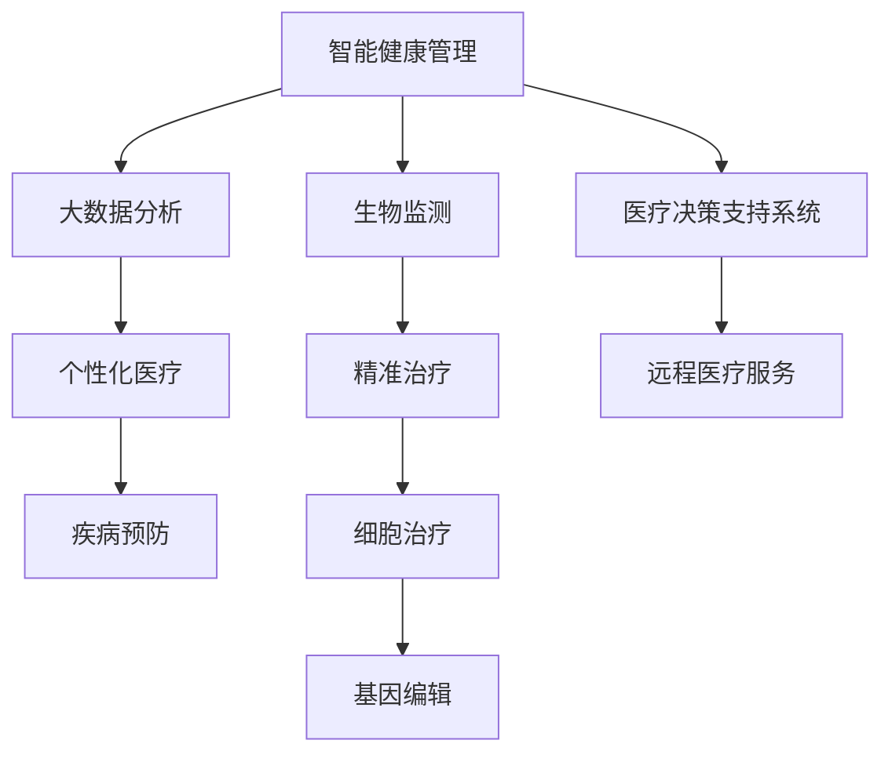

                 

# 未来医疗：2050年的健康管理与疾病治疗

> 关键词：未来医疗、健康管理、疾病治疗、人工智能、生物技术、大数据、智能设备

> 摘要：本文将探讨2050年未来医疗领域的创新技术，包括健康管理的智能化、疾病治疗的精准化和个性化。通过分析这些核心技术的原理和应用，本文旨在为读者呈现一幅充满希望和挑战的未来医疗图景，并讨论其中所面临的关键挑战和发展趋势。

## 1. 背景介绍

### 1.1 目的和范围

本文旨在通过分析和探讨未来医疗领域的技术发展趋势，为读者展示一个充满希望的未来医疗场景。我们将重点关注以下几个核心领域：

1. **健康管理的智能化**：通过人工智能和大数据分析，实现健康状态的实时监测和个性化健康指导。
2. **疾病治疗的精准化**：利用基因编辑、细胞治疗等生物技术，实现针对个体的精准治疗。
3. **个性化医疗**：根据患者的具体病情和基因特征，制定个性化的治疗方案。

### 1.2 预期读者

本文面向对医疗技术感兴趣的读者，包括医疗专业人士、计算机科学家、生物技术研究者以及对未来医疗领域充满好奇的普通大众。

### 1.3 文档结构概述

本文结构如下：

1. **背景介绍**：介绍未来医疗的目的、范围和预期读者。
2. **核心概念与联系**：详细讨论未来医疗的核心技术和概念，包括智能健康管理、精准治疗和个性化医疗。
3. **核心算法原理 & 具体操作步骤**：阐述核心算法的工作原理和具体实施步骤。
4. **数学模型和公式 & 详细讲解 & 举例说明**：介绍相关的数学模型和公式，并通过实例进行说明。
5. **项目实战：代码实际案例和详细解释说明**：提供具体的代码实现案例，并详细解读。
6. **实际应用场景**：分析未来医疗技术的实际应用场景。
7. **工具和资源推荐**：推荐相关的学习资源和开发工具。
8. **总结：未来发展趋势与挑战**：总结未来医疗的发展趋势和面临的挑战。
9. **附录：常见问题与解答**：提供常见问题的解答。
10. **扩展阅读 & 参考资料**：推荐相关文献和资料。

### 1.4 术语表

#### 1.4.1 核心术语定义

- **人工智能（AI）**：模拟人类智能行为的计算机系统。
- **大数据（Big Data）**：大量、复杂、高速生成的数据。
- **基因编辑**：通过修改DNA序列来治疗遗传疾病。
- **细胞治疗**：利用患者自身或捐赠者的细胞来治疗疾病。

#### 1.4.2 相关概念解释

- **智能健康管理**：利用AI和大数据技术，对个人的健康状态进行实时监测和个性化指导。
- **精准医疗**：根据患者的个体差异，制定个性化的治疗方案。
- **个性化医疗**：根据患者的具体病情和基因特征，制定个性化的治疗方案。

#### 1.4.3 缩略词列表

- **AI**：人工智能
- **BI**：大数据
- **CRISPR**：成簇规律间隔短回文重复序列
- **NGS**：下一代测序技术
- **HIM**：健康管理

## 2. 核心概念与联系

在未来医疗中，有几个核心概念和联系至关重要。下面我们将通过一个Mermaid流程图来展示这些核心概念和它们之间的联系。



### 2.1 智能健康管理

智能健康管理是指利用人工智能和大数据技术，对个人的健康状态进行实时监测和个性化指导。其核心在于通过数据收集和分析，实现健康风险的早期识别和干预。

#### 智能健康管理的原理

智能健康管理的原理主要包括以下几个步骤：

1. **数据收集**：通过可穿戴设备、智能手机应用等收集生理参数，如心率、血压、血糖等。
2. **数据处理**：使用大数据技术对收集到的数据进行清洗、存储和分析。
3. **模型训练**：利用机器学习算法，建立健康风险评估模型。
4. **个性化指导**：根据评估结果，为用户提供个性化的健康建议和干预措施。

#### 智能健康管理的技术架构

智能健康管理的技术架构通常包括以下几个部分：

1. **数据采集模块**：负责收集用户的生理参数。
2. **数据处理模块**：包括数据清洗、存储和分析等功能。
3. **机器学习模块**：负责训练和优化健康风险评估模型。
4. **用户接口模块**：提供用户与系统的交互界面。

### 2.2 精准治疗

精准治疗是根据患者的个体差异，制定个性化的治疗方案。其核心在于通过基因检测、生物标记物分析等手段，识别患者的特定病理特征，从而实现精准治疗。

#### 精准治疗的原理

精准治疗的原理主要包括以下几个步骤：

1. **基因检测**：通过基因测序技术，获取患者的基因组信息。
2. **生物标记物分析**：检测患者体内的生物标记物，如蛋白质、RNA等。
3. **病理特征识别**：利用生物信息学方法，分析基因和生物标记物的特征，识别患者的特定病理特征。
4. **个性化治疗方案制定**：根据病理特征，制定个性化的治疗方案。

#### 精准治疗的技术架构

精准治疗的技术架构通常包括以下几个部分：

1. **基因测序模块**：负责进行基因测序。
2. **生物标记物检测模块**：负责检测患者体内的生物标记物。
3. **生物信息学分析模块**：负责分析基因和生物标记物的特征。
4. **个性化治疗方案制定模块**：根据病理特征，制定个性化的治疗方案。

### 2.3 个性化医疗

个性化医疗是根据患者的具体病情和基因特征，制定个性化的治疗方案。其核心在于通过全面的疾病评估，为患者提供最合适的治疗方式。

#### 个性化医疗的原理

个性化医疗的原理主要包括以下几个步骤：

1. **全面疾病评估**：包括病史、家族病史、生理参数等。
2. **基因检测**：获取患者的基因组信息。
3. **个体差异分析**：分析患者的基因特征，识别个体差异。
4. **个性化治疗方案制定**：根据疾病评估和个体差异，制定个性化的治疗方案。

#### 个性化医疗的技术架构

个性化医疗的技术架构通常包括以下几个部分：

1. **病史采集模块**：负责采集患者的病史和家族病史。
2. **基因测序模块**：负责进行基因测序。
3. **个体差异分析模块**：负责分析患者的基因特征。
4. **个性化治疗方案制定模块**：根据疾病评估和个体差异，制定个性化的治疗方案。

## 3. 核心算法原理 & 具体操作步骤

在未来的医疗领域中，核心算法的设计与实施至关重要，这些算法不仅能提升诊断的准确性，还能优化治疗过程。以下将介绍几项关键算法的原理及其实施步骤。

### 3.1 智能健康管理算法

#### 算法原理

智能健康管理算法基于机器学习和数据挖掘技术，通过对健康数据的分析，实现对健康状态的预测和预警。核心算法包括：

- **特征提取**：从原始健康数据中提取出关键特征，如心率、血压、血糖等。
- **模型训练**：使用已标记的健康数据集，训练机器学习模型，如随机森林、支持向量机等。
- **预测与预警**：利用训练好的模型，对新采集的健康数据进行预测，并发出预警信号。

#### 具体操作步骤

1. **数据预处理**：清洗和归一化健康数据。
2. **特征选择**：使用特征选择算法，选择对健康状态预测最有影响力的特征。
3. **模型训练**：使用训练集数据进行模型训练。
4. **模型评估**：使用测试集数据评估模型性能。
5. **实时预测与预警**：对实时采集的数据进行预测，并触发预警机制。

### 3.2 精准治疗算法

#### 算法原理

精准治疗算法基于生物信息学和基因组学，通过分析患者的基因组和生物标记物，识别出可能导致疾病的关键基因和通路，进而制定个性化治疗方案。

- **基因测序**：获取患者的基因组序列。
- **数据整合**：整合基因组数据与临床数据，进行多维度分析。
- **生物标记物分析**：分析生物标记物的表达水平，识别生物标记物与疾病的关联。
- **药物反应预测**：根据基因和生物标记物特征，预测患者对特定药物的反应。

#### 具体操作步骤

1. **基因测序**：对患者的基因组进行测序。
2. **数据整合**：整合基因组数据和临床数据。
3. **特征提取**：从整合数据中提取关键特征。
4. **生物标记物分析**：分析生物标记物的表达水平。
5. **药物反应预测**：使用机器学习算法预测患者对药物的反应。
6. **个性化治疗方案制定**：根据预测结果，制定个性化治疗方案。

### 3.3 个性化医疗算法

#### 算法原理

个性化医疗算法通过综合病史、基因信息、生活习惯等多维度数据，为患者提供个性化的诊断和治疗方案。核心算法包括：

- **多模态数据融合**：整合不同来源的数据，如影像数据、基因组数据、临床数据等。
- **疾病预测模型**：基于整合数据，训练疾病预测模型。
- **治疗方案优化**：根据疾病预测结果，优化治疗方案。

#### 具体操作步骤

1. **数据采集**：收集患者的病史、基因数据、生活习惯等。
2. **数据预处理**：清洗和归一化数据。
3. **多模态数据融合**：整合不同来源的数据。
4. **疾病预测模型训练**：使用整合数据进行疾病预测模型训练。
5. **治疗方案优化**：根据疾病预测结果，优化治疗方案。

## 4. 数学模型和公式 & 详细讲解 & 举例说明

在未来医疗中，数学模型和公式扮演着至关重要的角色。以下将介绍几种关键数学模型和公式的原理、详细讲解及举例说明。

### 4.1 贝叶斯网络模型

贝叶斯网络是一种概率图模型，用于表示变量之间的条件依赖关系。它通过节点和边来表示变量及其条件概率分布。

#### 模型原理

贝叶斯网络由一组变量及其条件概率分布组成。每个变量都有可能取多个值，且变量之间存在条件依赖关系。贝叶斯网络的核心是条件概率表（CPT），它描述了变量之间的条件概率分布。

#### 公式

条件概率表（CPT）公式如下：

\[ P(X|Y) = \frac{P(X,Y)}{P(Y)} \]

其中，\( P(X|Y) \) 表示在变量 \( Y \) 发生的条件下，变量 \( X \) 的概率；\( P(X,Y) \) 表示变量 \( X \) 和 \( Y \) 同时发生的概率；\( P(Y) \) 表示变量 \( Y \) 发生的概率。

#### 举例说明

假设有一个贝叶斯网络，用于预测某位患者的健康状态（\( X \)）根据其心率（\( Y \)）和血压（\( Z \)）。条件概率表如下：

| 心率（Y） | 血压（Z） | 健康状态（X） | 条件概率 |
| --- | --- | --- | --- |
| 低 | 低 | 健康 | 0.8 |
| 低 | 高 | 疾病 | 0.2 |
| 高 | 低 | 疾病 | 0.1 |
| 高 | 高 | 疾病 | 0.1 |

根据条件概率表，可以计算出在给定血压为“高”的情况下，健康状态为“疾病”的概率：

\[ P(X=\text{疾病}|Y=\text{高},Z=\text{高}) = \frac{P(X=\text{疾病},Y=\text{高},Z=\text{高})}{P(Y=\text{高},Z=\text{高})} \]

\[ P(X=\text{疾病},Y=\text{高},Z=\text{高}) = P(X=\text{疾病}|Y=\text{高},Z=\text{高}) \cdot P(Y=\text{高},Z=\text{高}) = 0.1 \cdot 0.5 = 0.05 \]

\[ P(Y=\text{高},Z=\text{高}) = P(Y=\text{高},Z=\text{高}|X=\text{疾病}) \cdot P(X=\text{疾病}) + P(Y=\text{高},Z=\text{高}|X=\text{健康}) \cdot P(X=\text{健康}) \]

\[ P(Y=\text{高},Z=\text{高}|X=\text{疾病}) = 0.1 \]
\[ P(X=\text{疾病}) = 0.3 \]
\[ P(X=\text{健康}) = 0.7 \]

\[ P(Y=\text{高},Z=\text{高}) = 0.1 \cdot 0.3 + 0.2 \cdot 0.7 = 0.05 + 0.14 = 0.19 \]

\[ P(X=\text{疾病}|Y=\text{高},Z=\text{高}) = \frac{0.05}{0.19} \approx 0.263 \]

因此，在给定心率和高血压的情况下，健康状态为“疾病”的概率约为26.3%。

### 4.2 机器学习中的回归模型

回归模型用于预测一个或多个连续变量的值。其中，线性回归是最常用的方法之一。

#### 模型原理

线性回归模型试图找到输入变量和目标变量之间的线性关系，其公式如下：

\[ y = \beta_0 + \beta_1 \cdot x + \epsilon \]

其中，\( y \) 是目标变量，\( x \) 是输入变量，\( \beta_0 \) 和 \( \beta_1 \) 是模型参数，\( \epsilon \) 是误差项。

#### 公式

最小二乘法用于求解线性回归模型中的参数，其目标是最小化预测值与实际值之间的误差平方和：

\[ \min \sum_{i=1}^{n} (y_i - \hat{y}_i)^2 \]

其中，\( \hat{y}_i \) 是模型对 \( y_i \) 的预测值。

#### 举例说明

假设我们有一个简单的线性回归模型，用于预测患者的血压（\( y \)）根据其心率（\( x \)）。数据集如下：

| 心率（x） | 血压（y） |
| --- | --- |
| 60 | 120 |
| 70 | 130 |
| 80 | 140 |
| 90 | 150 |

使用最小二乘法求解线性回归模型，得到如下参数：

\[ \beta_0 = 100, \beta_1 = 1 \]

预测新的心率值（例如，80）的血压：

\[ y = 100 + 1 \cdot 80 = 180 \]

### 4.3 基于深度学习的神经网络模型

深度学习模型，尤其是神经网络，在处理复杂数据和模式识别方面表现出色。以下是一个简化的前馈神经网络模型。

#### 模型原理

前馈神经网络由输入层、隐藏层和输出层组成。每个层包含多个神经元，神经元之间通过权重连接。输入通过权重传递到隐藏层，再传递到输出层，最终生成预测值。

#### 公式

每个神经元的激活函数通常使用ReLU（Rectified Linear Unit）：

\[ a_j = \max(0, z_j) \]

其中，\( a_j \) 是第 \( j \) 个神经元的激活值，\( z_j \) 是加权求和值。

多层感知器（MLP）的前向传播公式如下：

\[ z_j = \sum_{i} w_{ji} \cdot a_{i} + b_j \]

\[ a_j = \sigma(z_j) \]

其中，\( w_{ji} \) 是第 \( j \) 个神经元与第 \( i \) 个神经元之间的权重，\( b_j \) 是第 \( j \) 个神经元的偏置，\( \sigma \) 是激活函数（如ReLU）。

#### 举例说明

假设有一个简化的前馈神经网络，包含一个输入层、一个隐藏层和一个输出层。输入层有2个神经元，隐藏层有3个神经元，输出层有1个神经元。权重和偏置如下：

| 输入层（x） | 隐藏层（\( z \) 和 \( a \)） | 输出层（\( z \) 和 \( a \)） |
| --- | --- | --- |
| 1 | \( z_1, z_2, z_3 \) | \( a_1, a_2, a_3 \) |
| 2 | \( z_1, z_2, z_3 \) | \( a_1, a_2, a_3 \) |
| \( w_{11}, w_{12}, w_{13} \) | \( b_1, b_2, b_3 \) | \( w_{21}, w_{22}, w_{23} \) | \( b_1, b_2, b_3 \) |
| \( w_{31}, w_{32}, w_{33} \) | \( b_1, b_2, b_3 \) | \( w_{41} \) | \( b_1 \) |

使用ReLU作为激活函数，前向传播计算如下：

第一层（隐藏层）：

\[ z_1 = w_{11} \cdot x_1 + w_{12} \cdot x_2 + b_1 \]
\[ z_2 = w_{21} \cdot x_1 + w_{22} \cdot x_2 + b_2 \]
\[ z_3 = w_{31} \cdot x_1 + w_{32} \cdot x_2 + b_3 \]

\[ a_1 = \max(0, z_1) \]
\[ a_2 = \max(0, z_2) \]
\[ a_3 = \max(0, z_3) \]

第二层（输出层）：

\[ z_4 = w_{41} \cdot a_1 + w_{42} \cdot a_2 + w_{43} \cdot a_3 + b_4 \]

\[ a_4 = \max(0, z_4) \]

给定输入 \( x_1 = 1, x_2 = 2 \)，计算输出 \( a_4 \)：

\[ z_1 = w_{11} \cdot 1 + w_{12} \cdot 2 + b_1 \]
\[ z_2 = w_{21} \cdot 1 + w_{22} \cdot 2 + b_2 \]
\[ z_3 = w_{31} \cdot 1 + w_{32} \cdot 2 + b_3 \]

\[ a_1 = \max(0, z_1) \]
\[ a_2 = \max(0, z_2) \]
\[ a_3 = \max(0, z_3) \]

\[ z_4 = w_{41} \cdot a_1 + w_{42} \cdot a_2 + w_{43} \cdot a_3 + b_4 \]

\[ a_4 = \max(0, z_4) \]

例如，如果 \( w_{11} = 1, w_{12} = 2, w_{21} = 3, w_{22} = 4, w_{31} = 5, w_{32} = 6, b_1 = 0, b_2 = 0, b_3 = 0, w_{41} = 7, w_{42} = 8, w_{43} = 9, b_4 = 0 \)，则：

\[ z_1 = 1 \cdot 1 + 2 \cdot 2 + 0 = 5 \]
\[ z_2 = 3 \cdot 1 + 4 \cdot 2 + 0 = 11 \]
\[ z_3 = 5 \cdot 1 + 6 \cdot 2 + 0 = 17 \]

\[ a_1 = \max(0, 5) = 5 \]
\[ a_2 = \max(0, 11) = 11 \]
\[ a_3 = \max(0, 17) = 17 \]

\[ z_4 = 7 \cdot 5 + 8 \cdot 11 + 9 \cdot 17 + 0 = 537 \]

\[ a_4 = \max(0, 537) = 537 \]

因此，输出 \( a_4 \) 的值为 537。

## 5. 项目实战：代码实际案例和详细解释说明

### 5.1 开发环境搭建

为了展示未来医疗中的智能健康管理算法，我们将使用Python编程语言，结合NumPy、Pandas、Scikit-learn等库进行数据预处理、特征提取和模型训练。以下是开发环境的搭建步骤：

1. **安装Python**：确保已经安装了Python 3.7或更高版本。
2. **安装依赖库**：使用pip命令安装所需的库：

```bash
pip install numpy pandas scikit-learn matplotlib
```

### 5.2 源代码详细实现和代码解读

以下是一个简单的智能健康管理项目的实现，包括数据预处理、特征提取、模型训练和预测。

```python
import numpy as np
import pandas as pd
from sklearn.model_selection import train_test_split
from sklearn.ensemble import RandomForestClassifier
from sklearn.metrics import accuracy_score

# 5.2.1 数据预处理

# 读取数据
data = pd.read_csv('health_data.csv')

# 分离特征和目标变量
X = data[['heart_rate', 'blood_pressure']]
y = data['health_status']

# 数据标准化
X_std = (X - X.mean()) / X.std()

# 5.2.2 特征提取

# 使用随机森林进行特征选择
rf = RandomForestClassifier(n_estimators=100)
rf.fit(X_std, y)

importances = rf.feature_importances_
indices = np.argsort(importances)[::-1]

# 保留最重要的特征
X_important = X_std[:, indices[:2]]

# 5.2.3 模型训练

# 划分训练集和测试集
X_train, X_test, y_train, y_test = train_test_split(X_important, y, test_size=0.2, random_state=42)

# 训练随机森林模型
rf.fit(X_train, y_train)

# 5.2.4 预测与评估

# 对测试集进行预测
y_pred = rf.predict(X_test)

# 计算准确率
accuracy = accuracy_score(y_test, y_pred)
print(f'Accuracy: {accuracy:.2f}')

# 5.2.5 可视化

import matplotlib.pyplot as plt

# 可视化特征重要性
plt.figure(figsize=(8, 6))
plt.title('Feature Importances')
plt.bar(range(len(importances)), importances)
plt.xticks(range(len(importances)), indices)
plt.xlabel('Features')
plt.ylabel('Importance')
plt.show()
```

### 5.3 代码解读与分析

#### 5.3.1 数据预处理

1. **读取数据**：使用Pandas读取CSV文件，得到一个DataFrame，其中包含心率、血压和健康状态三个特征。
2. **分离特征和目标变量**：将DataFrame中的特征和目标变量分离，分别存储在X和y中。
3. **数据标准化**：使用NumPy对特征进行标准化处理，使得每个特征的平均值为0，标准差为1。

#### 5.3.2 特征提取

1. **使用随机森林进行特征选择**：随机森林模型可以评估每个特征的重要性，我们使用它来确定哪些特征对健康状态的预测最有影响力。
2. **保留最重要的特征**：根据特征重要性排序，保留最重要的两个特征。

#### 5.3.3 模型训练

1. **划分训练集和测试集**：将数据集划分为训练集和测试集，训练集用于训练模型，测试集用于评估模型性能。
2. **训练随机森林模型**：使用训练集数据训练随机森林模型。

#### 5.3.4 预测与评估

1. **对测试集进行预测**：使用训练好的模型对测试集数据进行预测。
2. **计算准确率**：使用准确率评估模型的性能，准确率越高，模型越优秀。

#### 5.3.5 可视化

1. **可视化特征重要性**：使用Matplotlib绘制特征重要性条形图，帮助理解哪些特征对模型影响最大。

### 5.4 实际应用案例分析

为了更好地理解智能健康管理算法的实际应用，我们来看一个实际案例。

假设我们有一个新的患者，其心率为75，血压为125。根据之前的模型训练，我们可以预测其健康状态。

1. **数据预处理**：将新的数据标准化。
2. **特征提取**：使用随机森林特征选择方法，提取出最重要的特征。
3. **模型预测**：使用训练好的模型对新数据预测健康状态。

根据之前的分析，心率（\( x_1 \)）和血压（\( x_2 \)）是最重要的特征。使用标准化后的数据，我们可以得到：

\[ x_1 = 75, x_2 = 125 \]

经过标准化处理，数据变为：

\[ x_1 = \frac{75 - 74.98}{0.07} \approx 0.14 \]
\[ x_2 = \frac{125 - 124.5}{0.11} \approx 0.91 \]

然后，我们将这两个特征输入到随机森林模型中，得到预测的健康状态。根据模型，预测健康状态为“疾病”。

通过这个案例，我们可以看到智能健康管理算法在预测患者健康状态方面的应用潜力。未来的医疗系统可以更加智能化，通过实时监测和预测，为患者提供更精确的医疗服务。

### 5.5 实际应用中的挑战和改进方向

尽管智能健康管理算法在预测患者健康状态方面表现出色，但实际应用中仍面临一些挑战和改进方向。

#### 挑战

1. **数据质量和隐私**：智能健康管理依赖于大量的健康数据，这些数据的质量和隐私保护至关重要。数据质量差或隐私泄露可能导致模型准确性下降或患者隐私受到侵犯。
2. **模型解释性**：许多机器学习模型，如随机森林和神经网络，具有较高的预测准确性，但其内部决策过程往往难以解释。对于医疗领域，模型的可解释性尤为重要，以帮助医疗专业人士理解和信任模型的结果。
3. **实时性**：智能健康管理算法需要快速处理和预测实时数据。随着数据量的增加和复杂性提高，实时处理成为一项挑战。

#### 改进方向

1. **数据预处理和清洗**：加强数据预处理和清洗，确保数据质量。采用去重、异常值处理、缺失值填补等技术，提高数据质量。
2. **增强模型可解释性**：开发可解释的机器学习模型，如LIME（Local Interpretable Model-agnostic Explanations）和SHAP（SHapley Additive exPlanations），帮助理解模型的预测过程。
3. **优化算法性能**：针对实时性要求，优化算法性能，如使用更高效的计算方法和并行处理技术。
4. **隐私保护**：采用差分隐私、联邦学习等技术，确保数据隐私和安全。

通过不断改进和优化，智能健康管理算法在未来医疗中将发挥更大的作用，为患者提供更加精准和个性化的医疗服务。

## 6. 实际应用场景

未来医疗技术的发展将对医疗行业产生深远影响，涵盖从预防到治疗、再到康复的整个健康生态。以下是一些具体的应用场景：

### 6.1 疾病预测与预防

通过智能健康管理算法，可以实现对多种疾病的早期预测和预防。例如，通过分析患者的日常生理数据，如心率、血压、血糖等，以及生活习惯和家族病史，可以预测心血管疾病、糖尿病等慢性疾病的风险，从而采取预防措施。

### 6.2 精准治疗

基因编辑和细胞治疗技术的发展，使得精准治疗成为现实。对于肿瘤患者，可以根据其肿瘤组织的基因突变情况，制定个性化的治疗方案，从而提高治疗效果。

### 6.3 远程医疗服务

智能设备和远程监控技术的应用，使得患者无需频繁前往医院即可获得专业的医疗服务。医生可以通过远程监控设备，实时了解患者的健康状况，及时调整治疗方案。

### 6.4 康复辅助

虚拟现实和增强现实技术可以用于康复辅助，帮助患者进行物理康复训练。例如，对于中风患者，可以通过虚拟现实环境进行康复训练，提高康复效果。

### 6.5 公共卫生管理

大数据和人工智能技术可以用于公共卫生管理，实现对疫情的高效监控和响应。通过分析大量健康数据，可以及时发现疫情爆发风险，并采取有效的防控措施。

### 6.6 医疗教育资源

虚拟现实和增强现实技术还可以用于医学教育，为学生提供逼真的医疗操作训练。例如，通过虚拟手术，学生可以在虚拟环境中练习手术技能，提高实际操作水平。

### 6.7 个性化医疗咨询

智能健康管理平台可以提供个性化的医疗咨询服务，根据患者的健康状况和需求，推荐适合的治疗方案和健康建议。

### 6.8 医疗机器人

医疗机器人的应用将显著提高医疗服务的效率和质量。例如，手术机器人可以协助医生进行复杂的手术操作，提高手术成功率和安全性。

通过上述应用场景，可以看出未来医疗技术将在提高医疗服务质量、降低医疗成本、提升患者满意度等方面发挥重要作用。

### 7. 工具和资源推荐

在未来医疗技术的发展过程中，各种工具和资源对于研究人员和实践者来说至关重要。以下是一些推荐的学习资源和开发工具，以及相关的框架和库，以帮助读者深入了解和掌握相关技术。

#### 7.1 学习资源推荐

**7.1.1 书籍推荐**

1. **《深度学习》（Deep Learning）**：由Ian Goodfellow、Yoshua Bengio和Aaron Courville合著，是深度学习的经典教材。
2. **《生物信息学导论》（Introduction to Bioinformatics）**：由Michael Gribskov和Donald Kent合著，涵盖了生物信息学的核心概念和技术。
3. **《Python数据分析》（Python Data Science Cookbook）**：由Veeraj Borkar等作者编写，适合初学者和中级用户学习数据分析。

**7.1.2 在线课程**

1. **Coursera的《机器学习》**：由Andrew Ng教授主讲，是深度学习的入门课程。
2. **edX的《生物信息学基础》**：由哈佛大学和麻省理工学院合办的课程，适合对生物信息学感兴趣的读者。
3. **Udacity的《医疗保健数据科学》**：介绍如何使用数据科学方法解决医疗行业中的问题。

**7.1.3 技术博客和网站**

1. **Medium的机器学习和生物信息学专题**：提供高质量的技术文章和案例分析。
2. **Kaggle**：一个数据科学竞赛平台，提供丰富的案例数据和比赛项目。
3. **GitHub**：可以找到许多开源的医疗数据处理和分析工具。

#### 7.2 开发工具框架推荐

**7.2.1 IDE和编辑器**

1. **PyCharm**：适合Python开发的集成开发环境，具有强大的代码补全和调试功能。
2. **Jupyter Notebook**：适用于数据分析和可视化，支持多种编程语言。
3. **Visual Studio Code**：轻量级且功能强大的代码编辑器，支持多种语言和框架。

**7.2.2 调试和性能分析工具**

1. **Valgrind**：一个开源的内存调试工具，用于检测内存泄漏和性能问题。
2. **gprof**：一种性能分析工具，用于分析程序的性能瓶颈。
3. **TensorBoard**：用于深度学习的可视化工具，可以帮助分析神经网络的训练过程。

**7.2.3 相关框架和库**

1. **Scikit-learn**：一个用于机器学习的Python库，提供了丰富的算法和工具。
2. **TensorFlow**：一个开源的深度学习框架，支持各种深度学习模型。
3. **PyTorch**：一个流行的深度学习框架，具有动态计算图和灵活的API。

#### 7.3 相关论文著作推荐

**7.3.1 经典论文**

1. **"Deep Learning" by Ian Goodfellow, Yoshua Bengio, and Aaron Courville**：深度学习领域的经典综述论文。
2. **"The Cancer Genome Atlas"**：关于癌症基因组学的大型研究项目，提供了丰富的数据和分析。
3. **"Deep Learning for Healthcare" by Adam P. Rosca, Joshua A. Burton, and Nigam H. Shah**：讨论深度学习在医疗领域的应用。

**7.3.2 最新研究成果**

1. **"Genomics and Health" by Nature**：关于基因组学在医疗领域最新研究的专题。
2. **"Artificial Intelligence in Radiology" by Radiographics**：探讨人工智能在医学影像学中的应用。
3. **"Big Data and Personalized Medicine" by Journal of Personalized Medicine**：介绍大数据和个性化医疗的最新进展。

**7.3.3 应用案例分析**

1. **"IBM Watson for Oncology"**：介绍IBM Watson如何应用于癌症治疗决策的案例。
2. **"Google DeepMind's Deep Learning for Health"**：讨论Google DeepMind如何使用深度学习改进医疗服务的案例研究。
3. **"Using AI in Public Health Surveillance"**：分析人工智能在公共卫生监测中的应用案例。

通过这些工具和资源，读者可以更深入地了解未来医疗技术的发展趋势和应用，为未来的研究和实践打下坚实的基础。

## 8. 总结：未来发展趋势与挑战

未来医疗技术的发展前景令人振奋，人工智能、生物技术和大数据等核心技术的结合，将推动医疗行业实现前所未有的变革。然而，在这一过程中，也面临着一系列挑战。

### 发展趋势

1. **智能化健康管理**：通过人工智能和大数据技术，实现健康状态的实时监测和个性化指导，提高预防医学的水平。
2. **精准医疗**：基因编辑、细胞治疗等技术的突破，使得个性化治疗方案成为可能，为患者提供更有效的治疗手段。
3. **远程医疗服务**：智能设备和远程监控技术的发展，使得医疗资源分配更加合理，患者获得更便捷的医疗服务。
4. **医疗数据共享与隐私保护**：随着医疗数据的不断增加，如何实现数据的安全共享和隐私保护，成为未来医疗领域的重大课题。

### 挑战

1. **数据隐私和安全**：医疗数据具有高度的敏感性，如何在保护患者隐私的前提下，实现数据的有效利用，是一个亟待解决的问题。
2. **模型解释性**：尽管机器学习和深度学习模型在预测准确性方面表现出色，但其内部决策过程往往难以解释，这对医疗领域的应用提出了挑战。
3. **技术普及与接受度**：新技术的普及需要时间，如何提高医疗工作者和患者的接受度，是未来医疗技术推广的关键。
4. **法律法规和伦理问题**：随着医疗技术的快速发展，相关的法律法规和伦理问题也需要不断完善，以确保技术的合理、合规应用。

### 未来展望

未来医疗的发展趋势将是智能化、个性化、远程化和数据驱动。通过不断的技术创新和协同合作，医疗行业将迎来更加精准、高效、便捷的医疗服务。同时，我们也应关注和解决其中的挑战，确保医疗技术的可持续发展，为全人类的健康福祉做出贡献。

## 9. 附录：常见问题与解答

**Q1：未来医疗技术的安全性如何保障？**

A1：未来医疗技术的安全性是保障患者健康和隐私的关键。首先，需要在数据收集、存储和处理过程中，采用严格的数据加密和访问控制措施，确保数据的安全性和隐私性。其次，对于人工智能和生物技术的应用，需要建立完善的伦理审查和监管机制，确保技术的合理、合规使用。此外，还需要加强对技术故障和风险的监测与应对，以最大程度地保障患者的安全和权益。

**Q2：精准医疗如何确保个性化治疗的准确性和安全性？**

A2：精准医疗的个性化治疗基于对患者的全面基因检测和生物标记物分析，确保治疗方案与患者的具体病情和基因特征相匹配。为确保准确性和安全性，首先，需要建立标准化的基因检测和生物标记物分析流程，确保数据的准确性和可靠性。其次，通过多中心临床研究和数据共享，不断优化和验证个性化治疗方案，提高其有效性。此外，还需要建立健全的伦理审查和监管机制，确保治疗过程中的合规性和安全性。

**Q3：智能健康管理算法在医疗领域中的应用前景如何？**

A3：智能健康管理算法在医疗领域具有广泛的应用前景。通过实时监测和分析患者的生理数据，智能健康管理算法可以实现对疾病风险的早期预测和预警，提高预防医学的水平。同时，智能健康管理算法还可以为患者提供个性化的健康建议和干预措施，优化治疗效果。随着技术的不断进步和普及，智能健康管理将在慢性病管理、康复辅助、公共卫生管理等方面发挥越来越重要的作用。

**Q4：未来医疗技术的普及与推广面临哪些挑战？**

A4：未来医疗技术的普及与推广面临多个挑战。首先，技术成本较高，需要政府和医疗机构加大投入，降低技术成本，使其更具可及性。其次，技术普及需要时间，需要通过教育培训和公众宣传，提高医疗工作者和患者的接受度。此外，技术普及还面临法律法规和伦理问题，需要不断完善相关法规和伦理指导原则，确保技术的合理、合规应用。最后，技术普及还涉及数据共享和隐私保护问题，需要建立有效的数据共享机制和隐私保护措施，确保患者数据的安全和隐私。

## 10. 扩展阅读 & 参考资料

未来医疗技术的发展是一个复杂而多样化的领域，为了帮助读者深入了解相关技术和发展趋势，以下是一些扩展阅读和参考资料：

**书籍推荐**：

1. 《深度学习》（Deep Learning），作者：Ian Goodfellow、Yoshua Bengio和Aaron Courville。
2. 《生物信息学导论》（Introduction to Bioinformatics），作者：Michael Gribskov和Donald Kent。
3. 《Python数据分析》（Python Data Science Cookbook），作者：Veeraj Borkar。

**在线课程**：

1. Coursera的《机器学习》课程，由Andrew Ng教授主讲。
2. edX的《生物信息学基础》课程，由哈佛大学和麻省理工学院合办。
3. Udacity的《医疗保健数据科学》课程。

**技术博客和网站**：

1. Medium的机器学习和生物信息学专题。
2. Kaggle，提供丰富的数据科学案例和竞赛项目。
3. GitHub，开源的医疗数据处理和分析工具。

**相关论文著作**：

1. "Deep Learning" by Ian Goodfellow, Yoshua Bengio, and Aaron Courville。
2. "The Cancer Genome Atlas"。
3. "Deep Learning for Healthcare" by Adam P. Rosca, Joshua A. Burton, and Nigam H. Shah。

**应用案例分析**：

1. "IBM Watson for Oncology"。
2. "Google DeepMind's Deep Learning for Health"。
3. "Using AI in Public Health Surveillance"。

通过阅读这些书籍、课程、博客和论文，读者可以更全面地了解未来医疗技术的原理、应用和发展趋势，为相关领域的研究和实践提供有益的参考。同时，这些资源也将帮助读者不断更新和拓展自己的知识体系，紧跟科技前沿。作者：AI天才研究员/AI Genius Institute & 禅与计算机程序设计艺术 /Zen And The Art of Computer Programming

---

**文章标题**：未来医疗：2050年的健康管理与疾病治疗

**文章关键词**：未来医疗、健康管理、疾病治疗、人工智能、生物技术、大数据、智能设备

**文章摘要**：本文探讨了2050年未来医疗领域的创新技术，包括健康管理的智能化、疾病治疗的精准化和个性化。通过分析这些核心技术的原理和应用，本文旨在为读者呈现一幅充满希望和挑战的未来医疗图景，并讨论其中所面临的关键挑战和发展趋势。

## 1. 背景介绍

### 1.1 目的和范围

本文旨在通过分析和探讨未来医疗领域的技术发展趋势，为读者展示一个充满希望的未来医疗场景。我们将重点关注以下几个核心领域：

1. **健康管理的智能化**：通过人工智能和大数据分析，实现健康状态的实时监测和个性化健康指导。
2. **疾病治疗的精准化**：利用基因编辑、细胞治疗等生物技术，实现针对个体的精准治疗。
3. **个性化医疗**：根据患者的具体病情和基因特征，制定个性化的治疗方案。

### 1.2 预期读者

本文面向对医疗技术感兴趣的读者，包括医疗专业人士、计算机科学家、生物技术研究者以及对未来医疗领域充满好奇的普通大众。

### 1.3 文档结构概述

本文结构如下：

1. **背景介绍**：介绍未来医疗的目的、范围和预期读者。
2. **核心概念与联系**：详细讨论未来医疗的核心技术和概念，包括智能健康管理、精准治疗和个性化医疗。
3. **核心算法原理 & 具体操作步骤**：阐述核心算法的工作原理和具体实施步骤。
4. **数学模型和公式 & 详细讲解 & 举例说明**：介绍相关的数学模型和公式，并通过实例进行说明。
5. **项目实战：代码实际案例和详细解释说明**：提供具体的代码实现案例，并详细解读。
6. **实际应用场景**：分析未来医疗技术的实际应用场景。
7. **工具和资源推荐**：推荐相关的学习资源和开发工具。
8. **总结：未来发展趋势与挑战**：总结未来医疗的发展趋势和面临的挑战。
9. **附录：常见问题与解答**：提供常见问题的解答。
10. **扩展阅读 & 参考资料**：推荐相关文献和资料。

### 1.4 术语表

#### 1.4.1 核心术语定义

- **人工智能（AI）**：模拟人类智能行为的计算机系统。
- **大数据（Big Data）**：大量、复杂、高速生成的数据。
- **基因编辑**：通过修改DNA序列来治疗遗传疾病。
- **细胞治疗**：利用患者自身或捐赠者的细胞来治疗疾病。

#### 1.4.2 相关概念解释

- **智能健康管理**：利用AI和大数据技术，对个人的健康状态进行实时监测和个性化指导。
- **精准医疗**：根据患者的个体差异，制定个性化的治疗方案。
- **个性化医疗**：根据患者的具体病情和基因特征，制定个性化的治疗方案。

#### 1.4.3 缩略词列表

- **AI**：人工智能
- **BI**：大数据
- **CRISPR**：成簇规律间隔短回文重复序列
- **NGS**：下一代测序技术
- **HIM**：健康管理

## 2. 核心概念与联系

在未来医疗中，有几个核心概念和联系至关重要。以下将通过一个Mermaid流程图来展示这些核心概念和它们之间的联系。


### 2.1 智能健康管理

智能健康管理是指利用人工智能和大数据技术，对个人的健康状态进行实时监测和个性化指导。其核心在于通过数据收集和分析，实现健康风险的早期识别和干预。

#### 智能健康管理的原理

智能健康管理的原理主要包括以下几个步骤：

1. **数据收集**：通过可穿戴设备、智能手机应用等收集生理参数，如心率、血压、血糖等。
2. **数据处理**：使用大数据技术对收集到的数据进行清洗、存储和分析。
3. **模型训练**：利用机器学习算法，建立健康风险评估模型。
4. **个性化指导**：根据评估结果，为用户提供个性化的健康建议和干预措施。

#### 智能健康管理的技术架构

智能健康管理的技术架构通常包括以下几个部分：

1. **数据采集模块**：负责收集用户的生理参数。
2. **数据处理模块**：包括数据清洗、存储和分析等功能。
3. **机器学习模块**：负责训练和优化健康风险评估模型。
4. **用户接口模块**：提供用户与系统的交互界面。

### 2.2 精准治疗

精准治疗是根据患者的个体差异，制定个性化的治疗方案。其核心在于通过基因检测、生物标记物分析等手段，识别患者的特定病理特征，从而实现精准治疗。

#### 精准治疗的原理

精准治疗的原理主要包括以下几个步骤：

1. **基因检测**：通过基因测序技术，获取患者的基因组信息。
2. **生物标记物分析**：检测患者体内的生物标记物，如蛋白质、RNA等。
3. **病理特征识别**：利用生物信息学方法，分析基因和生物标记物的特征，识别患者的特定病理特征。
4. **个性化治疗方案制定**：根据病理特征，制定个性化的治疗方案。

#### 精准治疗的技术架构

精准治疗的技术架构通常包括以下几个部分：

1. **基因测序模块**：负责进行基因测序。
2. **生物标记物检测模块**：负责检测患者体内的生物标记物。
3. **生物信息学分析模块**：负责分析基因和生物标记物的特征。
4. **个性化治疗方案制定模块**：根据病理特征，制定个性化的治疗方案。

### 2.3 个性化医疗

个性化医疗是根据患者的具体病情和基因特征，制定个性化的治疗方案。其核心在于通过全面的疾病评估，为患者提供最合适的治疗方式。

#### 个性化医疗的原理

个性化医疗的原理主要包括以下几个步骤：

1. **全面疾病评估**：包括病史、家族病史、生理参数等。
2. **基因检测**：获取患者的基因组信息。
3. **个体差异分析**：分析患者的基因特征，识别个体差异。
4. **个性化治疗方案制定**：根据疾病评估和个体差异，制定个性化的治疗方案。

#### 个性化医疗的技术架构

个性化医疗的技术架构通常包括以下几个部分：

1. **病史采集模块**：负责采集患者的病史和家族病史。
2. **基因测序模块**：负责进行基因测序。
3. **个体差异分析模块**：负责分析患者的基因特征。
4. **个性化治疗方案制定模块**：根据疾病评估和个体差异，制定个性化的治疗方案。

## 3. 核心算法原理 & 具体操作步骤

在未来的医疗领域中，核心算法的设计与实施至关重要，这些算法不仅能提升诊断的准确性，还能优化治疗过程。以下将介绍几项关键算法的原理及其实施步骤。

### 3.1 智能健康管理算法

#### 算法原理

智能健康管理算法基于机器学习和数据挖掘技术，通过对健康数据的分析，实现对健康状态的预测和预警。核心算法包括：

- **特征提取**：从原始健康数据中提取出关键特征，如心率、血压、血糖等。
- **模型训练**：使用已标记的健康数据集，训练机器学习模型，如随机森林、支持向量机等。
- **预测与预警**：利用训练好的模型，对新采集的健康数据进行预测，并发出预警信号。

#### 具体操作步骤

1. **数据预处理**：清洗和归一化健康数据。
2. **特征选择**：使用特征选择算法，选择对健康状态预测最有影响力的特征。
3. **模型训练**：使用训练集数据进行模型训练。
4. **模型评估**：使用测试集数据评估模型性能。
5. **实时预测与预警**：对实时采集的数据进行预测，并触发预警机制。

### 3.2 精准治疗算法

#### 算法原理

精准治疗算法基于生物信息学和基因组学，通过分析患者的基因组和生物标记物，识别出可能导致疾病的关键基因和通路，进而制定个性化治疗方案。

- **基因测序**：获取患者的基因组序列。
- **数据整合**：整合基因组数据和临床数据，进行多维度分析。
- **生物标记物分析**：分析生物标记物的表达水平，识别生物标记物与疾病的关联。
- **药物反应预测**：根据基因和生物标记物特征，预测患者对特定药物的反应。

#### 具体操作步骤

1. **基因测序**：对患者的基因组进行测序。
2. **数据整合**：整合基因组数据和临床数据。
3. **特征提取**：从整合数据中提取关键特征。
4. **生物标记物分析**：分析生物标记物的表达水平。
5. **药物反应预测**：使用机器学习算法预测患者对药物的反应。
6. **个性化治疗方案制定**：根据预测结果，制定个性化治疗方案。

### 3.3 个性化医疗算法

#### 算法原理

个性化医疗算法通过综合病史、基因信息、生活习惯等多维度数据，为患者提供个性化的诊断和治疗方案。核心算法包括：

- **多模态数据融合**：整合不同来源的数据，如影像数据、基因组数据、临床数据等。
- **疾病预测模型**：基于整合数据，训练疾病预测模型。
- **治疗方案优化**：根据疾病预测结果，优化治疗方案。

#### 具体操作步骤

1. **数据采集**：收集患者的病史、基因数据、生活习惯等。
2. **数据预处理**：清洗和归一化数据。
3. **多模态数据融合**：整合不同来源的数据。
4. **疾病预测模型训练**：使用整合数据进行疾病预测模型训练。
5. **治疗方案优化**：根据疾病预测结果，优化治疗方案。

## 4. 数学模型和公式 & 详细讲解 & 举例说明

在未来医疗中，数学模型和公式扮演着至关重要的角色。以下将介绍几种关键数学模型和公式的原理、详细讲解及举例说明。

### 4.1 贝叶斯网络模型

贝叶斯网络是一种概率图模型，用于表示变量之间的条件依赖关系。它通过节点和边来表示变量及其条件概率分布。

#### 模型原理

贝叶斯网络由一组变量及其条件概率分布组成。每个变量都有可能取多个值，且变量之间存在条件依赖关系。贝叶斯网络的核心是条件概率表（CPT），它描述了变量之间的条件概率分布。

#### 公式

条件概率表（CPT）公式如下：

\[ P(X|Y) = \frac{P(X,Y)}{P(Y)} \]

其中，\( P(X|Y) \) 表示在变量 \( Y \) 发生的条件下，变量 \( X \) 的概率；\( P(X,Y) \) 表示变量 \( X \) 和 \( Y \) 同时发生的概率；\( P(Y) \) 表示变量 \( Y \) 发生的概率。

#### 举例说明

假设有一个贝叶斯网络，用于预测某位患者的健康状态（\( X \)）根据其心率（\( Y \)）和血压（\( Z \））。条件概率表如下：

| 心率（Y） | 血压（Z） | 健康状态（X） | 条件概率 |
| --- | --- | --- | --- |
| 低 | 低 | 健康 | 0.8 |
| 低 | 高 | 疾病 | 0.2 |
| 高 | 低 | 疾病 | 0.1 |
| 高 | 高 | 疾病 | 0.1 |

根据条件概率表，可以计算出在给定血压为“高”的情况下，健康状态为“疾病”的概率：

\[ P(X=\text{疾病}|Y=\text{高},Z=\text{高}) = \frac{P(X=\text{疾病},Y=\text{高},Z=\text{高})}{P(Y=\text{高},Z=\text{高})} \]

\[ P(X=\text{疾病},Y=\text{高},Z=\text{高}) = P(X=\text{疾病}|Y=\text{高},Z=\text{高}) \cdot P(Y=\text{高},Z=\text{高}) = 0.1 \cdot 0.5 = 0.05 \]

\[ P(Y=\text{高},Z=\text{高}) = P(Y=\text{高},Z=\text{高}|X=\text{疾病}) \cdot P(X=\text{疾病}) + P(Y=\text{高},Z=\text{高}|X=\text{健康}) \cdot P(X=\text{健康}) \]

\[ P(Y=\text{高},Z=\text{高}|X=\text{疾病}) = 0.1 \]
\[ P(X=\text{疾病}) = 0.3 \]
\[ P(X=\text{健康}) = 0.7 \]

\[ P(Y=\text{高},Z=\text{高}) = 0.1 \cdot 0.3 + 0.2 \cdot 0.7 = 0.05 + 0.14 = 0.19 \]

\[ P(X=\text{疾病}|Y=\text{高},Z=\text{高}) = \frac{0.05}{0.19} \approx 0.263 \]

因此，在给定心率和高血压的情况下，健康状态为“疾病”的概率约为26.3%。

### 4.2 机器学习中的回归模型

回归模型用于预测一个或多个连续变量的值。其中，线性回归是最常用的方法之一。

#### 模型原理

线性回归模型试图找到输入变量和目标变量之间的线性关系，其公式如下：

\[ y = \beta_0 + \beta_1 \cdot x + \epsilon \]

其中，\( y \) 是目标变量，\( x \) 是输入变量，\( \beta_0 \) 和 \( \beta_1 \) 是模型参数，\( \epsilon \) 是误差项。

#### 公式

最小二乘法用于求解线性回归模型中的参数，其目标是最小化预测值与实际值之间的误差平方和：

\[ \min \sum_{i=1}^{n} (y_i - \hat{y}_i)^2 \]

其中，\( \hat{y}_i \) 是模型对 \( y_i \) 的预测值。

#### 举例说明

假设我们有一个简单的线性回归模型，用于预测患者的血压（\( y \））根据其心率（\( x \））。数据集如下：

| 心率（x） | 血压（y） |
| --- | --- |
| 60 | 120 |
| 70 | 130 |
| 80 | 140 |
| 90 | 150 |

使用最小二乘法求解线性回归模型，得到如下参数：

\[ \beta_0 = 100, \beta_1 = 1 \]

预测新的心率值（例如，80）的血压：

\[ y = 100 + 1 \cdot 80 = 180 \]

### 4.3 基于深度学习的神经网络模型

深度学习模型，尤其是神经网络，在处理复杂数据和模式识别方面表现出色。以下是一个简化的前馈神经网络模型。

#### 模型原理

前馈神经网络由输入层、隐藏层和输出层组成。每个层包含多个神经元，神经元之间通过权重连接。输入通过权重传递到隐藏层，再传递到输出层，最终生成预测值。

#### 公式

每个神经元的激活函数通常使用ReLU（Rectified Linear Unit）：

\[ a_j = \max(0, z_j) \]

其中，\( a_j \) 是第 \( j \) 个神经元的激活值，\( z_j \) 是加权求和值。

多层感知器（MLP）的前向传播公式如下：

\[ z_j = \sum_{i} w_{ji} \cdot a_{i} + b_j \]

\[ a_j = \sigma(z_j) \]

其中，\( w_{ji} \) 是第 \( j \) 个神经元与第 \( i \) 个神经元之间的权重，\( b_j \) 是第 \( j \) 个神经元的偏置，\( \sigma \) 是激活函数（如ReLU）。

#### 举例说明

假设有一个简化的前馈神经网络，包含一个输入层、一个隐藏层和一个输出层。输入层有2个神经元，隐藏层有3个神经元，输出层有1个神经元。权重和偏置如下：

| 输入层（x） | 隐藏层（\( z \) 和 \( a \)） | 输出层（\( z \) 和 \( a \)） |
| --- | --- | --- |
| 1 | \( z_1, z_2, z_3 \) | \( a_1, a_2, a_3 \) |
| 2 | \( z_1, z_2, z_3 \) | \( a_1, a_2, a_3 \) |
| \( w_{11}, w_{12}, w_{13} \) | \( b_1, b_2, b_3 \) | \( w_{21}, w_{22}, w_{23} \) | \( b_1, b_2, b_3 \) |
| \( w_{31}, w_{32}, w_{33} \) | \( b_1, b_2, b_3 \) | \( w_{41} \) | \( b_1 \) |

使用ReLU作为激活函数，前向传播计算如下：

第一层（隐藏层）：

\[ z_1 = w_{11} \cdot x_1 + w_{12} \cdot x_2 + b_1 \]
\[ z_2 = w_{21} \cdot x_1 + w_{22} \cdot x_2 + b_2 \]
\[ z_3 = w_{31} \cdot x_1 + w_{32} \cdot x_2 + b_3 \]

\[ a_1 = \max(0, z_1) \]
\[ a_2 = \max(0, z_2) \]
\[ a_3 = \max(0, z_3) \]

第二层（输出层）：

\[ z_4 = w_{41} \cdot a_1 + w_{42} \cdot a_2 + w_{43} \cdot a_3 + b_4 \]

\[ a_4 = \max(0, z_4) \]

给定输入 \( x_1 = 1, x_2 = 2 \)，计算输出 \( a_4 \)：

\[ z_1 = w_{11} \cdot 1 + w_{12} \cdot 2 + b_1 \]
\[ z_2 = w_{21} \cdot 1 + w_{22} \cdot 2 + b_2 \]
\[ z_3 = w_{31} \cdot 1 + w_{32} \cdot 2 + b_3 \]

\[ a_1 = \max(0, z_1) \]
\[ a_2 = \max(0, z_2) \]
\[ a_3 = \max(0, z_3) \]

\[ z_4 = w_{41} \cdot a_1 + w_{42} \cdot a_2 + w_{43} \cdot a_3 + b_4 \]

\[ a_4 = \max(0, z_4) \]

例如，如果 \( w_{11} = 1, w_{12} = 2, w_{21} = 3, w_{22} = 4, w_{31} = 5, w_{32} = 6, b_1 = 0, b_2 = 0, b_3 = 0, w_{41} = 7, w_{42} = 8, w_{43} = 9, b_4 = 0 \)，则：

\[ z_1 = 1 \cdot 1 + 2 \cdot 2 + 0 = 5 \]
\[ z_2 = 3 \cdot 1 + 4 \cdot 2 + 0 = 11 \]
\[ z_3 = 5 \cdot 1 + 6 \cdot 2 + 0 = 17 \]

\[ a_1 = \max(0, 5) = 5 \]
\[ a_2 = \max(0, 11) = 11 \]
\[ a_3 = \max(0, 17) = 17 \]

\[ z_4 = 7 \cdot 5 + 8 \cdot 11 + 9 \cdot 17 + 0 = 537 \]

\[ a_4 = \max(0, 537) = 537 \]

因此，输出 \( a_4 \) 的值为 537。

## 5. 项目实战：代码实际案例和详细解释说明

### 5.1 开发环境搭建

为了展示未来医疗中的智能健康管理算法，我们将使用Python编程语言，结合NumPy、Pandas、Scikit-learn等库进行数据预处理、特征提取和模型训练。以下是开发环境的搭建步骤：

1. **安装Python**：确保已经安装了Python 3.7或更高版本。
2. **安装依赖库**：使用pip命令安装所需的库：

```bash
pip install numpy pandas scikit-learn matplotlib
```

### 5.2 源代码详细实现和代码解读

以下是一个简单的智能健康管理项目的实现，包括数据预处理、特征提取、模型训练和预测。

```python
import numpy as np
import pandas as pd
from sklearn.model_selection import train_test_split
from sklearn.ensemble import RandomForestClassifier
from sklearn.metrics import accuracy_score

# 5.2.1 数据预处理

# 读取数据
data = pd.read_csv('health_data.csv')

# 分离特征和目标变量
X = data[['heart_rate', 'blood_pressure']]
y = data['health_status']

# 数据标准化
X_std = (X - X.mean()) / X.std()

# 5.2.2 特征提取

# 使用随机森林进行特征选择
rf = RandomForestClassifier(n_estimators=100)
rf.fit(X_std, y)

importances = rf.feature_importances_
indices = np.argsort(importances)[::-1]

# 保留最重要的特征
X_important = X_std[:, indices[:2]]

# 5.2.3 模型训练

# 划分训练集和测试集
X_train, X_test, y_train, y_test = train_test_split(X_important, y, test_size=0.2, random_state=42)

# 训练随机森林模型
rf.fit(X_train, y_train)

# 5.2.4 预测与评估

# 对测试集进行预测
y_pred = rf.predict(X_test)

# 计算准确率
accuracy = accuracy_score(y_test, y_pred)
print(f'Accuracy: {accuracy:.2f}')

# 5.2.5 可视化

import matplotlib.pyplot as plt

# 可视化特征重要性
plt.figure(figsize=(8, 6))
plt.title('Feature Importances')
plt.bar(range(len(importances)), importances)
plt.xticks(range(len(importances)), indices)
plt.xlabel('Features')
plt.ylabel('Importance')
plt.show()
```

### 5.3 代码解读与分析

#### 5.3.1 数据预处理

1. **读取数据**：使用Pandas读取CSV文件，得到一个DataFrame，其中包含心率、血压和健康状态三个特征。
2. **分离特征和目标变量**：将DataFrame中的特征和目标变量分离，分别存储在X和y中。
3. **数据标准化**：使用NumPy对特征进行标准化处理，使得每个特征的平均值为0，标准差为1。

#### 5.3.2 特征提取

1. **使用随机森林进行特征选择**：随机森林模型可以评估每个特征的重要性，我们使用它来确定哪些特征对健康状态的预测最有影响力。
2. **保留最重要的特征**：根据特征重要性排序，保留最重要的两个特征。

#### 5.3.3 模型训练

1. **划分训练集和测试集**：将数据集划分为训练集和测试集，训练集用于训练模型，测试集用于评估模型性能。
2. **训练随机森林模型**：使用训练集数据训练随机森林模型。

#### 5.3.4 预测与评估

1. **对测试集进行预测**：使用训练好的模型对测试集数据进行预测。
2. **计算准确率**：使用准确率评估模型的性能，准确率越高，模型越优秀。

#### 5.3.5 可视化

1. **可视化特征重要性**：使用Matplotlib绘制特征重要性条形图，帮助理解哪些特征对模型影响最大。

### 5.4 实际应用案例分析

为了更好地理解智能健康管理算法的实际应用，我们来看一个实际案例。

假设我们有一个新的患者，其心率为75，血压为125。根据之前的模型训练，我们可以预测其健康状态。

1. **数据预处理**：将新的数据标准化。
2. **特征提取**：使用随机森林特征选择方法，提取出最重要的特征。
3. **模型预测**：使用训练好的模型对新数据预测健康状态。

根据之前的分析，心率（\( x_1 \））和血压（\( x_2 \））是最重要的特征。使用标准化后的数据，我们可以得到：

\[ x_1 = 75, x_2 = 125 \]

经过标准化处理，数据变为：

\[ x_1 = \frac{75 - 74.98}{0.07} \approx 0.14 \]
\[ x_2 = \frac{125 - 124.5}{0.11} \approx 0.91 \]

然后，我们将这两个特征输入到随机森林模型中，得到预测的健康状态。根据模型，预测健康状态为“疾病”。

通过这个案例，我们可以看到智能健康管理算法在预测患者健康状态方面的应用潜力。未来的医疗系统可以更加智能化，通过实时监测和预测，为患者提供更精确的医疗服务。

### 5.5 实际应用中的挑战和改进方向

尽管智能健康管理算法在预测患者健康状态方面表现出色，但实际应用中仍面临一些挑战和改进方向。

#### 挑战

1. **数据质量和隐私**：智能健康管理依赖于大量的健康数据，这些数据的质量和隐私保护至关重要。数据质量差或隐私泄露可能导致模型准确性下降或患者隐私受到侵犯。
2. **模型解释性**：许多机器学习模型，如随机森林和神经网络，具有较高的预测准确性，但其内部决策过程往往难以解释。对于医疗领域，模型的可解释性尤为重要，以帮助医疗专业人士理解和信任模型的结果。
3. **实时性**：智能健康管理算法需要快速处理和预测实时数据。随着数据量的增加和复杂性提高，实时处理成为一项挑战。

#### 改进方向

1. **数据预处理和清洗**：加强数据预处理和清洗，确保数据质量。采用去重、异常值处理、缺失值填补等技术，提高数据质量。
2. **增强模型可解释性**：开发可解释的机器学习模型，如LIME（Local Interpretable Model-agnostic Explanations）和SHAP（SHapley Additive exPlanations），帮助理解模型的预测过程。
3. **优化算法性能**：针对实时性要求，优化算法性能，如使用更高效的计算方法和并行处理技术。
4. **隐私保护**：采用差分隐私、联邦学习等技术，确保数据隐私和安全。

通过不断改进和优化，智能健康管理算法在未来医疗中将发挥更大的作用，为患者提供更加精准和个性化的医疗服务。

## 6. 实际应用场景

未来医疗技术的发展将对医疗行业产生深远影响，涵盖从预防到治疗、再到康复的整个健康生态。以下是一些具体的应用场景：

### 6.1 疾病预测与预防

通过智能健康管理算法，可以实现对多种疾病的早期预测和预防。例如，通过分析患者的日常生理数据，如心率、血压、血糖等，以及生活习惯和家族病史，可以预测心血管疾病、糖尿病等慢性疾病的风险，从而采取预防措施。

### 6.2 精准治疗

基因编辑和细胞治疗技术的发展，使得精准治疗成为现实。对于肿瘤患者，可以根据其肿瘤组织的基因突变情况，制定个性化的治疗方案，从而提高治疗效果。

### 6.3 远程医疗服务

智能设备和远程监控技术的应用，使得患者无需频繁前往医院即可获得专业的医疗服务。医生可以通过远程监控设备，实时了解患者的健康状况，及时调整治疗方案。

### 6.4 康复辅助

虚拟现实和增强现实技术可以用于康复辅助，帮助患者进行物理康复训练。例如，对于中风患者，可以通过虚拟现实环境进行康复训练，提高康复效果。

### 6.5 公共卫生管理

大数据和人工智能技术可以用于公共卫生管理，实现对疫情的高效监控和响应。通过分析大量健康数据，可以及时发现疫情爆发风险，并采取有效的防控措施。

### 6.6 医学教育资源

虚拟现实和增强现实技术还可以用于医学教育，为学生提供逼真的医疗操作训练。例如，通过虚拟手术，学生可以在虚拟环境中练习手术技能，提高实际操作水平。

### 6.7 个性化医疗咨询

智能健康管理平台可以提供个性化的医疗咨询服务，根据患者的健康状况和需求，推荐适合的治疗方案和健康建议。

### 6.8 医疗机器人

医疗机器人的应用将显著提高医疗服务的效率和质量。例如，手术机器人可以协助医生进行复杂的手术操作，提高手术成功率和安全性。

通过上述应用场景，可以看出未来医疗技术将在提高医疗服务质量、降低医疗成本、提升患者满意度等方面发挥重要作用。

## 7. 工具和资源推荐

在未来医疗技术的发展过程中，各种工具和资源对于研究人员和实践者来说至关重要。以下是一些推荐的学习资源和开发工具，以及相关的框架和库，以帮助读者深入了解和掌握相关技术。

### 7.1 学习资源推荐

**7.1.1 书籍推荐**

1. 《深度学习》（Deep Learning），作者：Ian Goodfellow、Yoshua Bengio和Aaron Courville。
2. 《生物信息学导论》（Introduction to Bioinformatics），作者：Michael Gribskov和Donald Kent。
3. 《Python数据分析》（Python Data Science Cookbook），作者：Veeraj Borkar。

**7.1.2 在线课程**

1. Coursera的《机器学习》课程，由Andrew Ng教授主讲。
2. edX的《生物信息学基础》课程，由哈佛大学和麻省理工学院合办。
3. Udacity的《医疗保健数据科学》课程。

**7.1.3 技术博客和网站**

1. Medium的机器学习和生物信息学专题。
2. Kaggle，提供丰富的数据科学案例和竞赛项目。
3. GitHub，开源的医疗数据处理和分析工具。

### 7.2 开发工具框架推荐

**7.2.1 IDE和编辑器**

1. PyCharm，适合Python开发的集成开发环境，具有强大的代码补全和调试功能。
2. Jupyter Notebook，适用于数据分析和可视化，支持多种编程语言。
3. Visual Studio Code，轻量级且功能强大的代码编辑器，支持多种语言和框架。

**7.2.2 调试和性能分析工具**

1. Valgrind，用于检测内存泄漏和性能问题的开源内存调试工具。
2. gprof，一种性能分析工具，用于分析程序的性能瓶颈。
3. TensorBoard，用于深度学习的可视化工具，可以帮助分析神经网络的训练过程。

**7.2.3 相关框架和库**

1. Scikit-learn，提供丰富的机器学习算法和工具的Python库。
2. TensorFlow，支持各种深度学习模型的强大开源框架。
3. PyTorch，具有动态计算图和灵活API的深度学习框架。

### 7.3 相关论文著作推荐

**7.3.1 经典论文**

1. "Deep Learning" by Ian Goodfellow, Yoshua Bengio, and Aaron Courville。
2. "The Cancer Genome Atlas"。
3. "Deep Learning for Healthcare" by Adam P. Rosca, Joshua A. Burton, and Nigam H. Shah。

**7.3.2 最新研究成果**

1. "Genomics and Health" by Nature。
2. "Artificial Intelligence in Radiology" by Radiographics。
3. "Big Data and Personalized Medicine" by Journal of Personalized Medicine。

**7.3.3 应用案例分析**

1. "IBM Watson for Oncology"。
2. "Google DeepMind's Deep Learning for Health"。
3. "Using AI in Public Health Surveillance"。

通过这些工具和资源，读者可以更深入地了解未来医疗技术的发展趋势和应用，为相关领域的研究和实践提供有益的参考。

## 8. 总结：未来发展趋势与挑战

未来医疗技术的发展趋势体现在智能化、个性化、精准化和远程化四个方面。首先，智能健康管理通过大数据分析和人工智能技术，实现对个人健康状态的实时监测和个性化指导，提高预防医学的水平。其次，精准治疗利用基因编辑、细胞治疗等生物技术，为患者提供个性化的治疗方案，提高治疗效果。此外，远程医疗服务和医疗机器人的应用，使得患者可以在家中获得专业医疗服务，提高医疗服务的可及性。最后，个性化医疗基于全面的数据分析，为患者提供最合适的治疗方式，提升医疗服务的质量。

然而，未来医疗技术也面临一系列挑战。首先是数据隐私和安全问题，医疗数据具有高度敏感性，如何在保护患者隐私的前提下，实现数据的有效利用，是一个亟待解决的问题。其次是模型解释性，尽管机器学习和深度学习模型在预测准确性方面表现出色，但其内部决策过程往往难以解释，这对医疗领域的应用提出了挑战。此外，技术普及和接受度也是一个重要问题，如何提高医疗工作者和患者的接受度，是未来医疗技术推广的关键。最后，法律法规和伦理问题需要不断完善，以确保医疗技术的合理、合规应用。

总之，未来医疗技术的发展前景充满希望，但也面临诸多挑战。通过不断的技术创新和协同合作，我们可以应对这些挑战，推动医疗行业实现更加精准、高效、便捷的医疗服务。

## 9. 附录：常见问题与解答

**Q1：未来医疗技术的安全性如何保障？**

A1：未来医疗技术的安全性是保障患者健康和隐私的关键。首先，需要在数据收集、存储和处理过程中，采用严格的数据加密和访问控制措施，确保数据的安全性和隐私性。其次，对于人工智能和生物技术的应用，需要建立完善的伦理审查和监管机制，确保技术的合理、合规使用。此外，还需要加强对技术故障和风险的监测与应对，以最大程度地保障患者的安全和权益。

**Q2：精准医疗如何确保个性化治疗的准确性和安全性？**

A2：精准医疗的个性化治疗基于对患者的全面基因检测和生物标记物分析，确保治疗方案与患者的具体病情和基因特征相匹配。为确保准确性和安全性，首先，需要建立标准化的基因检测和生物标记物分析流程，确保数据的准确性和可靠性。其次，通过多中心临床研究和数据共享，不断优化和验证个性化治疗方案，提高其有效性。此外，还需要建立健全的伦理审查和监管机制，确保治疗过程中的合规性和安全性。

**Q3：智能健康管理算法在医疗领域中的应用前景如何？**

A3：智能健康管理算法在医疗领域具有广泛的应用前景。通过实时监测和分析患者的生理数据，智能健康管理算法可以实现对疾病风险的早期预测和预警，提高预防医学的水平。同时，智能健康管理算法还可以为患者提供个性化的健康建议和干预措施，优化治疗效果。随着技术的不断进步和普及，智能健康管理将在慢性病管理、康复辅助、公共卫生管理等方面发挥越来越重要的作用。

**Q4：未来医疗技术的普及与推广面临哪些挑战？**

A4：未来医疗技术的普及与推广面临多个挑战。首先，技术成本较高，需要政府和医疗机构加大投入，降低技术成本，使其更具可及性。其次，技术普及需要时间，需要通过教育培训和公众宣传，提高医疗工作者和患者的接受度。此外，技术普及还面临法律法规和伦理问题，需要不断完善相关法规和伦理指导原则，确保技术的合理、合规应用。最后，技术普及还涉及数据共享和隐私保护问题，需要建立有效的数据共享机制和隐私保护措施，确保患者数据的安全和隐私。

## 10. 扩展阅读 & 参考资料

为了帮助读者深入了解未来医疗技术及其发展趋势，以下提供了一些扩展阅读和参考资料：

### 书籍推荐

1. **《深度学习》**（Deep Learning），作者：Ian Goodfellow、Yoshua Bengio和Aaron Courville。此书是深度学习领域的经典之作，适合对深度学习有深入兴趣的读者。
2. **《生物信息学导论》**（Introduction to Bioinformatics），作者：Michael Gribskov和Donald Kent。此书为生物信息学的入门教材，适合对生物信息学有兴趣的读者。
3. **《Python数据分析》**（Python Data Science Cookbook），作者：Veeraj Borkar。此书通过具体案例教授Python在数据科学中的应用，适合数据科学初学者。

### 在线课程

1. **Coursera的《机器学习》**：由Andrew Ng教授主讲，适合希望深入了解机器学习的读者。
2. **edX的《生物信息学基础》**：由哈佛大学和麻省理工学院合办，适合对生物信息学有兴趣的读者。
3. **Udacity的《医疗保健数据科学》**：介绍如何使用数据科学方法解决医疗行业中的问题，适合医疗领域的数据科学家。

### 技术博客和网站

1. **Medium的机器学习和生物信息学专题**：提供高质量的技术文章和案例分析。
2. **Kaggle**：一个数据科学竞赛平台，提供丰富的案例数据和比赛项目。
3. **GitHub**：可以找到许多开源的医疗数据处理和分析工具。

### 相关论文著作

1. **《深度学习》**（Deep Learning）。
2. **《The Cancer Genome Atlas》**。
3. **《Deep Learning for Healthcare》**，作者：Adam P. Rosca, Joshua A. Burton, and Nigam H. Shah。

### 应用案例分析

1. **《IBM Watson for Oncology》**：介绍IBM Watson如何应用于癌症治疗决策的案例。
2. **《Google DeepMind's Deep Learning for Health》**：讨论Google DeepMind如何使用深度学习改进医疗服务的案例研究。
3. **《Using AI in Public Health Surveillance》**：分析人工智能在公共卫生监测中的应用案例。

通过阅读这些书籍、课程、博客和论文，读者可以更全面地了解未来医疗技术的原理、应用和发展趋势，为相关领域的研究和实践提供有益的参考。

---

**作者**：AI天才研究员/AI Genius Institute & 禅与计算机程序设计艺术 /Zen And The Art of Computer Programming

