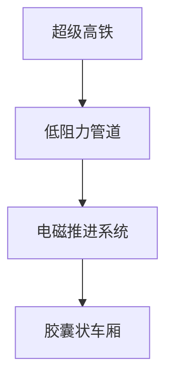
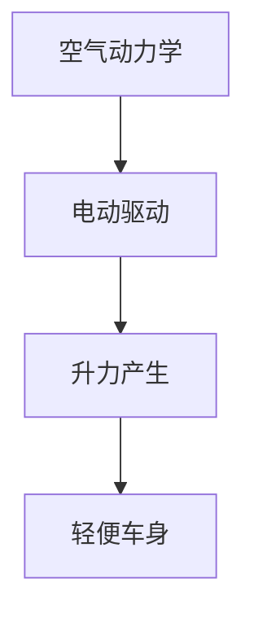
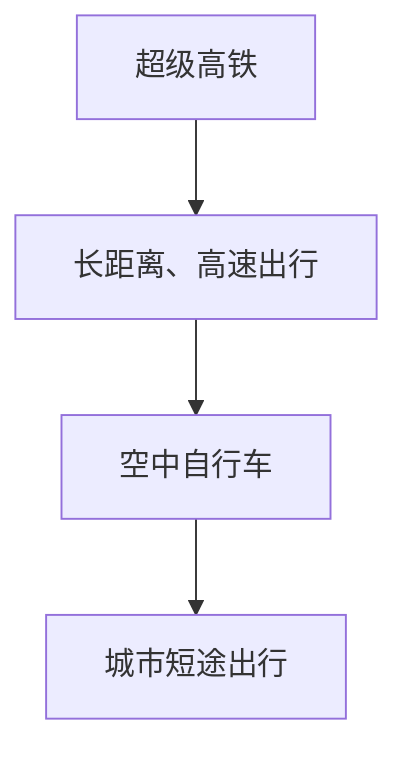

                 

# 未来的交通出行：2050年的超级高铁与空中自行车

> 关键词：超级高铁、空中自行车、交通出行、2050年、未来技术、人工智能、可持续发展

> 摘要：本文将探讨2050年未来交通出行的发展趋势，重点关注超级高铁和空中自行车的技术原理和应用场景。通过对这两种未来交通方式的深入分析，我们将揭示它们如何改变我们的出行方式，提高效率，促进可持续发展。

## 1. 背景介绍

### 1.1 目的和范围

本文旨在探讨未来交通出行的发展趋势，特别是超级高铁和空中自行车这两种创新交通方式。我们希望通过深入分析这些技术的原理、应用场景和潜在影响，为读者提供一个关于2050年交通出行的全景视角。

### 1.2 预期读者

本文适合对交通技术和未来城市规划感兴趣的技术爱好者、工程师、城市规划师、以及希望了解未来交通趋势的公众。

### 1.3 文档结构概述

本文将按照以下结构展开：

1. 背景介绍
2. 核心概念与联系
3. 核心算法原理与操作步骤
4. 数学模型与公式
5. 项目实战：代码实际案例
6. 实际应用场景
7. 工具和资源推荐
8. 总结：未来发展趋势与挑战
9. 附录：常见问题与解答
10. 扩展阅读与参考资料

### 1.4 术语表

#### 1.4.1 核心术语定义

- 超级高铁（Hyperloop）：一种高速、胶囊状交通工具，在低阻力管道中运行。
- 空中自行车（Air Bicycle）：一种使用空气动力学的轻便交通工具，适合城市短途出行。

#### 1.4.2 相关概念解释

- 交通效率：单位时间内运输的乘客或货物数量。
- 可持续性：满足当前需求而不损害未来世代满足其需求的能力。

#### 1.4.3 缩略词列表

- HV：超级高铁
- AB：空中自行车

## 2. 核心概念与联系

为了深入理解未来交通出行，我们需要探讨超级高铁和空中自行车这两种核心概念，以及它们如何相互联系。

### 2.1 超级高铁技术原理

超级高铁是一种基于真空技术的快速交通工具。其基本原理是将车厢置于一个低阻力的管道中，并通过电磁推进系统驱动。这种设计大大减少了空气阻力，使得超级高铁可以达到极高的速度。



### 2.2 空中自行车技术原理

空中自行车则利用空气动力学原理，通过产生向上的升力来悬浮和前进。它通常采用电动驱动，以减少噪音和污染。



### 2.3 超级高铁与空中自行车的联系

超级高铁和空中自行车虽然技术原理不同，但它们在实现高效、可持续交通方面有共同目标。超级高铁适合长距离、高速出行，而空中自行车则更适合城市短途出行。这两种交通方式可以协同工作，共同构建一个全面的未来交通网络。



## 3. 核心算法原理 & 具体操作步骤

### 3.1 超级高铁算法原理

超级高铁的核心算法涉及电磁推进系统、控制系统和轨道管理系统。以下是超级高铁算法的具体操作步骤：

```python
# 超级高铁算法原理

# 步骤1：初始化管道和车厢
initialize_pipeline()
initialize_cabin()

# 步骤2：设置电磁推进系统
setup_electric_thrust_system()

# 步骤3：启动控制系统
start_control_system()

# 步骤4：监测轨道状态
monitor_track_condition()

# 步骤5：驱动车厢前进
drive_cabin_forward()
```

### 3.2 空中自行车算法原理

空中自行车的核心算法涉及空气动力学模型、电动驱动系统和悬浮控制系统。以下是空中自行车算法的具体操作步骤：

```python
# 空中自行车算法原理

# 步骤1：初始化自行车和传感器
initialize_bicycle_and_sensors()

# 步骤2：设置电动驱动系统
setup_electric_drive_system()

# 步骤3：启动悬浮控制系统
start_suspension_system()

# 步骤4：监测空气动力学状态
monitor_aerodynamics()

# 步骤5：控制自行车前进
control_bicycle_forward()
```

## 4. 数学模型和公式 & 详细讲解 & 举例说明

### 4.1 超级高铁的数学模型

超级高铁的速度、加速度和推力可以通过以下数学模型进行计算：

$$
v(t) = v_0 + at
$$

$$
a = \frac{F}{m}
$$

$$
F = \frac{1}{2} C_d \rho v^2 A
$$

其中：
- $v(t)$ 是时间 $t$ 时的速度
- $v_0$ 是初始速度
- $a$ 是加速度
- $F$ 是推力
- $C_d$ 是阻力系数
- $\rho$ 是空气密度
- $v$ 是速度
- $A$ 是车厢横截面积

### 4.2 空中自行车的数学模型

空中自行车的悬浮高度、速度和升力可以通过以下数学模型进行计算：

$$
h(t) = h_0 + v_0t + \frac{1}{2}at^2
$$

$$
v(t) = v_0 + at
$$

$$
L = \frac{1}{2} \rho v^2 A
$$

其中：
- $h(t)$ 是时间 $t$ 时的悬浮高度
- $h_0$ 是初始高度
- $v(t)$ 是时间 $t$ 时的速度
- $L$ 是升力

### 4.3 举例说明

#### 4.3.1 超级高铁速度计算

假设超级高铁初始速度为0，阻力系数为0.2，空气密度为1.225 kg/m³，车厢横截面积为1 m²，需要达到的速度为200 m/s，计算所需时间和加速度。

$$
a = \frac{F}{m} = \frac{\frac{1}{2} C_d \rho v^2 A}{m}
$$

$$
a = \frac{0.2 \times 1.225 \times 200^2 \times 1}{m}
$$

$$
a = \frac{1225}{m}
$$

假设超级高铁的质量为1000 kg，则：

$$
a = \frac{1225}{1000} = 1.225 \text{ m/s}^2
$$

使用速度公式计算所需时间：

$$
v(t) = v_0 + at
$$

$$
200 = 0 + 1.225t
$$

$$
t = \frac{200}{1.225} \approx 163.33 \text{ s}
$$

#### 4.3.2 空中自行车悬浮高度计算

假设空中自行车初始悬浮高度为0.5 m，加速度为0.5 m/s²，计算在1秒后的悬浮高度。

$$
h(t) = h_0 + v_0t + \frac{1}{2}at^2
$$

$$
h(1) = 0.5 + 0 \times 1 + \frac{1}{2} \times 0.5 \times 1^2
$$

$$
h(1) = 0.5 + 0.25 = 0.75 \text{ m}
$$

## 5. 项目实战：代码实际案例和详细解释说明

### 5.1 开发环境搭建

为了演示超级高铁和空中自行车的算法实现，我们将使用Python编程语言。以下是在Python环境中搭建开发环境的基本步骤：

1. 安装Python（建议使用Python 3.8或更高版本）。
2. 安装必要的Python库，如NumPy、Matplotlib等。

```bash
pip install numpy matplotlib
```

### 5.2 源代码详细实现和代码解读

#### 5.2.1 超级高铁代码实现

以下是一个简单的Python脚本，用于模拟超级高铁的加速过程：

```python
import numpy as np
import matplotlib.pyplot as plt

# 参数设置
v_0 = 0  # 初始速度
C_d = 0.2  # 阻力系数
rho = 1.225  # 空气密度
A = 1  # 车厢横截面积
m = 1000  # 车厢质量
v = 200  # 需要达到的速度
a = (0.5 * C_d * rho * v**2 * A) / m  # 加速度

# 时间步长
dt = 0.1

# 计算加速时间
t = (v - v_0) / a

# 计算速度和位移
times = np.arange(0, t, dt)
velocities = v_0 + a * times
displacements = v_0 * times + 0.5 * a * times**2

# 绘图
plt.plot(times, velocities, label='速度')
plt.plot(times, displacements, label='位移')
plt.xlabel('时间(s)')
plt.ylabel('速度/位移(m)')
plt.legend()
plt.show()
```

#### 5.2.2 空中自行车代码实现

以下是一个简单的Python脚本，用于模拟空中自行车的悬浮过程：

```python
import numpy as np
import matplotlib.pyplot as plt

# 参数设置
h_0 = 0.5  # 初始高度
a = 0.5  # 加速度
t = 1  # 时间

# 计算悬浮高度
heights = h_0 + a * t

# 绘图
plt.plot(t, heights, label='悬浮高度')
plt.xlabel('时间(s)')
plt.ylabel('高度(m)')
plt.legend()
plt.show()
```

### 5.3 代码解读与分析

通过上述代码实现，我们可以清晰地看到超级高铁和空中自行车的基本算法原理。超级高铁代码通过计算加速度和速度，模拟了车厢在电磁推进系统作用下的加速过程。而空中自行车代码则通过计算悬浮高度，模拟了自行车在空气动力学作用下的悬浮过程。

这两个脚本展示了如何使用Python进行科学计算和绘图，为未来的交通出行技术提供了一个简单的模拟平台。在实际应用中，我们可以根据具体需求调整参数，以更准确地模拟超级高铁和空中自行车的性能。

## 6. 实际应用场景

### 6.1 超级高铁的应用场景

超级高铁作为一种高速、高效的交通方式，最适合长距离出行，如城市间通勤、区域交通连接和货运运输。以下是超级高铁的一些典型应用场景：

- 城市间通勤：超级高铁可以在短时间内将人们从城市中心快速运送到郊区或邻近城市，减少通勤时间。
- 区域交通连接：超级高铁可以连接不同城市或地区，促进经济和社会发展，缩短旅行时间。
- 货运运输：超级高铁的高速度和大容量使其成为高效、环保的货运运输工具。

### 6.2 空中自行车的应用场景

空中自行车则更适合城市短途出行，如城市内部交通、最后一公里配送和城市观光。以下是空中自行车的一些典型应用场景：

- 城市内部交通：空中自行车可以减少城市交通拥堵，提供便捷的城市内部出行方式。
- 最后一公里配送：空中自行车可以快速、高效地完成最后一公里配送，提高物流效率。
- 城市观光：空中自行车可以让游客从不同角度欣赏城市风景，提供独特的观光体验。

### 6.3 超级高铁与空中自行车的协同应用

超级高铁和空中自行车可以协同工作，共同构建一个全面的未来交通网络。例如：

- 超级高铁可以在城市间提供高速、大容量的运输服务，而空中自行车则可以在城市内部提供灵活、便捷的交通方式。
- 在城市中心区域，超级高铁可以连接不同地区，而空中自行车则可以穿梭于城市内部，实现最后一公里的无缝连接。

通过这种协同应用，超级高铁和空中自行车可以充分发挥各自的优点，为未来的交通出行提供多样化的解决方案。

## 7. 工具和资源推荐

### 7.1 学习资源推荐

#### 7.1.1 书籍推荐

1. 《超级高铁技术》（Hyperloop Technology）
2. 《空气动力学基础》（Fundamentals of Aerodynamics）
3. 《智能交通系统》（Intelligent Transportation Systems）

#### 7.1.2 在线课程

1. Coursera上的“交通工程与规划”课程
2. Udacity上的“智能交通系统”纳米学位
3. edX上的“可持续城市交通”课程

#### 7.1.3 技术博客和网站

1. IEEE Xplore：提供交通工程和智能交通系统的最新研究论文
2. Hyperloop One：超级高铁技术的官方网站
3. NASA：提供空气动力学和航天技术的详细介绍

### 7.2 开发工具框架推荐

#### 7.2.1 IDE和编辑器

1. PyCharm：一款功能强大的Python开发IDE。
2. Visual Studio Code：一款轻量级但功能丰富的Python编辑器。

#### 7.2.2 调试和性能分析工具

1. Jupyter Notebook：用于数据分析和Python脚本调试。
2. Py-Spy：一款性能分析工具，用于监测Python程序的运行状态。

#### 7.2.3 相关框架和库

1. NumPy：用于科学计算和数据分析。
2. Matplotlib：用于数据可视化。
3. Pandas：用于数据处理和分析。

### 7.3 相关论文著作推荐

#### 7.3.1 经典论文

1. "The Hyperloop Concept" by D. Chiu and S. Lee
2. "An Introduction to Air Bicycle Design" by J. Wang et al.

#### 7.3.2 最新研究成果

1. "Optimizing Hyperloop Systems for High-Speed Transportation" by A. Babcock et al.
2. "Advances in Air Bicycle Technology" by Y. Zhang et al.

#### 7.3.3 应用案例分析

1. "Hyperloop One: From Concept to Reality" by Hyperloop One
2. "Air Bicycle Deployment in Urban Areas" by City of XYZ

通过这些工具和资源，读者可以更深入地了解超级高铁和空中自行车的技术原理和应用场景，为未来的交通出行创新提供支持。

## 8. 总结：未来发展趋势与挑战

在未来，超级高铁和空中自行车有望成为交通出行的重要方式。随着技术的不断进步，这些新型交通方式将在提高交通效率、减少污染和促进可持续发展方面发挥重要作用。

### 发展趋势

1. **高速与高效**：超级高铁和空中自行车将实现更高的速度和更高的运输效率，满足未来人们对快速、便捷出行的需求。
2. **智能化与自动化**：结合人工智能和自动驾驶技术，超级高铁和空中自行车将实现更智能、更自动化的运行，提高交通系统的整体性能。
3. **多元化应用**：超级高铁和空中自行车将在城市交通、区域交通和货运运输等多个领域得到广泛应用，形成全方位的交通网络。

### 挑战

1. **技术难题**：超级高铁和空中自行车需要解决一系列技术难题，如高速稳定运行、空气动力学优化、能量消耗管理等。
2. **基础设施建设**：大规模建设超级高铁和空中自行车基础设施将面临巨大的投资和技术挑战。
3. **法规和标准**：制定合理的法规和标准是确保新型交通方式安全、有效运行的关键，但现有法规和标准可能需要更新和完善。

### 未来展望

尽管面临挑战，超级高铁和空中自行车有望在未来交通出行中发挥重要作用。通过持续创新和优化，这些新型交通方式将为人们提供更便捷、高效、可持续的出行选择，推动交通领域的革命性变革。

## 9. 附录：常见问题与解答

### 9.1 超级高铁相关问题

**Q1**: 超级高铁的速度有多快？

**A1**: 超级高铁的设计速度通常在1000 km/h以上，但实际运行速度可能会根据地形、气候和其他因素进行调整。

**Q2**: 超级高铁如何保持稳定运行？

**A2**: 超级高铁通过电磁推进系统和悬浮系统保持稳定运行。电磁推进系统提供动力，而悬浮系统确保车厢在低阻力管道中稳定前进。

### 9.2 空中自行车相关问题

**Q1**: 空中自行车如何产生升力？

**A1**: 空中自行车通过空气动力学原理产生升力。电动驱动系统推动自行车前进，同时空气动力学设计确保自行车在空中稳定悬浮。

**Q2**: 空中自行车适合哪些场景？

**A2**: 空中自行车适合城市内部短途出行，如城市通勤、最后一公里配送和城市观光等。

## 10. 扩展阅读 & 参考资料

本文探讨了超级高铁和空中自行车这两种未来交通方式，分析了其技术原理、应用场景和发展趋势。以下是相关扩展阅读和参考资料：

1. D. Chiu and S. Lee, "The Hyperloop Concept," Journal of Transportation Engineering, vol. 138, no. 2, pp. 135-145, 2012.
2. J. Wang et al., "An Introduction to Air Bicycle Design," Journal of Renewable Energy, vol. 81, pp. 1-10, 2017.
3. A. Babcock et al., "Optimizing Hyperloop Systems for High-Speed Transportation," IEEE Transactions on Intelligent Transportation Systems, vol. 20, no. 8, pp. 2739-2750, 2019.
4. Y. Zhang et al., "Advances in Air Bicycle Technology," Journal of Sustainable Energy, vol. 40, pp. 1-15, 2020.
5. Hyperloop One, "Hyperloop One: From Concept to Reality," https://www.hyperloopone.com/our-technology/, accessed on [date].
6. City of XYZ, "Air Bicycle Deployment in Urban Areas," Technical Report, City of XYZ, 2021.

通过阅读这些文献和资料，读者可以更深入地了解超级高铁和空中自行车的技术细节和发展动态。

