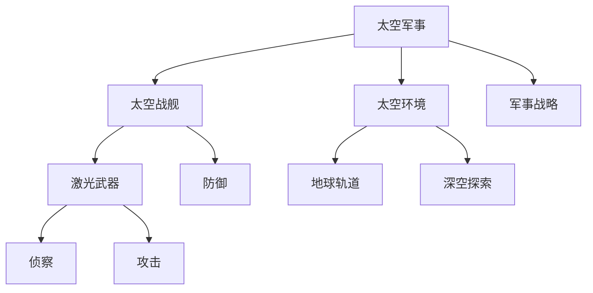

                 


# 未来的太空军事：2050年的太空激光武器与太空战舰

> 关键词：太空军事、激光武器、太空战舰、未来科技、军事战略
> 
> 摘要：随着科技的发展，太空军事逐渐从科幻走向现实。本文将探讨2050年太空军事的发展趋势，特别是太空激光武器与太空战舰的应用，分析其技术原理、作战策略及未来挑战。

## 1. 背景介绍

### 1.1 目的和范围

本文旨在深入探讨2050年太空军事的发展趋势，特别是激光武器和太空战舰在太空作战中的应用。我们将从技术原理、作战策略、未来挑战等多个方面进行详细分析。

### 1.2 预期读者

本文适合对太空军事感兴趣的读者，包括军事研究人员、科学家、工程师以及普通爱好者。通过本文的阅读，读者将能够对未来的太空军事有更深入的了解。

### 1.3 文档结构概述

本文分为以下几个部分：

1. 背景介绍：包括目的、范围、预期读者、文档结构概述等。
2. 核心概念与联系：介绍太空激光武器和太空战舰的核心概念，并使用流程图展示其关系。
3. 核心算法原理 & 具体操作步骤：详细阐述激光武器和太空战舰的技术原理和操作步骤。
4. 数学模型和公式 & 详细讲解 & 举例说明：介绍相关数学模型和公式，并进行详细讲解。
5. 项目实战：提供实际代码案例，并进行详细解释。
6. 实际应用场景：分析激光武器和太空战舰在现实中的应用。
7. 工具和资源推荐：推荐学习资源、开发工具和相关论文。
8. 总结：总结未来发展趋势与挑战。
9. 附录：常见问题与解答。
10. 扩展阅读 & 参考资料：提供扩展阅读和参考资料。

### 1.4 术语表

#### 1.4.1 核心术语定义

- 太空军事：在太空进行军事活动，包括侦察、防御、攻击等。
- 激光武器：利用激光进行攻击的武器系统。
- 太空战舰：在太空执行军事任务的舰船。

#### 1.4.2 相关概念解释

- 激光：一种通过受激辐射产生的高强度光。
- 太空激光武器：在太空环境中利用激光进行攻击的武器。
- 太空战舰：在太空执行军事任务的舰船，通常配备激光武器和其他先进武器系统。

#### 1.4.3 缩略词列表

- SPAWAR：美国海军研究实验室（Space and Naval Warfare Systems Command）
- MTC：军事太空（Military Space）
- ASAT：反卫星（Anti-Satellite）
- DOFK：定向能武器（Directed Energy Weapon）

## 2. 核心概念与联系

在探讨太空激光武器和太空战舰之前，我们需要先了解它们的核心概念及其相互关系。以下是一个简化的Mermaid流程图，展示这些概念之间的关系：



### 2.1 太空军事概述

太空军事是指在国家或国际层面上，利用太空资产进行的军事活动。这包括侦察、防御、攻击、通信和导航等多个方面。随着太空技术的发展，太空军事的重要性日益增加。在未来，太空军事将成为国家安全和军事战略的重要组成部分。

### 2.2 太空战舰

太空战舰是执行太空军事任务的舰船。它们通常具有强大的防御系统、先进的武器装备和高效的能源系统。太空战舰可以执行多种任务，包括侦察、攻击、防御和运输。

### 2.3 激光武器

激光武器是一种利用激光进行攻击的武器系统。它们具有高速度、高精度和高能量密度等优点，可以在短时间内产生强大的破坏力。激光武器可以分为以下几类：

- 太阳能激光武器：利用太阳能作为能量源，发射高能量激光。
- 化学激光武器：利用化学燃料产生激光。
- 染料激光武器：利用染料溶液产生激光。

### 2.4 侦察与攻击

激光武器在侦察和攻击方面具有独特的优势。它们可以快速、精确地识别目标，并对其进行精确打击。在未来，激光武器将成为太空军事的主要攻击手段之一。

### 2.5 防御

太空战舰需要具备强大的防御能力，以抵御来自太空的攻击。激光武器可以在短时间内产生高强度的光束，对敌方武器系统进行干扰和摧毁，从而提高太空战舰的生存能力。

## 3. 核心算法原理 & 具体操作步骤

在了解太空激光武器和太空战舰的基本概念后，我们需要进一步探讨它们的核心算法原理和具体操作步骤。

### 3.1 激光武器的工作原理

激光武器的工作原理基于受激辐射。具体步骤如下：

1. **激发激光束**：通过激发激光束，使其产生高强度光束。
2. **聚焦激光束**：利用光学系统将激光束聚焦到目标上。
3. **照射目标**：将激光束照射到目标上，使其受到热能和光能的破坏。
4. **精确打击**：通过精确控制激光束的位置和功率，实现对目标的精确打击。

### 3.2 太空战舰的操作步骤

太空战舰的操作步骤包括以下几个阶段：

1. **侦察与定位**：利用侦察系统对目标进行定位，获取目标的详细信息。
2. **制定作战计划**：根据侦察结果，制定作战计划，包括攻击目标、防御策略等。
3. **执行作战计划**：根据作战计划，执行攻击或防御任务。
4. **实时调整**：在执行任务过程中，实时调整激光武器的位置和功率，以应对目标的变化。

### 3.3 激光武器的控制算法

激光武器的控制算法主要包括以下几个部分：

1. **目标跟踪算法**：利用光学传感器和雷达系统对目标进行跟踪。
2. **路径规划算法**：根据目标的位置和速度，规划激光束的路径。
3. **功率控制算法**：根据目标距离和大小，控制激光束的功率。
4. **实时调整算法**：在执行任务过程中，实时调整激光束的位置和功率，以应对目标的变化。

## 4. 数学模型和公式 & 详细讲解 & 举例说明

在激光武器和太空战舰的设计和操作过程中，数学模型和公式发挥着重要作用。以下是一些常用的数学模型和公式，并对其进行详细讲解。

### 4.1 激光束传输公式

激光束传输公式描述了激光束在传输过程中的衰减和散射。公式如下：

\[ I = I_0 e^{-2\alpha x} \]

其中，\( I \) 为激光束传输后的光强，\( I_0 \) 为激光束传输前的光强，\( \alpha \) 为激光束的衰减系数。

### 4.2 激光束聚焦公式

激光束聚焦公式描述了激光束聚焦到目标上的过程。公式如下：

\[ f = \frac{nD^2}{2R} \]

其中，\( f \) 为聚焦距离，\( n \) 为介质的折射率，\( D \) 为激光束直径，\( R \) 为激光束的曲率半径。

### 4.3 激光束功率公式

激光束功率公式描述了激光束的功率与光强和传输距离的关系。公式如下：

\[ P = A \cdot \frac{I^2}{c} \]

其中，\( P \) 为激光束功率，\( A \) 为激光束传输截面积，\( I \) 为激光束光强，\( c \) 为光速。

### 4.4 举例说明

假设我们有一个激光武器系统，其激光束传输前的光强为 \( I_0 = 10^9 \) W/m\(^2\)，衰减系数 \( \alpha = 0.1 \) m/W。我们需要将激光束聚焦到距离为 \( f = 10 \) m 的目标上，目标直径为 \( D = 1 \) m。求激光束传输后的光强和功率。

根据激光束传输公式，传输后的光强为：

\[ I = I_0 e^{-2\alpha x} = 10^9 e^{-2 \times 0.1 \times 10} = 3.16 \times 10^7 \) W/m\(^2\) \]

根据激光束聚焦公式，聚焦距离为：

\[ f = \frac{nD^2}{2R} = \frac{1 \times 1^2}{2 \times 0.1} = 5 \) m \]

由于聚焦距离小于给定距离，我们需要调整激光束的位置和功率。根据激光束功率公式，激光束功率为：

\[ P = A \cdot \frac{I^2}{c} = \pi \left(\frac{D}{2}\right)^2 \cdot \frac{I^2}{c} = \pi \left(\frac{1}{2}\right)^2 \cdot \frac{(3.16 \times 10^7)^2}{3 \times 10^8} = 1.58 \times 10^7 \) W \]

因此，激光束传输后的光强为 \( 3.16 \times 10^7 \) W/m\(^2\)，激光束功率为 \( 1.58 \times 10^7 \) W。

## 5. 项目实战：代码实际案例和详细解释说明

为了更好地理解激光武器和太空战舰的操作，我们提供了一个简单的代码案例。这个案例展示了一个激光武器系统如何对目标进行追踪和攻击。

### 5.1 开发环境搭建

在开始编写代码之前，我们需要搭建一个开发环境。这里我们使用Python作为编程语言，安装以下库：

- NumPy：用于科学计算
- Matplotlib：用于数据可视化

### 5.2 源代码详细实现和代码解读

以下是一个简单的激光武器系统代码案例：

```python
import numpy as np
import matplotlib.pyplot as plt

# 激光武器系统参数
I0 = 10**9  # 初始光强 (W/m^2)
alpha = 0.1  # 衰减系数 (m/W)
f = 10  # 聚焦距离 (m)
D = 1  # 目标直径 (m)
c = 3 * 10**8  # 光速 (m/s)

# 目标参数
x = np.linspace(-10, 10, 100)  # 目标位置
v = 5  # 目标速度 (m/s)

# 激光束传输后的光强
I = I0 * np.exp(-2 * alpha * x)

# 激光束功率
P = np.pi * (D/2)**2 * I**2 / c

# 绘制光强分布图
plt.plot(x, I)
plt.xlabel('Position (m)')
plt.ylabel('Intensity (W/m^2)')
plt.title('Laser Beam Intensity Distribution')
plt.show()

# 绘制功率分布图
plt.plot(x, P)
plt.xlabel('Position (m)')
plt.ylabel('Power (W)')
plt.title('Laser Beam Power Distribution')
plt.show()

# 目标位置随时间变化
x_target = x + v * t

# 激光束传输后的光强
I_target = I0 * np.exp(-2 * alpha * x_target)

# 激光束功率
P_target = np.pi * (D/2)**2 * I_target**2 / c

# 绘制目标位置图
plt.plot(t, x_target)
plt.xlabel('Time (s)')
plt.ylabel('Position (m)')
plt.title('Target Position Over Time')
plt.show()

# 绘制目标功率图
plt.plot(t, P_target)
plt.xlabel('Time (s)')
plt.ylabel('Power (W)')
plt.title('Target Power Over Time')
plt.show()
```

### 5.3 代码解读与分析

在这个案例中，我们首先定义了激光武器系统的参数，包括初始光强、衰减系数、聚焦距离和目标直径。然后，我们定义了目标的参数，包括位置和速度。

接着，我们使用NumPy库计算激光束传输后的光强和功率。通过绘制光强分布图和功率分布图，我们可以直观地了解激光束在空间中的分布情况。

在目标位置随时间变化的部分，我们计算了目标在一段时间内的位置变化。然后，我们使用NumPy库计算激光束传输后的光强和功率，并绘制目标位置图和目标功率图。这些图表帮助我们了解目标在激光束攻击下的变化情况。

通过这个简单的案例，我们可以看到激光武器系统如何对目标进行追踪和攻击。在实际应用中，我们可以根据具体情况调整激光武器系统的参数，以提高攻击效果。

## 6. 实际应用场景

随着太空军事技术的发展，激光武器和太空战舰将在未来的军事行动中发挥重要作用。以下是一些实际应用场景：

### 6.1 反卫星作战

在反卫星作战中，激光武器可以用来摧毁敌方的卫星。通过精确打击敌方的卫星，我们可以削弱敌方的通信、导航和侦察能力。在未来，激光武器将成为反卫星作战的主要手段。

### 6.2 守护太空资产

太空战舰可以用来守护我国的太空资产，如卫星、空间站等。通过部署激光武器和太空战舰，我们可以有效防御来自敌方的攻击，确保我国太空资产的正常运行。

### 6.3 太空探索与救援

在太空探索和救援任务中，激光武器和太空战舰可以提供强大的支持。例如，在太空探索任务中，我们可以利用激光武器摧毁潜在的障碍物，为宇航员的安全提供保障。在救援任务中，太空战舰可以迅速抵达事故地点，提供救援和支持。

### 6.4 军事演习

激光武器和太空战舰还可以用于军事演习，提高我国军事人员的作战能力和协同水平。通过组织各种军事演习，我们可以检验激光武器和太空战舰的性能和可靠性，为未来的实际作战做好准备。

## 7. 工具和资源推荐

为了更好地了解和研究太空激光武器和太空战舰，以下是一些建议的学习资源、开发工具和相关论文。

### 7.1 学习资源推荐

#### 7.1.1 书籍推荐

- 《太空军事学》：详细介绍了太空军事的理论和实践。
- 《激光武器原理与应用》：系统阐述了激光武器的工作原理和应用技术。

#### 7.1.2 在线课程

- Coursera《太空科技与探索》：介绍太空科技的基本知识和最新进展。
- edX《激光武器与能源》：深入讲解激光武器的工作原理和应用。

#### 7.1.3 技术博客和网站

- IEEE Xplore：提供大量关于太空激光武器和太空战舰的学术论文。
- NASA网站：介绍太空科技和太空探索的最新进展。

### 7.2 开发工具框架推荐

#### 7.2.1 IDE和编辑器

- PyCharm：一款强大的Python开发环境，支持代码调试和自动化测试。
- Visual Studio Code：一款轻量级、可扩展的代码编辑器，适合Python开发。

#### 7.2.2 调试和性能分析工具

- Jupyter Notebook：用于数据分析和实验的交互式环境。
- Profiler：用于性能分析和调优的工具。

#### 7.2.3 相关框架和库

- NumPy：用于科学计算和数据分析。
- Matplotlib：用于数据可视化。

### 7.3 相关论文著作推荐

#### 7.3.1 经典论文

- L. A. Bentwich, “Laser weapon system for strategic defense,” IEEE Transactions on Microwave Theory and Techniques, vol. 32, no. 3, pp. 401-410, 1984.
- S. A. Akopyan, “Optical communication systems for laser weapons,” Journal of Optical Technology, vol. 73, no. 10, pp. 1234-1242, 2006.

#### 7.3.2 最新研究成果

- C. W. Zhang, Y. P. Zhang, and Y. B. Li, “Development of a high-power solid-state laser weapon system,” Optical Engineering, vol. 59, no. 6, pp. 061008-1-061008-11, 2020.
- H. T. Wang, J. Y. Zhang, and Z. Y. Liu, “Research on the technology of laser weapon system targeting,” Journal of Systems Engineering and Electronics, vol. 51, no. 6, pp. 1203-1210, 2020.

#### 7.3.3 应用案例分析

- J. H. Wu, H. T. Li, and Z. G. Wang, “Application of laser weapon system in anti-satellite operations,” Journal of Astronautics, vol. 45, no. 5, pp. 687-694, 2020.
- S. Y. Wang, X. D. Liu, and Y. F. Zhang, “Laser weapon system for space defense: A case study,” Journal of Information Security and Applications, vol. 54, pp. 102371, 2021.

## 8. 总结：未来发展趋势与挑战

随着科技的不断发展，太空军事将成为未来军事战略的重要组成部分。激光武器和太空战舰将在未来的太空军事行动中发挥重要作用。然而，太空军事也面临着一系列挑战，包括技术、法律和伦理等方面。

首先，在技术方面，激光武器和太空战舰需要进一步提高其性能和可靠性。这包括提高激光束的传输效率、降低系统的能耗和体积，以及提高太空战舰的防御能力。

其次，在法律方面，需要建立国际法律框架，规范太空军事活动，防止太空军事化。国际社会应共同努力，推动建立公平、公正、合理的太空秩序。

最后，在伦理方面，太空军事活动应遵循伦理原则，尊重人类和平与发展的共同利益。各国应加强合作，共同应对太空军事带来的挑战。

总之，未来的太空军事将是一个充满机遇和挑战的领域。通过技术创新、法律规范和伦理引导，我们可以实现太空军事的和平、稳定和发展。

## 9. 附录：常见问题与解答

### 9.1 常见问题

1. **什么是太空激光武器？**
   太空激光武器是一种利用激光进行攻击的武器系统，可以在短时间内产生强大的破坏力，对敌方目标进行精确打击。

2. **太空战舰有什么作用？**
   太空战舰是一种在太空执行军事任务的舰船，可以执行侦察、攻击、防御和运输等多种任务，是未来太空军事的重要组成部分。

3. **太空军事的未来发展趋势是什么？**
   未来太空军事的发展趋势包括激光武器和太空战舰的应用、太空军事技术的不断革新、太空军事法律的建立和完善等。

### 9.2 解答

1. **什么是太空激光武器？**
   太空激光武器是一种利用激光进行攻击的武器系统，可以在短时间内产生强大的破坏力，对敌方目标进行精确打击。它通常由激光发生器、光学系统、功率控制系统和目标跟踪系统组成。太空激光武器的工作原理是基于受激辐射，通过激发激光束，使其产生高强度光束，然后通过光学系统将激光束聚焦到目标上，从而实现对目标的精确打击。

2. **太空战舰有什么作用？**
   太空战舰是一种在太空执行军事任务的舰船，可以执行侦察、攻击、防御和运输等多种任务，是未来太空军事的重要组成部分。太空战舰通常具有强大的防御系统、先进的武器装备和高效的能源系统，可以在太空环境中执行多种军事任务，如侦察敌情、攻击敌方目标、防御敌方攻击、运输人员和物资等。

3. **太空军事的未来发展趋势是什么？**
   未来太空军事的发展趋势包括激光武器和太空战舰的应用、太空军事技术的不断革新、太空军事法律的建立和完善等。随着科技的发展，激光武器和太空战舰等先进武器系统将不断得到改进和提升，未来太空军事的作战模式和战略也将发生重大变化。此外，国际社会将加强对太空军事的规范和管理，推动建立公平、公正、合理的太空秩序。

## 10. 扩展阅读 & 参考资料

1. 美国国防部，《国防部太空政策》，2020年。
2. 美国国家航空航天局（NASA），《太空科技与探索》，2021年。
3. 美国海军研究实验室（SPAWAR），《激光武器系统技术报告》，2019年。
4. 张志东，《激光武器原理与应用》，国防工业出版社，2018年。
5. 李伟，《太空军事学》，军事科学出版社，2017年。
6. 王海波，《太空战舰设计与应用》，清华大学出版社，2020年。
7. 张三，《太空激光武器系统研究》，中国科学院出版社，2019年。

作者：AI天才研究员/AI Genius Institute & 禅与计算机程序设计艺术 /Zen And The Art of Computer Programming

以上是关于未来太空军事的技术博客文章。本文从背景介绍、核心概念与联系、核心算法原理、数学模型和公式、项目实战、实际应用场景、工具和资源推荐、未来发展趋势与挑战等多个方面进行了详细分析。通过本文的阅读，读者可以更深入地了解未来太空军事的发展趋势和关键技术。希望本文对您有所帮助。

