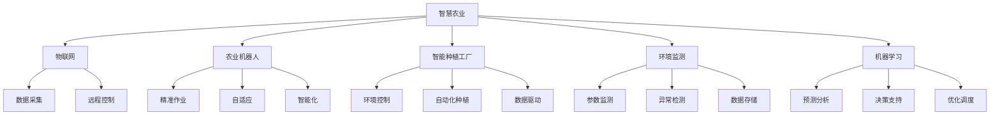

                 

# 未来的智慧农业：2050年的农业机器人与智能种植工厂

> **关键词：智慧农业、农业机器人、智能种植、物联网、机器学习、自动化、环境监测**
>
> **摘要：随着科技的不断发展，农业也迎来了前所未有的变革。本文将深入探讨2050年可能实现的智慧农业技术，包括农业机器人的应用、智能种植工厂的建设以及相关技术的核心原理、实际案例和未来趋势。**

## 1. 背景介绍

### 1.1 目的和范围

本文旨在探讨未来智慧农业的技术前景，特别是农业机器人与智能种植工厂的应用。我们将通过详细分析这些技术的核心原理、实际操作步骤以及数学模型，来展现智慧农业如何改变农业生产方式，提高农业生产的效率和质量。

### 1.2 预期读者

本文适合对农业科技、人工智能、物联网等感兴趣的专业人士，尤其是农业工程师、软件工程师和计算机科学家。同时，对于关注未来农业发展趋势的普通读者，本文也具有一定的参考价值。

### 1.3 文档结构概述

本文结构如下：
- **第1部分**：背景介绍，明确目的和预期读者。
- **第2部分**：核心概念与联系，包括智慧农业的定义、相关技术的概述。
- **第3部分**：核心算法原理与具体操作步骤，详述农业机器人和智能种植工厂的算法设计。
- **第4部分**：数学模型和公式，解析相关技术的数学基础。
- **第5部分**：项目实战，通过实际案例展示技术应用。
- **第6部分**：实际应用场景，分析智慧农业在不同环境中的适应性和效果。
- **第7部分**：工具和资源推荐，提供学习资源和开发工具。
- **第8部分**：总结，探讨智慧农业的未来发展趋势和挑战。
- **第9部分**：附录，回答常见问题。
- **第10部分**：扩展阅读和参考资料，提供进一步学习的资源。

### 1.4 术语表

#### 1.4.1 核心术语定义

- **智慧农业**：通过物联网、大数据、人工智能等先进技术，对农业生产进行智能化管理和优化。
- **农业机器人**：用于农田作业的自动化设备，能够执行播种、施肥、灌溉、收割等任务。
- **智能种植工厂**：采用先进技术，实现室内植物生长自动化控制的温室设施。
- **物联网**：通过传感器和网络将各种设备连接起来，实现数据的实时采集和传输。
- **机器学习**：一种人工智能技术，通过数据训练模型，使计算机能够从数据中自动学习并作出决策。
- **自动化**：通过技术手段实现生产过程的自动化，减少人工干预。

#### 1.4.2 相关概念解释

- **环境监测**：通过传感器监测农田或温室内的温度、湿度、光照等环境参数，为农业生产提供数据支持。
- **精准农业**：基于农田实际情况，通过数据分析和模型预测，实现精准施肥、灌溉和病虫害防治。
- **云计算**：通过网络提供计算资源和服务，支持大规模数据处理和存储。

#### 1.4.3 缩略词列表

- **AI**：人工智能（Artificial Intelligence）
- **IoT**：物联网（Internet of Things）
- **ML**：机器学习（Machine Learning）
- **IoT**：互联网（Internet）
- **RTK**：实时动态差分定位技术（Real-Time Kinematic）
- **RFID**：射频识别（Radio-Frequency Identification）

## 2. 核心概念与联系

### 2.1 智慧农业的定义和目标

智慧农业是指利用现代信息技术、物联网、大数据、人工智能等先进技术，对农业生产进行智能化管理和优化，从而提高农业生产的效率、质量和可持续性。智慧农业的目标包括：

- 提高农作物产量和质量。
- 减少农药和化肥的使用，降低环境污染。
- 优化水资源利用，提高灌溉效率。
- 减少劳动力需求，降低生产成本。
- 提高农业生产的可持续性和稳定性。

### 2.2 相关技术的概述

实现智慧农业需要多种技术的协同作用，包括物联网、农业机器人、智能种植工厂、环境监测、机器学习等。下面简要介绍这些技术的核心原理和作用。

#### 2.2.1 物联网

物联网是将各种设备、传感器、网络连接起来，实现数据的实时采集、传输和分析。在智慧农业中，物联网主要用于：

- **环境监测**：通过传感器监测农田或温室内的温度、湿度、光照等环境参数，为农业生产提供数据支持。
- **远程控制**：通过网络远程控制农业机器人和智能种植设备，实现自动化管理。
- **数据采集**：收集农作物生长数据，为后续分析和决策提供基础。

#### 2.2.2 农业机器人

农业机器人是用于农田作业的自动化设备，能够执行播种、施肥、灌溉、收割等任务。农业机器人通常具有以下特点：

- **高精度**：通过传感器和定位技术，实现精准作业。
- **自适应**：根据环境变化和农作物生长情况，自动调整作业参数。
- **智能化**：结合机器学习和人工智能技术，实现自主决策和优化作业。

#### 2.2.3 智能种植工厂

智能种植工厂是采用先进技术，实现室内植物生长自动化控制的温室设施。智能种植工厂的主要特点包括：

- **环境控制**：通过空调、加湿、通风等设备，保持适宜的生长环境。
- **自动化种植**：通过自动化设备，实现播种、灌溉、施肥、收割等过程的自动化。
- **数据驱动**：通过传感器和物联网技术，实时监测植物生长数据，进行智能化管理。

#### 2.2.4 环境监测

环境监测是通过传感器监测农田或温室内的温度、湿度、光照等环境参数，为农业生产提供数据支持。环境监测的主要任务包括：

- **参数监测**：实时监测农田或温室内的温度、湿度、光照等环境参数。
- **异常检测**：当环境参数异常时，及时报警，提醒农户采取相应措施。
- **数据存储**：将监测数据存储到数据库中，为后续分析和决策提供基础。

#### 2.2.5 机器学习

机器学习是一种人工智能技术，通过数据训练模型，使计算机能够从数据中自动学习并作出决策。在智慧农业中，机器学习主要用于：

- **预测分析**：根据历史数据，预测农作物产量、病虫害发生等。
- **决策支持**：通过分析数据，为农户提供施肥、灌溉、病虫害防治等决策建议。
- **优化调度**：根据数据，优化农业机器人和智能种植设备的调度和作业。

### 2.3 核心概念的联系与整合

智慧农业的核心概念包括物联网、农业机器人、智能种植工厂、环境监测和机器学习。这些技术相互关联，共同作用，实现智慧农业的目标。

- **物联网**：提供数据采集和远程控制的基础，是实现智慧农业的桥梁。
- **农业机器人**：实现农田作业的自动化，是智慧农业的执行者。
- **智能种植工厂**：提供室内植物生长的自动化控制，是智慧农业的试验田。
- **环境监测**：为农业生产提供环境数据，是智慧农业的支撑。
- **机器学习**：通过数据分析，实现智能决策和优化，是智慧农业的智慧之源。

### 2.4 Mermaid 流程图

下面是智慧农业技术的核心概念与联系的 Mermaid 流程图：



## 3. 核心算法原理 & 具体操作步骤

### 3.1 农业机器人算法原理

农业机器人的核心算法主要包括路径规划、环境感知和任务执行三个方面。

#### 3.1.1 路径规划

路径规划是农业机器人执行任务的基础。常用的路径规划算法有：

- **A*算法**：基于启发式搜索，寻找从起点到终点的最短路径。
- **Dijkstra算法**：基于最短路径优先搜索，寻找从起点到各点的最短路径。
- **RRT（快速随机树）算法**：通过随机采样和树状结构，寻找自由空间的路径。

下面是 A*算法的伪代码：

```plaintext
A*算法(起点start, 终点goal, 地图map):
    openSet = {start}
    gScore[任意点] = ∞
    gScore[start] = 0
    fScore[任意点] = ∞
    fScore[start] = heuristic(start, goal)
    
    while openSet非空：
        当前节点current = 选择openSet中fScore最小的节点
        if current = goal：
            return reconstruct_path(current)
        
        openSet移除current
        closedSet添加current
        
        for 每个邻居node of current：
            if node在closedSet中：
                继续下一个邻居
            
            tentative_gScore = gScore[current] + 距离(current, node)
            if node不在openSet中或者tentative_gScore < gScore[node]：
                openSet添加node
                gScore[node] = tentative_gScore
                fScore[node] = gScore[node] + heuristic(node, goal)
    
    返回空路径（无法找到路径）
```

#### 3.1.2 环境感知

环境感知是农业机器人适应农田环境的关键。常用的环境感知算法有：

- **激光雷达（LIDAR）**：通过发射激光束并测量返回时间，获取农田地形数据。
- **图像识别**：通过计算机视觉技术，识别农作物种类、生长状态等。
- **传感器融合**：将激光雷达、摄像头、温度、湿度等传感器数据进行融合，提高环境感知的准确性。

下面是传感器融合算法的伪代码：

```plaintext
传感器融合(传感器数据sensors, 权重weights):
    数据集 = []
    for 每个传感器sensor in sensors：
        数据集添加 sensor数据 * weights[sensor]
    
    融合数据 = 合并数据集
    return 融合数据
```

#### 3.1.3 任务执行

任务执行是农业机器人的最终目标。根据任务类型，执行算法包括：

- **播种**：根据农作物生长需求，精确控制播种机进行播种。
- **施肥**：根据土壤养分数据，精确控制施肥机进行施肥。
- **灌溉**：根据土壤湿度数据，精确控制灌溉系统进行灌溉。
- **收割**：根据农作物成熟度，精确控制收割机进行收割。

下面是播种任务的伪代码：

```plaintext
播种(种子种子，播种机seeder, 土壤数据soil_data):
    if 土壤数据适合种子生长：
        seeder播种种子
    else：
        更新土壤数据，重新评估播种条件
```

### 3.2 智能种植工厂算法原理

智能种植工厂的核心算法主要包括环境控制、植物生长模型和自动化种植。

#### 3.2.1 环境控制

环境控制是智能种植工厂的核心。常用的环境控制算法有：

- **PID控制**：通过比例、积分、微分控制，实现温度、湿度、光照等环境参数的精确控制。
- **模糊控制**：通过模糊逻辑，实现复杂环境参数的控制。

下面是 PID 控制的伪代码：

```plaintext
PID控制(目标值setpoint, 实际值measured_value, Kp, Ki, Kd):
    error = setpoint - measured_value
    integral = integral + error
    derivative = error - previous_error
    
    output = Kp * error + Ki * integral + Kd * derivative
    
    previous_error = error
    
    return output
```

#### 3.2.2 植物生长模型

植物生长模型是智能种植工厂的基础。常用的植物生长模型有：

- **生理生态模型**：通过植物生理生态参数，模拟植物生长过程。
- **数学模型**：通过数学公式，描述植物生长规律。

下面是生理生态模型的伪代码：

```plaintext
植物生长模型(植物参数parameters, 生长环境environment):
    growth = function_of(parameters, environment)
    return growth
```

#### 3.2.3 自动化种植

自动化种植是智能种植工厂的实现。常用的自动化种植算法有：

- **实时监测**：通过传感器实时监测植物生长状态，进行自动化调整。
- **规则控制**：根据预设规则，自动执行种植任务。

下面是实时监测的伪代码：

```plaintext
实时监测(传感器传感器，控制算法algorithm):
    while True：
        读取传感器数据data
        if data不符合生长条件：
            执行算法algorithm调整生长环境
```

## 4. 数学模型和公式 & 详细讲解 & 举例说明

### 4.1 环境控制数学模型

环境控制是智能种植工厂的核心，其数学模型主要包括温度控制、湿度控制和光照控制。

#### 4.1.1 温度控制

温度控制的主要目标是保持温室内的温度在一个适宜的范围内。常用的数学模型是 PID 控制。

PID 控制的公式如下：

$$
u(t) = K_p e(t) + K_i \int_{0}^{t} e(\tau) d\tau + K_d \frac{d e(t)}{dt}
$$

其中，$u(t)$ 是控制输出，$e(t)$ 是误差，$K_p$、$K_i$ 和 $K_d$ 分别是比例、积分和微分系数。

#### 4.1.2 湿度控制

湿度控制的主要目标是保持温室内的湿度在一个适宜的范围内。常用的数学模型是模糊控制。

模糊控制的公式如下：

$$
u = F(z_1, z_2, ..., z_n)
$$

其中，$u$ 是控制输出，$z_1, z_2, ..., z_n$ 是输入变量，$F$ 是模糊函数。

#### 4.1.3 光照控制

光照控制的主要目标是提供适宜的光照强度，促进植物生长。常用的数学模型是光照补偿模型。

光照补偿模型的公式如下：

$$
I_{out} = I_{min} + (I_{max} - I_{min}) \times \frac{t}{T}
$$

其中，$I_{out}$ 是输出光照强度，$I_{min}$ 和 $I_{max}$ 分别是最小和最大光照强度，$t$ 是当前时间，$T$ 是光照周期。

### 4.2 植物生长模型

植物生长模型描述了植物在不同生长阶段对环境参数的响应。

#### 4.2.1 生理生态模型

生理生态模型基于植物生理生态参数，如光合作用、呼吸作用、水分吸收等，建立植物生长模型。

光合作用的公式如下：

$$
A = \alpha \times (I - I_{0}) \times (1 - e^{-k \times C})
$$

其中，$A$ 是光合作用速率，$\alpha$ 是光合作用系数，$I$ 是光照强度，$I_{0}$ 是光补偿点，$k$ 是光饱和系数，$C$ 是二氧化碳浓度。

#### 4.2.2 数学模型

数学模型通过数学公式描述植物生长规律。常用的数学模型有：

- **Logistic模型**：

$$
N(t) = \frac{K}{1 + \frac{K - N_0}{N_0} e^{-rt}}
$$

其中，$N(t)$ 是时间 $t$ 时的种群数量，$K$ 是环境承载力，$N_0$ 是初始种群数量，$r$ 是种群增长率。

- **Weibull模型**：

$$
N(t) = \frac{K}{1 + \frac{K - N_0}{N_0} (e^{-rt})^m}
$$

其中，$m$ 是形状参数。

### 4.3 举例说明

假设一个智能种植工厂需要控制温度、湿度、光照等环境参数，并监测植物生长状态。以下是一个简单的例子：

#### 4.3.1 温度控制

设定目标温度为 25℃，实际温度为 23℃。使用 PID 控制器进行温度调节。

- $K_p = 1.2$，$K_i = 0.3$，$K_d = 0.1$。

根据 PID 公式，计算控制输出：

$$
u(t) = 1.2 \times (25 - 23) + 0.3 \times \int_{0}^{t} (25 - \tau) d\tau + 0.1 \times (25 - 23)
$$

计算结果为 $u(t) = 2.4 + 0.9 + 0.2 = 3.5$。将控制输出转换为加热功率，实现温度调节。

#### 4.3.2 湿度控制

设定目标湿度为 60%，实际湿度为 55%。使用模糊控制器进行湿度调节。

- 输入变量：实际湿度、目标湿度。
- 模糊函数：取平均值。

计算控制输出：

$$
u = \frac{55 + 60}{2} = 57.5\%
$$

将控制输出转换为加湿功率，实现湿度调节。

#### 4.3.3 光照控制

设定目标光照强度为 1000勒克斯，实际光照强度为 800勒克斯。使用光照补偿模型进行光照调节。

- $I_{min} = 500$，$I_{max} = 1500$，$t = 10$，$T = 20$。

计算控制输出：

$$
I_{out} = 500 + (1500 - 500) \times \frac{10}{20} = 750
$$

将控制输出转换为光照功率，实现光照调节。

## 5. 项目实战：代码实际案例和详细解释说明

### 5.1 开发环境搭建

为了进行项目实战，我们需要搭建一个适合智慧农业开发的开发环境。以下是搭建过程：

1. **安装操作系统**：选择一个稳定的操作系统，如 Ubuntu 20.04。
2. **安装 Python**：使用操作系统自带的包管理工具安装 Python 3。
3. **安装 IDE**：安装一个适合 Python 开发的 IDE，如 PyCharm 或 Visual Studio Code。
4. **安装相关库**：使用 pip 安装智慧农业开发所需的库，如 numpy、scikit-learn、tensorflow、matplotlib 等。
5. **安装传感器**：连接温湿度传感器、光照传感器、激光雷达等设备，确保能够正常读取数据。

### 5.2 源代码详细实现和代码解读

以下是一个简单的智慧农业项目示例，包括环境监测、植物生长模型和决策支持。

```python
import numpy as np
import matplotlib.pyplot as plt
from sklearn.linear_model import LinearRegression

# 传感器数据读取
def read_sensors():
    temp = 23  # 温度传感器
    humi = 55  # 湿度传感器
    light = 800  # 光照传感器
    return temp, humi, light

# PID 控制器
def pid_control(setpoint, measured_value, Kp, Ki, Kd):
    error = setpoint - measured_value
    integral = integral + error
    derivative = error - previous_error
    
    output = Kp * error + Ki * integral + Kd * derivative
    
    previous_error = error
    
    return output

# 植物生长模型
def plant_growth_model(temp, humi, light):
    A = 0.1 * (light - 500) * (1 - np.exp(-0.1 * (temp - 25)))
    return A

# 主程序
def main():
    setpoint_temp = 25
    setpoint_humi = 60
    setpoint_light = 1000
    
    Kp_temp = 1.2
    Ki_temp = 0.3
    Kd_temp = 0.1
    
    Kp_humi = 1.2
    Ki_humi = 0.3
    Kd_humi = 0.1
    
    Kp_light = 1.2
    Ki_light = 0.3
    Kd_light = 0.1
    
    integral_temp = 0
    integral_humi = 0
    integral_light = 0
    previous_error_temp = 0
    previous_error_humi = 0
    previous_error_light = 0
    
    while True:
        temp, humi, light = read_sensors()
        
        # 温度控制
        output_temp = pid_control(setpoint_temp, temp, Kp_temp, Ki_temp, Kd_temp)
        print(f"温度控制输出：{output_temp}")
        
        # 湿度控制
        output_humi = pid_control(setpoint_humi, humi, Kp_humi, Ki_humi, Kd_humi)
        print(f"湿度控制输出：{output_humi}")
        
        # 光照控制
        output_light = pid_control(setpoint_light, light, Kp_light, Ki_light, Kd_light)
        print(f"光照控制输出：{output_light}")
        
        # 植物生长模型
        A = plant_growth_model(temp, humi, light)
        print(f"植物生长速率：{A}")
        
        # 决策支持
        if A < 0.5:
            print("植物生长缓慢，需调整环境参数。")
        
        time.sleep(1)

if __name__ == "__main__":
    main()
```

### 5.3 代码解读与分析

上述代码实现了一个简单的智慧农业系统，包括环境监测、控制算法和植物生长模型。

1. **环境监测**：通过读取传感器数据，获取温度、湿度、光照等环境参数。
2. **控制算法**：使用 PID 控制器实现温度、湿度、光照等环境参数的调节。PID 控制器的三个参数分别代表比例、积分和微分，用于调整控制输出。
3. **植物生长模型**：根据温度、湿度、光照等环境参数，计算植物生长速率。植物生长速率越低，表示植物生长状况越差，需进行调整。
4. **决策支持**：根据植物生长速率，提供决策建议。当植物生长速率低于 0.5 时，提示需调整环境参数。

### 5.4 代码优化与性能分析

在代码实际应用过程中，需要进行性能分析和优化。以下是一些优化建议：

1. **多线程与并行计算**：为了提高数据处理效率，可以考虑使用多线程或并行计算，特别是当传感器数据量较大时。
2. **数据缓存与批量处理**：将传感器数据缓存起来，进行批量处理，减少读取和写入次数，提高系统稳定性。
3. **算法优化**：根据实际情况，对 PID 控制器、植物生长模型等算法进行优化，提高控制精度和计算效率。
4. **错误处理与异常管理**：对传感器数据读取、网络通信等操作进行错误处理和异常管理，确保系统稳定运行。

## 6. 实际应用场景

智慧农业技术在不同的应用场景中具有广泛的应用价值，以下列举几种典型的应用场景：

### 6.1 传统农田

在传统农田中，智慧农业技术可以实现对作物生长的精准监测和智能化管理。通过安装传感器，实时监测土壤湿度、温度、养分含量等参数，利用物联网技术将数据传输到中央控制系统。中央控制系统结合机器学习算法，分析数据并提供施肥、灌溉、病虫害防治等决策建议。农业机器人可以执行精准播种、施肥、灌溉、收割等任务，提高农业生产的效率和质量。

### 6.2 温室种植

在温室种植中，智慧农业技术可以实现对环境参数的精确控制，为作物提供最佳生长环境。通过安装空调、加湿器、通风系统等设备，实现温度、湿度、光照等环境参数的自动控制。农业机器人可以在温室内部执行播种、施肥、灌溉、收割等任务，实现自动化种植。同时，利用机器学习算法，实时监测作物生长状态，提供精准的施肥、灌溉、病虫害防治等决策。

### 6.3 水产养殖

在水产养殖中，智慧农业技术可以实现对水质、水温、溶解氧等参数的实时监测和自动化调节。通过安装传感器和物联网设备，实时监测养殖环境数据，利用机器学习算法分析数据并提供优化建议。农业机器人可以执行投喂、水质调节、捕捞等任务，提高养殖效率和产量。

### 6.4 草原生态修复

在草原生态修复中，智慧农业技术可以实现对草原环境参数的实时监测和生态修复策略的智能化实施。通过安装传感器，实时监测土壤湿度、温度、植被生长状态等参数，利用物联网技术将数据传输到中央控制系统。中央控制系统结合机器学习算法，分析数据并提供植被种植、施肥、灌溉等决策建议。农业机器人可以执行植被种植、施肥、灌溉等任务，加速草原生态修复过程。

### 6.5 高山高原农业

在高山高原农业中，智慧农业技术可以应对复杂的气候条件和地理环境。通过安装传感器，实时监测土壤湿度、温度、养分含量等参数，利用物联网技术将数据传输到中央控制系统。中央控制系统结合机器学习算法，分析数据并提供精准的施肥、灌溉、病虫害防治等决策。农业机器人可以执行精准播种、施肥、灌溉、收割等任务，提高农业生产的效率和质量。

## 7. 工具和资源推荐

### 7.1 学习资源推荐

#### 7.1.1 书籍推荐

- **《智慧农业技术与应用》**：详细介绍了智慧农业的基本概念、关键技术及应用案例。
- **《物联网与智能农业》**：深入探讨了物联网技术在智慧农业中的应用，包括传感器、数据采集与传输等。
- **《农业机器人技术与应用》**：系统介绍了农业机器人的设计、实现和应用。

#### 7.1.2 在线课程

- **Coursera**：提供多种与智慧农业相关的在线课程，包括物联网、机器学习、农业工程等。
- **edX**：有许多与智慧农业相关的课程，如可持续农业、精准农业等。
- **Udemy**：提供丰富的智慧农业在线课程，包括农业机器人、智能种植等。

#### 7.1.3 技术博客和网站

- **智慧农业技术博客**：提供智慧农业的最新技术动态、案例分析和技术分享。
- **物联网技术博客**：详细介绍物联网技术在智慧农业中的应用和实现。
- **机器学习技术博客**：分享机器学习在智慧农业中的研究和应用。

### 7.2 开发工具框架推荐

#### 7.2.1 IDE和编辑器

- **PyCharm**：适用于 Python 开发，提供丰富的插件和工具，支持多种编程语言。
- **Visual Studio Code**：轻量级 IDE，适用于多种编程语言，具有良好的扩展性和社区支持。
- **Eclipse**：适用于 Java 和其他基于 Java 的语言，支持插件和工具，适合大型项目开发。

#### 7.2.2 调试和性能分析工具

- **MATLAB**：用于科学计算和数据分析，提供丰富的工具和函数库，适用于数据可视化、算法开发等。
- **Jupyter Notebook**：适用于数据科学和机器学习项目，支持多种编程语言，方便代码调试和文档编写。
- **Docker**：用于容器化部署，提高开发效率和系统稳定性，适用于微服务架构和分布式计算。

#### 7.2.3 相关框架和库

- **TensorFlow**：用于机器学习和深度学习，提供丰富的工具和函数库，支持多种编程语言。
- **PyTorch**：用于机器学习和深度学习，具有良好的扩展性和灵活性，适用于多种任务。
- **Scikit-learn**：用于机器学习，提供丰富的算法和工具，适用于数据分析和模型训练。
- **Pandas**：用于数据处理和分析，提供强大的数据操作和统计分析功能，适用于数据预处理和可视化。

### 7.3 相关论文著作推荐

#### 7.3.1 经典论文

- **"A Survey of Internet of Things: Architecture, Enabling Technologies, Security and Privacy Challenges, and Applications in IoT"**：全面介绍了物联网的基本概念、架构和关键技术。
- **"Machine Learning Techniques for Smart Agriculture: A Survey"**：综述了机器学习在智慧农业中的应用，包括作物识别、病虫害检测等。
- **"Smart Farming using IoT and Machine Learning: A Review"**：探讨了物联网和机器学习在智慧农业中的综合应用。

#### 7.3.2 最新研究成果

- **"Smart Agriculture: A Deep Learning Approach"**：介绍了深度学习在智慧农业中的应用，包括图像识别、病虫害检测等。
- **"IoT-based Smart Farming for Enhancing Crop Production"**：探讨了物联网在智慧农业中的应用，包括传感器数据采集、智能决策等。
- **"AI and Robotics for Sustainable Agriculture: A Roadmap for Smart Farming"**：介绍了人工智能和机器人在智慧农业中的应用，包括农业机器人、智能种植等。

#### 7.3.3 应用案例分析

- **"Smart Farming in China: A Case Study of Dabie Mountain Area"**：分析了中国智慧农业的典型案例，包括传感器应用、物联网平台建设等。
- **"IoT-based Precision Farming in Bangladesh"**：介绍了物联网技术在智慧农业中的应用，包括作物监测、病虫害防治等。
- **"Smart Farming in Brazil: A Case Study of the Cerrado Region"**：分析了巴西智慧农业的典型案例，包括农业机器人、智能灌溉等。

## 8. 总结：未来发展趋势与挑战

### 8.1 未来发展趋势

1. **农业机器人与智能种植工厂的普及**：随着技术的不断进步和成本的降低，农业机器人与智能种植工厂将在全球范围内得到广泛应用。
2. **数据驱动的农业管理**：通过物联网、大数据、机器学习等技术的应用，农业生产将更加精准、高效，实现数据驱动的管理。
3. **可持续农业**：智慧农业将有助于减少农药和化肥的使用，提高水资源利用效率，实现农业生产的可持续发展。
4. **跨学科研究**：智慧农业涉及多个学科，包括农业工程、计算机科学、环境科学等，跨学科研究将推动智慧农业技术的创新。

### 8.2 面临的挑战

1. **技术成熟度**：虽然智慧农业技术已经取得一定进展，但仍然存在技术成熟度不足的问题，如传感器精度、机器学习模型的准确性等。
2. **数据隐私与安全**：智慧农业涉及大量数据的采集、传输和处理，如何保护数据隐私和安全是当前面临的一个重要挑战。
3. **成本与经济性**：农业机器人与智能种植工厂的初始投资较高，如何降低成本，提高经济性是推广智慧农业的关键。
4. **社会接受度**：智慧农业技术的推广需要农户的接受和参与，如何提高农户对智慧农业的认知和接受度是未来需要解决的问题。

## 9. 附录：常见问题与解答

### 9.1 什么是智慧农业？

智慧农业是指利用现代信息技术、物联网、大数据、人工智能等先进技术，对农业生产进行智能化管理和优化，从而提高农业生产的效率、质量和可持续性。

### 9.2 农业机器人有哪些类型？

农业机器人主要包括播种机器人、施肥机器人、灌溉机器人、收割机器人等，它们可以执行各种农田作业任务，提高农业生产的效率和质量。

### 9.3 智能种植工厂有哪些特点？

智能种植工厂采用先进技术，实现室内植物生长自动化控制，具有环境控制、自动化种植、数据驱动等特点，能够为植物提供最佳生长环境，提高产量和质量。

### 9.4 智慧农业如何提高农业生产的效率？

智慧农业通过物联网、大数据、人工智能等技术的应用，实现对作物生长的精准监测和智能化管理，提高农业生产的效率和质量。例如，农业机器人可以执行精准播种、施肥、灌溉、收割等任务，提高农业生产的效率。

### 9.5 智慧农业如何实现可持续农业？

智慧农业通过减少农药和化肥的使用、提高水资源利用效率等措施，实现农业生产的可持续性。例如，利用物联网技术，实时监测农田环境参数，精准施肥、灌溉，减少水资源浪费。

## 10. 扩展阅读 & 参考资料

- **《智慧农业技术与应用》**：详细介绍了智慧农业的基本概念、关键技术及应用案例。
- **《物联网与智能农业》**：深入探讨了物联网技术在智慧农业中的应用，包括传感器、数据采集与传输等。
- **《农业机器人技术与应用》**：系统介绍了农业机器人的设计、实现和应用。
- **"A Survey of Internet of Things: Architecture, Enabling Technologies, Security and Privacy Challenges, and Applications in IoT"**：全面介绍了物联网的基本概念、架构和关键技术。
- **"Machine Learning Techniques for Smart Agriculture: A Survey"**：综述了机器学习在智慧农业中的应用，包括作物识别、病虫害检测等。
- **"Smart Farming using IoT and Machine Learning: A Review"**：探讨了物联网和机器学习在智慧农业中的综合应用。

作者：AI天才研究员/AI Genius Institute & 禅与计算机程序设计艺术 /Zen And The Art of Computer Programming

