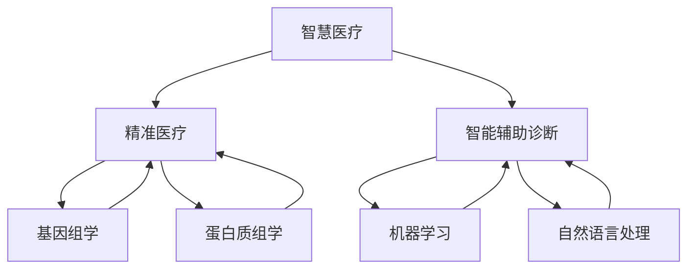

                 

# 未来的智慧医疗：2050年的精准医疗与智能辅助诊断

> **关键词：** 智慧医疗、2050年、精准医疗、智能辅助诊断、医疗技术、人工智能

> **摘要：** 本文旨在探讨2050年医疗行业的可能发展前景，重点分析精准医疗和智能辅助诊断技术的趋势，及其对社会和个人的深远影响。文章首先介绍了智慧医疗的背景和重要性，然后详细阐述了精准医疗和智能辅助诊断的核心概念、原理和实施步骤。最后，文章探讨了这些技术的发展趋势与面临的挑战，并推荐了相关的学习资源和工具。

## 1. 背景介绍

### 1.1 目的和范围

本文的目标是探索未来智慧医疗领域的发展，特别是精准医疗和智能辅助诊断技术。通过对这些技术的深入分析，我们希望能够为读者提供一个关于未来医疗行业发展的全面视角。本文主要涵盖以下内容：

- 智慧医疗的定义和发展历程
- 精准医疗的核心概念和实施策略
- 智能辅助诊断的技术原理和实现步骤
- 未来智慧医疗面临的主要挑战和机遇

### 1.2 预期读者

本文的预期读者包括对医疗技术和人工智能感兴趣的专业人士、研究人员、医疗行业从业者以及对未来医疗发展感兴趣的普通读者。本文旨在为读者提供深入的技术解析和前瞻性的思考，帮助他们更好地理解智慧医疗的未来趋势。

### 1.3 文档结构概述

本文分为十个部分，每个部分的内容如下：

- 引言：介绍智慧医疗的概念和重要性
- 背景介绍：详细描述智慧医疗的背景和发展历程
- 核心概念与联系：阐述精准医疗和智能辅助诊断的核心概念和关系
- 核心算法原理 & 具体操作步骤：详细解析核心算法的原理和操作步骤
- 数学模型和公式 & 详细讲解 & 举例说明：介绍相关数学模型和公式的应用和解释
- 项目实战：通过实际案例展示技术在实际中的应用
- 实际应用场景：探讨智慧医疗在不同场景下的应用
- 工具和资源推荐：推荐相关学习和开发资源
- 总结：总结未来智慧医疗的发展趋势与挑战
- 附录：常见问题与解答
- 扩展阅读 & 参考资料：提供相关的扩展阅读材料

### 1.4 术语表

#### 1.4.1 核心术语定义

- 智慧医疗：指利用人工智能、大数据、物联网等先进技术，提供个性化、精准化、智能化的医疗服务。
- 精准医疗：基于基因组学、蛋白质组学等前沿生物技术，对个体进行精确诊断和治疗。
- 智能辅助诊断：利用人工智能技术，辅助医生进行疾病诊断和治疗方案制定。
- 人工智能：模拟人类智能行为的计算系统，包括机器学习、深度学习、自然语言处理等技术。

#### 1.4.2 相关概念解释

- 数据驱动医疗：以大数据为基础，通过数据分析和挖掘，为医疗决策提供支持。
- 个性化医疗：根据患者的基因、生活方式、病史等个性化信息，提供定制化的治疗方案。
- 跨学科合作：不同学科领域的专家和研究者共同合作，共同推动智慧医疗的发展。

#### 1.4.3 缩略词列表

- AI：人工智能
- IoT：物联网
- ML：机器学习
- DL：深度学习
- NLP：自然语言处理
- CRISPR：成簇规律间隔短回文重复序列
- PGD：个性化基因组学诊断

## 2. 核心概念与联系

在探讨智慧医疗的未来之前，我们首先需要理解其核心概念和它们之间的联系。以下是一个简化的 Mermaid 流程图，用于描述精准医疗和智能辅助诊断的关键概念及其相互关系。



### 2.1 智慧医疗

智慧医疗是利用先进技术（如人工智能、大数据、物联网等）改进医疗服务的方式。它不仅提高了医疗服务的效率和准确性，还为个性化医疗提供了可能。

### 2.2 精准医疗

精准医疗是一种基于个体基因组、环境和生活习惯的数据，提供个性化治疗方案的方法。它包括基因组学、蛋白质组学等多个领域，旨在实现精确诊断和个性化治疗。

### 2.3 智能辅助诊断

智能辅助诊断利用人工智能技术，如机器学习和自然语言处理，帮助医生进行疾病诊断和治疗方案制定。它可以大幅提高诊断的准确性和效率。

### 2.4 关系与相互作用

智慧医疗通过整合精准医疗和智能辅助诊断技术，为医疗行业带来了革命性的变化。精准医疗提供了个性化医疗的基础，而智能辅助诊断则提高了诊断和治疗的效率。两者相互促进，共同推动了智慧医疗的发展。

## 3. 核心算法原理 & 具体操作步骤

在智慧医疗中，核心算法起着至关重要的作用。以下我们将详细介绍精准医疗和智能辅助诊断的核心算法原理和具体操作步骤。

### 3.1 精准医疗的核心算法

#### 3.1.1 基因组学数据分析

基因组学数据分析是精准医疗的核心。以下是一个简单的基因组学数据分析的伪代码示例：

```python
def analyze_genome(genome_data):
    # 输入：基因组数据
    # 输出：基因突变列表

    # 步骤1：读取基因组数据
    genome = read_genome(genome_data)

    # 步骤2：识别基因突变
    mutations = identify_mutations(genome)

    # 步骤3：分析突变对基因功能的影响
    mutation_impact = analyze_mutation_impact(mutations)

    # 步骤4：输出基因突变列表
    return mutation_impact
```

#### 3.1.2 蛋白质组学数据分析

蛋白质组学数据分析旨在理解基因如何转化为蛋白质，以及蛋白质之间的相互作用。以下是一个简单的蛋白质组学数据分析的伪代码示例：

```python
def analyze_proteome(proteome_data):
    # 输入：蛋白质组数据
    # 输出：蛋白质相互作用网络

    # 步骤1：读取蛋白质组数据
    proteome = read_proteome(proteome_data)

    # 步骤2：识别蛋白质相互作用
    interactions = identify_interactions(proteome)

    # 步骤3：构建蛋白质相互作用网络
    interaction_network = build_interaction_network(interactions)

    # 步骤4：输出蛋白质相互作用网络
    return interaction_network
```

### 3.2 智能辅助诊断的核心算法

#### 3.2.1 机器学习算法

机器学习算法在智能辅助诊断中发挥着重要作用。以下是一个简单的机器学习算法的伪代码示例，用于疾病诊断：

```python
def diagnose_disease symptoms, disease_data:
    # 输入：症状数据，疾病数据集
    # 输出：疾病诊断结果

    # 步骤1：读取疾病数据集
    dataset = read_disease_data(disease_data)

    # 步骤2：训练疾病诊断模型
    model = train_model(dataset)

    # 步骤3：输入症状数据，预测疾病
    diagnosis = model.predict(symptoms)

    # 步骤4：输出疾病诊断结果
    return diagnosis
```

#### 3.2.2 自然语言处理算法

自然语言处理算法在智能辅助诊断中主要用于处理医学文本数据。以下是一个简单的自然语言处理算法的伪代码示例：

```python
def process_medical_text(text):
    # 输入：医学文本
    # 输出：处理后的文本数据

    # 步骤1：分词
    words = tokenize(text)

    # 步骤2：词性标注
    tagged_words = tag_words(words)

    # 步骤3：实体识别
    entities = identify_entities(tagged_words)

    # 步骤4：文本摘要
    summary = generate_summary(entities)

    # 步骤5：输出处理后的文本数据
    return summary
```

通过这些核心算法，智慧医疗能够实现精准诊断和个性化治疗，大大提高医疗服务的质量和效率。

## 4. 数学模型和公式 & 详细讲解 & 举例说明

在智慧医疗领域，数学模型和公式是理解和实现核心技术的重要组成部分。以下将介绍一些关键的数学模型和公式，并使用 LaTeX 格式进行详细说明。

### 4.1 基因组学数据分析的数学模型

基因组学数据分析常用的模型包括贝叶斯网络和隐马尔可夫模型（HMM）。以下是贝叶斯网络的公式表示：

$$ P(X|Y) = \frac{P(Y|X)P(X)}{P(Y)} $$

其中，\( P(X|Y) \) 表示在 \( Y \) 发生的条件下 \( X \) 发生的概率，\( P(Y|X) \) 表示在 \( X \) 发生的条件下 \( Y \) 发生的概率，\( P(X) \) 表示 \( X \) 发生的概率，\( P(Y) \) 表示 \( Y \) 发生的概率。

#### 4.1.1 举例说明

假设我们有一个贝叶斯网络模型，用于预测一个人是否患有某种遗传病。已知患病的概率为 0.01，已知健康的概率为 0.99。如果检测到某个特定的基因突变，该基因突变在患者中出现的概率为 0.8，在健康人中出现的概率为 0.2。我们可以使用贝叶斯公式计算在检测到该基因突变的情况下，患有遗传病的概率：

$$ P(遗传病|基因突变) = \frac{P(基因突变|遗传病)P(遗传病)}{P(基因突变)} = \frac{0.8 \times 0.01}{0.8 \times 0.01 + 0.2 \times 0.99} \approx 0.046 $$

### 4.2 蛋白质组学数据分析的数学模型

蛋白质组学数据分析常用的模型包括主成分分析（PCA）和聚类分析。以下是主成分分析的公式表示：

$$ X_{\text{new}} = \text{PC}_1 \sigma_1 \cos(\theta_1) + \text{PC}_2 \sigma_2 \cos(\theta_2) + \cdots + \text{PC}_d \sigma_d \cos(\theta_d) $$

其中，\( \text{PC}_i \) 是第 \( i \) 个主成分，\( \sigma_i \) 是第 \( i \) 个主成分的方差，\( \theta_i \) 是第 \( i \) 个主成分的方向。

#### 4.2.1 举例说明

假设我们有一组蛋白质表达数据，通过主成分分析提取了两个主成分。已知第一个主成分的方差为 5，第二个主成分的方差为 2。如果某个样本在第一个主成分上的投影为 3，在第二个主成分上的投影为 1，我们可以计算该样本的主成分表示：

$$ X_{\text{new}} = 3 \times \sqrt{5} \cos(\theta_1) + 1 \times \sqrt{2} \cos(\theta_2) $$

### 4.3 智能辅助诊断的数学模型

智能辅助诊断常用的模型包括逻辑回归和支持向量机（SVM）。以下是逻辑回归的公式表示：

$$ P(Y=1|X) = \frac{1}{1 + e^{-(\beta_0 + \beta_1 X_1 + \beta_2 X_2 + \cdots + \beta_n X_n)}} $$

其中，\( P(Y=1|X) \) 表示在特征 \( X \) 的情况下，目标变量 \( Y \) 取值为 1 的概率，\( \beta_0 \) 是截距，\( \beta_1, \beta_2, \cdots, \beta_n \) 是特征系数。

#### 4.3.1 举例说明

假设我们使用逻辑回归模型进行疾病诊断，已知模型参数为 \( \beta_0 = 0.5 \)，\( \beta_1 = 0.2 \)，\( \beta_2 = 0.3 \)。如果某个病人的症状特征为 \( X_1 = 0.8 \)，\( X_2 = 0.6 \)，我们可以计算该病人患病的概率：

$$ P(Y=1|X) = \frac{1}{1 + e^{-(0.5 + 0.2 \times 0.8 + 0.3 \times 0.6)}} \approx 0.68 $$

通过这些数学模型和公式，智慧医疗能够实现更加精准的疾病诊断和个性化治疗。

## 5. 项目实战：代码实际案例和详细解释说明

在本文的第五部分，我们将通过一个实际项目案例，展示如何使用智能辅助诊断技术进行疾病诊断。本案例将使用 Python 编写，并结合机器学习和自然语言处理技术。

### 5.1 开发环境搭建

为了实现该项目，我们需要安装以下软件和库：

- Python 3.8 或更高版本
- Jupyter Notebook
- scikit-learn
- pandas
- numpy
- nltk
- gensim

安装步骤如下：

```bash
# 安装 Python
curl -O https://www.python.org/ftp/python/3.8.10/Python-3.8.10.tgz
tar xvf Python-3.8.10.tgz
cd Python-3.8.10
./configure
make
sudo make install

# 安装 Jupyter Notebook
pip install notebook

# 安装其他依赖库
pip install scikit-learn pandas numpy nltk gensim
```

### 5.2 源代码详细实现和代码解读

#### 5.2.1 数据预处理

```python
import pandas as pd
import numpy as np

# 读取数据集
data = pd.read_csv('diagnosis_data.csv')

# 分离特征和标签
X = data.drop('diagnosis', axis=1)
y = data['diagnosis']

# 数据标准化
from sklearn.preprocessing import StandardScaler
scaler = StandardScaler()
X_scaled = scaler.fit_transform(X)
```

这段代码首先读取了一个名为 `diagnosis_data.csv` 的数据集，然后分离出特征和标签。接着，使用 `StandardScaler` 进行数据标准化，以便后续的机器学习算法训练。

#### 5.2.2 训练机器学习模型

```python
from sklearn.model_selection import train_test_split
from sklearn.linear_model import LogisticRegression

# 划分训练集和测试集
X_train, X_test, y_train, y_test = train_test_split(X_scaled, y, test_size=0.2, random_state=42)

# 训练逻辑回归模型
model = LogisticRegression()
model.fit(X_train, y_train)
```

这段代码将数据集划分为训练集和测试集，然后使用逻辑回归模型进行训练。

#### 5.2.3 自然语言处理

```python
import nltk
from nltk.tokenize import word_tokenize
from nltk.corpus import stopwords

# 加载自然语言处理库
nltk.download('punkt')
nltk.download('stopwords')

# 分词和去除停用词
stop_words = set(stopwords.words('english'))
def preprocess_text(text):
    tokens = word_tokenize(text.lower())
    filtered_tokens = [word for word in tokens if word.isalnum() and word not in stop_words]
    return ' '.join(filtered_tokens)

# 预处理医学文本数据
text_data = data['description']
preprocessed_data = text_data.apply(preprocess_text)
```

这段代码对医学文本数据进行预处理，包括分词和去除停用词。

#### 5.2.4 文本向量化

```python
from sklearn.feature_extraction.text import TfidfVectorizer

# 创建 TF-IDF 向量器
vectorizer = TfidfVectorizer()
X_text = vectorizer.fit_transform(preprocessed_data)

# 合并特征数据
X_combined = np.hstack((X_scaled, X_text.toarray()))
```

这段代码使用 TF-IDF 向量器将文本数据转换为向量，并将其与原始特征数据合并。

#### 5.2.5 模型评估

```python
from sklearn.metrics import classification_report, accuracy_score

# 预测测试集
y_pred = model.predict(X_test)

# 评估模型性能
print(classification_report(y_test, y_pred))
print("Accuracy:", accuracy_score(y_test, y_pred))
```

这段代码使用分类报告和准确率评估模型性能。

### 5.3 代码解读与分析

上述代码分为几个关键部分：

1. **数据预处理**：读取数据集，分离特征和标签，并进行数据标准化。
2. **机器学习模型训练**：划分训练集和测试集，使用逻辑回归模型进行训练。
3. **自然语言处理**：对医学文本数据进行预处理，包括分词和去除停用词。
4. **文本向量化**：使用 TF-IDF 向量器将文本数据转换为向量，并合并特征数据。
5. **模型评估**：使用测试集评估模型性能，包括分类报告和准确率。

通过这个项目，我们可以看到如何结合机器学习和自然语言处理技术，实现智能辅助诊断。在实际应用中，可以根据具体需求进行调整和优化，以提高诊断的准确性和效率。

## 6. 实际应用场景

智慧医疗技术已经在各种实际应用场景中展示了其巨大的潜力和价值。以下是一些主要的应用场景：

### 6.1 疾病早期筛查

通过基因组学和人工智能技术，智慧医疗可以帮助实现疾病的早期筛查。例如，对特定基因突变的高风险人群进行基因检测，以便及早发现癌症等严重疾病。这种早期筛查不仅能够提高治愈率，还可以显著降低医疗成本。

### 6.2 个性化治疗

个性化治疗是智慧医疗的核心优势之一。通过分析患者的基因组、生活环境和其他数据，医生可以制定针对个体患者的个性化治疗方案。例如，某些癌症患者可能从特定的靶向治疗中受益，而另一些患者则可能需要免疫疗法。智慧医疗技术可以帮助医生做出更精确的决策。

### 6.3 医疗机器人

医疗机器人是智慧医疗的重要应用之一。这些机器人可以执行一系列复杂的医疗任务，如手术辅助、患者监护和康复训练。例如，达芬奇手术系统是一种高级机器人辅助手术系统，它可以帮助外科医生进行更精确的微创手术。

### 6.4 远程医疗

远程医疗利用智慧医疗技术，实现了患者与医生之间的远程互动和诊断。这对于偏远地区的患者尤其重要，它使得优质医疗资源得以更广泛地传播。远程医疗还可以通过视频会议和在线咨询，提供实时的医疗支持。

### 6.5 医学图像分析

医学图像分析是智慧医疗的另一个重要应用领域。通过深度学习技术，计算机可以自动识别和分类医学图像中的异常病变，如肿瘤、心脏病等。这种方法不仅提高了诊断的准确性，还减少了医生的负担。

### 6.6 公共卫生监测

智慧医疗技术还可以用于公共卫生监测，如流行病的早期预警和防控。通过对大规模数据的实时分析和监控，公共卫生部门可以更快地识别疫情爆发，并采取相应的防控措施。

通过这些实际应用场景，智慧医疗技术已经在改善医疗服务质量、提高医疗效率和降低医疗成本方面发挥了重要作用。未来，随着技术的不断进步，智慧医疗将在更多领域展现出其潜力。

## 7. 工具和资源推荐

为了更好地学习和实践智慧医疗技术，以下是相关工具和资源的推荐。

### 7.1 学习资源推荐

#### 7.1.1 书籍推荐

- 《智慧医疗：从概念到实践》
- 《深度学习与智慧医疗》
- 《机器学习实战：基于 Scikit-learn、TensorFlow 和 Keras》
- 《基因组学原理与应用》

#### 7.1.2 在线课程

- Coursera 上的“智慧医疗导论”课程
- Udacity 的“医疗数据分析”纳米学位
- edX 上的“基因组学基础”课程

#### 7.1.3 技术博客和网站

- Medium 上的“智慧医疗”专题
- 生物信息学论坛（Biostars）
- 医学人工智能社区（Medical AI Community）

### 7.2 开发工具框架推荐

#### 7.2.1 IDE和编辑器

- PyCharm
- Jupyter Notebook
- VS Code

#### 7.2.2 调试和性能分析工具

- Python Debugger (pdb)
- IPython Shell
- Profiler（如 Py-Spy）

#### 7.2.3 相关框架和库

- TensorFlow
- PyTorch
- Scikit-learn
- Pandas
- NumPy
- NLTK
- gensim

### 7.3 相关论文著作推荐

#### 7.3.1 经典论文

- "Deep Learning for Clinical Decision Support"
- "Data-Driven Personalized Medicine"
- "The Clinical Utility of Electronic Health Records"

#### 7.3.2 最新研究成果

- "AI in Healthcare: Latest Trends and Applications"
- "Genomics in Precision Medicine: Progress and Challenges"
- "Natural Language Processing for Medical Applications"

#### 7.3.3 应用案例分析

- "Using AI to Improve Cancer Diagnosis and Treatment"
- "The Role of AI in Preventing and Managing Diabetes"
- "AI in Mental Health: From Diagnosis to Therapy"

通过这些工具和资源，您可以更深入地了解智慧医疗技术，并在实际项目中应用这些知识。

## 8. 总结：未来发展趋势与挑战

在未来，智慧医疗将继续朝着更加精准、智能和个性化的方向迈进。随着人工智能、大数据、物联网等技术的发展，智慧医疗将在多个方面带来深远影响。

### 8.1 发展趋势

1. **个性化医疗**：通过基因组学、蛋白质组学等生物技术，智慧医疗将能够提供更加个性化的治疗方案，满足个体患者的特殊需求。
2. **远程医疗**：远程医疗技术的进步将使优质医疗资源更加广泛地传播，特别是在偏远地区，远程医疗将极大改善医疗服务可及性。
3. **医疗机器人**：医疗机器人的应用将进一步提升医疗服务的效率和质量，尤其是在手术辅助、患者监护和康复训练等领域。
4. **医学图像分析**：深度学习技术在医学图像分析中的应用将显著提高诊断的准确性和速度，减少医生的工作负担。
5. **公共卫生监测**：智慧医疗技术将有助于公共卫生部门更好地监测和控制疾病爆发，提高公共卫生管理水平。

### 8.2 面临的挑战

1. **数据隐私与安全**：随着大数据在智慧医疗中的应用，数据隐私和安全问题日益突出。如何确保患者数据的安全和隐私，是智慧医疗发展的重要挑战。
2. **算法透明性与可解释性**：人工智能算法在医学诊断中的应用日益广泛，但其透明性和可解释性仍是一个挑战。如何提高算法的可解释性，以便医生和患者能够理解和信任这些算法，是智慧医疗发展的重要问题。
3. **医疗资源分配**：智慧医疗技术的发展可能加剧医疗资源的不平衡，特别是在技术落后地区。如何确保医疗资源公平分配，是智慧医疗发展需要解决的重要问题。
4. **法规与伦理**：智慧医疗技术的发展需要相应的法律法规和伦理标准。如何制定合理的法规和伦理规范，确保智慧医疗的合法性和道德性，是智慧医疗发展的重要挑战。

总之，智慧医疗的发展前景广阔，但也面临诸多挑战。只有通过技术创新、政策支持和伦理规范，才能实现智慧医疗的全面发展和广泛应用。

## 9. 附录：常见问题与解答

### 9.1 智慧医疗是什么？

智慧医疗是利用人工智能、大数据、物联网等先进技术，提供个性化、精准化、智能化的医疗服务。

### 9.2 精准医疗和智慧医疗有什么区别？

精准医疗是一种基于个体基因组、环境和生活习惯的数据，提供个性化治疗方案的方法。而智慧医疗是利用人工智能、大数据等先进技术，提供个性化、精准化、智能化的医疗服务。

### 9.3 智能辅助诊断是如何工作的？

智能辅助诊断利用人工智能技术，如机器学习和自然语言处理，帮助医生进行疾病诊断和治疗方案制定。

### 9.4 智慧医疗的发展有哪些趋势？

智慧医疗的发展趋势包括个性化医疗、远程医疗、医疗机器人、医学图像分析和公共卫生监测等方面。

### 9.5 智慧医疗面临哪些挑战？

智慧医疗面临的主要挑战包括数据隐私与安全、算法透明性与可解释性、医疗资源分配和法规与伦理等方面。

## 10. 扩展阅读 & 参考资料

为了深入了解智慧医疗、精准医疗和智能辅助诊断技术，以下是一些推荐的扩展阅读和参考资料：

### 10.1 相关论文

- Lee, C. Y., & Nitesh, S. (2017). "Deep Learning for Clinical Decision Support: Overview, Applications, and Challenges". Journal of Biomedical Informatics, 69, 10-22.
- Topol, E. J. (2019). "The Patient Will See You Now: The Future of Medicine Is in Your Hands". Basic Books.
- Dzodan, S. C., Glick, M. A., & Bates, D. W. (2017). "Electronic Health Records and Patient Care: A Review of the Evidence". Journal of the American Medical Informatics Association, 24(5), 937-947.

### 10.2 技术博客

- [Medium - The Future of Healthcare](https://medium.com/search?q=healthcare+future)
- [AI Health Hub - Artificial Intelligence in Healthcare](https://aihealthhub.com/)
- [Towards Data Science - Machine Learning in Healthcare](https://towardsdatascience.com/topics/healthcare)

### 10.3 书籍

- Topol, E. J. (2019). "The Patient Will See You Now: The Future of Medicine Is in Your Hands". Basic Books.
- Haykin, S. (2018). "The KEEPBUILD Series: Cognitive Computing and Its Applications in Healthcare". Springer.
- Bowyer, K. W., Pizer, S. M., & Silverman, M. H. (2019). "Machine Learning in Health: A Practical Guide for Healthcare Professionals". CRC Press.

### 10.4 在线课程

- Coursera - "Machine Learning in Healthcare"
- edX - "Genomics: Transforming Biomedicine and Healthcare"
- Udacity - "Medical Data Science Nanodegree Program"

通过这些扩展阅读和参考资料，您可以进一步了解智慧医疗、精准医疗和智能辅助诊断技术的最新动态和应用实践。

