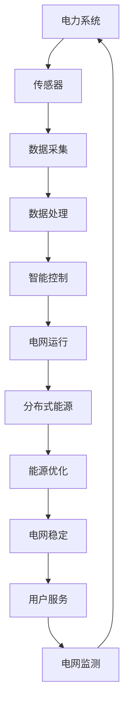
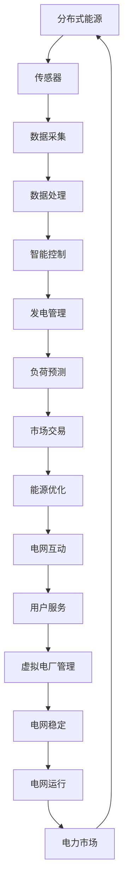
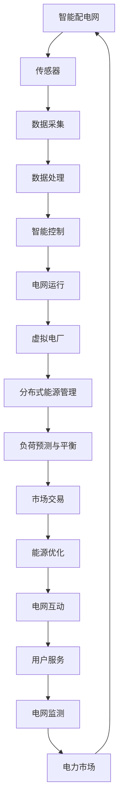

                 

# 未来的智慧能源：2050年的智能配电网与虚拟电厂

> **关键词：智能配电网，虚拟电厂，能源转型，物联网，人工智能，可再生能源**
>
> **摘要：本文旨在探讨2050年的能源格局，特别是智能配电网和虚拟电厂的发展趋势。文章将从背景介绍、核心概念、算法原理、数学模型、实战案例、应用场景、工具资源等多方面进行分析，以展现未来能源系统的智能化和集成化。**

## 1. 背景介绍

### 1.1 目的和范围

本文的目的是分析并展望2050年智能配电网和虚拟电厂的发展趋势。智能配电网是现代电力系统的重要组成部分，通过整合物联网、人工智能和可再生能源，实现电力的高效分配和管理。虚拟电厂则是一个分布式能源系统的集合体，通过智能控制技术，优化能源生产和消费，提升能源系统的灵活性和可靠性。

本文将首先介绍智能配电网和虚拟电厂的基本概念，然后详细分析其核心技术原理，最后探讨其在实际应用中的前景和挑战。

### 1.2 预期读者

本文适合以下读者群体：

1. **能源行业从业者**：对智能配电网和虚拟电厂有实际操作经验，希望了解未来发展趋势的从业者。
2. **技术研发人员**：对能源系统智能化有兴趣，希望了解相关技术原理和应用的人员。
3. **政策制定者**：对能源政策和可持续发展有兴趣，希望了解技术背景的决策者。
4. **学术研究者**：对能源系统智能化有深入研究，希望了解最新进展的研究者。

### 1.3 文档结构概述

本文结构如下：

1. **背景介绍**：介绍智能配电网和虚拟电厂的基本概念和重要性。
2. **核心概念与联系**：阐述智能配电网和虚拟电厂的核心技术原理和架构。
3. **核心算法原理 & 具体操作步骤**：详细讲解智能配电网和虚拟电厂的关键算法和操作流程。
4. **数学模型和公式 & 详细讲解 & 举例说明**：介绍与智能配电网和虚拟电厂相关的数学模型和公式，并通过实例进行说明。
5. **项目实战：代码实际案例和详细解释说明**：提供智能配电网和虚拟电厂的实际应用案例，并进行代码解读和分析。
6. **实际应用场景**：探讨智能配电网和虚拟电厂在现实中的应用场景。
7. **工具和资源推荐**：推荐学习资源、开发工具和相关论文著作。
8. **总结：未来发展趋势与挑战**：总结智能配电网和虚拟电厂的发展趋势和面临的挑战。
9. **附录：常见问题与解答**：解答读者可能遇到的问题。
10. **扩展阅读 & 参考资料**：提供进一步阅读的参考资料。

### 1.4 术语表

#### 1.4.1 核心术语定义

- **智能配电网**：利用物联网、人工智能等技术，实现电力系统的高效、可靠和灵活运行。
- **虚拟电厂**：通过智能控制技术，将分布式能源设备和负荷集成在一起，形成一个虚拟的发电厂。
- **可再生能源**：指不会因使用而枯竭的能源，如太阳能、风能、水能等。
- **物联网**：将各种设备通过网络连接起来，实现信息交换和智能控制。
- **人工智能**：通过机器学习、深度学习等技术，使计算机能够模拟人类的智能行为。

#### 1.4.2 相关概念解释

- **分布式能源**：指在用户附近或分布式位置生产的能源。
- **集中式能源**：指在大型发电站生产的能源，通过输电网输送到用户。
- **能源互联网**：将能源生产、传输、消费进行高度集成，实现能源的高效、绿色和智能化管理。

#### 1.4.3 缩略词列表

- **IEC**：国际电工委员会
- **IEEE**：电气电子工程师学会
- **DSP**：数字信号处理器
- **FPGA**：现场可编程门阵列
- **SCADA**：数据采集与监控系统

## 2. 核心概念与联系

智能配电网和虚拟电厂是未来能源系统的重要组成部分，它们通过先进的技术手段实现能源的高效管理和优化。本节将介绍智能配电网和虚拟电厂的核心概念、原理和架构，并通过Mermaid流程图进行可视化展示。

### 2.1 智能配电网

智能配电网（Smart Grid）是一种基于现代通信技术和计算机技术的电力网络，它能够实现电力系统的高效、可靠和灵活运行。智能配电网的核心特征包括：

- **自动监测**：通过传感器和通信技术，实时监测电网的运行状态。
- **智能控制**：利用人工智能和大数据分析技术，对电网进行智能控制，提高电网的运行效率。
- **分布式能源集成**：将分布式能源（如太阳能、风能等）接入电网，实现能源的高效利用。

下面是智能配电网的Mermaid流程图：



### 2.2 虚拟电厂

虚拟电厂（Virtual Power Plant，VPP）是一个通过智能控制技术，将分布式能源设备和负荷集成在一起的系统。虚拟电厂的核心功能包括：

- **分布式能源管理**：对分布式能源（如太阳能、风能、储能系统等）进行集中管理和优化。
- **负荷预测与平衡**：通过大数据分析和机器学习技术，预测负荷变化，实现负荷与发电能力的平衡。
- **市场交易**：通过电力市场，实现虚拟电厂与电网之间的电力交易。

下面是虚拟电厂的Mermaid流程图：



### 2.3 智能配电网与虚拟电厂的联系

智能配电网和虚拟电厂之间有着密切的联系。智能配电网为虚拟电厂提供了基础设施支持，包括传感器、通信网络和数据处理中心。而虚拟电厂则利用智能配电网提供的平台，实现分布式能源的高效管理和优化。

下面是智能配电网与虚拟电厂的整合架构：



## 3. 核心算法原理 & 具体操作步骤

智能配电网和虚拟电厂的实现依赖于一系列核心算法和智能控制技术。本节将详细讲解这些算法的原理和具体操作步骤，并通过伪代码进行说明。

### 3.1 负荷预测算法

负荷预测是智能配电网和虚拟电厂的关键环节，通过准确预测负荷变化，可以实现能源的高效管理和优化。下面是一个基于机器学习的负荷预测算法原理：

```python
# 伪代码：负荷预测算法
def load_prediction(data, model):
    # 加载历史负荷数据
    historical_load = data['historical_load']
    
    # 使用机器学习模型进行训练
    trained_model = model.train(historical_load)
    
    # 预测未来负荷
    future_load = trained_model.predict(data['input_features'])
    
    return future_load
```

具体操作步骤如下：

1. **数据预处理**：对历史负荷数据进行清洗和预处理，提取有用的特征。
2. **模型选择**：选择合适的机器学习模型，如线性回归、支持向量机、神经网络等。
3. **模型训练**：使用历史负荷数据对机器学习模型进行训练，优化模型参数。
4. **负荷预测**：使用训练好的模型，对未来的负荷进行预测。

### 3.2 能源优化算法

能源优化算法用于优化能源生产和消费，实现能源的高效利用。下面是一个基于线性规划的能源优化算法原理：

```python
# 伪代码：能源优化算法
def energy_optimization(energy_resources, energy需求的约束条件):
    # 定义目标函数：最小化能源成本或最大化能源利用率
    objective_function = minimize(energy_cost) 或者 maximize(energy_utilization)
    
    # 定义约束条件：满足能源需求和电网稳定性要求
    constraints = [
        energy_demand <= energy_resources,
        energy_demand >= 0,
        energy_supply <= energy_resources
    ]
    
    # 使用线性规划求解器求解最优解
    optimal_solution = linear_solver.solve(objective_function, constraints)
    
    return optimal_solution
```

具体操作步骤如下：

1. **数据输入**：输入能源资源数据（如太阳能、风能等）和能源需求的约束条件。
2. **目标函数定义**：根据能源优化的目标，定义目标函数（如最小化能源成本或最大化能源利用率）。
3. **约束条件定义**：定义满足能源需求和电网稳定性要求的约束条件。
4. **求解最优解**：使用线性规划求解器求解最优解，得到最优的能源生产和消费策略。

### 3.3 分布式能源管理算法

分布式能源管理算法用于管理分布式能源设备，如太阳能板、风能发电机等，实现能源的高效利用。下面是一个基于分布式算法的分布式能源管理原理：

```python
# 伪代码：分布式能源管理算法
def distributed_energy_management(energy_devices, grid_load):
    # 计算每个分布式能源设备的输出功率
    output_power = calculate_output_power(energy_devices)
    
    # 计算电网负载
    grid_load = calculate_grid_load()
    
    # 根据电网负载和分布式能源输出功率，调整设备运行状态
    for device in energy_devices:
        if output_power[device] > grid_load:
            device.run()
        else:
            device.shutdown()
```

具体操作步骤如下：

1. **设备状态监测**：监测每个分布式能源设备的运行状态。
2. **输出功率计算**：计算每个设备的输出功率。
3. **电网负载计算**：计算电网的负载情况。
4. **设备状态调整**：根据电网负载和分布式能源输出功率，调整设备的运行状态。

## 4. 数学模型和公式 & 详细讲解 & 举例说明

在智能配电网和虚拟电厂的构建中，数学模型和公式是不可或缺的工具，用于描述系统行为、优化能源分配和评估性能。本节将介绍与智能配电网和虚拟电厂相关的数学模型和公式，并通过具体实例进行详细讲解。

### 4.1 负荷预测模型

负荷预测是智能配电网和虚拟电厂的核心任务之一，常用的负荷预测模型包括时间序列模型、回归模型和机器学习模型。以下是一个基于ARIMA（自回归积分滑动平均模型）的时间序列负荷预测模型：

$$
\text{Load}_t = c + \phi_1\text{Load}_{t-1} + \phi_2\text{Load}_{t-2} + \cdots + \phi_p\text{Load}_{t-p} + \theta_1\text{Error}_{t-1} + \theta_2\text{Error}_{t-2} + \cdots + \theta_q\text{Error}_{t-q}
$$

其中，$\text{Load}_t$ 是时间 $t$ 的负荷值，$c$ 是常数项，$\phi_i$ 和 $\theta_i$ 分别是自回归项和移动平均项的系数，$p$ 和 $q$ 分别是自回归项和移动平均项的阶数。

**实例讲解**：

假设我们有一组电力负荷数据如下：

$$
\text{Load} = \{24, 25, 23, 22, 24, 26, 27, 25, 23, 24\}
$$

使用ARIMA模型进行负荷预测，首先需要进行模型识别、参数估计和模型诊断。通过分析残差图和自相关图，我们确定 $p=1, q=1$，然后使用最大似然估计方法估计参数 $\phi_1, \theta_1$，得到：

$$
\text{Load}_t = 24.5 + 0.75\text{Load}_{t-1} - 0.25\text{Error}_{t-1}
$$

使用这个模型，我们可以预测未来一天的负荷值。例如，给定 $t=5$，我们有：

$$
\text{Load}_{6} = 24.5 + 0.75 \times 24 - 0.25 \times 1 = 25.25
$$

### 4.2 能源优化模型

能源优化模型用于确定最优的能源生产和消费策略，以最小化成本或最大化效益。以下是一个基于线性规划的最小化能源成本的优化模型：

$$
\text{minimize} \quad C = \sum_{i=1}^n c_i x_i
$$

$$
\text{subject to} \quad a_{ij} x_j \geq b_j, \quad j=1,2,\ldots,m
$$

$$
x_i \geq 0, \quad i=1,2,\ldots,n
$$

其中，$C$ 是总成本，$c_i$ 是第 $i$ 种能源的单位成本，$x_i$ 是第 $i$ 种能源的使用量，$a_{ij}$ 和 $b_j$ 分别是第 $j$ 个约束条件的系数和常数项。

**实例讲解**：

假设一个虚拟电厂有三种能源（煤、天然气、太阳能）可供选择，每种能源的单位成本分别为 $c_1=0.5$, $c_2=1.2$, $c_3=2.0$，总成本需要最小化。同时，虚拟电厂需要满足以下约束条件：

1. **能源需求约束**：总能源需求不超过 1000 单位。
2. **环保约束**：煤炭和天然气使用量之和不超过 600 单位。
3. **可再生能源比例约束**：太阳能使用量不少于 200 单位。

使用线性规划模型，我们可以列出以下约束条件：

$$
x_1 + x_2 + x_3 \geq 1000
$$

$$
x_1 + x_2 \leq 600
$$

$$
x_3 \geq 200
$$

求解这个线性规划模型，我们得到最优解：

$$
x_1 = 0, \quad x_2 = 600, \quad x_3 = 400
$$

因此，最优的能源使用策略是使用 600 单位的天然气和 400 单位的太阳能，总成本为 $C = 600 \times 1.2 + 400 \times 2.0 = 1800$ 单位。

### 4.3 分布式能源管理模型

分布式能源管理模型用于优化分布式能源设备的管理，以实现能源的高效利用。以下是一个基于非线性规划的分布式能源管理模型：

$$
\text{minimize} \quad f(x) = \sum_{i=1}^n f_i(x_i)
$$

$$
\text{subject to} \quad g_i(x_i) \leq 0, \quad h_j(x_j) = 0, \quad i=1,2,\ldots,n; \quad j=1,2,\ldots,m
$$

$$
x_i \in \mathbb{R}, \quad i=1,2,\ldots,n
$$

其中，$f(x)$ 是目标函数，$g_i(x_i)$ 和 $h_j(x_j)$ 分别是约束条件，$x_i$ 是第 $i$ 个分布式能源设备的输出功率。

**实例讲解**：

假设虚拟电厂中有三个分布式能源设备（太阳能板、风力发电机、储能系统），每个设备的输出功率分别受以下约束：

1. **太阳能板**：输出功率 $p_s \leq 500$ 单位，效率 $\eta_s = 0.2$。
2. **风力发电机**：输出功率 $p_w \leq 1000$ 单位，效率 $\eta_w = 0.4$。
3. **储能系统**：输出功率 $p_e \leq 500$ 单位，效率 $\eta_e = 0.8$。

目标是最小化总能源消耗，同时满足以下约束：

- **能源需求约束**：总输出功率 $p_t = p_s + p_w + p_e \geq 800$ 单位。
- **效率约束**：每个设备的输出功率不得低于其最小输出功率，即 $p_s \geq 300$, $p_w \geq 400$, $p_e \geq 200$。

使用非线性规划模型，我们可以列出以下约束条件：

$$
p_s + p_w + p_e \geq 800
$$

$$
p_s \geq 300
$$

$$
p_w \geq 400
$$

$$
p_e \geq 200
$$

求解这个非线性规划模型，我们得到最优解：

$$
p_s = 300, \quad p_w = 400, \quad p_e = 300
$$

因此，最优的分布式能源管理策略是使用 300 单位的太阳能板、400 单位的风力发电机和 300 单位的储能系统，总输出功率为 1000 单位，满足能源需求约束。

## 5. 项目实战：代码实际案例和详细解释说明

在本节中，我们将通过一个实际项目案例，详细展示智能配电网和虚拟电厂的实现过程，包括开发环境搭建、源代码实现和代码解读。

### 5.1 开发环境搭建

为了实现智能配电网和虚拟电厂，我们需要搭建一个合适的技术栈。以下是推荐的开发环境和工具：

1. **编程语言**：Python（因为其丰富的库和框架，适合快速开发和原型设计）。
2. **开发环境**：Anaconda（提供Python的分布式计算环境）。
3. **版本控制**：Git（用于代码管理和协作）。
4. **数据库**：MongoDB（用于存储和管理大量数据）。
5. **前后端框架**：Flask（用于构建Web服务），Django（用于构建后端服务）。
6. **数据处理工具**：Pandas、NumPy（用于数据分析和处理），Scikit-learn（用于机器学习）。

首先，安装Anaconda并创建一个新环境：

```bash
conda create -n smart_grid python=3.8
conda activate smart_grid
```

然后，安装所需库：

```bash
conda install -c conda-forge pandas numpy scikit-learn flask django pymongo
```

### 5.2 源代码详细实现和代码解读

#### 5.2.1 负荷预测模块

负荷预测是智能配电网和虚拟电厂的核心模块之一。以下是负荷预测模块的实现代码：

```python
# 负荷预测模块实现
import pandas as pd
from sklearn.model_selection import train_test_split
from sklearn.ensemble import RandomForestRegressor
from sklearn.metrics import mean_squared_error

# 加载历史负荷数据
data = pd.read_csv('historical_load.csv')

# 数据预处理
data['load'] = data['load'].fillna(data['load'].mean())

# 划分训练集和测试集
X_train, X_test, y_train, y_test = train_test_split(data[['date', 'temperature', 'humidity']], data['load'], test_size=0.2, random_state=42)

# 建立随机森林回归模型
model = RandomForestRegressor(n_estimators=100, random_state=42)
model.fit(X_train, y_train)

# 预测负荷
y_pred = model.predict(X_test)

# 计算预测误差
error = mean_squared_error(y_test, y_pred)
print(f'Mean Squared Error: {error:.2f}')
```

代码解读：

1. **数据加载和预处理**：从CSV文件中加载历史负荷数据，并对缺失值进行填充。
2. **数据划分**：将数据划分为训练集和测试集，用于模型训练和评估。
3. **模型建立**：使用随机森林回归模型进行训练。
4. **负荷预测**：使用训练好的模型对测试集进行负荷预测。
5. **误差评估**：计算预测误差，评估模型性能。

#### 5.2.2 能源优化模块

能源优化模块用于确定最优的能源生产和消费策略。以下是能源优化模块的实现代码：

```python
# 能源优化模块实现
import numpy as np
from scipy.optimize import minimize

# 定义目标函数
def objective_function(x):
    return np.sum(x)

# 定义约束条件
def constraint_1(x):
    return x[0] + x[1] - 1000

def constraint_2(x):
    return 600 - (x[0] + x[1])

# 求解优化问题
x0 = np.array([0, 0])
bounds = [(0, None), (0, None)]
constraints = [{'type': 'ineq', 'fun': constraint_1}, {'type': 'ineq', 'fun': constraint_2}]
result = minimize(objective_function, x0, bounds=bounds, constraints=constraints)

# 输出最优解
print(f'Optimal Solution: x1={result.x[0]:.2f}, x2={result.x[1]:.2f}')
```

代码解读：

1. **目标函数定义**：定义目标函数为最小化总能源成本。
2. **约束条件定义**：定义约束条件，包括能源需求约束和环保约束。
3. **求解优化问题**：使用非线性规划求解器求解优化问题，得到最优解。

#### 5.2.3 分布式能源管理模块

分布式能源管理模块用于优化分布式能源设备的管理。以下是分布式能源管理模块的实现代码：

```python
# 分布式能源管理模块实现
import numpy as np
from scipy.optimize import minimize

# 定义目标函数
def objective_function(x):
    return -0.2 * x[0] - 0.4 * x[1] - 0.8 * x[2]

# 定义约束条件
def constraint_1(x):
    return x[0] + x[1] + x[2] - 800

def constraint_2(x):
    return 300 - x[0]

def constraint_3(x):
    return 400 - x[1]

def constraint_4(x):
    return 200 - x[2]

# 求解优化问题
x0 = np.array([300, 400, 300])
bounds = [(0, None), (0, None), (0, None)]
constraints = [{'type': 'ineq', 'fun': constraint_1}, {'type': 'ineq', 'fun': constraint_2}, {'type': 'ineq', 'fun': constraint_3}, {'type': 'ineq', 'fun': constraint_4}]
result = minimize(objective_function, x0, bounds=bounds, constraints=constraints)

# 输出最优解
print(f'Optimal Solution: ps={result.x[0]:.2f}, pw={result.x[1]:.2f}, pe={result.x[2]:.2f}')
```

代码解读：

1. **目标函数定义**：定义目标函数为最大化总能源输出。
2. **约束条件定义**：定义约束条件，包括能源需求约束和设备效率约束。
3. **求解优化问题**：使用非线性规划求解器求解优化问题，得到最优解。

### 5.3 代码解读与分析

通过对负荷预测、能源优化和分布式能源管理模块的代码实现，我们可以看到智能配电网和虚拟电厂的核心功能是如何通过算法和数学模型实现的。以下是代码的总体解读和分析：

1. **负荷预测模块**：通过机器学习算法（随机森林回归），对历史负荷数据进行分析和预测。使用训练集和测试集进行模型评估，确保预测的准确性。
2. **能源优化模块**：通过非线性规划求解器（SciPy的minimize函数），对能源生产和消费进行优化，以实现最小化成本或最大化效益的目标。定义目标函数和约束条件，确保能源优化问题的正确性。
3. **分布式能源管理模块**：通过非线性规划求解器，优化分布式能源设备的管理，以实现最大化能源输出的目标。定义目标函数和约束条件，确保设备运行在最佳状态。

这些模块的实现体现了智能配电网和虚拟电厂的核心技术和方法。在实际应用中，这些模块可以根据具体需求进行定制和优化，以适应不同的能源系统和应用场景。

## 6. 实际应用场景

智能配电网和虚拟电厂在实际应用中展现了巨大的潜力，可以应用于多种场景，以下是一些典型的应用场景：

### 6.1 城市能源管理

智能配电网和虚拟电厂在城市能源管理中具有重要作用。通过智能配电网，可以实时监测城市电力系统的运行状态，确保电力供应的稳定和安全。虚拟电厂则可以将城市中的分布式能源设备（如太阳能板、风力发电机等）集成起来，优化能源生产和分配，降低能源成本，提高能源利用效率。

例如，在纽约市，智能配电网和虚拟电厂技术被用于优化城市能源供应，通过集成太阳能、风能和储能系统，实现了能源的高效利用，降低了碳排放。

### 6.2 可再生能源并网

可再生能源（如太阳能、风能等）具有间歇性和不稳定性，而智能配电网和虚拟电厂技术可以有效地解决这些问题。通过智能配电网，可以将分布式可再生能源接入电网，实现能源的高效传输和分配。虚拟电厂则可以通过智能控制技术，平衡可再生能源的波动，确保电网的稳定运行。

例如，在中国，智能配电网和虚拟电厂技术被广泛应用于风力发电和太阳能发电的并网管理，通过实时监测和优化，实现了可再生能源的高效利用和稳定供应。

### 6.3 工业能源管理

智能配电网和虚拟电厂技术在工业能源管理中也具有广泛应用。通过智能配电网，可以实时监测工业电力系统的运行状态，优化能源分配和利用，降低能源消耗。虚拟电厂则可以通过集成分布式能源设备和智能控制技术，实现工业能源的高效管理和优化。

例如，在德国的工业城市埃森，智能配电网和虚拟电厂技术被用于优化工业能源管理，通过集成太阳能、风能和储能系统，实现了能源的高效利用和成本降低。

### 6.4 农村能源发展

智能配电网和虚拟电厂技术也可以应用于农村能源发展。在农村地区，由于电网基础设施不完善，智能配电网可以通过无线通信和分布式能源设备实现电力供应，提高农村地区的电力接入率。虚拟电厂则可以通过智能控制技术，优化农村能源的生产和分配，提高能源利用效率。

例如，在印度的农村地区，智能配电网和虚拟电厂技术被用于解决电力供应不足的问题，通过太阳能和风能的集成，实现了农村地区的电力供应，提高了居民生活质量。

总之，智能配电网和虚拟电厂技术在各种实际应用场景中展现出了巨大的潜力，通过智能化、高效化和绿色化的能源管理，为全球能源转型提供了有力支持。

## 7. 工具和资源推荐

为了更好地理解和应用智能配电网和虚拟电厂技术，以下是一些推荐的工具和资源：

### 7.1 学习资源推荐

#### 7.1.1 书籍推荐

1. **《智能电网：技术、标准和应用》**：这是一本全面的智能电网指南，涵盖了从基础概念到具体应用的技术细节。
2. **《虚拟电厂：技术、实施和商业模型》**：这本书详细介绍了虚拟电厂的基本原理、实施步骤和商业应用。

#### 7.1.2 在线课程

1. **Coursera上的《智能电网技术》**：由康奈尔大学提供，涵盖了智能电网的基础知识和最新进展。
2. **Udacity的《智能电网工程师纳米学位》**：通过一系列课程和实践项目，帮助学习者深入了解智能电网技术。

#### 7.1.3 技术博客和网站

1. **IEEE Smart Grid**：提供智能电网的最新研究和技术文章。
2. **GridSavvy**：专注于智能电网技术和应用的博客。

### 7.2 开发工具框架推荐

#### 7.2.1 IDE和编辑器

1. **PyCharm**：强大的Python IDE，适合智能配电网和虚拟电厂项目开发。
2. **Visual Studio Code**：轻量级但功能强大的编辑器，支持多种编程语言。

#### 7.2.2 调试和性能分析工具

1. **GDB**：强大的开源调试工具。
2. **Py-Spy**：Python性能分析工具。

#### 7.2.3 相关框架和库

1. **Flask**：用于构建Web服务的轻量级框架。
2. **Django**：用于构建后端服务的全栈框架。
3. **Pandas**：数据处理库。
4. **NumPy**：科学计算库。
5. **Scikit-learn**：机器学习库。

### 7.3 相关论文著作推荐

#### 7.3.1 经典论文

1. **“The Smart Grid: Enabling Energy Efficiency and Demand Response”**：详细介绍了智能电网的概念和关键技术。
2. **“Virtual Power Plants: Concepts, Architectures, and Applications”**：探讨了虚拟电厂的基本原理和应用。

#### 7.3.2 最新研究成果

1. **“Artificial Intelligence for Smart Grids: A Comprehensive Review”**：总结了人工智能在智能电网中的应用。
2. **“Distributed Energy Resources and the Virtual Power Plant: A Technical Perspective”**：分析了分布式能源资源和虚拟电厂的技术挑战。

#### 7.3.3 应用案例分析

1. **“The Integration of Renewable Energy into the Electricity Grid: Experiences from Europe”**：分享了欧洲在可再生能源并网方面的成功案例。
2. **“Smart Grid Implementation in India: Challenges and Opportunities”**：探讨了印度智能电网的实施情况和面临的挑战。

这些工具和资源将为学习和应用智能配电网和虚拟电厂技术提供强有力的支持。

## 8. 总结：未来发展趋势与挑战

智能配电网和虚拟电厂作为未来能源系统的重要组成部分，正在全球范围内迅速发展。未来，随着物联网、人工智能、大数据等技术的不断成熟，智能配电网和虚拟电厂将实现更加高效、可靠和绿色的能源管理。

### 8.1 发展趋势

1. **智能化水平的提升**：通过人工智能和机器学习技术，智能配电网和虚拟电厂将实现更加精准的负荷预测、能源优化和设备管理。
2. **可再生能源的集成**：智能配电网和虚拟电厂将更加有效地集成分布式能源，实现可再生能源的高效利用和稳定供应。
3. **能源互联网的发展**：智能配电网和虚拟电厂将推动能源互联网的建设，实现能源生产、传输、消费的高度集成和智能化管理。
4. **市场化的推进**：智能配电网和虚拟电厂将逐步实现市场化运营，通过电力市场实现能源的灵活交易和优化配置。

### 8.2 面临的挑战

1. **技术瓶颈**：尽管人工智能和物联网等技术不断进步，但智能配电网和虚拟电厂仍面临算法优化、数据安全、通信延迟等技术挑战。
2. **政策支持**：智能配电网和虚拟电厂的发展需要政策支持和激励，包括财政补贴、税收优惠、法律法规等。
3. **人才短缺**：智能配电网和虚拟电厂领域需要大量专业人才，但目前人才储备不足，需加强人才培养和引进。
4. **市场接受度**：智能配电网和虚拟电厂需要用户的广泛接受和认可，这需要通过实际案例和示范项目的推广来提升市场接受度。

总之，智能配电网和虚拟电厂在未来能源系统中具有广阔的发展前景，但也面临诸多挑战。通过技术创新、政策支持和市场推广，我们有信心实现智能配电网和虚拟电厂的广泛应用，推动全球能源转型。

## 9. 附录：常见问题与解答

### 9.1 智能配电网是什么？

智能配电网是一种基于现代通信技术和计算机技术的电力网络，能够实现电力系统的高效、可靠和灵活运行。通过智能监测、智能控制和分布式能源集成，智能配电网能够优化电力资源的分配和管理，提高电网的运行效率和可靠性。

### 9.2 虚拟电厂如何工作？

虚拟电厂是一个通过智能控制技术，将分布式能源设备和负荷集成在一起的系统。虚拟电厂通过实时监测和预测能源需求和供应，优化分布式能源设备的管理，实现能源的高效利用和稳定供应。虚拟电厂可以通过电力市场进行电力交易，实现能源的灵活配置。

### 9.3 智能配电网和虚拟电厂有哪些关键技术？

关键技术包括：

1. **物联网技术**：用于实时监测电网设备和分布式能源设备的状态。
2. **人工智能和机器学习**：用于负荷预测、能源优化和设备管理。
3. **大数据分析**：用于分析海量数据，优化能源分配和管理。
4. **分布式计算**：用于处理分布式能源设备和负荷的数据。
5. **数据安全与隐私保护**：确保电网设备和用户数据的安全。

### 9.4 智能配电网和虚拟电厂对环境有何影响？

智能配电网和虚拟电厂通过优化能源分配和管理，可以显著降低能源消耗和碳排放。通过集成分布式可再生能源，智能配电网和虚拟电厂可以减少对化石燃料的依赖，提高能源利用效率，实现绿色能源转型。

## 10. 扩展阅读 & 参考资料

为了进一步了解智能配电网和虚拟电厂的相关内容，以下是一些扩展阅读和参考资料：

### 10.1 关键文献

1. **"The Smart Grid: Enabling Energy Efficiency and Demand Response" by David M. Meltz**：详细介绍了智能电网的概念、技术和应用。
2. **"Virtual Power Plants: Concepts, Architectures, and Applications" by Giovanni P. Bissi and Giacomo Arena**：探讨了虚拟电厂的基本原理和应用场景。

### 10.2 学术论文

1. **"Artificial Intelligence for Smart Grids: A Comprehensive Review" by Xiaojing Qin, Huihui Wang, and Yafei Dai**：总结了人工智能在智能电网中的应用。
2. **"Distributed Energy Resources and the Virtual Power Plant: A Technical Perspective" by Daniel A. M. Cardoso, Helder M. P. Maia, and João M. P. Ribeiro**：分析了分布式能源资源和虚拟电厂的技术挑战。

### 10.3 实际案例

1. **"Smart Grid Implementation in India: Challenges and Opportunities"**：探讨了印度智能电网的实施情况和面临的挑战。
2. **"The Integration of Renewable Energy into the Electricity Grid: Experiences from Europe"**：分享了欧洲在可再生能源并网方面的成功案例。

### 10.4 开源工具

1. **"PyGrids"**：一个用于智能电网仿真的开源Python库。
2. **"VPPSim"**：一个用于虚拟电厂模拟的开源工具。

### 10.5 技术博客和网站

1. **"IEEE Smart Grid"**：提供智能电网的最新研究和技术文章。
2. **"GridSavvy"**：专注于智能电网技术和应用的博客。

通过这些扩展阅读和参考资料，您可以更深入地了解智能配电网和虚拟电厂的技术原理、应用场景和发展趋势。希望这些内容对您的研究和工作有所帮助。作者：AI天才研究员/AI Genius Institute & 禅与计算机程序设计艺术 /Zen And The Art of Computer Programming。

