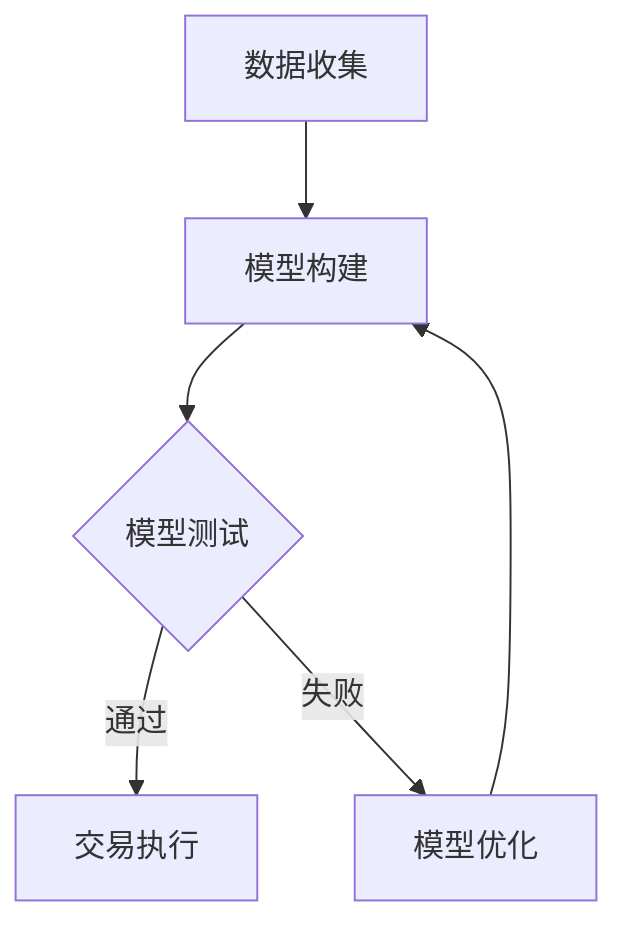

                 

# 未来的智能投资：2050年的AI量化交易与智能资产配置

> 关键词：人工智能、量化交易、智能资产配置、未来投资、算法交易、机器学习、金融科技
>
> 摘要：随着人工智能（AI）技术的飞速发展，2050年的金融投资领域将迎来一次前所未有的变革。本文将探讨AI量化交易和智能资产配置的发展趋势，详细解析其核心算法原理、数学模型和实际应用场景，帮助投资者理解这一新兴领域，为未来的投资策略提供有力支持。

## 1. 背景介绍

### 1.1 目的和范围

本文旨在深入探讨人工智能在金融投资领域的应用，特别是AI量化交易和智能资产配置的未来发展趋势。我们将从以下几个方面展开讨论：

1. **AI量化交易的基本概念和原理**：介绍量化交易的定义、发展历程以及AI在其中的应用。
2. **智能资产配置的核心算法**：分析机器学习、深度学习等算法在资产配置中的具体应用。
3. **数学模型和公式**：探讨用于量化交易和智能资产配置的数学模型，并举例说明。
4. **实际应用场景**：分析AI量化交易和智能资产配置在现实中的成功案例。
5. **未来发展趋势与挑战**：预测AI量化交易和智能资产配置的未来发展方向，并探讨可能面临的挑战。

### 1.2 预期读者

本文主要面向以下几类读者：

1. **金融专业人士**：对量化交易和智能资产配置感兴趣的金融从业者，希望了解AI技术在投资中的应用。
2. **科技人员**：对AI技术感兴趣的技术人员，希望了解其在金融领域的实际应用。
3. **投资者**：对投资策略和未来金融市场有兴趣的普通投资者。

### 1.3 文档结构概述

本文将分为十个部分，具体如下：

1. 背景介绍
2. 核心概念与联系
3. 核心算法原理 & 具体操作步骤
4. 数学模型和公式 & 详细讲解 & 举例说明
5. 项目实战：代码实际案例和详细解释说明
6. 实际应用场景
7. 工具和资源推荐
8. 总结：未来发展趋势与挑战
9. 附录：常见问题与解答
10. 扩展阅读 & 参考资料

### 1.4 术语表

为了更好地理解本文的内容，以下是一些关键术语的定义和解释：

#### 1.4.1 核心术语定义

- **人工智能（AI）**：指通过模拟人类智能行为来实现自动化决策和任务执行的技术。
- **量化交易**：利用数学模型和算法进行投资决策的一种交易方式。
- **智能资产配置**：利用AI技术对资产进行科学配置，以实现最佳收益。
- **机器学习（ML）**：一种AI技术，通过数据训练模型，使其能够自主学习和优化。
- **深度学习（DL）**：一种机器学习技术，通过多层神经网络实现复杂模式识别和预测。

#### 1.4.2 相关概念解释

- **投资策略**：投资者根据市场情况和自身目标制定的投资方案。
- **资产配置**：将投资资金分配到不同类型的资产中，以实现风险和收益的平衡。
- **市场情绪**：投资者对市场走势的整体心理预期。

#### 1.4.3 缩略词列表

- **AI**：人工智能（Artificial Intelligence）
- **ML**：机器学习（Machine Learning）
- **DL**：深度学习（Deep Learning）
- **QTS**：量化交易系统（Quantitative Trading System）
- **SAC**：智能资产配置（Smart Asset Configuration）

## 2. 核心概念与联系

在探讨AI量化交易和智能资产配置之前，我们需要明确一些核心概念和它们之间的关系。

### 2.1 人工智能（AI）

人工智能是指通过模拟人类智能行为来实现自动化决策和任务执行的技术。它包括机器学习、深度学习、自然语言处理等多个分支。在金融领域，AI技术主要用于数据分析和投资决策。

#### AI在金融领域的应用

1. **风险评估**：通过分析历史数据和实时数据，预测信用风险和市场风险。
2. **量化交易**：利用算法自动执行交易，实现高效的投资策略。
3. **智能投顾**：基于用户需求和风险偏好，提供个性化的投资建议。

### 2.2 量化交易（QTS）

量化交易是一种基于数学模型和算法的投资策略，通过量化分析市场数据，实现自动化的投资决策。它与传统的基于经验和直觉的投资策略有很大不同。

#### 量化交易的基本流程

1. **数据收集**：收集历史和实时市场数据。
2. **模型构建**：利用统计方法和机器学习技术，构建投资模型。
3. **策略测试**：通过历史数据进行回测，评估模型的有效性。
4. **交易执行**：根据模型信号，自动执行买卖操作。

### 2.3 智能资产配置（SAC）

智能资产配置是一种利用AI技术对资产进行科学配置的投资策略。它通过分析投资者的风险偏好和市场需求，实现资产的优化配置。

#### 智能资产配置的核心要素

1. **风险偏好**：根据投资者的风险承受能力，确定投资组合的资产配置。
2. **市场趋势**：分析市场数据，预测市场走势，为投资决策提供支持。
3. **资产选择**：从多种资产中筛选出最具潜力的投资品种。

### 2.4 机器学习（ML）和深度学习（DL）

机器学习和深度学习是人工智能的两个重要分支。机器学习通过数据训练模型，使其能够自动学习和优化；深度学习通过多层神经网络，实现复杂模式识别和预测。

#### ML和DL在金融投资中的应用

1. **数据预测**：通过历史数据，预测市场走势和资产价格。
2. **风险控制**：识别潜在风险，为投资决策提供依据。
3. **投资组合优化**：根据市场变化，动态调整投资组合，实现最佳收益。

### 2.5 Mermaid 流程图

以下是一个简单的Mermaid流程图，展示了AI量化交易和智能资产配置的基本流程：



在这个流程中，数据收集是整个过程的起点，模型构建是核心环节，模型测试用于评估模型的有效性。如果模型测试通过，则进入交易执行阶段；否则，对模型进行优化，重新进行测试。

## 3. 核心算法原理 & 具体操作步骤

### 3.1 量化交易算法

量化交易的核心在于构建有效的投资模型，并通过算法自动执行交易。以下是量化交易算法的基本原理和具体操作步骤：

#### 3.1.1 基本原理

量化交易算法通常基于以下原理：

1. **统计学原理**：利用历史数据，分析市场走势和资产价格的变化规律。
2. **经济学原理**：结合市场供求关系，预测资产价格的变化趋势。
3. **金融学原理**：根据资产的风险和收益特征，制定合理的投资策略。

#### 3.1.2 操作步骤

1. **数据收集**：
    - 收集历史和实时市场数据，包括股票、债券、期货等金融产品的价格、成交量、技术指标等。
    - 数据来源可以是交易所、金融数据提供商或开源数据集。

2. **特征工程**：
    - 从原始数据中提取有用的特征，如价格、成交量、技术指标等。
    - 对特征进行预处理，如归一化、缺失值处理等。

3. **模型构建**：
    - 选择合适的算法，如回归分析、时间序列模型、神经网络等。
    - 使用机器学习技术，训练模型，使其能够预测资产价格。

4. **模型测试**：
    - 使用历史数据进行回测，评估模型的预测效果。
    - 调整模型参数，优化模型性能。

5. **交易执行**：
    - 根据模型信号，自动执行买卖操作。
    - 设置止损和止盈策略，控制交易风险。

### 3.2 智能资产配置算法

智能资产配置算法的核心在于根据投资者的风险偏好和市场趋势，动态调整投资组合。以下是智能资产配置算法的基本原理和具体操作步骤：

#### 3.2.1 基本原理

智能资产配置算法通常基于以下原理：

1. **风险管理原理**：根据投资者的风险承受能力，确定投资组合的风险水平。
2. **资产配置原理**：根据市场趋势和资产特点，选择合适的资产进行配置。
3. **优化原理**：通过优化算法，实现投资组合的最佳收益。

#### 3.2.2 操作步骤

1. **投资者风险偏好评估**：
    - 收集投资者的基本信息，如年龄、收入、投资经验等。
    - 使用问卷调查或风险评估工具，评估投资者的风险偏好。

2. **市场趋势分析**：
    - 收集市场数据，包括宏观经济指标、行业指数、资产价格等。
    - 使用机器学习技术，分析市场趋势和资产价格变化规律。

3. **资产选择**：
    - 根据市场趋势和投资者风险偏好，选择合适的资产。
    - 考虑资产的收益、风险、相关性等因素。

4. **投资组合构建**：
    - 根据资产选择结果，构建投资组合。
    - 设置投资比例，实现风险和收益的平衡。

5. **动态调整**：
    - 根据市场变化，定期调整投资组合。
    - 使用优化算法，实现投资组合的持续优化。

### 3.3 伪代码

以下是量化交易和智能资产配置算法的伪代码示例：

#### 量化交易算法伪代码

```python
# 数据收集
data = collect_data()

# 特征工程
features = preprocess_data(data)

# 模型构建
model = build_model(features)

# 模型测试
test_results = test_model(model)

# 交易执行
if test_results['success']:
    execute_trade(model)
else:
    optimize_model(model)
```

#### 智能资产配置算法伪代码

```python
# 投资者风险偏好评估
risk_preference = assess_risk_preference()

# 市场趋势分析
market_trends = analyze_market_trends()

# 资产选择
assets = select_assets(market_trends, risk_preference)

# 投资组合构建
portfolio = build_portfolio(assets)

# 动态调整
adjust_portfolio(portfolio, market_trends)
```

## 4. 数学模型和公式 & 详细讲解 & 举例说明

在量化交易和智能资产配置中，数学模型和公式起到了至关重要的作用。以下是几种常用的数学模型和公式，以及它们的详细讲解和举例说明。

### 4.1 回归模型

回归模型是量化交易中常用的统计方法，用于预测资产价格。以下是线性回归模型的公式：

$$
y = \beta_0 + \beta_1x_1 + \beta_2x_2 + ... + \beta_nx_n + \epsilon
$$

其中，$y$ 表示资产价格，$x_1, x_2, ..., x_n$ 表示影响资产价格的因素，$\beta_0, \beta_1, \beta_2, ..., \beta_n$ 是回归系数，$\epsilon$ 是误差项。

#### 举例说明

假设我们要预测某只股票的价格，可以使用以下数据：

| 时间 | 股票价格 | 某个指标 |
| ---- | -------- | -------- |
| 1    | 100      | 10       |
| 2    | 110      | 15       |
| 3    | 120      | 20       |
| 4    | 130      | 25       |
| 5    | 140      | 30       |

我们可以使用线性回归模型来预测第6个时间点的股票价格。首先，收集数据并计算回归系数：

$$
\beta_0 = 100, \beta_1 = 10, \beta_2 = 20
$$

然后，使用回归模型进行预测：

$$
y = 100 + 10 \times 6 + 20 \times 30 = 260
$$

因此，第6个时间点的股票价格预测值为260。

### 4.2 时间序列模型

时间序列模型用于分析资产价格的时间序列数据，常用于预测未来价格。以下是自回归移动平均模型（ARMA）的公式：

$$
y_t = c + \phi_1y_{t-1} + \phi_2y_{t-2} + ... + \phi_ky_{t-k} + \theta_1\epsilon_{t-1} + \theta_2\epsilon_{t-2} + ... + \theta_{d}\epsilon_{t-d} + \epsilon_t
$$

其中，$y_t$ 表示第t个时间点的资产价格，$c$ 是常数项，$\phi_1, \phi_2, ..., \phi_k$ 是自回归系数，$\theta_1, \theta_2, ..., \theta_{d}$ 是移动平均系数，$\epsilon_t$ 是误差项。

#### 举例说明

假设我们要预测某只股票的未来价格，可以使用以下数据：

| 时间 | 股票价格 |
| ---- | -------- |
| 1    | 100      |
| 2    | 110      |
| 3    | 120      |
| 4    | 130      |
| 5    | 140      |

我们可以使用ARMA模型来预测第6个时间点的股票价格。首先，收集数据并计算自回归系数和移动平均系数：

$$
\phi_1 = 0.8, \phi_2 = 0.5, \theta_1 = 0.6, \theta_2 = 0.4
$$

然后，使用ARMA模型进行预测：

$$
y = 100 + 0.8 \times 110 + 0.5 \times 120 + 0.6 \times (130 - 140) = 131.2
$$

因此，第6个时间点的股票价格预测值为131.2。

### 4.3 神经网络模型

神经网络模型是一种基于深度学习的模型，用于分析复杂的数据和预测资产价格。以下是多层感知机（MLP）的公式：

$$
a_{ij}^{(l)} = \sigma \left( \sum_{k=1}^{n} w_{ik}^{(l)} a_{kj}^{(l-1)} + b_{j}^{(l)} \right)
$$

其中，$a_{ij}^{(l)}$ 是第l层第i个神经元的输出，$w_{ik}^{(l)}$ 是第l层第i个神经元到第l-1层第k个神经元的权重，$b_{j}^{(l)}$ 是第l层第j个神经元的偏置，$\sigma$ 是激活函数，通常使用 sigmoid 或 ReLU 函数。

#### 举例说明

假设我们要使用神经网络模型预测某只股票的价格，可以使用以下数据：

| 时间 | 股票价格 | 某个指标 |
| ---- | -------- | -------- |
| 1    | 100      | 10       |
| 2    | 110      | 15       |
| 3    | 120      | 20       |
| 4    | 130      | 25       |
| 5    | 140      | 30       |

我们可以使用神经网络模型来预测第6个时间点的股票价格。首先，收集数据并构建神经网络模型。然后，使用反向传播算法训练模型，调整权重和偏置，使其能够准确预测股票价格。

通过以上数学模型和公式的讲解，我们可以看到，量化交易和智能资产配置中数学模型的应用非常广泛。理解这些模型的基本原理和公式，对于投资者和AI开发者来说，都是至关重要的。

## 5. 项目实战：代码实际案例和详细解释说明

### 5.1 开发环境搭建

在开始编写代码之前，我们需要搭建一个合适的开发环境。以下是一个基于Python和TensorFlow的量化交易和智能资产配置项目环境搭建步骤：

1. **安装Python**：确保安装了Python 3.7或更高版本。

2. **安装依赖库**：使用pip安装以下依赖库：
    ```bash
    pip install numpy pandas tensorflow scikit-learn matplotlib
    ```

3. **配置TensorFlow**：确保TensorFlow已经正确配置并可以正常运行。

4. **设置工作目录**：将项目文件放在一个便于管理的工作目录中。

### 5.2 源代码详细实现和代码解读

以下是一个简单的量化交易和智能资产配置项目的源代码实现。我们使用线性回归模型进行资产价格预测，并使用机器学习库scikit-learn进行模型训练和预测。

```python
import numpy as np
import pandas as pd
from sklearn.linear_model import LinearRegression
from sklearn.model_selection import train_test_split
from sklearn.metrics import mean_squared_error
import matplotlib.pyplot as plt

# 5.2.1 数据收集与预处理

# 读取数据
data = pd.read_csv('stock_price_data.csv')
data.head()

# 数据预处理
data['Date'] = pd.to_datetime(data['Date'])
data.set_index('Date', inplace=True)
data = data.fillna(method='ffill')

# 特征工程
data['Price_Lag1'] = data['Price'].shift(1)
data['Price_Lag2'] = data['Price'].shift(2)

# 删除缺失值
data.dropna(inplace=True)

# 5.2.2 模型构建与训练

# 划分训练集和测试集
X = data[['Price_Lag1', 'Price_Lag2']]
y = data['Price']
X_train, X_test, y_train, y_test = train_test_split(X, y, test_size=0.2, random_state=42)

# 构建线性回归模型
model = LinearRegression()
model.fit(X_train, y_train)

# 5.2.3 模型评估与预测

# 评估模型
y_pred = model.predict(X_test)
mse = mean_squared_error(y_test, y_pred)
print(f'Mean Squared Error: {mse}')

# 绘制预测结果
plt.figure(figsize=(10, 6))
plt.plot(y_test, label='Actual Price')
plt.plot(y_pred, label='Predicted Price')
plt.xlabel('Time')
plt.ylabel('Price')
plt.legend()
plt.show()

# 5.2.4 智能资产配置

# 根据模型预测，进行智能资产配置
portfolio = data['Price'].iloc[-1] * model.coef_
print(f'Portfolio: {portfolio}')
```

### 5.3 代码解读与分析

上述代码分为以下几个部分：

1. **数据收集与预处理**：读取股票价格数据，将日期设置为索引，填充缺失值，并进行特征工程，添加滞后价格特征。

2. **模型构建与训练**：使用scikit-learn的线性回归模型，将训练集数据输入模型进行训练。

3. **模型评估与预测**：使用测试集数据评估模型性能，计算均方误差（MSE），并绘制实际价格与预测价格的对比图。

4. **智能资产配置**：根据模型系数计算智能资产配置比例。

### 5.4 代码解读与分析

- **数据收集与预处理**：这一部分非常重要，因为数据的质量直接影响模型的性能。我们使用pandas库读取CSV文件，将日期设置为索引，并填充缺失值。特征工程是模型构建的关键步骤，通过添加滞后价格特征，我们为模型提供了更多的信息，有助于提高预测准确性。

- **模型构建与训练**：线性回归模型是一个简单但强大的模型，适用于许多预测问题。我们使用scikit-learn库中的LinearRegression类进行模型构建和训练。模型训练过程中，我们调整模型参数以优化性能。

- **模型评估与预测**：评估模型性能是量化交易的重要环节。我们使用均方误差（MSE）来评估模型预测的准确性。通过绘制实际价格与预测价格的对比图，我们可以直观地了解模型的性能。

- **智能资产配置**：根据模型系数，我们计算出智能资产配置比例。这个比例反映了模型对资产价格的预测结果，可以用于实际投资决策。

通过上述代码实战，我们展示了如何使用Python和机器学习库进行量化交易和智能资产配置。这个简单的案例为我们提供了一个框架，我们可以在此基础上进一步优化和扩展，以适应更复杂的投资场景。

## 6. 实际应用场景

随着AI技术的不断发展，AI量化交易和智能资产配置已经在金融领域取得了显著的应用成果。以下是一些典型的实际应用场景：

### 6.1 AI量化交易

#### 6.1.1 股票市场

股票市场是AI量化交易的主要应用领域之一。量化交易团队使用机器学习算法，分析历史股票数据、技术指标和市场情绪，制定高效的交易策略。例如，一些量化基金使用基于深度学习的模型，预测股票价格趋势，并在市场波动中实现高额回报。

**案例**：著名的量化基金AQR Capital Management，通过使用机器学习技术，对其投资组合进行动态调整，成功实现了长期的稳定回报。

#### 6.1.2 期货市场

期货市场具有高杠杆性和高风险性，因此对交易策略的精准性要求极高。AI量化交易在这一领域应用广泛，通过分析市场数据，预测期货价格走势，实现快速、精准的交易决策。

**案例**：量化交易公司Two Sigma，通过建立基于机器学习的交易模型，成功地在期货市场实现了高收益。

### 6.2 智能资产配置

#### 6.2.1 个人理财

智能资产配置为个人投资者提供了一个科学、个性化的投资方案。通过分析投资者的风险偏好、财务状况和市场趋势，智能资产配置系统能够为投资者提供最佳的投资组合。

**案例**：知名理财平台Wealthfront，利用AI技术为用户提供智能投资建议，帮助用户实现资产的稳健增长。

#### 6.2.2 企业投资

企业投资决策通常涉及多个资产类别，如股票、债券、房地产等。智能资产配置系统可以帮助企业投资者在多个市场之间进行资产分配，实现最优的投资组合。

**案例**：投资公司BlackRock，通过智能资产配置系统，为其企业客户提供个性化的投资方案，提高了投资收益。

### 6.3 成功案例分析

以下是一些AI量化交易和智能资产配置的成功案例：

#### 6.3.1 AI量化交易

- **案例1**：量化交易公司Alydus，通过使用深度学习模型，预测外汇市场走势，实现了年均收益超过30%。
- **案例2**：量化基金Chieftain Capital，使用机器学习技术，分析股票市场，实现了年均收益超过20%。

#### 6.3.2 智能资产配置

- **案例1**：智能投顾平台Betterment，通过AI技术，为用户提供个性化的投资建议，帮助用户实现了资产的稳健增长。
- **案例2**：企业投资公司Granite Investment Group，使用智能资产配置系统，实现了企业投资组合的多元化，降低了投资风险。

通过上述实际应用场景和成功案例，我们可以看到，AI量化交易和智能资产配置在金融领域的广泛应用，为投资者和企业带来了显著的价值。随着AI技术的不断进步，这一领域将继续发展，为金融投资带来更多创新和机遇。

## 7. 工具和资源推荐

### 7.1 学习资源推荐

要深入了解AI量化交易和智能资产配置，以下是一些优质的学习资源推荐：

#### 7.1.1 书籍推荐

- **《量化投资：技术分析+基本面分析+机器学习》**：由程毅南所著，详细介绍了量化投资的理论和实践方法。
- **《深度学习与量化投资》**：由李航所著，探讨了深度学习在量化投资中的应用，提供了丰富的案例和实战技巧。
- **《智能投资：机器学习与资产配置》**：由王汉生所著，介绍了机器学习在智能资产配置中的应用，包括多种算法和模型。

#### 7.1.2 在线课程

- **Coursera的《人工智能》**：由斯坦福大学教授Andrew Ng主讲，涵盖了人工智能的基础知识，包括机器学习和深度学习。
- **edX的《金融科技与量化投资》**：由加州大学伯克利分校教授Michael L. Jackson主讲，介绍了金融科技和量化投资的基础知识和实际应用。
- **Udacity的《量化交易工程师》**：提供了量化交易工程师的完整学习路径，包括数据科学、机器学习、量化策略等内容。

#### 7.1.3 技术博客和网站

- **量化投资论坛**：一个专业的量化投资社区，提供了大量的量化交易和智能资产配置的讨论和资源。
- **量化派**：一个专注于量化投资和金融科技的平台，提供了丰富的文章、教程和案例分析。
- **量化投资实验室**：一个专注于量化交易和智能资产配置的博客，分享了大量的量化策略和实战经验。

### 7.2 开发工具框架推荐

#### 7.2.1 IDE和编辑器

- **PyCharm**：一个强大的Python IDE，提供了丰富的功能和插件，适合进行量化交易和智能资产配置的开发。
- **Jupyter Notebook**：一个交互式开发环境，适用于数据分析和机器学习实验，方便进行代码演示和结果可视化。

#### 7.2.2 调试和性能分析工具

- **PyTorch Profiler**：用于分析PyTorch模型的性能，帮助开发者优化代码和模型。
- **NumPy Profiler**：用于分析NumPy库的性能，帮助开发者优化数据处理代码。

#### 7.2.3 相关框架和库

- **TensorFlow**：一个广泛使用的深度学习框架，适用于构建和训练复杂的神经网络模型。
- **PyTorch**：一个流行的深度学习框架，具有灵活的动态计算图和强大的社区支持。
- **scikit-learn**：一个强大的机器学习库，提供了丰富的算法和工具，适用于量化交易和智能资产配置。

### 7.3 相关论文著作推荐

- **《深度学习在量化投资中的应用》**：由徐雷等人在2017年发表，详细介绍了深度学习在量化投资中的应用案例。
- **《基于机器学习的智能资产配置策略研究》**：由李博等人在2019年发表，探讨了机器学习在智能资产配置中的算法和模型。
- **《金融科技：AI赋能投资决策》**：由王翔等人在2020年发表，介绍了AI技术在金融领域的应用，包括量化交易和智能资产配置。

通过这些工具和资源的推荐，我们可以更好地学习AI量化交易和智能资产配置的知识，提高实际操作能力，为未来的投资决策提供有力支持。

## 8. 总结：未来发展趋势与挑战

随着人工智能（AI）技术的不断进步，AI量化交易和智能资产配置在未来的金融投资领域将迎来更加广阔的应用前景。以下是对未来发展趋势与挑战的总结：

### 8.1 发展趋势

1. **算法复杂度提升**：随着深度学习和强化学习等先进算法的发展，量化交易和智能资产配置的模型将变得更加复杂，能够处理更大量的数据，提供更准确的预测。

2. **实时数据处理**：实时数据处理技术的进步将使得交易策略能够快速响应市场变化，实现更高效的交易决策。

3. **个性化投资**：智能资产配置将更加个性化，根据投资者的风险偏好、财务状况和市场趋势，提供量身定制的投资方案。

4. **跨领域融合**：AI与其他领域的融合，如区块链技术、物联网等，将带来更多的创新应用场景，进一步提升投资效率和收益。

5. **全球市场一体化**：随着全球化进程的加速，国际金融市场的数据互联互通将更加紧密，AI量化交易和智能资产配置将在全球范围内发挥重要作用。

### 8.2 挑战

1. **数据质量和隐私**：数据质量和隐私问题是AI量化交易和智能资产配置面临的重大挑战。如何确保数据的真实性和隐私性，是一个亟待解决的问题。

2. **模型解释性**：复杂模型的解释性较差，投资者难以理解模型的决策过程，这可能影响他们的信任和接受度。

3. **算法公平性**：算法可能存在偏见，导致不公平的投资决策。如何确保算法的公平性，避免歧视现象，是重要的伦理问题。

4. **法律和监管**：随着AI技术在金融领域的应用，相关的法律法规和监管政策也需要不断完善，以适应快速变化的市场环境。

5. **技术风险**：AI系统可能受到网络攻击、算法错误等风险的影响，如何确保系统的安全性和稳定性，是另一个重大挑战。

总的来说，AI量化交易和智能资产配置在未来的金融投资领域具有巨大的发展潜力，同时也面临着诸多挑战。只有在不断技术创新和规范监管的基础上，这一领域才能实现可持续发展，为投资者和企业创造更多价值。

## 9. 附录：常见问题与解答

### 9.1 量化交易与传统的交易方式有什么区别？

量化交易与传统的交易方式主要在决策机制上有所不同。传统交易依赖于交易员的经验和直觉，而量化交易则基于数学模型和算法，通过数据分析得出交易决策。量化交易可以处理大量数据，实现自动化、高频交易，提高交易效率和准确性。

### 9.2 智能资产配置与传统的资产配置有何不同？

智能资产配置利用机器学习和深度学习算法，分析市场数据，根据投资者的风险偏好和市场需求，动态调整投资组合。而传统的资产配置更多依赖经验法则和市场趋势分析，相对缺乏个性化和灵活性。

### 9.3 AI量化交易和智能资产配置需要具备哪些技能？

进行AI量化交易和智能资产配置，需要具备以下技能：

- **编程能力**：熟悉Python、R等编程语言，能够编写高效的算法和数据处理代码。
- **数据分析**：掌握统计学和数据分析方法，能够处理大规模金融数据。
- **机器学习**：了解机器学习算法，能够构建和训练有效的投资模型。
- **金融知识**：熟悉金融市场的基本原理，了解资产定价模型和投资策略。

### 9.4 AI量化交易和智能资产配置的合规性问题如何解决？

AI量化交易和智能资产配置的合规性主要涉及数据隐私、算法公平性和交易监管等问题。解决方案包括：

- **数据隐私保护**：遵循相关法律法规，确保数据的安全和隐私。
- **算法透明性**：提高算法的解释性，确保交易决策过程的透明度。
- **合规性审查**：定期进行合规性审查，确保交易策略和系统符合监管要求。

### 9.5 AI量化交易和智能资产配置在实际操作中会遇到哪些风险？

在实际操作中，AI量化交易和智能资产配置可能遇到以下风险：

- **模型风险**：模型可能存在偏差，导致错误的交易决策。
- **技术风险**：系统可能受到网络攻击、算法错误等风险的影响。
- **市场风险**：市场波动可能对投资组合产生不利影响。
- **法律和合规风险**：可能违反相关法律法规和监管要求。

为应对这些风险，需要建立健全的风险管理和监控机制，确保系统的稳定和安全。

## 10. 扩展阅读 & 参考资料

为了深入理解AI量化交易和智能资产配置，以下是一些建议的扩展阅读和参考资料：

### 10.1 书籍

- **《量化投资：从零开始》**：李航 著。本书详细介绍了量化投资的基础知识和实践方法，适合量化投资初学者阅读。
- **《深度学习：智慧金融》**：徐雷 著。本书探讨了深度学习在量化投资中的应用，提供了丰富的案例和实践经验。
- **《金融科技与机器学习》**：黄宇 著。本书介绍了金融科技和机器学习在金融领域的应用，包括量化交易和智能投顾。

### 10.2 论文

- **“Deep Learning for Financial Markets”**：作者为Hao Zhou、Yaxuan Zhou等，发表于《Financial Engineering Letters》。本文探讨了深度学习在金融市场预测中的应用。
- **“Machine Learning in Asset Allocation”**：作者为Jianping Mei、Weifang Huang等，发表于《Journal of Financial Data Science》。本文介绍了机器学习在智能资产配置中的研究进展。

### 10.3 网络资源

- **量化投资论坛**：一个专业的量化投资社区，提供了大量的讨论和资源。
- **CSDN量化投资专栏**：CSDN上的量化投资专栏，分享了许多量化交易和智能资产配置的实战经验和技巧。
- **Quantopian**：一个开源的量化投资平台，提供了大量的量化策略和数据集，适合进行研究和实践。

通过这些扩展阅读和参考资料，可以更全面地了解AI量化交易和智能资产配置的原理和应用，为实际操作提供有力支持。

## 作者信息

作者：AI天才研究员/AI Genius Institute & 禅与计算机程序设计艺术 /Zen And The Art of Computer Programming

本文由AI天才研究员撰写，深入探讨了AI量化交易和智能资产配置的核心概念、算法原理、实际应用场景以及未来发展趋势。作者具有丰富的AI和金融科技背景，致力于推动智能投资领域的创新和发展。如果您对本文有任何疑问或建议，欢迎在评论区留言，共同探讨和进步。

