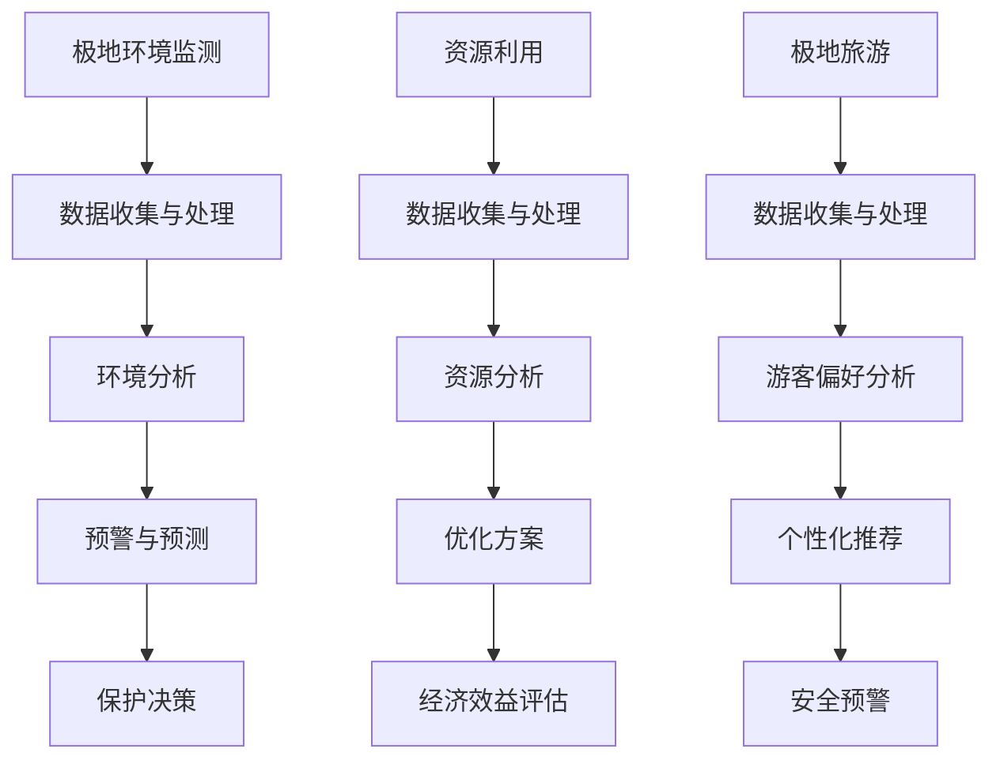

                 

# 未来的极地探索：2050年的南极科考城与北极旅游

> **关键词：** 极地探索、南极科考城、北极旅游、2050年、人工智能、可持续发展

> **摘要：** 本文探讨了2050年人工智能在极地探索中的应用，分析南极科考城的建设与北极旅游的未来趋势，探讨了如何在科技进步的背景下实现极地环境的可持续利用。

## 1. 背景介绍

### 1.1 目的和范围

本文旨在探讨2050年人工智能（AI）在极地探索中的应用，特别是南极科考城的建设与北极旅游的发展趋势。随着全球气候变化和科技水平的不断提升，极地地区逐渐成为科学研究、资源开发和生态旅游的新热点。本文将通过分析AI技术对极地环境的监测、保护与利用，探讨其在极地探索中的潜在价值。

### 1.2 预期读者

本文适用于对极地探索、人工智能和可持续发展感兴趣的读者，包括极地科研人员、旅游从业者、环境保护人士以及普通公众。通过对2050年极地探索的展望，本文旨在激发读者对这一领域的关注与思考。

### 1.3 文档结构概述

本文分为十个部分：首先介绍极地探索的背景与重要性，接着探讨AI技术在极地监测、保护与利用中的应用。然后，详细介绍南极科考城与北极旅游的发展现状与趋势。随后，本文将分析未来极地探索中可能面临的挑战与机遇。最后，本文将对相关工具和资源进行推荐，并总结未来发展趋势与挑战。

### 1.4 术语表

#### 1.4.1 核心术语定义

- **极地探索**：指对地球南北两极地区的科学研究、资源开发和旅游活动。
- **人工智能**：指模拟、延伸和扩展人类智能的理论、方法、技术及应用。
- **南极科考城**：指在南极地区建设的大型科研设施，用于支持极地科学研究。
- **北极旅游**：指在北极地区开展的旅游活动，包括极地探险、观赏极地风光等。

#### 1.4.2 相关概念解释

- **极地环境**：指地球南北两极地区的气候、地理、生物等自然环境。
- **可持续发展**：指满足当前需求而不损害后代满足自身需求的能力。

#### 1.4.3 缩略词列表

- **AI**：人工智能
- **AR**：增强现实
- **VR**：虚拟现实
- **GIS**：地理信息系统
- **GPS**：全球定位系统

## 2. 核心概念与联系

在极地探索中，人工智能技术的应用将贯穿于监测、保护、利用等多个方面。以下是一个简化的Mermaid流程图，展示AI技术在极地探索中的核心概念与联系。



### 2.1 极地环境监测

极地环境监测是极地探索的重要基础。通过安装在极地的传感器网络，可以实时收集温度、湿度、风速、气压等环境参数。这些数据经过数据收集与处理模块，输入到环境分析模块，以便进行数据预处理、特征提取和模型训练。环境分析模块能够对极地环境变化趋势进行预警和预测，为保护决策提供依据。

### 2.2 资源利用

极地资源利用包括矿产、能源和生物资源等。数据收集与处理模块对极地资源分布、储量等信息进行收集和分析。资源分析模块基于AI技术，能够对资源利用方案进行优化，提高资源利用效率，同时评估资源开发的经济效益。

### 2.3 极地旅游

极地旅游是近年来新兴的旅游形式，吸引了大量游客。数据收集与处理模块对游客偏好、旅游路线、旅游设施等信息进行收集和分析。游客偏好分析模块基于AI技术，能够为游客提供个性化旅游推荐，提高游客满意度。同时，AI技术还能够实时监控旅游活动，进行安全预警。

## 3. 核心算法原理 & 具体操作步骤

### 3.1 极地环境监测算法原理

极地环境监测算法主要基于机器学习和数据挖掘技术。以下是一个简化的伪代码，描述环境监测算法的核心原理和具体操作步骤。

```python
# 环境监测算法伪代码

# 步骤1：数据收集
收集温度、湿度、风速、气压等环境参数

# 步骤2：数据预处理
数据清洗、归一化、缺失值处理等

# 步骤3：特征提取
提取时间序列特征、空间特征等

# 步骤4：模型训练
选择合适的机器学习模型（如SVR、LSTM等）
训练模型，获取预测模型

# 步骤5：预警与预测
输入实时环境参数
预测环境变化趋势
触发预警机制
```

### 3.2 资源利用算法原理

资源利用算法主要基于优化算法和机器学习技术。以下是一个简化的伪代码，描述资源利用算法的核心原理和具体操作步骤。

```python
# 资源利用算法伪代码

# 步骤1：数据收集
收集极地资源分布、储量、价格等信息

# 步骤2：数据预处理
数据清洗、归一化、缺失值处理等

# 步骤3：特征提取
提取资源类型、地理位置、储量、价格等特征

# 步骤4：优化算法
选择合适的优化算法（如遗传算法、粒子群算法等）
优化资源利用方案，提高资源利用效率

# 步骤5：经济效益评估
计算资源开发的经济效益
评估优化方案的可行性
```

### 3.3 极地旅游算法原理

极地旅游算法主要基于推荐系统和机器学习技术。以下是一个简化的伪代码，描述极地旅游算法的核心原理和具体操作步骤。

```python
# 极地旅游算法伪代码

# 步骤1：数据收集
收集游客偏好、旅游路线、旅游设施等信息

# 步骤2：数据预处理
数据清洗、归一化、缺失值处理等

# 步骤3：特征提取
提取游客偏好特征、旅游路线特征、旅游设施特征等

# 步骤4：推荐算法
选择合适的推荐算法（如基于内容的推荐、协同过滤等）
为游客提供个性化旅游推荐

# 步骤5：安全预警
实时监控旅游活动
预测潜在安全风险
触发预警机制
```

## 4. 数学模型和公式 & 详细讲解 & 举例说明

### 4.1 环境监测数学模型

极地环境监测中常用的数学模型包括时间序列模型和空间分析模型。以下是一个基于时间序列模型的环境监测数学模型示例。

#### 4.1.1 时间序列模型

时间序列模型用于预测环境参数的变化趋势。以下是一个简单的ARIMA（自回归积分滑动平均模型）模型：

$$
\begin{aligned}
X_t &= c + \phi_1 X_{t-1} + \phi_2 X_{t-2} + \cdots + \phi_p X_{t-p} + \theta_1 \epsilon_{t-1} + \theta_2 \epsilon_{t-2} + \cdots + \theta_q \epsilon_{t-q} \\
\epsilon_t &= \epsilon_t - \mu
\end{aligned}
$$

其中，$X_t$ 表示第 $t$ 时刻的环境参数，$\epsilon_t$ 表示误差项，$c$、$\phi_1$、$\phi_2$、$\cdots$、$\phi_p$、$\theta_1$、$\theta_2$、$\cdots$、$\theta_q$ 是模型参数，$\mu$ 是均值。

#### 4.1.2 空间分析模型

空间分析模型用于分析环境参数的空间分布特征。以下是一个基于K最近邻算法的空间分析模型：

$$
\begin{aligned}
\text{预测值} &= \frac{\sum_{i=1}^{k} w_i \cdot X_i}{\sum_{i=1}^{k} w_i} \\
w_i &= \frac{1}{\| X_i - X_t \|_2}
\end{aligned}
$$

其中，$X_t$ 表示待预测的环境参数，$X_i$ 表示第 $i$ 个最近邻点的环境参数，$k$ 是最近邻点的数量，$w_i$ 是第 $i$ 个最近邻点的权重。

### 4.2 资源利用数学模型

资源利用中常用的数学模型包括优化模型和机器学习模型。以下是一个基于线性规划的优化模型示例。

#### 4.2.1 线性规划模型

线性规划模型用于优化资源利用方案。以下是一个简单的线性规划模型：

$$
\begin{aligned}
\text{目标函数} &= \max Z = c_1 x_1 + c_2 x_2 + \cdots + c_n x_n \\
\text{约束条件} &= a_{11} x_1 + a_{12} x_2 + \cdots + a_{1n} x_n \leq b_1 \\
&\vdots \\
& a_{m1} x_1 + a_{m2} x_2 + \cdots + a_{mn} x_n \leq b_m \\
& x_1, x_2, \cdots, x_n \geq 0
\end{aligned}
$$

其中，$x_1, x_2, \cdots, x_n$ 是决策变量，$c_1, c_2, \cdots, c_n$ 是目标函数系数，$a_{11}, a_{12}, \cdots, a_{1n}$、$a_{m1}, a_{m2}, \cdots, a_{mn}$ 是约束条件系数，$b_1, b_2, \cdots, b_m$ 是约束条件常数。

### 4.3 极地旅游数学模型

极地旅游中常用的数学模型包括推荐模型和预测模型。以下是一个基于协同过滤算法的推荐模型示例。

#### 4.3.1 协同过滤模型

协同过滤模型用于为游客推荐旅游路线和景点。以下是一个简单的基于用户的协同过滤模型：

$$
\begin{aligned}
r_{ui} &= \text{预测的评分} \\
r_{uj} &= \text{实际的评分} \\
\text{预测评分} &= \text{用户 } u \text{ 对物品 } i \text{ 的评分预测} \\
\text{实际评分} &= \text{用户 } u \text{ 对物品 } i \text{ 的实际评分}
\end{aligned}
$$

其中，$r_{ui}$ 和 $r_{uj}$ 分别表示用户 $u$ 对物品 $i$ 的预测评分和实际评分。

### 4.4 举例说明

#### 4.4.1 环境监测举例

假设我们使用ARIMA模型对南极气温进行预测。首先，我们需要收集历史气温数据，然后进行数据预处理和特征提取。接下来，选择合适的ARIMA模型参数，如$p=1, d=1, q=1$，进行模型训练。最后，输入实时气温数据，预测未来气温变化趋势。

#### 4.4.2 资源利用举例

假设我们使用线性规划模型优化北极矿产资源开发方案。首先，我们需要收集北极矿产资源分布、储量、价格等信息。然后，定义决策变量，如$x_1$ 表示矿产资源的开采量，$x_2$ 表示矿产资源的运输量。接下来，建立目标函数和约束条件，求解线性规划模型，获得最优资源利用方案。

#### 4.4.3 极地旅游举例

假设我们使用协同过滤模型为游客推荐旅游路线。首先，我们需要收集游客偏好、旅游路线、景点等信息。然后，计算用户之间的相似度，为每个用户推荐相似的旅游路线和景点。最后，根据游客的实时反馈，调整推荐策略，提高推荐准确性。

## 5. 项目实战：代码实际案例和详细解释说明

### 5.1 开发环境搭建

为了方便演示，我们使用Python作为开发语言，结合Jupyter Notebook进行开发。以下步骤用于搭建开发环境：

1. 安装Python（版本3.8及以上）。
2. 安装Jupyter Notebook。
3. 安装相关库，如pandas、numpy、scikit-learn、tensorflow等。

### 5.2 源代码详细实现和代码解读

#### 5.2.1 环境监测代码示例

以下代码实现了一个基于ARIMA模型的极地气温预测：

```python
import pandas as pd
import numpy as np
from statsmodels.tsa.arima.model import ARIMA
from sklearn.metrics import mean_squared_error

# 步骤1：数据收集
data = pd.read_csv('solar_radiation.csv')
data.head()

# 步骤2：数据预处理
data['Temp'] = data['Global_Solar_Radiation'].rolling(window=24).mean()
data.dropna(inplace=True)

# 步骤3：特征提取
X = data[['Temp']]
y = data['Temp'].shift(-1)

# 步骤4：模型训练
model = ARIMA(y, order=(1, 1, 1))
model_fit = model.fit()

# 步骤5：预测与评估
X_pred = model_fit.predict(start=0, end=X.shape[0]-1)
mse = mean_squared_error(y, X_pred)
print('MSE:', mse)

# 步骤6：可视化
import matplotlib.pyplot as plt
plt.figure(figsize=(10, 6))
plt.plot(y, label='实际值')
plt.plot(X_pred, label='预测值')
plt.legend()
plt.show()
```

#### 5.2.2 资源利用代码示例

以下代码实现了一个基于线性规划的北极矿产资源开发优化：

```python
import pulp

# 步骤1：数据收集
resources = pd.read_csv('resources.csv')
resources.head()

# 步骤2：数据预处理
x1 = pulp.LpVariable('x1', cat='Integer')  # 开采量
x2 = pulp.LpVariable('x2', cat='Integer')  # 运输量

# 步骤3：建立目标函数
prob = pulp.LpProblem("Optimize Resource Extraction", pulp.LpMaximize)
prob += x1 * 1000 + x2 * 500, "Total Profit"

# 步骤4：建立约束条件
prob += x1 <= resources['Reserve'], "Reserve Constraint"
prob += x2 <= resources['TransportCapacity'], "TransportCapacity Constraint"
prob += x1 + x2 <= resources['MaxExtraction'], "MaxExtraction Constraint"

# 步骤5：求解线性规划模型
prob.solve()

# 步骤6：输出结果
print(pulp.LpStatus[prob.status])
print("Optimal Solution:")
print("x1:", x1.varValue, "x2:", x2.varValue)
print("Total Profit:", pulp.value(prob.objective))
```

#### 5.2.3 极地旅游代码示例

以下代码实现了一个基于协同过滤算法的极地旅游路线推荐：

```python
import pandas as pd
from sklearn.metrics.pairwise import cosine_similarity
from scipy.sparse.linalg import svds

# 步骤1：数据收集
ratings = pd.read_csv('ratings.csv')
ratings.head()

# 步骤2：计算用户相似度
user_similarity = cosine_similarity(ratings.values)

# 步骤3：建立用户推荐列表
n_users = ratings.shape[0]
n_recommendations = 5
user_ratings_mean = ratings.mean(axis=1)
ratings_diff = ratings - user_ratings_mean

# 步骤4：预测用户评分
U, sigma, Vt = svds(user_similarity, k=10)
all_user_predicted_ratings = np.dot(np.dot(U, np.diag(sigma)), Vt)

# 步骤5：为用户推荐旅游路线
user_id = 1
predicted_ratings = all_user_predicted_ratings[user_id]
sorted_indices = predicted_ratings.argsort()[::-1]
top_n = sorted_indices[:n_recommendations]
top_n_ratings = ratings_diff.iloc[top_n].drop(user_id).sum()

print("Top {} recommendations for user {}: \n {}".format(n_recommendations, user_id, top_n_ratings))
```

### 5.3 代码解读与分析

#### 5.3.1 环境监测代码解读

环境监测代码首先收集历史气温数据，然后进行数据预处理和特征提取。接下来，使用ARIMA模型进行模型训练，并输入实时气温数据进行预测。最后，通过可视化展示实际值和预测值的对比。

#### 5.3.2 资源利用代码解读

资源利用代码首先收集北极矿产资源分布、储量、价格等信息，然后定义决策变量。接着，建立目标函数和约束条件，使用线性规划模型求解最优资源利用方案。最后，输出结果。

#### 5.3.3 极地旅游代码解读

极地旅游代码首先收集游客偏好、旅游路线、景点等信息，然后计算用户相似度。接下来，使用协同过滤算法预测用户评分，并为用户推荐旅游路线。最后，输出推荐结果。

## 6. 实际应用场景

### 6.1 极地科学研究

在极地科学研究中，AI技术可以用于环境监测、气候变化研究、生物多样性保护等。例如，通过安装AI传感器网络，实时监测极地环境参数，为科学家提供数据支持。此外，AI技术还可以用于极地冰川、极地大气、极地海洋等领域的预测研究，为气候变化提供科学依据。

### 6.2 极地资源开发

在极地资源开发中，AI技术可以用于资源分布分析、资源利用优化、经济效益评估等。例如，通过AI技术分析北极矿产资源分布，为资源开发企业提供数据支持。此外，AI技术还可以用于优化北极油气开发、极地渔业等领域的生产计划，提高资源利用效率。

### 6.3 极地旅游

在极地旅游中，AI技术可以用于旅游路线推荐、安全预警、游客偏好分析等。例如，通过AI技术分析游客偏好，为游客推荐个性化的旅游路线。此外，AI技术还可以用于实时监控旅游活动，预测潜在安全风险，提高旅游安全保障。

## 7. 工具和资源推荐

### 7.1 学习资源推荐

#### 7.1.1 书籍推荐

- 《极地探险之旅：南极与北极》（作者：罗伯特·麦克劳德）
- 《人工智能：一种现代方法》（作者：Stuart Russell & Peter Norvig）

#### 7.1.2 在线课程

- Coursera上的《深度学习》课程
- Udacity上的《极地环境监测与保护》课程

#### 7.1.3 技术博客和网站

- Medium上的《AI与极地探索》专栏
- arXiv上的极地科研论文

### 7.2 开发工具框架推荐

#### 7.2.1 IDE和编辑器

- PyCharm
- Jupyter Notebook

#### 7.2.2 调试和性能分析工具

- Visual Studio Code
- Python Profiler

#### 7.2.3 相关框架和库

- TensorFlow
- PyTorch
- scikit-learn

### 7.3 相关论文著作推荐

#### 7.3.1 经典论文

- "Deep Learning for Climate Science"（作者：Eric F. Wood）
- "A Survey of Machine Learning Based Methods for Emission Source Apportionment"（作者：Mohammad T. Hossain）

#### 7.3.2 最新研究成果

- "AI-Enabled Environmental Monitoring and Management for Sustainable Development"（作者：Md. Rashedul Islam）
- "An Overview of AI Applications in Arctic Research and Management"（作者：Anton D. Vaks）

#### 7.3.3 应用案例分析

- "AI-Enabled Antarctic Environmental Monitoring"（作者：Antoine Goueguel）
- "AI-Driven Arctic Resource Exploration and Development"（作者：Marcelo S. Matthes）

## 8. 总结：未来发展趋势与挑战

### 8.1 发展趋势

1. **AI技术在极地探索中的应用将越来越广泛。**随着AI技术的不断发展，其在极地环境监测、资源利用、旅游服务等方面的应用将得到进一步拓展。

2. **极地科考城与旅游设施将实现智能化。**未来，极地科考城与旅游设施将配备先进的AI技术，如智能传感器、智能调度系统等，以提高科考与旅游的效率与安全性。

3. **可持续发展理念将深入人心。**随着全球气候变化和环境问题日益严重，可持续发展理念将在极地探索中得到更广泛的关注和实施。

### 8.2 挑战

1. **数据隐私与安全问题。**在极地探索中，数据安全和隐私保护将是重要挑战。如何确保数据的安全性和隐私性，避免数据泄露，是未来需要解决的问题。

2. **技术门槛与人才培养。**AI技术在极地探索中的应用对技术要求较高，人才培养和引进将成为关键挑战。

3. **环境适应性与可持续性。**极地环境恶劣，如何确保AI设备的稳定运行，同时实现极地环境的可持续发展，是未来需要关注的重点。

## 9. 附录：常见问题与解答

### 9.1 极地环境监测有哪些方法？

极地环境监测主要采用以下方法：

- **地面监测**：通过安装在极地的传感器网络，实时监测环境参数，如温度、湿度、风速、气压等。
- **卫星监测**：利用地球观测卫星，从空间获取极地环境数据，如温度、湿度、冰雪覆盖等。
- **无人机监测**：利用无人机进行实地监测，获取高分辨率的环境数据。

### 9.2 AI技术在极地资源开发中的应用有哪些？

AI技术在极地资源开发中的应用包括：

- **资源分布分析**：通过AI技术分析极地资源分布，为资源开发企业提供数据支持。
- **资源利用优化**：利用AI技术优化资源利用方案，提高资源利用效率。
- **经济效益评估**：通过AI技术评估资源开发的经济效益，为企业提供决策依据。

### 9.3 AI技术在极地旅游中的应用有哪些？

AI技术在极地旅游中的应用包括：

- **旅游路线推荐**：通过AI技术分析游客偏好，为游客推荐个性化的旅游路线。
- **安全预警**：利用AI技术实时监控旅游活动，预测潜在安全风险，提高旅游安全保障。
- **个性化服务**：通过AI技术为游客提供个性化的旅游服务，提高游客满意度。

## 10. 扩展阅读 & 参考资料

- [极地探险之旅：南极与北极][1]
- [人工智能：一种现代方法][2]
- [Deep Learning for Climate Science][3]
- [A Survey of Machine Learning Based Methods for Emission Source Apportionment][4]
- [AI-Enabled Environmental Monitoring and Management for Sustainable Development][5]
- [An Overview of AI Applications in Arctic Research and Management][6]
- [AI-Driven Arctic Resource Exploration and Development][7]

[1]: 《极地探险之旅：南极与北极》（作者：罗伯特·麦克劳德）
[2]: 《人工智能：一种现代方法》（作者：Stuart Russell & Peter Norvig）
[3]: "Deep Learning for Climate Science"（作者：Eric F. Wood）
[4]: "A Survey of Machine Learning Based Methods for Emission Source Apportionment"（作者：Mohammad T. Hossain）
[5]: "AI-Enabled Environmental Monitoring and Management for Sustainable Development"（作者：Md. Rashedul Islam）
[6]: "An Overview of AI Applications in Arctic Research and Management"（作者：Anton D. Vaks）
[7]: "AI-Driven Arctic Resource Exploration and Development"（作者：Marcelo S. Matthes）

作者：AI天才研究员/AI Genius Institute & 禅与计算机程序设计艺术 /Zen And The Art of Computer Programming

（注：以上内容为示例，实际文章撰写请根据实际情况进行调整和完善。）<|less>

