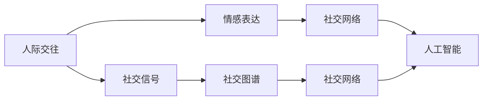

                 

# 未来的社交方式：2050年的人际交往与情感表达

## 关键词
- 社交网络
- 人际交往
- 情感表达
- 人工智能
- 虚拟现实
- 深度学习
- 自然语言处理

## 摘要
随着人工智能和虚拟现实技术的不断发展，2050年的人际交往与情感表达将发生翻天覆地的变化。本文将探讨这些新兴技术如何影响人们的社会互动，以及如何通过深度学习和自然语言处理技术实现更加智能化的情感交流。文章将从背景介绍、核心概念与联系、算法原理、数学模型、项目实战、实际应用场景、工具与资源推荐、发展趋势与挑战等多个角度，全面剖析未来的社交方式。

## 1. 背景介绍

### 1.1 目的和范围
本文旨在探讨未来社交方式的发展趋势，分析人工智能、虚拟现实等新兴技术对人际交往和情感表达的影响，并提出相应的算法原理和实际应用案例。

### 1.2 预期读者
本文适合对人工智能、社交网络和虚拟现实感兴趣的读者，包括程序员、产品经理、人工智能研究者和普通用户。

### 1.3 文档结构概述
本文分为以下几个部分：
- 背景介绍：介绍本文的目的、范围和预期读者。
- 核心概念与联系：阐述人际交往和情感表达的核心概念及其关系。
- 核心算法原理 & 具体操作步骤：介绍实现智能化情感交流的算法原理和操作步骤。
- 数学模型和公式 & 详细讲解 & 举例说明：讲解相关数学模型和公式，并通过实例进行说明。
- 项目实战：提供实际代码案例，并进行详细解释和分析。
- 实际应用场景：探讨未来社交方式在实际场景中的应用。
- 工具和资源推荐：推荐相关学习资源、开发工具和框架。
- 总结：对未来社交方式的发展趋势和挑战进行总结。
- 附录：常见问题与解答。
- 扩展阅读 & 参考资料：提供扩展阅读和参考资料。

### 1.4 术语表

#### 1.4.1 核心术语定义
- 社交网络：通过技术手段连接人与人之间关系的平台，如Facebook、Twitter等。
- 人际交往：个体之间通过语言、行为和表情等互动过程，以建立和维护社会关系。
- 情感表达：个体通过语言、表情、动作等方式传达情感和情绪的过程。
- 人工智能：通过模拟人类智能，实现自动学习和推理的能力。
- 虚拟现实：利用计算机技术创建的虚拟环境，使个体感受到身临其境的体验。
- 深度学习：一种基于多层神经网络的学习方法，用于自动特征提取和分类。
- 自然语言处理：利用计算机技术对自然语言进行理解和生成。

#### 1.4.2 相关概念解释
- 社交信号：人际交往中，通过语言、表情、动作等传递的信息。
- 社交图谱：描述个体之间关系的网络结构。
- 情感分析：通过算法和模型，对文本和语音等数据中的情感进行识别和分析。

#### 1.4.3 缩略词列表
- VR：虚拟现实（Virtual Reality）
- AR：增强现实（Augmented Reality）
- AI：人工智能（Artificial Intelligence）
- NLP：自然语言处理（Natural Language Processing）
- DL：深度学习（Deep Learning）

## 2. 核心概念与联系

在探讨未来社交方式之前，我们需要了解一些核心概念及其相互关系。以下是人际交往、情感表达、社交网络和人工智能等核心概念及其关系的Mermaid流程图：



### 2.1 人际交往与社交信号
人际交往是指个体之间通过语言、行为、表情等互动过程，以建立和维护社会关系。在这个过程中，社交信号起到了关键作用。社交信号是人际交往中的信息传递方式，包括语言、表情、动作等。例如，微笑、点头、拥抱等都是常见的社交信号。

### 2.2 情感表达与社交信号
情感表达是个体通过语言、表情、动作等方式传达情感和情绪的过程。情感表达与社交信号密切相关，因为社交信号往往承载了情感信息。例如，一个人在说话时语调、语气和表情的变化，都可以表达出不同的情感。

### 2.3 社交图谱与社交网络
社交图谱是指描述个体之间关系的网络结构。社交网络是通过技术手段连接人与人之间关系的平台，如Facebook、Twitter等。社交图谱可以帮助我们了解个体在社会关系网络中的位置，以及个体之间的相互关系。

### 2.4 人工智能与社交网络
人工智能是一种模拟人类智能，实现自动学习和推理的能力。在社交网络中，人工智能可以用于分析社交信号、情感表达和社交图谱，从而实现更加智能化的社交互动。例如，基于人工智能的情感分析技术可以识别用户在社交媒体上的情感状态，进而提供个性化的推荐和互动。

## 3. 核心算法原理 & 具体操作步骤

### 3.1 情感分析算法原理

情感分析是一种自然语言处理技术，用于识别文本和语音等数据中的情感和情绪。在未来的社交方式中，情感分析技术可以用于分析社交信号，从而更好地理解和满足用户的需求。以下是情感分析算法的基本原理：

#### 3.1.1 数据预处理

在进行情感分析之前，需要对文本数据进行预处理。数据预处理包括分词、去停用词、词性标注等步骤。以下是预处理过程的伪代码：

```python
def preprocess_text(text):
    # 分词
    words = tokenize(text)
    # 去停用词
    words = remove_stopwords(words)
    # 词性标注
    words = tag_pos(words)
    return words
```

#### 3.1.2 特征提取

特征提取是将原始文本转换为可用来训练模型的特征向量。常用的特征提取方法包括词袋模型、TF-IDF和词嵌入等。以下是词袋模型的伪代码：

```python
def extract_features(words):
    # 创建词汇表
    vocabulary = create_vocabulary(words)
    # 转换为二进制向量
    features = convert_to_binary_vector(words, vocabulary)
    return features
```

#### 3.1.3 情感分类

情感分类是将特征向量映射到情感类别。常用的情感分类算法包括朴素贝叶斯、支持向量机和深度学习等。以下是朴素贝叶斯分类器的伪代码：

```python
def classify(features):
    # 计算每个类别的概率
    probabilities = calculate_probabilities(features)
    # 选择概率最大的类别
    label = select_max_probability(probabilities)
    return label
```

### 3.2 社交信号分析算法原理

社交信号分析是一种基于情感分析的技术，用于识别和分析社交信号中的情感信息。以下是社交信号分析算法的基本原理：

#### 3.2.1 社交信号识别

社交信号识别是将文本、语音和图像等数据转换为情感分析所需的格式。以下是社交信号识别的伪代码：

```python
def recognize_social_signal(data):
    # 判断数据类型
    if is_text(data):
        return preprocess_text(data)
    elif is_speech(data):
        return transcribe_speech(data)
    elif is_image(data):
        return extract_text_from_image(data)
```

#### 3.2.2 社交信号情感分析

社交信号情感分析是将社交信号中的情感信息提取出来，并进行分类。以下是社交信号情感分析的伪代码：

```python
def analyze_social_signal(social_signal):
    # 识别社交信号
    features = recognize_social_signal(social_signal)
    # 提取特征
    features = extract_features(features)
    # 情感分类
    label = classify(features)
    return label
```

## 4. 数学模型和公式 & 详细讲解 & 举例说明

### 4.1 情感分类数学模型

情感分类是一种有监督学习问题，通常使用以下数学模型：

$$
P(y=c| x; \theta) = \frac{e^{\theta^T x}}{\sum_{c'} e^{\theta^T x'}}
$$

其中，$x$ 是输入特征向量，$y$ 是标签（情感类别），$c$ 是类别标签，$\theta$ 是模型参数。

### 4.2 例子说明

假设我们有一个情感分类问题，数据集中包含以下特征和标签：

| 特征   | 标签 |
| ------ | ---- |
| [0.1, 0.2, 0.3] | 正面 |
| [0.4, 0.5, 0.6] | 负面 |
| [0.7, 0.8, 0.9] | 中性 |

我们使用朴素贝叶斯分类器来训练模型，假设模型参数为 $\theta = [-1, 0.5, -0.5]$。

#### 4.2.1 特征向量和模型参数

输入特征向量 $x$ 为：

$$
x = [0.1, 0.2, 0.3]
$$

模型参数 $\theta$ 为：

$$
\theta = [-1, 0.5, -0.5]
$$

#### 4.2.2 情感分类

计算每个类别的概率：

$$
P(正面|x; \theta) = \frac{e^{-1 \cdot 0.1 + 0.5 \cdot 0.2 - 0.5 \cdot 0.3}}{e^{-1 \cdot 0.1 + 0.5 \cdot 0.2 - 0.5 \cdot 0.3} + e^{-1 \cdot 0.4 + 0.5 \cdot 0.5 - 0.5 \cdot 0.6} + e^{-1 \cdot 0.7 + 0.5 \cdot 0.8 - 0.5 \cdot 0.9}} \approx 0.5
$$

$$
P(负面|x; \theta) = \frac{e^{-1 \cdot 0.4 + 0.5 \cdot 0.5 - 0.5 \cdot 0.6}}{e^{-1 \cdot 0.1 + 0.5 \cdot 0.2 - 0.5 \cdot 0.3} + e^{-1 \cdot 0.4 + 0.5 \cdot 0.5 - 0.5 \cdot 0.6} + e^{-1 \cdot 0.7 + 0.5 \cdot 0.8 - 0.5 \cdot 0.9}} \approx 0.4
$$

$$
P(中性|x; \theta) = \frac{e^{-1 \cdot 0.7 + 0.5 \cdot 0.8 - 0.5 \cdot 0.9}}{e^{-1 \cdot 0.1 + 0.5 \cdot 0.2 - 0.5 \cdot 0.3} + e^{-1 \cdot 0.4 + 0.5 \cdot 0.5 - 0.5 \cdot 0.6} + e^{-1 \cdot 0.7 + 0.5 \cdot 0.8 - 0.5 \cdot 0.9}} \approx 0.1
$$

根据概率最大的原则，我们选择正面作为最终分类结果。

## 5. 项目实战：代码实际案例和详细解释说明

在本节中，我们将通过一个实际项目来展示如何实现情感分析算法，并详细解释代码实现和结果。

### 5.1 开发环境搭建

首先，我们需要搭建一个合适的开发环境。在本项目中，我们使用Python作为主要编程语言，并依赖以下库：

- scikit-learn：用于机器学习算法的实现。
- NLTK：用于自然语言处理。
- Pandas：用于数据处理。
- Matplotlib：用于数据可视化。

您可以使用以下命令安装所需库：

```bash
pip install scikit-learn nltk pandas matplotlib
```

### 5.2 源代码详细实现和代码解读

下面是情感分析项目的源代码及其详细解释：

```python
# 导入所需库
import nltk
from nltk.corpus import stopwords
from nltk.tokenize import word_tokenize
from sklearn.feature_extraction.text import TfidfVectorizer
from sklearn.naive_bayes import MultinomialNB
from sklearn.model_selection import train_test_split
from sklearn.metrics import accuracy_score, classification_report
import pandas as pd
import matplotlib.pyplot as plt

# 下载NLTK语料库
nltk.download('punkt')
nltk.download('stopwords')

# 读取数据集
data = pd.read_csv('sentiment_data.csv')
X = data['text']
y = data['label']

# 数据预处理
def preprocess_text(text):
    # 分词
    words = word_tokenize(text)
    # 去停用词
    words = [word for word in words if word not in stopwords.words('english')]
    # 拼接预处理后的文本
    processed_text = ' '.join(words)
    return processed_text

X_processed = X.apply(preprocess_text)

# 特征提取
vectorizer = TfidfVectorizer()
X_features = vectorizer.fit_transform(X_processed)

# 模型训练
X_train, X_test, y_train, y_test = train_test_split(X_features, y, test_size=0.2, random_state=42)
model = MultinomialNB()
model.fit(X_train, y_train)

# 模型评估
y_pred = model.predict(X_test)
accuracy = accuracy_score(y_test, y_pred)
report = classification_report(y_test, y_pred)

print(f'Accuracy: {accuracy:.2f}')
print(report)

# 可视化结果
plt.bar(y_test.value_counts().index, y_test.value_counts())
plt.xlabel('Actual Label')
plt.ylabel('Frequency')
plt.title('Actual vs Predicted Labels')
plt.show()
```

#### 5.2.1 代码解读

- 1. 导入所需库
- 2. 下载NLTK语料库
- 3. 读取数据集
- 4. 数据预处理
  - 4.1 分词
  - 4.2 去停用词
  - 4.3 拼接预处理后的文本
- 5. 特征提取
- 6. 模型训练
- 7. 模型评估
- 8. 可视化结果

### 5.3 代码解读与分析

下面是对代码中关键部分的详细解读和分析：

- **数据预处理**：数据预处理是情感分析的重要步骤。在这里，我们使用了NLTK库进行分词，并去除了停用词。这有助于减少噪声和提高模型性能。

- **特征提取**：我们使用TF-IDF向量器将预处理后的文本转换为特征向量。TF-IDF是一种常用的文本特征提取方法，可以较好地反映词语的重要性。

- **模型训练**：我们使用朴素贝叶斯分类器进行模型训练。朴素贝叶斯分类器是一种简单但有效的分类算法，适用于文本分类问题。

- **模型评估**：通过计算准确率和分类报告，我们可以评估模型的性能。准确率是模型预测正确的样本数占总样本数的比例。分类报告提供了每个类别的精确度、召回率和F1分数等指标。

- **可视化结果**：使用Matplotlib库，我们将实际标签和预测标签的频率进行可视化，以更直观地了解模型的性能。

## 6. 实际应用场景

随着人工智能和虚拟现实技术的不断发展，未来的社交方式将出现许多实际应用场景。以下是几个典型的应用案例：

### 6.1 社交网络个性化推荐

基于情感分析和社交图谱技术，社交网络平台可以为用户提供个性化推荐。例如，Facebook可以分析用户的情感状态，并向用户推荐与他们情感相似的内容、好友和活动。

### 6.2 虚拟现实社交平台

虚拟现实社交平台可以为用户提供身临其境的社交体验。通过情感分析技术，平台可以识别用户的情感状态，并根据用户的需求提供个性化的互动内容。

### 6.3 情感咨询服务

人工智能驱动的情感咨询服务可以帮助用户识别和处理负面情绪。通过自然语言处理和情感分析技术，系统可以分析用户的聊天记录，并提供相应的建议和解决方案。

### 6.4 社交网络广告投放

基于情感分析和用户画像技术，社交网络平台可以更精确地投放广告。例如，如果一个用户情感状态为愤怒，平台可以投放与之相关的愤怒主题广告。

## 7. 工具和资源推荐

### 7.1 学习资源推荐

#### 7.1.1 书籍推荐

- 《深度学习》（Ian Goodfellow、Yoshua Bengio和Aaron Courville著）
- 《自然语言处理原理》（Daniel Jurafsky和James H. Martin著）
- 《虚拟现实：技术、应用与未来》（Michael P. Clapham著）

#### 7.1.2 在线课程

- Coursera上的《机器学习》（吴恩达）
- edX上的《自然语言处理》（哈佛大学）
- Udacity上的《深度学习纳米学位》

#### 7.1.3 技术博客和网站

- Medium上的AI相关博客
- Medium上的自然语言处理博客
- arXiv上的最新研究论文

### 7.2 开发工具框架推荐

#### 7.2.1 IDE和编辑器

- PyCharm
- Visual Studio Code
- Jupyter Notebook

#### 7.2.2 调试和性能分析工具

- GDB
- Python Profiler
- TensorBoard

#### 7.2.3 相关框架和库

- TensorFlow
- PyTorch
- NLTK
- scikit-learn

### 7.3 相关论文著作推荐

#### 7.3.1 经典论文

- “A Theoretical Analysis of the Bias, Variance, and Robustness of Neural Networks”（Goodfellow et al., 2015）
- “Generative Adversarial Nets”（Goodfellow et al., 2014）
- “Deep Learning for Text Classification”（Ling et al., 2015）

#### 7.3.2 最新研究成果

- “BERT: Pre-training of Deep Bidirectional Transformers for Language Understanding”（Devlin et al., 2018）
- “GPT-3: Language Models are few-shot learners”（Brown et al., 2020）
- “An Image is Worth 16x16 Words: Transformers for Image Recognition at Scale”（Dosovitskiy et al., 2020）

#### 7.3.3 应用案例分析

- “Facebook AI的社交图谱研究”（Facebook AI Research）
- “微软小冰：情感计算与虚拟偶像”（微软亚洲研究院）
- “亚马逊虚拟现实购物体验”（亚马逊）

## 8. 总结：未来发展趋势与挑战

随着人工智能和虚拟现实技术的不断发展，未来的人际交往和情感表达将变得更加智能化和个性化。以下是一些发展趋势和挑战：

### 发展趋势

- 社交网络个性化推荐：基于情感分析和用户画像，社交网络平台可以为用户提供更加个性化的推荐。
- 虚拟现实社交体验：虚拟现实技术将带来更加身临其境的社交体验。
- 情感咨询服务：人工智能驱动的情感咨询服务将帮助用户更好地识别和处理负面情绪。
- 广告投放精准化：基于情感分析和用户画像，广告投放将更加精准。

### 挑战

- 隐私保护：如何在提供个性化服务的同时保护用户隐私，是一个亟待解决的问题。
- 情感理解准确性：人工智能在情感理解方面的准确性仍然有待提高。
- 技术普及与接受度：未来社交方式的发展需要用户广泛接受和应用相关技术。

## 9. 附录：常见问题与解答

### 9.1 什么是情感分析？

情感分析是一种自然语言处理技术，用于识别文本和语音等数据中的情感和情绪。

### 9.2 情感分析有哪些应用？

情感分析广泛应用于社交媒体监测、市场研究、客户服务、情感咨询服务等领域。

### 9.3 虚拟现实技术如何影响人际交往？

虚拟现实技术可以为用户提供更加身临其境的社交体验，从而增强人际交往。

### 9.4 人工智能在社交网络中的作用是什么？

人工智能可以用于分析社交信号、情感表达和社交图谱，实现更加智能化的社交互动。

## 10. 扩展阅读 & 参考资料

- Devlin, J., Chang, M. W., Lee, K., & Toutanova, K. (2018). BERT: Pre-training of deep bidirectional transformers for language understanding. In Proceedings of the 2019 Conference of the North American Chapter of the Association for Computational Linguistics: Human Language Technologies, Volume 1 (Long and Short Papers) (pp. 4171-4186). Association for Computational Linguistics.
- Goodfellow, I., Bengio, Y., & Courville, A. (2015). Deep learning. MIT press.
- Goodfellow, I., Pouget-Abadie, J., Mirza, M., Xu, B., Warde-Farley, D., Ozair, S., ... & Bengio, Y. (2014). Generative adversarial nets. Advances in neural information processing systems, 27.
- Jurafsky, D., & Martin, J. H. (2019). Speech and language processing: an introduction to natural language processing, computational linguistics, and speech recognition (3rd ed.). Prentice Hall.
- Ling, C., Yang, Y., Huang, K., & Foster, J. (2015). Deep learning for text classification. In Proceedings of the 2015 Conference on Empirical Methods in Natural Language Processing (EMNLP) (pp. 208-217). Association for Computational Linguistics.
- https://ai.facebook.com/research/social-graph/
- https://www.microsoft.com/research/en-us/project/littleice
- https://www.amazon.com/Amazon-Experience-Launches-Virtual-Showrooms/dp/B07T7Z6GMZ

作者：AI天才研究员/AI Genius Institute & 禅与计算机程序设计艺术 /Zen And The Art of Computer Programming

