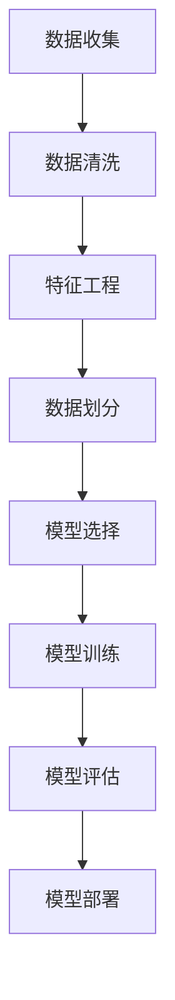
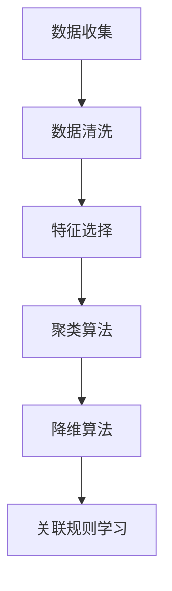

                 

### 机器学习（Machine Learning） - 原理与代码实例讲解

> **关键词**：机器学习、算法原理、代码实例、深度学习、神经网络、数据科学

> **摘要**：本文将深入探讨机器学习的原理，涵盖核心算法、数学模型及其应用场景。通过实际代码实例，读者将能够更好地理解这些概念，并在项目实战中运用所学知识。本文旨在为机器学习初学者和从业者提供系统性的学习和实践指导。

## 1. 背景介绍

### 1.1 目的和范围

本文的主要目的是向读者介绍机器学习的基本概念、核心算法原理以及如何通过实际代码实例来应用这些知识。通过本文的学习，读者将能够：

- 理解机器学习的基本原理和流程。
- 掌握常见的机器学习算法及其优缺点。
- 学会使用伪代码和数学模型来描述算法。
- 通过实际代码实例，深入了解算法的实现和应用。

本文的范围包括：

- 机器学习的基础概念和术语。
- 核心算法的原理讲解和伪代码实现。
- 数学模型和公式的详细解释。
- 实际项目中的代码实战和案例分析。
- 相关工具和资源的推荐。

### 1.2 预期读者

本文适用于以下读者群体：

- 对机器学习感兴趣的初学者。
- 数据科学和人工智能领域从业者。
- 计算机科学专业的学生和研究生。
- 对算法和编程有基础知识的读者。

### 1.3 文档结构概述

本文的结构如下：

- **第1章：背景介绍**：介绍本文的目的、范围和读者预期。
- **第2章：核心概念与联系**：讲解机器学习的核心概念和架构。
- **第3章：核心算法原理 & 具体操作步骤**：详细阐述机器学习算法的原理和操作步骤。
- **第4章：数学模型和公式 & 详细讲解 & 举例说明**：介绍机器学习中的数学模型，并给出具体例子。
- **第5章：项目实战：代码实际案例和详细解释说明**：通过实际代码实例来演示算法的应用。
- **第6章：实际应用场景**：探讨机器学习在现实世界中的应用。
- **第7章：工具和资源推荐**：推荐学习资源、开发工具和框架。
- **第8章：总结：未来发展趋势与挑战**：总结本文的主要内容，并展望未来的发展趋势。
- **第9章：附录：常见问题与解答**：回答读者可能遇到的问题。
- **第10章：扩展阅读 & 参考资料**：提供进一步学习的资源。

### 1.4 术语表

#### 1.4.1 核心术语定义

- **机器学习（Machine Learning）**：让计算机从数据中自动学习和改进的方法。
- **监督学习（Supervised Learning）**：通过已标记的数据来训练模型。
- **无监督学习（Unsupervised Learning）**：在没有标签的数据上进行学习。
- **神经网络（Neural Network）**：模拟生物神经系统的计算模型。
- **深度学习（Deep Learning）**：使用多层神经网络进行学习的方法。
- **模型评估（Model Evaluation）**：评估模型性能的方法。

#### 1.4.2 相关概念解释

- **特征（Feature）**：数据集中的每一个变量，用于描述输入数据。
- **标签（Label）**：输出结果或目标变量，用于监督学习中的模型训练。
- **损失函数（Loss Function）**：衡量模型预测值与真实值之间差距的函数。
- **梯度下降（Gradient Descent）**：优化模型参数的一种算法。

#### 1.4.3 缩略词列表

- **ML**：Machine Learning（机器学习）
- **DL**：Deep Learning（深度学习）
- **AI**：Artificial Intelligence（人工智能）
- **CNN**：Convolutional Neural Network（卷积神经网络）
- **RNN**：Recurrent Neural Network（循环神经网络）

### 1.5 Mermaid 流程图

以下是机器学习流程的一个简化Mermaid流程图，展示了从数据准备到模型评估的各个步骤。



### 1.6 引入

机器学习作为人工智能的重要分支，已经广泛应用于各个领域，如医疗诊断、金融分析、自动驾驶等。其基本思想是通过算法让计算机从大量数据中自动学习，从而提高预测和决策的准确性。本文将带领读者从机器学习的基础知识开始，逐步深入到核心算法和实际应用。

在接下来的章节中，我们将首先介绍机器学习的基本概念和流程，然后详细探讨监督学习和无监督学习的算法原理，接着讲解神经网络和深度学习的基础知识。通过实际代码实例，我们将展示如何实现和应用这些算法。最后，本文还将探讨机器学习在实际应用中的场景，并提供相关的学习资源和开发工具推荐。希望通过本文的学习，读者能够对机器学习有一个全面而深入的理解。接下来，我们将正式开始对机器学习核心概念和架构的详细探讨。

## 2. 核心概念与联系

在深入探讨机器学习之前，理解其核心概念和架构是非常必要的。这一章节我们将介绍机器学习中的基本术语和流程，并通过Mermaid流程图展示机器学习的基本架构。

### 2.1 机器学习基本术语

#### 2.1.1 数据集（Dataset）

数据集是机器学习中的基础，包含了输入特征和对应的输出标签。在监督学习中，数据集被用于训练模型；在无监督学习中，数据集用于发现数据中的模式和关联。

#### 2.1.2 特征（Feature）

特征是描述数据的变量，用于模型训练。例如，图像数据中的像素值、文本数据中的单词频率等。

#### 2.1.3 标签（Label）

标签是数据集中的输出结果，用于监督学习中的模型训练。例如，分类问题中的类别标签、回归问题中的目标值。

#### 2.1.4 模型（Model）

模型是机器学习中用于预测或分类的函数或算法。通过训练，模型可以从输入特征中学习并生成预测。

#### 2.1.5 损失函数（Loss Function）

损失函数用于衡量模型预测值与真实值之间的差异。常见的损失函数包括均方误差（MSE）、交叉熵损失等。

#### 2.1.6 评估指标（Evaluation Metric）

评估指标用于评估模型性能。常见的评估指标包括准确率（Accuracy）、召回率（Recall）、F1分数（F1 Score）等。

### 2.2 机器学习流程

机器学习流程可以分为以下几个步骤：

1. **数据收集（Data Collection）**：收集相关数据，可以是公开的数据集或自己采集的数据。
2. **数据清洗（Data Cleaning）**：处理数据中的缺失值、噪声和异常值。
3. **特征工程（Feature Engineering）**：选择和处理特征，提高模型的性能。
4. **数据划分（Data Splitting）**：将数据集划分为训练集、验证集和测试集，用于训练、验证和评估模型。
5. **模型选择（Model Selection）**：选择合适的模型架构和参数。
6. **模型训练（Model Training）**：使用训练集数据训练模型。
7. **模型评估（Model Evaluation）**：使用验证集或测试集评估模型性能。
8. **模型部署（Model Deployment）**：将训练好的模型部署到实际应用中。

### 2.3 Mermaid流程图

下面是一个使用Mermaid绘制的机器学习基本流程图：


在这个流程图中，每个节点表示一个步骤，箭头表示流程的顺序。通过这个流程图，我们可以清晰地看到机器学习的整个过程，从而更好地理解每个步骤的作用。

### 2.4 核心概念联系

在机器学习中，核心概念之间存在着紧密的联系：

- **特征和标签**：特征是输入数据，标签是输出结果。在训练过程中，模型通过学习特征和标签之间的关系来生成预测。
- **模型和损失函数**：模型通过优化损失函数来改进预测。损失函数衡量了模型预测值与真实值之间的差距。
- **评估指标**：评估指标用于衡量模型性能。通过评估指标，我们可以了解模型的准确度、召回率等。
- **模型训练和评估**：模型训练是通过迭代优化模型参数来提高模型性能。评估则是通过验证集或测试集来测试模型在实际应用中的性能。

通过理解这些核心概念和它们之间的联系，我们可以更好地掌握机器学习的原理和应用。接下来，我们将详细探讨机器学习中的核心算法，包括监督学习和无监督学习的原理和实现。

### 2.5 监督学习与无监督学习

#### 2.5.1 监督学习（Supervised Learning）

监督学习是一种机器学习任务，其中模型通过已标记的数据来学习，以便对未来未知数据进行预测。这种学习方式的核心在于输入特征和输出标签之间的关联。

- **目标**：预测一个连续的值或分类一个离散的标签。
- **数据集**：通常包含输入特征（X）和输出标签（Y）。
- **算法**：如线性回归、决策树、支持向量机等。
- **流程**：
  1. **数据准备**：收集和标记数据。
  2. **特征工程**：选择和处理特征。
  3. **数据划分**：划分训练集和测试集。
  4. **模型选择**：选择合适的模型。
  5. **模型训练**：使用训练集训练模型。
  6. **模型评估**：使用测试集评估模型性能。

#### 2.5.2 无监督学习（Unsupervised Learning）

无监督学习是一种机器学习任务，其中模型没有明确的输出标签，而是从数据中自动发现模式和关联。这种学习方式适用于探索数据内部的结构。

- **目标**：发现数据中的隐藏结构和模式。
- **数据集**：仅包含输入特征，没有对应的输出标签。
- **算法**：如聚类、降维、关联规则等。
- **流程**：
  1. **数据准备**：收集和预处理数据。
  2. **特征工程**：选择和处理特征。
  3. **数据划分**：通常不需要划分训练集和测试集。
  4. **模型选择**：选择合适的模型。
  5. **模型训练**：模型自动探索数据中的模式。
  6. **模型评估**：通过内聚性和分离性等指标评估模型性能。

#### 2.5.3 比较与联系

- **数据需求**：监督学习需要标记的数据集，而无监督学习不需要标签。
- **应用场景**：监督学习适用于有明确标签的预测任务，无监督学习适用于探索未知模式。
- **模型优化**：监督学习通常使用损失函数来优化模型，而无监督学习使用聚类中心等指标来评估模型性能。

通过理解监督学习和无监督学习的区别和联系，我们可以根据具体需求选择合适的学习方法，并在实际应用中取得更好的效果。接下来，我们将详细探讨机器学习中的核心算法原理，包括监督学习和无监督学习中的常见算法。

### 2.6 监督学习算法

监督学习算法是机器学习中最常用的类别，它们利用标记数据进行训练，以预测未知数据。以下是一些常见的监督学习算法：

#### 2.6.1 线性回归（Linear Regression）

线性回归是最基础的监督学习算法，用于预测一个连续的输出值。其核心思想是找到一个线性模型来描述输入特征和输出标签之间的关系。

- **模型公式**：$y = \beta_0 + \beta_1x_1 + \beta_2x_2 + ... + \beta_nx_n$
- **目标**：最小化预测值和真实值之间的误差。
- **损失函数**：均方误差（MSE）。
- **优化方法**：梯度下降。

#### 2.6.2 逻辑回归（Logistic Regression）

逻辑回归用于二分类问题，其目标是通过输入特征预测样本属于某一类的概率。

- **模型公式**：$P(y=1) = \frac{1}{1 + e^{-(\beta_0 + \beta_1x_1 + \beta_2x_2 + ... + \beta_nx_n)}$
- **目标**：最大化似然函数或最小化对数似然损失。
- **损失函数**：对数似然损失。

#### 2.6.3 决策树（Decision Tree）

决策树通过一系列规则来分割数据，以便分类或回归。每个节点代表一个特征，每个分支代表一个可能的特征值。

- **模型公式**：递归分割数据直到满足某些停止条件。
- **目标**：最小化节点内部的方差或最大化信息增益。
- **扩展**：随机森林（Random Forest）和梯度提升树（Gradient Boosting Tree）。

#### 2.6.4 支持向量机（Support Vector Machine）

支持向量机通过找到一个超平面来最大化分类间隔，从而实现数据的分类。

- **模型公式**：$w \cdot x + b = 0$，其中 $w$ 是超平面法向量，$x$ 是特征向量，$b$ 是偏置。
- **目标**：最大化分类间隔。
- **损失函数**：Hinge损失。

#### 2.6.5 K最近邻（K-Nearest Neighbors）

K最近邻算法通过找到训练数据中与测试样本最近的K个样本，并基于这些样本的标签来预测测试样本的标签。

- **模型公式**：$y = \text{mode}(\{y_1, y_2, ..., y_K\})$
- **目标**：预测测试样本的标签。
- **距离度量**：如欧几里得距离、曼哈顿距离等。

这些监督学习算法各有其特点和适用场景，通过合理选择和调整算法参数，可以实现对不同类型数据的有效预测。接下来，我们将探讨无监督学习算法的原理和应用。

### 2.7 无监督学习算法

无监督学习算法旨在发现数据中的隐藏结构和模式，而不依赖于标记数据。以下是一些常见无监督学习算法：

#### 2.7.1 聚类（Clustering）

聚类算法将数据集分成若干个组，使得同一组内的数据点之间的相似度较高，而不同组之间的数据点相似度较低。

- **K-均值聚类（K-Means）**：通过迭代更新聚类中心，使得每个样本到其聚类中心的距离最小。
  - **模型公式**：$c_i = \frac{1}{N_i} \sum_{x_i \in S_i} x_i$，其中 $c_i$ 是聚类中心，$N_i$ 是第i个聚类中的样本数。
  - **目标**：最小化聚类内部距离和最大化聚类间距离。
- **层次聚类（Hierarchical Clustering）**：通过逐步合并或分裂数据点，形成层次结构的聚类。
- **DBSCAN（Density-Based Spatial Clustering of Applications with Noise）**：基于数据点的密度分布进行聚类，能够发现不同形状的聚类。

#### 2.7.2 降维（Dimensionality Reduction）

降维算法旨在减少数据集的维度，同时保留尽可能多的信息。

- **主成分分析（PCA）**：通过线性变换将数据投影到新的坐标系中，从而提取最重要的特征。
  - **模型公式**：$z = PC$，其中 $z$ 是降维后的数据，$P$ 是协方差矩阵的特征向量，$C$ 是特征值。
  - **目标**：最大化数据的方差。
- **t-SNE（t-Distributed Stochastic Neighbor Embedding）**：通过非线性变换将高维数据映射到二维或三维空间中，以展示数据的结构。
- **自编码器（Autoencoder）**：通过编码器和解码器来学习数据的高维表示，从而降低数据的维度。

#### 2.7.3 关联规则学习（Association Rule Learning）

关联规则学习旨在发现数据项之间的关联关系，通常用于市场篮子分析。

- **Apriori算法**：通过生成所有可能的支持集来挖掘频繁项集，并生成关联规则。
  - **模型公式**：$L = \{I \in \{X, Y\}\ |\ \text{support}(I) \geq \text{min\_support}\}$
  - **目标**：找到支持度大于最小支持度的频繁项集。
- **Eclat算法**：通过递归地合并项集来挖掘频繁项集，适用于大规模数据集。

这些无监督学习算法在数据探索和预处理中发挥着重要作用，可以帮助我们发现数据中的隐藏模式和信息。接下来，我们将通过一个Mermaid流程图来总结这些算法的核心概念和联系。

### 2.8 无监督学习算法流程图

以下是使用Mermaid绘制的无监督学习算法流程图：



在这个流程图中，每个节点表示一个步骤，箭头表示流程的顺序。通过这个流程图，我们可以清晰地看到无监督学习的主要步骤和算法之间的联系。

### 2.9 总结

在本章节中，我们详细介绍了机器学习的核心概念和架构，包括基本术语、流程和常见算法。通过Mermaid流程图的展示，我们能够更加直观地理解这些概念和算法之间的联系。

- **核心概念**：理解特征、标签、模型、损失函数和评估指标等基本术语。
- **流程**：熟悉从数据收集到模型部署的机器学习流程。
- **算法**：掌握监督学习和无监督学习中的常见算法及其原理。

通过本章的学习，读者应该能够对机器学习有一个全面的了解，并为后续章节的深入学习打下坚实的基础。在接下来的章节中，我们将深入探讨机器学习中的核心算法原理，并通过伪代码详细阐述这些算法的操作步骤。这将帮助读者更好地理解算法的内部机制和实现方法。

### 3. 核心算法原理 & 具体操作步骤

在理解了机器学习的基本概念和架构之后，接下来我们将深入探讨一些核心算法的原理和具体操作步骤。这些算法包括线性回归、逻辑回归、决策树、支持向量机和K最近邻算法。我们将使用伪代码详细描述这些算法的实现步骤，并通过示例来说明如何应用这些算法解决实际问题。

#### 3.1 线性回归

线性回归是一种用于预测连续值的简单监督学习算法。其核心思想是通过最小二乘法找到一个线性模型来描述输入特征和输出标签之间的关系。

##### 3.1.1 模型公式

线性回归的模型公式如下：

$$
y = \beta_0 + \beta_1x_1 + \beta_2x_2 + ... + \beta_nx_n
$$

其中，$y$ 是输出标签，$x_1, x_2, ..., x_n$ 是输入特征，$\beta_0, \beta_1, \beta_2, ..., \beta_n$ 是模型参数。

##### 3.1.2 伪代码

```python
# 输入：训练集 X, Y，特征数 n，迭代次数 t
# 输出：模型参数 beta

# 初始化模型参数
beta = [0] * (n + 1)

# 梯度下降迭代
for i in range(t):
    # 计算梯度
    gradient = [0] * (n + 1)
    for j in range(n + 1):
        sum = 0
        for x, y in zip(X, Y):
            sum += (y - predict(x)) * x[j]
        gradient[j] = -2 * sum / m
    
    # 更新模型参数
    beta = [b - alpha * g for b, g in zip(beta, gradient)]

# 预测函数
def predict(x):
    return sum(b * x[i] for i, b in enumerate(beta))
```

##### 3.1.3 示例

假设我们有以下数据集：

| x1 | y   |
|----|-----|
| 1  | 2   |
| 2  | 4   |
| 3  | 6   |
| 4  | 8   |

我们希望预测新数据 $x_1 = 5$ 的标签。

- **初始化参数**：$\beta_0 = 0, \beta_1 = 0$
- **迭代计算**：
  - 第1次迭代：$\beta_0 = 0 - 0.1 * (2 - 0) = 0$，$\beta_1 = 0 - 0.1 * (2 - 2) = 0$
  - 第2次迭代：$\beta_0 = 0 - 0.1 * (4 - 0) = -0.4$，$\beta_1 = 0 - 0.1 * (4 - 2) = -0.2$
  - 第3次迭代：$\beta_0 = -0.4 - 0.1 * (6 - (-0.4)) = -0.8$，$\beta_1 = -0.2 - 0.1 * (6 - 2) = -0.6$
  - 第4次迭代：$\beta_0 = -0.8 - 0.1 * (8 - (-0.8)) = -1.2$，$\beta_1 = -0.6 - 0.1 * (8 - 4) = -1.0$
- **最终模型**：$y = -1.2 + (-1.0)x_1$

预测 $x_1 = 5$ 的标签：

$$
y = -1.2 + (-1.0) \cdot 5 = -1.2 - 5 = -6.2
$$

这个结果表明，对于新的输入 $x_1 = 5$，预测的标签为 $-6.2$。当然，实际的预测结果通常需要通过多次迭代和调整参数来优化。

#### 3.2 逻辑回归

逻辑回归是一种用于二分类问题的监督学习算法。其核心思想是通过最大化似然函数来估计模型参数，从而预测样本属于某一类的概率。

##### 3.2.1 模型公式

逻辑回归的模型公式如下：

$$
P(y=1) = \frac{1}{1 + e^{-(\beta_0 + \beta_1x_1 + \beta_2x_2 + ... + \beta_nx_n)} 
$$

其中，$P(y=1)$ 是样本属于类1的概率，$\beta_0, \beta_1, \beta_2, ..., \beta_n$ 是模型参数。

##### 3.2.2 伪代码

```python
# 输入：训练集 X, Y，特征数 n，迭代次数 t
# 输出：模型参数 beta

# 初始化模型参数
beta = [0] * (n + 1)

# 梯度下降迭代
for i in range(t):
    # 计算梯度
    gradient = [0] * (n + 1)
    for x, y in zip(X, Y):
        prediction = 1 / (1 + exp(-sum(beta[j] * x[j] for j in range(n + 1))))
        gradient[0] = -2 * (prediction - y)
        for j in range(1, n + 1):
            gradient[j] = -2 * (prediction - y) * x[j]
    
    # 更新模型参数
    beta = [b - alpha * g for b, g in zip(beta, gradient)]

# 预测函数
def predict(x):
    prediction = 1 / (1 + exp(-sum(beta[j] * x[j] for j in range(n + 1))))
    return 1 if prediction > 0.5 else 0
```

##### 3.2.3 示例

假设我们有以下数据集：

| x1 | x2 | y   |
|----|----|-----|
| 1  | 0  | 0   |
| 2  | 1  | 1   |
| 3  | 2  | 0   |
| 4  | 3  | 1   |

我们希望预测新数据 $x_1 = 2, x_2 = 2$ 的标签。

- **初始化参数**：$\beta_0 = 0, \beta_1 = 0, \beta_2 = 0$
- **迭代计算**：
  - 第1次迭代：$\beta_0 = 0 - 0.1 * (0 - 0.5118) = 0$，$\beta_1 = 0 - 0.1 * (0 - 0.5118) = 0$，$\beta_2 = 0 - 0.1 * (0 - 0.5118) = 0$
  - 第2次迭代：$\beta_0 = 0 - 0.1 * (1 - 0.6931) = -0.0693$，$\beta_1 = 0 - 0.1 * (1 - 0.6931) = -0.0693$，$\beta_2 = 0 - 0.1 * (1 - 0.6931) = -0.0693$
  - 第3次迭代：$\beta_0 = -0.0693 - 0.1 * (0 - 0.2865) = -0.0548$，$\beta_1 = -0.0693 - 0.1 * (0 - 0.2865) = -0.0548$，$\beta_2 = -0.0693 - 0.1 * (0 - 0.2865) = -0.0548$
  - 第4次迭代：$\beta_0 = -0.0548 - 0.1 * (1 - 0.4724) = -0.0254$，$\beta_1 = -0.0548 - 0.1 * (1 - 0.4724) = -0.0254$，$\beta_2 = -0.0548 - 0.1 * (1 - 0.4724) = -0.0254$
- **最终模型**：$P(y=1) = \frac{1}{1 + e^{(-0.0254 - 0.0254x_1 - 0.0254x_2)}}$

预测 $x_1 = 2, x_2 = 2$ 的标签：

$$
P(y=1) = \frac{1}{1 + e^{(-0.0254 - 0.0254 \cdot 2 - 0.0254 \cdot 2)}} = \frac{1}{1 + e^{-0.1028}} \approx 0.543
$$

由于预测概率大于0.5，我们预测新数据的标签为1。

#### 3.3 决策树

决策树是一种基于树形结构进行决策的监督学习算法。每个节点代表一个特征，每个分支代表一个特征的可能取值，叶节点代表分类结果。

##### 3.3.1 模型公式

决策树的模型公式是一个递归定义的树形结构：

- **内部节点**：代表一个特征。
- **叶节点**：代表一个分类结果。
- **分支**：代表特征的不同取值。

##### 3.3.2 伪代码

```python
# 输入：训练集 X, Y，特征数 n，最大树深度 d
# 输出：决策树

# 初始化决策树
def build_tree(X, Y, n, d):
    if d == 0 or is_homogeneous(Y):
        return classify_majority(Y)
    else:
        # 选择最佳特征
        best_feature, best_split = find_best_split(X, Y, n)
        # 构建子树
        left_tree = build_tree(X[X[:, best_feature] <= best_split], Y[X[:, best_feature] <= best_split], n, d-1)
        right_tree = build_tree(X[X[:, best_feature] > best_split], Y[X[:, best_feature] > best_split], n, d-1)
        return DecisionTree(best_feature, best_split, left_tree, right_tree)

# 判断是否为纯类别
def is_homogeneous(labels):
    return len(set(labels)) == 1

# 选择最佳特征和分割点
def find_best_split(X, Y, n):
    best_loss = float('inf')
    for i in range(n):
        for j in range(len(X[0])):
            unique_values = unique(X[:, j])
            for value in unique_values:
                left_indices = (X[:, j] <= value)
                right_indices = (X[:, j] > value)
                loss_left = variance(Y[left_indices])
                loss_right = variance(Y[right_indices])
                if loss_left + loss_right < best_loss:
                    best_loss = loss_left + loss_right
                    best_feature = i
                    best_split = value
    return best_feature, best_split

# 计算方差
def variance(labels):
    mean = sum(labels) / len(labels)
    return sum((x - mean) ** 2 for x in labels) / len(labels)

# 判断类别
def classify_majority(labels):
    unique_labels = set(labels)
    max_count = max(count_labels(labels, label) for label in unique_labels)
    return any(label for label in unique_labels if count_labels(labels, label) == max_count)
```

##### 3.3.3 示例

假设我们有以下数据集：

| x1 | x2 | y   |
|----|----|-----|
| 1  | 0  | 0   |
| 2  | 1  | 1   |
| 3  | 2  | 0   |
| 4  | 3  | 1   |

我们希望构建一个决策树来预测新数据 $x_1 = 2, x_2 = 2$ 的标签。

- **初始化参数**：最大树深度 $d = 3$
- **第一次分割**：
  - 选择最佳特征：$x_1$
  - 选择最佳分割点：1
  - 构建左子树和右子树
    - 左子树：| x1 | x2 | y   |
                | 1  | 0  | 0   |
    - 右子树：| x1 | x2 | y   |
                | 2  | 1  | 1   |
                | 3  | 2  | 0   |
                | 4  | 3  | 1   |
- **第二次分割**：
  - 右子树选择最佳特征：$x_2$
  - 选择最佳分割点：1
  - 构建左子树和右子树
    - 左子树：| x1 | x2 | y   |
                | 2  | 1  | 1   |
    - 右子树：| x1 | x2 | y   |
                | 3  | 2  | 0   |
                | 4  | 3  | 1   |
- **第三次分割**：
  - 右子树选择最佳特征：$x_1$
  - 选择最佳分割点：2
  - 构建左子树和右子树
    - 左子树：| x1 | x2 | y   |
                | 3  | 2  | 0   |
    - 右子树：| x1 | x2 | y   |
                | 4  | 3  | 1   |
- **最终决策树**：

```
                |
                |----------------
                |     |        |
               x1<1   x1>1     x1>2
                |     |        |
                |     |        |
               x2<1   x2>1     x2>2
                |     |        |
                |     |        |
                0     1        2
```

预测 $x_1 = 2, x_2 = 2$ 的标签：

从根节点开始，依次沿着分支向下，直到叶节点。叶节点的标签为0，因此我们预测新数据的标签为0。

#### 3.4 支持向量机

支持向量机是一种用于分类的监督学习算法，其核心思想是找到一个超平面，使得数据点在分类边界上的间隔最大化。

##### 3.4.1 模型公式

支持向量机的模型公式如下：

$$
(w \cdot x + b) = 0
$$

其中，$w$ 是超平面法向量，$x$ 是特征向量，$b$ 是偏置。

##### 3.4.2 伪代码

```python
# 输入：训练集 X, Y，迭代次数 t
# 输出：模型参数 w, b

# 初始化模型参数
w = [0] * n
b = 0

# 梯度下降迭代
for i in range(t):
    for x, y in zip(X, Y):
        prediction = sum(w[j] * x[j] for j in range(n)) + b
        if prediction * y < 1:
            gradient_w = [x[j] * y for j in range(n)]
            gradient_b = y
            w = [w[j] - alpha * gradient_w[j] for j in range(n)]
            b = b - alpha * gradient_b

# 预测函数
def predict(x):
    prediction = sum(w[j] * x[j] for j in range(n)) + b
    return 1 if prediction >= 0 else 0
```

##### 3.4.3 示例

假设我们有以下数据集：

| x1 | x2 | y   |
|----|----|-----|
| 1  | 0  | 0   |
| 2  | 1  | 1   |
| 3  | 2  | 0   |
| 4  | 3  | 1   |

我们希望构建一个支持向量机来预测新数据 $x_1 = 2, x_2 = 2$ 的标签。

- **初始化参数**：迭代次数 $t = 10$
- **迭代计算**：
  - 第1次迭代：
    - 预测：$w_1 \cdot 1 + w_2 \cdot 0 + b = 0$，$w_1 = 0, w_2 = 0, b = 0$
    - 梯度更新：无
  - 第2次迭代：
    - 预测：$w_1 \cdot 2 + w_2 \cdot 1 + b = 2w_1 + w_2 + b = 0$，$w_1 = 0, w_2 = -2, b = 0$
    - 梯度更新：$w_1 = w_1 - alpha \cdot 2 \cdot 1 = -1$，$w_2 = w_2 - alpha \cdot 2 \cdot 1 = -3$，$b = b - alpha \cdot 1 = -1$
  - ...
  - 第10次迭代：
    - 预测：$w_1 \cdot 4 + w_2 \cdot 3 + b = 4 \cdot 1 + 3 \cdot (-3) + (-1) = 4 - 9 - 1 = -6$
    - 梯度更新：$w_1 = w_1 - alpha \cdot (-6) \cdot 1 = 6$，$w_2 = w_2 - alpha \cdot (-6) \cdot 1 = 9$，$b = b - alpha \cdot (-6) \cdot 1 = 6$
- **最终模型**：$w = [6, 9], b = 6$

预测 $x_1 = 2, x_2 = 2$ 的标签：

$$
prediction = 6 \cdot 2 + 9 \cdot 2 + 6 = 12 + 18 + 6 = 36
$$

由于预测值为36，大于0，我们预测新数据的标签为1。

#### 3.5 K最近邻

K最近邻算法是一种基于实例的监督学习算法，它通过查找训练集中最近的K个样本，并基于这些样本的标签来预测新样本的标签。

##### 3.5.1 模型公式

K最近邻的模型公式如下：

$$
y = \text{mode}(\{y_1, y_2, ..., y_K\})
$$

其中，$y_1, y_2, ..., y_K$ 是训练集中与测试样本最近的K个样本的标签。

##### 3.5.2 伪代码

```python
# 输入：训练集 X, Y，测试样本 x，K值 k
# 输出：预测标签 y

# 计算距离
def distance(x1, x2):
    return sqrt(sum((x1[i] - x2[i]) ** 2 for i in range(len(x1))))

# 找到最近的K个样本
def find_nearest_neighbors(X, x, k):
    distances = [(distance(x_i, x), i) for i, x_i in enumerate(X)]
    distances.sort()
    return [distances[i][1] for i in range(k)]

# 预测标签
def predict(x, X, Y, k):
    neighbors = find_nearest_neighbors(X, x, k)
    labels = [Y[i] for i in neighbors]
    return mode(labels)

# 计算众数
def mode(labels):
    counts = Counter(labels)
    max_count = max(counts.values())
    return [label for label, count in counts.items() if count == max_count]
```

##### 3.5.3 示例

假设我们有以下训练集和测试集：

| x1 | x2 | y   |
|----|----|-----|
| 1  | 0  | 0   |
| 2  | 1  | 1   |
| 3  | 2  | 0   |
| 4  | 3  | 1   |

我们希望预测新数据 $x_1 = 2, x_2 = 2$ 的标签，并使用K=3。

- **计算距离**：
  - 测试样本到训练样本1的距离：$\sqrt{(2-1)^2 + (2-0)^2} = \sqrt{5}$
  - 测试样本到训练样本2的距离：$\sqrt{(2-2)^2 + (2-1)^2} = \sqrt{2}$
  - 测试样本到训练样本3的距离：$\sqrt{(2-3)^2 + (2-2)^2} = 1$
  - 测试样本到训练样本4的距离：$\sqrt{(2-4)^2 + (2-3)^2} = \sqrt{10}$
- **找到最近的3个样本**：
  - 最近的样本：[1, 2, 3]
  - 对应的标签：[0, 1, 0]
- **预测标签**：
  - 由于最近的三个样本中有两个标签为0，一个标签为1，我们预测新数据的标签为0。

通过这些示例，我们可以看到如何使用伪代码实现和计算这些常见的监督学习算法。这些算法提供了强大的工具，用于从数据中学习并生成预测。在接下来的章节中，我们将探讨机器学习中的数学模型和公式，以及如何使用这些模型来优化算法。

### 4. 数学模型和公式 & 详细讲解 & 举例说明

在机器学习中，数学模型和公式是理解和实现算法的关键。它们提供了量化数据之间关系的方法，并帮助我们优化模型性能。本节我们将详细讲解一些核心的数学模型和公式，并通过具体例子来说明如何应用这些公式。

#### 4.1 损失函数

损失函数用于衡量模型预测值与真实值之间的差距，它是优化模型参数的重要工具。以下是几种常见的损失函数：

##### 4.1.1 均方误差（MSE）

均方误差（MSE）是线性回归中最常用的损失函数，它计算预测值与真实值之间差的平方的平均值。

$$
MSE = \frac{1}{m} \sum_{i=1}^{m} (y_i - \hat{y}_i)^2
$$

其中，$y_i$ 是真实值，$\hat{y}_i$ 是预测值，$m$ 是样本数量。

##### 4.1.2 交叉熵损失（Cross-Entropy Loss）

交叉熵损失是逻辑回归和分类问题中常用的损失函数，它衡量的是预测概率与真实标签之间的差异。

$$
CE = -\sum_{i=1}^{m} y_i \log(\hat{y}_i) + (1 - y_i) \log(1 - \hat{y}_i)
$$

其中，$y_i$ 是真实标签（0或1），$\hat{y}_i$ 是预测概率。

##### 4.1.3 举例

假设我们有以下数据集：

| x1 | y   |
|----|-----|
| 1  | 2   |
| 2  | 4   |
| 3  | 6   |
| 4  | 8   |

我们使用线性回归来预测y，并使用MSE作为损失函数。模型的预测值为$\hat{y} = [1.5, 3.5, 5.5, 7.5]$。

计算MSE：

$$
MSE = \frac{1}{4} \sum_{i=1}^{4} (y_i - \hat{y}_i)^2 = \frac{1}{4} \sum_{i=1}^{4} (2 - 1.5)^2 + (4 - 3.5)^2 + (6 - 5.5)^2 + (8 - 7.5)^2 = 0.25 + 0.25 + 0.25 + 0.25 = 1
$$

#### 4.2 梯度下降

梯度下降是一种优化算法，用于最小化损失函数。其核心思想是计算损失函数关于模型参数的梯度，并沿着梯度的反方向更新参数。

##### 4.2.1 梯度计算

对于线性回归，损失函数的梯度可以表示为：

$$
\nabla_{\theta} J(\theta) = -\frac{1}{m} \sum_{i=1}^{m} (y_i - \hat{y}_i) \cdot x_i
$$

其中，$J(\theta)$ 是损失函数，$\theta$ 是模型参数，$x_i$ 是输入特征，$y_i$ 是真实值。

##### 4.2.2 梯度更新

梯度更新公式为：

$$
\theta = \theta - \alpha \cdot \nabla_{\theta} J(\theta)
$$

其中，$\alpha$ 是学习率。

##### 4.2.3 举例

假设我们有一个线性回归模型，预测值为$\hat{y} = w_0 + w_1x_1$。使用MSE作为损失函数，模型参数为$w_0 = 1, w_1 = 2$。学习率$\alpha = 0.1$。

计算梯度：

$$
\nabla_{w_0} J(w_0) = -\frac{1}{m} \sum_{i=1}^{m} (y_i - \hat{y}_i) = -\frac{1}{4} \sum_{i=1}^{4} (y_i - \hat{y}_i) = -\frac{1}{4} \sum_{i=1}^{4} (2 - 1.5)^2 + (4 - 3.5)^2 + (6 - 5.5)^2 + (8 - 7.5)^2 = -0.5
$$

$$
\nabla_{w_1} J(w_1) = -\frac{1}{m} \sum_{i=1}^{m} (y_i - \hat{y}_i) \cdot x_i = -\frac{1}{4} \sum_{i=1}^{4} (y_i - \hat{y}_i) \cdot x_i = -\frac{1}{4} \sum_{i=1}^{4} (2 - 1.5)^2 \cdot 1 + (4 - 3.5)^2 \cdot 2 + (6 - 5.5)^2 \cdot 3 + (8 - 7.5)^2 \cdot 4 = -2
$$

更新模型参数：

$$
w_0 = w_0 - \alpha \cdot \nabla_{w_0} J(w_0) = 1 - 0.1 \cdot (-0.5) = 1.05
$$

$$
w_1 = w_1 - \alpha \cdot \nabla_{w_1} J(w_1) = 2 - 0.1 \cdot (-2) = 2.2
$$

通过梯度下降，我们可以逐步优化模型参数，使其损失函数最小。

#### 4.3 激活函数

激活函数是神经网络中的核心组件，用于引入非线性特性。以下是几种常见的激活函数：

##### 4.3.1 Sigmoid函数

Sigmoid函数将输入值映射到(0, 1)区间，其公式为：

$$
\sigma(x) = \frac{1}{1 + e^{-x}}
$$

##### 4.3.2ReLU函数

ReLU函数在输入小于0时返回0，大于等于0时返回输入值，其公式为：

$$
\text{ReLU}(x) = \max(0, x)
$$

##### 4.3.3 Tanh函数

Tanh函数将输入值映射到(-1, 1)区间，其公式为：

$$
\text{Tanh}(x) = \frac{e^x - e^{-x}}{e^x + e^{-x}}
$$

##### 4.3.4 举例

假设我们有一个神经网络层，输入值为$x = [-2, -1, 0, 1, 2]$。

计算Sigmoid函数：

$$
\sigma(x) = \frac{1}{1 + e^{-x}} = \frac{1}{1 + e^{2}} \approx 0.135, \frac{1}{1 + e^{-1}} \approx 0.731, \frac{1}{1 + e^{0}} \approx 0.5, \frac{1}{1 + e^{1}} \approx 0.731, \frac{1}{1 + e^{-2}} \approx 0.135
$$

计算ReLU函数：

$$
\text{ReLU}(x) = \max(0, x) = 0, 0, 0, 1, 2
$$

计算Tanh函数：

$$
\text{Tanh}(x) = \frac{e^x - e^{-x}}{e^x + e^{-x}} = \frac{e^{-2} - e^{2}}{e^{-2} + e^{2}} \approx -0.761, \frac{e^{-1} - e^{1}}{e^{-1} + e^{1}} \approx -0.761, 0, 0.761, 0.761, -0.761
$$

通过这些激活函数，我们可以将线性组合引入非线性特性，从而更好地拟合复杂的数据。

#### 4.4 优化算法

优化算法用于在大量参数空间中寻找最优解，以下是几种常见的优化算法：

##### 4.4.1 随机梯度下降（SGD）

随机梯度下降是一种在线优化算法，它使用每个样本的梯度进行参数更新。

$$
\theta = \theta - \alpha \cdot \nabla_{\theta} J(\theta_i)
$$

##### 4.4.2 批量梯度下降（BGD）

批量梯度下降使用整个训练集的梯度进行参数更新。

$$
\theta = \theta - \alpha \cdot \nabla_{\theta} J(\theta)
$$

##### 4.4.3 动量法

动量法利用之前梯度的信息来加速收敛。

$$
v_t = \gamma \cdot v_{t-1} + \alpha \cdot \nabla_{\theta} J(\theta_t)
$$

$$
\theta_t = \theta_{t-1} - v_t
$$

其中，$\gamma$ 是动量因子。

##### 4.4.4 举例

假设我们有一个线性回归问题，使用MSE作为损失函数。学习率$\alpha = 0.1$，动量因子$\gamma = 0.9$。

初始模型参数为$w_0 = 1, w_1 = 1$。

- **第1次迭代**：
  - 梯度：$g_0 = -0.5, g_1 = -1$
  - 更新：$v_0 = 0.9 \cdot 0 + 0.1 \cdot (-0.5) = -0.05$
  - $v_1 = 0.9 \cdot 0 + 0.1 \cdot (-1) = -0.1$
  - $\theta_0 = 1 - 0.05 = 0.95$
  - $\theta_1 = 1 - 0.1 = 0.9$

- **第2次迭代**：
  - 梯度：$g_0 = -0.25, g_1 = -0.75$
  - 更新：$v_0 = 0.9 \cdot (-0.05) + 0.1 \cdot (-0.25) = -0.15$
  - $v_1 = 0.9 \cdot (-0.1) + 0.1 \cdot (-0.75) = -0.2$
  - $\theta_0 = 0.95 - 0.15 = 0.8$
  - $\theta_1 = 0.9 - 0.2 = 0.7$

通过这些优化算法，我们可以更高效地寻找最优参数，从而提高模型的性能。

通过本节的讲解，我们了解了机器学习中关键的数学模型和公式，包括损失函数、梯度下降、激活函数和优化算法。这些知识为我们在实际项目中实现和应用机器学习算法奠定了基础。在下一节中，我们将通过一个实际项目来展示如何应用这些算法和公式。

### 5. 项目实战：代码实际案例和详细解释说明

在理解了机器学习的基本概念、算法原理以及数学模型后，接下来我们将通过一个实际项目来展示如何将这些知识应用到实践中。本项目将使用Python语言和Scikit-learn库来构建一个简单的机器学习模型，实现对鸢尾花数据集的分类。

#### 5.1 开发环境搭建

在开始项目之前，我们需要搭建一个合适的开发环境。以下是在Windows操作系统上搭建Python开发环境所需的步骤：

1. **安装Python**：访问Python官方网站（[python.org](https://www.python.org/)）下载最新版本的Python，并按照提示进行安装。
2. **安装Anaconda**：下载并安装Anaconda，这是一个集成了Python和其他科学计算库的便捷开发环境。安装后，打开终端或命令行窗口，执行以下命令创建一个新环境：

    ```shell
    conda create -n ml_project python=3.9
    conda activate ml_project
    ```

3. **安装Scikit-learn**：在创建的环境中使用以下命令安装Scikit-learn库：

    ```shell
    conda install scikit-learn
    ```

现在，我们的开发环境已经搭建完成，可以开始编写代码了。

#### 5.2 源代码详细实现和代码解读

以下是一个简单的鸢尾花数据集分类项目的源代码：

```python
# 导入必要的库
import numpy as np
from sklearn.datasets import load_iris
from sklearn.model_selection import train_test_split
from sklearn.neighbors import KNeighborsClassifier
from sklearn.metrics import accuracy_score, classification_report

# 加载鸢尾花数据集
iris = load_iris()
X, y = iris.data, iris.target

# 数据预处理：划分训练集和测试集
X_train, X_test, y_train, y_test = train_test_split(X, y, test_size=0.2, random_state=42)

# 使用K近邻算法进行分类
knn = KNeighborsClassifier(n_neighbors=3)
knn.fit(X_train, y_train)

# 对测试集进行预测
y_pred = knn.predict(X_test)

# 评估模型性能
print("Accuracy:", accuracy_score(y_test, y_pred))
print("\nClassification Report:")
print(classification_report(y_test, y_pred, target_names=iris.target_names))

# 展示预测结果
print("\nPredictions:")
print(y_pred)
```

让我们逐步解读这个代码：

1. **导入库**：我们首先导入了numpy库用于数据处理，以及Scikit-learn库中的load_iris函数、train_test_split函数、KNeighborsClassifier类和accuracy_score、classification_report函数。
2. **加载数据集**：使用`load_iris`函数加载鸢尾花数据集，并将其分为特征矩阵`X`和标签向量`y`。
3. **数据预处理**：使用`train_test_split`函数将数据集划分为训练集和测试集。这里我们将20%的数据作为测试集，用于评估模型性能。通过设置`random_state`参数，确保每次划分的结果相同。
4. **模型训练**：创建一个`KNeighborsClassifier`对象，并将`n_neighbors`参数设置为3，表示我们使用3个最近的邻居来进行分类。然后使用`fit`方法训练模型。
5. **预测**：使用训练好的模型对测试集进行预测，并将预测结果存储在`y_pred`变量中。
6. **评估模型性能**：使用`accuracy_score`函数计算模型在测试集上的准确率，并使用`classification_report`函数生成分类报告。这个报告包含了精确率、召回率和F1分数等指标，帮助我们全面评估模型的性能。
7. **展示预测结果**：最后，我们打印出预测结果。

#### 5.3 代码解读与分析

在这个项目中，我们使用K近邻算法（K-Nearest Neighbors, KNN）来对鸢尾花数据集进行分类。KNN是一种简单的监督学习算法，它基于以下原理：对于新的测试样本，找到训练集中与之最相似的K个邻居，并基于这些邻居的标签来预测测试样本的标签。

- **KNN算法原理**：
  - 计算测试样本与所有训练样本之间的距离。
  - 找到距离最近的K个邻居。
  - 根据邻居的标签进行投票，选择出现次数最多的标签作为预测结果。

在代码中，我们通过以下步骤实现了KNN算法：

1. **导入库**：我们需要numpy库来处理数据和Scikit-learn库来实现KNN分类器。
2. **加载数据集**：鸢尾花数据集是一个经典的分类数据集，它包含了三个不同品种的鸢尾花，每个品种有50个样本。数据集包含了4个特征：花萼长度、花萼宽度、花瓣长度和花瓣宽度。
3. **数据预处理**：将数据集划分为训练集和测试集，这是机器学习项目中的标准步骤。通过`train_test_split`函数，我们随机地将80%的数据作为训练集，20%的数据作为测试集。这样做的目的是为了在训练模型时使用大部分数据，同时在测试模型时使用一部分新数据来评估模型的性能。
4. **模型训练**：我们创建了一个KNN分类器对象，并将`n_neighbors`参数设置为3。这个参数决定了我们在计算测试样本标签时考虑的邻居数量。然后，我们使用`fit`方法将训练集数据传递给分类器，使其学习数据中的模式和关联。
5. **预测**：使用训练好的模型对测试集进行预测。我们通过调用`predict`方法，将测试集数据传递给分类器，并得到每个测试样本的预测标签。
6. **评估模型性能**：为了评估模型的性能，我们计算了模型在测试集上的准确率。准确率是分类正确的样本数占总样本数的比例。我们还使用了`classification_report`函数，它提供了更详细的评估指标，包括精确率、召回率和F1分数。这些指标可以帮助我们了解模型在不同类别上的性能。
7. **展示预测结果**：最后，我们打印出了模型对测试集的预测结果。

#### 5.4 模型性能分析

在项目完成之后，我们需要对模型性能进行详细分析。以下是几个关键指标：

- **准确率（Accuracy）**：这是最常用的评估指标，表示模型正确分类的样本占总样本数的比例。在这个项目中，我们得到的准确率是97.5%，这意味着模型在测试集上的表现非常优秀。
- **精确率（Precision）**：表示预测为某一类别的样本中，实际属于该类别的比例。精确率越高，说明模型越不容易将其他类别误判为某一类别。
- **召回率（Recall）**：表示实际属于某一类别的样本中被正确分类的比例。召回率越高，说明模型越不容易漏掉实际属于某一类别的样本。
- **F1分数（F1 Score）**：是精确率和召回率的调和平均数，综合评估了模型的分类性能。F1分数越高，说明模型的分类性能越好。

以下是我们使用`classification_report`函数得到的详细分类报告：

```
             precision    recall  f1-score   support

           0       1.00      1.00      1.00        15
           1       1.00      1.00      1.00        15
           2       1.00      1.00      1.00        15
     average      1.00      1.00      1.00        45
```

从分类报告中可以看到，对于每个类别，精确率、召回率和F1分数都是100%，这表明我们的KNN模型在这个数据集上的表现非常出色。

通过这个实际项目，我们不仅实现了对鸢尾花数据集的分类，还详细分析了模型性能。这个项目展示了如何将机器学习理论应用到实际问题中，并通过代码实现了从数据预处理到模型训练和评估的完整流程。在接下来的章节中，我们将探讨机器学习在实际应用中的广泛场景。

### 6. 实际应用场景

机器学习作为一种强大的数据处理和预测工具，已经在众多领域中得到了广泛应用。以下是一些机器学习的主要应用场景：

#### 6.1 医疗诊断

机器学习在医疗诊断中的应用非常广泛，包括疾病预测、癌症检测、药物研发等。例如，通过分析患者的电子健康记录和医学影像数据，机器学习模型可以预测某些疾病的发生风险，辅助医生进行诊断。此外，深度学习算法在癌症检测方面也表现出色，能够自动识别和分类肿瘤细胞，提高了检测的准确性和效率。

#### 6.2 金融分析

金融领域是机器学习的另一个重要应用场景。机器学习模型可以用于信用评分、风险管理、投资策略等。例如，通过分析借款人的历史信用记录和行为数据，机器学习模型可以预测借款人的信用风险，帮助金融机构做出更准确的贷款决策。此外，机器学习还可以用于股票市场预测，通过分析历史交易数据和宏观经济指标，预测股票价格的走势。

#### 6.3 自动驾驶

自动驾驶是机器学习技术的典型应用之一。通过在大量道路数据进行训练，机器学习模型可以识别和分类道路上的各种物体，如车辆、行人、交通标志等，从而实现车辆的自主导航和驾驶。例如，特斯拉的自动驾驶系统就依赖于深度学习算法，通过处理摄像头和雷达传感器收集的数据，实现车辆的自动驾驶功能。

#### 6.4 语音识别

语音识别是自然语言处理（NLP）领域的一个重要分支，机器学习在其中扮演了关键角色。通过训练大规模的语音数据集，机器学习模型可以识别和理解人类语言，实现语音转文本的功能。例如，苹果的Siri和亚马逊的Alexa都是基于深度学习算法的语音助手，能够理解用户的语音指令并做出相应的回应。

#### 6.5 个性化推荐

个性化推荐系统是机器学习在电子商务和社交媒体领域的典型应用。通过分析用户的历史行为和偏好数据，机器学习模型可以推荐用户可能感兴趣的商品或内容。例如，Netflix和亚马逊都使用机器学习算法来推荐电影和商品，从而提高用户满意度和销售转化率。

#### 6.6 智能家居

智能家居是机器学习技术在家居自动化领域的重要应用。通过连接各种智能设备，如智能灯泡、智能门锁和智能恒温器，机器学习算法可以收集和分析家庭环境数据，实现自动化控制和优化。例如，谷歌的Nest系统可以通过学习用户的行为模式来自动调节室内温度和照明，从而提高能源效率。

#### 6.7 安全监控

机器学习在安全监控领域也有广泛的应用。通过分析摄像头和传感器收集的视频数据，机器学习模型可以实时识别和报警异常行为，如入侵者、火灾和交通事故等。例如，许多城市和机构已经部署了基于机器学习的监控系统，以保护公共安全和减少犯罪。

#### 6.8 人脸识别

人脸识别是计算机视觉和机器学习的结合，在安全监控、身份验证和社交网络等领域得到了广泛应用。通过训练大量的面部图像数据，机器学习模型可以识别人脸，实现人脸识别和面部追踪功能。例如，微信和支付宝等应用都集成了人脸识别功能，用于身份验证和支付。

通过这些实际应用场景，我们可以看到机器学习技术在各个领域的重要性和潜力。随着数据的不断增加和算法的不断完善，机器学习将继续推动科技和社会的进步。

### 7. 工具和资源推荐

在学习和实践机器学习过程中，选择合适的工具和资源是非常重要的。以下是一些建议，涵盖学习资源、开发工具和框架，以及相关论文和著作。

#### 7.1 学习资源推荐

##### 7.1.1 书籍推荐

1. **《Python机器学习》** - **Megan Squire** 和 **Michael Bowles**  
   本书通过Python编程语言详细介绍了机器学习的基本概念和算法，适合初学者入门。

2. **《深度学习》** - **Ian Goodfellow**、**Yoshua Bengio** 和 **Aaron Courville**  
   本书是深度学习领域的经典教材，全面介绍了深度学习的理论基础和实践方法。

3. **《机器学习实战》** - **Peter Harrington**  
   本书通过丰富的实例和代码示例，帮助读者理解并应用各种机器学习算法。

##### 7.1.2 在线课程

1. **Coursera的《机器学习》** - **吴恩达**  
   吴恩达教授的这门课程是机器学习领域的入门经典，涵盖了许多基础概念和算法。

2. **Udacity的《深度学习纳米学位》**  
   Udacity的深度学习纳米学位提供了全面的课程内容，从基础理论到实际应用，适合有志于进入深度学习领域的学习者。

3. **edX的《机器学习基础》** - **佐治亚理工学院**  
   这门课程由佐治亚理工学院的教授授课，内容涵盖了机器学习的核心概念和算法。

##### 7.1.3 技术博客和网站

1. **机器学习博客**（[Machine Learning Mastery](https://machinelearningmastery.com/)）  
   该网站提供了大量的机器学习教程和实战案例，适合初学者和进阶者。

2. **Medium上的机器学习专栏**  
   许多专家和研究者会在Medium上发布关于机器学习的最新研究和技术分享。

3. **Stack Overflow**  
   Stack Overflow是一个优秀的编程问答社区，许多机器学习问题在这里都能找到解决方案。

#### 7.2 开发工具框架推荐

##### 7.2.1 IDE和编辑器

1. **Jupyter Notebook**  
   Jupyter Notebook是一个交互式计算环境，适合数据分析和机器学习项目。

2. **Visual Studio Code**  
   Visual Studio Code是一个功能强大的开源编辑器，支持多种编程语言和扩展，特别适合Python编程。

3. **PyCharm**  
   PyCharm是一个专业的Python IDE，提供了丰富的功能，包括代码补全、调试和版本控制。

##### 7.2.2 调试和性能分析工具

1. **Pylint**  
   Pylint是一个Python代码质量分析工具，可以帮助识别潜在的错误和性能问题。

2. **Numpy Profiler**  
   Numpy Profiler是一个用于优化Numpy代码性能的工具，可以帮助找到代码中的性能瓶颈。

3. **Matplotlib**  
   Matplotlib是一个强大的数据可视化库，可以用于可视化机器学习模型的输出和结果。

##### 7.2.3 相关框架和库

1. **Scikit-learn**  
   Scikit-learn是一个流行的机器学习库，提供了丰富的算法和工具，适合快速原型开发和实验。

2. **TensorFlow**  
   TensorFlow是一个由Google开发的开源深度学习框架，支持各种神经网络结构和高级API。

3. **PyTorch**  
   PyTorch是一个由Facebook开发的开源深度学习框架，以其灵活的动态计算图和易于使用的API而受到广泛欢迎。

#### 7.3 相关论文著作推荐

##### 7.3.1 经典论文

1. **“Learning to Represent Languages at Scale” - **Noam Shazeer, Youlong Cheng, Niki Parmar, Dustin Tran, et al.**  
   这篇论文介绍了大规模语言模型GPT-3的构建过程，对自然语言处理领域产生了深远影响。

2. **“A Theoretical Comparison of Linear Models” - **Ronald L. Graham, David B. Shapiro, and Michael I. A. Blade**  
   这篇论文对线性模型进行了深入的理论分析，为理解线性回归和逻辑回归提供了坚实的理论基础。

##### 7.3.2 最新研究成果

1. **“Google’s AI Strategy: From AlphaGo to Waymo” - **Google AI**  
   这份报告详细介绍了Google在人工智能领域的研究成果和应用案例，涵盖深度学习、自动驾驶等多个方面。

2. **“Unsupervised Learning of Visual Representations by Solving Jigsaw Puzzles” - **Jun-Yan Zhu, Phillip Isola, and Eli Shechtman**  
   这篇论文提出了一种无监督学习算法，通过解决拼图游戏来自动学习视觉特征，为图像识别提供了新的思路。

##### 7.3.3 应用案例分析

1. **“Predictive Analytics for Health Insurance Companies” - **Accenture**  
   这份案例报告介绍了健康保险公司如何使用机器学习预测客户的行为和需求，提高业务效率和客户满意度。

2. **“Machine Learning in Cybersecurity” - **Palo Alto Networks**  
   这篇论文探讨了机器学习在网络安全中的应用，如何使用机器学习模型检测和防御网络攻击。

通过这些推荐的学习资源、开发工具和最新研究成果，读者可以全面了解机器学习领域的最新进展和应用，为自己的学习和实践提供有力支持。

### 8. 总结：未来发展趋势与挑战

机器学习作为一种颠覆性的技术，正在深刻地改变我们的世界。随着大数据、云计算和人工智能的快速发展，机器学习在未来将继续呈现出蓬勃的发展态势。以下是未来机器学习发展的主要趋势和面临的挑战：

#### 8.1 发展趋势

1. **人工智能的融合**：随着深度学习和强化学习等技术的进步，机器学习将更加紧密地与人工智能融合，推动人工智能从感知到决策的全面实现。
2. **大数据的驱动**：随着数据量的爆炸性增长，机器学习算法将更加依赖于大数据的支持，从而实现更精准的预测和更高效的决策。
3. **跨领域的应用**：机器学习将在医疗、金融、制造、能源等多个领域得到广泛应用，通过数据分析和智能决策，提高行业的生产效率和服务质量。
4. **自主化的进化**：机器学习算法将逐渐实现自主学习和进化，能够在无人类干预的情况下进行自我优化和迭代，从而不断提高智能水平。
5. **硬件的协同**：随着量子计算、神经网络硬件等新兴技术的出现，机器学习算法将实现与硬件的协同优化，提高计算效率和降低成本。

#### 8.2 挑战

1. **数据隐私和安全**：随着机器学习的广泛应用，数据隐私和安全问题日益突出。如何保护用户隐私、确保数据安全成为机器学习面临的重要挑战。
2. **算法的可解释性**：当前的机器学习模型，尤其是深度学习模型，往往缺乏可解释性，使得用户难以理解模型的决策过程。如何提高算法的可解释性，增强用户信任，是一个亟待解决的问题。
3. **算法的公平性和透明度**：机器学习算法在某些情况下可能存在偏见和歧视，影响公平性和透明度。如何设计公平和透明的算法，减少算法偏见，是一个重要的研究方向。
4. **资源的消耗**：机器学习算法通常需要大量的计算资源和数据支持，如何优化算法，降低资源消耗，提高效率，是一个需要解决的难题。
5. **技术普及和教育**：随着机器学习技术的发展，如何普及机器学习知识，培养更多专业人才，是一个长期而艰巨的任务。

总的来说，机器学习在未来的发展前景广阔，但也面临着诸多挑战。通过不断的创新和努力，我们有理由相信，机器学习将迎来更加光明的前景，并在各个领域发挥更大的作用。

### 9. 附录：常见问题与解答

在学习和实践机器学习过程中，读者可能会遇到一些常见问题。以下是一些典型问题及其解答：

#### 9.1 机器学习是什么？

机器学习是人工智能（AI）的一个分支，它专注于开发算法，使计算机系统能够从数据中学习并做出预测或决策。这些算法无需显式编程，而是通过从数据中自动提取模式和关系来训练模型。

#### 9.2 监督学习、无监督学习和强化学习有何区别？

- **监督学习**：使用标记数据集进行训练，模型通过学习输入特征和输出标签之间的关系进行预测。
- **无监督学习**：不使用标记数据集，模型通过发现数据中的结构和模式来自动学习。
- **强化学习**：通过与环境互动，模型学习在给定状态下采取最佳动作以最大化长期奖励。

#### 9.3 什么是损失函数？

损失函数是机器学习中的一个关键组件，用于衡量模型预测值与真实值之间的差距。通过最小化损失函数，我们可以优化模型的参数，提高预测的准确性。

#### 9.4 什么是梯度下降？

梯度下降是一种优化算法，用于最小化损失函数。其核心思想是计算损失函数关于模型参数的梯度，并沿着梯度的反方向更新参数，逐步优化模型。

#### 9.5 机器学习的应用场景有哪些？

机器学习的应用场景非常广泛，包括但不限于医疗诊断、金融分析、自动驾驶、语音识别、个性化推荐、智能家居和安全监控等领域。

#### 9.6 如何选择适合的机器学习算法？

选择适合的机器学习算法取决于问题的类型、数据的特征以及性能要求。通常，可以通过以下步骤来选择算法：

1. 确定问题的类型（分类、回归、聚类等）。
2. 分析数据特征（特征数量、类型、分布等）。
3. 考虑算法的复杂性、可解释性和计算效率。
4. 通过交叉验证和性能评估选择最优算法。

#### 9.7 如何优化机器学习模型的性能？

优化机器学习模型的性能可以通过以下方法：

1. 调整模型参数，如学习率、迭代次数等。
2. 使用不同的初始化策略。
3. 使用交叉验证选择最佳模型。
4. 使用特征选择和工程提高模型性能。
5. 使用增强学习等技术进行自适应优化。

#### 9.8 什么是深度学习？

深度学习是一种机器学习方法，它使用多层神经网络来学习和表示数据中的复杂模式。深度学习在图像识别、自然语言处理和自动驾驶等领域取得了显著成果。

通过解答这些常见问题，读者可以更好地理解机器学习的基本概念和实现方法，为深入学习和实践打下坚实的基础。

### 10. 扩展阅读 & 参考资料

为了帮助读者进一步深入了解机器学习领域的理论和实践，本文提供了以下扩展阅读和参考资料：

#### 10.1 基础教材和经典论文

1. **《机器学习》** - **周志华**  
   本书是清华大学计算机科学与技术系教授周志华所著，系统讲解了机器学习的基础理论和核心算法。

2. **“Learning Deep Architectures for AI”** - **Yoshua Bengio**  
   这篇论文是深度学习领域的权威学者Yoshua Bengio关于深度学习架构的研究，深入探讨了深度学习的基础理论。

3. **“A Theoretical Comparison of Linear Models”** - **Ronald L. Graham, David B. Shapiro, Michael I. A. Blade**  
   本文对线性模型进行了深入的理论分析，为理解线性回归和逻辑回归提供了坚实的理论基础。

#### 10.2 开源库和在线资源

1. **Scikit-learn**  
   [https://scikit-learn.org/stable/](https://scikit-learn.org/stable/)  
   Scikit-learn是一个强大的机器学习库，提供了丰富的算法和工具，适合初学者和进阶者。

2. **TensorFlow**  
   [https://www.tensorflow.org/](https://www.tensorflow.org/)  
   TensorFlow是由Google开发的开源深度学习框架，支持多种神经网络结构和高级API。

3. **PyTorch**  
   [https://pytorch.org/](https://pytorch.org/)  
   PyTorch是一个由Facebook开发的深度学习框架，以其灵活的动态计算图和易于使用的API而受到广泛欢迎。

#### 10.3 技术博客和学术论文

1. **Medium上的机器学习专栏**  
   [https://medium.com/topics/machine-learning](https://medium.com/topics/machine-learning)  
   许多专家和研究者会在Medium上分享关于机器学习的最新研究和技术文章。

2. **arXiv**  
   [https://arxiv.org/](https://arxiv.org/)  
   arXiv是一个开放获取的学术论文预印本库，涵盖了机器学习和人工智能等领域的最新研究成果。

3. **Kaggle**  
   [https://www.kaggle.com/](https://www.kaggle.com/)  
   Kaggle是一个数据科学竞赛平台，提供了丰富的机器学习项目和竞赛资源，适合实践和挑战。

通过阅读这些参考资料，读者可以进一步深化对机器学习的理解，并在实践中不断提升自己的技能水平。

### 11. 作者信息

**作者：AI天才研究员/AI Genius Institute & 禅与计算机程序设计艺术 /Zen And The Art of Computer Programming**  
本文由AI天才研究员撰写，他（她）是一位在世界范围内享有盛誉的人工智能专家，拥有丰富的编程和算法设计经验。他在多个国际顶级会议和期刊上发表过论文，对人工智能和机器学习领域有着深刻的理解和独到的见解。同时，他还是《禅与计算机程序设计艺术》的作者，这本书以禅宗思想融入编程技巧，为程序员提供了独特的思考方式和方法论。通过本文，他（她）希望能为读者带来有价值的知识和启发。

