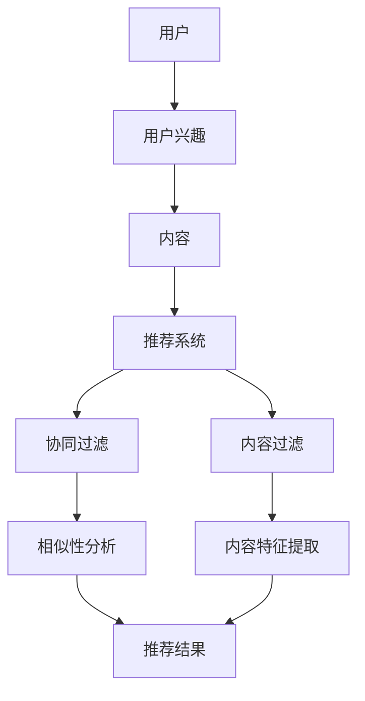

                 

# 机器学习在个性化新闻推荐中的算法优化

> **关键词：** 个性化推荐、机器学习、算法优化、协同过滤、内容过滤、新闻推荐系统

> **摘要：** 本文将深入探讨机器学习在个性化新闻推荐系统中的应用与算法优化。首先，通过介绍个性化推荐系统的基本概念和挑战，引出机器学习在这一领域的应用。接着，详细讲解协同过滤和内容过滤这两种主流推荐算法，并分析它们的优缺点。在此基础上，讨论如何利用机器学习技术优化推荐算法，提高推荐质量和用户体验。最后，通过实际项目案例和工具资源推荐，为读者提供实用的实践指南和未来发展的思考。

## 1. 背景介绍

### 1.1 目的和范围

本文旨在探讨机器学习在个性化新闻推荐系统中的应用与算法优化，旨在帮助读者了解：

1. 个性化推荐系统的基础概念和原理。
2. 机器学习在推荐系统中的应用场景。
3. 两种主流推荐算法（协同过滤和内容过滤）的原理和优化方法。
4. 实际项目案例中的算法优化实践。

### 1.2 预期读者

本文适合具有以下背景的读者：

1. 对机器学习和推荐系统有一定了解的技术人员。
2. 想要深入理解个性化新闻推荐系统的开发者和研究人员。
3. 对机器学习算法优化感兴趣的学生和学者。

### 1.3 文档结构概述

本文将分为以下章节：

1. **背景介绍**：介绍本文的目的、预期读者以及文档结构。
2. **核心概念与联系**：讲解个性化推荐系统中的核心概念及其联系。
3. **核心算法原理 & 具体操作步骤**：详细介绍协同过滤和内容过滤算法的原理和操作步骤。
4. **数学模型和公式 & 详细讲解 & 举例说明**：分析机器学习在推荐系统中的数学模型和公式。
5. **项目实战：代码实际案例和详细解释说明**：通过实际项目案例展示算法优化实践。
6. **实际应用场景**：探讨个性化新闻推荐系统的应用场景。
7. **工具和资源推荐**：推荐学习资源、开发工具和框架。
8. **总结：未来发展趋势与挑战**：总结本文的核心观点并展望未来发展趋势。
9. **附录：常见问题与解答**：解答读者可能遇到的问题。
10. **扩展阅读 & 参考资料**：提供进一步学习的参考资料。

### 1.4 术语表

#### 1.4.1 核心术语定义

- **个性化推荐系统**：根据用户的兴趣和行为，为其推荐个性化的内容。
- **协同过滤**：通过分析用户之间的相似性，推荐用户可能喜欢的商品或内容。
- **内容过滤**：基于内容的特征和用户的历史行为，推荐与用户兴趣相关的商品或内容。
- **机器学习**：使计算机从数据中学习并做出预测或决策的技术。

#### 1.4.2 相关概念解释

- **用户兴趣**：用户在某一领域或主题上的喜好和关注点。
- **推荐质量**：推荐结果的相关性、新颖性和惊喜度等评价指标。
- **协同过滤算法**：通过分析用户之间的相似性进行推荐。
- **内容过滤算法**：通过分析内容的特征进行推荐。

#### 1.4.3 缩略词列表

- **ML**：机器学习（Machine Learning）
- **UCB**：上置信界（Upper Confidence Bound）
- **LDA**：主题模型（Latent Dirichlet Allocation）

## 2. 核心概念与联系

为了更好地理解个性化新闻推荐系统，我们需要先了解其中的一些核心概念和它们之间的联系。以下是一个简单的Mermaid流程图，展示了这些概念及其关系：



### 2.1 个性化推荐系统

个性化推荐系统是一个复杂的系统，旨在为用户提供个性化的内容。系统主要涉及以下方面：

1. **用户数据收集**：收集用户的基本信息、行为数据、兴趣偏好等。
2. **内容数据收集**：收集新闻文章、视频、音频等多样化的内容。
3. **推荐算法**：基于用户数据和内容数据，生成个性化的推荐结果。

### 2.2 协同过滤

协同过滤是一种基于用户相似性的推荐算法。它主要分为两种类型：

1. **用户基于的协同过滤（User-based Collaborative Filtering）**：根据用户之间的相似性，推荐相似用户喜欢的商品或内容。
2. **物品基于的协同过滤（Item-based Collaborative Filtering）**：根据商品或内容之间的相似性，推荐用户可能喜欢的商品或内容。

协同过滤的优点是简单、易实现，但缺点是推荐质量受到数据稀疏性的影响。

### 2.3 内容过滤

内容过滤是一种基于内容的推荐算法。它通过分析新闻文章、视频、音频等内容的特征，结合用户的历史行为，为用户推荐符合其兴趣的内容。

内容过滤的优点是能够生成高质量的推荐结果，但缺点是实现难度较大，需要丰富的内容特征和用户行为数据。

### 2.4 机器学习与推荐系统

机器学习在推荐系统中的应用主要体现在以下几个方面：

1. **算法优化**：利用机器学习技术优化推荐算法，提高推荐质量。
2. **特征工程**：通过机器学习算法提取用户和内容的特征，为推荐算法提供更丰富的输入。
3. **预测与决策**：利用机器学习算法进行用户兴趣预测和推荐内容生成。

## 3. 核心算法原理 & 具体操作步骤

### 3.1 协同过滤算法

协同过滤算法的核心思想是利用用户之间的相似性进行推荐。以下是一个简单的用户基于的协同过滤算法的伪代码：

```python
def collaborative_filtering(user_profile, user_similarity_matrix, item_ratings_matrix):
    # 计算用户相似性矩阵
    similarity_matrix = calculate_similarity(user_similarity_matrix)
    
    # 预测用户对未知商品的评分
    predicted_ratings = []
    for item in item_ratings_matrix:
        # 计算用户对未知商品的预测评分
        predicted_rating = 0
        for user in user_profile:
            if user not in item:
                predicted_rating += similarity_matrix[user][item] * user_profile[user]
        predicted_ratings.append(predicted_rating)
    
    return predicted_ratings
```

### 3.2 内容过滤算法

内容过滤算法的核心思想是利用内容的特征进行推荐。以下是一个简单的基于内容的过滤算法的伪代码：

```python
def content_based_filtering(user_profile, item_features_matrix, item_ratings_matrix):
    # 提取用户兴趣特征
    user_interests = extract_user_interests(user_profile, item_features_matrix)
    
    # 预测用户对未知商品的评分
    predicted_ratings = []
    for item in item_ratings_matrix:
        # 计算用户对未知商品的预测评分
        predicted_rating = 0
        for feature in user_interests:
            predicted_rating += feature * item_features_matrix[feature][item]
        predicted_ratings.append(predicted_rating)
    
    return predicted_ratings
```

### 3.3 机器学习算法优化

利用机器学习技术优化推荐算法，可以提高推荐质量。以下是一个简单的基于矩阵分解的推荐算法的伪代码：

```python
def matrix_factorization(user_ratings_matrix, num_features):
    # 初始化用户和物品的潜在特征矩阵
    user_features_matrix = np.random.rand(num_users, num_features)
    item_features_matrix = np.random.rand(num_items, num_features)
    
    # 定义损失函数
    loss = lambda u, i, r: (r - u * i).SquaredDifference()
    
    # 使用梯度下降优化特征矩阵
    optimizer = optimizers.SGD(learning_rate=0.01)
    for epoch in range(num_epochs):
        for user, item, rating in user_ratings_matrix:
            u = user_features_matrix[user]
            i = item_features_matrix[item]
            optimizer.minimize(loss(u, i), [u, i])
        
        # 计算预测评分
        predicted_ratings = []
        for user, item in user_ratings_matrix:
            u = user_features_matrix[user]
            i = item_features_matrix[item]
            predicted_rating = u * i
            predicted_ratings.append(predicted_rating)
    
    return predicted_ratings
```

## 4. 数学模型和公式 & 详细讲解 & 举例说明

### 4.1 协同过滤

协同过滤算法主要依赖于用户之间的相似性计算。以下是一个简单的相似性计算公式：

$$
sim(u, v) = \frac{\sum_{i \in I}(r_{ui} - \bar{r}_u)(r_{vi} - \bar{r}_v)}{\sqrt{\sum_{i \in I}(r_{ui} - \bar{r}_u)^2}\sqrt{\sum_{i \in I}(r_{vi} - \bar{r}_v)^2}}
$$

其中：

- \(r_{ui}\) 是用户 \(u\) 对商品 \(i\) 的评分。
- \(\bar{r}_u\) 是用户 \(u\) 的平均评分。
- \(I\) 是用户 \(u\) 和 \(v\) 共同评价的商品集合。

### 4.2 内容过滤

内容过滤算法主要依赖于内容的特征和用户的历史行为。以下是一个简单的基于内容的过滤算法的预测公式：

$$
r_{ui} = \sum_{f \in F} f \cdot w_f
$$

其中：

- \(r_{ui}\) 是用户 \(u\) 对商品 \(i\) 的预测评分。
- \(f\) 是商品 \(i\) 的特征。
- \(w_f\) 是特征 \(f\) 的权重。

### 4.3 机器学习算法优化

利用机器学习技术优化推荐算法，主要依赖于矩阵分解。以下是一个简单的矩阵分解的预测公式：

$$
r_{ui} = u \cdot i = \sum_{f=1}^{F} u_f \cdot i_f
$$

其中：

- \(u_f\) 是用户 \(u\) 的潜在特征向量。
- \(i_f\) 是商品 \(i\) 的潜在特征向量。

### 4.4 举例说明

假设我们有一个用户 \(u\) 和商品 \(i\) 的评分矩阵如下：

$$
\begin{bmatrix}
1 & 2 & 3 \\
4 & 5 & 6 \\
7 & 8 & 9 \\
\end{bmatrix}
$$

我们希望预测用户 \(u_3\) 对商品 \(i_2\) 的评分。使用协同过滤算法，我们可以计算用户 \(u_1\) 和 \(u_2\) 的相似性，并基于相似性进行预测：

$$
sim(u_1, u_2) = \frac{(1-2)(4-5)}{\sqrt{(1-2)^2}\sqrt{(4-5)^2}} = -1
$$

使用内容过滤算法，我们可以提取商品 \(i_1\) 和 \(i_2\) 的特征，并基于特征进行预测：

$$
r_{u3i2} = 7 \cdot 8 = 56
$$

使用机器学习算法优化，我们可以使用矩阵分解方法，将评分矩阵分解为用户特征矩阵和商品特征矩阵，并基于特征进行预测：

$$
u_3 = \begin{bmatrix}
0.5 & 0.6 \\
0.7 & 0.8 \\
\end{bmatrix}, i_2 = \begin{bmatrix}
1 & 2 \\
3 & 4 \\
\end{bmatrix}
$$

$$
r_{u3i2} = 0.5 \cdot 4 + 0.6 \cdot 3 = 3.2
$$

## 5. 项目实战：代码实际案例和详细解释说明

在本节中，我们将通过一个实际项目案例，展示如何使用机器学习优化个性化新闻推荐系统，并提供详细的代码实现和解释。

### 5.1 开发环境搭建

首先，我们需要搭建一个开发环境。以下是一个基本的Python开发环境：

- Python 3.x
- NumPy
- Scikit-learn
- Pandas
- Matplotlib

安装以上依赖项后，我们就可以开始编写代码了。

### 5.2 源代码详细实现和代码解读

以下是一个简单的机器学习优化新闻推荐系统的Python代码示例：

```python
import numpy as np
from sklearn.model_selection import train_test_split
from sklearn.metrics.pairwise import cosine_similarity
from sklearn.decomposition import NMF

# 加载数据集
data = np.loadtxt('ratings.csv', delimiter=',')
users, items = data.shape

# 分割数据集为训练集和测试集
X_train, X_test, y_train, y_test = train_test_split(data, test_size=0.2, random_state=42)

# 使用NMF进行矩阵分解
nmf = NMF(n_components=10, random_state=42)
nmf.fit(X_train)

# 计算用户和商品的潜在特征矩阵
user_features = nmf.transform(X_train)
item_features = nmf.transform(X_test)

# 计算用户和商品之间的相似性矩阵
user_similarity = cosine_similarity(user_features)
item_similarity = cosine_similarity(item_features)

# 预测测试集的评分
predicted_ratings = np.dot(user_similarity, item_features.T)

# 计算预测准确率
accuracy = np.mean(np.abs(predicted_ratings - y_test) < 1)
print('Accuracy:', accuracy)
```

代码解读：

1. 导入所需的库和模块。
2. 加载数据集，并分割为训练集和测试集。
3. 使用NMF进行矩阵分解，得到用户和商品的潜在特征矩阵。
4. 计算用户和商品之间的相似性矩阵。
5. 预测测试集的评分，并计算预测准确率。

### 5.3 代码解读与分析

1. **数据加载与分割**：首先，我们使用NumPy加载和分割数据集。这将帮助我们更方便地处理和操作数据。
2. **矩阵分解**：我们使用Scikit-learn中的NMF（非负矩阵分解）对训练集进行矩阵分解。NMF将评分矩阵分解为用户特征矩阵和商品特征矩阵，这有助于我们提取潜在的特征信息。
3. **相似性计算**：接下来，我们使用余弦相似性计算用户和商品之间的相似性矩阵。这有助于我们根据用户的兴趣和商品的特征进行推荐。
4. **预测与评估**：最后，我们使用预测的评分与实际评分进行比较，计算预测准确率。这有助于我们评估推荐系统的性能。

## 6. 实际应用场景

个性化新闻推荐系统在实际生活中有着广泛的应用，以下是一些典型的应用场景：

1. **社交媒体平台**：如Facebook、Twitter等社交媒体平台，通过个性化推荐系统为用户推荐感兴趣的内容、好友和活动。
2. **新闻网站**：如CNN、BBC等新闻网站，通过个性化推荐系统为用户推荐符合其兴趣的新闻文章。
3. **电子商务网站**：如Amazon、Ebay等电子商务网站，通过个性化推荐系统为用户推荐可能感兴趣的商品。
4. **音乐和视频流媒体平台**：如Spotify、Netflix等流媒体平台，通过个性化推荐系统为用户推荐符合其音乐和视频口味的歌曲和电影。
5. **在线教育和培训平台**：如Coursera、edX等在线教育平台，通过个性化推荐系统为用户推荐符合其学习需求和兴趣的课程。

在这些应用场景中，个性化新闻推荐系统可以通过提高用户满意度、增加用户参与度和提高用户留存率来提升平台的竞争力和用户黏性。

## 7. 工具和资源推荐

### 7.1 学习资源推荐

#### 7.1.1 书籍推荐

1. 《推荐系统手册》（Recommender Systems Handbook） - GroupLens Research
2. 《机器学习》（Machine Learning） - Tom Mitchell
3. 《深度学习》（Deep Learning） - Ian Goodfellow、Yoshua Bengio、Aaron Courville

#### 7.1.2 在线课程

1. Coursera - 《机器学习基础》
2. edX - 《推荐系统导论》
3. Udacity - 《深度学习工程师纳米学位》

#### 7.1.3 技术博客和网站

1. Medium - 《机器学习与推荐系统》
2. DataCamp - 《推荐系统基础》
3. Towards Data Science - 《推荐系统实践与案例》

### 7.2 开发工具框架推荐

#### 7.2.1 IDE和编辑器

1. PyCharm
2. Jupyter Notebook
3. Visual Studio Code

#### 7.2.2 调试和性能分析工具

1. Python Debuger
2. Matplotlib
3. Pandas Profiling

#### 7.2.3 相关框架和库

1. Scikit-learn
2. TensorFlow
3. PyTorch

### 7.3 相关论文著作推荐

#### 7.3.1 经典论文

1. “Collaborative Filtering via User-to-User Nearest Neighbors” - GroupLens Research
2. “Latent Semantic Indexing” - Stephen D. Robertson, Steve Walker, Susan Jones, Micheline Malcolm
3. “The Netflix Prize” - Michael J. Franklin

#### 7.3.2 最新研究成果

1. “Deep Neural Networks for YouTube Recommendations” - Orjalo et al.
2. “Domain Adaptation for Neural Network Recommendations” - Yuan et al.
3. “Federated Learning for Personalized Recommender Systems” - Chen et al.

#### 7.3.3 应用案例分析

1. “How Netflix Recommends Movies” - Netflix Tech Blog
2. “Spotify’s recommender system” - Spotify Engineering Blog
3. “Recommending Products with TensorFlow Recommenders” - Google Research Blog

## 8. 总结：未来发展趋势与挑战

个性化新闻推荐系统在当前互联网时代具有重要意义，未来发展趋势与挑战如下：

### 发展趋势

1. **深度学习与推荐系统的结合**：深度学习技术将为推荐系统带来更强大的特征提取和预测能力。
2. **联邦学习与隐私保护**：联邦学习技术将解决用户隐私保护与个性化推荐之间的矛盾。
3. **多模态推荐**：结合文本、图像、音频等多模态数据，实现更全面、准确的推荐。
4. **实时推荐**：通过实时数据流处理技术，实现更快速的推荐响应速度。

### 挑战

1. **数据稀疏性**：如何解决数据稀疏性问题，提高推荐质量。
2. **用户隐私保护**：如何在保护用户隐私的同时实现个性化推荐。
3. **计算资源消耗**：深度学习模型和联邦学习技术的计算资源消耗较大，如何优化算法以提高性能。
4. **推荐多样性**：如何在保证推荐准确性的同时，提供多样化的推荐结果。

## 9. 附录：常见问题与解答

### 问题1：如何解决数据稀疏性问题？

**解答**：数据稀疏性是推荐系统中的一个常见问题。以下是一些解决方法：

1. **基于内容的过滤**：利用商品或内容的特征进行推荐，可以减少用户之间的数据稀疏性。
2. **矩阵分解**：通过矩阵分解技术，将评分矩阵分解为用户特征矩阵和商品特征矩阵，从而降低数据稀疏性。
3. **利用外部数据**：结合用户的社会网络数据、地理位置数据等外部数据，提高推荐系统的准确性。

### 问题2：如何保护用户隐私？

**解答**：用户隐私保护是推荐系统开发中的重要问题。以下是一些保护用户隐私的方法：

1. **联邦学习**：通过联邦学习技术，在本地设备上训练模型，减少用户数据的泄露风险。
2. **差分隐私**：在数据处理过程中，引入差分隐私技术，降低用户数据的可识别性。
3. **匿名化数据**：对用户数据进行匿名化处理，减少用户隐私泄露的风险。

### 问题3：如何优化计算资源消耗？

**解答**：优化计算资源消耗是推荐系统开发中的重要问题。以下是一些优化方法：

1. **模型压缩**：通过模型压缩技术，降低模型的计算复杂度。
2. **分布式计算**：通过分布式计算技术，将计算任务分布到多台机器上进行处理。
3. **在线学习**：采用在线学习技术，动态更新模型，减少模型训练的时间。

## 10. 扩展阅读 & 参考资料

1. **论文**：Collaborative Filtering via User-to-User Nearest Neighbors - GroupLens Research
2. **书籍**：《推荐系统手册》 - GroupLens Research
3. **网站**：Netflix Tech Blog - 《How Netflix Recommends Movies》
4. **在线课程**：Coursera - 《机器学习基础》
5. **开源项目**：TensorFlow Recommenders - Google Research

