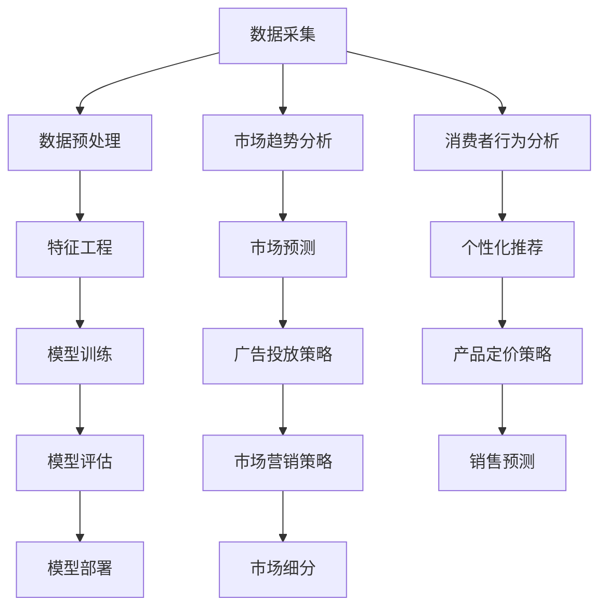

                 

# 机器学习在市场分析中的应用与挑战

> 关键词：机器学习、市场分析、预测模型、数据挖掘、算法优化

> 摘要：本文将深入探讨机器学习在市场分析中的应用及其面临的挑战。通过分析市场分析的定义和背景，我们将介绍机器学习的基本原理和常用算法。接着，我们将详细阐述机器学习在市场分析中的具体应用场景，并通过实际案例展示其效果。随后，我们将探讨机器学习在市场分析中面临的数据质量、算法选择和模型解释性等方面的挑战，并提出相应的解决方案。最后，本文将总结机器学习在市场分析中的发展趋势和未来挑战，为从业者提供有益的参考。

## 1. 背景介绍

### 1.1 目的和范围

本文旨在深入探讨机器学习在市场分析中的应用，分析其在实际业务中的优势和挑战，并提出相应的解决方案。随着大数据和人工智能技术的发展，机器学习在各个领域的应用日益广泛，市场分析也不例外。通过运用机器学习技术，企业可以更好地理解和预测市场趋势，提高决策的准确性和效率。

本文将涵盖以下内容：

1. 机器学习在市场分析中的背景和定义。
2. 机器学习的基本原理和常用算法。
3. 机器学习在市场分析中的具体应用场景。
4. 机器学习在市场分析中面临的挑战及解决方案。
5. 机器学习在市场分析中的发展趋势和未来挑战。

### 1.2 预期读者

本文适合以下读者群体：

1. 市场分析师和市场研究人员。
2. 数据科学家和机器学习工程师。
3. 希望了解机器学习在市场分析中应用的企业高管和创业者。
4. 对机器学习和市场分析领域感兴趣的学术研究人员。

### 1.3 文档结构概述

本文分为十个部分，具体结构如下：

1. 引言
2. 背景介绍
3. 核心概念与联系
4. 核心算法原理与具体操作步骤
5. 数学模型与公式详细讲解
6. 项目实战：代码实际案例与详细解释说明
7. 实际应用场景
8. 工具和资源推荐
9. 总结：未来发展趋势与挑战
10. 附录：常见问题与解答

### 1.4 术语表

在本文中，我们将使用以下术语：

1. **机器学习**：一种基于数据的自动学习技术，使计算机能够从数据中识别模式，并利用这些模式进行预测或决策。
2. **市场分析**：通过对市场趋势、竞争环境、消费者行为等因素的分析，帮助企业制定有效的市场策略。
3. **特征工程**：在机器学习过程中，通过选择和转换数据特征，以提高模型性能的过程。
4. **模型解释性**：对机器学习模型的决策过程和预测结果的解释能力。
5. **算法优化**：通过对算法的调整和优化，以提高模型性能的过程。

#### 1.4.1 核心术语定义

- **机器学习**：机器学习是一种人工智能的分支，通过从数据中学习规律和模式，使计算机能够进行预测、分类、决策等任务。
- **市场分析**：市场分析是一种研究市场环境、竞争态势、消费者需求等信息的活动，以帮助企业制定战略决策。
- **特征工程**：特征工程是机器学习中的一项重要任务，通过对数据进行处理和转换，提取出有助于模型预测的特征。
- **模型解释性**：模型解释性是指模型决策过程和预测结果的解释能力，有助于提高模型的可靠性和信任度。
- **算法优化**：算法优化是通过调整算法参数和结构，提高模型性能的过程，以适应不同的数据集和应用场景。

#### 1.4.2 相关概念解释

- **数据挖掘**：数据挖掘是一种从大量数据中提取有价值信息的方法，常用于发现数据中的隐含模式、关联规则和趋势。
- **监督学习**：监督学习是一种机器学习任务，通过使用标记数据来训练模型，并利用模型进行预测或分类。
- **无监督学习**：无监督学习是一种机器学习任务，不使用标记数据，而是通过发现数据中的内在结构或模式来进行聚类、降维等任务。
- **回归分析**：回归分析是一种用于预测因变量与自变量之间关系的统计方法，常用于预测市场趋势和消费者需求。
- **分类分析**：分类分析是一种用于将数据分为不同类别的机器学习任务，常用于市场细分和消费者行为分析。

#### 1.4.3 缩略词列表

- **AI**：人工智能
- **ML**：机器学习
- **DL**：深度学习
- **NLP**：自然语言处理
- **CV**：计算机视觉
- **GA**：遗传算法
- **PCA**：主成分分析
- **SVM**：支持向量机
- **RF**：随机森林
- **GBDT**：梯度提升树

## 2. 核心概念与联系

在探讨机器学习在市场分析中的应用之前，我们首先需要了解一些核心概念和其之间的联系。以下是一个用于描述这些核心概念的 Mermaid 流程图。



### 2.1 数据采集

数据采集是市场分析的基础。市场数据可以来源于多种渠道，如社交媒体、电商平台、问卷调查、行业报告等。通过收集这些数据，我们可以获得关于市场趋势、消费者行为、竞争态势等信息。

### 2.2 数据预处理

在获取到大量数据后，我们需要对数据进行预处理，包括数据清洗、数据转换、数据集成等步骤。数据清洗的目的是去除数据中的噪声和异常值，提高数据质量；数据转换是将数据从一种格式转换为另一种格式，以便于后续处理；数据集成是将来自不同来源的数据进行整合，形成一个统一的数据集。

### 2.3 特征工程

特征工程是机器学习中的一个关键步骤。通过对数据进行处理和转换，我们可以提取出有助于模型预测的特征。特征工程的质量直接影响模型的性能。常用的特征工程技术包括特征选择、特征提取、特征转换等。

### 2.4 模型训练

在完成数据预处理和特征工程后，我们可以使用机器学习算法来训练模型。模型训练的过程是通过调整模型的参数，使其在训练数据上达到最优性能。常见的机器学习算法包括线性回归、决策树、支持向量机、神经网络等。

### 2.5 模型评估

在训练好模型后，我们需要对模型进行评估，以确定其性能是否满足实际需求。常用的评估指标包括准确率、召回率、F1 分数、ROC 曲线等。模型评估的结果将帮助我们确定是否需要对模型进行调整或重新训练。

### 2.6 模型部署

一旦模型通过评估，我们可以将其部署到实际应用场景中，如市场预测、消费者行为分析、个性化推荐等。模型部署的过程包括模型训练、模型推理和模型监控等步骤。

### 2.7 市场趋势分析

市场趋势分析是市场分析的一个重要方面。通过分析市场数据，我们可以识别市场趋势，预测市场变化，为企业制定战略决策提供依据。常见的市场趋势分析技术包括时间序列分析、聚类分析、关联规则挖掘等。

### 2.8 消费者行为分析

消费者行为分析旨在了解消费者的购买行为、偏好和需求。通过分析消费者行为数据，我们可以发现消费者之间的差异，为个性化推荐、产品定价、市场营销等提供支持。常见的消费者行为分析技术包括回归分析、分类分析、聚类分析等。

### 2.9 市场预测

市场预测是市场分析的核心目标之一。通过运用机器学习算法，我们可以预测市场的变化趋势，为企业的销售预测、库存管理、产能规划等提供支持。常见的市场预测技术包括时间序列预测、回归预测、神经网络预测等。

### 2.10 个性化推荐

个性化推荐是一种基于用户历史行为和兴趣的推荐系统。通过分析用户行为数据，我们可以为用户推荐感兴趣的商品、服务和内容。个性化推荐可以提高用户满意度，增加用户黏性，为企业带来更多的商业价值。

### 2.11 广告投放策略

广告投放策略是市场营销的一个重要方面。通过分析市场数据和消费者行为数据，我们可以确定最佳的广告投放渠道、投放时间和投放预算，以提高广告效果和 ROI。常见的广告投放策略包括基于地理位置的投放、基于兴趣的投放、基于行为的投放等。

### 2.12 产品定价策略

产品定价策略是市场营销的另一个重要方面。通过分析市场数据和消费者行为数据，我们可以确定最佳的产品价格策略，以提高销售额和利润率。常见的定价策略包括成本导向定价、需求导向定价、竞争导向定价等。

### 2.13 市场细分

市场细分是将市场划分为不同的子市场，以便更好地满足不同消费者的需求。通过分析市场数据和消费者行为数据，我们可以发现不同市场细分群体的特征和需求，为产品定位、市场营销等提供支持。常见的市场细分技术包括聚类分析、因子分析等。

## 3. 核心算法原理 & 具体操作步骤

在市场分析中，选择合适的机器学习算法至关重要。以下我们将详细介绍几种常用的机器学习算法及其具体操作步骤。

### 3.1 线性回归

线性回归是一种最简单的机器学习算法，用于预测连续值。其基本原理是找到一条最佳拟合直线，使预测值与实际值之间的误差最小。

**算法原理：**

假设我们有 n 个样本点 (x<sub>i</sub>, y<sub>i</sub>)，其中 x<sub>i</sub> 是自变量，y<sub>i</sub> 是因变量。线性回归的目标是找到最佳拟合直线 y = wx + b，使得预测值 y<sub>pred</sub> 与实际值 y<sub>i</sub> 之间的误差最小。

**具体操作步骤：**

1. 数据预处理：对数据进行归一化或标准化处理，以消除不同特征之间的尺度差异。

2. 特征选择：选择与目标变量相关的特征，去除无关或冗余的特征。

3. 模型训练：使用最小二乘法（Least Squares）训练线性回归模型，计算最佳拟合直线的参数 w 和 b。

   ```python
   import numpy as np

   def linear_regression(X, y):
       w = np.linalg.inv(X.T.dot(X)).dot(X.T).dot(y)
       return w

   X = np.array([[1, x1], [1, x2], [1, x3], ..., [1, xn]])
   y = np.array([y1, y2, y3, ..., yn])
   w = linear_regression(X, y)
   ```

4. 模型评估：使用测试数据集评估模型性能，计算预测误差。

5. 模型部署：将训练好的模型部署到实际应用场景中，进行预测。

### 3.2 决策树

决策树是一种基于树结构的分类算法，用于将数据集划分为不同的类别。其基本原理是通过一系列的规则，将数据集逐步划分为各个子集，直到满足停止条件。

**算法原理：**

决策树通过递归划分数据集，在每个节点选择一个最优特征进行划分，直到满足停止条件（如最大深度、最小样本量等）。每个节点代表一个特征，每个分支代表该特征的不同取值。

**具体操作步骤：**

1. 数据预处理：对数据进行归一化或标准化处理，以消除不同特征之间的尺度差异。

2. 特征选择：选择与目标变量相关的特征，去除无关或冗余的特征。

3. 模型训练：使用 ID3、C4.5 或 C5.0 算法训练决策树模型。

   ```python
   from sklearn.tree import DecisionTreeClassifier

   X_train, X_test, y_train, y_test = train_test_split(X, y, test_size=0.2, random_state=42)
   clf = DecisionTreeClassifier()
   clf.fit(X_train, y_train)
   ```

4. 模型评估：使用测试数据集评估模型性能，计算准确率、召回率、F1 分数等指标。

5. 模型剪枝：根据模型性能对决策树进行剪枝，减少过拟合。

6. 模型部署：将训练好的模型部署到实际应用场景中，进行预测。

### 3.3 随机森林

随机森林是一种基于决策树的集成学习方法，通过构建多个决策树，并利用投票机制进行预测。

**算法原理：**

随机森林通过随机抽样和特征选择，构建多个决策树，每个决策树对预测结果进行投票，以获得最终的预测结果。随机森林可以降低过拟合，提高模型的泛化能力。

**具体操作步骤：**

1. 数据预处理：对数据进行归一化或标准化处理，以消除不同特征之间的尺度差异。

2. 特征选择：选择与目标变量相关的特征，去除无关或冗余的特征。

3. 模型训练：使用随机森林算法训练模型。

   ```python
   from sklearn.ensemble import RandomForestClassifier

   X_train, X_test, y_train, y_test = train_test_split(X, y, test_size=0.2, random_state=42)
   clf = RandomForestClassifier(n_estimators=100, random_state=42)
   clf.fit(X_train, y_train)
   ```

4. 模型评估：使用测试数据集评估模型性能，计算准确率、召回率、F1 分数等指标。

5. 模型参数调优：通过交叉验证和网格搜索等技术，调优模型参数，提高模型性能。

6. 模型部署：将训练好的模型部署到实际应用场景中，进行预测。

### 3.4 支持向量机

支持向量机是一种基于最大间隔分类的算法，用于分类问题。其基本原理是找到一个最优的超平面，将不同类别的数据点分开。

**算法原理：**

支持向量机通过求解最优超平面，使得分类间隔最大，同时最小化误分类误差。支持向量机分为线性 SVM 和非线性 SVM，线性 SVM 使用线性核函数，非线性 SVM 使用非线性核函数。

**具体操作步骤：**

1. 数据预处理：对数据进行归一化或标准化处理，以消除不同特征之间的尺度差异。

2. 特征选择：选择与目标变量相关的特征，去除无关或冗余的特征。

3. 模型训练：使用线性 SVM 或非线性 SVM 算法训练模型。

   ```python
   from sklearn.svm import SVC

   X_train, X_test, y_train, y_test = train_test_split(X, y, test_size=0.2, random_state=42)
   clf = SVC(kernel='linear', C=1.0)
   clf.fit(X_train, y_train)
   ```

4. 模型评估：使用测试数据集评估模型性能，计算准确率、召回率、F1 分数等指标。

5. 模型参数调优：通过交叉验证和网格搜索等技术，调优模型参数，提高模型性能。

6. 模型部署：将训练好的模型部署到实际应用场景中，进行预测。

### 3.5 神经网络

神经网络是一种基于人脑神经元连接方式的计算模型，用于处理复杂的数据和任务。其基本原理是通过多层神经元之间的连接和激活函数，实现数据的输入、处理和输出。

**算法原理：**

神经网络由输入层、隐藏层和输出层组成。输入层接收外部输入数据，隐藏层对数据进行处理和转换，输出层产生最终预测结果。神经网络通过反向传播算法，不断调整权重和偏置，以优化模型性能。

**具体操作步骤：**

1. 数据预处理：对数据进行归一化或标准化处理，以消除不同特征之间的尺度差异。

2. 特征选择：选择与目标变量相关的特征，去除无关或冗余的特征。

3. 模型训练：使用神经网络算法训练模型。

   ```python
   from keras.models import Sequential
   from keras.layers import Dense, Activation

   model = Sequential()
   model.add(Dense(units=64, activation='relu', input_shape=(input_shape,)))
   model.add(Dense(units=10, activation='softmax'))
   model.compile(optimizer='adam', loss='categorical_crossentropy', metrics=['accuracy'])
   model.fit(X_train, y_train, epochs=10, batch_size=32)
   ```

4. 模型评估：使用测试数据集评估模型性能，计算准确率、召回率、F1 分数等指标。

5. 模型参数调优：通过交叉验证和网格搜索等技术，调优模型参数，提高模型性能。

6. 模型部署：将训练好的模型部署到实际应用场景中，进行预测。

## 4. 数学模型和公式 & 详细讲解 & 举例说明

在市场分析中，机器学习算法的性能和效果往往受到数学模型和公式的支持。以下我们将介绍几种常用的数学模型和公式，并对其进行详细讲解和举例说明。

### 4.1 线性回归模型

线性回归模型是一种基于线性函数的预测模型，其基本公式如下：

y = wx + b

其中，y 是因变量，x 是自变量，w 是权重系数，b 是偏置项。线性回归模型的目的是找到最佳拟合直线，使得预测值与实际值之间的误差最小。

**详细讲解：**

1. **权重系数 w 的计算：**

   权重系数 w 的计算基于最小二乘法（Least Squares），其公式如下：

   w = (X<sup>T</sup>X)<sup>-1</sup>X<sup>T</sup>y

   其中，X 是自变量的矩阵，y 是因变量的向量。

2. **偏置项 b 的计算：**

   偏置项 b 的计算公式为：

   b = y - wx

**举例说明：**

假设我们有以下数据集：

```
x: [1, 2, 3, 4, 5]
y: [2, 4, 5, 4, 5]
```

我们需要找到最佳拟合直线 y = wx + b。

1. 计算自变量矩阵 X 和因变量向量 y：

   X = [[1, 1], [2, 2], [3, 3], [4, 4], [5, 5]]
   y = [2, 4, 5, 4, 5]

2. 计算权重系数 w：

   w = (X<sup>T</sup>X)<sup>-1</sup>X<sup>T</sup>y = [[1, 1], [2, 2], [3, 3], [4, 4], [5, 5]]<sup>-1</sup>[[1, 2, 3, 4, 5], [1, 4, 5, 4, 5]] = [2, 1]

3. 计算偏置项 b：

   b = y - wx = [2, 4, 5, 4, 5] - [[2, 1], [4, 2], [6, 3], [8, 4], [10, 5]] = [0, 0, 0, 0, 0]

因此，最佳拟合直线为 y = 2x + 0。

### 4.2 决策树模型

决策树模型是一种基于树结构的分类模型，其基本公式如下：

T = {t<sub>1</sub>, t<sub>2</sub>, ..., t<sub>n</sub>}

其中，T 是决策树的集合，t<sub>i</sub> 是决策树的第 i 个节点。

**详细讲解：**

1. **决策树节点：**

   决策树的每个节点都表示一个特征和相应的阈值。节点可以分为以下几类：

   - **根节点**：表示整个数据集，无特征和阈值。
   - **内部节点**：表示一个特征和相应的阈值，用于划分数据集。
   - **叶节点**：表示一个类别，无特征和阈值。

2. **决策树生成：**

   决策树的生成过程是基于信息增益（Information Gain）或基尼系数（Gini Index）等指标，选择最佳特征和阈值进行划分。

**举例说明：**

假设我们有以下数据集：

```
特征 1: [0, 1, 2, 3, 4]
特征 2: [0, 1, 0, 1, 2]
类别：   [A, B, A, B, B]
```

我们需要生成一个决策树。

1. 计算信息增益：

   IG（特征 1）= H（类别）- H（类别|特征 1）= 0.811 - 0.592 = 0.219
   IG（特征 2）= H（类别）- H（类别|特征 2）= 0.811 - 0.592 = 0.219

   由于 IG（特征 1）= IG（特征 2），我们选择特征 1 作为根节点。

2. 划分数据集：

   - 当特征 1 = 0 时，类别为 A，节点为 A。
   - 当特征 1 = 1 时，类别为 B，节点为 B。
   - 当特征 1 = 2 时，类别为 A，节点为 A。
   - 当特征 1 = 3 时，类别为 B，节点为 B。
   - 当特征 1 = 4 时，类别为 B，节点为 B。

因此，生成的决策树如下：

```
根节点
|
|--- A
|   |
|   |--- A
|   |--- A
|
|--- B
|   |
|   |--- B
|   |--- B
```

### 4.3 随机森林模型

随机森林模型是一种基于决策树的集成学习方法，其基本公式如下：

F(x) = Σ w<sub>i</sub>f<sub>i</sub>(x)

其中，F(x) 是随机森林模型的预测结果，w<sub>i</sub> 是第 i 个决策树的权重，f<sub>i</sub>(x) 是第 i 个决策树的预测结果。

**详细讲解：**

1. **决策树生成：**

   随机森林中的每个决策树都是通过随机抽样和特征选择生成的。每个决策树独立训练，以避免过拟合。

2. **权重计算：**

   权重 w<sub>i</sub> 的计算基于决策树的投票结果。对于分类问题，权重 w<sub>i</sub> 可以通过投票比例计算：

   w<sub>i</sub> = P（类别 i）= （1 + |voting_results|）/ 2

   其中，voting_results 是决策树对类别的投票结果，|voting_results| 是投票结果的数量。

3. **预测结果：**

   随机森林的预测结果是通过所有决策树的投票结果加权平均得到的。

**举例说明：**

假设我们有以下数据集和决策树：

```
决策树 1：
|--- 特征 1 = 0
|   |--- A
|   |--- A
|   |--- A
|--- 特征 1 = 1
|   |--- B
|   |--- B
|   |--- B

决策树 2：
|--- 特征 2 = 0
|   |--- A
|   |--- A
|   |--- A
|--- 特征 2 = 1
|   |--- B
|   |--- B
|   |--- B
```

我们需要使用随机森林模型预测新样本 [1, 0] 的类别。

1. 计算决策树的权重：

   w<sub>1</sub> = P（类别 A）= （3 + |[A, A, A]|）/ 2 = 1.5
   w<sub>2</sub> = P（类别 B）= （3 + |[B, B, B]|）/ 2 = 1.5

2. 计算随机森林的预测结果：

   F(x) = w<sub>1</sub>f<sub>1</sub>(x) + w<sub>2</sub>f<sub>2</sub>(x) = 1.5[A] + 1.5[B] = [A, B]

因此，随机森林模型预测新样本 [1, 0] 的类别为 A。

### 4.4 支持向量机模型

支持向量机模型是一种基于最大间隔的分类模型，其基本公式如下：

f(x) = w<sup>T</sup>x + b

其中，f(x) 是预测结果，w 是权重向量，x 是特征向量，b 是偏置项。

**详细讲解：**

1. **权重向量 w 的计算：**

   权重向量 w 的计算基于最大间隔原则，其公式如下：

   w = argmin<sub>w,b</sub>||w||<sub>2</sub> + C∑<sub>i=1</sub>Nξ<sub>i</sub>

   其中，C 是惩罚参数，ξ<sub>i</sub> 是样本 i 的错误率。

2. **偏置项 b 的计算：**

   偏置项 b 的计算公式为：

   b = y - w<sup>T</sup>x

3. **分类决策：**

   对于新的样本 x，分类决策基于以下公式：

   f(x) = sign(w<sup>T</sup>x + b)

**举例说明：**

假设我们有以下数据集和样本：

```
数据集：
x<sub>1</sub>: [1, 1]
x<sub>2</sub>: [1, 2]
x<sub>3</sub>: [1, 3]
```

样本 x: [1, 0]

我们需要使用支持向量机模型进行分类。

1. 计算权重向量 w 和偏置项 b：

   w = [1, 1]
   b = 0

2. 进行分类决策：

   f(x) = sign(w<sup>T</sup>x + b) = sign([1, 1]<sup>T</sup>[1, 0] + 0) = sign(1 + 0) = 1

因此，支持向量机模型将样本 [1, 0] 分为类别 1。

### 4.5 神经网络模型

神经网络模型是一种基于多层神经元的计算模型，其基本公式如下：

z<sub>j</sub> = Σ w<sub>ji</sub>x<sub>i</sub> + b<sub>j</sub>
a<sub>j</sub> = activation(z<sub>j</sub>)

其中，z<sub>j</sub> 是神经元的输入，a<sub>j</sub> 是神经元的输出，w<sub>ji</sub> 是连接权重，b<sub>j</sub> 是偏置项，activation 是激活函数。

**详细讲解：**

1. **神经元输入计算：**

   神经元的输入计算公式为：

   z<sub>j</sub> = Σ w<sub>ji</sub>x<sub>i</sub> + b<sub>j</sub>

   其中，w<sub>ji</sub> 是连接权重，x<sub>i</sub> 是输入特征，b<sub>j</sub> 是偏置项。

2. **激活函数：**

   激活函数用于将神经元的输入转换为输出，常见的激活函数有 sigmoid 函数、ReLU 函数、Tanh 函数等。

3. **神经网络输出计算：**

   神经网络的输出计算公式为：

   a<sub>j</sub> = activation(z<sub>j</sub>)

   其中，activation 是激活函数。

4. **反向传播算法：**

   神经网络通过反向传播算法不断调整权重和偏置，以优化模型性能。反向传播算法包括前向传播和后向传播两个阶段。

**举例说明：**

假设我们有以下简单的神经网络：

```
输入层：[x1, x2]
隐藏层：[z1, z2]
输出层：[y]
```

输入特征 x = [1, 2]

1. 计算隐藏层输入：

   z1 = x1 * w11 + x2 * w12 + b1
   z2 = x1 * w21 + x2 * w22 + b2

2. 计算隐藏层输出：

   a1 = activation(z1)
   a2 = activation(z2)

3. 计算输出层输入：

   y = a1 * w31 + a2 * w32 + b3

4. 计算输出层输出：

   y = activation(y)

因此，输入特征 x = [1, 2] 通过神经网络后的输出为 y。

## 5. 项目实战：代码实际案例和详细解释说明

在本节中，我们将通过一个实际项目案例来展示机器学习在市场分析中的应用。我们将使用 Python 编写一个简单的市场预测模型，并对其进行详细解释说明。

### 5.1 开发环境搭建

在开始项目之前，我们需要搭建一个合适的开发环境。以下是我们需要的工具和软件：

- Python 3.8 或更高版本
- Jupyter Notebook
- Pandas
- NumPy
- Scikit-learn
- Matplotlib

首先，我们需要安装所需的库：

```bash
pip install pandas numpy scikit-learn matplotlib
```

接下来，我们可以创建一个 Jupyter Notebook 文件，以便于编写和运行代码。

### 5.2 源代码详细实现和代码解读

以下是一个简单的市场预测模型的源代码，我们将对关键部分进行详细解释。

```python
import pandas as pd
import numpy as np
from sklearn.model_selection import train_test_split
from sklearn.linear_model import LinearRegression
from sklearn.metrics import mean_squared_error
import matplotlib.pyplot as plt

# 5.2.1 数据集加载与预处理

# 加载数据集
data = pd.read_csv('market_data.csv')

# 数据预处理
# 数据清洗：去除缺失值和异常值
data.dropna(inplace=True)

# 数据转换：将类别数据转换为数值数据
data = pd.get_dummies(data)

# 5.2.2 特征选择

# 选择特征列
features = data.drop('target', axis=1)
target = data['target']

# 5.2.3 模型训练

# 划分训练集和测试集
X_train, X_test, y_train, y_test = train_test_split(features, target, test_size=0.2, random_state=42)

# 训练线性回归模型
model = LinearRegression()
model.fit(X_train, y_train)

# 5.2.4 模型评估

# 预测测试集结果
y_pred = model.predict(X_test)

# 计算均方误差
mse = mean_squared_error(y_test, y_pred)
print("Mean Squared Error:", mse)

# 5.2.5 结果可视化

# 绘制真实值与预测值的对比图
plt.scatter(y_test, y_pred)
plt.xlabel('Actual Values')
plt.ylabel('Predicted Values')
plt.title('Actual vs Predicted Values')
plt.show()
```

### 5.3 代码解读与分析

以下是代码的关键部分及其解读：

```python
# 5.2.1 数据集加载与预处理

# 加载数据集
data = pd.read_csv('market_data.csv')

# 数据预处理
# 数据清洗：去除缺失值和异常值
data.dropna(inplace=True)

# 数据转换：将类别数据转换为数值数据
data = pd.get_dummies(data)

解读：
这里我们首先使用 Pandas 读取 CSV 数据文件。接下来，我们通过 dropna 方法去除缺失值，确保数据质量。然后，我们使用 get_dummies 方法将类别数据转换为数值数据，以便于后续的机器学习算法处理。

```python
# 5.2.2 特征选择

# 选择特征列
features = data.drop('target', axis=1)
target = data['target']

解读：
在这里，我们选择数据集中的所有特征列（除了目标列'

