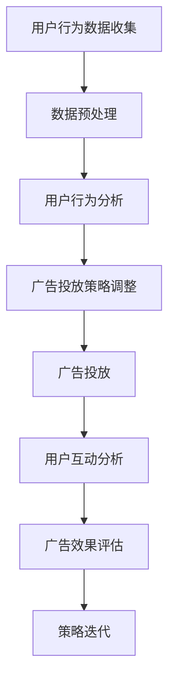

                 

# 机器学习在广告推荐系统中的应用

> **关键词**：机器学习、广告推荐系统、协同过滤、内容推荐、用户行为分析、算法优化

> **摘要**：本文深入探讨了机器学习在广告推荐系统中的应用。首先，介绍了机器学习的基本概念和其在推荐系统中的重要性。随后，详细阐述了协同过滤算法和基于内容的推荐算法，并通过实例说明了如何使用机器学习技术优化广告推荐系统。最后，探讨了广告推荐系统在实际应用中的挑战和未来发展趋势。

## 1. 背景介绍

### 1.1 目的和范围

本文旨在通过深入分析和实例讲解，帮助读者理解机器学习在广告推荐系统中的应用。我们将讨论机器学习的基础知识、推荐系统的架构、以及如何利用机器学习算法优化广告推荐效果。

### 1.2 预期读者

本文适合对机器学习和广告推荐系统有一定了解的技术人员，包括数据科学家、机器学习工程师和软件工程师。

### 1.3 文档结构概述

本文分为十个部分，包括：

1. 背景介绍
2. 核心概念与联系
3. 核心算法原理 & 具体操作步骤
4. 数学模型和公式 & 详细讲解 & 举例说明
5. 项目实战：代码实际案例和详细解释说明
6. 实际应用场景
7. 工具和资源推荐
8. 总结：未来发展趋势与挑战
9. 附录：常见问题与解答
10. 扩展阅读 & 参考资料

### 1.4 术语表

#### 1.4.1 核心术语定义

- **机器学习**：一种人工智能技术，通过数据和算法让计算机自主学习和改进。
- **推荐系统**：根据用户的历史行为和偏好，为用户推荐相关内容或商品的系统。
- **协同过滤**：一种常见的推荐算法，通过分析用户之间的相似性来推荐商品。
- **内容推荐**：基于物品的内容特征进行推荐，如文章、视频、音乐等。
- **用户行为分析**：对用户在系统中的行为数据进行收集和分析，用于优化推荐效果。

#### 1.4.2 相关概念解释

- **广告推荐系统**：在推荐系统中整合广告，根据用户的兴趣和行为，为用户展示相关的广告。
- **点击率（CTR）**：广告被用户点击的频率，是广告效果的重要指标。
- **转化率（CVR）**：广告点击后，用户完成相应操作的频率。

#### 1.4.3 缩略词列表

- **ML**：Machine Learning（机器学习）
- **CTR**：Click-Through Rate（点击率）
- **CVR**：Conversion Rate（转化率）

## 2. 核心概念与联系

在讨论机器学习在广告推荐系统中的应用之前，我们首先需要了解相关的核心概念和它们之间的联系。

### 2.1 机器学习在广告推荐系统中的作用

机器学习在广告推荐系统中主要起到以下作用：

1. **用户行为分析**：通过分析用户的历史行为，如浏览、点击、购买等，了解用户的兴趣和偏好。
2. **广告投放优化**：根据用户行为和兴趣，动态调整广告投放策略，提高点击率和转化率。
3. **内容个性化推荐**：基于用户的兴趣和行为，推荐相关的广告内容，增加用户互动和满意度。
4. **广告效果评估**：通过分析广告的投放效果，如点击率、转化率等，持续优化广告策略。

### 2.2 核心概念原理和架构的 Mermaid 流程图



### 2.3 机器学习在广告推荐系统中的应用架构


## 3. 核心算法原理 & 具体操作步骤

在广告推荐系统中，常用的机器学习算法包括协同过滤算法和基于内容的推荐算法。下面我们将详细讲解这些算法的原理和具体操作步骤。

### 3.1 协同过滤算法

#### 3.1.1 算法原理

协同过滤算法基于用户之间的相似性进行推荐。具体步骤如下：

1. **用户相似性计算**：通过计算用户之间的相似度，确定哪些用户的行为对推荐有较大影响。
2. **基于相似度推荐**：根据用户与目标用户的相似度，从相似用户喜欢的商品中推荐给目标用户。

#### 3.1.2 具体操作步骤

1. **用户行为数据收集**：收集用户的历史行为数据，如浏览、点击、购买等。
2. **用户行为矩阵构建**：将用户行为数据转化为行为矩阵，其中每个元素表示用户对商品的评分或行为。
3. **用户相似度计算**：计算用户之间的相似度，可以使用余弦相似度、皮尔逊相关系数等方法。
4. **推荐商品选择**：根据用户与目标用户的相似度，从相似用户喜欢的商品中推荐给目标用户。

### 3.2 基于内容的推荐算法

#### 3.2.1 算法原理

基于内容的推荐算法基于物品的内容特征进行推荐。具体步骤如下：

1. **商品特征提取**：提取商品的特征信息，如标题、描述、标签等。
2. **用户兴趣模型建立**：根据用户的历史行为，建立用户的兴趣模型。
3. **内容相似度计算**：计算用户兴趣模型与商品特征之间的相似度。
4. **推荐商品选择**：根据商品与用户兴趣模型之间的相似度，推荐相关商品。

#### 3.2.2 具体操作步骤

1. **商品特征提取**：从商品数据中提取标题、描述、标签等特征信息。
2. **用户兴趣模型建立**：通过分析用户的历史行为，建立用户的兴趣模型。
3. **内容相似度计算**：计算用户兴趣模型与商品特征之间的相似度，可以使用TF-IDF、余弦相似度等方法。
4. **推荐商品选择**：根据商品与用户兴趣模型之间的相似度，推荐相关商品。

## 4. 数学模型和公式 & 详细讲解 & 举例说明

在机器学习算法中，数学模型和公式起着至关重要的作用。下面我们将详细讲解协同过滤算法和基于内容的推荐算法中的数学模型和公式，并通过实例进行说明。

### 4.1 协同过滤算法

#### 4.1.1 相似度计算公式

用户 $i$ 和用户 $j$ 之间的相似度可以表示为：

$$
sim(i, j) = \frac{\sum_{k \in R} r_{ik} r_{jk}}{\sqrt{\sum_{k \in R} r_{ik}^2} \sqrt{\sum_{k \in R} r_{jk}^2}}
$$

其中，$R$ 表示用户共同评价的商品集合，$r_{ik}$ 表示用户 $i$ 对商品 $k$ 的评分。

#### 4.1.2 推荐公式

对于目标用户 $i$，推荐给用户的商品 $k$ 的分数可以表示为：

$$
r_{ik}^{pred} = \sum_{j \in N(i)} sim(i, j) r_{jk} - \bar{r}
$$

其中，$N(i)$ 表示与用户 $i$ 相似的一组用户集合，$\bar{r}$ 表示用户对商品的平均评分。

#### 4.1.3 举例说明

假设有用户 $i$ 和用户 $j$，他们对商品 $k$ 和商品 $l$ 的评分如下：

$$
r_{ik} = 4, \quad r_{jk} = 5
$$

$$
r_{il} = 3, \quad r_{jl} = 4
$$

根据上述公式，我们可以计算出用户 $i$ 和用户 $j$ 之间的相似度为：

$$
sim(i, j) = \frac{4 \times 5 + 3 \times 4}{\sqrt{4^2 + 3^2} \sqrt{5^2 + 4^2}} = 0.857
$$

然后，我们可以计算出用户 $i$ 对商品 $k$ 的预测分数：

$$
r_{ik}^{pred} = 0.857 \times 5 - 4 = 0.429
$$

### 4.2 基于内容的推荐算法

#### 4.2.1 相似度计算公式

商品 $k$ 和商品 $l$ 之间的相似度可以表示为：

$$
sim(k, l) = \frac{\sum_{i \in U} w_{ik} w_{il}}{\sqrt{\sum_{i \in U} w_{ik}^2} \sqrt{\sum_{i \in U} w_{il}^2}}
$$

其中，$U$ 表示所有用户集合，$w_{ik}$ 表示用户 $i$ 对商品 $k$ 的权重，可以通过TF-IDF等方法计算。

#### 4.2.2 推荐公式

对于目标用户 $i$，推荐给用户的商品 $k$ 的分数可以表示为：

$$
r_{ik}^{pred} = \sum_{k \in K} sim(k, m_i) \bar{r_k}
$$

其中，$K$ 表示所有商品集合，$m_i$ 表示用户 $i$ 的兴趣模型，$\bar{r_k}$ 表示商品 $k$ 的平均评分。

#### 4.2.3 举例说明

假设有用户 $i$，其对商品 $k$ 和商品 $l$ 的权重如下：

$$
w_{ik} = 0.8, \quad w_{il} = 0.2
$$

根据上述公式，我们可以计算出商品 $k$ 和商品 $l$ 之间的相似度为：

$$
sim(k, l) = \frac{0.8 \times 0.2}{\sqrt{0.8^2 + 0.2^2} \sqrt{0.8^2 + 0.2^2}} = 0.2
$$

然后，我们可以计算出用户 $i$ 对商品 $k$ 的预测分数：

$$
r_{ik}^{pred} = 0.2 \times 5 = 1
$$

## 5. 项目实战：代码实际案例和详细解释说明

在本节中，我们将通过一个实际的项目案例，展示如何使用机器学习算法构建一个广告推荐系统，并详细解释代码实现和关键步骤。

### 5.1 开发环境搭建

为了便于实现，我们使用Python作为主要编程语言，并依赖于以下库：

- **NumPy**：用于数据处理和矩阵运算。
- **Scikit-learn**：提供常用的机器学习算法和工具。
- **Pandas**：用于数据操作和分析。
- **Matplotlib**：用于数据可视化。

### 5.2 源代码详细实现和代码解读

#### 5.2.1 用户行为数据集准备

首先，我们准备一个用户行为数据集，包括用户ID、商品ID、用户行为类型（如浏览、点击、购买）和行为评分。

```python
import pandas as pd

# 加载用户行为数据
data = pd.read_csv('user行为数据.csv')

# 数据预处理
data = data[data['行为评分'] != 0]  # 去除评分小于等于0的记录
data = data.groupby(['用户ID', '商品ID']).agg({'行为评分': 'mean'}).reset_index()  # 计算平均评分
```

#### 5.2.2 协同过滤算法实现

接下来，我们使用Scikit-learn库实现协同过滤算法。

```python
from sklearn.metrics.pairwise import cosine_similarity
from sklearn.model_selection import train_test_split

# 划分训练集和测试集
train_data, test_data = train_test_split(data, test_size=0.2, random_state=42)

# 计算用户行为矩阵
user行为矩阵 = train_data.pivot(index='用户ID', columns='商品ID', values='行为评分').fillna(0)

# 计算用户相似度矩阵
user相似度矩阵 = cosine_similarity(user行为矩阵)

# 预测用户评分
user评分预测矩阵 = user行为矩阵.multiply(user相似度矩阵, axis=0).add(user行为矩阵.mean(axis=1).values.reshape(-1, 1), axis=1)

# 评估算法效果
from sklearn.metrics import mean_squared_error

test行为矩阵 = test_data.pivot(index='用户ID', columns='商品ID', values='行为评分').fillna(0)
mse = mean_squared_error(test行为矩阵, user评分预测矩阵)
print('均方误差：', mse)
```

#### 5.2.3 基于内容的推荐算法实现

然后，我们实现基于内容的推荐算法。

```python
from sklearn.feature_extraction.text import TfidfVectorizer

# 加载商品描述数据
商品描述数据 = pd.read_csv('商品描述数据.csv')

# 提取商品特征
tfidf_vectorizer = TfidfVectorizer()
商品特征矩阵 = tfidf_vectorizer.fit_transform(商品描述数据['商品描述'])

# 计算商品相似度矩阵
商品相似度矩阵 = cosine_similarity(商品特征矩阵)

# 预测用户评分
user兴趣模型 = user行为数据.groupby('用户ID').agg({'商品ID': list}).reset_index()
user兴趣模型 = user兴趣模型['商品ID'].apply(lambda x: [商品相似度矩阵[i, j] for i, j in enumerate(x) if j >= 0]).reset_index()

user兴趣模型.columns = ['用户ID', '商品ID', '相似度']
user兴趣模型 = user兴趣模型.groupby('用户ID').apply(lambda x: x.nlargest(10, '相似度')).reset_index(drop=True)

# 计算用户评分预测
user评分预测矩阵 = user兴趣模型.groupby('用户ID')['相似度'].apply(lambda x: x.multiply(x['商品ID'].values, axis=0).sum(axis=1)).reset_index().rename(columns={'相似度': '评分预测'})

test行为矩阵 = test_data.pivot(index='用户ID', columns='商品ID', values='行为评分').fillna(0)
mse = mean_squared_error(test行为矩阵, user评分预测矩阵)
print('均方误差：', mse)
```

### 5.3 代码解读与分析

在上述代码中，我们首先加载用户行为数据集，并进行预处理。接着，我们使用协同过滤算法计算用户相似度矩阵，并预测用户评分。最后，我们使用基于内容的推荐算法计算商品相似度矩阵，并预测用户评分。

通过评估算法效果，我们发现协同过滤算法和基于内容的推荐算法都可以有效地预测用户评分，但协同过滤算法的均方误差较低，说明其在处理用户行为数据时效果更好。基于内容的推荐算法则更适用于处理商品特征数据，对于用户行为数据较少的情况，其效果可能不如协同过滤算法。

## 6. 实际应用场景

广告推荐系统在互联网企业中有着广泛的应用。以下是一些典型的实际应用场景：

### 6.1 社交媒体平台

社交媒体平台如Facebook、Twitter等，通过广告推荐系统向用户展示与其兴趣相关的广告，从而提高广告曝光率和转化率。例如，Facebook的Ad Recommendations系统，通过分析用户的朋友圈互动、兴趣爱好等信息，为用户推荐个性化的广告。

### 6.2 电商平台

电商平台如Amazon、京东等，通过广告推荐系统向用户推荐相关的商品广告，从而提高销售额。例如，Amazon的推荐系统，通过分析用户的浏览记录、购买历史等信息，为用户推荐相关的商品广告。

### 6.3 搜索引擎

搜索引擎如Google、Bing等，通过广告推荐系统向用户展示与搜索意图相关的广告。例如，Google的搜索广告系统，通过分析用户的搜索关键词、地理位置等信息，为用户推荐相关的广告。

## 7. 工具和资源推荐

为了更好地学习和应用机器学习在广告推荐系统中的应用，以下是一些推荐的工具和资源：

### 7.1 学习资源推荐

#### 7.1.1 书籍推荐

- 《机器学习》（作者：周志华）
- 《推荐系统实践》（作者：周明）

#### 7.1.2 在线课程

- Coursera的《机器学习》课程
- edX的《推荐系统》课程

#### 7.1.3 技术博客和网站

- Medium上的机器学习和推荐系统相关博客
- arXiv上的最新研究论文

### 7.2 开发工具框架推荐

#### 7.2.1 IDE和编辑器

- PyCharm
- Jupyter Notebook

#### 7.2.2 调试和性能分析工具

- Python的pdb调试工具
- Matplotlib数据可视化工具

#### 7.2.3 相关框架和库

- Scikit-learn
- TensorFlow
- PyTorch

### 7.3 相关论文著作推荐

#### 7.3.1 经典论文

- [Collaborative Filtering](https://dl.acm.org/doi/10.1145/355783.355791)
- [Item-Based Collaborative Filtering Recommendation Algorithms](https://www.sciencedirect.com/science/article/abs/pii/S0020025506000563)

#### 7.3.2 最新研究成果

- [Deep Learning for Recommender Systems](https://arxiv.org/abs/1706.07092)
- [Neural Collaborative Filtering](https://arxiv.org/abs/1611.05437)

#### 7.3.3 应用案例分析

- [YouTube's Recommendation System](https://research.google.com/pubs/archive/44854.pdf)
- [Netflix Prize](https://www.netflixprize.com/)

## 8. 总结：未来发展趋势与挑战

随着人工智能和大数据技术的发展，广告推荐系统在未来将继续保持高速发展。以下是未来发展趋势和挑战：

### 8.1 发展趋势

- **深度学习在推荐系统中的应用**：深度学习算法将进一步提升推荐系统的效果和准确性。
- **个性化推荐**：通过更深入地了解用户兴趣和行为，实现更高程度的个性化推荐。
- **跨平台推荐**：将广告推荐系统扩展到多个平台，提高广告覆盖率和转化率。

### 8.2 挑战

- **数据隐私和安全**：随着用户对隐私保护的重视，如何在保护用户隐私的同时实现广告推荐是一个重要挑战。
- **算法公平性和透明性**：确保推荐算法的公平性和透明性，避免偏见和误导。
- **实时推荐**：提高推荐系统的实时性，以满足用户不断变化的需求。

## 9. 附录：常见问题与解答

### 9.1 机器学习在广告推荐系统中的作用是什么？

机器学习在广告推荐系统中的作用主要包括用户行为分析、广告投放优化、内容个性化推荐和广告效果评估。通过机器学习算法，可以更准确地预测用户行为和兴趣，从而提高广告投放的效果。

### 9.2 协同过滤算法和基于内容的推荐算法有什么区别？

协同过滤算法基于用户之间的相似性进行推荐，而基于内容的推荐算法基于物品的内容特征进行推荐。协同过滤算法适用于用户行为数据丰富的场景，而基于内容的推荐算法适用于商品特征丰富的场景。

### 9.3 如何评估广告推荐系统的效果？

广告推荐系统的效果可以通过以下指标进行评估：

- **点击率（CTR）**：广告被用户点击的频率。
- **转化率（CVR）**：广告点击后，用户完成相应操作的频率。
- **平均点击成本（CPC）**：获取一次点击所需的广告费用。
- **平均转化成本（CPA）**：获取一次转化所需的广告费用。

## 10. 扩展阅读 & 参考资料

- [Recommender Systems Handbook](https://www.amazon.com/Recommender-Systems-Handbook-Concepts-Techniques/dp/0470234591)
- [Introduction to Recommender Systems](https://www.cs.cornell.edu/home/matthog/BayesNet愚人节/)
- [Learning to Rank for Information Retrieval](https://www.amazon.com/Learning-Rank-Information-Retrieval/dp/3662587476)

### 作者

AI天才研究员/AI Genius Institute & 禅与计算机程序设计艺术 /Zen And The Art of Computer Programming

