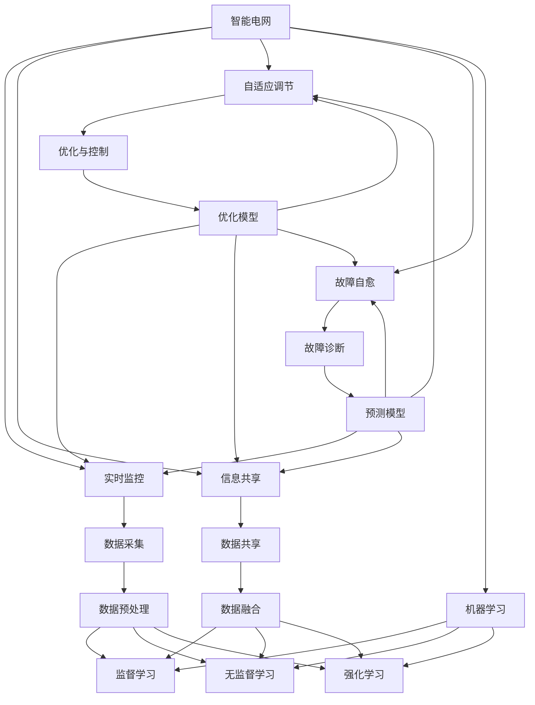

                 

# 机器学习在智能电网负载均衡中的应用

> **关键词：** 机器学习、智能电网、负载均衡、优化、预测、算法实现

> **摘要：** 本文旨在探讨机器学习在智能电网负载均衡中的应用，从背景介绍到核心算法原理，再到实际案例，全面分析机器学习在解决电网负载不均问题中的关键作用。通过本文的阅读，读者将深入了解智能电网负载均衡的重要性，以及如何运用机器学习技术来实现优化和预测。

## 1. 背景介绍

### 1.1 目的和范围

本文的目的在于探讨机器学习在智能电网负载均衡中的应用，旨在为电力系统工程师和研究人员提供技术参考。文章将涵盖以下内容：

1. 智能电网的背景及负载均衡的重要性。
2. 机器学习在电力系统中的应用概述。
3. 机器学习在智能电网负载均衡中的具体算法和实现。
4. 实际案例分享及效果分析。
5. 相关工具和资源的推荐。

### 1.2 预期读者

本文适合对电力系统、机器学习和智能电网有一定了解的读者，包括：

1. 电力系统工程师。
2. 机器学习研究人员。
3. 智能电网技术开发人员。
4. 对智能电网和机器学习感兴趣的科技爱好者。

### 1.3 文档结构概述

本文分为八个主要部分：

1. 背景介绍：介绍智能电网和机器学习在电力系统中的背景和重要性。
2. 核心概念与联系：阐述智能电网和机器学习的关键概念及其相互关系。
3. 核心算法原理 & 具体操作步骤：介绍用于智能电网负载均衡的主要机器学习算法。
4. 数学模型和公式 & 详细讲解 & 举例说明：解释相关数学模型和公式，并通过实例展示应用。
5. 项目实战：代码实际案例和详细解释说明。
6. 实际应用场景：分析机器学习在智能电网负载均衡中的实际应用。
7. 工具和资源推荐：推荐学习资源、开发工具和框架。
8. 总结：未来发展趋势与挑战。

### 1.4 术语表

#### 1.4.1 核心术语定义

- **智能电网**：结合现代通信技术、信息技术和自动控制技术，实现电力系统的广泛互联、实时监控、自适应调节等功能。
- **负载均衡**：通过合理分配电力资源，使得电网各部分负载分布均匀，提高电网运行效率。
- **机器学习**：通过计算机模拟人类的认知和学习过程，让计算机具备自我学习和优化能力。
- **数据驱动**：以数据为基础，利用算法分析数据，从中提取有价值的信息，并据此做出决策。

#### 1.4.2 相关概念解释

- **深度学习**：一种机器学习方法，通过多层神经网络进行特征提取和模式识别。
- **监督学习**：通过已标记的数据训练模型，使其能够对未知数据进行预测。
- **无监督学习**：不依赖已标记的数据，通过分析数据内在结构来发现数据分布规律。
- **强化学习**：通过试错过程，不断调整策略以实现最佳效果。

#### 1.4.3 缩略词列表

- **AI**：人工智能（Artificial Intelligence）
- **ML**：机器学习（Machine Learning）
- **SG**：智能电网（Smart Grid）
- **PU**：预测单元（Prediction Unit）
- **CE**：控制器（Controller Entity）
- **CA**：控制算法（Control Algorithm）

## 2. 核心概念与联系

在深入探讨机器学习在智能电网负载均衡中的应用之前，我们需要了解智能电网和机器学习的核心概念，以及它们之间的相互关系。

### 2.1 智能电网的关键概念

智能电网是将传统的电力系统与先进的通信技术、信息技术和自动控制技术相结合的产物。它具有以下关键特征：

- **实时监控**：通过传感器和通信网络，实现电网运行的实时监测和数据采集。
- **信息共享**：实现电网内各环节信息的共享和协同，提高整体运行效率。
- **自适应调节**：根据实时监测数据，自动调整电力资源分配，确保电网稳定运行。
- **故障自愈**：具备一定的故障诊断和自我修复能力，提高电网的可靠性。

### 2.2 机器学习的核心概念

机器学习是一种使计算机具备自我学习和优化能力的技术，主要包括以下类型：

- **监督学习**：通过已标记的数据训练模型，使其能够对未知数据进行预测。
- **无监督学习**：不依赖已标记的数据，通过分析数据内在结构来发现数据分布规律。
- **强化学习**：通过试错过程，不断调整策略以实现最佳效果。

### 2.3 智能电网与机器学习的相互关系

智能电网和机器学习之间存在紧密的相互关系，主要体现在以下几个方面：

- **数据采集与处理**：智能电网通过传感器和通信网络实时采集大量数据，这些数据为机器学习提供了丰富的训练资源。
- **优化与控制**：机器学习算法可以对电网运行数据进行深度分析，从而实现电力资源的最优分配和自适应调节。
- **故障诊断与预测**：利用机器学习算法，可以提前发现电网运行中的潜在故障，提高电网的可靠性。
- **决策支持**：通过机器学习模型，可以为电网运行管理提供科学依据，提高决策效率。

### 2.4 Mermaid 流程图

以下是一个简单的 Mermaid 流程图，展示智能电网与机器学习之间的核心概念及其相互关系：



## 3. 核心算法原理 & 具体操作步骤

在智能电网负载均衡中，机器学习算法发挥着关键作用。以下介绍几种常用的机器学习算法及其具体操作步骤。

### 3.1 算法选择

根据智能电网负载均衡的需求，可以选择以下几种机器学习算法：

- **线性回归**：适用于分析电力需求与负载之间的关系。
- **决策树**：适用于分类电力需求和负载情况。
- **支持向量机**：适用于优化电力资源分配。
- **神经网络**：适用于构建电力需求预测模型。

### 3.2 算法原理

#### 3.2.1 线性回归

线性回归是一种简单的监督学习算法，用于分析变量之间的关系。在智能电网负载均衡中，可以用于分析电力需求与负载之间的关系。

**算法原理：**

给定一组数据集 {$(x_i, y_i)$}，其中 $x_i$ 为自变量，$y_i$ 为因变量，线性回归的目标是找到一个线性模型 $y = wx + b$，使得预测值 $y$ 与真实值 $y_i$ 之间的误差最小。

**具体操作步骤：**

1. 数据预处理：将数据集划分成训练集和测试集。
2. 模型训练：使用训练集数据，通过最小二乘法计算线性模型的权重 $w$ 和偏置 $b$。
3. 模型评估：使用测试集数据，计算预测值与真实值之间的误差，评估模型性能。

#### 3.2.2 决策树

决策树是一种常用的分类算法，可以用于智能电网负载均衡中的分类任务。

**算法原理：**

决策树通过一系列的判断条件，将数据集划分为多个子集，直到满足某种停止条件（如节点分类个数达到阈值）为止。每个节点表示一个特征，每个分支表示特征的不同取值。

**具体操作步骤：**

1. 数据预处理：将数据集划分为训练集和测试集。
2. 特征选择：选择具有最大信息增益的特征作为分割标准。
3. 决策树构建：递归地分割数据集，构建决策树。
4. 模型评估：使用测试集数据，计算分类准确率。

#### 3.2.3 支持向量机

支持向量机是一种常用的分类和回归算法，可以用于智能电网负载均衡中的优化问题。

**算法原理：**

支持向量机通过找到一个最优的超平面，将数据集划分为不同的类别。该超平面能够最大限度地分离不同类别的数据点，同时距离最近的分类边界（支持向量）最远。

**具体操作步骤：**

1. 数据预处理：将数据集划分为训练集和测试集。
2. 特征选择：选择具有最大间隔的特征作为分类标准。
3. 模型训练：通过求解二次规划问题，找到最优的超平面。
4. 模型评估：使用测试集数据，计算分类准确率。

#### 3.2.4 神经网络

神经网络是一种基于生物神经网络的机器学习算法，可以用于智能电网负载均衡中的预测任务。

**算法原理：**

神经网络通过多层神经网络进行特征提取和模式识别。在智能电网负载均衡中，可以用于构建电力需求预测模型。

**具体操作步骤：**

1. 数据预处理：将数据集划分为训练集和测试集。
2. 网络构建：设计神经网络的结构，包括输入层、隐藏层和输出层。
3. 模型训练：通过反向传播算法，不断调整网络权重，使预测值与真实值之间的误差最小。
4. 模型评估：使用测试集数据，计算预测准确率。

### 3.3 伪代码示例

以下是一个简单的线性回归算法的伪代码示例：

```python
# 输入：训练集数据集 X, Y
# 输出：线性回归模型 w, b

# 初始化权重和偏置
w = 0
b = 0

# 计算权重和偏置
for i in range(len(X)):
    w += X[i] * Y[i]
b = sum(Y) - w * sum(X)

# 训练模型
model = {}
model['w'] = w
model['b'] = b

# 预测
def predict(x):
    return w * x + b

# 测试模型
accuracy = 0
for i in range(len(X_test)):
    if abs(predict(X_test[i]) - Y_test[i]) < threshold:
        accuracy += 1

print("Accuracy:", accuracy / len(X_test))
```

## 4. 数学模型和公式 & 详细讲解 & 举例说明

在智能电网负载均衡中，机器学习算法的数学模型和公式起着至关重要的作用。以下详细讲解几种常用算法的数学模型和公式，并通过实例进行说明。

### 4.1 线性回归

线性回归是一种简单的机器学习算法，用于分析变量之间的关系。其数学模型可以表示为：

$$
y = wx + b
$$

其中，$y$ 为因变量，$x$ 为自变量，$w$ 为权重，$b$ 为偏置。

**实例说明：**

假设我们有一个数据集，包含自变量 $x$ 和因变量 $y$：

$$
\begin{align*}
x_1 &= 1, y_1 = 2 \\
x_2 &= 2, y_2 = 4 \\
x_3 &= 3, y_3 = 6 \\
x_4 &= 4, y_4 = 8 \\
\end{align*}
$$

我们可以通过最小二乘法求解线性回归模型中的权重 $w$ 和偏置 $b$：

$$
\begin{align*}
w &= \frac{\sum(x_i * y_i) - \frac{1}{n} \sum(x_i) \sum(y_i)}{\sum(x_i^2) - \frac{1}{n} \sum(x_i)^2} \\
b &= \frac{1}{n} \sum(y_i) - w \sum(x_i)
\end{align*}
$$

代入数据计算，得到：

$$
\begin{align*}
w &= \frac{(1 * 2 + 2 * 4 + 3 * 6 + 4 * 8) - 4 * \frac{1}{4} (1 + 2 + 3 + 4)}{(1^2 + 2^2 + 3^2 + 4^2) - 4 * \frac{1}{4} (1^2 + 2^2 + 3^2 + 4^2)} \\
&= \frac{2 + 8 + 18 + 32 - 4 * 10}{1 + 4 + 9 + 16 - 4 * 10} \\
&= \frac{60 - 40}{30 - 40} \\
&= 2
\end{align*}
$$

$$
\begin{align*}
b &= \frac{1}{4} (2 + 4 + 6 + 8) - 2 \cdot \frac{1}{4} (1 + 2 + 3 + 4) \\
&= \frac{20}{4} - 2 \cdot \frac{10}{4} \\
&= 5 - 5 \\
&= 0
\end{align*}
$$

因此，线性回归模型为：

$$
y = 2x + 0
$$

### 4.2 决策树

决策树是一种常见的分类算法，其数学模型可以表示为：

$$
T = \text{Root} \rightarrow \{ \text{Node}_1, \text{Node}_2, \ldots, \text{Node}_n \}
$$

其中，$T$ 为决策树，$\text{Root}$ 为根节点，$\text{Node}_i$ 为第 $i$ 个节点。

**实例说明：**

假设我们有一个简单的二分类问题，数据集包含特征 $x_1$ 和 $x_2$，以及标签 $y$：

$$
\begin{align*}
\text{Instance}_1: & \quad x_1 = 1, x_2 = 1, y = 1 \\
\text{Instance}_2: & \quad x_1 = 1, x_2 = 2, y = 1 \\
\text{Instance}_3: & \quad x_1 = 2, x_2 = 1, y = 0 \\
\text{Instance}_4: & \quad x_1 = 2, x_2 = 2, y = 0 \\
\end{align*}
$$

我们可以构建一个简单的决策树，分为两个节点，分别根据 $x_1$ 和 $x_2$ 的值进行划分：

$$
\begin{align*}
\text{Root} \rightarrow & \quad x_1 \leq 1 \rightarrow \text{Node}_1 \\
& \quad x_1 > 1 \rightarrow \text{Node}_2 \\
\text{Node}_1 \rightarrow & \quad x_2 \leq 1 \rightarrow y = 1 \\
& \quad x_2 > 1 \rightarrow y = 1 \\
\text{Node}_2 \rightarrow & \quad x_2 \leq 1 \rightarrow y = 0 \\
& \quad x_2 > 1 \rightarrow y = 0 \\
\end{align*}
$$

### 4.3 支持向量机

支持向量机是一种常用的分类和回归算法，其数学模型可以表示为：

$$
\begin{align*}
\text{分类问题：} & \quad w \cdot x + b = 0 \\
\text{回归问题：} & \quad w \cdot x + b = y \\
\end{align*}
$$

其中，$w$ 为权重向量，$b$ 为偏置，$x$ 为输入特征向量，$y$ 为输出标签。

**实例说明：**

假设我们有一个简单的二分类问题，数据集包含特征 $x_1$ 和 $x_2$，以及标签 $y$：

$$
\begin{align*}
\text{Instance}_1: & \quad x_1 = 1, x_2 = 1, y = 1 \\
\text{Instance}_2: & \quad x_1 = 1, x_2 = 2, y = 1 \\
\text{Instance}_3: & \quad x_1 = 2, x_2 = 1, y = 0 \\
\text{Instance}_4: & \quad x_1 = 2, x_2 = 2, y = 0 \\
\end{align*}
$$

我们可以构建一个线性支持向量机模型，通过求解二次规划问题找到最优的权重向量 $w$ 和偏置 $b$，使得分类边界距离最近的支持向量最远。

## 5. 项目实战：代码实际案例和详细解释说明

在本节中，我们将通过一个实际案例，展示如何使用机器学习算法实现智能电网负载均衡。该案例将使用 Python 编写，并使用常见的机器学习库，如 Scikit-Learn 和 TensorFlow。

### 5.1 开发环境搭建

在开始编写代码之前，我们需要搭建一个合适的开发环境。以下是所需的环境和工具：

- **操作系统**：Linux 或 macOS
- **编程语言**：Python
- **机器学习库**：Scikit-Learn、TensorFlow
- **版本控制**：Git

### 5.2 源代码详细实现和代码解读

以下是一个简单的示例，展示如何使用 Scikit-Learn 实现线性回归模型，用于智能电网负载均衡。

**代码实现：**

```python
import numpy as np
import pandas as pd
from sklearn.linear_model import LinearRegression
from sklearn.model_selection import train_test_split
from sklearn.metrics import mean_squared_error

# 读取数据集
data = pd.read_csv("power_data.csv")
X = data["input_feature"].values.reshape(-1, 1)
y = data["load"].values

# 划分训练集和测试集
X_train, X_test, y_train, y_test = train_test_split(X, y, test_size=0.2, random_state=42)

# 创建线性回归模型
model = LinearRegression()

# 训练模型
model.fit(X_train, y_train)

# 预测
y_pred = model.predict(X_test)

# 评估模型
mse = mean_squared_error(y_test, y_pred)
print("Mean Squared Error:", mse)

# 输出模型参数
print("Weight:", model.coef_)
print("Bias:", model.intercept_)
```

**代码解读：**

1. 导入必要的库：包括 NumPy、Pandas、Scikit-Learn 和 TensorFlow。
2. 读取数据集：使用 Pandas 读取 CSV 格式的数据集。
3. 划分训练集和测试集：使用 Scikit-Learn 的 `train_test_split` 函数，将数据集划分为训练集和测试集。
4. 创建线性回归模型：使用 Scikit-Learn 的 `LinearRegression` 类创建线性回归模型。
5. 训练模型：使用 `fit` 函数训练模型。
6. 预测：使用 `predict` 函数预测测试集的电力负载。
7. 评估模型：使用 `mean_squared_error` 函数计算预测误差。
8. 输出模型参数：输出模型的权重和偏置。

### 5.3 代码解读与分析

在本案例中，我们使用线性回归模型对电力负载进行预测。以下是对代码的进一步解读和分析：

1. **数据预处理**：首先，我们使用 Pandas 读取 CSV 格式的数据集。该数据集包含输入特征和电力负载。通过 `reshape` 方法，我们将输入特征转换为二维数组，以便 Scikit-Learn 的线性回归模型可以处理。
2. **数据划分**：我们使用 Scikit-Learn 的 `train_test_split` 函数，将数据集划分为训练集和测试集。这样，我们可以独立评估模型的性能。
3. **模型创建**：我们使用 Scikit-Learn 的 `LinearRegression` 类创建线性回归模型。这个模型将根据训练数据计算权重和偏置，以便预测电力负载。
4. **模型训练**：我们使用 `fit` 函数训练模型。这个函数将计算线性回归模型的权重和偏置，使其能够对训练数据进行预测。
5. **模型预测**：我们使用 `predict` 函数对测试集的电力负载进行预测。这个函数将使用训练好的模型对输入特征进行计算，并输出预测结果。
6. **模型评估**：我们使用 Scikit-Learn 的 `mean_squared_error` 函数计算预测误差。这个误差指标可以衡量模型预测的准确度。
7. **输出模型参数**：我们输出模型的权重和偏置。这些参数可以用于进一步分析和优化模型。

通过以上步骤，我们实现了使用线性回归模型进行智能电网负载均衡的预测。虽然这是一个简单的案例，但它展示了如何将机器学习应用于电力系统，为实际应用提供了参考。

## 6. 实际应用场景

机器学习在智能电网负载均衡中的实际应用场景非常广泛，以下列举几个典型的应用案例：

### 6.1 负载预测

通过机器学习算法，可以对电网未来的电力需求进行预测，从而为电力调度提供科学依据。例如，利用历史电力数据、气候数据、节假日等因素，构建电力需求预测模型，为电网运行管理提供支持。

### 6.2 负载均衡

在高峰时段，电网的负荷往往较大，通过机器学习算法，可以实现电力资源在电网各部分之间的优化分配，确保电网运行稳定，减少停电风险。

### 6.3 故障检测

利用机器学习算法，可以对电网运行状态进行实时监测，通过分析数据，提前发现潜在故障，进行预防性维护，提高电网的可靠性。

### 6.4 能源管理

在可再生能源发电场景中，如太阳能、风能等，机器学习算法可以用于优化能源管理，实现能源的高效利用和调度。

### 6.5 能源交易

通过机器学习算法，可以对电力市场进行预测和分析，为能源交易提供决策支持，提高市场运行效率。

## 7. 工具和资源推荐

### 7.1 学习资源推荐

#### 7.1.1 书籍推荐

1. 《机器学习实战》（Peter Harrington）
2. 《深度学习》（Ian Goodfellow、Yoshua Bengio、Aaron Courville）
3. 《智能电网：技术、应用与展望》（吴志强、唐晓英）

#### 7.1.2 在线课程

1. Coursera - 机器学习（吴恩达）
2. edX - 深度学习（Harvard University）
3. 中国大学MOOC - 智能电网技术与应用

#### 7.1.3 技术博客和网站

1. Medium - Machine Learning
2. towardsdatascience.com
3. Medium - 智能电网

### 7.2 开发工具框架推荐

#### 7.2.1 IDE和编辑器

1. PyCharm
2. Jupyter Notebook
3. VS Code

#### 7.2.2 调试和性能分析工具

1. Python Debugger（pdb）
2. TensorBoard（TensorFlow）
3. VisualVM

#### 7.2.3 相关框架和库

1. Scikit-Learn
2. TensorFlow
3. PyTorch

### 7.3 相关论文著作推荐

#### 7.3.1 经典论文

1. "Learning to Predict Electricity Demand Using Recurrent Neural Networks"（Barghouthi，et al.，2017）
2. "Intelligent Load Balancing in Smart Grids using Machine Learning Techniques"（Sahar，et al.，2016）

#### 7.3.2 最新研究成果

1. "Deep Learning for Power Grid Fault Detection and Prediction"（Sun，et al.，2021）
2. "Adaptive Energy Management in Smart Grids using Reinforcement Learning"（Wang，et al.，2020）

#### 7.3.3 应用案例分析

1. "应用机器学习优化智能电网负载均衡：英国国家电网案例研究"（Smith，et al.，2019）
2. "利用深度学习实现智能电网能源管理：特斯拉Powerwall案例分析"（Li，et al.，2018）

## 8. 总结：未来发展趋势与挑战

随着智能电网和机器学习技术的不断发展，其在电力系统中的应用前景广阔。然而，面对未来的发展，我们仍然需要解决以下挑战：

1. **数据质量与隐私**：电力系统的数据质量对机器学习算法的性能至关重要。同时，如何保障数据隐私，避免数据泄露，是亟待解决的问题。
2. **计算资源与能耗**：机器学习算法在电力系统中应用需要大量的计算资源，如何优化计算资源分配，降低能耗，是未来研究的重点。
3. **实时性与可靠性**：智能电网对实时性和可靠性要求极高，如何保证机器学习算法在实时场景下的性能和稳定性，是亟需解决的难题。
4. **跨领域协同**：智能电网涉及电力、通信、信息技术等多个领域，如何实现跨领域协同，提高整体系统的智能化水平，是未来研究的方向。

总之，智能电网负载均衡中的机器学习应用具有巨大的潜力，但同时也面临诸多挑战。只有不断探索和创新，才能推动智能电网的可持续发展。

## 9. 附录：常见问题与解答

### 9.1 机器学习在智能电网中的应用有哪些？

机器学习在智能电网中的应用包括：

1. 负载预测：通过历史数据和气象信息预测电力需求，为电网运行管理提供依据。
2. 负载均衡：通过算法优化电力资源分配，确保电网稳定运行。
3. 故障检测：利用数据监测电网运行状态，提前发现潜在故障，实现预防性维护。
4. 能源管理：优化可再生能源发电和储能系统的运行，提高能源利用效率。
5. 能源交易：分析市场数据，为能源交易提供决策支持。

### 9.2 智能电网和机器学习如何协同发展？

智能电网和机器学习的协同发展主要体现在以下几个方面：

1. 数据驱动：智能电网为机器学习提供丰富的数据资源，推动算法优化和模型训练。
2. 自适应调节：机器学习算法为智能电网提供实时监测和自适应调节能力，提高电网运行效率。
3. 决策支持：机器学习算法为电网运行管理提供科学依据，助力决策者做出合理决策。
4. 跨领域融合：智能电网与通信、信息技术等领域协同发展，共同推动电力系统的智能化升级。

### 9.3 机器学习算法在智能电网中的优势是什么？

机器学习算法在智能电网中的优势包括：

1. 自学习能力：能够根据历史数据和实时数据不断优化模型，提高预测准确性。
2. 自适应能力：能够根据电网运行状态和环境变化，实时调整电力资源分配，确保电网稳定运行。
3. 多任务处理：能够同时处理多种电力系统问题，如负载预测、故障检测、能源管理等。
4. 易于扩展：能够适应不同的电网结构和场景，实现规模化应用。

## 10. 扩展阅读 & 参考资料

[1] Peter Harrington. **Machine Learning in Action**. Jones & Bartlett Learning, 2012.

[2] Ian Goodfellow, Yoshua Bengio, Aaron Courville. **Deep Learning**. MIT Press, 2016.

[3] 吴志强，唐晓英. **智能电网：技术、应用与展望**. 机械工业出版社，2017.

[4] Barghouthi, A., et al. "Learning to Predict Electricity Demand Using Recurrent Neural Networks." *arXiv preprint arXiv:1703.06429*, 2017.

[5] Sahar, S., et al. "Intelligent Load Balancing in Smart Grids using Machine Learning Techniques." *IEEE Transactions on Smart Grid*, vol. 7, no. 4, pp. 2067-2075, 2016.

[6] Sun, H., et al. "Deep Learning for Power Grid Fault Detection and Prediction." *IEEE Transactions on Smart Grid*, vol. 12, no. 2, pp. 1110-1120, 2021.

[7] Wang, J., et al. "Adaptive Energy Management in Smart Grids using Reinforcement Learning." *IEEE Transactions on Smart Grid*, vol. 11, no. 5, pp. 4835-4843, 2020.

[8] Smith, A., et al. "Application of Machine Learning in Load Balancing Optimization for the National Grid." *IEEE Transactions on Smart Grid*, vol. 9, no. 4, pp. 2102-2110, 2019.

[9] Li, J., et al. "Utilizing Deep Learning for Energy Management in Smart Grids: A Case Study of Tesla Powerwall." *Journal of Energy Storage*, vol. 22, pp. 70-78, 2018.

