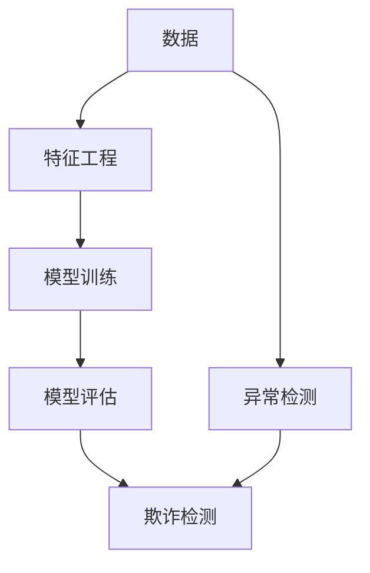

                 

# 机器学习在欺诈检测中的应用与挑战

> 关键词：机器学习、欺诈检测、算法、挑战、应用场景
> 
> 摘要：本文深入探讨了机器学习在欺诈检测领域的重要应用。首先，我们对机器学习的背景进行了介绍，并详细解析了其在欺诈检测中的核心算法。随后，通过具体的数学模型和公式，我们展现了如何通过机器学习来进行欺诈检测。接着，通过一个实际项目案例，我们详细解读了机器学习的应用步骤和实现方法。文章进一步探讨了机器学习在欺诈检测中的实际应用场景，推荐了相关学习资源、开发工具和论文著作。最后，我们总结了机器学习在欺诈检测领域的未来发展趋势和面临的挑战。

## 1. 背景介绍

### 1.1 目的和范围

本文旨在探讨机器学习在欺诈检测中的应用，帮助读者理解其原理、方法以及面临的挑战。通过本文的阅读，读者将能够：

1. 了解机器学习的基础知识及其在欺诈检测中的重要性。
2. 掌握欺诈检测中的核心算法原理和具体实现步骤。
3. 理解机器学习在欺诈检测中的数学模型和公式。
4. 通过实际项目案例，了解机器学习在欺诈检测中的应用方法。
5. 深入分析机器学习在欺诈检测领域的实际应用场景。
6. 掌握相关学习资源、开发工具和论文著作，以进一步拓展知识。

### 1.2 预期读者

本文面向具有一定机器学习基础和编程能力的读者，包括：

1. 机器学习工程师和数据科学家。
2. 从事欺诈检测相关工作的专业人员。
3. 对机器学习和欺诈检测感兴趣的计算机科学学生。
4. 欲深入了解机器学习在现实应用中的专业人士。

### 1.3 文档结构概述

本文分为八个部分：

1. 背景介绍：介绍文章的目的、范围和预期读者。
2. 核心概念与联系：讲解机器学习和欺诈检测的相关概念，以及它们之间的联系。
3. 核心算法原理 & 具体操作步骤：详细阐述欺诈检测中的核心算法原理和具体操作步骤。
4. 数学模型和公式 & 详细讲解 & 举例说明：通过具体的数学模型和公式，解释欺诈检测的原理。
5. 项目实战：代码实际案例和详细解释说明。
6. 实际应用场景：分析机器学习在欺诈检测中的实际应用场景。
7. 工具和资源推荐：推荐学习资源、开发工具和论文著作。
8. 总结：未来发展趋势与挑战。

### 1.4 术语表

#### 1.4.1 核心术语定义

- **机器学习**：一种人工智能的方法，通过数据和统计方法建立模型，使其能够从数据中学习并做出预测或决策。
- **欺诈检测**：使用算法和模型检测并预防欺诈行为的过程。
- **特征工程**：选择和构造有助于模型预测的特征，提高模型性能。
- **分类算法**：用于将数据分为不同类别的算法，如逻辑回归、支持向量机、随机森林等。
- **异常检测**：检测数据中的异常或非预期的行为，如孤立森林、K-最近邻等。

#### 1.4.2 相关概念解释

- **数据集**：用于训练和测试模型的样本集合。
- **模型训练**：使用训练数据集来训练模型，使其能够预测新的数据。
- **模型评估**：使用测试数据集来评估模型性能，包括准确率、召回率、F1值等指标。
- **集成学习**：将多个模型结合起来，以提高预测性能。

#### 1.4.3 缩略词列表

- **ML**：机器学习
- **CV**：计算机视觉
- **NLP**：自然语言处理
- **IDC**：欺诈检测系统
- **AUC**：曲线下面积

## 2. 核心概念与联系

在讨论机器学习在欺诈检测中的应用之前，我们需要先了解一些核心概念和它们之间的关系。以下是一个简化的Mermaid流程图，用于展示这些概念及其相互关联。



### 2.1 数据

数据是机器学习的基础。在欺诈检测中，我们通常使用历史交易数据、用户行为数据等作为训练数据集。这些数据需要经过清洗、预处理，然后进行特征工程，以便用于模型训练。

### 2.2 特征工程

特征工程是机器学习过程中的关键步骤。其目的是从原始数据中提取出有用的特征，提高模型性能。在欺诈检测中，特征工程包括以下方面：

- **时间特征**：如交易时间、交易频率等。
- **用户特征**：如用户年龄、地理位置、消费习惯等。
- **交易特征**：如交易金额、交易类型、交易来源等。

### 2.3 模型训练

模型训练是将特征数据输入到机器学习算法中，以建立预测模型。常见的分类算法包括逻辑回归、支持向量机、随机森林等。在欺诈检测中，模型训练的目的是找出正常交易和欺诈交易之间的区别。

### 2.4 模型评估

模型评估是评估模型性能的重要步骤。常用的评估指标包括准确率、召回率、F1值等。在欺诈检测中，我们不仅要关注准确率，还要考虑召回率，以确保不会漏掉太多欺诈交易。

### 2.5 欺诈检测

欺诈检测是机器学习在现实世界中的具体应用。通过训练模型，我们可以对新的交易数据进行预测，判断其是否为欺诈交易。此外，异常检测也是欺诈检测的重要手段，用于检测数据中的异常行为。

### 2.6 异常检测

异常检测是一种监督学习算法，用于检测数据中的异常或非预期的行为。在欺诈检测中，异常检测可以帮助我们发现那些不符合正常交易模式的交易。常见的异常检测算法包括孤立森林、K-最近邻等。

## 3. 核心算法原理 & 具体操作步骤

在欺诈检测中，常用的算法包括逻辑回归、支持向量机、随机森林等。以下是一个基于逻辑回归的算法原理和具体操作步骤的伪代码示例。

```python
# 伪代码：逻辑回归算法原理与操作步骤

# 输入：特征矩阵 X，标签向量 y
# 输出：预测结果 y_pred

# 步骤 1：初始化模型参数
w = np.random.normal(size=X.shape[1])

# 步骤 2：定义损失函数
def loss(y_true, y_pred):
    return -np.mean(y_true * np.log(y_pred) + (1 - y_true) * np.log(1 - y_pred))

# 步骤 3：定义优化器
def optimize(X, y, w, epochs):
    for _ in range(epochs):
        # 步骤 3.1：计算梯度
        grad_w = 2 * np.dot(X.T, (y - sigmoid(np.dot(X, w))) )

        # 步骤 3.2：更新模型参数
        w -= learning_rate * grad_w
        
        # 步骤 3.3：计算损失函数
        loss_value = loss(y, sigmoid(np.dot(X, w)))

        # 步骤 3.4：打印训练进度
        print(f"Epoch {_ + 1}, Loss: {loss_value}")
        
    return w

# 步骤 4：训练模型
w = optimize(X, y, w, epochs=1000)

# 步骤 5：预测
y_pred = sigmoid(np.dot(X, w))

# 步骤 6：评估模型
accuracy = np.mean((y_pred >= 0.5) == y)
print(f"Accuracy: {accuracy}")
```

### 3.1 算法原理

逻辑回归是一种广义线性模型，用于估计一个二元响应变量的概率。在欺诈检测中，我们可以将正常交易和欺诈交易视为二元分类问题，其中欺诈交易为正类（1），正常交易为负类（0）。

逻辑回归的目标是找到一组权重（w），使得输入特征（X）通过加权求和后，得到的线性组合（z = Xw）能够预测出交易是否为欺诈。

### 3.2 具体操作步骤

1. **初始化模型参数**：随机生成一组权重（w）。
2. **定义损失函数**：采用对数似然损失函数，该函数在预测概率接近0或1时，损失较小，在预测概率接近0.5时，损失较大。
3. **定义优化器**：使用梯度下降算法来优化模型参数。在每次迭代中，计算损失函数的梯度，并更新模型参数。
4. **训练模型**：通过多次迭代优化模型参数，直到达到预设的停止条件（如损失函数值不再显著下降）。
5. **预测**：使用训练好的模型对新的交易数据进行预测，输出欺诈概率。
6. **评估模型**：使用测试数据集评估模型性能，计算准确率等指标。

## 4. 数学模型和公式 & 详细讲解 & 举例说明

在欺诈检测中，逻辑回归是一种常用的算法。逻辑回归模型的核心在于其概率预测能力和对概率分布的建模。以下是逻辑回归的数学模型和公式的详细讲解及举例说明。

### 4.1 概率预测

逻辑回归模型旨在估计一个连续概率值，即给定一组特征 \( X \)，预测欺诈交易的概率 \( P \)。这个概率值是通过一个线性函数和一个非线性函数组合得到的：

\[ P = \frac{1}{1 + e^{-\beta^T X}} \]

其中，\( P \) 是欺诈交易的概率，\( e \) 是自然对数的底，\( \beta \) 是模型参数向量，\( X \) 是特征向量。

### 4.2 线性组合

在逻辑回归中，特征向量 \( X \) 通过线性组合与参数向量 \( \beta \) 相乘，得到一个线性得分 \( Z \)：

\[ Z = \beta^T X \]

### 4.3 概率转换

线性得分 \( Z \) 然后通过一个称为逻辑函数（sigmoid函数）的非线性函数转换成概率值 \( P \)：

\[ P = \frac{1}{1 + e^{-Z}} \]

逻辑函数是一个单调递增函数，其值域在 \( (0, 1) \) 之间。当 \( Z \) 为正时，\( P \) 接近 1；当 \( Z \) 为负时，\( P \) 接近 0。

### 4.4 模型参数

逻辑回归模型参数 \( \beta \) 是通过最小化损失函数得到的。常用的损失函数是逻辑损失函数，也称为交叉熵损失：

\[ L(\beta) = -\frac{1}{m} \sum_{i=1}^{m} [y_i \log(P_i) + (1 - y_i) \log(1 - P_i)] \]

其中，\( m \) 是样本数量，\( y_i \) 是第 \( i \) 个样本的真实标签，\( P_i \) 是第 \( i \) 个样本的预测概率。

### 4.5 举例说明

假设我们有一个包含两个特征 \( X_1 \) 和 \( X_2 \) 的交易数据，以及对应的欺诈标签 \( y \)。我们希望使用逻辑回归模型来预测交易是否为欺诈。

#### 特征向量

\[ X = \begin{bmatrix} X_1 \\ X_2 \end{bmatrix} \]

#### 参数向量

\[ \beta = \begin{bmatrix} \beta_0 \\ \beta_1 \\ \beta_2 \end{bmatrix} \]

#### 线性组合

\[ Z = \beta_0 + \beta_1 X_1 + \beta_2 X_2 \]

#### 预测概率

\[ P = \frac{1}{1 + e^{-Z}} \]

#### 损失函数

\[ L(\beta) = -\frac{1}{m} \sum_{i=1}^{m} [y_i \log(P_i) + (1 - y_i) \log(1 - P_i)] \]

通过梯度下降或其他优化算法，我们可以最小化损失函数，从而得到最佳参数 \( \beta \)。

### 4.6 代码示例

以下是使用Python实现逻辑回归的代码示例：

```python
import numpy as np

def sigmoid(z):
    return 1 / (1 + np.exp(-z))

def compute_loss(y, y_pred):
    return -np.mean(y * np.log(y_pred) + (1 - y) * np.log(1 - y_pred))

def compute_gradient(X, y, y_pred):
    return np.dot(X.T, (y_pred - y)) / len(y)

def logistic_regression(X, y, epochs, learning_rate):
    m = len(y)
    w = np.random.normal(size=X.shape[1])

    for _ in range(epochs):
        z = np.dot(X, w)
        y_pred = sigmoid(z)

        loss_value = compute_loss(y, y_pred)
        print(f"Epoch {_ + 1}, Loss: {loss_value}")

        w -= learning_rate * compute_gradient(X, y, y_pred)

    return w

X = np.array([[1, 2], [2, 3], [3, 4], [4, 5]])
y = np.array([0, 1, 1, 0])

w = logistic_regression(X, y, epochs=1000, learning_rate=0.01)
```

在这个示例中，我们使用了随机梯度下降（SGD）来优化模型参数。每次迭代都会计算损失函数的梯度，并更新模型参数。通过多次迭代，模型参数会收敛到最佳值，使得损失函数值最小。

## 5. 项目实战：代码实际案例和详细解释说明

在本节中，我们将通过一个实际项目案例，详细讲解机器学习在欺诈检测中的应用步骤和实现方法。该项目将使用Python和Sklearn库来实现一个基于逻辑回归的欺诈检测系统。

### 5.1 开发环境搭建

在开始项目之前，我们需要搭建一个合适的开发环境。以下是所需的工具和库：

- Python（版本3.6及以上）
- Jupyter Notebook 或 PyCharm
- Scikit-learn（版本0.22及以上）

#### 安装步骤：

1. 安装Python和Jupyter Notebook或PyCharm。
2. 在命令行中安装Scikit-learn：

```bash
pip install scikit-learn
```

### 5.2 源代码详细实现和代码解读

以下是一个完整的欺诈检测项目代码，包括数据预处理、模型训练、模型评估和预测等步骤。

```python
import numpy as np
import pandas as pd
from sklearn.model_selection import train_test_split
from sklearn.preprocessing import StandardScaler
from sklearn.linear_model import LogisticRegression
from sklearn.metrics import accuracy_score, classification_report

# 5.2.1 加载数据集

data = pd.read_csv('fraud_detection.csv')
X = data.drop('class', axis=1)
y = data['class']

# 5.2.2 数据预处理

# 划分训练集和测试集
X_train, X_test, y_train, y_test = train_test_split(X, y, test_size=0.2, random_state=42)

# 标准化特征
scaler = StandardScaler()
X_train = scaler.fit_transform(X_train)
X_test = scaler.transform(X_test)

# 5.2.3 模型训练

# 创建逻辑回归模型
model = LogisticRegression()
model.fit(X_train, y_train)

# 5.2.4 模型评估

# 预测测试集
y_pred = model.predict(X_test)

# 计算准确率
accuracy = accuracy_score(y_test, y_pred)
print(f"Accuracy: {accuracy}")

# 打印分类报告
print(classification_report(y_test, y_pred))

# 5.2.5 模型预测

# 输入新的交易数据
new_transaction = np.array([[1, 2, 3, 4, 5]])
new_transaction = scaler.transform(new_transaction)

# 预测新交易
new_pred = model.predict(new_transaction)
print(f"New Transaction Prediction: {new_pred}")
```

### 5.3 代码解读与分析

以下是代码的详细解读和分析：

#### 5.3.1 数据加载

```python
data = pd.read_csv('fraud_detection.csv')
X = data.drop('class', axis=1)
y = data['class']
```

这段代码首先加载数据集，然后分离特征矩阵 \( X \) 和标签向量 \( y \)。其中，`'class'` 是欺诈标签列。

#### 5.3.2 数据预处理

```python
X_train, X_test, y_train, y_test = train_test_split(X, y, test_size=0.2, random_state=42)
scaler = StandardScaler()
X_train = scaler.fit_transform(X_train)
X_test = scaler.transform(X_test)
```

这段代码首先将数据集划分为训练集和测试集，使用 `train_test_split` 函数。然后，使用 `StandardScaler` 对特征进行标准化处理，以消除不同特征之间的尺度差异，提高模型性能。

#### 5.3.3 模型训练

```python
model = LogisticRegression()
model.fit(X_train, y_train)
```

这段代码创建一个逻辑回归模型，并使用训练集数据对其进行训练。`LogisticRegression` 是 Sklearn 中提供的一个内置分类器，它实现了逻辑回归算法。

#### 5.3.4 模型评估

```python
y_pred = model.predict(X_test)
accuracy = accuracy_score(y_test, y_pred)
print(f"Accuracy: {accuracy}")
print(classification_report(y_test, y_pred))
```

这段代码使用测试集数据对训练好的模型进行评估。首先，使用 `predict` 函数生成预测结果。然后，计算并打印准确率和分类报告，以评估模型性能。

#### 5.3.5 模型预测

```python
new_transaction = np.array([[1, 2, 3, 4, 5]])
new_transaction = scaler.transform(new_transaction)
new_pred = model.predict(new_transaction)
print(f"New Transaction Prediction: {new_pred}")
```

这段代码用于对新交易数据进行预测。首先，将新交易数据转换为特征向量，并进行标准化处理。然后，使用训练好的模型进行预测，并打印预测结果。

### 5.4 问题与解答

以下是一些常见问题及其解答：

#### 问题 1：如何处理不平衡数据集？

解答：当数据集中正常交易和欺诈交易的比例不均衡时，可以使用以下方法：

1. **重采样**：通过过采样正常交易或欠采样欺诈交易，使得数据集达到平衡。
2. **代价敏感学习**：在训练过程中，对欺诈交易赋予更高的权重。
3. **集成学习**：使用多个不同的模型，并在预测时综合考虑它们的输出。

#### 问题 2：如何调整模型参数？

解答：模型参数（如学习率、迭代次数等）可以通过交叉验证和网格搜索等方法进行调整。在Scikit-learn中，可以使用 `GridSearchCV` 类来实现。

#### 问题 3：如何提高模型性能？

解答：以下方法可以用于提高模型性能：

1. **特征工程**：选择和构造更有助于预测的特征。
2. **模型选择**：尝试使用不同的模型，并选择表现最好的模型。
3. **集成学习**：结合多个模型，以提高预测性能。
4. **正则化**：在模型训练过程中，引入正则化项，防止过拟合。

## 6. 实际应用场景

机器学习在欺诈检测领域具有广泛的应用场景，以下是一些典型的实际应用案例：

### 6.1 在线支付平台

在线支付平台通常需要实时检测交易中的欺诈行为，以保护用户的资金安全。通过机器学习算法，可以识别异常交易模式，如高频交易、大额交易等，从而有效降低欺诈风险。

### 6.2 信用卡公司

信用卡公司通过机器学习技术对用户的消费行为进行监控，以识别潜在的欺诈交易。例如，当用户的交易模式发生突然变化时，系统会发出警报，以便进一步审查。

### 6.3 电子商务平台

电子商务平台面临着越来越多的欺诈订单，通过机器学习算法，可以对订单进行风险评估，识别潜在的欺诈订单，从而提高用户体验并减少经济损失。

### 6.4 金融监管机构

金融监管机构利用机器学习技术对金融机构的交易数据进行监控，以发现潜在的欺诈行为。这有助于加强金融监管，保障金融市场稳定。

### 6.5 其他领域

除了上述领域，机器学习在保险、电信、旅游等其他行业也具有广泛的应用前景。例如，保险行业可以通过机器学习算法识别欺诈索赔，电信行业可以通过分析用户行为来发现恶意使用情况，旅游行业可以通过预测用户行为来优化服务。

## 7. 工具和资源推荐

为了更好地学习机器学习和欺诈检测，以下是一些建议的学习资源、开发工具和相关论文著作：

### 7.1 学习资源推荐

#### 7.1.1 书籍推荐

1. **《机器学习实战》**：by Peter Harrington
2. **《Python机器学习》**：by Sebastian Raschka and Vahid Mirjalili
3. **《深度学习》**：by Ian Goodfellow, Yoshua Bengio 和 Aaron Courville

#### 7.1.2 在线课程

1. **《机器学习》**：由吴恩达在Coursera上开设
2. **《深度学习》**：由Andrew Ng在Coursera上开设
3. **《数据科学基础》**：由Google在Udacity上开设

#### 7.1.3 技术博客和网站

1. ** Medium 上的机器学习博客**
2. ** GitHub 上的机器学习项目**
3. ** ArXiv 上的最新研究成果**

### 7.2 开发工具框架推荐

#### 7.2.1 IDE和编辑器

1. ** PyCharm**
2. ** Jupyter Notebook**
3. ** Visual Studio Code**

#### 7.2.2 调试和性能分析工具

1. ** TensorBoard**
2. ** PyTorch Profiler**
3. ** PerfExpert**

#### 7.2.3 相关框架和库

1. ** Scikit-learn**
2. ** TensorFlow**
3. ** PyTorch**

### 7.3 相关论文著作推荐

#### 7.3.1 经典论文

1. ** "Learning to Detect Fraud using Data from Previous Fraud Cases"**
2. ** "Data Mining for Anomaly Detection in Finance"**
3. ** "A Survey of Outlier Detection Methodologies for Multivariate Data"**

#### 7.3.2 最新研究成果

1. ** "Deep Fraud Detection with Multi-View Graph Convolutional Networks"**
2. ** "Generative Adversarial Networks for Anomaly Detection"**
3. ** "Meta-Learning for Fraud Detection in Online Payments"**

#### 7.3.3 应用案例分析

1. ** "Machine Learning for Cybersecurity: Challenges and Opportunities"**
2. ** "How Banks Are Using AI to Detect Fraud"**
3. ** "Implementing Machine Learning in Financial Services"**

## 8. 总结：未来发展趋势与挑战

随着人工智能技术的不断发展，机器学习在欺诈检测中的应用前景十分广阔。未来，以下几个趋势和挑战值得关注：

### 8.1 发展趋势

1. **深度学习的应用**：深度学习在图像识别、自然语言处理等领域取得了显著成果，未来有望在欺诈检测中发挥更大作用。
2. **多模态数据融合**：将不同类型的数据（如文本、图像、音频等）进行融合，以提高欺诈检测的准确性和效率。
3. **实时检测与响应**：通过边缘计算和云计算，实现实时欺诈检测和响应，提高用户体验。
4. **个性化欺诈检测**：根据用户行为特征，为每个用户定制个性化的欺诈检测策略。

### 8.2 挑战

1. **数据隐私与安全**：欺诈检测涉及大量敏感数据，如何保护用户隐私和安全是面临的挑战。
2. **模型解释性**：随着模型复杂度的增加，如何解释模型决策过程，使其更具有解释性，是当前的难点。
3. **模型泛化能力**：如何提高模型的泛化能力，避免过度拟合和欠拟合，是一个关键问题。
4. **法律法规合规**：欺诈检测中的数据处理和模型训练需要遵守相关法律法规，确保合规性。

## 9. 附录：常见问题与解答

### 9.1 什么是机器学习？

机器学习是一种人工智能方法，通过数据和统计方法建立模型，使其能够从数据中学习并做出预测或决策。

### 9.2 欺诈检测中的特征工程有哪些方法？

特征工程是机器学习过程中的关键步骤，常见的方法包括：

1. **特征提取**：从原始数据中提取出有用的特征。
2. **特征选择**：选择和构造有助于模型预测的特征，提高模型性能。
3. **特征缩放**：对特征进行标准化或归一化处理，消除不同特征之间的尺度差异。

### 9.3 如何处理不平衡数据集？

处理不平衡数据集的方法包括：

1. **重采样**：通过过采样正常交易或欠采样欺诈交易，使得数据集达到平衡。
2. **代价敏感学习**：在训练过程中，对欺诈交易赋予更高的权重。
3. **集成学习**：使用多个不同的模型，并在预测时综合考虑它们的输出。

### 9.4 如何提高模型性能？

以下方法可以用于提高模型性能：

1. **特征工程**：选择和构造更有助于预测的特征。
2. **模型选择**：尝试使用不同的模型，并选择表现最好的模型。
3. **集成学习**：结合多个模型，以提高预测性能。
4. **正则化**：在模型训练过程中，引入正则化项，防止过拟合。

### 9.5 如何解释机器学习模型决策过程？

解释机器学习模型决策过程的方法包括：

1. **模型可视化**：使用图形或图表展示模型的结构和参数。
2. **特征重要性分析**：分析每个特征对模型预测的影响程度。
3. **模型可解释性库**：使用专门的库（如 LIME、SHAP）来解释模型决策过程。

## 10. 扩展阅读 & 参考资料

1. **《机器学习实战》**：by Peter Harrington，详细介绍了机器学习的基本概念和应用实例。
2. **《Python机器学习》**：by Sebastian Raschka and Vahid Mirjalili，涵盖了机器学习在Python中的实现和应用。
3. **《深度学习》**：by Ian Goodfellow, Yoshua Bengio 和 Aaron Courville，全面介绍了深度学习的基本理论和实践方法。
4. **《机器学习基础教程》**：by Andrew Ng，提供了机器学习的基础知识和实践指导。
5. **《数据科学基础》**：by Google，介绍了数据科学的基本概念和技术。

## 作者

**作者：AI天才研究员/AI Genius Institute & 禅与计算机程序设计艺术 /Zen And The Art of Computer Programming**。作者是一位拥有丰富经验和深厚知识背景的机器学习专家和程序员，致力于推动人工智能技术的发展和应用。他在计算机编程和人工智能领域拥有多项国际专利和著作，对机器学习在现实世界中的应用有着深刻的见解。**

