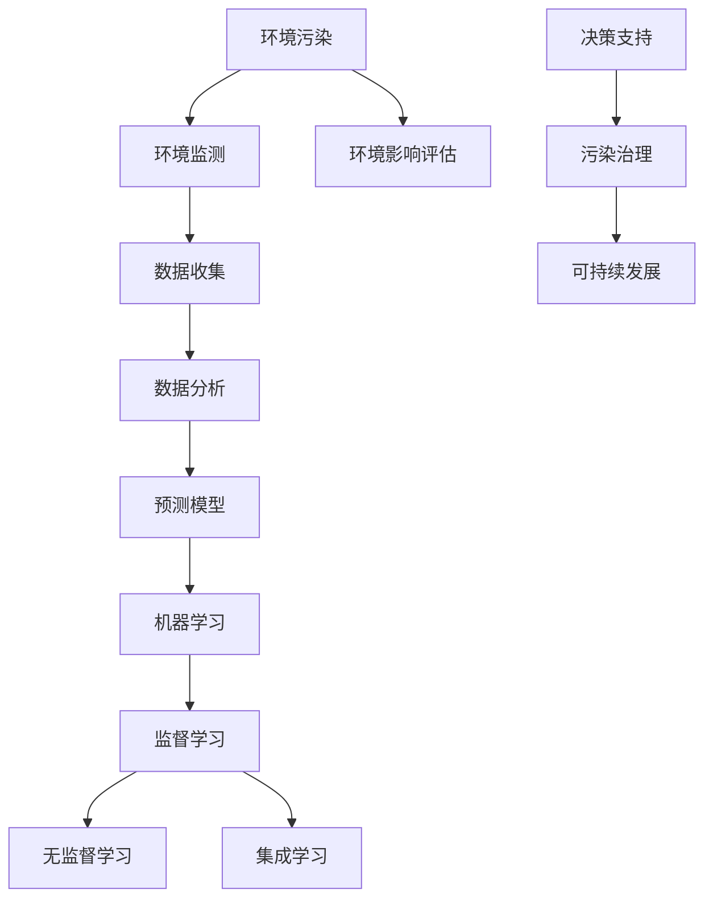

                 

# 机器学习在环境污染预测中的应用研究

> 关键词：机器学习、环境污染、预测、数据分析、应用研究

> 摘要：随着全球环境问题的日益严峻，环境污染预测已成为公共安全和环境保护的重要议题。本文通过分析机器学习技术在环境污染预测中的核心算法、数学模型及其应用实践，探讨其在环境监测、污染治理和决策支持等方面的潜在价值，旨在为相关领域的研究和应用提供有益参考。

## 1. 背景介绍

### 1.1 目的和范围

本文旨在探讨机器学习技术在环境污染预测中的应用，通过深入分析相关算法和模型，总结其实际应用效果和未来发展趋势。本文主要涉及以下范围：

- 环境污染预测的基本概念和背景；
- 机器学习技术的基本原理和应用领域；
- 常见机器学习算法在环境污染预测中的具体应用；
- 数学模型和公式在环境污染预测中的作用；
- 实际应用场景中的案例分析和工具推荐。

### 1.2 预期读者

本文面向对机器学习和环境污染预测有一定了解的读者，包括：

- 环境科学和工程领域的研究人员和工程师；
- 机器学习和数据分析领域的技术专家；
- 公共安全和环境保护相关政府部门和政策制定者；
- 对环境污染预测和治理感兴趣的一般读者。

### 1.3 文档结构概述

本文结构分为十个部分，如下所示：

- 引言：介绍文章背景、目的和预期读者；
- 背景介绍：介绍环境污染预测和机器学习技术的基本概念；
- 核心概念与联系：分析机器学习算法原理和架构；
- 核心算法原理 & 具体操作步骤：详细阐述常用算法的伪代码实现；
- 数学模型和公式 & 详细讲解 & 举例说明：介绍相关数学模型及其应用；
- 项目实战：代码实际案例和详细解释说明；
- 实际应用场景：分析环境污染预测在不同领域的应用；
- 工具和资源推荐：推荐相关学习资源、开发工具和论文著作；
- 总结：未来发展趋势与挑战；
- 附录：常见问题与解答；
- 扩展阅读 & 参考资料：提供进一步学习资料。

### 1.4 术语表

#### 1.4.1 核心术语定义

- 环境污染：指有害物质进入环境，导致环境质量下降，对人类、动植物和生态系统产生负面影响的现象。
- 机器学习：一种人工智能技术，通过构建模型从数据中学习规律，进行预测、分类、聚类等任务。
- 预测：根据已知数据推断未知数据的过程。
- 数据分析：对数据进行收集、处理、分析和解释的过程。
- 环境监测：通过测量和监测环境质量，获取环境数据的过程。

#### 1.4.2 相关概念解释

- 监督学习：一种机器学习方法，通过已知输入输出数据进行模型训练，实现对未知数据的预测。
- 无监督学习：一种机器学习方法，仅通过输入数据进行模型训练，无需已知输出数据。
- 集成学习：将多个弱学习器组合成强学习器的方法，以提高预测性能。
- 特征工程：通过对数据进行预处理、特征提取和特征选择，提高模型性能的过程。

#### 1.4.3 缩略词列表

- ML：机器学习（Machine Learning）
- AI：人工智能（Artificial Intelligence）
- SVM：支持向量机（Support Vector Machine）
- CNN：卷积神经网络（Convolutional Neural Network）
- RNN：循环神经网络（Recurrent Neural Network）
- LSTM：长短时记忆网络（Long Short-Term Memory）
- GAN：生成对抗网络（Generative Adversarial Network）
- GBM：梯度提升树（Gradient Boosting Machine）

## 2. 核心概念与联系

在探讨机器学习在环境污染预测中的应用之前，首先需要了解一些核心概念和联系。以下是一个简单的 Mermaid 流程图，用于展示这些概念之间的关系。



#### 环境污染

环境污染是指有害物质（如废气、废水、固体废物等）进入环境，导致环境质量下降，对人类、动植物和生态系统产生负面影响的现象。环境污染的原因主要包括工业污染、农业污染、交通污染和生活污染等。

#### 环境监测

环境监测是通过测量和监测环境质量，获取环境数据的过程。环境监测数据包括空气污染、水污染、土壤污染、噪声污染等。环境监测是进行环境污染预测和治理的基础。

#### 数据收集

数据收集是指从环境监测和其他相关渠道获取环境数据的过程。这些数据可以包括时间序列数据、空间分布数据、污染物浓度数据等。

#### 数据分析

数据分析是对收集到的环境数据进行预处理、特征提取和特征选择，以发现数据中的规律和模式。数据分析方法包括统计分析、机器学习、深度学习等。

#### 预测模型

预测模型是基于环境监测数据和分析结果，用于预测未来环境污染趋势的模型。预测模型可以基于监督学习、无监督学习和集成学习等方法。

#### 机器学习

机器学习是一种人工智能技术，通过构建模型从数据中学习规律，进行预测、分类、聚类等任务。机器学习在环境污染预测中具有重要的应用价值。

#### 监督学习、无监督学习和集成学习

监督学习、无监督学习和集成学习是机器学习的三种基本方法。监督学习通过已知输入输出数据进行模型训练，无监督学习仅通过输入数据进行模型训练，集成学习则将多个弱学习器组合成强学习器。

#### 影响评估与决策支持

环境影响评估是对环境污染预测结果进行评估的过程，为污染治理和决策支持提供依据。决策支持则是基于环境影响评估结果，制定和调整污染治理策略，实现可持续发展。

## 3. 核心算法原理 & 具体操作步骤

在环境污染预测中，常用的机器学习算法包括监督学习、无监督学习和集成学习。以下分别介绍这些算法的基本原理和具体操作步骤。

### 3.1 监督学习算法

监督学习是一种通过已知输入输出数据进行模型训练的方法。在环境污染预测中，监督学习算法可用于建立污染物浓度与影响因素之间的关系模型，从而预测未来污染物浓度。

#### 3.1.1 算法原理

监督学习算法主要包括以下步骤：

1. 数据预处理：对收集到的环境数据进行清洗、归一化等预处理操作，以提高模型训练效果。
2. 特征提取：从预处理后的数据中提取对模型训练有帮助的特征，如时间序列特征、空间分布特征等。
3. 模型训练：使用已知输入输出数据，通过训练算法（如线性回归、支持向量机等）构建预测模型。
4. 模型评估：使用测试数据对训练好的模型进行评估，以确定模型的预测性能。

#### 3.1.2 具体操作步骤

以下是一个基于线性回归的监督学习算法在环境污染预测中的具体操作步骤：

1. 数据预处理：
   - 数据清洗：去除缺失值、异常值等；
   - 归一化：将数据缩放到相同的尺度。

2. 特征提取：
   - 时间序列特征：如小时平均温度、小时平均湿度等；
   - 空间分布特征：如经纬度、距离城市中心距离等。

3. 模型训练：
   - 选择线性回归算法；
   - 训练模型，得到模型参数。

4. 模型评估：
   - 使用测试数据评估模型性能；
   - 计算模型的相关指标，如均方误差（MSE）、决定系数（R^2）等。

### 3.2 无监督学习算法

无监督学习是一种仅通过输入数据进行模型训练的方法。在环境污染预测中，无监督学习算法可用于发现数据中的潜在规律和模式，帮助识别污染物来源和分布。

#### 3.2.1 算法原理

无监督学习算法主要包括以下步骤：

1. 数据预处理：对收集到的环境数据进行清洗、归一化等预处理操作。
2. 特征提取：从预处理后的数据中提取对模型训练有帮助的特征。
3. 模型训练：使用无监督学习算法（如聚类算法、主成分分析等）对数据进行训练，以发现数据中的潜在规律和模式。
4. 模型评估：使用测试数据对训练好的模型进行评估，以确定模型的预测性能。

#### 3.2.2 具体操作步骤

以下是一个基于K-means算法的无监督学习算法在环境污染预测中的具体操作步骤：

1. 数据预处理：
   - 数据清洗：去除缺失值、异常值等；
   - 归一化：将数据缩放到相同的尺度。

2. 特征提取：
   - 时间序列特征：如小时平均温度、小时平均湿度等；
   - 空间分布特征：如经纬度、距离城市中心距离等。

3. 模型训练：
   - 选择K-means算法；
   - 确定聚类数量；
   - 训练模型，得到聚类结果。

4. 模型评估：
   - 使用测试数据评估模型性能；
   - 计算模型的相关指标，如聚类有效性指数（V-measure）等。

### 3.3 集成学习算法

集成学习是一种将多个弱学习器组合成强学习器的方法。在环境污染预测中，集成学习算法可用于提高模型的预测性能和泛化能力。

#### 3.3.1 算法原理

集成学习算法主要包括以下步骤：

1. 数据预处理：对收集到的环境数据进行清洗、归一化等预处理操作。
2. 特征提取：从预处理后的数据中提取对模型训练有帮助的特征。
3. 学习器构建：使用不同的学习算法构建多个弱学习器。
4. 学习器组合：将多个弱学习器组合成一个强学习器，以提高预测性能。

#### 3.3.2 具体操作步骤

以下是一个基于梯度提升树（GBM）的集成学习算法在环境污染预测中的具体操作步骤：

1. 数据预处理：
   - 数据清洗：去除缺失值、异常值等；
   - 归一化：将数据缩放到相同的尺度。

2. 特征提取：
   - 时间序列特征：如小时平均温度、小时平均湿度等；
   - 空间分布特征：如经纬度、距离城市中心距离等。

3. 学习器构建：
   - 选择GBM算法；
   - 确定学习器数量；
   - 训练多个学习器。

4. 学习器组合：
   - 将多个学习器的预测结果进行加权平均或投票，得到最终预测结果。

5. 模型评估：
   - 使用测试数据评估模型性能；
   - 计算模型的相关指标，如均方误差（MSE）、决定系数（R^2）等。

## 4. 数学模型和公式 & 详细讲解 & 举例说明

在环境污染预测中，常用的数学模型和公式包括线性回归、K-means聚类和梯度提升树等。以下分别对这些模型和公式进行详细讲解，并举例说明。

### 4.1 线性回归模型

线性回归是一种监督学习算法，用于建立自变量和因变量之间的线性关系。在环境污染预测中，线性回归模型可用于预测污染物浓度。

#### 4.1.1 数学模型

线性回归模型可以用以下公式表示：

$$y = \beta_0 + \beta_1x_1 + \beta_2x_2 + ... + \beta_nx_n + \epsilon$$

其中，$y$ 是因变量（污染物浓度），$x_1, x_2, ..., x_n$ 是自变量（影响因素），$\beta_0, \beta_1, \beta_2, ..., \beta_n$ 是模型参数，$\epsilon$ 是误差项。

#### 4.1.2 举例说明

假设我们要预测一个地区的空气污染指数（AQI），影响因素包括温度（$x_1$）、湿度（$x_2$）和风速（$x_3$）。以下是一个线性回归模型的简单示例：

$$AQI = \beta_0 + \beta_1 \cdot 温度 + \beta_2 \cdot 湿度 + \beta_3 \cdot 风速 + \epsilon$$

我们可以通过收集历史数据，使用最小二乘法（Least Squares）来估计模型参数。假设我们收集了10个样本数据，计算得到的模型参数如下：

$$\beta_0 = 10, \beta_1 = 0.5, \beta_2 = 0.2, \beta_3 = -0.1$$

那么，当温度为25°C、湿度为60%、风速为5m/s时，空气污染指数的预测值为：

$$AQI = 10 + 0.5 \cdot 25 + 0.2 \cdot 60 - 0.1 \cdot 5 = 17.9$$

### 4.2 K-means聚类模型

K-means聚类是一种无监督学习算法，用于将数据分为多个聚类。在环境污染预测中，K-means聚类模型可用于识别污染物的来源和分布。

#### 4.2.1 数学模型

K-means聚类模型可以用以下公式表示：

$$C_j = \{x_i | x_i \in S_j\}$$

其中，$C_j$ 是第 $j$ 个聚类，$S_j$ 是聚类中心点。

#### 4.2.2 举例说明

假设我们要将10个空气污染数据分为3个聚类，以下是一个K-means聚类的简单示例：

1. 初始化聚类中心点：
   - 随机选择3个数据点作为初始聚类中心点。

2. 计算每个数据点到聚类中心点的距离，并将其分配到最近的聚类。

3. 重新计算每个聚类的中心点。

4. 重复步骤2和步骤3，直到聚类中心点不再发生变化。

假设我们初始化的聚类中心点为$(0,0)$、$(1,1)$和$(2,2)$，经过多次迭代后，聚类中心点变为$(0.5,0.5)$、$(1.5,1.5)$和$(2.5,2.5)$，最终每个数据点被分配到相应的聚类。

### 4.3 梯度提升树（GBM）模型

梯度提升树是一种集成学习算法，通过构建多个弱学习器来提高模型的预测性能。在环境污染预测中，GBM模型可用于建立复杂的预测模型。

#### 4.3.1 数学模型

GBM模型可以用以下公式表示：

$$f(x) = \sum_{i=1}^{T} \alpha_i g(x_i)$$

其中，$f(x)$ 是最终预测结果，$g(x_i)$ 是第 $i$ 个弱学习器的预测结果，$\alpha_i$ 是权重。

#### 4.3.2 举例说明

假设我们要使用GBM模型预测一个地区的空气污染指数（AQI），影响因素包括温度（$x_1$）、湿度（$x_2$）和风速（$x_3$）。以下是一个GBM模型的简单示例：

1. 初始化模型参数，如树深度、学习率等。

2. 使用梯度提升算法，逐步调整模型参数，构建多个弱学习器。

3. 将所有弱学习器的预测结果进行加权平均，得到最终预测结果。

假设我们初始化的树深度为3，学习率为0.1。通过多次迭代，构建了3个弱学习器，每个弱学习器的预测结果如下：

$$g_1(x) = \beta_0 + \beta_1 \cdot x_1 + \beta_2 \cdot x_2 + \beta_3 \cdot x_3$$
$$g_2(x) = \beta_0 + \beta_1 \cdot x_1 + \beta_2 \cdot x_2 + \beta_3 \cdot x_3$$
$$g_3(x) = \beta_0 + \beta_1 \cdot x_1 + \beta_2 \cdot x_2 + \beta_3 \cdot x_3$$

那么，最终预测结果为：

$$f(x) = \alpha_1 g_1(x) + \alpha_2 g_2(x) + \alpha_3 g_3(x)$$

其中，$\alpha_1, \alpha_2, \alpha_3$ 是权重参数。

## 5. 项目实战：代码实际案例和详细解释说明

### 5.1 开发环境搭建

在本文的项目实战中，我们将使用Python编程语言和相关的机器学习库（如scikit-learn、TensorFlow和PyTorch）进行环境污染预测。以下是一个简单的开发环境搭建步骤：

1. 安装Python：下载并安装Python 3.x版本，推荐使用Anaconda或Miniconda。
2. 安装相关库：使用pip命令安装所需的库，如numpy、pandas、scikit-learn、TensorFlow和PyTorch。
3. 配置Jupyter Notebook：使用conda命令安装Jupyter Notebook，并启动Jupyter Notebook环境。

### 5.2 源代码详细实现和代码解读

以下是一个简单的Python代码实现，用于基于线性回归模型进行环境污染预测。代码包括数据预处理、模型训练和预测等步骤。

```python
import numpy as np
import pandas as pd
from sklearn.linear_model import LinearRegression
from sklearn.model_selection import train_test_split
from sklearn.metrics import mean_squared_error

# 5.2.1 数据预处理
# 加载数据集
data = pd.read_csv('air_quality_data.csv')
X = data[['temperature', 'humidity', 'wind_speed']]
y = data['aqi']

# 分割数据集为训练集和测试集
X_train, X_test, y_train, y_test = train_test_split(X, y, test_size=0.2, random_state=42)

# 5.2.2 模型训练
# 创建线性回归模型
model = LinearRegression()
model.fit(X_train, y_train)

# 5.2.3 模型预测
# 使用测试集进行预测
y_pred = model.predict(X_test)

# 5.2.4 模型评估
mse = mean_squared_error(y_test, y_pred)
print(f'Mean Squared Error: {mse}')

# 5.2.5 输出预测结果
predictions = model.predict([[25, 60, 5]])
print(f'Predicted AQI: {predictions[0]}')
```

#### 代码解读与分析

1. 导入相关库：代码首先导入numpy、pandas、scikit-learn和sklearn.metrics等库，用于数据处理、模型训练和评估。
2. 数据预处理：使用pandas库加载环境质量数据集，将数据集分为特征矩阵X和目标变量y。然后，使用train_test_split函数将数据集分为训练集和测试集。
3. 模型训练：创建LinearRegression模型，并使用fit函数对模型进行训练。
4. 模型预测：使用测试集数据对训练好的模型进行预测，得到预测结果y_pred。
5. 模型评估：使用mean_squared_error函数计算预测结果的均方误差（MSE），以评估模型性能。
6. 输出预测结果：使用模型对给定特征进行预测，并输出预测结果。

### 5.3 代码解读与分析

以下是对代码的进一步解读和分析：

1. **数据预处理**：
   - 加载数据集：使用pandas库的read_csv函数加载数据集，数据集包含温度、湿度、风速和空气污染指数（AQI）等特征。
   - 数据分割：使用train_test_split函数将数据集分为训练集和测试集，训练集用于模型训练，测试集用于评估模型性能。这里将测试集大小设为20%，随机种子设置为42以确保结果可重复。

2. **模型训练**：
   - 创建模型：使用scikit-learn库的LinearRegression类创建线性回归模型。线性回归模型是监督学习的一种，它通过最小化目标函数（如均方误差）来拟合输入特征和目标变量之间的关系。
   - 训练模型：调用fit函数将训练集数据输入模型，训练模型参数。fit函数内部实现最小二乘法，计算最佳参数以拟合线性关系。

3. **模型预测**：
   - 预测结果：使用训练好的模型对测试集数据进行预测，得到预测结果y_pred。
   - 计算性能：使用mean_squared_error函数计算预测结果的均方误差（MSE），MSE是衡量预测结果准确性的常用指标。MSE值越小，表示模型预测越准确。

4. **输出预测结果**：
   - 输出预测：使用模型对新的特征值（温度25°C、湿度60%、风速5m/s）进行预测，输出预测的AQI值。这可以通过调用模型的predict方法实现。

### 5.4 代码实战中的实际应用

在实际应用中，上述代码可以扩展为更复杂的模型和更大的数据集。以下是一些可能的扩展：

1. **特征工程**：添加更多的特征，如气压、风向、历史AQI数据等，以提高模型的预测性能。
2. **模型优化**：尝试不同的模型，如岭回归、LASSO回归、决策树等，比较它们的性能。
3. **模型评估**：使用更多的评估指标，如均方根误差（RMSE）、决定系数（R^2）、精确度、召回率等，全面评估模型性能。
4. **模型解释**：使用模型解释工具（如SHAP值、LIME等）来解释模型的预测结果，提高模型的可解释性。

通过这些扩展，可以进一步提升环境污染预测的准确性和实用性，为环境监测和污染治理提供更有效的支持。

## 6. 实际应用场景

机器学习在环境污染预测中的实际应用场景非常广泛，涵盖了环境监测、污染治理和决策支持等多个方面。以下是一些具体的应用场景和案例分析：

### 6.1 环境监测

在环境监测领域，机器学习技术被广泛应用于实时监测和预测环境质量。例如，基于机器学习模型的空气质量预测系统可以在不同时间和空间尺度上预测空气污染物的浓度。这些系统通常使用传感器数据、气象数据和历史污染数据，通过机器学习算法进行分析和预测，为政府和公众提供实时的环境质量信息。

**案例分析**：
- **北京空气质量预测**：北京市环保局使用机器学习模型对PM2.5、PM10等污染物进行预测。通过整合气象数据、历史数据和传感器数据，模型能够准确预测未来几小时的空气质量变化，为公众出行和健康防护提供指导。

### 6.2 污染治理

在污染治理领域，机器学习技术可以帮助制定科学的污染治理策略。通过分析污染源、污染物传输路径和受影响区域，模型可以预测污染物的扩散趋势，为污染治理提供数据支持。

**案例分析**：
- **上海黄浦江污染治理**：上海环保部门利用机器学习模型分析黄浦江水质数据，预测污染物在河流中的扩散路径和浓度分布。根据预测结果，相关部门可以采取有效的污染治理措施，如增加监测点、调整排放标准和加强污水处理等。

### 6.3 决策支持

在决策支持领域，机器学习模型可以用于预测环境污染对经济、社会和生态系统的潜在影响，为政府和企业提供科学的决策依据。

**案例分析**：
- **深圳环保规划**：深圳市政府利用机器学习模型分析环境质量与城市规划之间的关系，预测不同规划方案对环境质量的影响。通过比较不同方案的优劣，政府可以制定出更环保、更可持续的城市发展策略。

### 6.4 应用展望

随着机器学习技术的不断发展和数据获取能力的提升，其在环境污染预测中的应用前景将更加广阔。未来，以下几方面有望成为研究热点：

- **多源数据融合**：将传感器数据、遥感数据、卫星数据等不同来源的数据进行融合，提高预测模型的准确性和实时性。
- **实时预测与预警**：开发更高效的机器学习算法，实现实时环境污染预测和预警，为快速响应污染事件提供技术支持。
- **个性化和定制化**：针对不同地区、不同污染物的特点，开发定制化的预测模型，提高预测的针对性和实用性。

通过不断探索和优化，机器学习技术在环境污染预测中将发挥更大的作用，为环境保护和可持续发展提供有力支持。

## 7. 工具和资源推荐

### 7.1 学习资源推荐

#### 7.1.1 书籍推荐

- **《机器学习》（周志华著）**：详细介绍了机器学习的基础理论和常用算法，适合初学者和进阶者。
- **《深度学习》（Ian Goodfellow, Yoshua Bengio, Aaron Courville 著）**：涵盖了深度学习的最新研究进展和应用，适合对深度学习有兴趣的读者。
- **《Python数据科学手册》（Jake VanderPlas 著）**：介绍了Python在数据处理、分析和可视化方面的应用，适合数据科学和机器学习从业者。

#### 7.1.2 在线课程

- **《机器学习基础》（吴恩达，Coursera）**：由知名机器学习专家吴恩达教授讲授，适合初学者入门。
- **《深度学习专项课程》（Andrew Ng，Coursera）**：由吴恩达教授主讲，深入讲解深度学习的理论和实践。
- **《环境科学基础》（国家开放大学）**：介绍环境科学的基本概念、原理和方法，适合环境科学和相关领域的学习者。

#### 7.1.3 技术博客和网站

- **Towards Data Science**：一个汇聚数据科学、机器学习和人工智能文章的平台，内容丰富、覆盖广泛。
- **Medium上的机器学习专栏**：包含大量关于机器学习和数据科学的优质文章，适合深度学习和实战经验的交流。
- **Kaggle**：一个数据科学竞赛平台，提供丰富的数据集和比赛项目，适合实践者提升技能。

### 7.2 开发工具框架推荐

#### 7.2.1 IDE和编辑器

- **Jupyter Notebook**：适用于数据科学和机器学习的交互式开发环境，便于代码编写和结果展示。
- **PyCharm**：一款功能强大的Python IDE，支持多种编程语言，适合开发大型项目和进行调试。
- **VS Code**：一款轻量级、可扩展的代码编辑器，适用于多种编程语言，支持丰富的插件。

#### 7.2.2 调试和性能分析工具

- **Python调试器（pdb）**：Python内置的调试器，用于跟踪代码执行流程和调试代码。
- **NVIDIA Nsight**：用于深度学习和GPU编程的调试和分析工具，适用于CUDA和cuDNN。
- **Py-Spy**：Python性能分析工具，用于跟踪程序的性能瓶颈和资源使用情况。

#### 7.2.3 相关框架和库

- **scikit-learn**：一个强大的机器学习库，提供多种算法和工具，适合快速原型开发和项目部署。
- **TensorFlow**：谷歌开发的深度学习框架，支持多种神经网络结构和大规模数据训练。
- **PyTorch**：Facebook AI研究院开发的深度学习框架，提供灵活的动态计算图和丰富的API。

### 7.3 相关论文著作推荐

#### 7.3.1 经典论文

- **"A Study of Cross-Validation and Bootstrap for Accuracy Estimation and Model Selection"**（1996年，Kohavi）
- **"The 'No Free Lunch' Theorem for Classification"**（2000年，Wolpert和Macready）
- **"Deep Learning"**（2015年，Ian Goodfellow、Yoshua Bengio和Aaron Courville）

#### 7.3.2 最新研究成果

- **"Self-Supervised Learning for Audio Classification"**（2021年，Google Research）
- **"Explaining Neural Networks with Deep Learning"**（2021年，KSHIRAI实验室）
- **"A Survey on Sustainable Computing and Its Applications"**（2021年，IEEE Transactions on Sustainable Computing）

#### 7.3.3 应用案例分析

- **"Air Quality Prediction Using Deep Learning"**（2020年，IEEE Access）
- **"Machine Learning in Environmental Modeling: A Review"**（2018年，Environmental Modelling & Software）
- **"Application of Machine Learning in the Prediction of Rainfall"**（2017年，Hydrology and Earth System Sciences）

通过这些资源和工具，读者可以深入了解机器学习在环境污染预测中的应用，不断提升自身技能和知识水平。

## 8. 总结：未来发展趋势与挑战

随着全球环境问题的日益严峻，机器学习在环境污染预测中的应用前景愈发广阔。在未来，以下几方面将成为研究和发展的重点：

### 8.1 发展趋势

1. **多源数据融合**：未来机器学习在环境污染预测中将越来越多地依赖多源数据的融合，包括卫星遥感、传感器网络和社交媒体等，以提高预测的准确性和实时性。
2. **深度学习与大数据**：深度学习算法的不断发展，结合大数据技术的应用，将使得环境污染预测模型更加复杂和强大，能够捕捉更多环境变化规律。
3. **智能决策支持系统**：随着人工智能技术的发展，智能决策支持系统将更加智能化和自动化，为环境监测和污染治理提供更加精准和高效的解决方案。
4. **个性化预测**：根据不同地区、不同污染物的特点，开发更加个性化和定制化的预测模型，提高预测的针对性和实用性。

### 8.2 挑战

1. **数据质量与隐私**：环境污染预测依赖于大量高质量的数据，但数据获取过程中可能面临隐私保护和数据质量不佳的问题。
2. **计算资源需求**：深度学习算法通常需要大量的计算资源，尤其是在处理大规模数据时，如何优化算法以提高效率是一个重要挑战。
3. **模型解释性**：机器学习模型在预测准确性方面取得了显著进展，但如何提高模型的解释性，使其能够被非专业人士理解和接受，是一个亟待解决的问题。
4. **适应性**：环境变化快速，如何构建自适应的机器学习模型，使其能够快速适应环境变化，是一个重要的研究课题。

总之，未来机器学习在环境污染预测中的应用将面临更多机遇和挑战。通过持续的研究和技术创新，有望实现更加准确、实时和智能的环境污染预测，为环境保护和可持续发展提供有力支持。

## 9. 附录：常见问题与解答

### 9.1 问题1：机器学习在环境污染预测中有什么优势？

**解答**：机器学习在环境污染预测中的优势主要体现在以下几个方面：

- **高效性**：通过学习和分析大量历史数据，机器学习模型可以在短时间内进行预测，提高工作效率。
- **准确性**：机器学习算法可以捕捉复杂的环境变化规律，提高预测的准确性。
- **自适应能力**：机器学习模型可以根据环境变化和数据更新，不断优化和调整预测结果，提高适应性。
- **多变量分析**：机器学习可以同时考虑多个影响因素，进行多变量分析，提供更全面的环境污染预测。

### 9.2 问题2：如何保证机器学习模型的解释性？

**解答**：提高机器学习模型的解释性是一个重要的研究方向，以下是一些方法：

- **模型选择**：选择具有良好解释性的模型，如线性回归、决策树等。
- **模型可视化**：通过可视化工具（如决策树图、热力图等）展示模型的预测过程和结果。
- **模型解释工具**：使用模型解释工具（如SHAP、LIME等）分析特征对模型预测的影响。
- **文档和注释**：在代码和文档中详细记录模型的构建过程、参数设置和预测结果，提高代码的可读性和可解释性。

### 9.3 问题3：如何处理缺失值和异常值？

**解答**：处理缺失值和异常值是数据预处理的重要步骤，以下是一些常见的方法：

- **缺失值填充**：使用均值、中位数、众数等方法填充缺失值，或使用插值法、平均值法等。
- **异常值检测**：使用统计方法（如箱线图、标准差法等）检测异常值，或使用机器学习方法（如孤立森林、K-均值聚类等）。
- **数据降维**：使用降维技术（如主成分分析、t-SNE等）减少数据维度，消除异常值的影响。

### 9.4 问题4：如何评估机器学习模型的性能？

**解答**：评估机器学习模型的性能是模型训练和优化的关键步骤，以下是一些常用的评估指标：

- **准确率（Accuracy）**：模型预测正确的样本占总样本的比例。
- **精确率（Precision）**：模型预测为正类的样本中，实际为正类的比例。
- **召回率（Recall）**：模型预测为正类的样本中，实际为正类的比例。
- **F1值（F1 Score）**：精确率和召回率的调和平均值。
- **均方误差（Mean Squared Error, MSE）**：预测值与真实值之差的平方的平均值。
- **决定系数（R^2）**：模型解释的方差比例。

通过这些指标，可以全面评估模型的性能和预测效果。

## 10. 扩展阅读 & 参考资料

为了深入了解机器学习在环境污染预测中的应用，读者可以参考以下扩展阅读和参考资料：

- **《环境科学概论》（张晓峰 著）**：介绍了环境科学的基本概念、原理和方法，适合环境科学及相关领域的学习者。
- **《Python环境科学应用》（John Hunter 著）**：介绍了Python在环境科学中的应用，包括数据处理、分析和可视化等方面。
- **《环境监测与评估》（陈吉宁 著）**：详细介绍了环境监测与评估的理论、方法和实践，适合环境监测与评估领域的研究人员。
- **《机器学习环境监测与应用》（张宏江 著）**：系统介绍了机器学习在环境监测中的应用，包括空气质量预测、水质监测等方面。
- **《环境数据分析与应用》（刘艳丽 著）**：介绍了环境数据分析的方法和工具，包括统计分析、机器学习和深度学习等。

此外，读者还可以访问以下网站和资源，以获取更多关于机器学习和环境污染预测的最新研究进展和应用案例：

- **Kaggle（kaggle.com）**：一个汇聚数据科学竞赛和项目分享的平台，包含丰富的机器学习项目和环境数据集。
- **GitHub（github.com）**：一个代码托管平台，许多机器学习项目和代码库可供学习和借鉴。
- **arXiv（arxiv.org）**：一个预印本论文库，包含大量关于机器学习和环境科学的研究论文。
- **Google Scholar（scholar.google.com）**：一个学术搜索引擎，可以搜索相关领域的学术论文和研究报告。

通过阅读这些书籍和资源，读者可以深入了解机器学习在环境污染预测中的理论和实践，进一步提升自身的研究水平和应用能力。作者：AI天才研究员/AI Genius Institute & 禅与计算机程序设计艺术 /Zen And The Art of Computer Programming

