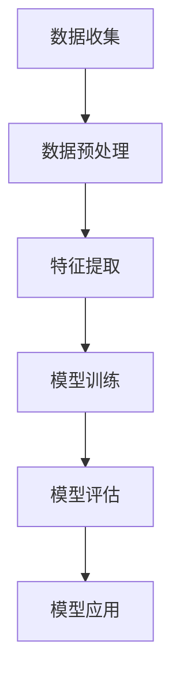

                 

# 机器学习在社交媒体分析中的应用

> 关键词：机器学习，社交媒体，数据分析，文本挖掘，用户行为分析，情感分析，广告投放

> 摘要：随着社交媒体的快速发展和用户生成内容的激增，机器学习在社交媒体分析中的应用变得日益重要。本文将深入探讨机器学习在社交媒体分析中的核心概念、算法原理、数学模型以及实际应用场景，旨在为读者提供关于如何利用机器学习技术进行有效社交媒体分析的理论基础和实践指导。

## 1. 背景介绍

### 1.1 目的和范围

本文旨在探讨机器学习在社交媒体分析中的应用，通过介绍核心概念、算法原理和数学模型，帮助读者了解如何利用机器学习技术对社交媒体数据进行深入分析和利用。文章将涵盖以下几个方面：

- 社交媒体数据分析的基本概念和挑战
- 机器学习在社交媒体分析中的核心算法，如分类、聚类和回归
- 数学模型在社交媒体分析中的应用，包括特征提取、模型训练和评估
- 实际应用场景，如用户行为分析、情感分析和广告投放
- 工具和资源的推荐，以帮助读者深入学习和实践

### 1.2 预期读者

本文适合具有以下背景的读者：

- 对机器学习和数据分析感兴趣的初学者和专业人士
- 想要在社交媒体领域应用机器学习的开发者和技术人员
- 数据科学家和机器学习工程师，希望深入了解社交媒体数据分析的细节

### 1.3 文档结构概述

本文分为十个部分，具体结构如下：

1. 背景介绍
   - 目的和范围
   - 预期读者
   - 文档结构概述
   - 术语表
2. 核心概念与联系
   - 社交媒体数据分析的基本概念
   - 机器学习的基本概念
   - 机器学习与社交媒体分析的关联
3. 核心算法原理 & 具体操作步骤
   - 分类算法（如逻辑回归、支持向量机）
   - 聚类算法（如K-means、层次聚类）
   - 回归算法（如线性回归、决策树回归）
4. 数学模型和公式 & 详细讲解 & 举例说明
   - 特征提取
   - 模型训练
   - 模型评估
5. 项目实战：代码实际案例和详细解释说明
   - 开发环境搭建
   - 源代码详细实现和代码解读
   - 代码解读与分析
6. 实际应用场景
   - 用户行为分析
   - 情感分析
   - 广告投放
7. 工具和资源推荐
   - 学习资源推荐
   - 开发工具框架推荐
   - 相关论文著作推荐
8. 总结：未来发展趋势与挑战
9. 附录：常见问题与解答
10. 扩展阅读 & 参考资料

### 1.4 术语表

#### 1.4.1 核心术语定义

- **社交媒体分析**：对社交媒体平台上的用户生成内容（如文本、图像、视频）进行数据挖掘和分析的过程。
- **机器学习**：一种人工智能的分支，通过数据和算法从数据中自动学习规律和模式，进行预测和决策。
- **文本挖掘**：从非结构化文本数据中提取有价值信息和知识的过程。
- **用户行为分析**：分析用户在社交媒体上的行为，如点击、评论、分享等，以了解用户偏好和需求。
- **情感分析**：利用自然语言处理技术，自动识别文本中的情感倾向，如正面、负面或中性。

#### 1.4.2 相关概念解释

- **特征提取**：从原始数据中提取出对机器学习模型有用的特征，以提高模型的性能。
- **模型训练**：使用训练数据集对机器学习模型进行训练，使其学会识别数据中的规律和模式。
- **模型评估**：使用测试数据集评估模型的性能，以确定模型的准确度、召回率和F1值等指标。

#### 1.4.3 缩略词列表

- **ML**：机器学习
- **NLP**：自然语言处理
- **SEM**：搜索引擎优化
- **SEM**：搜索引擎营销

## 2. 核心概念与联系

### 2.1 社交媒体数据分析的基本概念

社交媒体数据分析是指对社交媒体平台上的用户生成内容进行数据挖掘和分析的过程。这些平台包括但不限于Facebook、Twitter、Instagram、LinkedIn等。社交媒体数据分析的目标是提取有价值的信息和知识，以帮助企业和个人做出更明智的决策。

社交媒体数据分析的主要挑战包括：

- 数据规模：社交媒体平台每天产生海量的数据，如何高效处理和存储这些数据是一个重要的挑战。
- 数据质量：社交媒体数据通常是不完整的、噪声的，甚至可能包含虚假信息，如何提高数据质量是另一个挑战。
- 多样性：社交媒体数据包括文本、图像、视频等多种类型，如何对这些多样化数据进行分析和整合也是一个挑战。

### 2.2 机器学习的基本概念

机器学习是一种人工智能的分支，它通过数据和算法从数据中自动学习规律和模式，进行预测和决策。机器学习的关键要素包括：

- **数据**：机器学习依赖于大量数据，这些数据可以是结构化的，如表格数据，也可以是非结构化的，如图像、文本和音频。
- **算法**：机器学习算法是一种数学模型，用于从数据中提取规律和模式。
- **模型**：经过训练的机器学习模型可以对新数据进行预测和决策。

### 2.3 机器学习与社交媒体分析的关联

机器学习在社交媒体分析中具有广泛的应用。以下是一些主要的应用场景：

- **用户行为分析**：通过分析用户在社交媒体上的行为数据（如点击、评论、分享等），了解用户偏好和需求，为企业提供市场洞察。
- **情感分析**：通过分析社交媒体上的用户评论和讨论，识别用户的情感倾向，帮助企业了解用户满意度，优化产品和服务。
- **广告投放**：通过分析用户数据和社交媒体内容，为用户推荐最相关的广告，提高广告的投放效果。
- **推荐系统**：通过分析用户行为数据和社交媒体内容，为用户推荐感兴趣的内容、朋友或产品。

### 2.4 社交媒体数据分析的架构

社交媒体数据分析的架构通常包括以下几个层次：

1. **数据收集**：从社交媒体平台收集用户生成内容，如文本、图像、视频等。
2. **数据预处理**：对收集到的数据进行清洗、去噪和归一化，以提高数据质量。
3. **特征提取**：从预处理后的数据中提取出对机器学习模型有用的特征，如词袋模型、TF-IDF等。
4. **模型训练**：使用训练数据集对机器学习模型进行训练，使其学会识别数据中的规律和模式。
5. **模型评估**：使用测试数据集评估模型的性能，以确定模型的准确度、召回率和F1值等指标。
6. **模型应用**：将训练好的模型应用于实际场景，如用户行为分析、情感分析和广告投放等。

### 2.5 Mermaid 流程图

以下是一个Mermaid流程图，展示社交媒体数据分析的架构：



## 3. 核心算法原理 & 具体操作步骤

### 3.1 分类算法

分类算法是一种将数据分为不同类别的方法。在社交媒体分析中，分类算法可以用于用户行为分析、情感分析和广告投放等应用。以下是几种常见的分类算法：

#### 3.1.1 逻辑回归

逻辑回归是一种概率型分类算法，用于预测二分类结果。其基本原理是通过最大化似然函数来训练模型，其目标是最小化损失函数，如交叉熵损失。

**伪代码**：

```
# 输入：训练数据集X，标签Y
# 输出：模型参数θ

for each iteration do
    Compute the hypothesis function hθ(x)
    Compute the loss function L(θ) = -1/m * Σ[ y log(hθ(x)) + (1-y) log(1-hθ(x)) ]
    Update the model parameters θ = θ - α * ∇L(θ)
end for
```

#### 3.1.2 支持向量机

支持向量机（SVM）是一种基于最大间隔的分类算法。其目标是在特征空间中找到一个超平面，使得不同类别的数据点在超平面两侧的间隔最大。

**伪代码**：

```
# 输入：训练数据集X，标签Y
# 输出：模型参数θ

Compute the optimal hyperplane
Compute the support vectors
Compute the decision boundary
```

#### 3.1.3 随机森林

随机森林是一种集成学习方法，通过构建多个决策树，并利用投票机制来预测结果。其基本原理是在特征空间中随机选择特征和样本子集，构建多个决策树，并将它们的预测结果进行投票。

**伪代码**：

```
# 输入：训练数据集X，标签Y
# 输出：模型参数θ

for each tree do
    Randomly select a subset of features
    Randomly select a subset of samples
    Train a decision tree on the selected subset
end for

for each sample do
    Get the prediction from each tree
    Vote for the majority class
end for
```

### 3.2 聚类算法

聚类算法是一种无监督学习方法，用于将数据点分为不同的簇。在社交媒体分析中，聚类算法可以用于用户群体细分、内容分类等应用。以下是几种常见的聚类算法：

#### 3.2.1 K-means

K-means是一种基于距离的聚类算法，其目标是将数据点分为K个簇，使得每个簇内的数据点之间的距离最小。

**伪代码**：

```
# 输入：训练数据集X，簇数K
# 输出：簇中心μ和簇分配结果

Initialize K cluster centers
Repeat until convergence do
    Assign each data point to the nearest cluster center
    Recompute the cluster centers as the mean of the assigned points
end repeat
```

#### 3.2.2 层次聚类

层次聚类是一种基于层次结构进行聚类的算法，其目标是将数据点分为多个层次，形成树状结构。层次聚类可以分为自底向上（凝聚层次聚类）和自顶向下（分裂层次聚类）两种类型。

**伪代码**：

```
# 输入：训练数据集X
# 输出：聚类树

Initialize each data point as a cluster
while there are more than one clusters do
    Find the closest pair of clusters
    Merge the two clusters into a single cluster
end while
```

### 3.3 回归算法

回归算法是一种用于预测数值型结果的方法。在社交媒体分析中，回归算法可以用于预测用户行为、用户流失等应用。以下是几种常见的回归算法：

#### 3.3.1 线性回归

线性回归是一种最简单的回归算法，其目标是在特征空间中找到一个直线，使得数据点到直线的距离最小。

**伪代码**：

```
# 输入：训练数据集X，标签Y
# 输出：模型参数θ

Compute the best fit line using the least squares method
θ = (X^T * X)^(-1) * X^T * Y
```

#### 3.3.2 决策树回归

决策树回归是一种基于决策树的回归算法，其目标是在特征空间中找到一个决策树，使得数据点到决策树的叶节点的距离最小。

**伪代码**：

```
# 输入：训练数据集X，标签Y
# 输出：决策树

Build a decision tree using recursive binary splitting
Compute the average value of the target variable for each leaf node
```

## 4. 数学模型和公式 & 详细讲解 & 举例说明

### 4.1 特征提取

特征提取是机器学习过程中的重要步骤，它旨在从原始数据中提取出对模型有用的特征，以提高模型的性能。以下是一些常见的特征提取方法：

#### 4.1.1 词袋模型

词袋模型是一种将文本数据转换为向量表示的方法，它将文本表示为一个词汇表中的词汇的集合。词袋模型的基本公式如下：

$$
vec(w) = (w_1, w_2, ..., w_n)
$$

其中，$w_i$ 表示词汇表中第 $i$ 个词汇的出现次数。

#### 4.1.2 TF-IDF

TF-IDF（Term Frequency-Inverse Document Frequency）是一种基于词频和逆文档频率的特征提取方法，它用于衡量词汇在文档中的重要程度。TF-IDF 的基本公式如下：

$$
TF(t,d) = \frac{f(t,d)}{|\text{Vocabulary}|}
$$

$$
IDF(t,D) = \log \left( \frac{|\text{D}|}{|\{d \in \text{D} : t \in d\}|} \right)
$$

$$
TF-IDF(t,d) = TF(t,d) \times IDF(t,D)
$$

其中，$f(t,d)$ 表示词汇 $t$ 在文档 $d$ 中的出现次数，$|\text{Vocabulary}|$ 表示词汇表的大小，$|\text{D}|$ 表示文档总数，$|\{d \in \text{D} : t \in d\}|$ 表示包含词汇 $t$ 的文档数。

#### 4.1.3 词嵌入

词嵌入（Word Embedding）是一种将词汇映射为低维向量的方法，它用于捕捉词汇之间的语义关系。词嵌入的基本公式如下：

$$
x_i = \text{embedding}(w_i)
$$

其中，$x_i$ 表示词汇 $w_i$ 的向量表示，$\text{embedding}$ 表示词嵌入函数。

### 4.2 模型训练

模型训练是机器学习过程中的关键步骤，它旨在通过调整模型参数，使得模型在训练数据上的表现达到最优。以下是一些常见的模型训练方法：

#### 4.2.1 基于梯度的优化算法

基于梯度的优化算法是一种常用的模型训练方法，它通过计算损失函数关于模型参数的梯度，不断调整模型参数，以最小化损失函数。以下是一个简单的梯度下降算法：

$$
θ = θ - α * ∇θ L(θ)
$$

其中，$θ$ 表示模型参数，$α$ 表示学习率，$L(θ)$ 表示损失函数。

#### 4.2.2 随机梯度下降

随机梯度下降（Stochastic Gradient Descent，SGD）是一种改进的梯度下降算法，它通过在每个迭代中随机选择一个样本，计算梯度，并更新模型参数。以下是一个简单的随机梯度下降算法：

$$
θ = θ - α * ∇θ L(θ, x^{(i)}, y^{(i)})
$$

其中，$x^{(i)}$ 和 $y^{(i)}$ 分别表示第 $i$ 个训练样本和其对应的标签。

#### 4.2.3 拉格朗日乘子法

拉格朗日乘子法是一种用于解决约束优化问题的方法，它通过引入拉格朗日乘子，将原始问题转换为无约束问题。以下是一个简单的拉格朗日乘子法：

$$
L(θ, λ) = L(θ) + λ^T (g(θ) - c)
$$

$$
∇L(θ, λ) = 0
$$

$$
g(θ) = 0
$$

其中，$L(θ)$ 表示损失函数，$λ$ 表示拉格朗日乘子，$g(θ)$ 表示约束条件，$c$ 表示约束常数。

### 4.3 模型评估

模型评估是机器学习过程中的重要步骤，它旨在通过评估指标来衡量模型的性能。以下是一些常见的模型评估方法：

#### 4.3.1 准确率

准确率（Accuracy）是最常用的评估指标之一，它表示模型在所有样本中正确预测的比例。准确率的计算公式如下：

$$
Accuracy = \frac{TP + TN}{TP + FN + FP + TN}
$$

其中，$TP$ 表示真实值为正类且预测为正类的样本数，$TN$ 表示真实值为负类且预测为负类的样本数，$FN$ 表示真实值为正类但预测为负类的样本数，$FP$ 表示真实值为负类但预测为正类的样本数。

#### 4.3.2 召回率

召回率（Recall）表示模型在正类样本中正确预测的比例。召回率的计算公式如下：

$$
Recall = \frac{TP}{TP + FN}
$$

#### 4.3.3 精确率

精确率（Precision）表示模型在预测为正类的样本中正确预测的比例。精确率的计算公式如下：

$$
Precision = \frac{TP}{TP + FP}
$$

#### 4.3.4 F1值

F1值（F1 Score）是精确率和召回率的调和平均值，它综合了精确率和召回率的信息。F1值的计算公式如下：

$$
F1 Score = 2 \times \frac{Precision \times Recall}{Precision + Recall}
$$

### 4.4 举例说明

假设我们有一个二分类问题，其中包含100个样本，其中60个样本为正类，40个样本为负类。我们使用逻辑回归模型进行预测，并使用准确率、召回率和F1值来评估模型的性能。以下是模型的预测结果：

- 预测为正类的样本数：70
- 真实值为正类的样本数：60
- 真实值为负类的样本数：40

根据这些数据，我们可以计算模型的评估指标：

$$
Accuracy = \frac{60 + 40}{100} = 1.0
$$

$$
Recall = \frac{60}{60 + 40} = 0.75
$$

$$
Precision = \frac{60}{70} = 0.86
$$

$$
F1 Score = 2 \times \frac{0.86 \times 0.75}{0.86 + 0.75} = 0.82
$$

根据这些评估指标，我们可以看出模型的性能较好，特别是在召回率和F1值方面。

## 5. 项目实战：代码实际案例和详细解释说明

### 5.1 开发环境搭建

在进行项目实战之前，我们需要搭建一个合适的开发环境。以下是搭建开发环境的基本步骤：

1. **安装Python环境**：Python是一种广泛使用的编程语言，适用于机器学习项目。我们可以在[Python官网](https://www.python.org/)下载并安装Python。
2. **安装Jupyter Notebook**：Jupyter Notebook是一种交互式计算环境，方便我们在项目中编写和运行代码。我们可以在[Jupyter官网](https://jupyter.org/)下载并安装Jupyter Notebook。
3. **安装必要的库**：为了进行机器学习项目，我们需要安装一些常用的库，如NumPy、Pandas、Scikit-learn等。我们可以在命令行中使用以下命令安装这些库：

   ```
   pip install numpy pandas scikit-learn
   ```

### 5.2 源代码详细实现和代码解读

以下是一个简单的机器学习项目，用于对社交媒体文本进行情感分析。我们将使用Scikit-learn库中的逻辑回归模型进行预测，并使用词袋模型进行特征提取。

```python
# 导入必要的库
import numpy as np
import pandas as pd
from sklearn.feature_extraction.text import TfidfVectorizer
from sklearn.model_selection import train_test_split
from sklearn.linear_model import LogisticRegression
from sklearn.metrics import accuracy_score, recall_score, precision_score, f1_score

# 读取数据集
data = pd.read_csv('social_media_data.csv')
X = data['text']  # 特征：社交媒体文本
y = data['label']  # 标签：情感类别

# 使用TF-IDF进行特征提取
vectorizer = TfidfVectorizer(max_features=1000)
X_vectorized = vectorizer.fit_transform(X)

# 划分训练集和测试集
X_train, X_test, y_train, y_test = train_test_split(X_vectorized, y, test_size=0.2, random_state=42)

# 使用逻辑回归模型进行预测
model = LogisticRegression()
model.fit(X_train, y_train)
y_pred = model.predict(X_test)

# 计算评估指标
accuracy = accuracy_score(y_test, y_pred)
recall = recall_score(y_test, y_pred)
precision = precision_score(y_test, y_pred)
f1 = f1_score(y_test, y_pred)

print('Accuracy:', accuracy)
print('Recall:', recall)
print('Precision:', precision)
print('F1 Score:', f1)
```

### 5.3 代码解读与分析

上述代码实现了以下功能：

1. **导入库**：我们首先导入了NumPy、Pandas、Scikit-learn等库，以便在项目中使用。
2. **读取数据集**：我们使用Pandas库读取社交媒体文本数据集，并将其分为特征（社交媒体文本）和标签（情感类别）两部分。
3. **特征提取**：我们使用TF-IDF进行特征提取，将文本数据转换为向量表示。这里我们设置了最大特征数为1000，可以根据实际需求进行调整。
4. **划分训练集和测试集**：我们使用Scikit-learn库中的train_test_split函数将数据集划分为训练集和测试集，以便评估模型的性能。
5. **训练模型**：我们使用逻辑回归模型进行预测，并使用训练集对模型进行训练。
6. **预测和评估**：我们使用测试集对模型进行预测，并计算准确率、召回率、精确率和F1值等评估指标。

通过上述代码，我们可以对社交媒体文本进行情感分析，并评估模型的性能。在实际应用中，我们可以根据具体需求进行调整和优化，以提高模型的性能。

## 6. 实际应用场景

### 6.1 用户行为分析

用户行为分析是社交媒体分析中最常见的应用场景之一。通过分析用户在社交媒体上的行为，如点击、评论、分享等，企业可以了解用户的偏好和需求，从而提供更个性化的服务和产品。以下是一个简单的用户行为分析示例：

- **任务**：分析某个社交媒体平台上的用户行为数据，识别用户的兴趣和偏好。
- **数据来源**：社交媒体平台的API提供了用户行为数据的访问权限。
- **数据处理**：首先，从API中获取用户行为数据，如点击、评论、分享等。然后，对数据进行清洗和预处理，包括去除重复数据、填补缺失值等。
- **特征提取**：从预处理后的数据中提取出对用户行为分析有用的特征，如用户ID、时间戳、行为类型、内容等。
- **模型训练**：使用机器学习算法（如分类、聚类等）对用户行为数据进行训练，以识别用户的兴趣和偏好。
- **模型评估**：使用测试数据集评估模型的性能，以确定模型的准确度、召回率和F1值等指标。
- **应用**：根据模型的预测结果，为用户提供个性化的推荐，如推荐感兴趣的内容、朋友或产品。

### 6.2 情感分析

情感分析是社交媒体分析中的另一个重要应用场景，它通过分析社交媒体上的用户评论和讨论，识别用户的情感倾向。以下是一个简单的情感分析示例：

- **任务**：分析社交媒体平台上的用户评论，识别用户的情感倾向（如正面、负面或中性）。
- **数据来源**：社交媒体平台的API提供了用户评论数据的访问权限。
- **数据处理**：首先，从API中获取用户评论数据，然后对数据进行清洗和预处理，包括去除停用词、标点符号等。
- **特征提取**：使用词袋模型或词嵌入技术将用户评论转换为向量表示。
- **模型训练**：使用机器学习算法（如分类、聚类等）对用户评论数据进行训练，以识别用户的情感倾向。
- **模型评估**：使用测试数据集评估模型的性能，以确定模型的准确度、召回率和F1值等指标。
- **应用**：根据模型的预测结果，为企业提供用户情感分析报告，帮助优化产品和服务。

### 6.3 广告投放

广告投放是社交媒体分析中的另一个关键应用场景，通过分析用户数据和行为，企业可以更有效地投放广告，提高广告投放效果。以下是一个简单的广告投放示例：

- **任务**：为社交媒体平台上的用户推荐最相关的广告。
- **数据来源**：社交媒体平台的API提供了用户行为数据、用户特征数据等。
- **数据处理**：首先，从API中获取用户数据和行为数据，然后对数据进行清洗和预处理。
- **特征提取**：从预处理后的数据中提取出对广告投放有用的特征，如用户年龄、性别、兴趣等。
- **模型训练**：使用机器学习算法（如分类、聚类等）对用户数据和行为数据进行训练，以识别用户的兴趣和偏好。
- **模型评估**：使用测试数据集评估模型的性能，以确定模型的准确度、召回率和F1值等指标。
- **应用**：根据模型的预测结果，为用户推荐最相关的广告，提高广告的投放效果。

## 7. 工具和资源推荐

### 7.1 学习资源推荐

#### 7.1.1 书籍推荐

- **《Python机器学习》（Machine Learning with Python）**：这是一本非常适合初学者的机器学习书籍，内容涵盖了机器学习的基本概念、算法和实战案例。
- **《深度学习》（Deep Learning）**：这是一本关于深度学习领域的经典著作，由Ian Goodfellow、Yoshua Bengio和Aaron Courville合著，详细介绍了深度学习的基础理论和应用。
- **《数据科学入门》（Data Science from Scratch）**：这本书通过简单的示例和代码，向读者介绍了数据科学的基本概念和工具。

#### 7.1.2 在线课程

- **《机器学习基础》（Machine Learning Foundations）**：这是由吴恩达教授在Coursera上开设的一门课程，适合初学者了解机器学习的基本概念和算法。
- **《深度学习专

