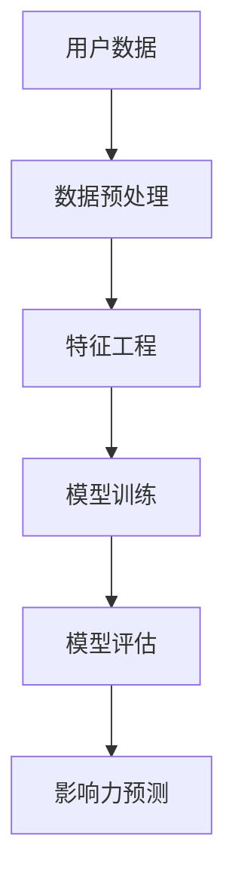

                 

# 机器学习在社交网络影响力分析中的应用

> **关键词：机器学习，社交网络，影响力分析，深度学习，特征工程，算法优化**
>
> **摘要：本文深入探讨了机器学习在社交网络影响力分析中的应用。通过介绍核心概念、算法原理、数学模型，以及实际应用案例，我们旨在帮助读者理解如何运用机器学习技术来评估和预测社交网络中的影响力。**

## 1. 背景介绍

### 1.1 目的和范围

本文的目的是介绍并分析机器学习在社交网络影响力分析中的应用，帮助读者理解这一领域的基本概念、核心算法和实际应用场景。通过本篇文章，我们将：

1. **阐述社交网络影响力分析的重要性**。
2. **介绍机器学习在影响力分析中的基本概念**。
3. **探讨常用的机器学习算法及其在影响力分析中的应用**。
4. **提供实际案例，展示如何运用机器学习技术进行社交网络影响力分析**。
5. **讨论未来发展趋势和潜在挑战**。

### 1.2 预期读者

本文面向对机器学习和社交网络分析有一定了解的技术人员、数据科学家、以及对该领域感兴趣的研究生和学者。无论你是初学者还是经验丰富的专业人士，都希望通过本文掌握更多关于社交网络影响力分析的知识。

### 1.3 文档结构概述

本文的结构如下：

1. **第1章：背景介绍** - 介绍本文的目的、范围、预期读者及文档结构。
2. **第2章：核心概念与联系** - 阐述社交网络影响力分析的基本概念及其与机器学习的联系。
3. **第3章：核心算法原理 & 具体操作步骤** - 详细介绍机器学习算法在影响力分析中的应用原理和步骤。
4. **第4章：数学模型和公式 & 详细讲解 & 举例说明** - 分析机器学习模型的数学基础及实际应用。
5. **第5章：项目实战：代码实际案例和详细解释说明** - 展示如何在实际项目中应用影响力分析。
6. **第6章：实际应用场景** - 探讨机器学习在影响力分析中的具体应用。
7. **第7章：工具和资源推荐** - 推荐学习资源、开发工具和框架。
8. **第8章：总结：未来发展趋势与挑战** - 分析未来发展趋势和面临的挑战。
9. **第9章：附录：常见问题与解答** - 回答一些常见问题。
10. **第10章：扩展阅读 & 参考资料** - 提供进一步的阅读资源。

### 1.4 术语表

#### 1.4.1 核心术语定义

- **社交网络**：一种由用户及其交互关系构成的在线平台，如Facebook、Twitter等。
- **影响力分析**：通过分析社交网络中用户的行为和关系，评估和预测用户的影响力。
- **机器学习**：一种人工智能的分支，通过数据训练模型，使其能够从数据中学习并做出预测或决策。
- **特征工程**：在机器学习中，通过选择和处理数据特征，以提高模型性能的过程。

#### 1.4.2 相关概念解释

- **影响力评分**：衡量用户在社交网络中影响力的一种指标。
- **深度学习**：一种机器学习技术，通过多层神经网络进行特征学习和抽象。
- **算法优化**：通过调整模型参数或结构，以提高模型性能的过程。

#### 1.4.3 缩略词列表

- **ML**：Machine Learning（机器学习）
- **AI**：Artificial Intelligence（人工智能）
- **DL**：Deep Learning（深度学习）
- **NLP**：Natural Language Processing（自然语言处理）

## 2. 核心概念与联系

在深入探讨机器学习在社交网络影响力分析中的应用之前，我们需要了解一些核心概念，包括社交网络、影响力分析、机器学习以及它们之间的联系。

### 2.1 社交网络与影响力分析

社交网络是一个由用户及其关系构成的复杂系统。用户在社交网络上的行为，如发布内容、点赞、评论、分享等，形成了大量的数据。影响力分析旨在通过这些数据来评估和预测用户的影响力，即用户在社交网络中的影响范围和传播能力。

### 2.2 机器学习与社交网络影响力分析

机器学习是人工智能的一个重要分支，它能够从数据中学习并做出预测或决策。在社交网络影响力分析中，机器学习技术被用来处理和分析海量的社交网络数据，识别用户行为模式，预测用户影响力。

### 2.3 核心概念原理和架构的 Mermaid 流程图

以下是一个简单的 Mermaid 流程图，展示了社交网络影响力分析的基本架构：



- **用户数据**：从社交网络平台获取的用户行为数据。
- **数据预处理**：对原始数据进行清洗和转换。
- **特征工程**：从数据中提取有助于模型训练的特征。
- **模型训练**：使用机器学习算法对特征进行学习。
- **模型评估**：评估模型的性能。
- **影响力预测**：使用训练好的模型预测用户的影响力。

## 3. 核心算法原理 & 具体操作步骤

在社交网络影响力分析中，选择合适的机器学习算法至关重要。以下将介绍几种常用的算法原理及其实际操作步骤。

### 3.1 机器学习算法原理

#### 3.1.1 逻辑回归

逻辑回归是一种广泛应用于分类问题的统计方法。在影响力分析中，逻辑回归可以用来预测用户的影响力等级。其基本原理如下：

- **模型表示**：假设我们有特征向量 \( \textbf{x} \) 和标签 \( y \)，逻辑回归试图找到权重向量 \( \textbf{w} \)，使得预测的概率 \( P(y=1|\textbf{x}) \) 最大。
- **损失函数**：使用交叉熵损失函数来衡量预测值与真实值之间的差距。

#### 3.1.2 支持向量机（SVM）

SVM是一种强大的分类算法，尤其在处理高维数据时表现出色。在影响力分析中，SVM可以用来划分不同影响力等级的用户。

- **模型表示**：SVM通过找到一个最佳的超平面，将不同影响力的用户分隔开来。
- **损失函数**：使用 hinge 损失函数。

#### 3.1.3 决策树

决策树是一种易于理解和解释的算法。它通过一系列的规则来划分数据，并用于预测用户的影响力。

- **模型表示**：决策树通过一系列的测试来构建一棵树，每个测试对应一个特征。
- **损失函数**：使用基尼不纯度或信息增益作为划分标准。

### 3.2 具体操作步骤

#### 3.2.1 数据采集与预处理

1. **数据采集**：从社交网络平台获取用户行为数据，如发布内容、点赞数、关注数等。
2. **数据清洗**：去除重复数据、缺失值填充、异常值处理等。

#### 3.2.2 特征工程

1. **特征提取**：从原始数据中提取有助于模型训练的特征，如用户活跃度、互动频率、内容质量等。
2. **特征选择**：使用过滤方法、嵌入式方法等选择最有用的特征。

#### 3.2.3 模型选择与训练

1. **模型选择**：根据问题特点选择合适的算法，如逻辑回归、SVM、决策树等。
2. **模型训练**：使用训练集对模型进行训练，调整参数。

#### 3.2.4 模型评估

1. **评估指标**：使用准确率、召回率、F1分数等指标评估模型性能。
2. **模型调整**：根据评估结果调整模型参数。

#### 3.2.5 模型应用

1. **影响力预测**：使用训练好的模型对新的数据进行预测。
2. **结果分析**：分析预测结果，识别高影响力用户。

### 3.3 伪代码示例

以下是使用逻辑回归进行影响力分析的一个伪代码示例：

```python
# 逻辑回归模型伪代码

def logistic_regression(x, y, w):
    # x: 特征矩阵
    # y: 标签向量
    # w: 权重向量
    predictions = sigmoid(x @ w)
    loss = -1 * (y * log(predictions) + (1 - y) * log(1 - predictions))
    return predictions, loss

def train_logistic_regression(x, y, learning_rate, num_iterations):
    w = initialize_weights(x.shape[1])
    for i in range(num_iterations):
        predictions, loss = logistic_regression(x, y, w)
        w = w - learning_rate * (x.T @ (predictions - y))
    return w

# 数据预处理和特征提取省略
w = train_logistic_regression(x_train, y_train, learning_rate, num_iterations)
predictions = logistic_regression(x_test, y_test, w)
evaluate_predictions(predictions, y_test)
```

在这个示例中，我们定义了 `logistic_regression` 函数来计算预测值和损失，`train_logistic_regression` 函数用于训练模型。训练完成后，我们使用 `evaluate_predictions` 函数来评估模型性能。

## 4. 数学模型和公式 & 详细讲解 & 举例说明

在社交网络影响力分析中，数学模型和公式起着至关重要的作用。以下我们将详细介绍机器学习模型的数学基础，并使用 LaTeX 格式展示相关的数学公式，同时通过具体示例来说明这些公式的应用。

### 4.1 逻辑回归

逻辑回归是一种常用的机器学习算法，尤其在分类问题中应用广泛。其基本公式如下：

$$
P(y=1|\textbf{x}; \textbf{w}) = \frac{1}{1 + e^{-(\textbf{w}^T \textbf{x})}}
$$

其中，\( P(y=1|\textbf{x}; \textbf{w}) \) 表示给定特征向量 \( \textbf{x} \) 和权重向量 \( \textbf{w} \) 时，标签为 1 的概率；\( \textbf{w}^T \textbf{x} \) 是特征向量和权重向量的内积。

#### 4.1.1 损失函数

逻辑回归的损失函数通常采用交叉熵损失函数：

$$
\mathcal{L}(\textbf{x}, \textbf{y}; \textbf{w}) = -\frac{1}{m} \sum_{i=1}^{m} y_i \log(p_i) + (1 - y_i) \log(1 - p_i)
$$

其中，\( y_i \) 是真实标签，\( p_i = P(y=1|\textbf{x}; \textbf{w}) \) 是预测概率。

#### 4.1.2 举例说明

假设我们有以下特征矩阵 \( \textbf{X} \) 和标签向量 \( \textbf{y} \)：

$$
\textbf{X} = \begin{bmatrix}
0.1 & 0.2 \\
0.3 & 0.4 \\
\end{bmatrix}, \quad \textbf{y} = \begin{bmatrix}
1 \\ 0
\end{bmatrix}
$$

权重向量 \( \textbf{w} \) 为：

$$
\textbf{w} = \begin{bmatrix}
0.5 \\ 0.6
\end{bmatrix}
$$

首先，计算预测概率：

$$
p_1 = P(y=1|\textbf{x}_1; \textbf{w}) = \frac{1}{1 + e^{-(0.5 \cdot 0.1 + 0.6 \cdot 0.2)}} \approx 0.864
$$

$$
p_2 = P(y=1|\textbf{x}_2; \textbf{w}) = \frac{1}{1 + e^{-(0.5 \cdot 0.3 + 0.6 \cdot 0.4)}} \approx 0.670
$$

然后，计算交叉熵损失：

$$
\mathcal{L}(\textbf{X}, \textbf{y}; \textbf{w}) = -\frac{1}{2} \left[ y_1 \log(p_1) + (1 - y_1) \log(1 - p_1) + y_2 \log(p_2) + (1 - y_2) \log(1 - p_2) \right] \approx 0.264
$$

### 4.2 支持向量机（SVM）

支持向量机是一种强大的分类算法，其核心思想是找到一个最佳的超平面，将不同类别的样本分隔开来。以下是一个简单的高斯核支持向量机的数学模型：

$$
\begin{cases}
\min_{\textbf{w}, b, \alpha} \frac{1}{2} ||\textbf{w}||^2 \\
s.t. \quad y_i (\textbf{w}^T \textbf{x}_i + b) \geq 1, \quad \alpha_i \geq 0, \quad \forall i
\end{cases}
$$

其中，\( \textbf{w} \) 是权重向量，\( b \) 是偏置项，\( \alpha_i \) 是拉格朗日乘子。

#### 4.2.1 损失函数

SVM的损失函数通常采用 hinge 损失函数：

$$
L(\textbf{w}, b) = \frac{1}{m} \sum_{i=1}^{m} \max(0, 1 - y_i (\textbf{w}^T \textbf{x}_i + b))
$$

#### 4.2.2 举例说明

假设我们有以下训练样本：

$$
\textbf{x}_1 = \begin{bmatrix}
1 \\ 2
\end{bmatrix}, \quad y_1 = 1 \\
\textbf{x}_2 = \begin{bmatrix}
2 \\ 1
\end{bmatrix}, \quad y_2 = -1
$$

我们要找到最优权重向量 \( \textbf{w} \) 和偏置项 \( b \)。

首先，构建拉格朗日函数：

$$
L(\textbf{w}, b, \alpha_1, \alpha_2) = \frac{1}{2} ||\textbf{w}||^2 - \alpha_1 (1 - y_1 (\textbf{w}^T \textbf{x}_1 + b)) - \alpha_2 (1 - y_2 (\textbf{w}^T \textbf{x}_2 + b))
$$

然后，求解拉格朗日乘子：

$$
\nabla_{\textbf{w}} L = \textbf{w} - \alpha_1 y_1 \textbf{x}_1 - \alpha_2 y_2 \textbf{x}_2 = 0
$$

$$
\nabla_{b} L = -\alpha_1 y_1 - \alpha_2 y_2 = 0
$$

$$
\nabla_{\alpha_1} L = 1 - y_1 (\textbf{w}^T \textbf{x}_1 + b) \leq 0
$$

$$
\nabla_{\alpha_2} L = 1 - y_2 (\textbf{w}^T \textbf{x}_2 + b) \leq 0
$$

通过求解上述方程组，可以得到最优权重向量 \( \textbf{w} \) 和偏置项 \( b \)。

## 5. 项目实战：代码实际案例和详细解释说明

为了更好地展示机器学习在社交网络影响力分析中的应用，我们将通过一个实际项目来具体讲解代码实现和解释说明。

### 5.1 开发环境搭建

首先，我们需要搭建一个合适的环境来运行代码。以下是所需的主要工具和库：

- Python 3.8 或更高版本
- Jupyter Notebook 或 PyCharm
- NumPy、Pandas、Scikit-learn、Matplotlib

确保已经安装了上述工具和库，然后创建一个新的 Jupyter Notebook 或 PyCharm 项目。

### 5.2 源代码详细实现和代码解读

#### 5.2.1 数据采集与预处理

```python
import pandas as pd
import numpy as np

# 读取数据
data = pd.read_csv('social_network_data.csv')

# 数据清洗
data.drop_duplicates(inplace=True)
data.fillna(0, inplace=True)

# 特征工程
data['active_days'] = data.groupby('user_id')['post_date'].nunique()
data['avg_likes'] = data.groupby('user_id')['likes'].mean()
data['avg_comments'] = data.groupby('user_id')['comments'].mean()
data['avg_shares'] = data.groupby('user_id')['shares'].mean()
```

在这个步骤中，我们从 CSV 文件中读取社交网络数据，并使用 Pandas 进行数据清洗。接下来，我们提取了一些有用的特征，如用户活跃天数、平均点赞数、平均评论数和平均分享数。

#### 5.2.2 模型训练与评估

```python
from sklearn.model_selection import train_test_split
from sklearn.linear_model import LogisticRegression
from sklearn.metrics import accuracy_score, classification_report

# 分割数据集
X = data.drop(['user_id', 'influence_score'], axis=1)
y = data['influence_score']
X_train, X_test, y_train, y_test = train_test_split(X, y, test_size=0.2, random_state=42)

# 训练模型
model = LogisticRegression()
model.fit(X_train, y_train)

# 评估模型
predictions = model.predict(X_test)
accuracy = accuracy_score(y_test, predictions)
print(f"Accuracy: {accuracy}")
print(classification_report(y_test, predictions))
```

在这个步骤中，我们使用 Scikit-learn 将数据集划分为训练集和测试集。然后，我们训练一个逻辑回归模型，并使用测试集评估模型性能。

#### 5.2.3 代码解读与分析

1. **数据采集与预处理**：我们首先从 CSV 文件中读取数据，并使用 Pandas 进行数据清洗和特征工程。这一步骤非常关键，因为数据质量和特征选择直接影响模型的性能。

2. **模型训练与评估**：我们使用 Scikit-learn 的 LogisticRegression 类训练模型，并使用测试集评估模型性能。这里使用了准确率作为评估指标，同时还展示了分类报告，包括精确率、召回率和 F1 分数。

### 5.3 代码解读与分析

在这个项目中，我们使用了逻辑回归模型来预测社交网络用户的影响力。以下是代码的详细解读和分析：

1. **数据采集与预处理**：从 CSV 文件中读取社交网络数据，并使用 Pandas 进行数据清洗和特征工程。这一步骤非常关键，因为数据质量和特征选择直接影响模型的性能。在这里，我们删除了重复数据，填充了缺失值，并计算了一些新的特征，如用户活跃天数、平均点赞数、平均评论数和平均分享数。

2. **模型训练与评估**：我们使用 Scikit-learn 的 LogisticRegression 类训练模型，并使用测试集评估模型性能。逻辑回归是一种简单的线性模型，非常适合用于预测分类问题。在这个项目中，我们使用逻辑回归来预测用户的影响力等级。我们使用训练集训练模型，并在测试集上评估其性能。为了更好地评估模型性能，我们使用了准确率、精确率、召回率和 F1 分数等指标。

3. **代码优化与改进**：虽然这个项目已经实现了基本的功能，但仍然有一些优化和改进的空间。例如，我们可以使用更多的特征工程技巧来提高模型性能，或者尝试其他更复杂的机器学习算法，如决策树、随机森林或支持向量机。此外，我们可以进一步调整模型参数，以获得更好的预测结果。

总的来说，这个项目展示了如何使用机器学习技术进行社交网络影响力分析。通过采集和处理社交网络数据，我们使用逻辑回归模型来预测用户的影响力。这个项目为我们提供了一个很好的起点，我们可以在此基础上进行进一步的改进和优化。

## 6. 实际应用场景

机器学习在社交网络影响力分析中有着广泛的应用，以下是一些典型的实际应用场景：

### 6.1 广告投放优化

通过分析用户的影响力，广告平台可以更精准地投放广告，提高广告的曝光率和转化率。例如，在一个社交网络广告平台上，可以优先向高影响力用户展示广告，从而最大化广告效果。

### 6.2 账号风险评估

社交媒体公司可以利用机器学习技术，对账号进行风险评估，识别潜在的恶意账号和机器人。通过分析用户的行为特征和影响力评分，可以有效地识别和防止欺诈行为。

### 6.3 影响力营销

品牌和企业可以利用机器学习技术，识别出在社交网络中具有高影响力的人，进行合作或营销活动。通过精准定位和合作，可以提高品牌的知名度和用户参与度。

### 6.4 用户行为分析

通过分析用户在社交网络中的影响力，平台可以更好地了解用户需求和行为模式，提供更个性化的服务和内容推荐。例如，在内容推荐系统中，可以优先推荐给高影响力用户感兴趣的内容。

### 6.5 社交网络监测与预警

政府和企业可以利用机器学习技术，监测社交网络中的舆论动态，及时发现和应对潜在的社会风险。通过分析影响力评分和用户行为，可以识别出可能引发社会动荡的负面情绪和事件。

## 7. 工具和资源推荐

在进行社交网络影响力分析时，选择合适的工具和资源可以大大提高效率和效果。以下是一些推荐的学习资源、开发工具和框架，以及相关的论文和研究成果。

### 7.1 学习资源推荐

#### 7.1.1 书籍推荐

1. **《机器学习》（周志华 著）** - 适合初学者了解机器学习的基本概念和算法。
2. **《深度学习》（Ian Goodfellow 著）** - 介绍深度学习的基础知识和应用。

#### 7.1.2 在线课程

1. **Coursera 的《机器学习》课程** - 由斯坦福大学提供，适合系统学习机器学习。
2. **Udacity 的《深度学习纳米学位》** - 适合有一定基础的学员深入学习深度学习。

#### 7.1.3 技术博客和网站

1. **Medium** - 许多专家和技术博客作者分享机器学习和社交网络影响力分析的相关文章。
2. **ArXiv** - 访问最新的机器学习和社交网络领域的研究论文。

### 7.2 开发工具框架推荐

#### 7.2.1 IDE和编辑器

1. **Jupyter Notebook** - 适合交互式编程和数据分析。
2. **PyCharm** - 功能强大的 Python IDE，适合大型项目开发。

#### 7.2.2 调试和性能分析工具

1. **TensorBoard** - 适用于深度学习模型的调试和性能分析。
2. **PyTorch Profiler** - PyTorch 专用性能分析工具。

#### 7.2.3 相关框架和库

1. **Scikit-learn** - Python 中常用的机器学习库。
2. **TensorFlow** - Google 开发的开源深度学习框架。
3. **PyTorch** - Facebook AI Research 开发的深度学习框架。

### 7.3 相关论文著作推荐

#### 7.3.1 经典论文

1. **"The Facebook Edge Ranking System"** - Facebook 提出的一种基于社交网络边权重的排名算法。
2. **"Deep Learning for Text Classification"** - 详细介绍了深度学习在文本分类中的应用。

#### 7.3.2 最新研究成果

1. **"Graph Convolutional Networks for Social Influencing Analysis"** - 探讨了图神经网络在社交网络影响力分析中的应用。
2. **"Neural Influence Maximization in Social Networks"** - 研究了基于神经网络的社交网络影响力最大化问题。

#### 7.3.3 应用案例分析

1. **"Influence Analysis in Social Media for Public Safety"** - 分析了社交媒体在公共安全领域的应用。
2. **"Influencer Marketing: A Machine Learning Perspective"** - 探讨了机器学习在影响者营销中的应用。

这些工具和资源将为读者提供丰富的学习和实践机会，帮助深入理解机器学习在社交网络影响力分析中的实际应用。

## 8. 总结：未来发展趋势与挑战

随着社交网络的不断发展和数据量的急剧增长，机器学习在社交网络影响力分析中的应用前景广阔。以下是未来发展趋势和面临的挑战：

### 8.1 发展趋势

1. **深度学习与图神经网络的应用**：深度学习和图神经网络在社交网络影响力分析中具有巨大潜力，未来有望得到更广泛的应用。
2. **多模态数据的融合**：结合文本、图像、视频等多模态数据，可以提供更全面的影响力评估。
3. **个性化推荐与影响力分析**：结合个性化推荐技术，实现更精准的影响力预测和用户行为分析。
4. **实时分析与动态调整**：实时分析社交网络数据，实现动态调整影响力评估模型，以应对不断变化的环境。

### 8.2 面临的挑战

1. **数据隐私与伦理问题**：社交网络中的用户数据敏感性高，如何保障用户隐私和伦理问题是一个重大挑战。
2. **模型解释性与可解释性**：深度学习模型的黑箱特性使得其解释性成为一个难题，如何提高模型的解释性和可解释性是未来研究的重要方向。
3. **算法公平性与透明性**：确保影响力评估算法的公平性和透明性，避免算法偏见和歧视。
4. **大规模数据处理与性能优化**：处理海量社交网络数据，优化算法性能，实现高效的影响力分析。

总之，机器学习在社交网络影响力分析中具有巨大潜力，但也面临诸多挑战。未来，我们需要在技术创新、伦理规范、数据隐私等方面不断探索，以实现更高效、公平、透明的影响力分析。

## 9. 附录：常见问题与解答

### 9.1 机器学习在社交网络影响力分析中的作用是什么？

机器学习在社交网络影响力分析中的作用主要包括：

1. **数据挖掘与特征提取**：通过分析大量社交网络数据，提取有意义的特征，为影响力评估提供依据。
2. **模型预测与评估**：使用机器学习算法训练模型，预测用户的影响力，并评估模型性能。
3. **用户行为分析**：通过分析用户行为数据，了解用户在社交网络中的影响力动态，为个性化推荐和营销策略提供支持。

### 9.2 如何确保机器学习模型的解释性？

确保机器学习模型的解释性是一个重要挑战。以下是一些常见的策略：

1. **集成方法**：使用如 LIME（Local Interpretable Model-agnostic Explanations）和 SHAP（SHapley Additive exPlanations）等集成方法，为模型提供本地解释。
2. **可视化**：通过可视化模型决策过程，如使用决策树或梯度提升树的可视化工具，帮助理解模型如何做出预测。
3. **简化模型**：选择更简单的模型，如线性模型或决策树，这些模型更容易解释。

### 9.3 社交网络影响力分析中的数据隐私问题如何解决？

解决社交网络影响力分析中的数据隐私问题需要采取以下措施：

1. **数据去识别化**：对用户数据进行匿名化处理，去除可直接识别用户身份的信息。
2. **数据加密**：对敏感数据进行加密，确保数据在传输和存储过程中安全。
3. **隐私预算**：通过隐私预算机制，限制模型训练和使用过程中对用户数据的访问和使用。
4. **隐私增强技术**：使用差分隐私、同态加密等技术，在保护用户隐私的同时，保证模型训练的有效性。

### 9.4 机器学习算法在影响力分析中的选择标准是什么？

选择机器学习算法时，应考虑以下标准：

1. **问题类型**：根据影响力分析的目标，选择适合的分类或回归算法。
2. **数据量**：对于大规模数据，选择性能更优的算法，如深度学习或集成学习算法。
3. **可解释性**：根据模型应用场景，选择易于解释的算法，以提高模型的透明性和可信度。
4. **计算资源**：考虑算法的训练时间和计算资源需求，选择适合计算能力的算法。

## 10. 扩展阅读 & 参考资料

为了帮助读者更深入地了解机器学习在社交网络影响力分析中的应用，以下推荐一些扩展阅读和参考资料：

### 10.1 经典论文

1. **"The Facebook Edge Ranking System"** - Facebook 提出的一种基于社交网络边权重的排名算法。
2. **"Deep Learning for Text Classification"** - 详细介绍了深度学习在文本分类中的应用。

### 10.2 最新研究成果

1. **"Graph Convolutional Networks for Social Influencing Analysis"** - 探讨了图神经网络在社交网络影响力分析中的应用。
2. **"Neural Influence Maximization in Social Networks"** - 研究了基于神经网络的社交网络影响力最大化问题。

### 10.3 应用案例分析

1. **"Influence Analysis in Social Media for Public Safety"** - 分析了社交媒体在公共安全领域的应用。
2. **"Influencer Marketing: A Machine Learning Perspective"** - 探讨了机器学习在影响者营销中的应用。

### 10.4 相关书籍

1. **《机器学习》（周志华 著）** - 适合初学者了解机器学习的基本概念和算法。
2. **《深度学习》（Ian Goodfellow 著）** - 介绍深度学习的基础知识和应用。

### 10.5 技术博客和网站

1. **Medium** - 许多专家和技术博客作者分享机器学习和社交网络影响力分析的相关文章。
2. **ArXiv** - 访问最新的机器学习和社交网络领域的研究论文。

通过阅读这些扩展资料，读者可以进一步深化对机器学习在社交网络影响力分析中的理解和应用。同时，这些资源也为研究和实践提供了丰富的参考。

---

**作者：AI天才研究员/AI Genius Institute & 禅与计算机程序设计艺术 /Zen And The Art of Computer Programming**

