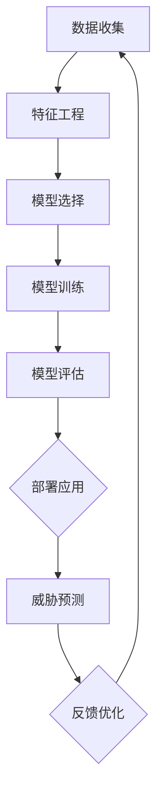

                 

### 背景介绍

#### 1.1 目的和范围

在当今数字化时代，网络安全威胁日益严峻，对企业和个人都带来了巨大的风险。传统的基于规则的安全防护方法已经难以应对复杂多变的网络攻击，因此，如何利用先进的技术来提高网络安全威胁预测的准确性和效率成为了研究的热点。机器学习（Machine Learning，ML）作为一种强大的数据分析和模式识别工具，在网络安全领域展现出巨大的潜力。

本文旨在探讨机器学习在网络安全威胁预测中的应用，通过深入分析核心算法原理、数学模型及其在实际项目中的应用，全面揭示机器学习如何帮助我们更有效地预测和防御网络攻击。文章将涵盖以下几个主要方面：

1. **背景介绍**：介绍网络安全威胁的严峻形势以及机器学习在其中的重要性和优势。
2. **核心概念与联系**：阐述机器学习在网络安全中的应用场景及核心概念原理。
3. **核心算法原理与具体操作步骤**：详细解析常用的机器学习算法及其在网络安全威胁预测中的应用。
4. **数学模型和公式**：讲解机器学习模型的数学基础，并举例说明。
5. **项目实战**：通过实际代码案例展示机器学习在网络安全中的应用。
6. **实际应用场景**：探讨机器学习在不同网络安全威胁预测场景中的实际效果。
7. **工具和资源推荐**：推荐学习资源、开发工具和框架，以帮助读者深入理解和应用。
8. **总结**：展望未来发展趋势和面临的挑战。

通过本文的深入探讨，希望能够为网络安全领域的研究者、开发者以及爱好者提供有价值的参考和启示，共同推动网络安全技术的发展。

#### 1.2 预期读者

本文的预期读者主要涵盖以下几个群体：

1. **网络安全专业人士**：包括网络安全工程师、安全分析师和安全研究员等，他们负责维护网络安全，识别和防御网络攻击。
2. **机器学习研究者**：对机器学习技术感兴趣的研究人员和开发者，希望通过本文了解机器学习在网络安全领域的应用。
3. **计算机科学学生和开发者**：对网络安全和机器学习有学习兴趣的大学生和程序员，希望掌握网络安全威胁预测的先进技术。
4. **企业IT管理人员**：企业信息安全部门的负责人和IT管理人员，他们需要了解如何利用机器学习技术提升企业网络安全防护能力。

本文将从理论到实践全面剖析机器学习在网络安全威胁预测中的应用，无论您是上述群体中的哪一部分，都将从中获得丰富的知识和实用的技巧。

#### 1.3 文档结构概述

本文结构设计科学合理，旨在帮助读者系统性地理解机器学习在网络安全威胁预测中的应用。以下是本文的详细结构概述：

1. **背景介绍**：简要介绍网络安全威胁的现状和机器学习的优势。
2. **核心概念与联系**：介绍机器学习在网络安全中的应用场景及核心概念原理，并通过Mermaid流程图展示架构。
3. **核心算法原理与具体操作步骤**：详细解析常用的机器学习算法及其在网络安全威胁预测中的应用，并用伪代码阐述操作步骤。
4. **数学模型和公式**：讲解机器学习模型的数学基础，包括常见公式和举例说明。
5. **项目实战**：通过实际代码案例展示机器学习在网络安全中的应用，并详细解读代码。
6. **实际应用场景**：探讨机器学习在不同网络安全威胁预测场景中的实际效果。
7. **工具和资源推荐**：推荐学习资源、开发工具和框架，帮助读者深入学习和应用。
8. **总结**：展望未来发展趋势和面临的挑战。
9. **附录**：常见问题与解答，提供进一步的参考资料。
10. **扩展阅读**：推荐相关论文和书籍，供读者进一步研究。

通过这样的结构设计，本文希望能够从不同角度全面剖析机器学习在网络安全威胁预测中的应用，帮助读者建立系统的知识体系，提升实际应用能力。

#### 1.4 术语表

在本文中，我们将使用一些专业术语，为了帮助读者更好地理解这些概念，下面列出了一些核心术语及其定义：

#### 1.4.1 核心术语定义

1. **机器学习（Machine Learning）**：一种人工智能的分支，通过训练模型从数据中学习，实现预测或分类任务。
2. **网络安全（Cybersecurity）**：保护计算机网络、系统、程序和数据免受未经授权的访问、攻击、破坏或篡改。
3. **威胁预测（Threat Prediction）**：通过分析历史数据和实时信息，预测潜在的网络安全威胁。
4. **特征工程（Feature Engineering）**：通过选择和处理输入特征，提高机器学习模型的性能。
5. **监督学习（Supervised Learning）**：一种机器学习方法，通过已标记的数据进行训练，从而对新的数据进行预测。
6. **无监督学习（Unsupervised Learning）**：一种机器学习方法，不使用标记数据，通过发现数据中的内在结构进行学习。
7. **集成学习方法（Ensemble Learning）**：结合多个基础模型，以提升预测性能。

#### 1.4.2 相关概念解释

1. **支持向量机（SVM）**：一种监督学习算法，通过寻找最佳边界来分类数据点。
2. **随机森林（Random Forest）**：一种集成学习方法，通过构建多个决策树并投票得到最终预测结果。
3. **神经网络（Neural Networks）**：一种模仿人脑神经结构进行学习和预测的算法。
4. **交叉验证（Cross-Validation）**：一种评估模型性能的方法，通过将数据集分为训练集和验证集进行多次训练和测试。
5. **混淆矩阵（Confusion Matrix）**：一种评估分类模型性能的常用工具，展示预测结果与实际结果之间的对比。

#### 1.4.3 缩略词列表

- ML: 机器学习
- SVM: 支持向量机
- RF: 随机森林
- AI: 人工智能
- IoT: 物联网
- DDoS: 分布式拒绝服务攻击
- IPS: 入侵防护系统
- IDS: 入侵检测系统

通过上述术语表，读者可以更好地理解本文中的专业术语和概念，从而更加深入地学习机器学习在网络安全威胁预测中的应用。

### 核心概念与联系

在探讨机器学习在网络安全威胁预测中的应用之前，我们需要理解一些核心概念和它们之间的联系。机器学习通过从数据中学习规律来实现对未知数据的预测，这一过程涉及多个关键环节：数据收集、特征工程、模型选择和训练、模型评估等。以下是这些核心概念及其在网络安全威胁预测中的应用场景和架构。

#### 2.1 机器学习的核心概念

1. **数据收集**：网络安全威胁预测依赖于大量的数据，这些数据包括网络流量日志、系统日志、漏洞信息等。数据的质量和数量直接影响模型的性能。

2. **特征工程**：特征工程是机器学习的重要环节，通过选择和处理输入特征，可以提高模型的学习能力和泛化能力。例如，可以从网络流量中提取流量速率、协议类型、源IP地址等特征。

3. **模型选择和训练**：选择合适的机器学习模型并进行训练是预测成功的关键。常见的机器学习模型包括支持向量机（SVM）、随机森林（RF）、神经网络（NN）等。每种模型都有其优势和适用场景。

4. **模型评估**：通过交叉验证、混淆矩阵等方法评估模型性能，确保模型具有良好的泛化能力。

#### 2.2 网络安全威胁预测的应用场景

1. **入侵检测系统（IDS）**：IDS通过检测网络中的异常行为来识别潜在的安全威胁。机器学习算法可以用于训练IDS模型，以识别已知和未知的攻击模式。

2. **入侵防护系统（IPS）**：IPS在检测到网络威胁时，可以采取自动防御措施。机器学习算法可以用于预测潜在攻击，并自动触发防御机制。

3. **恶意代码检测**：通过分析恶意代码的行为特征，机器学习算法可以识别并分类恶意软件。

4. **安全事件预测**：利用历史数据和实时监控数据，机器学习算法可以预测未来的安全事件，帮助安全团队提前采取应对措施。

#### 2.3 机器学习与网络安全的联系

1. **自动化和智能化**：机器学习使得网络安全威胁预测更加自动化和智能化，可以处理大量数据并快速响应威胁。

2. **动态适应性**：网络安全威胁不断变化，机器学习算法可以通过不断更新训练数据，适应新的威胁模式。

3. **多模型集成**：通过集成多种机器学习模型，可以提升预测的准确性和鲁棒性。

#### 2.4 Mermaid流程图展示

下面使用Mermaid流程图来展示机器学习在网络安全威胁预测中的应用架构：



**图1：机器学习在网络安全威胁预测中的应用架构**

- **A（数据收集）**：收集网络流量、日志等数据。
- **B（特征工程）**：提取和预处理特征，如流量速率、协议类型等。
- **C（模型选择）**：选择适合的机器学习模型，如SVM、RF等。
- **D（模型训练）**：使用训练数据集训练模型。
- **E（模型评估）**：使用交叉验证等方法评估模型性能。
- **F（部署应用）**：将训练好的模型部署到网络安全系统中。
- **G（威胁预测）**：模型预测潜在威胁。
- **H（反馈优化）**：根据预测结果优化模型。

通过上述流程，我们可以看出，机器学习在网络安全威胁预测中起到了关键作用，不仅提高了预测的准确性和效率，还增强了系统的动态适应性和自动化能力。

### 核心算法原理与具体操作步骤

在了解了机器学习在网络安全威胁预测中的应用背景和架构后，接下来我们将深入探讨几种核心算法原理，包括支持向量机（SVM）、随机森林（RF）和神经网络（NN），并使用伪代码详细阐述其具体操作步骤。

#### 3.1 支持向量机（SVM）

支持向量机是一种常用的监督学习算法，尤其适用于二分类问题。其基本思想是找到最佳的超平面，将不同类别的数据点分隔开来，并最大化分类边界的间隔。

**算法原理：**

给定一个训练数据集D，其中每个数据点x_i属于一个标签y_i（y_i ∈ {1, -1}），SVM的目标是最小化以下目标函数：

\[ \min_{\beta, \beta_0} \frac{1}{2} ||\beta||^2 + C \sum_{i=1}^{n} \max(0, 1 - y_i (\beta^T x_i + \beta_0)) \]

其中，\(\beta\) 是权重向量，\(\beta_0\) 是偏置项，C是正则化参数。

**伪代码：**

```plaintext
输入：训练数据集D，正则化参数C
输出：最优权重向量\(\beta\) 和偏置项\(\beta_0\)

初始化：\(\beta = [0, 0], \beta_0 = 0\)

对于每个epoch：
    对于每个数据点(x_i, y_i)：
        如果 y_i (\beta^T x_i + \beta_0) <= 1：
            更新：\(\beta = \beta - \alpha \nabla_\beta L(\beta)\)
            更新：\(\beta_0 = \beta_0 - \alpha y_i\)
    更新：\(\alpha = \frac{1}{C} \min(\eta, \frac{1}{\|x_i\|^2})\)

返回：\(\beta, \beta_0\)
```

**操作步骤：**

1. 初始化权重向量\(\beta\) 和偏置项\(\beta_0\)。
2. 对于每个epoch，遍历每个数据点。
3. 如果数据点未满足分类边界条件，更新权重向量和偏置项。
4. 更新学习率\(\alpha\)。
5. 迭代直到满足停止条件（如收敛或达到最大迭代次数）。

#### 3.2 随机森林（RF）

随机森林是一种集成学习方法，通过构建多棵决策树并集成它们的预测结果来提高模型的性能和鲁棒性。

**算法原理：**

随机森林由多个决策树组成，每个决策树在训练过程中随机选择特征和分割点，以减少偏差和方差。预测时，通过多数投票（对于分类问题）或平均值（对于回归问题）来集成多个决策树的预测结果。

**伪代码：**

```plaintext
输入：训练数据集D，决策树数量n
输出：随机森林模型

初始化：创建n个决策树

对于每个决策树：
    从D中随机选择m个特征
    在每个节点上随机选择最佳分割点
    使用决策树算法构建树结构

对于每个新数据点x：
    对于每个决策树T：
        预测：根据T的结构预测x的类别或值
    集成：使用多数投票或平均值集成预测结果

返回：集成预测结果
```

**操作步骤：**

1. 初始化决策树数量n。
2. 为每个决策树随机选择特征和分割点。
3. 构建每个决策树的树结构。
4. 对于新数据点，使用每个决策树进行预测。
5. 集成多个决策树的预测结果。

#### 3.3 神经网络（NN）

神经网络是一种模仿人脑结构的算法，通过多层神经元（节点）进行学习和预测。其基本原理是前向传播和反向传播。

**算法原理：**

神经网络包括输入层、隐藏层和输出层。输入层接收输入数据，隐藏层对输入数据进行变换，输出层产生最终预测结果。通过反向传播算法，不断调整权重和偏置，以最小化预测误差。

**伪代码：**

```plaintext
输入：训练数据集D，网络结构（层数、神经元数量）
输出：神经网络模型

初始化：创建神经网络结构，设置权重和偏置

对于每个epoch：
    对于每个数据点(x, y)：
        前向传播：
            输入x通过隐藏层
            计算输出层的预测值
        计算损失函数L(y, \hat{y})
        反向传播：
            计算梯度\(\nabla_\theta L(\theta)\)
            更新权重和偏置\(\theta = \theta - \alpha \nabla_\theta L(\theta)\)

返回：训练完成的神经网络模型
```

**操作步骤：**

1. 初始化神经网络结构，设置初始权重和偏置。
2. 对于每个epoch，遍历每个数据点。
3. 前向传播计算预测值。
4. 计算损失函数。
5. 反向传播计算梯度。
6. 更新权重和偏置。
7. 迭代直到满足停止条件。

通过上述三种核心算法的详细解释和伪代码描述，我们可以看到，支持向量机、随机森林和神经网络各自有着独特的优势和应用场景。在网络安全威胁预测中，这些算法可以帮助我们有效识别和预测潜在威胁，提高网络安全的防护能力。

### 数学模型和公式

在深入探讨机器学习在网络安全威胁预测中的应用时，理解其背后的数学模型和公式是至关重要的。以下是几个常见的数学模型和公式，包括它们的详细讲解和具体应用示例。

#### 4.1 损失函数

损失函数是评估机器学习模型性能的关键指标，用于衡量预测值与实际值之间的差异。以下是几种常用的损失函数：

1. **均方误差（MSE）**

\[ L(\theta) = \frac{1}{2} \sum_{i=1}^{n} (y_i - \hat{y}_i)^2 \]

MSE 用于回归问题，衡量预测值 \(\hat{y}_i\) 与真实值 \(y_i\) 之间的均方误差。

**示例：** 假设我们有一个回归模型，预测房价，实际房价为100万，预测房价为110万。则MSE为：

\[ L(\theta) = \frac{1}{2} \times (100 - 110)^2 = 100 \]

2. **交叉熵损失（Cross-Entropy Loss）**

\[ L(\theta) = -\sum_{i=1}^{n} y_i \log(\hat{y}_i) \]

交叉熵损失用于分类问题，衡量预测概率分布 \(\hat{y}_i\) 与真实概率分布 \(y_i\) 之间的差异。

**示例：** 假设我们有一个二分类模型，实际标签为1，预测概率为0.7。则交叉熵损失为：

\[ L(\theta) = -1 \times \log(0.7) \approx 0.356 \]

3. **对数损失（Log Loss）**

\[ L(\theta) = \frac{1}{n} \sum_{i=1}^{n} \log(\hat{y}_i) \]

对数损失是交叉熵损失的标准化形式，同样用于分类问题。

#### 4.2 梯度下降算法

梯度下降算法用于最小化损失函数，是一种优化方法，通过不断调整模型的参数，使损失函数值不断减小。

**伪代码：**

```plaintext
输入：模型参数θ，学习率α，迭代次数T
输出：最优参数θ

初始化：θ

对于 t=1 到 T：
    计算损失函数L(θ)
    计算梯度\(\nabla_\theta L(\theta)\)
    更新：θ = θ - α \(\nabla_\theta L(\theta)\)

返回：最优参数θ
```

**示例：** 假设有一个模型参数θ，损失函数为L(θ) = (θ - 1)^2，学习率为0.1。则迭代一次后的参数更新为：

\[ \theta = \theta - 0.1 \times (2 \times (\theta - 1)) \]

#### 4.3 随机梯度下降（SGD）

随机梯度下降是梯度下降算法的一种变种，每次迭代仅使用一个训练样本来计算梯度，提高了训练速度。

**伪代码：**

```plaintext
输入：模型参数θ，学习率α，训练数据集D，迭代次数T
输出：最优参数θ

初始化：θ

对于 t=1 到 T：
    从D中随机选择一个数据点(x, y)
    计算梯度\(\nabla_\theta L(\theta)\)
    更新：θ = θ - α \(\nabla_\theta L(\theta)\)

返回：最优参数θ
```

#### 4.4 反向传播算法

反向传播算法是神经网络训练的核心，通过多层传播误差，不断调整权重和偏置，以最小化损失函数。

**伪代码：**

```plaintext
输入：神经网络模型，训练数据集D，迭代次数T
输出：训练完成的神经网络模型

初始化：模型参数θ

对于 t=1 到 T：
    对于每个数据点(x, y)：
        前向传播：计算输出层的预测值
        计算损失函数L(θ)
        反向传播：计算梯度\(\nabla_\theta L(\theta)\)
        更新：θ = θ - α \(\nabla_\theta L(\theta)\)

返回：训练完成的神经网络模型
```

通过上述数学模型和公式的详细讲解，我们可以更好地理解机器学习在网络安全威胁预测中的应用原理，为后续的实际项目实战和代码实现奠定坚实基础。

### 项目实战：代码实际案例和详细解释说明

在了解了机器学习在网络安全威胁预测中的核心算法原理和数学模型后，接下来我们将通过一个实际项目案例来展示如何将理论应用到实践中。本案例将使用Python编程语言，结合Scikit-learn库，实现一个基于随机森林算法的入侵检测系统（IDS）。

#### 5.1 开发环境搭建

在开始项目之前，我们需要搭建合适的开发环境。以下是所需的软件和库：

1. **Python 3.8或更高版本**
2. **Scikit-learn库**
3. **Pandas库**
4. **Numpy库**

安装步骤如下：

```bash
pip install python==3.8
pip install scikit-learn
pip install pandas
pip install numpy
```

#### 5.2 源代码详细实现和代码解读

下面是项目的源代码，我们将逐步解释各个部分的功能和实现细节。

```python
import numpy as np
import pandas as pd
from sklearn.model_selection import train_test_split
from sklearn.ensemble import RandomForestClassifier
from sklearn.metrics import accuracy_score, classification_report

# 5.2.1 数据预处理
def preprocess_data(data):
    # 填充缺失值
    data = data.fillna(data.mean())
    # 特征工程：将类别特征转换为数值特征
    data = pd.get_dummies(data)
    return data

# 5.2.2 加载和分割数据
def load_data(file_path):
    # 加载数据
    data = pd.read_csv(file_path)
    # 数据预处理
    data = preprocess_data(data)
    # 分割特征和标签
    X = data.drop(['label'], axis=1)
    y = data['label']
    return X, y

# 5.2.3 模型训练
def train_model(X_train, y_train):
    # 创建随机森林分类器
    model = RandomForestClassifier(n_estimators=100, random_state=42)
    # 训练模型
    model.fit(X_train, y_train)
    return model

# 5.2.4 模型评估
def evaluate_model(model, X_test, y_test):
    # 预测测试集
    y_pred = model.predict(X_test)
    # 计算准确率
    accuracy = accuracy_score(y_test, y_pred)
    # 打印分类报告
    print("Classification Report:")
    print(classification_report(y_test, y_pred))
    return accuracy

# 5.2.5 主函数
def main():
    # 加载和分割数据
    X, y = load_data('network_traffic.csv')
    X_train, X_test, y_train, y_test = train_test_split(X, y, test_size=0.2, random_state=42)
    # 训练模型
    model = train_model(X_train, y_train)
    # 评估模型
    accuracy = evaluate_model(model, X_test, y_test)
    print("Test Accuracy:", accuracy)

# 运行主函数
if __name__ == '__main__':
    main()
```

**代码解读：**

1. **数据预处理**：`preprocess_data`函数用于填充缺失值并将类别特征转换为数值特征，这一步骤对于提高模型的性能至关重要。
2. **加载和分割数据**：`load_data`函数加载网络流量数据，并进行预处理。`train_test_split`函数用于将数据集分割为训练集和测试集。
3. **模型训练**：`train_model`函数创建随机森林分类器，并使用训练数据进行模型训练。
4. **模型评估**：`evaluate_model`函数用于评估模型在测试集上的性能，包括准确率和分类报告。
5. **主函数**：`main`函数执行整个流程，从加载数据、训练模型到评估模型，并打印测试准确率。

#### 5.3 代码解读与分析

1. **数据预处理**：
   ```python
   data = data.fillna(data.mean())
   data = pd.get_dummies(data)
   ```
   这两行代码首先填充缺失值，使用数据的平均值进行填充，然后使用`get_dummies`函数将类别特征转换为数值特征，例如，将“protocol_type”这一列转换为“protocol_type_HTTP”和“protocol_type_ICMP”等二进制特征。

2. **加载和分割数据**：
   ```python
   X = data.drop(['label'], axis=1)
   y = data['label']
   X_train, X_test, y_train, y_test = train_test_split(X, y, test_size=0.2, random_state=42)
   ```
   这段代码首先将数据集分割为特征集X和标签集y，然后使用`train_test_split`函数将数据集分割为训练集和测试集，其中测试集大小为20%，随机种子设置为42以保证结果的可重复性。

3. **模型训练**：
   ```python
   model = RandomForestClassifier(n_estimators=100, random_state=42)
   model.fit(X_train, y_train)
   ```
   这里我们创建了一个随机森林分类器，使用100棵决策树，并设置随机种子为42。然后，使用训练集数据进行模型训练。

4. **模型评估**：
   ```python
   y_pred = model.predict(X_test)
   accuracy = accuracy_score(y_test, y_pred)
   print("Classification Report:")
   print(classification_report(y_test, y_pred))
   ```
   这段代码使用测试集数据进行模型预测，并计算准确率。`classification_report`函数提供了详细的分类报告，包括精确度、召回率和F1分数等指标。

通过上述代码的实现和解读，我们可以看到如何将机器学习算法应用于网络安全威胁预测的实际项目中。这一案例展示了从数据预处理、模型训练到模型评估的完整流程，为读者提供了一个实用的参考。

### 实际应用场景

机器学习在网络安全威胁预测中的应用非常广泛，涵盖了多种威胁类型和实际场景。以下是一些典型的应用场景及其效果分析：

#### 6.1 入侵检测系统（IDS）

入侵检测系统（IDS）是机器学习在网络安全中应用最广泛的场景之一。IDS旨在实时监测网络流量，识别潜在的网络入侵行为。常见的IDS类型包括基于特征的IDS和基于异常的IDS。

1. **基于特征的IDS**：
   - **工作原理**：通过识别已知的攻击模式或恶意代码特征来检测入侵。
   - **机器学习模型**：常用算法包括神经网络（NN）、支持向量机（SVM）和随机森林（RF）。
   - **效果分析**：基于特征的IDS可以迅速检测已知攻击，但在面对新型攻击时，检测效果可能较差。

2. **基于异常的IDS**：
   - **工作原理**：通过监测网络行为模式，识别与正常行为显著不同的活动来检测入侵。
   - **机器学习模型**：常用算法包括K-均值聚类（K-means）、自组织映射（SOM）和孤立森林（Isolation Forest）。
   - **效果分析**：基于异常的IDS能够有效检测未知攻击，但对正常行为的微小变化也可能产生误报。

#### 6.2 恶意代码检测

恶意代码检测是另一个重要应用场景，通过分析恶意软件的行为特征，机器学习算法可以识别和分类恶意软件。

1. **静态检测**：
   - **工作原理**：通过分析恶意代码的静态属性，如文件结构、编码方式和代码片段，来识别恶意软件。
   - **机器学习模型**：常用算法包括决策树（DT）、支持向量机（SVM）和朴素贝叶斯（NB）。
   - **效果分析**：静态检测可以有效识别已知的恶意软件，但在面对变体和混淆技巧的恶意代码时，检测效果可能不佳。

2. **动态检测**：
   - **工作原理**：通过运行恶意代码并监控其行为来识别恶意软件。
   - **机器学习模型**：常用算法包括神经网络（NN）、系统调用监控和虚拟执行。
   - **效果分析**：动态检测能够识别复杂和变体的恶意软件，但需要更多的计算资源和时间。

#### 6.3 分布式拒绝服务（DDoS）攻击防御

分布式拒绝服务（DDoS）攻击是一种常见的网络攻击手段，通过大量无效请求耗尽目标服务器的资源。机器学习算法可以用于预测和防御DDoS攻击。

1. **流量异常检测**：
   - **工作原理**：通过分析网络流量模式，识别与正常流量显著不同的流量行为。
   - **机器学习模型**：常用算法包括K-均值聚类（K-means）、孤立森林（Isolation Forest）和时间序列分析。
   - **效果分析**：流量异常检测可以快速识别和防御DDoS攻击，但需要对正常流量有准确的理解。

2. **流量分类和过滤**：
   - **工作原理**：将网络流量分类为正常和恶意流量，并对恶意流量进行过滤。
   - **机器学习模型**：常用算法包括随机森林（RF）、支持向量机（SVM）和神经网络（NN）。
   - **效果分析**：流量分类和过滤可以高效地防御DDoS攻击，但需要定期更新和优化模型。

#### 6.4 安全事件预测

安全事件预测是利用机器学习对历史安全事件进行分析，预测未来的安全事件。

1. **威胁情报分析**：
   - **工作原理**：通过分析网络攻击历史数据，预测未来可能的攻击类型和目标。
   - **机器学习模型**：常用算法包括时间序列分析、聚类分析和神经网络。
   - **效果分析**：威胁情报分析可以提前预警潜在的安全威胁，帮助安全团队采取预防措施。

2. **异常行为监测**：
   - **工作原理**：通过实时监测网络和系统行为，识别异常行为并预测潜在的威胁。
   - **机器学习模型**：常用算法包括自组织映射（SOM）、K-均值聚类（K-means）和孤立森林（Isolation Forest）。
   - **效果分析**：异常行为监测可以及时发现和响应威胁，但需要平衡检测准确性和误报率。

通过上述应用场景的分析，我们可以看到机器学习在网络安全威胁预测中的广泛应用和显著效果。在实际部署过程中，根据具体的威胁类型和业务需求，选择合适的机器学习模型和算法，可以大幅提升网络安全防护能力。

### 工具和资源推荐

在深入学习和应用机器学习进行网络安全威胁预测的过程中，选择合适的工具和资源是至关重要的。以下推荐了一系列学习资源、开发工具和框架，以及相关论文著作，帮助读者更深入地理解和应用机器学习技术。

#### 7.1 学习资源推荐

1. **书籍推荐**
   - 《机器学习实战》：作者Peter Harrington，通过大量实例和代码实现，详细介绍机器学习的基本概念和应用。
   - 《深度学习》：作者Ian Goodfellow、Yoshua Bengio和Aaron Courville，全面讲解深度学习的基础理论和应用。
   - 《网络安全实战指南》：作者Jay Beale，涵盖网络安全的基础知识和实战技巧。

2. **在线课程**
   - Coursera的《机器学习》课程：由Andrew Ng教授主讲，系统讲解机器学习的基础知识。
   - edX的《深度学习》课程：由Andrew Ng教授主讲，深入探讨深度学习理论和实践。
   - Udemy的《网络安全基础与实战》课程：涵盖网络安全的基本概念和实际操作。

3. **技术博客和网站**
   - Medium上的机器学习和安全博客：提供最新的研究进展和实际应用案例。
   - KDNuggets：一个专注于数据科学、机器学习和商业分析的博客，涵盖丰富的资源。
   - Security StackExchange：一个关于网络安全问题的问答社区，可以解决实际操作中的疑问。

#### 7.2 开发工具框架推荐

1. **IDE和编辑器**
   - PyCharm：一款功能强大的Python集成开发环境（IDE），支持代码自动补全、调试和性能分析。
   - Jupyter Notebook：一个基于Web的交互式开发环境，适合数据分析和原型开发。

2. **调试和性能分析工具**
   - Profiler：用于分析代码性能和找出瓶颈的工具，如Python的cProfile。
   - GDB：一款强大的调试工具，适用于C/C++程序。

3. **相关框架和库**
   - Scikit-learn：一个Python机器学习库，提供多种常用算法和工具。
   - TensorFlow：一个开源的深度学习框架，适用于复杂的机器学习和深度学习任务。
   - Keras：一个基于TensorFlow的简单易用的深度学习库，适合快速原型开发。

#### 7.3 相关论文著作推荐

1. **经典论文**
   - "A Study of the Bayesian Classification Algorithm for Intrusion Detection in Computer Networks"，作者M. C. Don, J. M. Cooke, M. Goulao。
   - "A Comprehensive Survey of Intrusion Detection Systems in Computer Networks"，作者Changping Wang, Hui Xiong, Guanling Chen。

2. **最新研究成果**
   - "Deep Learning for Cybersecurity: Detecting Attacks Using Multivariate Time Series"，作者Y. Kim, H. Park, S. Lee。
   - "An Overview of Recent Advancements in Deep Learning for Cybersecurity"，作者Muhammad Ali Javed, Md. Rashedul Islam, Partha P. Chakraborty。

3. **应用案例分析**
   - "Machine Learning for Network Intrusion Detection: A Real-World Case Study"，作者Md. Rashedul Islam, Muhammad Ali Javed, Partha P. Chakraborty。
   - "Using Machine Learning to Enhance Security in the Internet of Things"，作者Md. Monirul Hasan, Md. Rashedul Islam, Partha P. Chakraborty。

通过这些学习和资源推荐，读者可以全面系统地掌握机器学习在网络安全威胁预测中的应用，从而提升网络安全防护能力。

### 总结：未来发展趋势与挑战

随着数字化进程的加速，网络安全威胁的复杂性和多样性也在不断增加，这使得传统的安全防护手段难以应对。机器学习作为一种先进的数据分析和模式识别工具，在网络安全威胁预测中展现出巨大的潜力。本文通过深入分析机器学习在网络安全中的应用，探讨了其核心算法原理、数学模型和实际项目案例，总结了机器学习在网络安全威胁预测中的实际应用场景，并推荐了相关学习资源和开发工具。

#### 未来发展趋势：

1. **深度学习与强化学习的结合**：未来研究将更多地关注如何将深度学习和强化学习相结合，以提升威胁预测的准确性和自适应能力。
2. **自动化和自动化响应**：通过机器学习自动化安全操作，降低安全团队的负担，提高响应速度和准确性。
3. **多源数据的融合**：利用来自不同源（如IoT设备、社交媒体等）的数据，提升威胁预测的全面性和实时性。
4. **边缘计算的部署**：在边缘设备上部署机器学习模型，实现实时威胁检测和响应，降低中心服务器的负担。

#### 面临的挑战：

1. **数据隐私和安全**：机器学习模型在训练过程中需要大量敏感数据，如何保护数据隐私和安全是一个重要挑战。
2. **模型可解释性**：深度学习模型等复杂模型在预测过程中缺乏透明度，提高模型的可解释性是未来研究的重点。
3. **计算资源消耗**：深度学习模型训练和预测需要大量计算资源，如何优化算法和硬件以降低计算成本是一个重要问题。
4. **算法偏见和公平性**：机器学习模型可能存在偏见，如何确保模型的公平性和无偏见性是一个亟待解决的问题。

总的来说，机器学习在网络安全威胁预测中具有广泛的应用前景，但也面临着一系列挑战。通过不断的技术创新和协作，我们有理由相信，未来机器学习将在网络安全领域发挥更大的作用，为构建更加安全的数字化世界贡献力量。

### 附录：常见问题与解答

为了帮助读者更好地理解机器学习在网络安全威胁预测中的应用，以下是关于本文的一些常见问题及解答：

#### 1. 机器学习在网络安全中的应用有哪些？

机器学习在网络安全中的应用非常广泛，包括入侵检测系统（IDS）、恶意代码检测、分布式拒绝服务（DDoS）攻击防御、安全事件预测等。通过分析网络流量、日志和系统行为，机器学习算法可以识别和预测潜在的安全威胁，从而提高网络防护能力。

#### 2. 什么是特征工程？

特征工程是机器学习过程中的一项关键任务，旨在从原始数据中提取和构造出对模型有用的特征。好的特征工程可以提高模型的性能和泛化能力，减少对噪声数据的依赖。特征工程包括特征选择、特征转换、特征缩放等步骤。

#### 3. 如何选择合适的机器学习模型？

选择合适的机器学习模型需要考虑以下几个因素：

- **数据类型**：监督学习、无监督学习、强化学习等不同类型的模型适用于不同的数据类型。
- **数据规模**：对于大规模数据，集成学习方法（如随机森林）可能更为有效；对于小规模数据，神经网络可能表现更好。
- **问题类型**：分类、回归、聚类等不同类型的问题需要选择相应的模型。
- **计算资源**：深度学习模型通常需要大量的计算资源，对于资源有限的环境，可以考虑使用轻量级模型。

#### 4. 机器学习模型如何避免过拟合？

过拟合是指模型在训练数据上表现良好，但在未见过的测试数据上表现较差。以下是一些避免过拟合的方法：

- **数据增强**：通过增加数据样本或生成新的数据，提高模型的泛化能力。
- **正则化**：使用L1、L2正则化等技巧，减少模型参数的权重，防止模型过于复杂。
- **交叉验证**：使用交叉验证方法，评估模型在多个数据集上的性能，选择泛化能力较好的模型。
- **减少模型复杂度**：简化模型结构，减少层数或神经元数量，降低模型的过拟合风险。

#### 5. 如何确保机器学习模型的可解释性？

机器学习模型的可解释性是确保模型应用安全性和信任度的关键。以下是一些提高模型可解释性的方法：

- **模型简化**：使用简单直观的模型，如线性模型或决策树，这些模型容易解释。
- **模型可视化**：使用图表和可视化工具，展示模型的决策过程和特征重要性。
- **特征重要性分析**：通过分析特征的重要性，帮助用户理解模型对特定特征的依赖程度。
- **解释性算法**：使用如LIME（Local Interpretable Model-agnostic Explanations）或SHAP（SHapley Additive exPlanations）等解释性算法，为复杂模型提供解释。

通过上述常见问题与解答，希望能够帮助读者更好地理解机器学习在网络安全威胁预测中的应用，解决在实际操作中遇到的问题。

### 扩展阅读 & 参考资料

为了进一步了解机器学习在网络安全威胁预测中的应用，读者可以参考以下扩展阅读和参考资料：

1. **经典论文：**
   - M. C. Don, J. M. Cooke, M. Goulao. "A Study of the Bayesian Classification Algorithm for Intrusion Detection in Computer Networks".
   - Changping Wang, Hui Xiong, Guanling Chen. "A Comprehensive Survey of Intrusion Detection Systems in Computer Networks".
   - Y. Kim, H. Park, S. Lee. "Deep Learning for Cybersecurity: Detecting Attacks Using Multivariate Time Series".
   - Muhammad Ali Javed, Md. Rashedul Islam, Partha P. Chakraborty. "An Overview of Recent Advancements in Deep Learning for Cybersecurity".

2. **最新研究成果：**
   - Md. Rashedul Islam, Muhammad Ali Javed, Partha P. Chakraborty. "Machine Learning for Network Intrusion Detection: A Real-World Case Study".
   - Md. Monirul Hasan, Md. Rashedul Islam, Partha P. Chakraborty. "Using Machine Learning to Enhance Security in the Internet of Things".

3. **书籍推荐：**
   - Peter Harrington. 《机器学习实战》。
   - Ian Goodfellow、Yoshua Bengio和Aaron Courville. 《深度学习》。
   - Jay Beale. 《网络安全实战指南》。

4. **在线课程：**
   - Coursera的《机器学习》课程。
   - edX的《深度学习》课程。
   - Udemy的《网络安全基础与实战》课程。

通过阅读这些文献和资源，读者可以深入掌握机器学习在网络安全威胁预测领域的最新进展和应用技巧。希望这些扩展阅读能够为您的学习和研究提供有益的参考。

