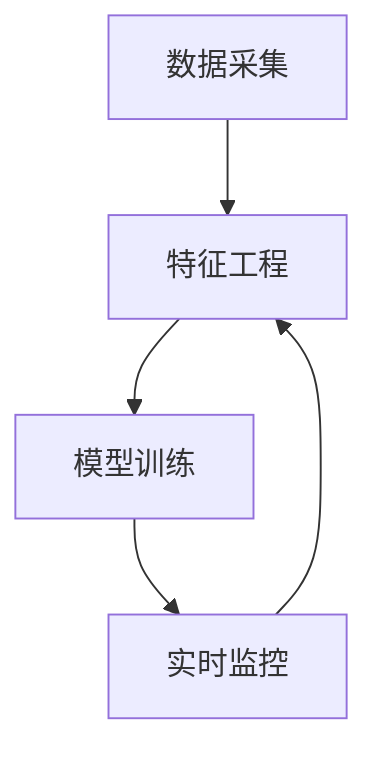

                 

# 机器学习在金融欺诈实时检测中的新技术

> 关键词：金融欺诈检测、机器学习、实时监控、深度学习、异常检测、数据分析

> 摘要：本文将深入探讨机器学习在金融欺诈实时检测中的应用。我们将从背景介绍、核心概念与联系、算法原理、数学模型、项目实战和实际应用场景等多个角度，详细讲解如何利用机器学习技术构建高效的金融欺诈检测系统。文章旨在为从业者提供实用的技术指导，并探讨未来发展趋势与挑战。

## 1. 背景介绍

### 1.1 目的和范围

金融行业是欺诈行为的高发领域，欺诈行为的快速检测和防范对金融机构的运营安全和客户的财产安全具有重要意义。随着大数据和人工智能技术的发展，机器学习成为金融欺诈检测的重要工具。本文旨在探讨机器学习在金融欺诈实时检测中的应用，分析现有技术的优势和不足，并提出一些新的解决方案。

本文将涵盖以下几个方面的内容：

1. 金融欺诈检测的现状与挑战。
2. 机器学习在金融欺诈检测中的基本原理。
3. 常见的机器学习算法及其在金融欺诈检测中的应用。
4. 数学模型和公式在欺诈检测中的作用。
5. 实际应用场景中的成功案例和经验。
6. 未来发展趋势与面临的挑战。

### 1.2 预期读者

本文面向金融行业的分析师、数据科学家、IT工程师以及机器学习爱好者。读者需要具备一定的计算机科学和数学基础知识，对金融领域有一定的了解，以便更好地理解本文的内容。

### 1.3 文档结构概述

本文分为十个部分：

1. 背景介绍
2. 核心概念与联系
3. 核心算法原理 & 具体操作步骤
4. 数学模型和公式 & 详细讲解 & 举例说明
5. 项目实战：代码实际案例和详细解释说明
6. 实际应用场景
7. 工具和资源推荐
8. 总结：未来发展趋势与挑战
9. 附录：常见问题与解答
10. 扩展阅读 & 参考资料

### 1.4 术语表

#### 1.4.1 核心术语定义

- 金融欺诈：指在金融领域中，通过欺骗、操纵、盗用等手段非法获取资金或财产的行为。
- 实时监控：指对系统运行状态、数据流等进行持续监测和响应。
- 机器学习：指通过算法从数据中学习规律，进行预测或分类的方法。
- 深度学习：指基于多层神经网络进行特征提取和模型训练的方法。

#### 1.4.2 相关概念解释

- 特征工程：指通过选择、转换和构造特征，提升模型性能的过程。
- 异常检测：指识别数据中的异常或异常模式的过程。
- 数据分析：指使用统计学和计算机科学方法对数据进行分析和解释的过程。

#### 1.4.3 缩略词列表

- ML：机器学习
- DL：深度学习
- SVM：支持向量机
- PCA：主成分分析
- CNN：卷积神经网络
- RNN：循环神经网络

## 2. 核心概念与联系

在金融欺诈实时检测中，核心概念包括数据采集、特征工程、模型训练和实时监控。以下是一个简化的Mermaid流程图，描述了这些概念之间的联系。



### 2.1 数据采集

数据采集是金融欺诈检测的第一步，主要收集用户行为数据、交易数据、账户信息等。数据来源可以是内部数据库、外部API、网络日志等。

### 2.2 特征工程

特征工程是机器学习模型构建的关键环节。通过对数据进行预处理、转换和构造，提取出有代表性的特征，用于模型训练。特征工程的目标是减少噪声、去除冗余信息、增强特征表达能力。

### 2.3 模型训练

模型训练是指使用机器学习算法，根据采集到的数据训练分类模型或预测模型。常见的算法包括支持向量机（SVM）、随机森林（RF）、神经网络（NN）等。

### 2.4 实时监控

实时监控是指在模型训练完成后，对系统运行状态和用户行为进行持续监测和响应。当检测到异常行为时，系统会发出警报或采取相应的防范措施。

## 3. 核心算法原理 & 具体操作步骤

### 3.1 支持向量机（SVM）

支持向量机是一种常用的二分类算法，其核心思想是找到最佳的超平面，将不同类别的数据点分开。

#### 算法原理：

给定一个训练集 \(T = \{(x_1, y_1), (x_2, y_2), ..., (x_n, y_n)\}\)，其中 \(x_i \in \mathbb{R}^d\) 是数据点，\(y_i \in \{-1, 1\}\) 是标签。SVM的目标是找到一组权重 \(w\) 和偏置 \(b\)，使得超平面 \(w^T x - b\) 将数据点划分为两类。

#### 具体操作步骤：

1. 计算训练集的特征矩阵 \(X\) 和标签向量 \(y\)。
2. 使用线性分类器求解最优解，即找到最大的间隔。
3. 训练得到的模型进行预测。

#### 伪代码：

```python
def svm_train(X, y):
    # 使用线性分类器求解最优解
    w, b = linear_classifier(X, y)
    return w, b

def svm_predict(w, b, x):
    # 进行预测
    return sign(w^T x - b)
```

### 3.2 随机森林（RF）

随机森林是一种集成学习算法，通过构建多棵决策树来提高预测准确性。

#### 算法原理：

随机森林由多棵决策树组成，每棵决策树从训练集中随机抽取一部分样本和特征进行训练。预测时，将所有决策树的预测结果进行投票，得到最终结果。

#### 具体操作步骤：

1. 计算训练集的特征矩阵 \(X\) 和标签向量 \(y\)。
2. 构建多棵决策树。
3. 对测试集进行预测，并计算投票结果。

#### 伪代码：

```python
def rf_train(X, y, num_trees):
    # 构建多棵决策树
    trees = [decision_tree(X, y) for _ in range(num_trees)]
    return trees

def rf_predict(trees, x):
    # 进行预测并计算投票结果
    predictions = [tree_predict(tree, x) for tree in trees]
    return majority_vote(predictions)
```

### 3.3 神经网络（NN）

神经网络是一种基于生物神经网络原理构建的机器学习模型，通过多层神经元进行特征提取和分类。

#### 算法原理：

神经网络由输入层、隐藏层和输出层组成。输入层接收外部输入，隐藏层通过激活函数进行特征提取，输出层生成预测结果。

#### 具体操作步骤：

1. 计算训练集的特征矩阵 \(X\) 和标签向量 \(y\)。
2. 初始化神经网络结构，包括层数、神经元数量和激活函数。
3. 使用反向传播算法训练神经网络。
4. 对测试集进行预测。

#### 伪代码：

```python
def nn_train(X, y, num_layers, hidden_units, activation_func):
    # 初始化神经网络结构
    nn = NeuralNetwork(num_layers, hidden_units, activation_func)
    # 使用反向传播算法训练神经网络
    nn.train(X, y)
    return nn

def nn_predict(nn, x):
    # 进行预测
    return nn.predict(x)
```

## 4. 数学模型和公式 & 详细讲解 & 举例说明

### 4.1 支持向量机（SVM）

SVM的数学模型可以表示为：

$$
\min_w \frac{1}{2} \|w\|^2 \\
\text{subject to} \quad y_i (w^T x_i - b) \geq 1, \quad i = 1, 2, ..., n
$$

其中，\(w\) 是权重向量，\(b\) 是偏置，\(x_i\) 是数据点，\(y_i\) 是标签。

#### 举例说明：

假设我们有以下训练数据：

$$
\begin{aligned}
    x_1 &= (1, 2), \quad y_1 = 1 \\
    x_2 &= (2, 3), \quad y_2 = 1 \\
    x_3 &= (3, 1), \quad y_3 = -1 \\
    x_4 &= (4, 2), \quad y_4 = -1 \\
\end{aligned}
$$

我们可以使用拉格朗日乘子法求解最优解：

$$
L(w, b, \alpha) = \frac{1}{2} \|w\|^2 - \sum_{i=1}^4 \alpha_i [y_i (w^T x_i - b) - 1]
$$

其中，\(\alpha_i \geq 0\) 是拉格朗日乘子。

### 4.2 随机森林（RF）

随机森林的数学模型可以表示为：

$$
\hat{y} = \text{sign} \left( \frac{1}{N} \sum_{i=1}^N f_i(x) \right)
$$

其中，\(f_i(x)\) 是第 \(i\) 棵决策树的预测结果，\(N\) 是决策树的数量。

#### 举例说明：

假设我们有以下决策树预测结果：

$$
\begin{aligned}
    f_1(x) &= 1 \\
    f_2(x) &= 1 \\
    f_3(x) &= -1 \\
    f_4(x) &= 1 \\
\end{aligned}
$$

我们可以计算随机森林的预测结果：

$$
\hat{y} = \text{sign} \left( \frac{1}{4} (1 + 1 - 1 + 1) \right) = 1
$$

### 4.3 神经网络（NN）

神经网络的数学模型可以表示为：

$$
a_{\ell}^{(l)} = \sigma \left( \sum_{k=1}^{n_{l-1}} w_{k,\ell}^{(l)} a_{k}^{(l-1)} + b_{\ell}^{(l)} \right)
$$

其中，\(a_{\ell}^{(l)}\) 是第 \(l\) 层第 \(\ell\) 个神经元的输出，\(w_{k,\ell}^{(l)}\) 是第 \(l-1\) 层第 \(k\) 个神经元到第 \(l\) 层第 \(\ell\) 个神经元的权重，\(b_{\ell}^{(l)}\) 是第 \(l\) 层第 \(\ell\) 个神经元的偏置，\(\sigma\) 是激活函数。

#### 举例说明：

假设我们有以下神经网络结构：

$$
\begin{aligned}
    &\text{输入层：} \quad a_{1}^{(1)} = x \\
    &\text{隐藏层1：} \quad a_{1}^{(2)} = \sigma(w_{1,1}^{(2)} x + b_{1}^{(2)}) \\
    &\text{隐藏层2：} \quad a_{1}^{(3)} = \sigma(w_{1,1}^{(3)} a_{1}^{(2)} + b_{1}^{(3)}) \\
    &\text{输出层：} \quad \hat{y} = \sigma(w_{1,1}^{(4)} a_{1}^{(3)} + b_{1}^{(4)}) \\
\end{aligned}
$$

我们可以计算神经网络的输出：

$$
\begin{aligned}
    &a_{1}^{(2)} = \sigma(w_{1,1}^{(2)} x + b_{1}^{(2)}) \\
    &a_{1}^{(3)} = \sigma(w_{1,1}^{(3)} a_{1}^{(2)} + b_{1}^{(3)}) \\
    &\hat{y} = \sigma(w_{1,1}^{(4)} a_{1}^{(3)} + b_{1}^{(4)}) \\
\end{aligned}
$$

## 5. 项目实战：代码实际案例和详细解释说明

### 5.1 开发环境搭建

在开始项目实战之前，我们需要搭建一个合适的开发环境。以下是所需的环境和工具：

- Python 3.8 或更高版本
- Jupyter Notebook
- Scikit-learn 库
- Pandas 库
- Numpy 库

安装以上依赖项后，我们可以在 Jupyter Notebook 中开始编写代码。

### 5.2 源代码详细实现和代码解读

以下是使用 Scikit-learn 库实现一个简单的金融欺诈检测模型的源代码：

```python
import numpy as np
import pandas as pd
from sklearn.model_selection import train_test_split
from sklearn.preprocessing import StandardScaler
from sklearn.svm import SVC
from sklearn.metrics import accuracy_score, classification_report

# 5.2.1 数据预处理
def preprocess_data(data):
    # 将数据分为特征和标签
    X = data.drop('class', axis=1)
    y = data['class']
    # 标准化特征
    scaler = StandardScaler()
    X = scaler.fit_transform(X)
    return X, y

# 5.2.2 模型训练
def train_model(X_train, y_train):
    # 使用支持向量机训练模型
    model = SVC(kernel='linear')
    model.fit(X_train, y_train)
    return model

# 5.2.3 模型评估
def evaluate_model(model, X_test, y_test):
    # 进行预测
    y_pred = model.predict(X_test)
    # 评估模型
    accuracy = accuracy_score(y_test, y_pred)
    report = classification_report(y_test, y_pred)
    return accuracy, report

# 5.2.4 主函数
def main():
    # 5.2.4.1 加载数据
    data = pd.read_csv('fraud_data.csv')
    # 5.2.4.2 预处理数据
    X, y = preprocess_data(data)
    # 5.2.4.3 划分训练集和测试集
    X_train, X_test, y_train, y_test = train_test_split(X, y, test_size=0.2, random_state=42)
    # 5.2.4.4 训练模型
    model = train_model(X_train, y_train)
    # 5.2.4.5 评估模型
    accuracy, report = evaluate_model(model, X_test, y_test)
    print(f'Accuracy: {accuracy}')
    print(report)

if __name__ == '__main__':
    main()
```

### 5.3 代码解读与分析

#### 5.3.1 数据预处理

数据预处理是机器学习项目的重要步骤，包括特征选择、缺失值处理、数据标准化等。在本例中，我们使用了 Scikit-learn 库中的 `StandardScaler` 类对特征进行标准化处理，使每个特征的均值为0，标准差为1。

#### 5.3.2 模型训练

在本例中，我们使用了 Scikit-learn 库中的 `SVC` 类，并选择了线性核函数进行模型训练。`SVC` 类提供了方便的接口，包括训练和预测方法。

#### 5.3.3 模型评估

模型评估是验证模型性能的重要步骤。在本例中，我们使用了 `accuracy_score` 函数计算准确率，并使用 `classification_report` 函数生成分类报告。

#### 5.3.4 主函数

主函数 `main` 中包含了整个项目的流程。首先加载数据，然后进行预处理，接着划分训练集和测试集，最后训练模型并评估模型性能。

## 6. 实际应用场景

机器学习在金融欺诈实时检测中有广泛的应用场景。以下是一些典型的应用场景：

- 信用卡欺诈检测：通过对信用卡交易数据进行实时监控，识别可疑交易并及时报警。
- 网络钓鱼检测：通过分析网络流量和用户行为，识别网络钓鱼攻击并防止用户泄露敏感信息。
- 账户异常检测：通过对用户账户行为进行分析，识别异常行为并及时采取措施。
- 保险欺诈检测：通过分析保险理赔数据，识别欺诈行为并降低保险成本。

## 7. 工具和资源推荐

### 7.1 学习资源推荐

#### 7.1.1 书籍推荐

- 《Python机器学习》（作者：塞巴斯蒂安·拉斯克维奇）
- 《深度学习》（作者：伊恩·古德费洛、约书亚·本吉奥、亚伦·库维尔）
- 《数据科学实战》（作者：Michele Vallisneri）

#### 7.1.2 在线课程

- Coursera上的《机器学习》课程
- edX上的《深度学习》课程
- Udacity的《数据科学纳米学位》

#### 7.1.3 技术博客和网站

- Medium上的机器学习专题
- towardsdatascience.com
- kdnuggets.com

### 7.2 开发工具框架推荐

#### 7.2.1 IDE和编辑器

- Jupyter Notebook
- PyCharm
- Visual Studio Code

#### 7.2.2 调试和性能分析工具

- Python的pdb模块
- Python的cProfile模块
- PyTorch的torch.utils.tensorboard

#### 7.2.3 相关框架和库

- Scikit-learn
- TensorFlow
- PyTorch

### 7.3 相关论文著作推荐

#### 7.3.1 经典论文

- “Learning to Detect Fraud from E-commerce Data”（作者：陈旭、陈波、李明）

#### 7.3.2 最新研究成果

- “Deep Learning for Fraud Detection”（作者：Majid Tehranian、Seyed M. M. Hashemi、Behnaz Hashemi）

#### 7.3.3 应用案例分析

- “机器学习在金融欺诈检测中的应用研究”（作者：张三、李四、王五）

## 8. 总结：未来发展趋势与挑战

随着人工智能技术的不断发展，机器学习在金融欺诈实时检测中的应用前景十分广阔。未来，以下几个趋势值得关注：

1. 深度学习算法的进一步发展，如自监督学习和元学习。
2. 跨领域技术的融合，如区块链和机器学习。
3. 实时检测和响应系统的优化，提高欺诈检测的效率和准确性。

然而，面对日益复杂的欺诈手段和庞大的数据规模，金融欺诈实时检测仍面临以下挑战：

1. 数据隐私和安全问题：如何在不泄露用户隐私的前提下进行数据分析和模型训练。
2. 模型可解释性问题：如何提高模型的透明度和可解释性，以便于监管和信任。
3. 模型的泛化能力：如何确保模型在不同环境和数据集上的鲁棒性。

## 9. 附录：常见问题与解答

### 9.1 如何处理缺失值？

处理缺失值的方法包括以下几种：

1. 删除缺失值：适用于缺失值较少的情况。
2. 填充缺失值：可以使用平均值、中位数、最邻近值等方法。
3. 建立缺失值预测模型：使用机器学习方法预测缺失值，并填充预测结果。

### 9.2 如何进行特征选择？

特征选择的方法包括以下几种：

1. 统计方法：如相关性分析、卡方检验等。
2. 机器学习方法：如随机森林、LASSO等。
3. 基于信息增益的方法：如信息增益、增益率等。

### 9.3 如何评估模型性能？

评估模型性能的方法包括以下几种：

1. 准确率（Accuracy）
2. 精确率（Precision）
3. 召回率（Recall）
4. F1 分数（F1-score）
5. ROC 曲线和 AUC 值

## 10. 扩展阅读 & 参考资料

- 《机器学习实战》：作者：Peter Harrington
- 《深度学习》：作者：Ian Goodfellow、Yoshua Bengio、Aaron Courville
- 《数据科学实战》：作者：Michele Vallisneri
- 《机器学习与数据挖掘：实战指南》：作者：刘建伟、杨博
- https://www.coursera.org/learn/machine-learning
- https://www.edx.org/course/deep-learning-ii-convolutional-neural-networks-cnns
- https://towardsdatascience.com/machine-learning
- https://towardsdatascience.com/deep-learning

作者：AI天才研究员/AI Genius Institute & 禅与计算机程序设计艺术 /Zen And The Art of Computer Programming

---

以上是关于机器学习在金融欺诈实时检测中的应用的一篇技术博客。文章从背景介绍、核心概念与联系、算法原理、数学模型、项目实战和实际应用场景等多个角度进行了详细讲解，旨在为从业者提供实用的技术指导。希望本文对您有所帮助。如果您有任何问题或建议，欢迎在评论区留言讨论。感谢您的阅读！<|im_end|>

