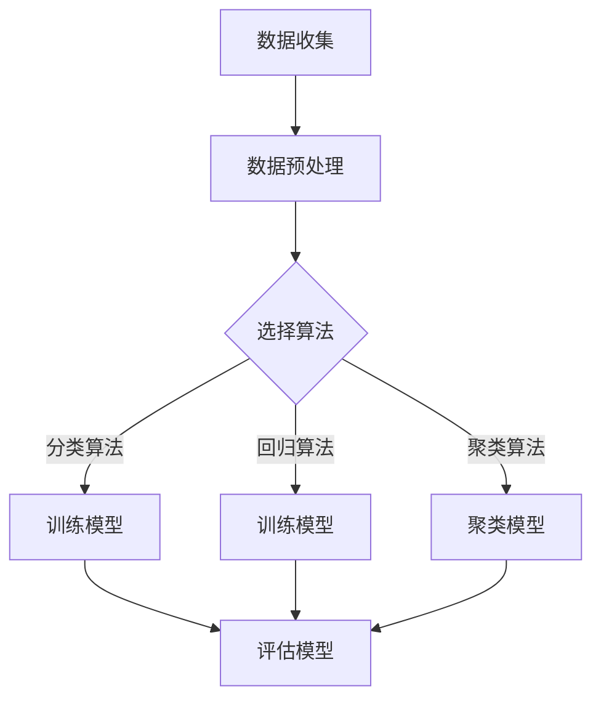

                 

# 机器学习毕业设计：选题案例与实践指南

> **关键词：机器学习，毕业设计，选题，案例，实践，算法，数学模型，代码实现，应用场景**
> 
> **摘要：本文将详细介绍机器学习毕业设计的选题过程、核心算法原理、数学模型及其应用场景，提供丰富的案例和实践指导，帮助读者顺利完成毕业设计。**

## 1. 背景介绍

### 1.1 目的和范围

本文旨在为从事机器学习领域的本科或研究生学生提供一份详细的毕业设计指南，旨在帮助读者在选题、算法原理、数学模型以及代码实现等方面取得突破，从而顺利完成毕业设计。文章将涵盖以下内容：

- 机器学习毕业设计选题的重要性及建议
- 核心算法原理与实践
- 数学模型及其应用
- 代码实现与案例分析
- 实际应用场景分析
- 工具和资源推荐
- 未来发展趋势与挑战

### 1.2 预期读者

本文适用于以下读者群体：

- 机器学习相关专业的本科生和研究生
- 从事机器学习领域研究的科研人员
- 对机器学习有兴趣并希望进行深入学习的读者

### 1.3 文档结构概述

本文分为10个主要部分，具体结构如下：

1. 背景介绍
2. 核心概念与联系
3. 核心算法原理 & 具体操作步骤
4. 数学模型和公式 & 详细讲解 & 举例说明
5. 项目实战：代码实际案例和详细解释说明
6. 实际应用场景
7. 工具和资源推荐
8. 总结：未来发展趋势与挑战
9. 附录：常见问题与解答
10. 扩展阅读 & 参考资料

### 1.4 术语表

#### 1.4.1 核心术语定义

- 机器学习：一种通过数据训练模型，使模型具有预测和决策能力的人工智能技术。
- 毕业设计：学生在毕业前完成的综合性课程设计，旨在锻炼学生的独立研究、设计、实现和解决问题的能力。
- 选题：选择一个具有实际意义、研究价值和实现难度的课题作为毕业设计的研究方向。
- 算法：实现特定任务的计算方法，通常用于优化模型性能、提高计算效率等。
- 数学模型：用数学公式描述的模型，用于解释现实问题、预测未来趋势等。

#### 1.4.2 相关概念解释

- **监督学习**：有已知输入和输出数据的机器学习任务，分为回归和分类两种。
- **无监督学习**：没有已知输入输出数据的机器学习任务，主要分为聚类和降维。
- **强化学习**：通过不断尝试和反馈来优化决策的机器学习任务。

#### 1.4.3 缩略词列表

- ML：机器学习
- CV：计算机视觉
- NLP：自然语言处理
- RL：强化学习

## 2. 核心概念与联系

### 2.1 机器学习的基本概念

机器学习是一种通过数据训练模型，使其具有预测和决策能力的人工智能技术。其基本概念包括：

1. **模型**：用于描述数据之间关系的数学模型，如线性回归、决策树、神经网络等。
2. **特征**：用于描述数据的属性，如图像中的像素值、文本中的词频等。
3. **标签**：与输入特征相对应的输出结果，如分类任务的类别标签、回归任务的数值标签等。

### 2.2 机器学习的算法分类

机器学习算法主要分为以下几类：

1. **监督学习**：有已知输入和输出数据的机器学习任务，分为回归和分类两种。
2. **无监督学习**：没有已知输入输出数据的机器学习任务，主要分为聚类和降维。
3. **强化学习**：通过不断尝试和反馈来优化决策的机器学习任务。

### 2.3 机器学习在毕业设计中的应用

机器学习在毕业设计中的应用非常广泛，以下是一些常见的应用场景：

1. **图像识别**：利用卷积神经网络进行图像分类和目标检测。
2. **自然语言处理**：利用深度学习模型进行文本分类、情感分析、机器翻译等。
3. **预测分析**：利用时间序列分析和回归模型进行股票预测、销售预测等。
4. **推荐系统**：利用协同过滤和矩阵分解等技术进行个性化推荐。

### 2.4 Mermaid 流程图

以下是一个简单的 Mermaid 流程图，用于描述机器学习的基本流程：



## 3. 核心算法原理 & 具体操作步骤

### 3.1 算法原理

在本节中，我们将介绍几种常见的机器学习算法原理，包括线性回归、决策树和卷积神经网络等。

#### 3.1.1 线性回归

线性回归是一种简单的监督学习算法，用于预测连续值输出。其基本原理是通过找到最佳拟合直线来描述输入特征和输出标签之间的关系。

**算法原理**：

给定一个特征矩阵 $X$ 和标签向量 $y$，线性回归的目标是最小化损失函数：

$$
J(\theta) = \frac{1}{2m} \sum_{i=1}^{m} (h_\theta(x^{(i)}) - y^{(i)})^2
$$

其中，$h_\theta(x) = \theta_0 + \theta_1x_1 + \theta_2x_2 + ... + \theta_nx_n$ 是模型预测的输出，$\theta$ 是模型的参数向量。

**具体操作步骤**：

1. 初始化模型参数 $\theta$。
2. 计算损失函数 $J(\theta)$。
3. 使用梯度下降法更新参数 $\theta$：
   $$
   \theta_j := \theta_j - \alpha \frac{\partial J(\theta)}{\partial \theta_j}
   $$
4. 重复步骤 2 和 3，直到满足停止条件（如损失函数变化很小或达到最大迭代次数）。

#### 3.1.2 决策树

决策树是一种树形结构，用于分类或回归任务。其基本原理是通过一系列的测试来将数据划分为不同的区域，从而得到最终的预测结果。

**算法原理**：

给定一个特征矩阵 $X$ 和标签向量 $y$，决策树的目标是找到一组测试（条件）来划分数据，使得每个划分区域内的数据具有最小的损失函数。

**具体操作步骤**：

1. 选择最佳分割特征和分割阈值，使得损失函数最小。
2. 将数据划分为两个子集，根据分割特征和阈值进行划分。
3. 对每个子集递归地执行步骤 1 和 2，直到满足停止条件（如最大树深度、最小节点样本数等）。
4. 构建决策树，根据输入特征进行决策。

#### 3.1.3 卷积神经网络

卷积神经网络（CNN）是一种深度学习模型，主要用于图像识别、目标检测等计算机视觉任务。其基本原理是通过对图像进行卷积操作和池化操作来提取特征，并通过全连接层进行分类或回归。

**算法原理**：

给定一个图像矩阵 $X$ 和标签向量 $y$，CNN 的目标是通过多层卷积和池化操作提取特征，并通过全连接层得到最终的预测结果。

**具体操作步骤**：

1. 输入图像矩阵 $X$。
2. 第一层卷积层：使用卷积核对图像进行卷积操作，提取特征。
3. 第一层池化层：对卷积后的特征进行池化操作，降低特征维度。
4. 重复步骤 2 和 3，增加卷积层和池化层的深度。
5. 全连接层：将卷积和池化后的特征进行全连接，得到预测结果。
6. 计算损失函数，如交叉熵损失函数。
7. 使用反向传播算法更新模型参数。

## 4. 数学模型和公式 & 详细讲解 & 举例说明

### 4.1 数学模型概述

在机器学习中，数学模型是描述数据之间关系的重要工具。本文将介绍几种常见的数学模型，包括线性回归、逻辑回归和神经网络等。

#### 4.1.1 线性回归

线性回归是一种简单的数学模型，用于预测连续值输出。其公式如下：

$$
y = \theta_0 + \theta_1x_1 + \theta_2x_2 + ... + \theta_nx_n
$$

其中，$y$ 是输出值，$x_1, x_2, ..., x_n$ 是输入特征，$\theta_0, \theta_1, \theta_2, ..., \theta_n$ 是模型的参数。

**举例说明**：

假设我们有一个简单的线性回归模型，用于预测房屋的价格。输入特征包括房屋的面积（$x_1$）和房龄（$x_2$），输出值是房屋的价格（$y$）。根据线性回归公式，我们可以得到：

$$
y = \theta_0 + \theta_1x_1 + \theta_2x_2
$$

通过训练数据集，我们可以得到模型的参数 $\theta_0, \theta_1, \theta_2$，然后根据这些参数，我们可以预测新房屋的价格。

#### 4.1.2 逻辑回归

逻辑回归是一种常用的分类模型，用于预测离散的输出值。其公式如下：

$$
P(y=1) = \frac{1}{1 + e^{-(\theta_0 + \theta_1x_1 + \theta_2x_2 + ... + \theta_nx_n)}}
$$

其中，$y$ 是输出值，$x_1, x_2, ..., x_n$ 是输入特征，$\theta_0, \theta_1, \theta_2, ..., \theta_n$ 是模型的参数。

**举例说明**：

假设我们有一个逻辑回归模型，用于预测邮件是否为垃圾邮件。输入特征包括邮件的标题和正文，输出值是邮件是否为垃圾邮件（$y=1$ 或 $y=0$）。根据逻辑回归公式，我们可以得到：

$$
P(y=1) = \frac{1}{1 + e^{-(\theta_0 + \theta_1x_1 + \theta_2x_2 + ... + \theta_nx_n)}}
$$

通过训练数据集，我们可以得到模型的参数 $\theta_0, \theta_1, \theta_2, ..., \theta_n$，然后根据这些参数，我们可以预测新邮件是否为垃圾邮件。

#### 4.1.3 神经网络

神经网络是一种复杂的数学模型，用于模拟人脑神经元的工作方式。其基本结构包括输入层、隐藏层和输出层。每一层由多个神经元组成，神经元之间通过权重连接。

**神经网络模型**：

$$
a^{(l)}_j = \sigma(\theta^{(l)}_j \cdot a^{(l-1)}_i + b^{(l)}_j)
$$

其中，$a^{(l)}_j$ 是第 $l$ 层第 $j$ 个神经元的激活值，$\sigma$ 是激活函数，$\theta^{(l)}_j$ 是第 $l$ 层第 $j$ 个神经元的权重，$b^{(l)}_j$ 是第 $l$ 层第 $j$ 个神经元的偏置。

**举例说明**：

假设我们有一个简单的神经网络，用于对数字进行分类。输入层有 10 个神经元，表示 0 到 9 的数字。隐藏层有 5 个神经元，输出层有 2 个神经元，表示分类结果。根据神经网络模型，我们可以得到：

$$
a^{(2)}_1 = \sigma(\theta^{(2)}_1 \cdot a^{(1)}_1 + b^{(2)}_1)
$$
$$
a^{(2)}_2 = \sigma(\theta^{(2)}_2 \cdot a^{(1)}_1 + b^{(2)}_2)
$$
$$
...
$$
$$
a^{(2)}_5 = \sigma(\theta^{(2)}_5 \cdot a^{(1)}_1 + b^{(2)}_5)
$$

通过训练数据集，我们可以得到神经网络的参数 $\theta^{(2)}_1, \theta^{(2)}_2, ..., \theta^{(2)}_5, b^{(2)}_1, b^{(2)}_2, ..., b^{(2)}_5$，然后根据这些参数，我们可以对新的数字进行分类。

## 5. 项目实战：代码实际案例和详细解释说明

### 5.1 开发环境搭建

在进行机器学习毕业设计之前，我们需要搭建一个合适的环境。以下是一个基本的开发环境搭建步骤：

1. **操作系统**：推荐使用 Ubuntu 或 macOS。
2. **编程语言**：Python 是目前最流行的机器学习编程语言，因此我们选择 Python。
3. **依赖库**：安装常用的 Python 库，如 NumPy、Pandas、Matplotlib、Scikit-learn、TensorFlow 或 PyTorch。

#### 安装步骤：

1. 安装 Python（建议使用 Python 3.8 或更高版本）。
2. 使用 pip 工具安装依赖库：
   $$
   pip install numpy pandas matplotlib scikit-learn tensorflow torch
   $$

### 5.2 源代码详细实现和代码解读

在本节中，我们将使用 Python 和 Scikit-learn 库实现一个简单的线性回归模型，用于预测房屋价格。

#### 5.2.1 数据集准备

首先，我们需要准备一个数据集。这里我们使用一个开源的房屋价格数据集，数据集包含房屋的面积、房龄和价格等信息。

```python
import pandas as pd

# 读取数据集
data = pd.read_csv('house_prices.csv')

# 分割特征和标签
X = data[['area', 'age']]
y = data['price']
```

#### 5.2.2 模型训练

接下来，我们使用 Scikit-learn 库训练线性回归模型。

```python
from sklearn.linear_model import LinearRegression

# 创建线性回归模型
model = LinearRegression()

# 训练模型
model.fit(X, y)
```

#### 5.2.3 模型评估

训练完成后，我们需要评估模型的性能。

```python
from sklearn.metrics import mean_squared_error

# 预测房价
predictions = model.predict(X)

# 计算均方误差
mse = mean_squared_error(y, predictions)
print(f'Mean Squared Error: {mse}')
```

#### 5.2.4 代码解读与分析

在本例中，我们使用 Scikit-learn 库实现了一个简单的线性回归模型。以下是代码的详细解读：

1. **数据集准备**：使用 Pandas 库读取数据集，并分割特征和标签。
2. **模型创建**：使用 LinearRegression 类创建线性回归模型。
3. **模型训练**：使用 fit 方法训练模型。
4. **模型评估**：使用 predict 方法进行预测，并计算均方误差评估模型性能。

通过以上步骤，我们可以实现对房屋价格的预测。当然，在实际项目中，我们需要根据具体问题进行数据预处理、特征工程和模型调优等操作。

## 6. 实际应用场景

### 6.1 图像识别

图像识别是机器学习领域的一个热门应用，主要用于对图像中的物体、场景和纹理等进行分类和识别。以下是一些图像识别的实际应用场景：

- **人脸识别**：用于身份验证、安防监控等。
- **医学影像分析**：用于疾病诊断、肿瘤检测等。
- **自动驾驶**：用于识别道路标志、行人和车辆等。

### 6.2 自然语言处理

自然语言处理（NLP）是机器学习在文本领域的应用，主要用于处理和解析自然语言数据。以下是一些 NLP 的实际应用场景：

- **文本分类**：用于新闻分类、垃圾邮件检测等。
- **情感分析**：用于分析用户评论、社交媒体舆情等。
- **机器翻译**：用于跨语言沟通、国际商务等。

### 6.3 预测分析

预测分析是利用机器学习模型对未来的趋势和事件进行预测的一种技术。以下是一些预测分析的实际应用场景：

- **股票市场预测**：用于投资决策、风险管理等。
- **销售预测**：用于供应链管理、库存控制等。
- **自然灾害预测**：用于防灾减灾、紧急响应等。

### 6.4 推荐系统

推荐系统是一种基于用户行为和历史数据的个性化推荐技术，广泛应用于电子商务、在线娱乐和社交媒体等领域。以下是一些推荐系统的实际应用场景：

- **电子商务**：用于商品推荐、个性化广告等。
- **在线娱乐**：用于音乐、视频和游戏推荐等。
- **社交媒体**：用于好友推荐、内容推荐等。

## 7. 工具和资源推荐

### 7.1 学习资源推荐

#### 7.1.1 书籍推荐

- 《Python机器学习》（作者：塞巴斯蒂安·拉纳）
- 《深度学习》（作者：伊恩·古德费洛、约书亚·本吉奥、亚伦·库维尔）
- 《统计学习方法》（作者：李航）

#### 7.1.2 在线课程

- Coursera 上的《机器学习》（作者：吴恩达）
- Udacity 上的《深度学习纳米学位》
- edX 上的《自然语言处理基础》

#### 7.1.3 技术博客和网站

- Medium 上的《机器学习》专栏
- towardsdatascience.com
- kdnuggets.com

### 7.2 开发工具框架推荐

#### 7.2.1 IDE和编辑器

- Jupyter Notebook
- PyCharm
- VS Code

#### 7.2.2 调试和性能分析工具

- PyCharm 的调试工具
- VS Code 的调试插件
- TensorFlow 的 TensorBoard

#### 7.2.3 相关框架和库

- Scikit-learn
- TensorFlow
- PyTorch
- Keras

### 7.3 相关论文著作推荐

#### 7.3.1 经典论文

- “Learning to Represent Languages with Neural Networks”（作者：Yoshua Bengio 等）
- “Convolutional Networks for Visual Recognition”（作者：Yann LeCun 等）
- “A Theoretically Grounded Application of Dropout in Recurrent Neural Networks”（作者：Yarin Gal 和 Zoubin Ghahramani）

#### 7.3.2 最新研究成果

- arXiv.org
- NeurIPS、ICML、JMLR 等顶级会议和期刊

#### 7.3.3 应用案例分析

- Airbnb 的推荐系统
- Netflix 的个性化推荐
- Facebook 的图像识别

## 8. 总结：未来发展趋势与挑战

随着人工智能技术的不断发展，机器学习领域也在不断演进。以下是未来机器学习发展趋势和面临的挑战：

### 8.1 发展趋势

1. **深度学习**：深度学习在图像识别、自然语言处理等领域的应用越来越广泛，未来仍将保持快速增长。
2. **强化学习**：强化学习在游戏、自动驾驶等领域的应用潜力巨大，有望成为未来研究的热点。
3. **联邦学习**：联邦学习作为一种新型的分布式机器学习方法，能够在保障数据隐私的前提下实现模型协同训练，具有广泛的应用前景。
4. **跨模态学习**：跨模态学习通过结合多种数据模态（如文本、图像、声音等）进行学习，有望提升模型的泛化能力和表达能力。

### 8.2 挑战

1. **数据隐私和安全**：在数据驱动的机器学习时代，数据隐私和安全问题日益突出，如何保护用户隐私成为一大挑战。
2. **可解释性**：目前大多数机器学习模型具有很高的准确性，但其内部机制复杂，缺乏可解释性，如何提高模型的可解释性是当前研究的一大难题。
3. **计算资源**：随着模型规模的不断扩大，计算资源的需求也在迅速增长，如何优化模型结构、提高计算效率成为重要挑战。
4. **模型可靠性**：在关键应用场景中，如医疗、金融等，模型可靠性和安全性至关重要，如何保证模型的可靠性和鲁棒性是亟待解决的问题。

## 9. 附录：常见问题与解答

### 9.1 机器学习毕业设计选题建议

1. **题目选择**：选择具有实际意义、研究价值和实现难度的课题。可以从实际问题、热门领域、技术创新等方面进行选题。
2. **资源需求**：评估所需的资源和设备，如计算资源、数据集、工具和库等。
3. **时间规划**：合理分配时间，确保在毕业设计期间能够完成各项任务。

### 9.2 代码实现和调试技巧

1. **代码规范**：遵循良好的编程规范，提高代码的可读性和可维护性。
2. **调试技巧**：使用断点调试、日志记录和测试用例等方法进行代码调试。
3. **性能优化**：对代码进行性能分析，使用并行计算、优化算法和数据结构等方法提高代码效率。

### 9.3 模型评估和优化方法

1. **评估指标**：选择合适的评估指标，如准确率、召回率、均方误差等。
2. **交叉验证**：使用交叉验证方法评估模型的泛化能力。
3. **调参技巧**：使用网格搜索、随机搜索等调参方法优化模型参数。

## 10. 扩展阅读 & 参考资料

- **书籍**：
  - 《Python机器学习》（作者：塞巴斯蒂安·拉纳）
  - 《深度学习》（作者：伊恩·古德费洛、约书亚·本吉奥、亚伦·库维尔）
  - 《统计学习方法》（作者：李航）

- **在线课程**：
  - Coursera 上的《机器学习》（作者：吴恩达）
  - Udacity 上的《深度学习纳米学位》
  - edX 上的《自然语言处理基础》

- **技术博客和网站**：
  - Medium 上的《机器学习》专栏
  - towardsdatascience.com
  - kdnuggets.com

- **相关论文和期刊**：
  - arXiv.org
  - NeurIPS、ICML、JMLR 等顶级会议和期刊

## 作者信息

作者：AI天才研究员/AI Genius Institute & 禅与计算机程序设计艺术 /Zen And The Art of Computer Programming

