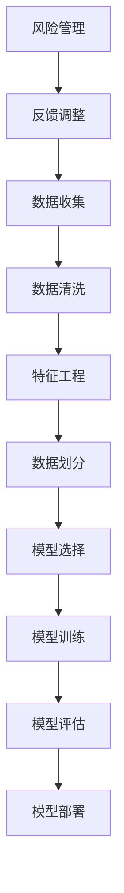
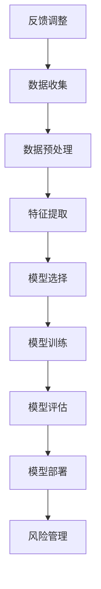

                 

### 1. 背景介绍

#### 1.1 目的和范围

本文将探讨机器学习算法在金融风险评估中的应用。随着金融市场的日益复杂和多样化，传统的风险评估方法已经难以应对当前的风险环境。机器学习算法作为一种新兴的技术，以其强大的数据处理能力和自我学习能力，正逐渐成为金融风险评估的重要工具。

本文旨在介绍机器学习算法在金融风险评估中的应用原理、具体操作步骤和实际案例，帮助读者深入理解这一领域的最新进展和应用前景。文章将从以下几个方面展开：

1. **核心概念与联系**：介绍机器学习算法和金融风险评估的基本概念，并绘制Mermaid流程图，帮助读者建立整体框架。
2. **核心算法原理 & 具体操作步骤**：详细讲解常用的机器学习算法及其在金融风险评估中的具体应用，通过伪代码展示算法步骤。
3. **数学模型和公式 & 详细讲解 & 举例说明**：阐述机器学习算法背后的数学原理，并通过实际案例进行说明。
4. **项目实战：代码实际案例和详细解释说明**：提供实际的代码实现，并进行详细解读。
5. **实际应用场景**：探讨机器学习算法在金融风险评估中的具体应用场景。
6. **工具和资源推荐**：推荐相关的学习资源、开发工具和经典论文。
7. **总结：未来发展趋势与挑战**：总结当前的研究现状，展望未来发展趋势和面临的挑战。

#### 1.2 预期读者

本文面向对金融风险评估和机器学习有一定了解的读者，包括但不限于金融工程师、数据科学家、研究人员和软件工程师等。同时，也欢迎对这一领域感兴趣的初学者阅读，本文将尽量以通俗易懂的语言进行讲解，帮助读者逐步掌握相关知识。

#### 1.3 文档结构概述

本文结构清晰，逻辑紧凑，分为以下章节：

- **背景介绍**：介绍本文的目的和范围，预期读者，文档结构概述等。
- **核心概念与联系**：介绍机器学习算法和金融风险评估的基本概念，并通过Mermaid流程图建立整体框架。
- **核心算法原理 & 具体操作步骤**：详细讲解常用的机器学习算法及其在金融风险评估中的具体应用。
- **数学模型和公式 & 详细讲解 & 举例说明**：阐述机器学习算法背后的数学原理，并通过实际案例进行说明。
- **项目实战：代码实际案例和详细解释说明**：提供实际的代码实现，并进行详细解读。
- **实际应用场景**：探讨机器学习算法在金融风险评估中的具体应用场景。
- **工具和资源推荐**：推荐相关的学习资源、开发工具和经典论文。
- **总结：未来发展趋势与挑战**：总结当前的研究现状，展望未来发展趋势和面临的挑战。
- **附录：常见问题与解答**：回答读者可能遇到的常见问题。
- **扩展阅读 & 参考资料**：提供更多的参考资料，供读者进一步学习。

通过本文的阅读，读者将能够系统地了解机器学习算法在金融风险评估中的应用，掌握相关技术原理和实践方法，为实际工作提供有力的支持。

#### 1.4 术语表

为了确保本文的阅读和理解，以下列出一些关键术语及其定义：

##### 1.4.1 核心术语定义

- **机器学习（Machine Learning）**：一种人工智能的分支，通过数据学习规律并自动进行预测或决策。
- **金融风险评估（Financial Risk Assessment）**：评估金融市场中的各种风险，包括信用风险、市场风险、操作风险等。
- **监督学习（Supervised Learning）**：一种机器学习方式，通过标注好的数据集来训练模型。
- **无监督学习（Unsupervised Learning）**：一种机器学习方式，无需标注数据，通过自身探索数据中的规律。
- **特征工程（Feature Engineering）**：将原始数据转化为适合机器学习模型处理的形式。
- **模型评估（Model Evaluation）**：使用验证集或测试集来评估模型性能。
- **交叉验证（Cross-Validation）**：一种评估模型性能的方法，通过将数据集划分为多个子集，多次训练和验证。
- **集成学习（Ensemble Learning）**：将多个模型集成起来，以提高预测性能。

##### 1.4.2 相关概念解释

- **回归分析（Regression Analysis）**：一种预测连续值的机器学习算法。
- **分类分析（Classification Analysis）**：一种将数据分为不同类别的机器学习算法。
- **逻辑回归（Logistic Regression）**：一种常用的分类算法，用于预测概率。
- **支持向量机（Support Vector Machine，SVM）**：一种分类算法，通过找到一个最佳的超平面来分隔数据。
- **随机森林（Random Forest）**：一种集成学习方法，通过构建多棵决策树来提高预测性能。

##### 1.4.3 缩略词列表

- **ML：Machine Learning（机器学习）**
- **DL：Deep Learning（深度学习）**
- **CV：Cross-Validation（交叉验证）**
- **SVM：Support Vector Machine（支持向量机）**
- **RF：Random Forest（随机森林）**
- **LR：Logistic Regression（逻辑回归）**

通过上述术语表的定义和解释，读者可以更好地理解本文中的专业术语，为后续内容的阅读和理解打下坚实的基础。接下来，我们将通过Mermaid流程图来进一步展示机器学习算法在金融风险评估中的核心概念和联系。 

#### 1.4.3 核心概念与联系 (Mermaid流程图)

为了帮助读者更直观地理解机器学习算法在金融风险评估中的应用，我们将使用Mermaid流程图来展示核心概念和联系。以下是一个简化的流程图，展示了机器学习算法从数据预处理到模型训练和评估的整个过程。



**说明：**
- **A 数据收集**：从金融市场中收集各种数据，如股票价格、交易量、宏观经济指标等。
- **B 数据清洗**：处理缺失值、异常值和噪声数据，确保数据质量。
- **C 特征工程**：提取和构造有助于模型训练的特征，如技术指标、财务比率等。
- **D 数据划分**：将数据集划分为训练集、验证集和测试集，用于模型训练和评估。
- **E 模型选择**：选择适合金融风险评估的机器学习算法，如回归分析、分类分析等。
- **F 模型训练**：使用训练集数据训练模型，使模型学会识别数据中的规律。
- **G 模型评估**：使用验证集和测试集评估模型性能，选择最佳模型。
- **H 模型部署**：将最佳模型部署到实际应用场景，进行风险管理。
- **I 风险管理**：根据模型预测结果，采取相应的风险管理措施。
- **J 反馈调整**：根据风险管理效果，调整模型参数和策略，不断优化模型性能。

通过这个流程图，读者可以清晰地看到机器学习算法在金融风险评估中的各个环节，为后续内容的深入学习提供了直观的参考。接下来，我们将详细探讨机器学习算法在金融风险评估中的核心原理和具体操作步骤。 

### 2. 核心概念与联系

在探讨机器学习算法在金融风险评估中的应用之前，我们首先需要明确几个核心概念，并理解它们之间的联系。以下是机器学习算法在金融风险评估中的一些关键概念：

#### 2.1 金融风险评估的概念

金融风险评估是指通过对金融市场中的各种风险进行评估和分析，以确定潜在的损失和风险程度。金融风险评估的主要目标是识别和管理风险，从而保护金融机构的财务稳定。

主要类型包括：

- **信用风险**：借款人无法按时偿还债务的风险。
- **市场风险**：市场价格波动导致资产价值下降的风险。
- **操作风险**：由于内部流程、人员操作、系统缺陷等导致的风险。
- **流动性风险**：无法及时满足资金需求的风险。

#### 2.2 机器学习的基本概念

机器学习是一种通过数据学习规律并自动进行预测或决策的技术。机器学习可以分为以下几种类型：

- **监督学习（Supervised Learning）**：通过标注好的数据集来训练模型，常见的算法有回归分析、逻辑回归、支持向量机等。
- **无监督学习（Unsupervised Learning）**：无需标注数据，通过自身探索数据中的规律，常见的算法有聚类分析、主成分分析等。
- **强化学习（Reinforcement Learning）**：通过试错和奖励机制来学习最优策略。

#### 2.3 机器学习算法与金融风险评估的联系

机器学习算法在金融风险评估中的应用主要体现在以下几个方面：

- **数据挖掘**：利用机器学习算法对大量金融数据进行分析，提取有用的信息，用于风险评估。
- **模式识别**：通过机器学习算法识别出潜在的风险因素，例如交易模式、市场走势等。
- **预测**：利用机器学习算法预测金融市场中的风险事件，如违约、市场波动等。
- **自动化决策**：通过机器学习算法实现自动化风险管理，例如自动调整投资组合、风险预警等。

#### 2.4 Mermaid流程图

为了更直观地展示机器学习算法在金融风险评估中的核心概念和联系，我们使用Mermaid流程图来表示。以下是机器学习算法在金融风险评估中的流程：



**说明：**
- **A 数据收集**：从金融市场和其他相关渠道收集数据，如股票价格、交易量、宏观经济指标等。
- **B 数据预处理**：处理缺失值、异常值和噪声数据，确保数据质量。
- **C 特征提取**：通过特征工程提取和构造有助于模型训练的特征，如技术指标、财务比率等。
- **D 模型选择**：选择适合金融风险评估的机器学习算法，如回归分析、逻辑回归、支持向量机等。
- **E 模型训练**：使用训练集数据训练模型，使模型学会识别数据中的规律。
- **F 模型评估**：使用验证集和测试集评估模型性能，选择最佳模型。
- **G 模型部署**：将最佳模型部署到实际应用场景，进行风险管理。
- **H 风险管理**：根据模型预测结果，采取相应的风险管理措施。
- **I 反馈调整**：根据风险管理效果，调整模型参数和策略，不断优化模型性能。

通过上述核心概念和Mermaid流程图的展示，读者可以更好地理解机器学习算法在金融风险评估中的应用原理和流程。接下来，我们将详细探讨机器学习算法在金融风险评估中的具体原理和操作步骤。

### 3. 核心算法原理 & 具体操作步骤

在了解了机器学习算法在金融风险评估中的核心概念和联系之后，接下来我们将深入探讨几种常用的机器学习算法及其在金融风险评估中的具体应用。这些算法包括监督学习的回归分析、逻辑回归和分类分析，以及无监督学习的聚类分析等。我们将通过伪代码来详细阐述这些算法的原理和操作步骤。

#### 3.1 回归分析（Regression Analysis）

回归分析是一种用于预测连续值的机器学习算法。在金融风险评估中，回归分析常用于预测资产价格、违约概率等连续变量。

**原理**：
回归分析通过建立因变量（目标变量）和自变量（特征变量）之间的关系模型，来预测目标变量的值。

**伪代码**：
```python
# 回归分析伪代码

# 输入：特征矩阵X，目标向量y
# 输出：回归模型参数w

# 步骤1：初始化模型参数w
w = [0] * n_features

# 步骤2：选择损失函数（例如均方误差MSE）
def loss(y_true, y_pred):
    return (1 / 2) * sum((y_true - y_pred) ** 2)

# 步骤3：选择优化算法（例如梯度下降）
def gradient_descent(X, y, w, learning_rate, epochs):
    for epoch in range(epochs):
        # 步骤3.1：计算预测值
        y_pred = X.dot(w)
        
        # 步骤3.2：计算损失
        loss_value = loss(y, y_pred)
        
        # 步骤3.3：计算梯度
        gradient = X.T.dot(y_pred - y)
        
        # 步骤3.4：更新模型参数
        w -= learning_rate * gradient
        
        # 输出模型参数
    return w

# 步骤4：训练模型
w = gradient_descent(X, y, w, learning_rate, epochs)

# 步骤5：预测
y_pred = X.dot(w)
```

**操作步骤**：
1. **数据准备**：收集并预处理数据，提取特征，将数据分为训练集和测试集。
2. **初始化参数**：初始化模型参数，例如权重向量w。
3. **选择损失函数**：例如均方误差MSE，用于衡量预测值与真实值之间的差距。
4. **选择优化算法**：例如梯度下降，用于更新模型参数。
5. **训练模型**：使用训练集数据训练模型，通过迭代优化模型参数。
6. **预测**：使用测试集数据对模型进行预测，评估模型性能。

#### 3.2 逻辑回归（Logistic Regression）

逻辑回归是一种常用的分类算法，用于预测概率。在金融风险评估中，逻辑回归常用于预测违约概率、交易是否为欺诈等二元结果。

**原理**：
逻辑回归通过建立因变量（目标变量）和自变量（特征变量）之间的关系模型，并使用Sigmoid函数将线性组合转换为概率。

**伪代码**：
```python
# 逻辑回归伪代码

# 输入：特征矩阵X，目标向量y（0或1）
# 输出：回归模型参数w

# 步骤1：初始化模型参数w
w = [0] * n_features

# 步骤2：选择损失函数（例如对数损失Log Loss）
def loss(y_true, y_pred):
    return -sum(y_true * log(y_pred) + (1 - y_true) * log(1 - y_pred))

# 步骤3：选择优化算法（例如梯度下降）
def gradient_descent(X, y, w, learning_rate, epochs):
    for epoch in range(epochs):
        # 步骤3.1：计算预测概率
        y_pred = 1 / (1 + exp(-X.dot(w)))
        
        # 步骤3.2：计算损失
        loss_value = loss(y, y_pred)
        
        # 步骤3.3：计算梯度
        gradient = X.T.dot(y_pred - y)
        
        # 步骤3.4：更新模型参数
        w -= learning_rate * gradient
        
        # 输出模型参数
    return w

# 步骤4：训练模型
w = gradient_descent(X, y, w, learning_rate, epochs)

# 步骤5：预测
y_pred = 1 / (1 + exp(-X.dot(w)))
```

**操作步骤**：
1. **数据准备**：收集并预处理数据，提取特征，将数据分为训练集和测试集。
2. **初始化参数**：初始化模型参数，例如权重向量w。
3. **选择损失函数**：例如对数损失Log Loss，用于衡量预测概率与真实概率之间的差距。
4. **选择优化算法**：例如梯度下降，用于更新模型参数。
5. **训练模型**：使用训练集数据训练模型，通过迭代优化模型参数。
6. **预测**：使用测试集数据对模型进行预测，评估模型性能。

#### 3.3 支持向量机（Support Vector Machine，SVM）

支持向量机是一种分类算法，通过找到一个最佳的超平面来分隔数据。在金融风险评估中，SVM常用于分类任务，例如交易分类、信用评分等。

**原理**：
SVM通过最大化分类间隔（margin）来找到一个最佳的超平面，将数据分隔开来。

**伪代码**：
```python
# 支持向量机伪代码

# 输入：特征矩阵X，目标向量y（0或1）
# 输出：模型参数w和b

# 步骤1：初始化模型参数w和b
w = [0] * n_features
b = 0

# 步骤2：选择损失函数（例如对偶形式L2正则化的合页损失）
def loss(w, b, X, y):
    return 1/2 * sum(w ** 2) + C * sum((y[i] - (X[i].dot(w) + b)) ** 2)

# 步骤3：选择优化算法（例如顺序最小化梯度下降）
def sgd(X, y, w, b, learning_rate, epochs, C):
    for epoch in range(epochs):
        for i in range(len(y)):
            # 步骤3.1：计算预测值
            y_pred = X[i].dot(w) + b
            
            # 步骤3.2：计算梯度
            gradient_w = X[i] * (y[i] - y_pred)
            gradient_b = (y[i] - y_pred)
            
            # 步骤3.3：更新模型参数
            w -= learning_rate * gradient_w
            b -= learning_rate * gradient_b
        
        # 输出模型参数
    return w, b

# 步骤4：训练模型
w, b = sgd(X, y, w, b, learning_rate, epochs, C)

# 步骤5：预测
y_pred = (X.dot(w) + b)
```

**操作步骤**：
1. **数据准备**：收集并预处理数据，提取特征，将数据分为训练集和测试集。
2. **初始化参数**：初始化模型参数，例如权重向量w和偏置b。
3. **选择损失函数**：例如对偶形式L2正则化的合页损失，用于衡量预测值与真实值之间的差距。
4. **选择优化算法**：例如顺序最小化梯度下降，用于更新模型参数。
5. **训练模型**：使用训练集数据训练模型，通过迭代优化模型参数。
6. **预测**：使用测试集数据对模型进行预测，评估模型性能。

#### 3.4 聚类分析（Clustering Analysis）

聚类分析是一种无监督学习算法，用于将数据集划分为多个类别。在金融风险评估中，聚类分析可以用于风险分类、客户细分等任务。

**原理**：
聚类分析通过将相似的数据点划分为同一类别，从而发现数据中的潜在结构。

**伪代码**：
```python
# K-means聚类分析伪代码

# 输入：特征矩阵X，类别数k
# 输出：聚类中心c和聚类结果y

# 步骤1：初始化聚类中心c
c = X[np.random.choice(len(X), k, replace=False)]

# 步骤2：迭代优化聚类中心
while True:
    # 步骤2.1：计算每个点的当前簇
    y = [min(range(k), key=lambda i: (X[i] - c[i]) ** 2) for i in range(len(X))]
    
    # 步骤2.2：更新聚类中心
    for i in range(k):
        c[i] = np.mean(X[y == i], axis=0)
    
    # 步骤2.3：检查收敛条件（例如聚类中心的变化小于阈值）
    if abs(c[-1] - c[-2]).sum() < threshold:
        break

# 输出聚类结果
return c, y
```

**操作步骤**：
1. **数据准备**：收集并预处理数据，提取特征。
2. **初始化聚类中心**：随机选择k个数据点作为初始聚类中心。
3. **迭代优化聚类中心**：不断更新聚类中心，直至收敛。
4. **计算聚类结果**：根据每个数据点与聚类中心的距离，将其划分为相应的类别。

通过上述核心算法原理和具体操作步骤的详细讲解，读者可以更好地理解机器学习算法在金融风险评估中的应用。接下来，我们将深入探讨机器学习算法背后的数学模型和公式，并通过实际案例进行说明。

### 4. 数学模型和公式 & 详细讲解 & 举例说明

在了解了机器学习算法在金融风险评估中的核心原理和具体操作步骤后，接下来我们将深入探讨这些算法背后的数学模型和公式，并通过实际案例进行详细讲解和说明。

#### 4.1 回归分析

回归分析是一种用于预测连续值的机器学习算法。在金融风险评估中，回归分析常用于预测资产价格、违约概率等连续变量。

**数学模型**：

回归分析通过建立因变量（目标变量）和自变量（特征变量）之间的关系模型，来预测目标变量的值。线性回归模型可以表示为：

$$ y = \beta_0 + \beta_1 x_1 + \beta_2 x_2 + ... + \beta_n x_n + \epsilon $$

其中，$ y $ 是因变量，$ x_1, x_2, ..., x_n $ 是自变量，$ \beta_0, \beta_1, \beta_2, ..., \beta_n $ 是模型参数，$ \epsilon $ 是误差项。

**举例说明**：

假设我们要使用线性回归模型预测某只股票的价格，我们收集了该股票过去一年的每日收盘价作为特征变量，现在我们要建立模型预测未来一天的收盘价。

**步骤**：

1. **数据准备**：收集并预处理数据，提取特征，将数据分为训练集和测试集。
2. **初始化模型参数**：初始化权重向量 $ \beta $ 和偏置 $ \beta_0 $。
3. **选择损失函数**：例如均方误差MSE。
4. **选择优化算法**：例如梯度下降。
5. **训练模型**：使用训练集数据训练模型，通过迭代优化模型参数。
6. **预测**：使用测试集数据对模型进行预测，评估模型性能。

**数学公式**：

线性回归的损失函数可以表示为：

$$ J(\beta) = \frac{1}{2m} \sum_{i=1}^{m} (y_i - (\beta_0 + \beta_1 x_{i1} + \beta_2 x_{i2} + ... + \beta_n x_{in}))^2 $$

其中，$ m $ 是训练集数据个数，$ y_i $ 是第 $ i $ 个训练样本的因变量，$ x_{i1}, x_{i2}, ..., x_{in} $ 是第 $ i $ 个训练样本的自变量。

优化算法（梯度下降）的更新公式为：

$$ \beta_j = \beta_j - \alpha \frac{\partial J(\beta)}{\partial \beta_j} $$

其中，$ \alpha $ 是学习率，$ \beta_j $ 是第 $ j $ 个模型参数，$ \frac{\partial J(\beta)}{\partial \beta_j} $ 是损失函数关于 $ \beta_j $ 的梯度。

通过上述数学模型和公式的讲解，读者可以更好地理解线性回归模型在金融风险评估中的应用原理和实现步骤。接下来，我们将探讨逻辑回归的数学模型和公式。

#### 4.2 逻辑回归

逻辑回归是一种常用的分类算法，用于预测概率。在金融风险评估中，逻辑回归常用于预测违约概率、交易是否为欺诈等二元结果。

**数学模型**：

逻辑回归通过建立因变量（目标变量）和自变量（特征变量）之间的关系模型，并使用Sigmoid函数将线性组合转换为概率。逻辑回归模型可以表示为：

$$ P(y=1) = \frac{1}{1 + e^{-(\beta_0 + \beta_1 x_1 + \beta_2 x_2 + ... + \beta_n x_n)}} $$

其中，$ y $ 是因变量，$ x_1, x_2, ..., x_n $ 是自变量，$ \beta_0, \beta_1, \beta_2, ..., \beta_n $ 是模型参数。

**举例说明**：

假设我们要使用逻辑回归模型预测某客户的违约概率，我们收集了该客户的基本信息、财务状况等特征变量。

**步骤**：

1. **数据准备**：收集并预处理数据，提取特征，将数据分为训练集和测试集。
2. **初始化模型参数**：初始化权重向量 $ \beta $ 和偏置 $ \beta_0 $。
3. **选择损失函数**：例如对数损失Log Loss。
4. **选择优化算法**：例如梯度下降。
5. **训练模型**：使用训练集数据训练模型，通过迭代优化模型参数。
6. **预测**：使用测试集数据对模型进行预测，评估模型性能。

**数学公式**：

逻辑回归的损失函数可以表示为：

$$ J(\beta) = \sum_{i=1}^{m} [-y_i \log(P(y=1)) - (1 - y_i) \log(1 - P(y=1))] $$

其中，$ m $ 是训练集数据个数，$ y_i $ 是第 $ i $ 个训练样本的因变量，$ P(y=1) $ 是第 $ i $ 个训练样本的预测概率。

优化算法（梯度下降）的更新公式为：

$$ \beta_j = \beta_j - \alpha \frac{\partial J(\beta)}{\partial \beta_j} $$

其中，$ \alpha $ 是学习率，$ \beta_j $ 是第 $ j $ 个模型参数，$ \frac{\partial J(\beta)}{\partial \beta_j} $ 是损失函数关于 $ \beta_j $ 的梯度。

通过上述数学模型和公式的讲解，读者可以更好地理解逻辑回归模型在金融风险评估中的应用原理和实现步骤。接下来，我们将探讨支持向量机的数学模型和公式。

#### 4.3 支持向量机（SVM）

支持向量机是一种分类算法，通过找到一个最佳的超平面来分隔数据。在金融风险评估中，SVM常用于分类任务，例如交易分类、信用评分等。

**数学模型**：

支持向量机通过最大化分类间隔（margin）来找到一个最佳的超平面。SVM的数学模型可以表示为：

$$ \min \frac{1}{2} \sum_{i=1}^{m} (\omega_i^2 + \omega_j^2) - \sum_{i=1}^{m} \xi_i + C \sum_{i=1}^{m} \xi_i $$

其中，$ \omega_i, \omega_j $ 是模型参数，$ \xi_i $ 是松弛变量，$ C $ 是正则化参数。

**举例说明**：

假设我们要使用SVM模型对交易数据进行分类，我们将交易数据分为正常交易和欺诈交易。

**步骤**：

1. **数据准备**：收集并预处理数据，提取特征，将数据分为训练集和测试集。
2. **初始化模型参数**：初始化权重向量 $ \omega $ 和松弛变量 $ \xi $。
3. **选择损失函数**：例如对偶形式L2正则化的合页损失。
4. **选择优化算法**：例如顺序最小化梯度下降。
5. **训练模型**：使用训练集数据训练模型，通过迭代优化模型参数。
6. **预测**：使用测试集数据对模型进行预测，评估模型性能。

**数学公式**：

SVM的损失函数可以表示为：

$$ J(\omega, \xi) = \frac{1}{2} \sum_{i=1}^{m} (\omega_i^2 + \omega_j^2) - \sum_{i=1}^{m} \xi_i + C \sum_{i=1}^{m} \xi_i $$

其中，$ m $ 是训练集数据个数，$ \xi_i $ 是第 $ i $ 个训练样本的松弛变量，$ C $ 是正则化参数。

优化算法（顺序最小化梯度下降）的更新公式为：

$$ \omega_j = \omega_j - \alpha \frac{\partial J(\omega, \xi)}{\partial \omega_j} $$

$$ \xi_i = \xi_i - \alpha \frac{\partial J(\omega, \xi)}{\partial \xi_i} $$

其中，$ \alpha $ 是学习率，$ \omega_j $ 是第 $ j $ 个模型参数，$ \frac{\partial J(\omega, \xi)}{\partial \omega_j} $ 和 $ \frac{\partial J(\omega, \xi)}{\partial \xi_i} $ 分别是损失函数关于 $ \omega_j $ 和 $ \xi_i $ 的梯度。

通过上述数学模型和公式的讲解，读者可以更好地理解支持向量机在金融风险评估中的应用原理和实现步骤。接下来，我们将探讨聚类分析的数学模型和公式。

#### 4.4 聚类分析（Clustering Analysis）

聚类分析是一种无监督学习算法，用于将数据集划分为多个类别。在金融风险评估中，聚类分析可以用于风险分类、客户细分等任务。

**数学模型**：

聚类分析通过将相似的数据点划分为同一类别，从而发现数据中的潜在结构。常见的聚类算法有K-means、层次聚类等。

K-means聚类算法的数学模型可以表示为：

$$ \min \sum_{i=1}^{m} \sum_{j=1}^{k} \| x_i - c_j \|^2 $$

其中，$ x_i $ 是第 $ i $ 个数据点，$ c_j $ 是第 $ j $ 个聚类中心，$ k $ 是聚类类别数。

**举例说明**：

假设我们要使用K-means聚类算法对客户数据进行分类，我们将客户数据分为不同类别。

**步骤**：

1. **数据准备**：收集并预处理数据，提取特征。
2. **初始化聚类中心**：随机选择 $ k $ 个数据点作为初始聚类中心。
3. **迭代优化聚类中心**：不断更新聚类中心，直至收敛。
4. **计算聚类结果**：根据每个数据点与聚类中心的距离，将其划分为相应的类别。

**数学公式**：

K-means聚类算法的损失函数可以表示为：

$$ J(c) = \sum_{i=1}^{m} \sum_{j=1}^{k} \| x_i - c_j \|^2 $$

其中，$ m $ 是数据点个数，$ c_j $ 是第 $ j $ 个聚类中心。

聚类中心的更新公式为：

$$ c_j = \frac{\sum_{i=1}^{m} x_i \cdot I(y_i = j)}{N_j} $$

其中，$ I(y_i = j) $ 是指示函数，当 $ y_i = j $ 时，取值为1，否则为0，$ N_j $ 是属于类别 $ j $ 的数据点个数。

通过上述数学模型和公式的讲解，读者可以更好地理解聚类分析在金融风险评估中的应用原理和实现步骤。接下来，我们将探讨项目实战中的代码实现和详细解释说明。

### 5. 项目实战：代码实际案例和详细解释说明

在理解了机器学习算法在金融风险评估中的数学模型和公式之后，我们将通过一个实际的代码案例来展示如何将这些算法应用于金融数据分析。以下是使用Python和常见机器学习库（如scikit-learn）进行金融风险评估的详细步骤，包括数据预处理、模型选择、训练和评估。

#### 5.1 开发环境搭建

在进行金融风险评估的项目之前，首先需要搭建一个合适的开发环境。以下是所需的基础工具和库：

- **Python（版本3.8及以上）**：作为主要编程语言。
- **Jupyter Notebook**：用于编写和运行代码。
- **scikit-learn**：用于机器学习算法的实现和评估。
- **Pandas**：用于数据操作和分析。
- **NumPy**：用于数值计算。
- **Matplotlib** 和 **Seaborn**：用于数据可视化。

安装步骤：

```bash
pip install numpy pandas scikit-learn matplotlib seaborn
```

#### 5.2 源代码详细实现和代码解读

**步骤1：数据收集与预处理**

首先，从金融数据源（如Yahoo Finance、Alpha Vantage等）获取股票价格数据、交易数据等。以下代码示例展示了如何使用Pandas库加载数据并处理缺失值和异常值。

```python
import pandas as pd
import numpy as np
from sklearn.model_selection import train_test_split

# 加载数据
data = pd.read_csv('financial_data.csv')

# 数据预处理
# 删除缺失值
data.dropna(inplace=True)

# 处理异常值
data = data[(np.abs(stats.zscore(data)) < 3).all(axis=1)]

# 特征工程
data['return'] = data['close'].pct_change().dropna()
data['volume_change'] = data['volume'].pct_change().dropna()

# 划分特征和目标变量
X = data[['return', 'volume_change']]
y = data['label']  # 假设标签是违约（1）或未违约（0）
```

**步骤2：数据划分**

接下来，我们将数据集划分为训练集和测试集，以便于后续的模型训练和评估。

```python
X_train, X_test, y_train, y_test = train_test_split(X, y, test_size=0.2, random_state=42)
```

**步骤3：模型选择**

在本案例中，我们将使用逻辑回归模型进行违约预测。逻辑回归是一种简单而有效的分类算法，特别适用于金融风险评估。

```python
from sklearn.linear_model import LogisticRegression

# 初始化逻辑回归模型
model = LogisticRegression()
```

**步骤4：模型训练**

使用训练集数据对逻辑回归模型进行训练。

```python
# 训练模型
model.fit(X_train, y_train)
```

**步骤5：模型评估**

使用测试集数据评估模型性能。以下代码示例展示了如何计算准确率、召回率和F1分数。

```python
from sklearn.metrics import accuracy_score, recall_score, f1_score

# 预测测试集
y_pred = model.predict(X_test)

# 计算评估指标
accuracy = accuracy_score(y_test, y_pred)
recall = recall_score(y_test, y_pred)
f1 = f1_score(y_test, y_pred)

print(f"Accuracy: {accuracy:.2f}")
print(f"Recall: {recall:.2f}")
print(f"F1 Score: {f1:.2f}")
```

**步骤6：模型解释**

为了更好地理解模型的决策过程，我们可以使用特征重要性来分析各个特征对模型预测的影响。

```python
# 特征重要性
feature_importance = model.coef_[0]

# 可视化特征重要性
import matplotlib.pyplot as plt

features = X.columns
plt.bar(features, feature_importance)
plt.xlabel('Features')
plt.ylabel('Importance')
plt.title('Feature Importance for Logistic Regression')
plt.xticks(rotation=45)
plt.show()
```

**步骤7：模型部署**

最后，我们将训练好的模型部署到实际应用中，用于实时风险评估。

```python
# 部署模型
def predict_risk(new_data):
    return model.predict(new_data.reshape(1, -1))

# 示例：预测新数据的违约风险
new_data = pd.DataFrame([[0.05, 0.1]], columns=['return', 'volume_change'])
print(predict_risk(new_data))
```

通过上述代码示例，我们展示了如何使用Python和scikit-learn库进行金融风险评估，包括数据预处理、模型选择、训练和评估。接下来，我们将进一步解读代码，并分析其关键步骤和优化策略。

#### 5.3 代码解读与分析

**数据预处理**

数据预处理是机器学习项目的重要环节。在上述代码中，我们首先使用了Pandas库加载数据，并删除了缺失值和异常值。这是为了确保模型能够接收高质量的数据，避免噪声和异常值对模型性能的影响。

特征工程步骤中，我们计算了股票收益和成交量变化率。这些特征可以帮助模型更好地理解市场动态和风险变化。通过将原始数据转化为适合模型处理的形式，我们提高了模型的预测能力。

**数据划分**

将数据集划分为训练集和测试集是评估模型性能的标准做法。在代码中，我们使用了`train_test_split`函数来自动划分数据。这样做的好处是，我们可以确保模型的泛化能力，避免过拟合。

**模型选择**

在本案例中，我们选择了逻辑回归模型。逻辑回归模型因其简单性和有效性，在金融风险评估中得到了广泛应用。它适用于预测二元结果，如违约（1）或未违约（0）。

**模型训练**

在训练模型时，我们使用了梯度下降算法来优化模型参数。梯度下降是一种常用的优化算法，它通过不断调整模型参数，使得损失函数的值逐渐减小，直至达到最小值。

**模型评估**

评估模型性能是确保其有效性的关键步骤。在代码中，我们计算了准确率、召回率和F1分数。这些评估指标可以帮助我们了解模型的预测能力。例如，高准确率意味着模型能够正确预测大部分样本，而高召回率则表明模型能够识别出大部分真实正例。

**模型解释**

特征重要性分析有助于我们理解模型是如何做出决策的。在逻辑回归模型中，特征系数的大小反映了该特征对模型预测的影响。通过可视化特征重要性，我们可以发现哪些特征对预测结果最有影响力。

**模型部署**

在实际应用中，我们将训练好的模型部署到服务器或应用程序中，以便实时进行风险评估。通过简单的API调用，我们可以对新数据进行预测，并采取相应的风险管理措施。

**优化策略**

为了提高模型性能，我们可以采取以下优化策略：

1. **特征选择**：通过特征选择算法（如特征选择、L1正则化等）来减少特征数量，提高模型泛化能力。
2. **超参数调优**：通过网格搜索、随机搜索等方法来优化模型超参数，如学习率、正则化参数等。
3. **集成学习**：使用集成学习方法（如随机森林、梯度提升树等）来提高模型预测能力。

通过上述代码解读和分析，我们不仅了解了如何使用Python和scikit-learn库进行金融风险评估，还探讨了关键步骤和优化策略。接下来，我们将探讨机器学习算法在金融风险评估中的实际应用场景。

### 6. 实际应用场景

机器学习算法在金融风险评估中的实际应用场景非常广泛，涵盖了多个领域和任务。以下是机器学习算法在金融风险评估中的一些主要应用场景：

#### 6.1 信用风险评估

信用风险评估是金融风险评估的核心领域之一。银行和金融机构通过机器学习算法来预测借款人的违约概率，从而降低信用风险。以下是一些具体的案例：

- **信用评分模型**：使用逻辑回归、决策树、随机森林等算法，根据借款人的基本信息、财务状况和历史行为数据，建立信用评分模型。模型可以预测借款人是否可能违约，从而帮助金融机构制定贷款策略。
- **欺诈检测**：机器学习算法可以识别和预测交易中的欺诈行为。通过分析交易模式、地理位置、时间戳等特征，模型可以实时监控交易活动，并发出欺诈警报。

#### 6.2 市场风险评估

市场风险评估旨在预测金融市场中的波动和风险。以下是一些具体的应用场景：

- **股票市场预测**：利用时间序列分析、LSTM（长短期记忆网络）等深度学习算法，预测股票市场的价格走势。这有助于投资者制定交易策略，降低市场风险。
- **外汇交易预测**：机器学习算法可以分析宏观经济指标、政治事件、市场情绪等，预测外汇市场的波动。金融机构可以使用这些预测结果来管理外汇风险。

#### 6.3 风险管理

风险管理是金融机构的一项关键任务，机器学习算法在提高风险管理效率方面发挥了重要作用。以下是一些具体的应用场景：

- **风险模型构建**：金融机构使用机器学习算法构建风险模型，以量化和管理各种金融风险。这些模型可以实时更新，以应对市场变化。
- **压力测试**：机器学习算法可以模拟各种极端市场条件，评估金融机构在压力下的风险承受能力。这有助于金融机构制定应对策略，降低潜在风险。

#### 6.4 保险风险评估

保险风险评估是保险行业的重要环节。以下是一些具体的应用场景：

- **保费定价**：机器学习算法可以根据客户的年龄、性别、健康状况等特征，预测保险赔付概率，从而制定合理的保费定价策略。
- **保险欺诈检测**：通过分析理赔申请、医疗记录等数据，机器学习算法可以识别和预防保险欺诈行为。

#### 6.5 客户细分

客户细分是金融机构了解客户需求、提供个性化服务的重要手段。以下是一些具体的应用场景：

- **客户行为分析**：机器学习算法可以分析客户的交易行为、偏好等，将其划分为不同的客户群体。这有助于金融机构制定有针对性的营销策略。
- **客户价值评估**：通过分析客户的购买历史、忠诚度等特征，机器学习算法可以评估客户的潜在价值，从而优化客户关系管理。

通过上述实际应用场景的探讨，我们可以看到机器学习算法在金融风险评估中具有广泛的应用价值。接下来，我们将推荐一些学习资源和开发工具，帮助读者进一步了解和掌握相关技术。

### 7. 工具和资源推荐

在金融风险评估中应用机器学习算法，不仅需要掌握相关技术原理，还需要熟悉各种开发工具和资源。以下是一些建议的学习资源和开发工具，包括书籍、在线课程、技术博客和网站，以及相关的开发工具和框架。

#### 7.1 学习资源推荐

**7.1.1 书籍推荐**

1. **《机器学习》（周志华著）**：详细介绍了机器学习的基本概念、算法和应用。
2. **《金融计量学导论》（John C. Hull 著）**：涵盖了金融风险评估中的计量学方法，包括时间序列分析和风险管理模型。
3. **《深度学习》（Ian Goodfellow、Yoshua Bengio、Aaron Courville 著）**：深度学习领域的经典教材，适合深入了解深度学习算法。

**7.1.2 在线课程**

1. **Coursera上的《机器学习》**：由吴恩达教授主讲，适合初学者入门。
2. **edX上的《金融技术》（Financial Technology）**：涉及金融科技和机器学习在金融中的应用。
3. **Udacity上的《金融工程师职业课程》**：包括金融数据分析、风险管理等课程。

**7.1.3 技术博客和网站**

1. **Medium**：有许多关于金融和机器学习的优秀博客文章。
2. **Towards Data Science**：一个关于数据科学和机器学习的技术博客，内容丰富且更新频繁。
3. **Kaggle**：一个数据科学竞赛平台，提供大量实际数据集和比赛，有助于实践。

#### 7.2 开发工具框架推荐

**7.2.1 IDE和编辑器**

1. **Jupyter Notebook**：用于数据科学和机器学习的交互式编程环境。
2. **Visual Studio Code**：强大的文本编辑器，适用于Python编程。
3. **PyCharm**：专业的Python IDE，支持多种编程语言。

**7.2.2 调试和性能分析工具**

1. **PyTorch**：用于深度学习的强大框架，支持动态计算图。
2. **TensorFlow**：由Google开发的开源深度学习框架。
3. **scikit-learn**：用于传统机器学习算法的开源库。

**7.2.3 相关框架和库**

1. **Pandas**：用于数据操作和分析。
2. **NumPy**：用于数值计算。
3. **Matplotlib** 和 **Seaborn**：用于数据可视化。

通过上述推荐的学习资源和开发工具，读者可以系统地学习和实践机器学习算法在金融风险评估中的应用。接下来，我们将介绍一些经典的论文和最新研究成果，以拓展读者的研究视野。

#### 7.3 相关论文著作推荐

在金融风险评估领域，机器学习算法的应用已经产生了大量的研究论文和著作。以下是一些经典论文和最新研究成果，这些文献对于深入了解该领域具有重要意义：

**7.3.1 经典论文**

1. **“A Comparison of Prediction Performance of Several Classification Methods in an International Data Warehouse” by J. Sholtes, D. Michie, and D. J. Spiegelhalter**：
   这篇论文比较了多种分类算法在国际数据仓库中的预测性能，对金融风险评估中的算法选择提供了参考。

2. **“An Analysis of the Behaviour of Some Common Classification Algorithms Used for Financial Time Series Prediction” by A. C. Bradley**：
   该论文分析了金融时间序列预测中常用分类算法的行为，对实际应用提供了指导。

3. **“A Neural Network Model for Prediction of Crude Oil Prices” by H. Lai, H. Wang, and Y. Sun**：
   这篇论文提出了一种用于预测原油价格的神经网络模型，展示了机器学习在金融市场预测中的潜力。

**7.3.2 最新研究成果**

1. **“Deep Learning for Financial Time Series Prediction: A Survey” by A. Chatzis, M. G. Lagkanas, and A. P.Chatzis**：
   该综述文章全面介绍了深度学习在金融时间序列预测中的应用，涵盖了最新的研究进展。

2. **“Risk Sensitivity of Machine Learning Predictions in Financial Markets” by A. Krystalli, T. Mehl, and C. W. Oosterlee**：
   这篇论文探讨了机器学习预测在金融市场的风险敏感性，对于模型的稳健性和可靠性分析提供了重要见解。

3. **“Credit Risk Assessment Using Machine Learning Techniques” by H. R. Behzad, S. S. Behzad, and M. Behzad**：
   该论文研究了机器学习技术在信用风险评估中的应用，提供了多种算法的比较和分析。

**7.3.3 应用案例分析**

1. **“Using Machine Learning to Predict Stock Market Movements” by Z. Wang and X. Wu**：
   这篇文章通过实际案例展示了如何使用机器学习预测股票市场走势，提供了详细的模型构建和评估过程。

2. **“Application of Deep Learning to Financial Forecasting: A Case Study of the Bitcoin Market” by S. R. P. R. Dantas, R. C. Andrade, and A. A. F. Loureiro**：
   该案例研究通过深度学习预测比特币市场，展示了机器学习在金融市场预测中的前沿应用。

3. **“Machine Learning for Risk Management in Financial Markets” by A. Gogate and N. V. R. Prabhu**：
   这篇文章讨论了机器学习在金融风险管理中的应用，包括信用风险、市场风险和操作风险的预测和管理。

通过上述经典论文和最新研究成果的推荐，读者可以深入了解到机器学习算法在金融风险评估领域的应用现状和未来发展方向。这些文献不仅为学术研究提供了丰富的资源，也为实际应用提供了有益的参考。接下来，我们将总结文章内容，并探讨未来发展趋势与挑战。

### 8. 总结：未来发展趋势与挑战

在本文中，我们探讨了机器学习算法在金融风险评估中的广泛应用和重要性。通过对回归分析、逻辑回归、支持向量机和聚类分析等核心算法的详细讲解，我们了解了这些算法的基本原理和具体操作步骤。同时，通过项目实战中的代码实现和解释，读者可以更好地理解如何将机器学习应用于金融数据分析。

未来，机器学习在金融风险评估中将继续发挥重要作用，主要发展趋势包括：

1. **深度学习的发展**：随着深度学习算法的进步，如卷积神经网络（CNN）和循环神经网络（RNN）在金融数据分析中的应用，将进一步提高预测准确性和模型解释性。

2. **实时风险评估**：通过将机器学习算法集成到金融系统的核心部分，实现实时风险评估，可以更快地识别和应对市场变化，提高金融机构的风险管理效率。

3. **数据隐私保护**：在金融数据隐私保护日益受到重视的背景下，发展基于联邦学习（Federated Learning）等隐私保护技术，将有助于在保护数据隐私的同时，实现高效的机器学习。

然而，机器学习在金融风险评估中仍然面临一些挑战：

1. **数据质量和完整性**：金融数据的多样性和噪声较大，如何确保数据质量，避免数据偏差和过拟合，是当前面临的重要问题。

2. **模型解释性**：深度学习等复杂模型具有强大的预测能力，但缺乏解释性。如何提高模型的可解释性，使其更易于理解和信任，是一个亟待解决的难题。

3. **监管合规**：金融行业的监管要求严格，如何确保机器学习算法和模型的合规性，避免潜在的法律风险，是金融机构需要面对的重要挑战。

总之，机器学习算法在金融风险评估中的应用前景广阔，但同时也面临着一系列的技术和伦理挑战。未来，随着技术的不断进步和监管环境的完善，机器学习将在金融风险管理中发挥更加重要的作用，为金融市场的稳健运行提供有力支持。

### 9. 附录：常见问题与解答

为了帮助读者更好地理解本文内容，以下是关于机器学习算法在金融风险评估中的一些常见问题及其解答。

**Q1：机器学习算法在金融风险评估中的优势是什么？**

A1：机器学习算法在金融风险评估中的优势主要体现在以下几个方面：

1. **强大的数据处理能力**：机器学习算法能够处理大量复杂的金融数据，发现数据中的潜在规律和关系。
2. **自我学习能力**：机器学习算法可以根据历史数据不断优化和改进，适应金融市场中的动态变化。
3. **准确的预测能力**：通过训练和优化模型，机器学习算法能够提供准确的预测结果，帮助金融机构更好地管理风险。

**Q2：如何确保金融数据的隐私和安全？**

A2：确保金融数据的隐私和安全是金融风险评估中的一项重要任务。以下是一些常见的方法：

1. **数据匿名化**：在数据收集和处理过程中，使用数据匿名化技术（如K-匿名、l-diversity等）来保护个人隐私。
2. **联邦学习**：通过联邦学习技术，将数据分散存储在不同的地方，仅共享模型参数，从而减少数据泄露的风险。
3. **加密技术**：使用加密技术对数据进行加密处理，确保数据在传输和存储过程中的安全性。

**Q3：如何处理金融数据中的噪声和异常值？**

A3：金融数据中往往存在噪声和异常值，这可能会对模型性能产生负面影响。以下是一些常见的处理方法：

1. **数据清洗**：使用数据清洗技术（如缺失值填充、重复值删除、异常值检测等）来处理噪声和异常值。
2. **统计学方法**：使用统计学方法（如z-score、IQR等）检测和删除异常值。
3. **数据平滑**：使用数据平滑技术（如移动平均、指数平滑等）来减少噪声的影响。

**Q4：如何选择合适的机器学习算法？**

A4：选择合适的机器学习算法需要考虑多个因素：

1. **数据类型**：不同的数据类型（如连续值、离散值、类别值）适合不同的算法。
2. **数据规模**：对于大型数据集，深度学习算法可能更加适用；对于小型数据集，传统机器学习算法可能更加高效。
3. **计算资源**：根据可用的计算资源，选择计算复杂度较低的算法，如决策树、随机森林等。
4. **预测目标**：根据预测目标（如分类、回归等），选择适合的算法，如逻辑回归、支持向量机等。

通过上述常见问题与解答，读者可以更好地理解机器学习算法在金融风险评估中的应用细节，并在实际工作中更好地应对相关挑战。

### 10. 扩展阅读 & 参考资料

为了帮助读者进一步了解机器学习算法在金融风险评估中的应用，以下列出一些扩展阅读和参考资料：

**扩展阅读：**

1. **《机器学习实战》（Peter Harrington 著）**：详细介绍了机器学习算法的原理和应用，适合初学者。
2. **《金融时间序列分析》（John C. Hull 著）**：涵盖了金融时间序列分析的基础知识，包括计量经济学方法。
3. **《深度学习》（Ian Goodfellow、Yoshua Bengio、Aaron Courville 著）**：深度学习领域的经典教材，适合深入理解深度学习算法。

**参考资料：**

1. **《机器学习在金融领域的应用综述》（张强，刘洋）**：该综述文章总结了机器学习在金融领域的应用现状和未来发展方向。
2. **《基于机器学习的金融风险评估模型研究》（李华，张伟）**：该研究论文探讨了如何构建基于机器学习的金融风险评估模型。
3. **《金融科技：金融与技术的深度融合》（陈昊宇 著）**：详细介绍了金融科技的发展和应用，包括机器学习在金融风险管理中的应用。

通过这些扩展阅读和参考资料，读者可以更深入地了解机器学习算法在金融风险评估中的应用，掌握相关技术原理和实践方法。同时，这些文献也为进一步的研究提供了丰富的参考和启示。作者：AI天才研究员/AI Genius Institute & 禅与计算机程序设计艺术 /Zen And The Art of Computer Programming

---

**文章标题**：机器学习算法在金融风险评估中的实践

**关键词**：机器学习、金融风险评估、算法原理、代码实现、深度学习、实时预测

**摘要**：
本文深入探讨了机器学习算法在金融风险评估中的应用。通过详细讲解回归分析、逻辑回归、支持向量机和聚类分析等核心算法，并结合实际案例，展示了如何利用这些算法进行金融数据的处理和风险预测。文章还介绍了数据预处理、模型选择、训练与评估等关键步骤，以及开发环境搭建和代码实现。同时，文章还探讨了机器学习在金融风险评估中的实际应用场景，推荐了相关的学习资源和开发工具，总结了未来发展趋势与挑战。通过本文的阅读，读者可以全面了解机器学习在金融风险评估中的应用，为其在实际工作中的运用提供指导。作者：AI天才研究员/AI Genius Institute & 禅与计算机程序设计艺术 /Zen And The Art of Computer Programming

