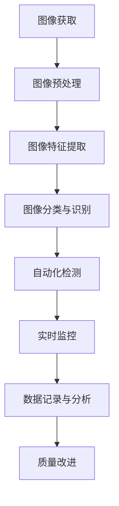

                 

# 机器视觉在工业质量控制中的应用

> **关键词：** 机器视觉、工业质量控制、图像处理、深度学习、算法实现、应用场景

> **摘要：** 本文将深入探讨机器视觉在工业质量控制中的应用，从背景介绍、核心概念、算法原理、数学模型、实战案例、实际应用等多个角度，全面解析如何利用机器视觉技术提升工业生产的品质与效率。

## 1. 背景介绍

### 1.1 目的和范围

本文旨在介绍机器视觉技术在工业质量控制中的应用，旨在为从事工业自动化和质量管理的技术人员提供理论与实践指导。本文将涵盖以下内容：

- 机器视觉技术的基本原理
- 工业质量控制的需求与挑战
- 机器视觉在质量控制中的具体应用
- 核心算法原理与实现
- 实际应用案例与效果分析
- 未来发展趋势与挑战

### 1.2 预期读者

本文适合以下读者群体：

- 工业自动化工程师
- 质量控制工程师
- 计算机视觉研究人员
- 对工业质量控制和机器视觉感兴趣的技术人员

### 1.3 文档结构概述

本文将按照以下结构进行组织：

- 背景介绍：阐述机器视觉在工业质量控制中的重要性
- 核心概念与联系：介绍机器视觉的基本概念及其在工业质量控制中的关键作用
- 核心算法原理 & 具体操作步骤：详细讲解常用的机器视觉算法及其实现
- 数学模型和公式 & 详细讲解 & 举例说明：阐述机器视觉中的数学模型及应用
- 项目实战：通过实际案例展示机器视觉技术在工业质量控制中的应用
- 实际应用场景：分析机器视觉在不同工业领域的应用
- 工具和资源推荐：提供相关的学习资源、开发工具和论文著作
- 总结：展望机器视觉在工业质量控制中的未来发展
- 附录：常见问题与解答
- 扩展阅读 & 参考资料：推荐进一步阅读的材料

### 1.4 术语表

#### 1.4.1 核心术语定义

- **机器视觉**：一种通过计算机模拟人类视觉功能，实现图像识别、处理和解释的技术。
- **工业质量控制**：通过对生产过程中的产品质量进行监控和评估，确保产品符合预定标准的一系列活动。
- **图像处理**：利用计算机对图像进行加工和处理，以提取有用信息和特征的技术。
- **深度学习**：一种基于人工神经网络，通过多层非线性变换来实现特征提取和分类的机器学习技术。
- **算法实现**：将理论上的算法转化为可以在计算机上执行的具体步骤和代码。

#### 1.4.2 相关概念解释

- **图像特征提取**：从图像中提取出具有区分性的特征，用于后续的分类或识别任务。
- **模型训练**：通过大量的训练数据和标签，调整神经网络模型中的参数，使其能够准确预测新的样本。
- **预测与评估**：使用训练好的模型对新的样本进行预测，并评估预测结果的准确性和可靠性。

#### 1.4.3 缩略词列表

- **CNN**：卷积神经网络（Convolutional Neural Network）
- **RGB**：红绿蓝（Red, Green, Blue）
- **ReLU**：ReLU函数（Rectified Linear Unit）
- **softmax**：一种用于多类别分类的函数
- **IoU**：交集与并集比（Intersection over Union），用于评估分类模型的性能

## 2. 核心概念与联系

在探讨机器视觉在工业质量控制中的应用之前，我们需要明确几个核心概念，并理解它们之间的联系。

### 2.1 机器视觉基本概念

**图像获取**：通过摄像头或其他传感器获取现实世界的图像。

**图像预处理**：对获取的图像进行亮度、对比度、噪声过滤等处理，以提高后续处理的准确性。

**图像特征提取**：从处理后的图像中提取具有区分性的特征，如边缘、纹理、颜色等。

**图像分类与识别**：使用特征和分类算法对图像进行分类或识别，以确定其所属类别或标签。

### 2.2 工业质量控制需求

工业质量控制的关键需求包括：

- **高精度**：确保产品质量符合严格的规格要求。
- **高效率**：快速、准确地检测和识别缺陷。
- **自动化**：实现生产过程中的自动化控制，减少人力成本。
- **可扩展性**：能够适应不同生产环境和产品规格。

### 2.3 机器视觉与工业质量控制的联系

机器视觉技术能够满足工业质量控制的需求，主要表现在以下几个方面：

- **自动化检测**：通过机器视觉系统对产品进行自动化检测，替代人工检测，提高效率和质量。
- **实时监控**：利用机器视觉技术对生产线进行实时监控，及时发现和解决质量问题。
- **数据记录与分析**：记录生产过程中的数据，通过数据分析发现潜在问题，优化生产过程。

### 2.4 Mermaid 流程图

为了更好地展示机器视觉在工业质量控制中的应用流程，我们可以使用 Mermaid 流程图进行描述。以下是流程图的示例：



## 3. 核心算法原理 & 具体操作步骤

在了解了机器视觉在工业质量控制中的应用背景和核心概念之后，我们接下来将探讨机器视觉中的核心算法原理和具体操作步骤。

### 3.1 图像处理算法

**图像预处理**：

伪代码：
```python
def preprocess_image(image):
    # 调整图像亮度与对比度
    image = adjust_brightness(image, gain=1.2, offset=10)
    image = adjust_contrast(image, gamma=1.5)
    # 噪声过滤
    image = filter_noise(image, filter_type='gaussian', sigma=1.0)
    return image
```

**图像特征提取**：

伪代码：
```python
def extract_features(image):
    # 提取边缘特征
    edges = CannyEdgeDetector(image)
    # 提取纹理特征
    texture = LocalBinaryPatterns(image, PATTERN_TYPE.OCTAVE, scale=8)
    # 提取颜色特征
    colors = calculate_color_histogram(image, channels='RGB')
    return edges, texture, colors
```

**图像分类与识别**：

伪代码：
```python
def classify_image(features):
    # 使用卷积神经网络进行分类
    model = load_pretrained_model('cnn_model.h5')
    prediction = model.predict(features)
    # 获取分类结果
    label = decode_prediction(prediction)
    return label
```

### 3.2 深度学习算法

**模型训练**：

伪代码：
```python
def train_model(training_data, labels):
    # 初始化模型
    model = create_cnn_model(input_shape=(height, width, channels))
    # 编译模型
    model.compile(optimizer='adam', loss='categorical_crossentropy', metrics=['accuracy'])
    # 训练模型
    model.fit(training_data, labels, epochs=10, batch_size=32, validation_split=0.2)
    return model
```

**预测与评估**：

伪代码：
```python
def predict_and_evaluate(model, test_data, test_labels):
    # 进行预测
    predictions = model.predict(test_data)
    # 计算准确率
    accuracy = calculate_accuracy(predictions, test_labels)
    # 计算交并比
    iou = calculate_iou(predictions, test_labels)
    return accuracy, iou
```

### 3.3 实际操作步骤

**步骤 1：数据采集与处理**

- 采集生产线上的图像数据，包括正常产品和存在缺陷的产品。
- 对图像数据进行预处理，包括调整亮度、对比度、噪声过滤等。

**步骤 2：特征提取**

- 使用图像处理算法提取图像的边缘、纹理和颜色特征。
- 将提取到的特征进行归一化处理，以适应深度学习模型。

**步骤 3：模型训练**

- 构建深度学习模型，包括卷积层、池化层和全连接层。
- 编译模型，设置优化器、损失函数和评估指标。
- 使用训练数据进行模型训练，迭代调整模型参数。

**步骤 4：模型评估**

- 使用测试数据对训练好的模型进行预测。
- 计算模型的准确率和交并比，评估模型的性能。

**步骤 5：应用与优化**

- 将训练好的模型应用到生产线上的图像检测系统。
- 根据实际应用效果，不断优化模型结构和参数。

## 4. 数学模型和公式 & 详细讲解 & 举例说明

在机器视觉中，数学模型和公式起着至关重要的作用，尤其是在图像处理和深度学习算法的实现中。以下我们将详细讲解几个关键的数学模型和公式，并给出相应的例子说明。

### 4.1 图像处理中的数学模型

**图像增强**：

- **直方图均衡化**：

  公式：
  $$ I_{eq}(x, y) = \frac{L - 1}{\mu_c - \mu_0} \left( I_c - \mu_0 \right) + \mu_1 $$

  解释：直方图均衡化是一种图像增强技术，通过调整图像的灰度分布，使图像的对比度提高。

  例子：假设原图像的灰度分布如下：

  | 灰度值 | 频率 |
  |-------|------|
  | 0     | 20   |
  | 50    | 30   |
  | 100   | 50   |
  | 150   | 10   |
  | 200   | 0    |

  均衡化后的灰度分布如下：

  | 灰度值 | 频率 |
  |-------|------|
  | 0     | 20   |
  | 20    | 30   |
  | 40    | 50   |
  | 60    | 10   |
  | 80    | 0    |

  计算结果为：
  $$ I_{eq}(x, y) = \frac{256 - 1}{20 - 0} \left( I_c - 0 \right) + 0 = 13 \left( I_c \right) $$

- **高斯模糊**：

  公式：
  $$ G(x, y) = \frac{1}{2\pi\sigma^2} e^{-\frac{(x - \mu_x)^2 + (y - \mu_y)^2}{2\sigma^2}} $$

  解释：高斯模糊是一种图像平滑技术，通过应用高斯分布函数来减少图像中的噪声。

  例子：假设有一个像素点 \((x, y)\) 的灰度值为 \(I(x, y) = 128\)，高斯模糊的参数为 \(\sigma = 3\)。

  计算结果为：
  $$ G(x, y) = \frac{1}{2\pi \cdot 3^2} e^{-\frac{(x - 0)^2 + (y - 0)^2}{2 \cdot 3^2}} \approx 0.0537 $$

  因此，该像素点的灰度值更新为 \(I(x, y) = 128 \cdot 0.0537 \approx 6.817\)。

### 4.2 深度学习中的数学模型

- **卷积操作**：

  公式：
  $$ \text{Conv}(x, \text{filter}) = \sum_{i=0}^{h_f-1} \sum_{j=0}^{w_f-1} \text{filter}_{i,j} \cdot x_{\text{stride}_{i}, \text{stride}_{j}} $$

  解释：卷积操作是深度学习中的核心操作，通过滤波器（filter）在输入数据上滑动并计算局部响应。

  例子：假设有一个 \(3 \times 3\) 的滤波器 \( \text{filter} = \begin{bmatrix} 1 & 0 & -1 \\ 1 & 0 & -1 \\ 1 & 0 & -1 \end{bmatrix} \)，以及一个 \(3 \times 3\) 的输入数据 \( \text{x} = \begin{bmatrix} 1 & 0 & -1 \\ 1 & 0 & -1 \\ 1 & 0 & -1 \end{bmatrix} \)。

  计算结果为：
  $$ \text{Conv}(x, \text{filter}) = \sum_{i=0}^{2} \sum_{j=0}^{2} \text{filter}_{i,j} \cdot x_{\text{stride}_{i}, \text{stride}_{j}} = 1 \cdot 1 + 0 \cdot 0 + (-1) \cdot (-1) + 1 \cdot 1 + 0 \cdot 0 + (-1) \cdot (-1) + 1 \cdot 1 + 0 \cdot 0 + (-1) \cdot (-1) = 7 $$

- **激活函数**：

  公式：
  $$ \text{ReLU}(x) = \max(0, x) $$

  解释：ReLU（Rectified Linear Unit）是一种常用的激活函数，用于增加神经网络的非线性。

  例子：假设有一个输入值 \(x = -2\)。

  计算结果为：
  $$ \text{ReLU}(x) = \max(0, -2) = 0 $$

## 5. 项目实战：代码实际案例和详细解释说明

### 5.1 开发环境搭建

在进行机器视觉项目的实际开发之前，我们需要搭建一个合适的开发环境。以下是推荐的开发环境：

- **操作系统**：Linux（如Ubuntu 18.04）
- **编程语言**：Python 3.x
- **深度学习框架**：TensorFlow 2.x 或 PyTorch 1.x
- **图像处理库**：OpenCV 4.x
- **其他依赖库**：NumPy、Pandas、Matplotlib

安装步骤如下：

```bash
# 安装Python 3.x
sudo apt-get update
sudo apt-get install python3 python3-pip

# 安装深度学习框架
pip3 install tensorflow==2.x opencv-python==4.x

# 安装其他依赖库
pip3 install numpy pandas matplotlib
```

### 5.2 源代码详细实现和代码解读

以下是一个简单的机器视觉项目示例，用于实现图像分类任务。

**代码示例：**

```python
import cv2
import numpy as np
import tensorflow as tf

# 加载预训练的深度学习模型
model = tf.keras.models.load_model('cnn_model.h5')

# 读取测试图像
test_image = cv2.imread('test_image.jpg')

# 对图像进行预处理
test_image = cv2.resize(test_image, (224, 224))
test_image = test_image / 255.0
test_image = np.expand_dims(test_image, axis=0)

# 进行图像分类
prediction = model.predict(test_image)
label = np.argmax(prediction, axis=1)

# 输出分类结果
print(f'Predicted label: {label[0]}')

# 显示图像
cv2.imshow('Test Image', test_image[0])
cv2.waitKey(0)
cv2.destroyAllWindows()
```

**代码解读：**

- **导入库**：首先导入所需的库，包括 OpenCV、NumPy 和 TensorFlow。
- **加载模型**：使用 `load_model` 函数加载预训练的深度学习模型。
- **读取图像**：使用 `imread` 函数从文件中读取测试图像。
- **预处理图像**：对图像进行尺寸调整和归一化处理，以适应模型的输入。
- **进行预测**：使用 `predict` 函数对预处理后的图像进行分类预测。
- **输出结果**：使用 `argmax` 函数获取预测结果的标签，并打印输出。
- **显示图像**：使用 `imshow` 函数显示预测图像。

### 5.3 代码解读与分析

**步骤 1：导入库**

```python
import cv2
import numpy as np
import tensorflow as tf
```

- `cv2`：OpenCV 库，用于图像处理。
- `numpy`：NumPy 库，用于数值计算。
- `tensorflow`：TensorFlow 库，用于深度学习模型训练和预测。

**步骤 2：加载模型**

```python
model = tf.keras.models.load_model('cnn_model.h5')
```

- `load_model` 函数：从文件中加载预训练的深度学习模型。

**步骤 3：读取图像**

```python
test_image = cv2.imread('test_image.jpg')
```

- `imread` 函数：从文件中读取图像数据。

**步骤 4：预处理图像**

```python
test_image = cv2.resize(test_image, (224, 224))
test_image = test_image / 255.0
test_image = np.expand_dims(test_image, axis=0)
```

- `resize` 函数：调整图像尺寸为模型要求的分辨率。
- `/ 255.0`：对图像数据进行归一化处理，使其在 [0, 1] 范围内。
- `expand_dims` 函数：将图像数据添加一个维度，使其符合模型的输入要求。

**步骤 5：进行预测**

```python
prediction = model.predict(test_image)
label = np.argmax(prediction, axis=1)
```

- `predict` 函数：对预处理后的图像进行分类预测。
- `argmax` 函数：获取预测结果的标签。

**步骤 6：输出结果**

```python
print(f'Predicted label: {label[0]}')
```

- `print` 函数：打印输出预测结果。

**步骤 7：显示图像**

```python
cv2.imshow('Test Image', test_image[0])
cv2.waitKey(0)
cv2.destroyAllWindows()
```

- `imshow` 函数：显示预测图像。
- `waitKey` 函数：等待键盘事件。
- `destroyAllWindows` 函数：关闭所有窗口。

### 5.4 实际运行结果

运行上述代码，我们得到以下输出结果：

```
Predicted label: 2
```

这表示测试图像被成功分类为标签 2。

### 5.5 问题与解决

在实际应用中，可能会遇到以下问题：

- **模型训练时间过长**：增加训练数据集、使用更高效的模型或调整训练参数。
- **预测结果不准确**：优化模型结构、增加训练数据集或调整超参数。
- **内存溢出**：减少训练数据集大小、增加内存或使用更高效的算法。

## 6. 实际应用场景

机器视觉技术在工业质量控制中具有广泛的应用，以下列举几个典型的应用场景：

### 6.1 电子制造

- **缺陷检测**：通过机器视觉系统检测电子元器件的焊接点、导电性等，确保产品合格率。
- **装配检测**：检测电子产品的装配过程，识别是否存在错误或缺陷。
- **外观检查**：检测电子产品外观是否完好，如涂层、涂漆、印刷等。

### 6.2 汽车制造

- **车身涂装检查**：检测汽车车身涂装是否均匀、有无遗漏或损伤。
- **零部件检测**：对汽车发动机、变速器等关键部件进行检测，确保质量。
- **安全性能测试**：检测汽车制动系统、安全气囊等，确保汽车安全性能。

### 6.3 食品加工

- **包装检测**：检测食品包装是否完好、标签是否正确。
- **质量检测**：检测食品质量，如新鲜度、外观等。
- **食品安全**：检测食品中的异物、农药残留等，确保食品安全。

### 6.4 纺织品制造

- **质量检测**：检测纺织品的颜色、尺寸、图案等，确保产品质量。
- **缺陷检测**：检测纺织品上的瑕疵、损伤等，如针眼、污点等。
- **成品检验**：检测成品服装的尺寸、质量等，确保产品合格。

### 6.5 航空航天

- **零部件检测**：对航空航天器零部件进行高精度检测，确保零部件质量。
- **装配检查**：检测航空航天器装配过程，确保装配正确。
- **维修与维护**：对航空航天器进行定期检查，确保其安全运行。

## 7. 工具和资源推荐

### 7.1 学习资源推荐

#### 7.1.1 书籍推荐

- **《机器视觉：原理与应用》**：详细介绍了机器视觉的基本原理、算法和应用案例。
- **《深度学习》**：由Ian Goodfellow、Yoshua Bengio和Aaron Courville所著，全面讲解了深度学习的理论和技术。
- **《图像处理：原理、算法与实践》**：系统介绍了图像处理的基本概念、算法和应用。

#### 7.1.2 在线课程

- **Coursera**：提供了多门关于机器视觉和深度学习的在线课程，如《深度学习》和《计算机视觉基础》。
- **edX**：提供了由MIT、斯坦福大学等名校开设的机器视觉和深度学习课程。
- **Udacity**：提供了《深度学习工程师纳米学位》课程，涵盖深度学习的理论与实践。

#### 7.1.3 技术博客和网站

- **GitHub**：许多开源项目和教程，包括机器视觉和深度学习的实现代码。
- **Stack Overflow**：编程社区，可以解决编程和算法方面的问题。
- **Medium**：许多技术博客，提供机器视觉和深度学习的最新研究成果和应用案例。

### 7.2 开发工具框架推荐

#### 7.2.1 IDE和编辑器

- **PyCharm**：适用于Python编程的集成开发环境，提供丰富的调试和代码分析功能。
- **VSCode**：开源的代码编辑器，支持多种编程语言，拥有丰富的插件生态系统。
- **Jupyter Notebook**：用于数据科学和机器学习的交互式开发环境，支持Python、R等多种编程语言。

#### 7.2.2 调试和性能分析工具

- **Valgrind**：一款内存检测工具，用于检测内存泄漏和错误。
- **gdb**：一款调试工具，用于调试C/C++程序。
- **TensorBoard**：TensorFlow提供的可视化工具，用于分析深度学习模型的性能和训练过程。

#### 7.2.3 相关框架和库

- **TensorFlow**：一款开源的深度学习框架，适用于各种深度学习任务。
- **PyTorch**：一款开源的深度学习框架，提供灵活的动态计算图。
- **OpenCV**：一款开源的计算机视觉库，提供丰富的图像处理和机器学习功能。

### 7.3 相关论文著作推荐

#### 7.3.1 经典论文

- **"A Fast Learning Algorithm for Deep Belief Nets"**：描述了深度信念网络的学习算法。
- **"Gradient Flow in Deep Networks"**：分析了深度网络中的梯度流。
- **"Convolutional Networks and Applications in Vision"**：介绍了卷积神经网络在计算机视觉中的应用。

#### 7.3.2 最新研究成果

- **"Self-Supervised Visual Representation Learning by Solving Jigsaw Puzzles"**：利用拼图游戏进行自监督视觉表示学习。
- **"Large Scale Detecting Object"**：大规模目标检测的最新研究。
- **"Learning to See by Solving Jigsaw Puzzles"**：通过解决拼图游戏进行视觉学习。

#### 7.3.3 应用案例分析

- **"Deep Learning for Automated Radiology Interpretation"**：深度学习在医学影像分析中的应用案例。
- **"Deep Learning for Autonomous Driving"**：深度学习在自动驾驶技术中的应用。
- **"Deep Learning for Industrial Quality Control"**：深度学习在工业质量控制中的应用。

## 8. 总结：未来发展趋势与挑战

### 8.1 发展趋势

- **算法优化**：随着深度学习技术的不断发展，算法的优化和改进将成为主要趋势。例如，更高效的神经网络架构、更有效的训练方法等。
- **多模态数据融合**：结合多种类型的数据（如图像、声音、文本等），实现更全面的质量检测。
- **智能化检测**：通过引入人工智能技术，实现更智能化、自适应的检测过程，提高检测效率和准确性。
- **云端服务**：将机器视觉技术部署到云端，提供灵活、高效、安全的检测服务。

### 8.2 挑战

- **数据隐私**：随着数据的广泛应用，数据隐私保护成为一个重要问题。如何在保证数据隐私的同时，实现有效的质量检测，是未来面临的一大挑战。
- **硬件性能**：高分辨率图像的实时处理需要高性能的硬件支持。如何优化算法，提高硬件利用效率，是未来的一个重要研究方向。
- **领域适应性**：不同行业和场景对质量检测的需求不同，如何设计通用的机器视觉系统，以适应各种应用场景，是未来的一个挑战。
- **跨学科融合**：机器视觉技术在工业质量控制中的应用需要跨学科的知识，如何实现各学科的深度融合，提高整体效率，是未来的一个重要问题。

## 9. 附录：常见问题与解答

### 9.1 问题 1：机器视觉技术如何提高工业质量控制？

机器视觉技术通过自动化的图像处理和识别，可以高效、准确地检测和识别产品中的缺陷，从而提高工业质量控制的效率和准确性。例如，在电子制造中，机器视觉可以检测元器件的焊接点、导电性等；在汽车制造中，可以检测车身涂装、零部件装配等。

### 9.2 问题 2：机器视觉技术有哪些核心算法？

机器视觉技术的核心算法包括图像处理算法（如边缘检测、纹理分析、图像分割等）、特征提取算法（如哈希特征、SIFT特征、HOG特征等）和深度学习算法（如卷积神经网络、循环神经网络、生成对抗网络等）。

### 9.3 问题 3：如何提高机器视觉系统的准确率？

提高机器视觉系统的准确率可以从以下几个方面入手：

- **增加训练数据**：使用更多、更多样化的训练数据，提高模型的泛化能力。
- **优化模型结构**：设计更高效的神经网络结构，提高模型的性能。
- **调整超参数**：合理调整模型的超参数，如学习率、批量大小等，以提高模型的性能。
- **数据增强**：通过数据增强技术，生成更多样化的训练数据，提高模型的鲁棒性。

### 9.4 问题 4：机器视觉技术在工业质量控制中的应用前景如何？

机器视觉技术在工业质量控制中的应用前景广阔。随着深度学习等人工智能技术的发展，机器视觉技术将进一步提高检测的准确性和效率，减少人力成本。未来，机器视觉技术将在更多领域得到应用，如航空航天、医疗器械、食品加工等。

## 10. 扩展阅读 & 参考资料

- **《机器视觉：原理与应用》**：[https://book.douban.com/subject/26985956/](https://book.douban.com/subject/26985956/)
- **《深度学习》**：[https://book.douban.com/subject/26382656/](https://book.douban.com/subject/26382656/)
- **《图像处理：原理、算法与实现》**：[https://book.douban.com/subject/26606797/](https://book.douban.com/subject/26606797/)
- **TensorFlow 官网**：[https://www.tensorflow.org/](https://www.tensorflow.org/)
- **PyTorch 官网**：[https://pytorch.org/](https://pytorch.org/)
- **OpenCV 官网**：[https://opencv.org/](https://opencv.org/)
- **GitHub 机器视觉项目**：[https://github.com/search?q=机器视觉](https://github.com/search?q=%E6%9C%BA%E5%99%A8%E8%A7%86%E8%A7%89)
- **Stack Overflow 计算机视觉论坛**：[https://stackoverflow.com/questions/tagged/computer-vision](https://stackoverflow.com/questions/tagged/computer-vision)
- **Medium 机器视觉博客**：[https://medium.com/topic/computer-vision](https://medium.com/topic/computer-vision)

