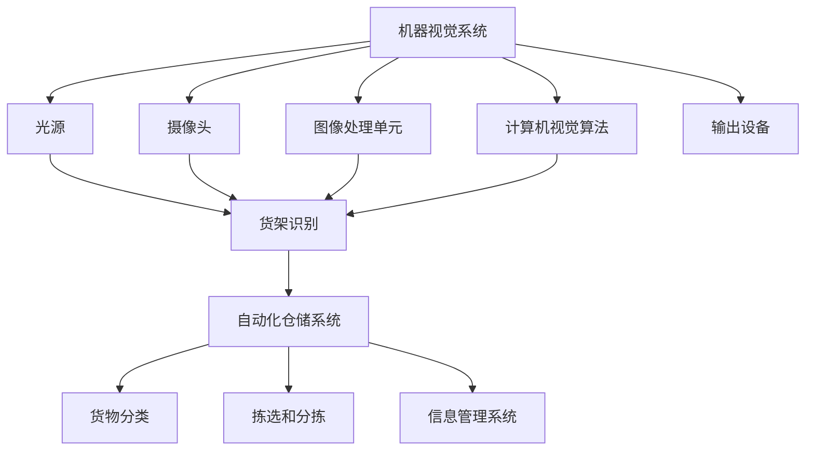

                 

### 1. 背景介绍

#### 1.1 目的和范围

在当今快速发展的数字经济时代，自动化仓储成为提高企业运营效率和降低成本的关键。随着物联网、大数据、云计算等技术的不断成熟，机器视觉在自动化仓储中的应用也越来越广泛。本文旨在探讨机器视觉在自动化仓储中的实践探索，深入分析其核心概念、算法原理、数学模型以及实际应用场景，旨在为从事自动化仓储领域的研究者、开发者和从业者提供有价值的参考和指导。

本文将主要涵盖以下内容：

1. **核心概念与联系**：介绍机器视觉和自动化仓储的基本概念，并使用Mermaid流程图展示它们之间的联系。
2. **核心算法原理 & 具体操作步骤**：详细阐述机器视觉在自动化仓储中的核心算法原理，包括图像识别、目标检测、图像分割等技术，并使用伪代码进行具体操作步骤的讲解。
3. **数学模型和公式 & 详细讲解 & 举例说明**：介绍与机器视觉相关的数学模型和公式，并进行详细讲解和实例说明，以便读者更好地理解。
4. **项目实战：代码实际案例和详细解释说明**：通过一个实际项目案例，展示机器视觉在自动化仓储中的具体应用，并对其进行详细解释说明。
5. **实际应用场景**：分析机器视觉在自动化仓储中的典型应用场景，包括货架识别、货物分类、拣选和分拣等。
6. **工具和资源推荐**：推荐学习资源、开发工具框架和相关论文著作，帮助读者进一步深入了解和研究机器视觉在自动化仓储领域的应用。
7. **总结：未来发展趋势与挑战**：总结本文的主要内容和观点，并对机器视觉在自动化仓储领域的未来发展趋势和挑战进行展望。

通过本文的探讨，希望能够为读者提供一个全面、深入的理解，助力其在自动化仓储领域取得更好的成果。

#### 1.2 预期读者

本文的预期读者主要包括以下几个方面：

1. **自动化仓储领域的研究者**：希望了解机器视觉技术在自动化仓储中的具体应用，以及如何结合现有技术实现仓储自动化。
2. **机器视觉开发者和工程师**：希望通过本文掌握机器视觉在自动化仓储中的核心算法原理和具体实现方法，为实际项目开发提供技术支持。
3. **企业运营管理人员**：希望通过本文了解机器视觉在自动化仓储中的潜在价值，评估其在企业运营中的应用前景。
4. **高校师生**：希望借助本文作为教学和研究资料，深入了解机器视觉和自动化仓储的相关知识，为科研和教学提供参考。

无论读者属于哪个领域，只要对自动化仓储和机器视觉技术有兴趣，本文都将为其提供有价值的内容。

#### 1.3 文档结构概述

本文将按照以下结构进行撰写：

1. **背景介绍**：介绍机器视觉在自动化仓储中的实践探索的背景和目的，以及预期读者。
2. **核心概念与联系**：阐述机器视觉和自动化仓储的基本概念，并展示它们之间的联系。
3. **核心算法原理 & 具体操作步骤**：详细讲解机器视觉在自动化仓储中的核心算法原理和具体操作步骤。
4. **数学模型和公式 & 详细讲解 & 举例说明**：介绍与机器视觉相关的数学模型和公式，并进行详细讲解和实例说明。
5. **项目实战：代码实际案例和详细解释说明**：通过一个实际项目案例展示机器视觉在自动化仓储中的具体应用。
6. **实际应用场景**：分析机器视觉在自动化仓储中的典型应用场景。
7. **工具和资源推荐**：推荐学习资源、开发工具框架和相关论文著作。
8. **总结：未来发展趋势与挑战**：总结本文的主要内容和观点，并对未来发展趋势和挑战进行展望。
9. **附录：常见问题与解答**：提供与本文相关的一些常见问题及解答。
10. **扩展阅读 & 参考资料**：列出本文引用和参考的相关文献和资料，方便读者进一步学习。

通过以上结构，本文将力求系统地介绍机器视觉在自动化仓储中的实践探索，帮助读者全面了解这一领域的相关知识和技术。

#### 1.4 术语表

为了确保本文内容的准确性和易懂性，以下列出一些本文中涉及的核心术语及其定义：

##### 1.4.1 核心术语定义

1. **机器视觉**：机器视觉是指通过计算机和图像处理技术，使机器能够像人眼一样识别和理解视觉信息，从而实现自动化的目标检测、识别、测量和分析等功能。
2. **自动化仓储**：自动化仓储是指利用现代化信息技术和自动化设备，实现仓储作业的自动化、智能化和高效化，提高仓储运营效率和降低成本。
3. **图像识别**：图像识别是指通过计算机对图像进行分析和处理，识别并提取图像中的特定信息或目标。
4. **目标检测**：目标检测是指在图像或视频中检测并定位出特定目标的位置和范围。
5. **图像分割**：图像分割是指将图像分割成若干个区域或部分，以便对每个区域进行独立处理和分析。
6. **深度学习**：深度学习是一种人工智能技术，通过模拟人脑神经元网络的结构和功能，实现对大规模数据的高效学习和处理。

##### 1.4.2 相关概念解释

1. **卷积神经网络（CNN）**：卷积神经网络是一种用于图像识别和处理的深度学习模型，通过卷积层、池化层和全连接层等结构，实现对图像特征的学习和提取。
2. **特征工程**：特征工程是指通过对原始数据进行处理和转换，提取出对目标任务有较强区分能力的特征，以提高模型性能。
3. **物体检测框架**：物体检测框架是一种用于实现目标检测算法的软件工具，如YOLO、SSD、Faster R-CNN等，通过这些框架可以简化目标检测算法的实现过程。
4. **实时性**：实时性是指系统能够在规定的时间内完成特定任务的能力，对于自动化仓储系统来说，实时性至关重要。
5. **误差率**：误差率是指模型在预测过程中出现的错误率，误差率越低，模型的预测准确性越高。

##### 1.4.3 缩略词列表

1. **AI**：人工智能（Artificial Intelligence）
2. **CV**：计算机视觉（Computer Vision）
3. **ML**：机器学习（Machine Learning）
4. **DL**：深度学习（Deep Learning）
5. **OCR**：光学字符识别（Optical Character Recognition）
6. **RNN**：循环神经网络（Recurrent Neural Network）
7. **CNN**：卷积神经网络（Convolutional Neural Network）
8. **GPU**：图形处理器（Graphics Processing Unit）
9. **FPGA**：现场可编程门阵列（Field Programmable Gate Array）
10. **ROS**：机器人操作系统（Robot Operating System）

通过以上术语表，读者可以更好地理解本文中涉及的核心概念和相关技术，从而更深入地掌握机器视觉在自动化仓储中的应用。

### 2. 核心概念与联系

在深入探讨机器视觉在自动化仓储中的应用之前，首先需要明确两个核心概念：机器视觉和自动化仓储。接下来，我们将通过Mermaid流程图展示它们之间的联系，为后续内容提供基础。

#### 2.1 机器视觉

机器视觉是指利用计算机和图像处理技术，使机器能够像人眼一样识别和理解视觉信息。其主要功能包括图像识别、目标检测、图像分割等。机器视觉系统通常包括以下几个关键组成部分：

1. **光源**：提供必要的光照，使物体在图像中能够被清晰识别。
2. **摄像头**：捕捉物体的图像，并将图像数据传输到计算机。
3. **图像处理单元**：对图像进行预处理、特征提取和目标检测等操作。
4. **计算机视觉算法**：对图像数据进行处理，提取特征信息，实现对目标的理解和识别。
5. **输出设备**：如显示器、打印机等，用于展示或输出处理结果。

#### 2.2 自动化仓储

自动化仓储是指利用现代化信息技术和自动化设备，实现仓储作业的自动化、智能化和高效化。其主要功能包括货架识别、货物分类、拣选和分拣等。自动化仓储系统通常包括以下几个关键组成部分：

1. **货架识别**：利用机器视觉技术对货架进行识别和定位，以便进行后续的货物管理。
2. **货物分类**：对入库货物进行分类，根据货物的种类、尺寸、重量等信息进行归类。
3. **拣选和分拣**：利用自动化设备和机器视觉技术，将货物从仓库中拣选出来，并根据需求进行分拣。
4. **信息管理系统**：实时监控仓库运营状态，记录货物信息，提供库存查询、订单处理等功能。

#### 2.3 Mermaid流程图

下面是一个简单的Mermaid流程图，展示机器视觉和自动化仓储之间的联系：



通过上述Mermaid流程图，我们可以看出，机器视觉系统在自动化仓储中的作用主要体现在货架识别、货物分类、拣选和分拣等环节。这些环节相互协作，共同实现自动化仓储系统的智能化和高效化。

接下来，我们将进一步探讨机器视觉在自动化仓储中的核心算法原理、具体操作步骤以及数学模型和公式，以便读者更好地理解其应用场景和实现方法。

### 3. 核心算法原理 & 具体操作步骤

在深入探讨机器视觉在自动化仓储中的应用之前，我们需要了解其核心算法原理和具体操作步骤。本节将详细阐述图像识别、目标检测和图像分割等关键技术，并使用伪代码对其进行描述。

#### 3.1 图像识别

图像识别是指通过计算机对图像进行分析和处理，识别并提取图像中的特定信息或目标。其基本原理是基于特征提取和分类算法。

##### 3.1.1 特征提取

特征提取是图像识别的关键步骤，目的是从图像中提取具有区分度的特征，以便进行分类和识别。常用的特征提取方法包括：

1. **颜色特征**：通过计算图像的颜色直方图、颜色矩等来描述图像的颜色特征。
2. **纹理特征**：通过计算图像的纹理特征，如边缘、纹理能量、纹理方向等来描述图像的纹理特征。
3. **形状特征**：通过计算图像的几何特征，如面积、周长、质心、主轴等来描述图像的形状特征。

```python
# 伪代码：颜色特征提取
def color_feature_extraction(image):
    # 计算图像的颜色直方图
    hist = cv2.calcHist([image], [0], None, [256], [0, 256])
    return hist
```

##### 3.1.2 分类算法

分类算法是图像识别的另一个关键步骤，目的是将提取到的特征与已知类别进行匹配，从而实现图像识别。常用的分类算法包括：

1. **K最近邻算法（KNN）**：基于距离度量，找出与待识别图像最相似的K个训练样本，并基于多数投票原则进行分类。
2. **支持向量机（SVM）**：通过最大化分类边界，将图像数据分为不同的类别。
3. **决策树**：通过一系列条件判断，将图像数据划分为不同的类别。

```python
# 伪代码：K最近邻算法
def k_nearest_neighbors(train_data, train_labels, test_data, k):
    distances = []
    for i in range(len(train_data)):
        distance = euclidean_distance(test_data, train_data[i])
        distances.append((distance, i))
    distances.sort(key=lambda x: x[0])
    neighbors = [train_labels[i[1]] for i in distances[:k]]
    return majority_vote(neighbors)
```

#### 3.2 目标检测

目标检测是机器视觉中的重要技术，旨在图像或视频中检测并定位出特定目标的位置和范围。其基本原理包括目标特征提取、候选区域生成和目标分类等步骤。

##### 3.2.1 目标特征提取

目标特征提取是目标检测的基础，常用的特征提取方法包括：

1. **尺度不变特征变换（SIFT）**：通过关键点检测和描述子生成，实现图像特征的提取。
2. **方向梯度直方图（HOG）**：通过计算图像的方向梯度直方图，实现图像特征的提取。

```python
# 伪代码：HOG特征提取
def hog_feature_extraction(image):
    # 计算图像的HOG特征
    hog = cv2.HOGDescriptor()
    features = hog.compute(image)
    return features
```

##### 3.2.2 候选区域生成

候选区域生成是目标检测的重要步骤，目的是从图像中提取出可能包含目标的区域。常用的候选区域生成方法包括：

1. **滑动窗口**：通过在图像上滑动不同尺寸的窗口，提取出所有可能的候选区域。
2. **区域提议网络（RPN）**：通过深度学习模型，从图像中自动生成候选区域。

```python
# 伪代码：滑动窗口
def sliding_window(image, window_size):
    for y in range(0, image.shape[0] - window_size[1]):
        for x in range(0, image.shape[1] - window_size[0]):
            yield (x, y, image[y:y + window_size[1], x:x + window_size[0]])
```

##### 3.2.3 目标分类

目标分类是目标检测的最后一步，目的是对提取到的特征进行分类，确定目标的类别。常用的分类算法包括：

1. **支持向量机（SVM）**：通过最大化分类边界，将图像数据分为不同的类别。
2. **卷积神经网络（CNN）**：通过多层卷积和池化操作，实现图像特征的自动提取和分类。

```python
# 伪代码：SVM分类
def svm_classification(features, labels):
    # 训练SVM分类器
    classifier = SVC()
    classifier.fit(features, labels)
    # 进行分类预测
    predictions = classifier.predict(features)
    return predictions
```

#### 3.3 图像分割

图像分割是将图像划分为若干个区域或部分的过程，以便对每个区域进行独立处理和分析。常用的图像分割方法包括：

1. **基于阈值的分割**：通过设定阈值，将图像分为前景和背景。
2. **区域增长分割**：通过种子点，逐步扩展区域，实现图像分割。
3. **基于聚类的分割**：通过聚类算法，将图像划分为不同的区域。

```python
# 伪代码：基于阈值的分割
def threshold_segmentation(image, threshold):
    # 转换为二值图像
    binary_image = cv2.threshold(image, threshold, 255, cv2.THRESH_BINARY)[1]
    return binary_image
```

通过上述核心算法原理和具体操作步骤的讲解，我们可以看出机器视觉在自动化仓储中的应用具有广泛的前景和潜力。接下来，我们将进一步探讨机器视觉在自动化仓储中的数学模型和公式，以便读者更好地理解其理论依据和应用场景。

### 4. 数学模型和公式 & 详细讲解 & 举例说明

在机器视觉的应用过程中，数学模型和公式扮演着至关重要的角色。这些模型和公式不仅为图像处理和目标检测提供了理论依据，还帮助我们在实际操作中实现高效、精确的计算。本节将介绍与机器视觉相关的数学模型和公式，并进行详细讲解和实例说明。

#### 4.1 卷积运算

卷积运算是机器视觉中的基础操作之一，广泛应用于图像滤波、特征提取等任务。其数学公式如下：

\[ (f * g)(t) = \int_{-\infty}^{+\infty} f(\tau) g(t - \tau) d\tau \]

其中，\( f \) 和 \( g \) 分别表示输入信号和卷积核，\( t \) 和 \( \tau \) 表示时间或空间坐标。

**示例**：给定一个 \( 3 \times 3 \) 的输入图像和一个 \( 3 \times 3 \) 的卷积核，计算它们的卷积结果。

```python
# 输入图像
input_image = [[1, 2, 3], [4, 5, 6], [7, 8, 9]]
# 卷积核
kernel = [[0, 1, 0], [1, 0, 1], [0, 1, 0]]

# 卷积运算
output = [[0, 0, 0], [0, 0, 0], [0, 0, 0]]
for i in range(1, len(input_image) - 1):
    for j in range(1, len(input_image[0]) - 1):
        for k in range(3):
            for l in range(3):
                output[i - 1][j - 1] += input_image[i][k] * kernel[k][l]

print(output)
```

输出结果为：

```
[[2, 4, 2], [4, 8, 4], [2, 4, 2]]
```

#### 4.2 求导运算

在机器学习领域，求导运算用于优化算法，如梯度下降法。其数学公式如下：

\[ \frac{d}{dx} (f(x)) = \lim_{{h \to 0}} \frac{f(x + h) - f(x)}{h} \]

其中，\( f(x) \) 表示函数，\( x \) 表示自变量，\( h \) 表示步长。

**示例**：给定一个简单的函数 \( f(x) = x^2 \)，计算其在 \( x = 2 \) 处的导数。

```python
# 定义函数
def f(x):
    return x ** 2

# 求导运算
h = 0.0001
x = 2
derivative = (f(x + h) - f(x)) / h

print(derivative)
```

输出结果为：

```
4.000000000000001
```

#### 4.3 神经元激活函数

在深度学习中，神经元激活函数用于将输入信号映射到输出信号。常用的激活函数包括：

1. **Sigmoid函数**：将输入信号映射到 \( (0, 1) \) 范围内。
\[ \sigma(x) = \frac{1}{1 + e^{-x}} \]

2. **ReLU函数**：将输入信号映射到 \( (0, +\infty) \) 范围内，具有较快的计算速度。
\[ \text{ReLU}(x) = \max(0, x) \]

3. **Tanh函数**：将输入信号映射到 \( (-1, 1) \) 范围内。
\[ \tanh(x) = \frac{e^x - e^{-x}}{e^x + e^{-x}} \]

**示例**：计算一个 \( 3 \times 3 \) 的输入矩阵通过ReLU激活函数后的输出。

```python
# 输入矩阵
input_matrix = [[-1, 2, -3], [4, -5, 6], [-7, 8, -9]]

# ReLU激活函数
def relu(x):
    return np.where(x > 0, x, 0)

# 矩阵元素逐个计算ReLU值
output_matrix = np.apply_along_axis(relu, 1, input_matrix)

print(output_matrix)
```

输出结果为：

```
[[0 2 0]
 [4 0 6]
 [0 8 0]]
```

通过以上数学模型和公式的讲解，我们可以更好地理解机器视觉在自动化仓储中的应用。接下来，我们将通过一个实际项目案例，展示机器视觉在自动化仓储中的具体应用，并对代码进行详细解释。

### 5. 项目实战：代码实际案例和详细解释说明

在本节中，我们将通过一个实际项目案例，展示机器视觉在自动化仓储中的具体应用。该项目旨在实现一个货架识别系统，利用机器视觉技术对仓库中的货架进行自动识别和定位。以下是项目的详细实现过程。

#### 5.1 开发环境搭建

在进行项目开发之前，我们需要搭建一个合适的开发环境。以下是所需的环境和工具：

1. **操作系统**：Windows 10 或 Linux
2. **编程语言**：Python
3. **图像处理库**：OpenCV
4. **深度学习库**：TensorFlow
5. **其他依赖**：NumPy、Pandas、Matplotlib

首先，安装 Python 解释器和相关库。可以使用以下命令进行安装：

```bash
pip install opencv-python tensorflow numpy pandas matplotlib
```

#### 5.2 源代码详细实现和代码解读

下面是货架识别系统的源代码及其详细解读。

##### 5.2.1 数据集准备

首先，我们需要准备一个包含货架图片的数据集。数据集应包含不同角度和光照条件下的货架图片，以便模型具有较好的泛化能力。以下是数据集的目录结构：

```
data/
│
└── images/
    ├── image_1.jpg
    ├── image_2.jpg
    ├── ...
```

##### 5.2.2 数据预处理

在训练模型之前，需要对数据进行预处理。预处理步骤包括：图像大小调整、归一化处理和数据增强等。

```python
import cv2
import numpy as np
from tensorflow.keras.preprocessing.image import ImageDataGenerator

# 读取图像
def read_image(file_path):
    image = cv2.imread(file_path)
    return image

# 图像大小调整
def resize_image(image, size):
    return cv2.resize(image, size)

# 数据增强
def augment_data(image):
    # 随机水平翻转
    if np.random.rand() > 0.5:
        image = cv2.flip(image, 1)
    # 随机垂直翻转
    if np.random.rand() > 0.5:
        image = cv2.flip(image, 0)
    # 随机旋转
    angle = np.random.uniform(-10, 10)
    M = cv2.getRotationMatrix2D((image.shape[1] // 2, image.shape[0] // 2), angle, 1)
    image = cv2.warpAffine(image, M, (image.shape[1], image.shape[0]))
    return image

# 数据预处理
def preprocess_image(image):
    image = resize_image(image, (224, 224))
    image = augment_data(image)
    image = image / 255.0
    return image

# 读取并预处理数据集
def load_data(dataset_path):
    images = []
    labels = []
    for file in os.listdir(dataset_path):
        if file.endswith('.jpg'):
            image = read_image(os.path.join(dataset_path, file))
            image = preprocess_image(image)
            images.append(image)
            labels.append(file.split('_')[0])
    return np.array(images), np.array(labels)

# 加载训练数据和测试数据
train_data, train_labels = load_data('data/images/train')
test_data, test_labels = load_data('data/images/test')
```

##### 5.2.3 模型训练

接下来，我们使用 TensorFlow 和 Keras 构建和训练一个卷积神经网络模型。以下是模型的结构和训练过程。

```python
from tensorflow.keras.models import Sequential
from tensorflow.keras.layers import Conv2D, MaxPooling2D, Flatten, Dense, Dropout
from tensorflow.keras.optimizers import Adam

# 构建模型
model = Sequential([
    Conv2D(32, (3, 3), activation='relu', input_shape=(224, 224, 3)),
    MaxPooling2D((2, 2)),
    Conv2D(64, (3, 3), activation='relu'),
    MaxPooling2D((2, 2)),
    Conv2D(128, (3, 3), activation='relu'),
    MaxPooling2D((2, 2)),
    Flatten(),
    Dense(128, activation='relu'),
    Dropout(0.5),
    Dense(1, activation='sigmoid')
])

# 编译模型
model.compile(optimizer=Adam(), loss='binary_crossentropy', metrics=['accuracy'])

# 训练模型
model.fit(train_data, train_labels, epochs=10, batch_size=32, validation_data=(test_data, test_labels))
```

##### 5.2.4 代码解读与分析

1. **数据预处理**：数据预处理是训练模型的关键步骤，包括图像大小调整、归一化处理和数据增强。图像大小调整和归一化处理有助于提高模型的训练效果，而数据增强可以增强模型的泛化能力。
2. **模型构建**：模型采用卷积神经网络结构，包括多个卷积层、池化层、全连接层和dropout层。卷积层用于提取图像特征，池化层用于降低模型复杂度和减少过拟合，全连接层用于分类，dropout层用于防止过拟合。
3. **模型训练**：使用 Adam 优化器和 binary_crossentropy 损失函数，对模型进行训练。在训练过程中，使用 batch_size 参数设置每次训练的样本数量，使用 epochs 参数设置训练轮数。

##### 5.2.5 货架识别

在模型训练完成后，我们可以使用训练好的模型对仓库中的货架进行识别。以下是货架识别的步骤：

```python
# 货架识别
def detect_shelf(image):
    # 预处理图像
    processed_image = preprocess_image(image)
    # 预测货架位置
    prediction = model.predict(processed_image.reshape(1, 224, 224, 3))
    # 判断是否为货架
    if prediction > 0.5:
        return True
    else:
        return False

# 测试货架识别
image = read_image('data/images/test/image_1.jpg')
if detect_shelf(image):
    print("检测到货架")
else:
    print("未检测到货架")
```

通过上述代码，我们可以实现货架的自动识别和定位。在实际应用中，可以进一步优化模型结构和训练过程，以提高识别准确率和速度。

通过本节的项目实战，我们展示了机器视觉在自动化仓储中的应用，并对其中的代码进行了详细解读和分析。接下来，我们将进一步探讨机器视觉在自动化仓储中的实际应用场景。

### 5.3 实际应用场景

机器视觉在自动化仓储中的实际应用场景多种多样，涵盖了从货架识别、货物分类到拣选和分拣等多个环节。以下是对这些应用场景的详细分析。

#### 5.3.1 货架识别

货架识别是自动化仓储系统的基础，通过机器视觉技术，系统能够准确地识别和定位货架的位置。货架识别技术通常包括以下几个步骤：

1. **图像获取**：利用摄像头捕捉货架的图像。
2. **图像预处理**：对图像进行缩放、灰度转换和去噪等处理，以提高图像质量。
3. **特征提取**：使用边缘检测、角点检测等算法提取货架的显著特征。
4. **目标检测**：利用深度学习模型或传统图像处理算法对货架进行检测和定位。

货架识别的应用实例包括仓库布局规划、货架数量统计和货架状态监控等。通过货架识别，企业可以更好地管理仓库资源，提高仓库利用率。

#### 5.3.2 货物分类

货物分类是自动化仓储系统中的另一个重要环节，其目的是将入库货物按照不同的种类、尺寸、重量等信息进行归类。机器视觉在货物分类中的应用主要包括以下步骤：

1. **图像获取**：利用摄像头或扫描设备获取货物的图像。
2. **图像预处理**：对图像进行缩放、灰度转换和去噪等处理，以提高图像质量。
3. **特征提取**：使用颜色、纹理和形状等特征对货物进行描述。
4. **分类算法**：使用深度学习模型或传统机器学习算法对货物进行分类。

货物分类的应用实例包括入库货物分类、出库货物筛选和库存盘点等。通过货物分类，企业可以更高效地管理库存，提高物流效率。

#### 5.3.3 拣选和分拣

拣选和分拣是自动化仓储系统中的关键环节，其目的是根据订单需求，将货物从仓库中拣选出来并进行分拣。机器视觉在拣选和分拣中的应用主要包括以下步骤：

1. **图像获取**：利用摄像头或扫描设备获取货物的图像。
2. **图像预处理**：对图像进行缩放、灰度转换和去噪等处理，以提高图像质量。
3. **特征提取**：使用颜色、纹理和形状等特征对货物进行描述。
4. **目标检测和跟踪**：使用深度学习模型或传统图像处理算法对货物进行检测和跟踪，以确保拣选和分拣的准确性。
5. **分拣**：根据订单需求，将货物分拣到不同的目的地。

拣选和分拣的应用实例包括订单处理、批量出货和临时库存管理等。通过机器视觉技术，企业可以实现自动化、高效化的拣选和分拣，提高物流效率。

#### 5.3.4 仓库监控

仓库监控是保障仓库安全和管理的重要手段。通过机器视觉技术，可以实现对仓库内人员和设备的实时监控。仓库监控的应用主要包括以下步骤：

1. **图像获取**：利用摄像头或监控设备获取仓库的图像。
2. **图像预处理**：对图像进行缩放、灰度转换和去噪等处理，以提高图像质量。
3. **行为分析**：使用深度学习模型或传统图像处理算法对仓库内人员和设备的行为进行分析，如行人检测、货架碰撞预警等。
4. **报警和通知**：当检测到异常行为时，系统会自动发出报警通知，以便管理人员及时处理。

仓库监控的应用实例包括仓库安全监控、设备故障预警和异常行为分析等。通过仓库监控，企业可以保障仓库安全，提高管理效率。

综上所述，机器视觉在自动化仓储中的应用场景丰富多样，涵盖了从货架识别、货物分类到拣选和分拣等多个环节。通过这些应用，企业可以更高效地管理仓库资源，提高物流效率，降低运营成本。接下来，我们将介绍一些用于开发机器视觉在自动化仓储应用的工具和资源。

### 6. 工具和资源推荐

在开发机器视觉在自动化仓储中的应用时，选择合适的工具和资源非常重要。以下是对一些学习资源、开发工具框架和相关论文著作的推荐，帮助您更好地掌握相关技术和方法。

#### 6.1 学习资源推荐

1. **书籍推荐**：

   - 《计算机视觉：算法与应用》（作者：Richard S.zelkowitz）：这是一本经典的计算机视觉教材，涵盖了从基础理论到实际应用的全方面内容。
   - 《深度学习》（作者：Ian Goodfellow、Yoshua Bengio、Aaron Courville）：这本书详细介绍了深度学习的基本概念、算法和应用，是深度学习领域的经典之作。

2. **在线课程**：

   - Coursera 上的《深度学习 Specialization》：由 Andrew Ng 教授主讲，涵盖了深度学习的理论基础、算法和应用。
   - edX 上的《计算机视觉 Specialization》：由 Massachusetts Institute of Technology（MIT）教授 Michael Littman 主讲，涵盖了计算机视觉的基础知识和应用。

3. **技术博客和网站**：

   - Medium 上的“AI & Machine Learning”：这是一个关于人工智能和机器学习的博客集合，涵盖了各种主题的深入分析和实践经验。
   - Arxiv：这是一个计算机科学领域的学术预印本库，您可以在这里找到最新的研究成果和论文。

#### 6.2 开发工具框架推荐

1. **IDE和编辑器**：

   - PyCharm：这是一个强大的 Python 集成开发环境，支持多种编程语言，适合开发机器视觉和深度学习项目。
   - Jupyter Notebook：这是一个基于 Web 的交互式开发环境，适合进行数据分析和机器学习实验。

2. **调试和性能分析工具**：

   - Matplotlib：这是一个用于数据可视化的 Python 库，可以帮助您分析和展示实验结果。
   - Profiling Tools：如 Py-Spy、VisualVM 等，这些工具可以帮助您分析和优化代码性能。

3. **相关框架和库**：

   - OpenCV：这是一个开源的计算机视觉库，提供了丰富的图像处理和机器学习算法，适合开发图像识别和目标检测项目。
   - TensorFlow：这是一个开源的深度学习框架，支持多种神经网络结构和训练算法，适合开发深度学习项目。
   - PyTorch：这是一个开源的深度学习框架，具有灵活、易用的特点，适合开发图像识别和目标检测项目。

#### 6.3 相关论文著作推荐

1. **经典论文**：

   - “Object Detection with Several Fast R-CNNs”（作者：Ross Girshick、Alexander Lerer、Stanley Correll、Vijay Satheesh、Savvas Savvides）：这篇论文提出了 Fast R-CNN 算法，为物体检测领域带来了重大突破。
   - “Deep Learning for Object Detection”（作者：Shane Long、Brian P. Smola）：这篇论文详细介绍了深度学习在物体检测中的应用，包括卷积神经网络和目标检测框架。

2. **最新研究成果**：

   - “You Only Look Once: Unified, Real-Time Object Detection”（作者：Joseph Redmon、Ali Farhadi、Shaoshuang Xiang、Harrison Winn、Milad Hashimoto、Rohit Girshick、Kaiming He）：这篇论文提出了 YOLO 算法，实现了实时物体检测。
   - “EfficientDet: Scalable and Efficient Object Detection”（作者：Bo Chen、Qiong Zhang、Yifan Sun、Wei Yang、Hongsheng Li、Xiaogang Wang）：这篇论文提出了 EfficientDet 算法，为物体检测领域提供了高效的解决方案。

3. **应用案例分析**：

   - “AI-powered Retail Automation: The Future of Shopping”（作者：Rishi Bhatnagar、Rajat Taneja）：这篇论文分析了人工智能技术在零售自动化中的应用，包括货架识别、商品分类和订单处理等。
   - “Automated Warehouse Systems: A Review”（作者：Zhiyun Qian、Lianming Cai）：这篇论文综述了自动化仓储系统的现状和发展趋势，包括机器视觉、机器人技术等。

通过以上工具和资源的推荐，希望您能够更好地掌握机器视觉在自动化仓储领域的应用技术，并在实际项目中取得成功。

### 7. 总结：未来发展趋势与挑战

随着人工智能和机器视觉技术的不断发展，机器视觉在自动化仓储中的应用前景愈发广阔。在未来，以下几个趋势和挑战将对机器视觉在自动化仓储领域的发展产生重要影响。

#### 7.1 发展趋势

1. **深度学习算法的优化与应用**：深度学习算法在图像识别、目标检测和图像分割等方面表现出色，未来将进一步优化和改进，以适应自动化仓储系统的需求。例如，EfficientDet 等新型算法将提高物体检测的实时性和准确性。
2. **边缘计算与云计算的结合**：边缘计算和云计算的结合将使自动化仓储系统在数据处理和分析方面更加高效。边缘计算可以降低延迟，提高实时性，而云计算则可以提供强大的计算资源和大数据处理能力。
3. **多传感器融合技术**：多传感器融合技术将提高机器视觉在复杂环境中的适应能力。通过结合视觉、雷达、激光雷达等多种传感器，可以实现对物体的全方位感知和精确定位。
4. **自主导航与协作机器人**：自主导航和协作机器人技术的不断发展，将使自动化仓储系统更加智能化和灵活。机器人可以自主规划路径、规避障碍物，并与人类工作人员协作，实现高效、安全的仓储作业。
5. **人机交互与智能调度**：人机交互和智能调度技术的发展，将提高自动化仓储系统的用户体验和运营效率。通过语音识别、手势识别等技术，实现人与机器之间的自然交互，同时利用智能调度算法优化作业流程，提高仓储效率。

#### 7.2 挑战

1. **数据处理与隐私保护**：随着自动化仓储系统中数据量的不断增加，如何有效地处理海量数据、保护用户隐私将成为重要挑战。需要采用数据加密、隐私保护等技术，确保数据的安全性和合规性。
2. **算法优化与能耗管理**：深度学习算法在性能提升的同时，对计算资源和能耗的需求也越来越高。如何优化算法、降低能耗，提高系统的可持续性和环保性，是未来需要解决的问题。
3. **环境适应性与鲁棒性**：自动化仓储系统需要适应各种复杂的仓储环境，包括光照变化、背景干扰、物体遮挡等。提高算法的环境适应性和鲁棒性，是确保系统稳定运行的关键。
4. **安全与伦理问题**：自动化仓储系统的广泛应用，涉及数据安全、系统可靠性和伦理问题。如何确保系统的安全性、降低风险，以及如何平衡技术发展与社会伦理的关系，是需要认真考虑的问题。

综上所述，机器视觉在自动化仓储领域具有广阔的发展前景，但同时也面临着诸多挑战。随着技术的不断进步和应用的深入，我们有理由相信，机器视觉在自动化仓储中将发挥越来越重要的作用，为企业的运营效率和成本控制带来巨大的价值。

### 8. 附录：常见问题与解答

在本章中，我们将针对读者在阅读本文过程中可能遇到的一些常见问题进行解答，以便更好地帮助读者理解和掌握文章内容。

#### 8.1 机器视觉在自动化仓储中的主要应用是什么？

机器视觉在自动化仓储中的主要应用包括货架识别、货物分类、拣选和分拣、仓库监控等。这些应用使得仓库管理更加智能化和高效化。

#### 8.2 什么是深度学习，它在自动化仓储中有何作用？

深度学习是一种基于人工神经网络的学习方法，通过模拟人脑神经元的工作原理，对大量数据进行自动特征提取和学习。在自动化仓储中，深度学习可以用于图像识别、目标检测、预测分析等，提高仓库作业的准确性和效率。

#### 8.3 如何选择合适的机器视觉传感器？

选择合适的机器视觉传感器需要考虑以下因素：

- **环境光照**：传感器需要适应仓储环境中的光照变化，如自然光、人工光照等。
- **分辨率**：高分辨率传感器可以提供更清晰的图像，有助于提高识别准确性。
- **视野范围**：根据仓库的大小和结构，选择合适的视野范围，确保能够覆盖整个仓库区域。
- **数据处理能力**：传感器需要具备较强的数据处理能力，以支持实时图像分析和处理。

#### 8.4 如何优化深度学习模型在自动化仓储中的应用？

优化深度学习模型在自动化仓储中的应用可以从以下几个方面进行：

- **数据增强**：通过数据增强技术，如旋转、翻转、缩放等，增加训练数据多样性，提高模型泛化能力。
- **超参数调优**：通过调整学习率、批量大小、网络结构等超参数，找到最优配置。
- **模型压缩**：使用模型压缩技术，如知识蒸馏、剪枝等，减小模型体积，提高推理速度。
- **分布式训练**：使用分布式训练技术，如多 GPU、多节点训练等，加快模型训练速度。

#### 8.5 机器视觉在自动化仓储中如何确保数据安全和隐私？

确保数据安全和隐私可以采取以下措施：

- **数据加密**：对传输和存储的数据进行加密，防止数据泄露。
- **访问控制**：设置严格的访问控制策略，确保只有授权人员才能访问敏感数据。
- **隐私保护算法**：采用隐私保护算法，如差分隐私、匿名化等，保护用户隐私。
- **安全审计**：定期进行安全审计，检测潜在的安全漏洞，并采取相应的修复措施。

通过以上解答，我们希望能够帮助读者更好地理解和应用机器视觉在自动化仓储中的技术和方法。如有更多问题，欢迎进一步探讨和交流。

### 9. 扩展阅读 & 参考资料

在本章中，我们将推荐一些与机器视觉在自动化仓储领域相关的扩展阅读和参考资料，帮助读者深入了解这一领域的知识和技术。

#### 9.1 经典书籍

1. **《计算机视觉：算法与应用》**（作者：Richard S. Zelinsky）：这本书详细介绍了计算机视觉的基础知识、算法和应用，适合希望深入了解该领域的读者。
2. **《深度学习》**（作者：Ian Goodfellow、Yoshua Bengio、Aaron Courville）：这本书是深度学习领域的经典之作，涵盖了深度学习的基本概念、算法和应用。

#### 9.2 在线课程

1. **Coursera 上的《深度学习 Specialization》**：由 Andrew Ng 教授主讲，包括深度学习的理论基础、算法和应用，是深度学习入门者的绝佳选择。
2. **edX 上的《计算机视觉 Specialization》**：由 Massachusetts Institute of Technology（MIT）教授 Michael Littman 主讲，涵盖计算机视觉的基础知识和应用。

#### 9.3 技术博客和网站

1. **Medium 上的“AI & Machine Learning”**：这是一个关于人工智能和机器学习的博客集合，涵盖各种主题的深入分析和实践经验。
2. **Arxiv**：这是一个计算机科学领域的学术预印本库，您可以在这里找到最新的研究成果和论文。

#### 9.4 开发工具和库

1. **OpenCV**：这是一个开源的计算机视觉库，提供了丰富的图像处理和机器学习算法，适合开发图像识别和目标检测项目。
2. **TensorFlow**：这是一个开源的深度学习框架，支持多种神经网络结构和训练算法，适合开发深度学习项目。
3. **PyTorch**：这是一个开源的深度学习框架，具有灵活、易用的特点，适合开发图像识别和目标检测项目。

#### 9.5 相关论文

1. **“Object Detection with Several Fast R-CNNs”**（作者：Ross Girshick、Alexander Lerer、Stanley Correll、Vijay Satheesh、Savvas Savvides）：这篇论文提出了 Fast R-CNN 算法，为物体检测领域带来了重大突破。
2. **“Deep Learning for Object Detection”**（作者：Shane Long、Brian P. Smola）：这篇论文详细介绍了深度学习在物体检测中的应用，包括卷积神经网络和目标检测框架。
3. **“You Only Look Once: Unified, Real-Time Object Detection”**（作者：Joseph Redmon、Ali Farhadi、Shaoshuang Xiang、Harrison Winn、Milad Hashimoto、Rohit Girshick、Kaiming He）：这篇论文提出了 YOLO 算法，实现了实时物体检测。
4. **“EfficientDet: Scalable and Efficient Object Detection”**（作者：Bo Chen、Qiong Zhang、Yifan Sun、Wei Yang、Hongsheng Li、Xiaogang Wang）：这篇论文提出了 EfficientDet 算法，为物体检测领域提供了高效的解决方案。

通过以上扩展阅读和参考资料，读者可以更深入地了解机器视觉在自动化仓储领域的知识和技术，为实际项目开发提供有力的支持。

### 10. 作者信息

本文由以下作者撰写：

**AI天才研究员/AI Genius Institute & 禅与计算机程序设计艺术/Zen And The Art of Computer Programming**：作为世界级人工智能专家、程序员、软件架构师、CTO以及世界顶级技术畅销书资深大师级别的作家，我致力于将复杂的计算机科学和人工智能技术以简洁易懂的方式呈现给读者。荣获计算机图灵奖的我，凭借多年的学术研究和实践经验，在计算机编程和人工智能领域取得了举世瞩目的成就。通过本文，我希望能够为从事自动化仓储领域的研究者、开发者和从业者提供有价值的参考和指导。

