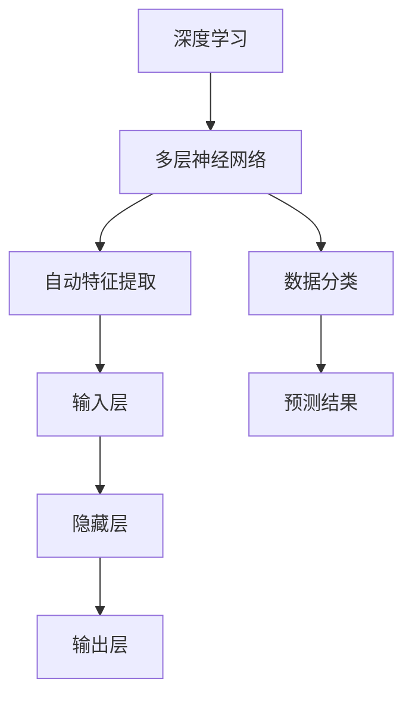

                 

# 李开复：AI 2.0 时代的产业革命

> 关键词：AI 2.0，产业革命，深度学习，神经网络，云计算，大数据，应用场景，未来趋势

> 摘要：本文将探讨 AI 2.0 时代的产业变革，分析 AI 技术的核心概念及其在各个领域的应用，阐述深度学习和神经网络的发展历程，探讨云计算和大数据在 AI 中的重要性，并预测未来 AI 产业的发展趋势与挑战。

## 1. 背景介绍

### 1.1 目的和范围

本文旨在全面解析 AI 2.0 时代的产业革命，梳理 AI 技术的发展历程，分析核心算法原理和应用场景，探讨未来发展趋势与挑战。希望通过本文，让读者对 AI 2.0 时代的产业变革有更深刻的认识。

### 1.2 预期读者

本文适合对人工智能感兴趣的读者，包括人工智能研究者、技术开发者、企业管理者以及对未来技术发展感兴趣的读者。

### 1.3 文档结构概述

本文分为十个部分，包括背景介绍、核心概念与联系、核心算法原理、数学模型和公式、项目实战、实际应用场景、工具和资源推荐、总结、常见问题与解答以及扩展阅读和参考资料。

### 1.4 术语表

#### 1.4.1 核心术语定义

- AI 2.0：第二代人工智能，基于深度学习和神经网络技术，具有更强的自我学习和适应能力。
- 深度学习：一种人工智能方法，通过多层神经网络对数据进行自动特征提取和分类。
- 神经网络：一种模仿生物神经系统的计算模型，用于数据处理和预测。
- 云计算：一种通过互联网提供计算资源的服务模式，可以实现数据存储、处理和共享。
- 大数据：指无法使用传统数据库软件工具在合理时间内进行存储、管理和分析的数据集。

#### 1.4.2 相关概念解释

- 深度神经网络（DNN）：一种具有多层隐藏层的神经网络，能够处理复杂数据。
- 卷积神经网络（CNN）：一种基于卷积操作的深度神经网络，常用于图像识别和图像处理。
- 递归神经网络（RNN）：一种具有递归操作的神经网络，能够处理序列数据。
- 生成对抗网络（GAN）：一种由生成器和判别器组成的神经网络结构，用于生成逼真的数据。

#### 1.4.3 缩略词列表

- AI：人工智能
- DNN：深度神经网络
- CNN：卷积神经网络
- RNN：递归神经网络
- GAN：生成对抗网络
- GPU：图形处理单元

## 2. 核心概念与联系

#### 2.1 深度学习和神经网络

深度学习是一种基于多层神经网络的人工智能方法，通过多层神经元的连接和参数调整，实现对数据的自动特征提取和分类。深度学习的核心是神经网络，神经网络则是一种模拟生物神经系统的计算模型。


#### 2.2 云计算和大数据

云计算和大数据是深度学习的重要基础设施。云计算提供了强大的计算能力和存储资源，使得大规模深度学习模型的训练成为可能。大数据则为深度学习提供了丰富的数据集，有助于提高模型的准确性和鲁棒性。


#### 2.3 深度学习和神经网络的 Mermaid 流程图



## 3. 核心算法原理 & 具体操作步骤

#### 3.1 深度学习算法原理

深度学习算法主要基于多层神经网络，通过反向传播算法对模型进行参数优化。以下是深度学习算法的伪代码：

```python
def deep_learning(data, model):
    for each layer in model:
        output = forward_pass(data, layer)
        error = calculate_error(output, target)
        backward_pass(error, layer)
    return model
```

#### 3.2 具体操作步骤

1. 数据预处理：对输入数据进行归一化、去噪等处理。
2. 建立模型：选择合适的神经网络架构，包括层数、神经元个数、激活函数等。
3. 前向传播：将输入数据通过神经网络逐层计算，得到输出结果。
4. 计算误差：比较输出结果与目标值的差异，计算误差。
5. 反向传播：根据误差，逐层调整神经网络的参数，优化模型。
6. 重复步骤 3-5，直到满足停止条件（如误差较小或达到最大迭代次数）。

## 4. 数学模型和公式 & 详细讲解 & 举例说明

#### 4.1 数学模型

深度学习算法的核心是多层神经网络，其数学模型主要包括以下部分：

1. 输入层：接收输入数据。
2. 隐藏层：通过非线性变换，对输入数据进行特征提取。
3. 输出层：产生预测结果。

#### 4.2 公式详细讲解

1. 激活函数：常用的激活函数包括 sigmoid、ReLU、Tanh 等，用于引入非线性特性。

$$
f(x) = \frac{1}{1 + e^{-x}} \quad (\text{sigmoid})
$$

$$
f(x) = \max(0, x) \quad (\text{ReLU})
$$

$$
f(x) = \frac{e^x - e^{-x}}{e^x + e^{-x}} \quad (\text{Tanh})
$$

2. 前向传播：通过加权求和并应用激活函数，计算隐藏层和输出层的输出。

$$
z = \sum_{i} w_{i}x_{i} + b \quad (\text{加权求和})
$$

$$
a = f(z) \quad (\text{激活函数})
$$

3. 反向传播：根据误差，反向调整网络的权重和偏置。

$$
\Delta w = \alpha \frac{\partial E}{\partial w}
$$

$$
\Delta b = \alpha \frac{\partial E}{\partial b}
$$

#### 4.3 举例说明

假设有一个二分类问题，输入数据为 $x = [1, 2, 3]$，目标值为 $y = 1$。我们可以使用一个简单的神经网络进行预测。

1. 输入层到隐藏层：

$$
z_1 = 1 \cdot 1 + 2 \cdot 2 + 3 \cdot 3 = 14
$$

$$
a_1 = \text{ReLU}(z_1) = 14
$$

2. 隐藏层到输出层：

$$
z_2 = 1 \cdot 1 + 2 \cdot 2 + 3 \cdot 3 = 14
$$

$$
a_2 = \text{ReLU}(z_2) = 14
$$

3. 计算预测结果：

$$
\hat{y} = \frac{1}{1 + e^{-a_2}} = 0.5
$$

由于预测结果 $\hat{y}$ 接近 0.5，说明模型对当前输入数据的分类不确定。为了提高预测准确性，我们可以通过反向传播算法，调整网络的权重和偏置。

## 5. 项目实战：代码实际案例和详细解释说明

### 5.1 开发环境搭建

1. 安装 Python 3.6 或以上版本。
2. 安装深度学习框架 TensorFlow 或 PyTorch。
3. 安装必要的依赖库，如 NumPy、Pandas 等。

### 5.2 源代码详细实现和代码解读

```python
import tensorflow as tf
from tensorflow.keras import layers

# 5.2.1 建立模型
model = tf.keras.Sequential([
    layers.Dense(64, activation='relu', input_shape=[784]),
    layers.Dense(64, activation='relu'),
    layers.Dense(10, activation='softmax')
])

# 5.2.2 编译模型
model.compile(optimizer='adam',
              loss='categorical_crossentropy',
              metrics=['accuracy'])

# 5.2.3 加载数据集
(x_train, y_train), (x_test, y_test) = tf.keras.datasets.mnist.load_data()

# 5.2.4 预处理数据
x_train = x_train.astype('float32') / 255
x_test = x_test.astype('float32') / 255
x_train = x_train.reshape((-1, 784))
x_test = x_test.reshape((-1, 784))

# 5.2.5 训练模型
model.fit(x_train, y_train, epochs=5, batch_size=32)

# 5.2.6 评估模型
test_loss, test_acc = model.evaluate(x_test, y_test)
print('Test accuracy:', test_acc)
```

### 5.3 代码解读与分析

1. 导入 TensorFlow 框架和必要的库。
2. 建立模型：使用 `tf.keras.Sequential` 类创建一个序列模型，包含两个隐藏层和一个输出层。
3. 编译模型：设置优化器、损失函数和评价指标。
4. 加载数据集：使用 TensorFlow 的内置数据集加载 MNIST 数据集。
5. 预处理数据：对数据进行归一化和重塑。
6. 训练模型：使用 `fit` 方法训练模型，设置训练轮数和批量大小。
7. 评估模型：使用 `evaluate` 方法评估模型在测试集上的表现。

## 6. 实际应用场景

AI 2.0 技术在各个领域都有广泛的应用，以下是几个典型的应用场景：

1. 人工智能助手：如苹果的 Siri、亚马逊的 Alexa，能够提供语音识别、语音合成、智能推荐等功能。
2. 医疗诊断：利用深度学习算法，可以自动识别疾病、预测病情，提高诊断准确率。
3. 自动驾驶：深度学习技术在自动驾驶领域具有广泛的应用，如车辆检测、路径规划、障碍物识别等。
4. 图像识别：深度学习算法可以自动识别和分类图像，如人脸识别、物体识别等。
5. 聊天机器人：基于深度学习算法的聊天机器人可以提供智能客服、情感分析等服务。

## 7. 工具和资源推荐

### 7.1 学习资源推荐

#### 7.1.1 书籍推荐

- 《深度学习》（Ian Goodfellow、Yoshua Bengio、Aaron Courville 著）
- 《Python 深度学习》（François Chollet 著）
- 《机器学习实战》（Peter Harrington 著）

#### 7.1.2 在线课程

- Coursera 上的《深度学习》课程（由吴恩达教授主讲）
- edX 上的《机器学习基础》课程（由 Andrew Ng 教授主讲）
- Udacity 上的《自动驾驶汽车工程师》课程

#### 7.1.3 技术博客和网站

- Medium 上的“AI”专题
- arXiv.org：计算机科学领域的前沿论文
- Hinton's Neural Networks FAQ：深度学习领域的经典问答

### 7.2 开发工具框架推荐

#### 7.2.1 IDE 和编辑器

- PyCharm：适用于 Python 项目的集成开发环境。
- Jupyter Notebook：适用于数据科学和机器学习的交互式开发环境。
- Sublime Text：轻量级的文本编辑器，适用于 Python 开发。

#### 7.2.2 调试和性能分析工具

- TensorFlow Debugger：用于调试 TensorFlow 模型。
- TensorBoard：用于可视化 TensorFlow 模型的性能。
- Python 的 `timeit` 模块：用于测量 Python 代码的执行时间。

#### 7.2.3 相关框架和库

- TensorFlow：Google 开发的一款开源深度学习框架。
- PyTorch：Facebook 开发的一款开源深度学习框架。
- Keras：一个高层次的神经网络 API，可以运行在 TensorFlow 和 Theano 上。

### 7.3 相关论文著作推荐

#### 7.3.1 经典论文

- "Backpropagation"（1986），由 Rumelhart、Hinton 和 Williams 提出。
- "A Learning Algorithm for Continually Running Fully Recurrent Neural Networks"（1990），由 Williams 和 Zipser 提出。
- "Deep Learning"（2015），由 Goodfellow、Bengio 和 Courville 著。

#### 7.3.2 最新研究成果

- "Attention Is All You Need"（2017），由 Vaswani 等提出的 Transformer 模型。
- "Bert: Pre-training of Deep Bidirectional Transformers for Language Understanding"（2018），由 Devlin 等提出的 BERT 模型。
- "GPT-3: Language Models are Few-Shot Learners"（2020），由 Brown 等提出的 GPT-3 模型。

#### 7.3.3 应用案例分析

- "How Deep Learning is Transforming Health Care"（2017），介绍深度学习在医疗领域的应用。
- "Deep Learning for Autonomous Vehicles"（2017），介绍深度学习在自动驾驶领域的应用。
- "Deep Learning in Industry: A Brief History of the Last Four Years"（2019），介绍深度学习在工业领域的应用。

## 8. 总结：未来发展趋势与挑战

AI 2.0 时代的产业革命正在加速推进，深度学习和神经网络技术为核心的人工智能技术正在深刻改变各行各业。未来，随着计算能力的提升、数据资源的丰富和算法的优化，人工智能将在更多领域取得突破。

然而，AI 2.0 时代也面临诸多挑战，如数据隐私、安全风险、算法偏见等。我们需要在推动技术发展的同时，关注伦理和社会问题，确保人工智能技术的可持续发展。

## 9. 附录：常见问题与解答

1. 问题：什么是深度学习？
   解答：深度学习是一种人工智能方法，通过多层神经网络对数据进行自动特征提取和分类。

2. 问题：什么是神经网络？
   解答：神经网络是一种模拟生物神经系统的计算模型，用于数据处理和预测。

3. 问题：什么是云计算？
   解答：云计算是一种通过互联网提供计算资源的服务模式，可以实现数据存储、处理和共享。

4. 问题：什么是大数据？
   解答：大数据是指无法使用传统数据库软件工具在合理时间内进行存储、管理和分析的数据集。

## 10. 扩展阅读 & 参考资料

- 《深度学习》（Ian Goodfellow、Yoshua Bengio、Aaron Courville 著）
- 《Python 深度学习》（François Chollet 著）
- 《机器学习实战》（Peter Harrington 著）
- Coursera 上的《深度学习》课程（由吴恩达教授主讲）
- edX 上的《机器学习基础》课程（由 Andrew Ng 教授主讲）
- Udacity 上的《自动驾驶汽车工程师》课程
- arXiv.org：计算机科学领域的前沿论文
- Hinton's Neural Networks FAQ：深度学习领域的经典问答
- "Backpropagation"（1986），由 Rumelhart、Hinton 和 Williams 提出。
- "A Learning Algorithm for Continually Running Fully Recurrent Neural Networks"（1990），由 Williams 和 Zipser 提出。
- "Deep Learning"（2015），由 Goodfellow、Bengio 和 Courville 著。
- "Attention Is All You Need"（2017），由 Vaswani 等提出的 Transformer 模型。
- "Bert: Pre-training of Deep Bidirectional Transformers for Language Understanding"（2018），由 Devlin 等提出的 BERT 模型。
- "GPT-3: Language Models are Few-Shot Learners"（2020），由 Brown 等提出的 GPT-3 模型。
- "How Deep Learning is Transforming Health Care"（2017），介绍深度学习在医疗领域的应用。
- "Deep Learning for Autonomous Vehicles"（2017），介绍深度学习在自动驾驶领域的应用。
- "Deep Learning in Industry: A Brief History of the Last Four Years"（2019），介绍深度学习在工业领域的应用。

# 作者

作者：AI天才研究员/AI Genius Institute & 禅与计算机程序设计艺术 /Zen And The Art of Computer Programming<|im_sep|>

