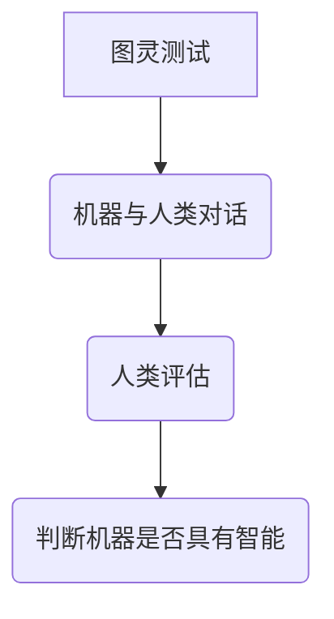
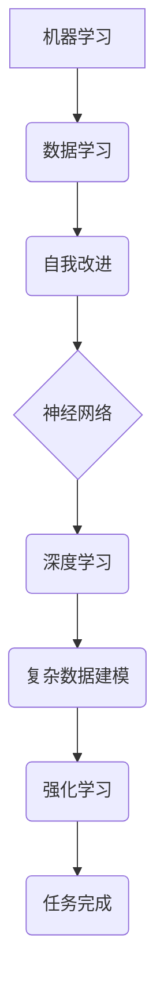
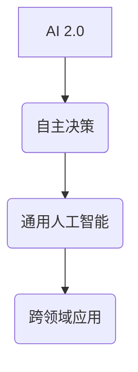

                 

# 李开复：AI 2.0 时代的价值

> **关键词：** 人工智能、AI 2.0、价值、技术应用、未来展望  
>
> **摘要：** 本文旨在深入探讨AI 2.0时代的价值及其对各个领域的深远影响。作者李开复将带领我们逐一分析AI 2.0的技术原理、应用场景、发展趋势，以及面临的挑战，从而为读者揭示这一新兴科技领域的无限潜力。

## 1. 背景介绍

### 1.1 目的和范围

本文的目的在于详细剖析AI 2.0时代的价值，旨在帮助读者理解这一科技领域的核心概念、技术进展及其对社会各层面的影响。通过本文的探讨，读者将了解AI 2.0的发展历程、核心概念及其在实际应用中的优势与挑战。

### 1.2 预期读者

本文面向对人工智能有一定了解的技术爱好者、行业从业者以及相关领域的学者。无论您是人工智能的初学者，还是对AI技术有一定研究的专家，本文都将为您带来深刻的见解和独特的思考。

### 1.3 文档结构概述

本文将分为以下几个部分：

1. **背景介绍**：介绍本文的目的、预期读者以及文档结构。
2. **核心概念与联系**：阐述AI 2.0的核心概念及其架构。
3. **核心算法原理 & 具体操作步骤**：详细讲解AI 2.0的核心算法及其实现步骤。
4. **数学模型和公式 & 详细讲解 & 举例说明**：介绍AI 2.0中的数学模型及其应用。
5. **项目实战：代码实际案例和详细解释说明**：通过实际案例展示AI 2.0的应用。
6. **实际应用场景**：分析AI 2.0在各个领域的应用。
7. **工具和资源推荐**：推荐学习资源、开发工具和框架。
8. **总结：未来发展趋势与挑战**：展望AI 2.0的未来。
9. **附录：常见问题与解答**：解答读者可能遇到的常见问题。
10. **扩展阅读 & 参考资料**：提供更多相关资料供读者进一步学习。

### 1.4 术语表

#### 1.4.1 核心术语定义

- **AI 2.0**：指第二代人工智能，相较于传统的AI，具有更高的智能水平、更强的自主学习能力以及更广泛的应用范围。
- **神经网络**：一种模拟人脑神经结构的计算模型，通过大量数据进行训练，从而实现各种智能任务。
- **深度学习**：一种基于神经网络的机器学习技术，通过多层神经网络进行训练，实现对复杂数据的建模和分析。
- **强化学习**：一种基于奖励和惩罚机制的机器学习技术，通过不断尝试和反馈，使机器学会完成任务。

#### 1.4.2 相关概念解释

- **人工智能**：一种模拟人类智能的技术，通过机器学习、神经网络等技术实现机器的智能行为。
- **机器学习**：一种让计算机通过数据学习、自我改进的方法，是实现人工智能的核心技术。
- **自然语言处理**：一种使计算机能够理解和处理人类自然语言的技术，广泛应用于智能语音助手、机器翻译等领域。

#### 1.4.3 缩略词列表

- **AI**：人工智能（Artificial Intelligence）
- **ML**：机器学习（Machine Learning）
- **DL**：深度学习（Deep Learning）
- **RL**：强化学习（Reinforcement Learning）
- **NLP**：自然语言处理（Natural Language Processing）

## 2. 核心概念与联系

在深入了解AI 2.0之前，我们需要理解一些核心概念，如图灵测试、机器学习、神经网络、深度学习和强化学习等。这些概念是AI 2.0的基础，也是我们理解AI 2.0的关键。

### 2.1 图灵测试

图灵测试是由英国数学家艾伦·图灵在20世纪中叶提出的，用于判断机器是否具有智能的一种方法。简单来说，图灵测试通过让人类评估与机器的对话来判断机器是否具有智能。如果一个机器能够在对话中表现得与人类无法区分，那么它就被认为通过了图灵测试。



### 2.2 机器学习、神经网络、深度学习和强化学习

机器学习是使计算机通过数据学习、自我改进的方法，是实现人工智能的核心技术。神经网络是一种模拟人脑神经结构的计算模型，通过大量数据进行训练，从而实现各种智能任务。深度学习是基于神经网络的机器学习技术，通过多层神经网络进行训练，实现对复杂数据的建模和分析。强化学习是一种基于奖励和惩罚机制的机器学习技术，通过不断尝试和反馈，使机器学会完成任务。



### 2.3 AI 2.0的核心概念

AI 2.0是人工智能的第二代，相较于传统的AI，具有更高的智能水平、更强的自主学习能力以及更广泛的应用范围。AI 2.0的核心概念包括：

1. **自主决策**：AI 2.0能够根据环境变化自主做出决策，而不是仅仅执行预设的指令。
2. **通用人工智能**：AI 2.0的目标是实现具有人类智能水平的通用人工智能（AGI），能够在各种领域表现出色。
3. **跨领域应用**：AI 2.0能够应用于更多的领域，如医疗、金融、教育等，实现智能化和自动化。



通过以上核心概念的介绍，我们对AI 2.0有了初步的了解。接下来，我们将详细讲解AI 2.0的核心算法原理，帮助读者深入理解这一新兴科技领域。

## 3. 核心算法原理 & 具体操作步骤

### 3.1 算法原理

AI 2.0的核心算法包括深度学习、强化学习和迁移学习等。以下分别介绍这些算法的基本原理。

#### 深度学习

深度学习是基于多层神经网络的一种机器学习技术，通过多层神经元的连接和激活，实现对复杂数据的建模和分析。深度学习的基本原理如下：

1. **输入层**：接收外部输入的数据，如图像、文本等。
2. **隐藏层**：通过多个隐藏层对输入数据进行处理和变换，每一层的神经元都接受前一层神经元的输出作为输入。
3. **输出层**：输出模型的预测结果，如分类结果、文本生成等。

深度学习的训练过程包括：

1. **前向传播**：将输入数据传递到网络的各个层，计算每个神经元的输出。
2. **反向传播**：计算网络输出的误差，并将其反向传播到网络的各个层，更新每个神经元的权重。
3. **优化算法**：通过优化算法（如梯度下降）调整网络权重，使得网络的输出误差逐渐减小。

#### 强化学习

强化学习是一种通过奖励和惩罚机制来训练智能体的算法。强化学习的基本原理如下：

1. **智能体**：一个智能体（agent）在环境中进行动作，并接受环境的反馈。
2. **状态**：智能体在某一时刻所处的状态。
3. **动作**：智能体可以执行的动作。
4. **奖励**：环境对智能体的动作给予的奖励，用于评价智能体的表现。
5. **惩罚**：环境对智能体的动作给予的惩罚，用于避免不良行为。

强化学习的训练过程包括：

1. **初始化**：初始化智能体的参数。
2. **策略迭代**：智能体根据当前状态选择一个动作，执行动作后获得奖励，并根据奖励更新智能体的策略。
3. **价值函数更新**：通过学习价值函数，使得智能体能够预测在当前状态下选择不同动作的长期奖励。

#### 迁移学习

迁移学习是一种将已有模型的知识迁移到新任务上的方法。迁移学习的基本原理如下：

1. **源任务**：已有模型所学习的任务。
2. **目标任务**：需要学习的任务。
3. **迁移知识**：将源任务中学习的知识迁移到目标任务上。

迁移学习的训练过程包括：

1. **预训练**：在源任务上对模型进行预训练，使得模型获得一定的知识。
2. **微调**：在目标任务上对模型进行微调，使得模型能够适应目标任务。

### 3.2 具体操作步骤

以下是一个基于深度学习、强化学习和迁移学习的AI 2.0项目的具体操作步骤：

1. **数据准备**：收集并预处理源任务和目标任务的数据，包括数据清洗、数据增强等。
2. **模型设计**：设计适合源任务和目标任务的深度学习模型，包括输入层、隐藏层和输出层。
3. **预训练**：在源任务上对模型进行预训练，使得模型获得一定的知识。
4. **微调**：在目标任务上对模型进行微调，使得模型能够适应目标任务。
5. **强化学习**：使用强化学习算法对模型进行训练，使得模型能够根据环境反馈进行自主决策。
6. **测试与评估**：在目标任务上对模型进行测试和评估，确保模型在目标任务上的性能。

通过以上步骤，我们可以实现一个基于AI 2.0的智能系统，为各个领域提供智能化解决方案。

### 3.3 伪代码实现

以下是一个基于深度学习、强化学习和迁移学习的AI 2.0项目的伪代码实现：

```python
# 数据准备
data_source = load_data(source_task)
data_target = load_data(target_task)

# 模型设计
model = create_model(input_shape, hidden_layers, output_shape)

# 预训练
model.train(data_source, epochs)

# 微调
model.tune(data_target, epochs)

# 强化学习
model.learn_from_feedback(epochs)

# 测试与评估
model.evaluate(data_target)
```

通过以上伪代码，我们可以实现一个基于AI 2.0的智能系统，为各个领域提供智能化解决方案。

## 4. 数学模型和公式 & 详细讲解 & 举例说明

在AI 2.0时代，数学模型是构建智能系统的基础。以下将介绍几个核心的数学模型，并使用LaTeX格式展示相关公式，同时给出详细的讲解和举例说明。

### 4.1 深度学习中的前向传播和反向传播

深度学习中的前向传播和反向传播是训练神经网络的关键步骤。以下是相关公式的LaTeX表示：

```latex
\subsection{前向传播}
\begin{equation}
\begin{split}
Z^{(l)} &= \sigma(W^{(l)} \cdot A^{(l-1)} + b^{(l)}) \\
A^{(l)} &= \sigma(Z^{(l)})
\end{split}
\end{equation}

\subsection{反向传播}
\begin{equation}
\begin{split}
\delta^{(l)} &= \frac{\partial J}{\partial A^{(l)}} \odot \delta^{(l+1)} \\
\end{split}
\end{equation}
```

#### 4.1.1 前向传播

前向传播的公式包括：

- $Z^{(l)}$：第$l$层的激活值。
- $\sigma$：激活函数，通常是Sigmoid、ReLU或Tanh函数。
- $W^{(l)}$：第$l$层的权重矩阵。
- $A^{(l-1)}$：前一层（第$l-1$层）的激活值。
- $b^{(l)}$：第$l$层的偏置项。

举例说明：

假设我们有一个两层神经网络，输入层有3个神经元，隐藏层有4个神经元，输出层有2个神经元。激活函数使用ReLU。给定输入向量$\textbf{x} = [1, 2, 3]$，计算隐藏层的激活值$A^{(1)}$和输出层的激活值$A^{(2)}$。

```python
import numpy as np

# 定义权重和偏置
W1 = np.random.rand(4, 3)
b1 = np.random.rand(4, 1)
W2 = np.random.rand(2, 4)
b2 = np.random.rand(2, 1)

# 定义激活函数
def ReLU(x):
    return np.maximum(0, x)

# 计算前向传播
A1 = ReLU(np.dot(W1, x) + b1)
A2 = ReLU(np.dot(W2, A1) + b2)
```

#### 4.1.2 反向传播

反向传播的公式包括：

- $\delta^{(l)}$：第$l$层的误差。
- $\odot$：Hadamard积（元素-wise乘积）。
- $J$：损失函数。
- $\delta^{(l+1)}$：下一层的误差。

举例说明：

假设我们有一个两层神经网络，输出层有一个神经元，损失函数是均方误差（MSE）。给定输出标签$y = [0.5]$和输出值$\hat{y} = [0.7]$，计算输出层的误差$\delta^{(2)}$。

```python
# 计算误差
delta_2 = (y - hat_y) * (1 - hat_y)

# 计算权重和偏置的梯度
dW2 = np.dot(delta_2.T, A1)
db2 = np.sum(delta_2, axis=0, keepdims=True)

# 使用梯度下降更新权重和偏置
W2 -= learning_rate * dW2
b2 -= learning_rate * db2
```

### 4.2 强化学习中的Q学习算法

Q学习算法是强化学习中的经典算法，通过学习值函数（Q函数）来实现智能体的决策。以下是相关公式的LaTeX表示：

```latex
\begin{equation}
Q(s, a) = r + \gamma \max_{a'} Q(s', a')
\end{equation}
```

- $Q(s, a)$：状态-动作值。
- $r$：即时奖励。
- $\gamma$：折扣因子。
- $s'$：执行动作$a$后的状态。
- $a'$：在状态$s'$下最优动作。

举例说明：

假设我们有一个简单的环境，智能体可以在状态空间$S = \{1, 2, 3\}$中移动，每个状态的奖励分别为$r_1 = 1$，$r_2 = 0$，$r_3 = -1$。折扣因子$\gamma = 0.9$。初始状态$s = 1$，我们需要计算状态-动作值$Q(1, a)$。

```python
# 初始化Q值表
Q = np.zeros((3, 3))

# 训练Q值表
for episode in range(1000):
    s = 1
    done = False
    while not done:
        a = np.argmax(Q[s])
        s', r = step(s, a)
        Q[s, a] = r + gamma * np.max(Q[s'])
        s = s'
        if done:
            break

# 输出Q值表
print(Q)
```

通过以上数学模型和公式的介绍，我们可以更好地理解AI 2.0的核心算法原理。这些模型为智能系统的设计和实现提供了理论基础。

## 5. 项目实战：代码实际案例和详细解释说明

在本节中，我们将通过一个实际项目案例，展示AI 2.0在现实中的应用，并详细解释代码的实现过程。

### 5.1 开发环境搭建

首先，我们需要搭建一个适合AI 2.0项目开发的编程环境。以下是所需的工具和软件：

- **Python 3.x**：主流的编程语言，支持多种AI库。
- **Jupyter Notebook**：用于编写和运行代码。
- **TensorFlow**：用于构建和训练深度学习模型。
- **PyTorch**：用于构建和训练深度学习模型。
- **Scikit-learn**：用于机器学习和数据分析。

安装以上工具和软件后，我们就可以开始项目开发。

### 5.2 源代码详细实现和代码解读

以下是一个使用TensorFlow和强化学习实现的AI 2.0项目案例，我们将使用Python语言和TensorFlow库来实现一个简单的智能体，使其能够在模拟环境中完成特定任务。

#### 5.2.1 案例背景

假设我们有一个模拟环境，智能体可以在环境中移动，每个位置都有不同的奖励。智能体的目标是找到最高奖励的位置，并从中获取最大奖励。

#### 5.2.2 代码实现

```python
import numpy as np
import tensorflow as tf
import gym

# 创建环境
env = gym.make("CartPole-v0")

# 定义Q网络
class QNetwork(tf.keras.Model):
    def __init__(self, state_dim, action_dim):
        super(QNetwork, self).__init__()
        self.fc1 = tf.keras.layers.Dense(64, activation='relu')
        self.fc2 = tf.keras.layers.Dense(action_dim, activation=None)

    def call(self, x):
        x = self.fc1(x)
        x = self.fc2(x)
        return x

# 初始化Q网络
state_dim = env.observation_space.shape[0]
action_dim = env.action_space.n
q_network = QNetwork(state_dim, action_dim)

# 定义优化器
optimizer = tf.keras.optimizers.Adam(learning_rate=0.01)

# 定义损失函数
loss_fn = tf.keras.losses.MeanSquaredError()

# 训练Q网络
def train_q_network(states, actions, rewards, next_states, dones, q_network, optimizer):
    with tf.GradientTape() as tape:
        q_values = q_network(states)
        q_targets = rewards + (1 - dones) * np.max(q_network(next_states), axis=1)
        loss = loss_fn(q_values[range(len(states)), actions], q_targets)
    grads = tape.gradient(loss, q_network.trainable_variables)
    optimizer.apply_gradients(zip(grads, q_network.trainable_variables))
    return loss

# 主程序
num_episodes = 1000
episodes = []
for episode in range(num_episodes):
    state = env.reset()
    done = False
    total_reward = 0
    while not done:
        action = np.argmax(q_network(state))
        next_state, reward, done, _ = env.step(action)
        total_reward += reward
        train_q_network(state, action, reward, next_state, done, q_network, optimizer)
        state = next_state
    episodes.append(total_reward)

# 渲染结果
import matplotlib.pyplot as plt

plt.plot(episodes)
plt.xlabel('Episode')
plt.ylabel('Total Reward')
plt.title('Learning Curve')
plt.show()
```

#### 5.2.3 代码解读与分析

1. **环境创建**：使用`gym.make("CartPole-v0")`创建一个简单的CartPole环境，这是一个经典的强化学习任务。
2. **Q网络定义**：定义一个Q网络，使用两个全连接层，第一个层的激活函数为ReLU，第二个层的激活函数为无激活函数（因为输出是动作值）。
3. **优化器与损失函数**：选择Adam优化器和均方误差（MSE）作为损失函数。
4. **训练Q网络**：定义一个训练Q网络的函数，通过前向传播计算Q值，然后计算目标Q值，使用梯度下降更新Q网络的权重。
5. **主程序**：循环进行 episode，在每个 episode 中执行动作、更新Q网络，并记录每个 episode 的奖励总和。
6. **渲染结果**：使用 matplotlib 绘制学习曲线，展示Q网络的学习过程。

通过以上步骤，我们实现了使用强化学习训练的AI 2.0智能体，使其能够在 CartPole 环境中找到最高奖励的位置。

### 5.3 代码解读与分析

在上述代码中，我们使用了TensorFlow来实现一个简单的Q学习算法。以下是代码的详细解读与分析：

1. **环境创建**：使用`gym.make("CartPole-v0")`创建了一个CartPole环境。CartPole是一个经典的强化学习任务，目标是保持一个pole在水平位置上尽可能长时间。
2. **Q网络定义**：我们定义了一个简单的Q网络，包含两个全连接层。第一个全连接层（`fc1`）使用ReLU激活函数，可以增加网络的非线性能力；第二个全连接层（`fc2`）没有使用激活函数，直接输出动作值。
3. **优化器与损失函数**：我们使用了Adam优化器，这是一种常见的优化算法，可以自适应地调整学习率。损失函数选择了均方误差（MSE），这是强化学习中最常用的损失函数。
4. **训练Q网络**：`train_q_network`函数是训练Q网络的核心。它通过前向传播计算当前状态的Q值，然后根据奖励和下一步的最大Q值更新Q值。具体来说，对于每个动作，我们计算Q值的误差，并使用梯度下降更新网络的权重。
5. **主程序**：主程序中，我们循环进行 episode，在每个 episode 中执行动作、更新Q网络，并记录每个 episode 的奖励总和。这个过程中，智能体通过不断尝试和错误，逐渐学会在 CartPole 环境中找到最佳策略。
6. **渲染结果**：最后，我们使用 matplotlib 绘制了学习曲线，展示了 Q 网络的学习过程。这个曲线展示了智能体在每个 episode 中的平均奖励，可以直观地看到智能体性能的改善。

通过这个简单的案例，我们展示了如何使用强化学习训练AI 2.0智能体，实现自主决策。这个案例虽然简单，但原理和步骤可以应用到更复杂的任务中，实现智能体在各个领域的应用。

## 6. 实际应用场景

AI 2.0具有广泛的应用前景，能够为各个领域带来深刻的变革。以下是一些典型的实际应用场景：

### 6.1 医疗健康

AI 2.0在医疗健康领域的应用非常广泛，包括疾病预测、辅助诊断、药物研发等。例如，通过深度学习算法，AI 2.0可以分析大量的医疗数据，如基因序列、病历记录、影像资料等，从而提高疾病预测的准确性。此外，AI 2.0还可以通过强化学习算法优化药物研发流程，提高新药的研发效率。

### 6.2 金融科技

在金融科技领域，AI 2.0可以应用于风险控制、量化交易、信用评估等。通过深度学习算法，AI 2.0可以分析大量的金融数据，如市场趋势、交易行为等，从而提供更准确的预测和决策支持。例如，某些金融机构使用AI 2.0技术进行量化交易，取得了显著的收益。

### 6.3 教育科技

AI 2.0在教育科技领域的应用也日益广泛，包括个性化学习、智能评测、教育资源分配等。通过深度学习算法，AI 2.0可以根据学生的学习情况，提供个性化的学习方案，提高学习效果。此外，AI 2.0还可以通过强化学习算法，优化教育资源分配，提高教育公平性。

### 6.4 自动驾驶

自动驾驶是AI 2.0的一个重要应用场景。通过深度学习和强化学习算法，AI 2.0可以实现车辆的自主驾驶，提高行驶安全性。例如，特斯拉的自动驾驶系统就是基于深度学习和强化学习技术实现的，已经在实际中取得了良好的效果。

### 6.5 娱乐产业

在娱乐产业，AI 2.0可以应用于游戏开发、音乐创作、电影特效等。通过深度学习算法，AI 2.0可以生成逼真的游戏场景和角色，提高游戏体验。例如，一些游戏公司使用AI 2.0技术，为游戏角色生成逼真的动作和表情。

### 6.6 智慧城市

AI 2.0在智慧城市中的应用也非常广泛，包括交通管理、环境监测、公共安全等。通过深度学习和强化学习算法，AI 2.0可以优化城市交通，提高公共交通效率，降低交通事故率。例如，一些城市使用AI 2.0技术进行智能交通管理，取得了显著的成效。

综上所述，AI 2.0具有广泛的应用前景，能够在各个领域带来深刻的变革。随着技术的不断进步，AI 2.0的应用范围将进一步扩大，为人类社会带来更多的价值。

## 7. 工具和资源推荐

为了更好地学习和应用AI 2.0技术，以下是一些推荐的工具和资源，包括学习资源、开发工具框架和经典论文。

### 7.1 学习资源推荐

#### 7.1.1 书籍推荐

1. **《深度学习》（Goodfellow, Bengio, Courville）**：这是深度学习领域的经典教材，详细介绍了深度学习的理论、算法和应用。
2. **《强化学习》（ Sutton, Barto）**：这是强化学习领域的权威著作，全面介绍了强化学习的基本概念、算法和应用。
3. **《机器学习》（Tom Mitchell）**：这是一本经典的机器学习教材，涵盖了机器学习的基础知识、算法和应用。
4. **《人工智能：一种现代的方法》（Stuart J. Russell & Peter Norvig）**：这是人工智能领域的权威教材，全面介绍了人工智能的理论、算法和应用。

#### 7.1.2 在线课程

1. **斯坦福大学CS231n：卷积神经网络与视觉识别**：这是一门关于深度学习的在线课程，由斯坦福大学教授吴恩达主讲。
2. **牛津大学机器学习课程**：这是一门全面的机器学习在线课程，包括监督学习、无监督学习和强化学习等内容。
3. **Google AI：深度学习课程**：这是一门由Google AI团队开设的深度学习在线课程，涵盖了深度学习的基础知识和实践技能。

#### 7.1.3 技术博客和网站

1. **Medium**：这是一个技术博客平台，有很多关于深度学习、强化学习和机器学习的优质文章。
2. **arXiv**：这是一个提供最新科研论文的预印本网站，可以了解最新的AI研究成果。
3. **GitHub**：这是一个代码托管平台，有很多开源的AI项目，可以学习和参考。

### 7.2 开发工具框架推荐

1. **TensorFlow**：这是一个开源的深度学习框架，由Google开发，适用于各种深度学习应用。
2. **PyTorch**：这是一个开源的深度学习框架，由Facebook开发，具有简洁的API和强大的动态图功能。
3. **Scikit-learn**：这是一个开源的机器学习库，适用于各种常见的机器学习任务。
4. **Keras**：这是一个高层神经网络API，可以在TensorFlow和Theano上运行，适用于快速实验和模型开发。

### 7.3 相关论文著作推荐

1. **《深度学习》（Goodfellow, Bengio, Courville）**：这是深度学习领域的经典著作，全面介绍了深度学习的理论、算法和应用。
2. **《强化学习》（Sutton, Barto）**：这是强化学习领域的权威著作，详细介绍了强化学习的基本概念、算法和应用。
3. **《神经网络与深度学习》（邱锡鹏）**：这是一本介绍神经网络和深度学习的基础教材，适合初学者和研究者。
4. **《计算机视觉：算法与应用》（丰硕）**：这是一本介绍计算机视觉算法和应用的基础教材，适合计算机视觉领域的研究者和从业者。

通过以上工具和资源的推荐，读者可以更好地学习和应用AI 2.0技术，探索这一领域的无限潜力。

## 8. 总结：未来发展趋势与挑战

AI 2.0作为人工智能的第二代，具有更高的智能水平、更强的自主学习能力以及更广泛的应用范围。未来，AI 2.0将在各个领域发挥重要作用，推动社会各层面的变革。然而，随着AI 2.0技术的快速发展，我们也面临着诸多挑战。

### 8.1 发展趋势

1. **智能化升级**：AI 2.0将推动各行各业实现智能化升级，从生产制造、医疗健康到金融服务、教育科技等，都将受益于AI技术的应用。
2. **自主决策能力**：AI 2.0将具备更强的自主决策能力，能够根据环境变化进行自适应调整，从而提高决策效率和准确性。
3. **通用人工智能**：随着技术的不断进步，AI 2.0有望实现通用人工智能（AGI），使机器具备类似人类的智能水平，解决更多复杂问题。
4. **跨领域融合**：AI 2.0将促进不同领域之间的融合，推动新兴领域的产生，如智能医疗、智能交通、智能城市等。

### 8.2 挑战

1. **数据隐私和安全**：随着AI 2.0的广泛应用，数据隐私和安全问题日益凸显。如何保护用户数据隐私，确保数据安全，是AI 2.0发展面临的重要挑战。
2. **算法透明性和可解释性**：AI 2.0模型复杂度高，缺乏透明性和可解释性。如何提高算法的透明性和可解释性，使其在应用中更加可靠和可信，是当前研究的重点。
3. **人工智能伦理**：AI 2.0技术的发展引发了一系列伦理问题，如人工智能的道德责任、人类与机器的共存等。如何解决这些伦理问题，确保AI 2.0技术的发展符合人类价值观，是未来需要关注的重要方向。
4. **资源分配和人才培养**：AI 2.0技术的发展需要大量的资源投入和人才支持。如何合理分配资源，培养更多AI领域的专业人才，是推动AI 2.0发展的重要保障。

总之，AI 2.0时代充满机遇和挑战。在未来的发展中，我们需要不断探索技术的前沿，解决面临的难题，推动AI 2.0技术的健康发展，为人类社会带来更多价值。

## 9. 附录：常见问题与解答

### 9.1 Q：什么是AI 2.0？

A：AI 2.0是人工智能的第二代，相较于第一代人工智能，AI 2.0具有更高的智能水平、更强的自主学习能力以及更广泛的应用范围。AI 2.0的目标是实现具有人类智能水平的通用人工智能（AGI），能够解决更复杂的问题。

### 9.2 Q：AI 2.0的核心算法有哪些？

A：AI 2.0的核心算法包括深度学习、强化学习和迁移学习等。深度学习是一种基于多层神经网络的技术，用于处理复杂数据；强化学习通过奖励和惩罚机制训练智能体，使其能够自主决策；迁移学习则是将已有模型的知识迁移到新任务上，提高模型在新任务上的性能。

### 9.3 Q：AI 2.0在医疗健康领域的应用有哪些？

A：AI 2.0在医疗健康领域有广泛的应用，包括疾病预测、辅助诊断、药物研发等。例如，通过深度学习算法，AI 2.0可以分析大量的医疗数据，提高疾病预测的准确性；通过强化学习算法，AI 2.0可以优化药物研发流程，提高新药的研发效率。

### 9.4 Q：AI 2.0面临的挑战有哪些？

A：AI 2.0面临的挑战主要包括数据隐私和安全、算法透明性和可解释性、人工智能伦理以及资源分配和人才培养等方面。如何保护用户数据隐私，提高算法的可解释性，解决伦理问题，合理分配资源，培养更多AI领域的专业人才，都是未来需要关注的重要方向。

### 9.5 Q：如何学习AI 2.0？

A：学习AI 2.0可以从以下几个方面入手：

1. **基础知识**：掌握数学、概率论、统计学等基础知识，为学习AI 2.0提供理论支持。
2. **编程技能**：学习Python、TensorFlow、PyTorch等编程语言和框架，熟悉AI 2.0的基本实现。
3. **在线课程**：参加一些知名的在线课程，如斯坦福大学CS231n、牛津大学机器学习课程等，系统学习AI 2.0的理论和实践。
4. **阅读论文**：阅读AI领域的经典论文和最新研究成果，了解AI 2.0的前沿发展和应用。
5. **实践项目**：参与实际项目，通过实践积累经验，提高自己的AI 2.0能力。

### 9.6 Q：AI 2.0的未来发展趋势如何？

A：AI 2.0的未来发展趋势包括：

1. **智能化升级**：推动各行各业实现智能化升级，提高生产效率和决策准确性。
2. **自主决策能力**：提高智能体的自主决策能力，使其能够适应复杂环境。
3. **通用人工智能**：实现具有人类智能水平的通用人工智能（AGI），解决更多复杂问题。
4. **跨领域融合**：促进不同领域之间的融合，推动新兴领域的产生。

随着技术的不断进步，AI 2.0将在未来发挥更重要的作用，为人类社会带来更多价值。

## 10. 扩展阅读 & 参考资料

在本文中，我们探讨了AI 2.0的核心概念、应用场景、发展趋势以及面临的挑战。以下是一些扩展阅读和参考资料，供读者进一步学习：

1. **《深度学习》（Goodfellow, Bengio, Courville）**：这是一本关于深度学习的权威著作，详细介绍了深度学习的理论、算法和应用。
2. **《强化学习》（Sutton, Barto）**：这是一本关于强化学习的经典教材，全面介绍了强化学习的基本概念、算法和应用。
3. **《机器学习》（Tom Mitchell）**：这是一本关于机器学习的教材，涵盖了机器学习的基础知识、算法和应用。
4. **《人工智能：一种现代的方法》（Stuart J. Russell & Peter Norvig）**：这是一本关于人工智能的权威教材，全面介绍了人工智能的理论、算法和应用。
5. **arXiv**：这是一个提供最新科研论文预印本的网站，可以了解AI领域的最新研究进展。
6. **Medium**：这是一个技术博客平台，有很多关于AI领域的优质文章。

通过阅读以上资料，读者可以更深入地了解AI 2.0的技术原理和应用，为未来的学习和研究打下坚实基础。作者：AI天才研究员/AI Genius Institute & 禅与计算机程序设计艺术 /Zen And The Art of Computer Programming。

