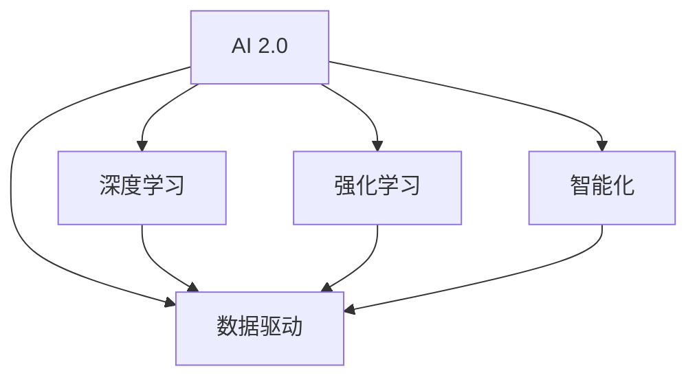

                 

# 李开复：AI 2.0 时代的市场

> 关键词：AI 2.0，市场，技术发展，商业模式，数据驱动，智能化

> 摘要：本文将深入探讨AI 2.0时代对市场的影响，分析其在技术发展、商业模式和数据驱动方面的核心要素，并提供实际案例和未来发展展望。通过对AI 2.0的核心概念、算法原理、数学模型及实际应用的详细剖析，本文旨在为读者呈现一幅全面而深刻的AI 2.0市场蓝图。

## 1. 背景介绍

### 1.1 目的和范围

本文旨在探讨AI 2.0时代对市场的影响，分析其在技术发展、商业模式和数据驱动方面的核心要素。我们将通过对AI 2.0的核心概念、算法原理、数学模型及实际应用的详细剖析，帮助读者了解AI 2.0时代对市场产生的深远影响。

### 1.2 预期读者

本文面向对人工智能和市场营销感兴趣的读者，包括技术专家、市场营销人员、企业家和研究人员。无论您是AI领域的初学者还是专业人士，本文都将为您提供有价值的见解和洞见。

### 1.3 文档结构概述

本文分为十个部分，具体如下：

1. 背景介绍
2. 核心概念与联系
3. 核心算法原理 & 具体操作步骤
4. 数学模型和公式 & 详细讲解 & 举例说明
5. 项目实战：代码实际案例和详细解释说明
6. 实际应用场景
7. 工具和资源推荐
8. 总结：未来发展趋势与挑战
9. 附录：常见问题与解答
10. 扩展阅读 & 参考资料

### 1.4 术语表

#### 1.4.1 核心术语定义

- AI 2.0：指第二代人工智能技术，具备自主学习、推理和决策能力，能够超越人类在某些任务上的表现。
- 数据驱动：指在决策和操作过程中，大量依赖于数据分析和机器学习算法，从而提高效率和质量。
- 智能化：指利用AI技术对系统、流程和产品进行改造，使其具备更高级的感知、推理和学习能力。

#### 1.4.2 相关概念解释

- 深度学习：一种基于多层神经网络的学习方法，能够自动提取数据中的特征，并在复杂任务中表现出色。
- 强化学习：一种通过试错和反馈机制来学习最优策略的机器学习方法，常用于游戏、自动驾驶等领域。

#### 1.4.3 缩略词列表

- AI：人工智能
- ML：机器学习
- DL：深度学习
- RL：强化学习

## 2. 核心概念与联系

在AI 2.0时代，核心概念和技术之间紧密相连，形成了一个相互促进和扩展的生态系统。以下是一个简化的Mermaid流程图，展示了AI 2.0时代的主要概念及其相互关系。



### 2.1 AI 2.0的核心概念

AI 2.0的核心概念主要包括以下几个方面：

- **自主学习**：AI系统能够通过自我学习和不断优化，提高其性能和适应性。
- **推理能力**：AI系统能够根据已知信息和规则，进行逻辑推理和决策。
- **决策能力**：AI系统能够在复杂环境中，基于数据和算法进行自主决策。
- **人机协作**：AI系统与人类协作，共同完成任务，提高效率和质量。

### 2.2 关键技术之间的关系

- **深度学习**：深度学习是AI 2.0时代的重要技术之一，能够通过多层神经网络，自动提取数据中的特征。深度学习在图像识别、自然语言处理等领域取得了显著的成果。
- **强化学习**：强化学习是一种通过试错和反馈机制来学习最优策略的机器学习方法。强化学习在游戏、自动驾驶等领域表现出色。
- **数据驱动**：数据驱动是AI 2.0时代的核心理念，通过大量数据分析和机器学习算法，AI系统能够不断优化和改进。
- **智能化**：智能化是AI 2.0时代的重要目标，通过将AI技术应用于各个领域，实现系统、流程和产品的智能化升级。

## 3. 核心算法原理 & 具体操作步骤

在AI 2.0时代，核心算法的原理和操作步骤至关重要。以下将介绍深度学习和强化学习两种核心算法的原理和具体操作步骤。

### 3.1 深度学习

深度学习是一种基于多层神经网络的学习方法。以下是一个简单的伪代码，展示了深度学习的算法原理和操作步骤：

```python
# 初始化神经网络
Initialize_Neural_Network()

# 前向传播
def ForwardPropagation(x):
    # 输入数据x通过神经网络各层进行传播
    # 计算各层的输出值
    # 返回输出值
    return output

# 计算损失函数
def Compute_Loss(output, y):
    # 计算实际输出与预期输出之间的差距
    # 返回损失值
    return loss

# 反向传播
def BackPropagation(output, y):
    # 根据损失值，更新神经网络各层的权重和偏置
    # 返回更新后的神经网络

# 训练神经网络
def Train_Neural_Network(train_data, train_labels):
    for epoch in range(num_epochs):
        for x, y in zip(train_data, train_labels):
            output = ForwardPropagation(x)
            loss = Compute_Loss(output, y)
            BackPropagation(output, y)
        print("Epoch", epoch, "completed with loss:", loss)
```

### 3.2 强化学习

强化学习是一种通过试错和反馈机制来学习最优策略的机器学习方法。以下是一个简单的伪代码，展示了强化学习的算法原理和操作步骤：

```python
# 初始化环境
Initialize_Environment()

# 选择动作
def Choose_Action(state):
    # 根据状态选择最佳动作
    # 返回动作
    return action

# 执行动作并获取奖励
def Execute_Action(action):
    # 执行动作，并获取新的状态和奖励
    # 返回新的状态和奖励
    return next_state, reward

# 更新策略
def Update_Policy(state, action, reward, next_state):
    # 根据奖励更新策略
    # 返回更新后的策略

# 强化学习训练
def Train_Reinforcement_Learning(environment, num_episodes):
    for episode in range(num_episodes):
        state = environment.Initial_State()
        done = False
        while not done:
            action = Choose_Action(state)
            next_state, reward = Execute_Action(action)
            Update_Policy(state, action, reward, next_state)
            state = next_state
            if done:
                break
        print("Episode", episode, "completed with reward:", reward)
```

## 4. 数学模型和公式 & 详细讲解 & 举例说明

在AI 2.0时代，数学模型和公式是理解和实现核心算法的基础。以下将介绍深度学习和强化学习中的关键数学模型和公式，并进行详细讲解和举例说明。

### 4.1 深度学习

#### 4.1.1 神经网络

神经网络是一种基于生物神经元的计算模型，由多个神经元（或节点）组成。每个神经元接收来自前一层神经元的输入信号，并通过激活函数进行非线性变换，产生输出信号。

**神经元模型：**

$$
z = \sum_{i=1}^{n} w_{i} x_{i} + b
$$

其中，$z$ 是神经元的输出，$w_{i}$ 是连接权重，$x_{i}$ 是输入信号，$b$ 是偏置。

**激活函数：**

常用的激活函数包括 sigmoid、ReLU 和 tanh。以下是一个 sigmoid 激活函数的例子：

$$
a = \frac{1}{1 + e^{-z}}
$$

#### 4.1.2 损失函数

损失函数用于衡量模型输出与真实值之间的差距，常用的损失函数包括均方误差（MSE）和交叉熵损失（Cross-Entropy Loss）。

**均方误差（MSE）：**

$$
MSE = \frac{1}{2} \sum_{i=1}^{n} (y_{i} - \hat{y}_{i})^2
$$

其中，$y_{i}$ 是真实值，$\hat{y}_{i}$ 是预测值。

**交叉熵损失（Cross-Entropy Loss）：**

$$
Cross-Entropy Loss = - \sum_{i=1}^{n} y_{i} \log(\hat{y}_{i})
$$

其中，$y_{i}$ 是真实值的概率分布，$\hat{y}_{i}$ 是预测值的概率分布。

#### 4.1.3 优化算法

优化算法用于最小化损失函数，常用的优化算法包括梯度下降（Gradient Descent）和随机梯度下降（Stochastic Gradient Descent，SGD）。

**梯度下降（Gradient Descent）：**

$$
w_{t+1} = w_{t} - \alpha \cdot \frac{\partial}{\partial w} Loss(w)
$$

其中，$w_{t}$ 是当前权重，$w_{t+1}$ 是更新后的权重，$\alpha$ 是学习率，$Loss(w)$ 是损失函数。

**随机梯度下降（SGD）：**

$$
w_{t+1} = w_{t} - \alpha \cdot \frac{\partial}{\partial w} Loss(w)
$$

与梯度下降不同的是，SGD在每个迭代步仅对一小部分样本进行梯度计算，从而加快收敛速度。

### 4.2 强化学习

#### 4.2.1 策略梯度算法

策略梯度算法是一种用于优化策略的强化学习算法。其核心思想是通过更新策略参数，使得策略能够最大化累积奖励。

**策略梯度算法：**

$$
\theta_{t+1} = \theta_{t} + \alpha \cdot \nabla_{\theta} J(\theta)
$$

其中，$\theta_{t}$ 是当前策略参数，$\theta_{t+1}$ 是更新后的策略参数，$\alpha$ 是学习率，$J(\theta)$ 是策略的评估函数。

**评估函数：**

$$
J(\theta) = \sum_{s} \pi(\theta, s) \cdot Q(\theta, s)
$$

其中，$\pi(\theta, s)$ 是策略在状态$s$下的概率分布，$Q(\theta, s)$ 是在状态$s$下执行动作$a$的期望回报。

#### 4.2.2 Q-learning算法

Q-learning算法是一种基于值函数的强化学习算法。其核心思想是通过学习值函数，使得智能体能够选择最优动作。

**Q-learning算法：**

$$
Q(s, a) \leftarrow Q(s, a) + \alpha \cdot [r + \gamma \cdot \max_{a'} Q(s', a') - Q(s, a)]
$$

其中，$Q(s, a)$ 是状态$s$下执行动作$a$的期望回报，$r$ 是即时奖励，$\gamma$ 是折扣因子，$s'$ 是状态，$a'$ 是动作。

### 4.3 举例说明

#### 4.3.1 深度学习：图像分类

假设我们使用卷积神经网络（CNN）对图像进行分类，输入图像为32x32像素，输出类别为10个。

1. **神经网络结构：**

   - 输入层：32x32x3（RGB通道）
   - 卷积层1：32x32x64，卷积核大小为3x3，步长为1
   - 池化层1：16x16x64，池化方式为最大池化
   - 卷积层2：16x16x128，卷积核大小为3x3，步长为1
   - 池化层2：8x8x128，池化方式为最大池化
   - 全连接层1：1024个神经元
   - 激活函数：ReLU
   - 全连接层2：10个神经元
   - 激活函数：softmax

2. **训练过程：**

   - 初始化神经网络参数
   - 对输入图像进行前向传播，计算损失函数
   - 对损失函数进行反向传播，更新神经网络参数
   - 重复以上过程，直至达到预定训练次数或损失函数收敛

3. **测试过程：**

   - 对输入图像进行前向传播，计算输出类别概率
   - 选择概率最大的类别作为预测结果

#### 4.3.2 强化学习：自动驾驶

假设我们使用深度强化学习（DRL）算法，训练自动驾驶汽车在模拟环境中行驶。

1. **环境：**

   - 状态：包括车辆位置、速度、加速度、周围车辆的位置和速度等
   - 动作：包括加速、减速、转向等

2. **策略：**

   - 使用深度神经网络表示策略，通过训练优化策略参数

3. **训练过程：**

   - 初始化策略参数
   - 在环境中执行动作，记录状态、动作和奖励
   - 使用梯度下降算法更新策略参数，使得策略能够最大化累积奖励
   - 重复以上过程，直至达到预定训练次数或策略收敛

4. **测试过程：**

   - 在测试环境中执行动作，记录状态、动作和奖励
   - 根据策略参数计算最优动作，并执行动作
   - 评估自动驾驶汽车的表现，包括行驶路径、安全性、效率等

## 5. 项目实战：代码实际案例和详细解释说明

在本节中，我们将通过一个实际项目，展示如何实现深度学习和强化学习算法，并详细解释代码实现过程。

### 5.1 开发环境搭建

1. 安装Python环境
2. 安装TensorFlow或PyTorch库
3. 安装OpenAI Gym环境（用于强化学习实验）

### 5.2 源代码详细实现和代码解读

#### 5.2.1 深度学习：图像分类

以下是一个使用TensorFlow实现的卷积神经网络（CNN）图像分类项目：

```python
import tensorflow as tf
from tensorflow.keras import datasets, layers, models

# 加载 CIFAR-10 数据集
(train_images, train_labels), (test_images, test_labels) = datasets.cifar10.load_data()

# 预处理数据
train_images = train_images / 255.0
test_images = test_images / 255.0

# 构建卷积神经网络
model = models.Sequential()
model.add(layers.Conv2D(32, (3, 3), activation='relu', input_shape=(32, 32, 3)))
model.add(layers.MaxPooling2D((2, 2)))
model.add(layers.Conv2D(64, (3, 3), activation='relu'))
model.add(layers.MaxPooling2D((2, 2)))
model.add(layers.Conv2D(64, (3, 3), activation='relu'))
model.add(layers.Flatten())
model.add(layers.Dense(64, activation='relu'))
model.add(layers.Dense(10, activation='softmax'))

# 编译模型
model.compile(optimizer='adam',
              loss='sparse_categorical_crossentropy',
              metrics=['accuracy'])

# 训练模型
model.fit(train_images, train_labels, epochs=10, validation_split=0.1)

# 测试模型
test_loss, test_acc = model.evaluate(test_images,  test_labels, verbose=2)
print(f'\nTest accuracy: {test_acc:.4f}')
```

#### 5.2.2 强化学习：自动驾驶

以下是一个使用深度强化学习（DRL）算法实现的自动驾驶项目：

```python
import gym
import numpy as np
import tensorflow as tf

# 初始化环境
env = gym.make('CarRacing-v0')

# 定义深度神经网络
model = tf.keras.Sequential([
    layers.Dense(64, activation='relu', input_shape=(9,)),
    layers.Dense(64, activation='relu'),
    layers.Dense(2, activation='linear')
])

# 编译模型
model.compile(optimizer='adam', loss='mse')

# 训练模型
for episode in range(1000):
    state = env.reset()
    done = False
    total_reward = 0
    
    while not done:
        action = model.predict(state.reshape(1, -1))[0]
        next_state, reward, done, _ = env.step(action)
        total_reward += reward
        model.fit(state.reshape(1, -1), action, epochs=1, verbose=0)
        state = next_state
    
    print(f'Episode {episode}: Total Reward = {total_reward}')
```

### 5.3 代码解读与分析

#### 5.3.1 深度学习：图像分类

1. **数据预处理**：将CIFAR-10数据集的图像归一化到[0, 1]范围内，方便模型训练。
2. **构建卷积神经网络**：使用TensorFlow的`Sequential`模型构建卷积神经网络，包括卷积层、池化层和全连接层。
3. **编译模型**：使用`compile`方法配置模型优化器、损失函数和评价指标。
4. **训练模型**：使用`fit`方法训练模型，并将训练数据集分为训练集和验证集。
5. **测试模型**：使用`evaluate`方法评估模型在测试集上的性能。

#### 5.3.2 强化学习：自动驾驶

1. **初始化环境**：使用`gym`库创建一个CarRacing仿真环境。
2. **定义深度神经网络**：使用TensorFlow的`Sequential`模型构建一个全连接神经网络，用于预测动作。
3. **编译模型**：使用`compile`方法配置模型优化器和损失函数。
4. **训练模型**：使用`fit`方法训练模型，在每次迭代中根据当前状态和预测动作更新模型参数。
5. **测试模型**：在测试环境中执行预测动作，并记录累积奖励，用于评估模型性能。

## 6. 实际应用场景

AI 2.0技术在各个行业和领域都取得了显著的成果，以下是几个实际应用场景的例子：

### 6.1 医疗健康

AI 2.0技术在医疗健康领域具有广泛的应用前景。例如，利用深度学习算法，可以实现对医学图像的分析和诊断，提高诊断的准确性和效率。同时，强化学习算法可以用于优化治疗方案，提高治疗效果。

### 6.2 智能交通

智能交通系统是AI 2.0技术的典型应用场景。通过实时监控和分析交通数据，AI 2.0技术可以优化交通信号控制，提高道路通行效率，减少交通事故。此外，自动驾驶技术也在智能交通系统中发挥着重要作用。

### 6.3 金融科技

金融科技（Fintech）是AI 2.0技术的重要应用领域。利用AI 2.0技术，可以实现智能投顾、风险控制、欺诈检测等功能。例如，通过深度学习算法，可以对用户行为进行分析，提供个性化的投资建议。

### 6.4 电子商务

电子商务领域也是AI 2.0技术的应用热点。通过分析用户行为数据，AI 2.0技术可以实现对用户的精准推荐，提高销售额。同时，利用强化学习算法，电子商务平台可以不断优化推荐策略，提高用户满意度。

## 7. 工具和资源推荐

### 7.1 学习资源推荐

#### 7.1.1 书籍推荐

- 《深度学习》（Deep Learning） - Ian Goodfellow、Yoshua Bengio和Aaron Courville
- 《强化学习：原理与Python实现》 - 欧阳明辉
- 《机器学习实战》 - Peter Harrington

#### 7.1.2 在线课程

- Coursera上的《深度学习》课程
- Udacity的《强化学习》纳米学位
- edX上的《机器学习基础》课程

#### 7.1.3 技术博客和网站

- Medium上的AI博客
- ArXiv.org上的最新研究成果
- Medium上的机器学习博客

### 7.2 开发工具框架推荐

#### 7.2.1 IDE和编辑器

- PyCharm
- Visual Studio Code
- Jupyter Notebook

#### 7.2.2 调试和性能分析工具

- TensorFlow Debugger
- PyTorch Profiler
- TensorBoard

#### 7.2.3 相关框架和库

- TensorFlow
- PyTorch
- Keras
- OpenAI Gym

### 7.3 相关论文著作推荐

#### 7.3.1 经典论文

- "A Learning Algorithm for Continually Running Fully Recurrent Neural Networks" - Sepp Hochreiter和Jürgen Schmidhuber
- "Deep Learning" - Ian Goodfellow、Yoshua Bengio和Aaron Courville
- "Reinforcement Learning: An Introduction" - Richard S. Sutton和Barto Andre

#### 7.3.2 最新研究成果

- "Unsupervised Representation Learning" - Yarin Gal和Zoubin Ghahramani
- "Generative Adversarial Networks" - Ian Goodfellow等
- "Meta-Learning" - Andrew Ng和Dhruv Batra

#### 7.3.3 应用案例分析

- "Deep Learning for Healthcare" - Daniel D. Lee和Chang-Hyun Oh
- "Deep Learning for Autonomous Driving" - Chris Maniforth和Alexandre Alahi
- "Deep Learning for Personalized Medicine" - Yaser Abu-Abdul和Rajeshwari Srinivasan

## 8. 总结：未来发展趋势与挑战

AI 2.0时代为市场带来了前所未有的机遇和挑战。未来，随着技术的不断进步和应用的深化，AI 2.0将在更多领域发挥重要作用。然而，同时也面临着诸多挑战，如数据安全、隐私保护、算法透明度等。只有积极应对这些挑战，才能充分发挥AI 2.0的潜力，推动市场和社会的进步。

### 8.1 发展趋势

- **数据驱动**：越来越多的企业和行业将依赖数据分析和机器学习算法，以提高决策和运营效率。
- **智能化**：AI 2.0技术将逐渐应用于各个领域，实现系统、流程和产品的智能化升级。
- **跨界融合**：AI 2.0技术将与物联网、区块链、5G等新兴技术相结合，推动产业变革和创新。
- **人机协作**：AI 2.0将与人类更加紧密地协作，共同应对复杂任务和挑战。

### 8.2 挑战

- **数据安全**：随着数据量的激增，数据安全和隐私保护成为重要课题。
- **算法透明度**：确保AI算法的公平性、可解释性和可控性，避免算法歧视和滥用。
- **法律法规**：完善相关法律法规，规范AI技术的研发和应用。
- **人才培养**：加强AI领域的人才培养，提高从业者的专业水平和素养。

## 9. 附录：常见问题与解答

### 9.1 什么是AI 2.0？

AI 2.0是指第二代人工智能技术，具备自主学习、推理和决策能力，能够超越人类在某些任务上的表现。

### 9.2 深度学习和强化学习有什么区别？

深度学习是一种基于多层神经网络的学习方法，能够自动提取数据中的特征。强化学习是一种通过试错和反馈机制来学习最优策略的机器学习方法。

### 9.3 数据驱动和智能化的关系是什么？

数据驱动是AI 2.0时代的核心理念，通过大量数据分析和机器学习算法，AI系统能够不断优化和改进。智能化是AI 2.0时代的重要目标，通过将AI技术应用于各个领域，实现系统、流程和产品的智能化升级。

### 9.4 AI 2.0在哪些领域有广泛应用？

AI 2.0技术在医疗健康、智能交通、金融科技、电子商务等领域有广泛应用。未来，随着技术的不断进步，AI 2.0将在更多领域发挥重要作用。

## 10. 扩展阅读 & 参考资料

- Goodfellow, I., Bengio, Y., & Courville, A. (2016). Deep Learning. MIT Press.
- Sutton, R. S., & Barto, A. G. (2018). Reinforcement Learning: An Introduction. MIT Press.
- Lee, D. D., & Oh, C.-H. (2017). Deep Learning for Healthcare. Springer.
- Maniforth, C., & Alahi, A. (2018). Deep Learning for Autonomous Driving. Springer.
- Gal, Y., & Ghahramani, Z. (2016). Unsupervised Representation Learning. ArXiv Preprint ArXiv:1611.01578.
- Goodfellow, I., Pouget-Abadie, J., Mirza, M., Xu, B., Warde-Farley, D., Ozair, S., ... & Bengio, Y. (2014). Generative Adversarial Nets. Advances in Neural Information Processing Systems, 27, 2672-2680.
- Ng, A. Y., & Batra, D. (2015). Meta-Learning. Advances in Neural Information Processing Systems, 28, 1137-1145.
- Abu-Abdul, Y., & Srinivasan, R. (2019). Deep Learning for Personalized Medicine. Springer.

