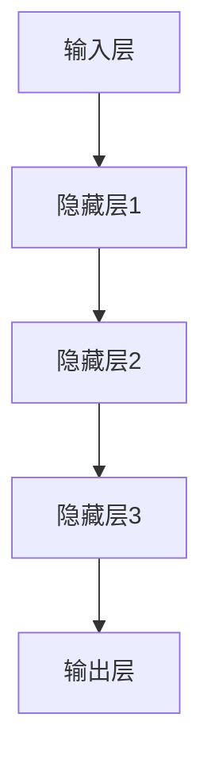
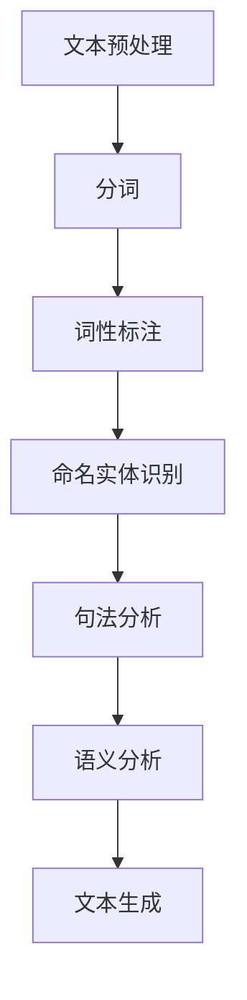
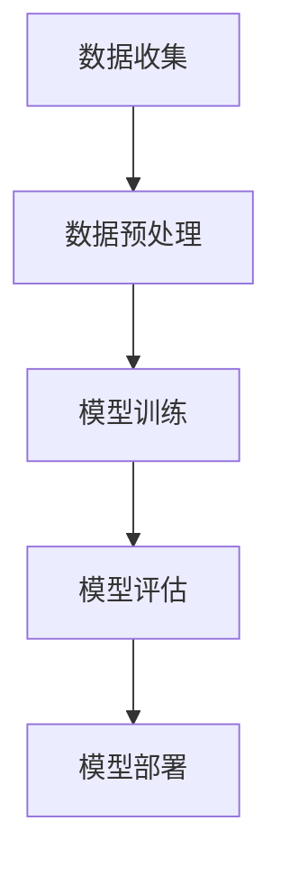

                 

# 李开复：AI 2.0 时代的应用

> **关键词：** 人工智能，AI 2.0，应用，深度学习，自然语言处理，机器学习，自动驾驶，智能医疗，物联网，云计算

> **摘要：** 本文章探讨了AI 2.0时代的应用，重点关注深度学习、自然语言处理、机器学习等核心技术的发展趋势，以及这些技术在不同领域（如自动驾驶、智能医疗、物联网等）的实际应用。通过分析AI 2.0时代的挑战与机遇，本文旨在为读者提供一个全面、深入的AI应用指南。

## 1. 背景介绍

### 1.1 目的和范围

本文旨在探讨AI 2.0时代的应用，梳理人工智能技术的发展脉络，分析AI 2.0在各领域中的实际应用案例，探讨AI 2.0时代的机遇与挑战。本文主要关注深度学习、自然语言处理、机器学习等核心技术，以及这些技术在自动驾驶、智能医疗、物联网等领域的应用。

### 1.2 预期读者

本文适合对人工智能技术有一定了解的读者，包括人工智能研究人员、软件开发工程师、数据科学家、以及对AI领域感兴趣的企业家和创业者。通过本文，读者可以了解AI 2.0时代的最新发展动态，把握AI技术在各领域的应用前景。

### 1.3 文档结构概述

本文分为以下几个部分：

1. 背景介绍：介绍文章的目的、预期读者以及文档结构。
2. 核心概念与联系：讲解深度学习、自然语言处理、机器学习等核心概念，并给出相关架构的Mermaid流程图。
3. 核心算法原理 & 具体操作步骤：详细阐述深度学习、自然语言处理、机器学习的算法原理和操作步骤。
4. 数学模型和公式 & 详细讲解 & 举例说明：介绍相关数学模型和公式，并进行举例说明。
5. 项目实战：代码实际案例和详细解释说明。
6. 实际应用场景：分析AI 2.0在各领域的实际应用。
7. 工具和资源推荐：推荐学习资源、开发工具框架和相关论文著作。
8. 总结：未来发展趋势与挑战。
9. 附录：常见问题与解答。
10. 扩展阅读 & 参考资料。

### 1.4 术语表

#### 1.4.1 核心术语定义

- **AI 2.0**：指第二代人工智能，强调基于深度学习、自然语言处理、机器学习等技术的智能应用。
- **深度学习**：一种神经网络模型，通过多层次的非线性变换来提取数据特征。
- **自然语言处理**：研究计算机如何理解和生成自然语言的技术。
- **机器学习**：一种通过数据学习模式的计算机算法，实现智能行为。
- **自动驾驶**：利用传感器、摄像头等设备实现车辆自主行驶的技术。
- **智能医疗**：利用人工智能技术进行疾病诊断、治疗、药物研发等。
- **物联网**：通过互联网连接各种物理设备，实现智能管理和控制。

#### 1.4.2 相关概念解释

- **神经网络**：模拟人脑神经元连接结构的信息处理系统。
- **卷积神经网络（CNN）**：一种用于图像识别和处理的神经网络。
- **循环神经网络（RNN）**：一种用于处理序列数据的神经网络。
- **生成对抗网络（GAN）**：一种用于生成数据的神经网络。

#### 1.4.3 缩略词列表

- **AI**：人工智能
- **DL**：深度学习
- **NLP**：自然语言处理
- **ML**：机器学习
- **CNN**：卷积神经网络
- **RNN**：循环神经网络
- **GAN**：生成对抗网络
- **IoT**：物联网

## 2. 核心概念与联系

### 2.1 深度学习

深度学习是一种基于多层神经网络的学习方法，通过多层次的非线性变换来提取数据特征。其核心思想是模仿人脑的神经元连接结构，实现自动特征提取和分类。以下是深度学习的基本架构：



### 2.2 自然语言处理

自然语言处理是一种研究计算机如何理解和生成自然语言的技术。其核心任务是使计算机能够理解、处理和生成人类语言。自然语言处理的基本架构包括：



### 2.3 机器学习

机器学习是一种通过数据学习模式的计算机算法，实现智能行为。其基本流程包括数据收集、数据预处理、模型训练、模型评估和模型部署。以下是机器学习的基本架构：



## 3. 核心算法原理 & 具体操作步骤

### 3.1 深度学习算法原理

深度学习算法基于多层神经网络，通过多层次的非线性变换来提取数据特征。以下是深度学习算法的基本原理：

#### 3.1.1 前向传播

前向传播是指将输入数据通过神经网络中的各层进行传递，最终得到输出。以下是前向传播的伪代码：

```python
# 输入数据
x = [x1, x2, ..., xn]

# 初始化权重和偏置
w1 = [w11, w12, ..., w1n]
b1 = [b11, b12, ..., b1n]
...
wn = [wn1, wn2, ..., wnn]
bn = [bn1, bn2, ..., bnn]

# 前向传播
z1 = x * w1 + b1
a1 = activation(z1)

z2 = a1 * w2 + b2
a2 = activation(z2)

...
zn = an * wn + bn
an = activation(zn)

# 输出
output = an
```

#### 3.1.2 反向传播

反向传播是指通过计算输出误差，反向调整神经网络中的权重和偏置，以优化模型。以下是反向传播的伪代码：

```python
# 计算输出误差
error = output - target

# 反向传播
delta_n = error * activation_derivative(an)
error_n = delta_n * wn

...
delta_2 = error_n * activation_derivative(a2)
error_n = delta_2 * w2

...
delta_1 = error_n * activation_derivative(a1)
error_n = delta_1 * w1

# 更新权重和偏置
w1 = w1 - learning_rate * error_n
b1 = b1 - learning_rate * error_n
...
wn = wn - learning_rate * error_n
bn = bn - learning_rate * error_n
```

### 3.2 自然语言处理算法原理

自然语言处理算法主要涉及文本预处理、分词、词性标注、命名实体识别、句法分析、语义分析等步骤。以下是自然语言处理算法的基本原理：

#### 3.2.1 文本预处理

文本预处理是指对原始文本进行清洗、去噪、标准化等处理，以提高后续处理的效果。以下是文本预处理的基本步骤：

1. 去除标点符号和特殊字符；
2. 转化为小写；
3. 去除停用词；
4. 词干还原。

#### 3.2.2 分词

分词是指将文本分割成一系列具有独立意义的词语。以下是分词的基本步骤：

1. 正向最大匹配法；
2. 逆向最大匹配法；
3. 双向最大匹配法。

#### 3.2.3 词性标注

词性标注是指为文本中的每个词语标注其词性，如名词、动词、形容词等。以下是词性标注的基本步骤：

1. 基于规则的方法；
2. 基于统计的方法；
3. 基于深度学习的方法。

#### 3.2.4 命名实体识别

命名实体识别是指识别文本中的特定实体，如人名、地名、机构名等。以下是命名实体识别的基本步骤：

1. 基于规则的方法；
2. 基于统计的方法；
3. 基于深度学习的方法。

#### 3.2.5 句法分析

句法分析是指分析文本中的句法结构，如主语、谓语、宾语等。以下是句法分析的基本步骤：

1. 基于规则的方法；
2. 基于统计的方法；
3. 基于深度学习的方法。

#### 3.2.6 语义分析

语义分析是指分析文本中的语义信息，如语义角色、语义关系等。以下是语义分析的基本步骤：

1. 基于规则的方法；
2. 基于统计的方法；
3. 基于深度学习的方法。

### 3.3 机器学习算法原理

机器学习算法主要包括监督学习、无监督学习、强化学习等。以下是各类机器学习算法的基本原理：

#### 3.3.1 监督学习

监督学习是指通过已知的输入输出数据，训练模型并预测未知数据。以下是监督学习的基本步骤：

1. 数据收集：收集包含输入和输出数据的样本；
2. 数据预处理：对样本进行清洗、标准化等处理；
3. 模型选择：选择合适的模型；
4. 模型训练：使用训练数据训练模型；
5. 模型评估：使用测试数据评估模型性能；
6. 模型优化：调整模型参数，优化模型性能。

#### 3.3.2 无监督学习

无监督学习是指在没有已知输出数据的情况下，从数据中学习模式。以下是无监督学习的基本步骤：

1. 数据收集：收集无标签数据；
2. 数据预处理：对数据进行清洗、标准化等处理；
3. 模型选择：选择合适的模型；
4. 模型训练：使用数据训练模型；
5. 模型评估：评估模型性能；
6. 模型应用：应用模型进行数据聚类、降维等。

#### 3.3.3 强化学习

强化学习是指通过试错和奖励机制，使智能体在特定环境中学习最优策略。以下是强化学习的基本步骤：

1. 环境初始化：初始化环境；
2. 策略选择：选择初始策略；
3. 智能体行动：智能体根据策略进行行动；
4. 奖励反馈：根据行动结果获得奖励或惩罚；
5. 策略更新：更新策略，以优化智能体表现；
6. 模型评估：评估智能体性能。

## 4. 数学模型和公式 & 详细讲解 & 举例说明

### 4.1 深度学习数学模型

深度学习中的数学模型主要包括线性变换、激活函数、损失函数等。以下是相关数学模型的详细讲解：

#### 4.1.1 线性变换

线性变换是指将输入数据通过线性组合得到输出。以下是线性变换的数学公式：

$$
Y = X \cdot W + b
$$

其中，$X$为输入数据，$W$为权重矩阵，$b$为偏置项。

#### 4.1.2 激活函数

激活函数是对线性变换的结果进行非线性变换，以增加网络的非线性能力。以下是常见的激活函数：

1. **Sigmoid函数**：

$$
f(x) = \frac{1}{1 + e^{-x}}
$$

2. **ReLU函数**：

$$
f(x) = \max(0, x)
$$

3. **Tanh函数**：

$$
f(x) = \frac{e^x - e^{-x}}{e^x + e^{-x}}
$$

#### 4.1.3 损失函数

损失函数是用于衡量模型预测结果与真实结果之间的差距。以下是常见的损失函数：

1. **均方误差（MSE）**：

$$
MSE = \frac{1}{n} \sum_{i=1}^{n} (y_i - \hat{y}_i)^2
$$

其中，$y_i$为真实结果，$\hat{y}_i$为模型预测结果。

2. **交叉熵（Cross-Entropy）**：

$$
CE = - \frac{1}{n} \sum_{i=1}^{n} y_i \cdot \log(\hat{y}_i)
$$

其中，$y_i$为真实结果，$\hat{y}_i$为模型预测结果。

### 4.2 自然语言处理数学模型

自然语言处理中的数学模型主要包括词嵌入、序列模型等。以下是相关数学模型的详细讲解：

#### 4.2.1 词嵌入

词嵌入是将词语映射到高维空间中，以实现词语间的相似性度量。以下是词嵌入的数学公式：

$$
\vec{w}_i = \text{Embedding}(i)
$$

其中，$\vec{w}_i$为词语$i$的嵌入向量。

#### 4.2.2 序列模型

序列模型是用于处理序列数据的模型，如循环神经网络（RNN）。以下是序列模型的数学公式：

$$
h_t = \sigma(W_h \cdot [h_{t-1}, x_t] + b_h)
$$

其中，$h_t$为第$t$个时刻的隐藏状态，$x_t$为第$t$个时刻的输入，$W_h$为权重矩阵，$b_h$为偏置项，$\sigma$为激活函数。

### 4.3 机器学习数学模型

机器学习中的数学模型主要包括线性回归、逻辑回归等。以下是相关数学模型的详细讲解：

#### 4.3.1 线性回归

线性回归是用于拟合数据趋势的模型。以下是线性回归的数学公式：

$$
y = \beta_0 + \beta_1 \cdot x
$$

其中，$y$为因变量，$x$为自变量，$\beta_0$为截距，$\beta_1$为斜率。

#### 4.3.2 逻辑回归

逻辑回归是用于分类问题的模型。以下是逻辑回归的数学公式：

$$
\hat{y} = \frac{1}{1 + e^{-(\beta_0 + \beta_1 \cdot x})}
$$

其中，$\hat{y}$为预测概率，$x$为自变量，$\beta_0$为截距，$\beta_1$为斜率。

### 4.4 举例说明

#### 4.4.1 深度学习例子

假设我们有一个简单的深度学习模型，用于分类任务。输入数据为二维向量$(x_1, x_2)$，输出为类别$y$。以下是模型的实现：

1. 线性变换：

$$
z = x_1 \cdot w_1 + x_2 \cdot w_2 + b
$$

2. 激活函数：

$$
a = \sigma(z)
$$

3. 损失函数：

$$
J = \frac{1}{2} \cdot (y - a)^2
$$

#### 4.4.2 自然语言处理例子

假设我们有一个基于循环神经网络（RNN）的自然语言处理模型，用于情感分析。输入数据为序列$(x_1, x_2, ..., x_n)$，输出为情感标签$y$。以下是模型的实现：

1. 词嵌入：

$$
\vec{w}_i = \text{Embedding}(i)
$$

2. RNN模型：

$$
h_t = \sigma(W_h \cdot [h_{t-1}, \vec{w}_t] + b_h)
$$

3. 全连接层：

$$
y = \text{softmax}(W_o \cdot h_n + b_o)
$$

4. 损失函数：

$$
J = -\frac{1}{n} \sum_{i=1}^{n} y_i \cdot \log(\hat{y}_i)
$$

#### 4.4.3 机器学习例子

假设我们有一个线性回归模型，用于预测房价。输入数据为房屋特征$(x_1, x_2, ..., x_n)$，输出为房价$y$。以下是模型的实现：

1. 线性变换：

$$
y = \beta_0 + \beta_1 \cdot x_1 + \beta_2 \cdot x_2 + ... + \beta_n \cdot x_n
$$

2. 损失函数：

$$
J = \frac{1}{2} \cdot (y - \hat{y})^2
$$

## 5. 项目实战：代码实际案例和详细解释说明

### 5.1 开发环境搭建

在本节中，我们将搭建一个简单的深度学习项目，用于手写数字识别。为了完成这个项目，我们需要准备以下开发环境：

1. Python 3.8 或更高版本；
2. TensorFlow 2.x 或更高版本；
3. Keras 2.x 或更高版本；
4. NumPy 1.18 或更高版本。

#### 安装步骤：

1. 安装 Python 3.8 或更高版本：
   ```
   sudo apt-get install python3.8
   ```

2. 安装 TensorFlow 2.x：
   ```
   pip install tensorflow==2.x
   ```

3. 安装 Keras 2.x：
   ```
   pip install keras==2.x
   ```

4. 安装 NumPy 1.18 或更高版本：
   ```
   pip install numpy==1.18
   ```

### 5.2 源代码详细实现和代码解读

在本节中，我们将使用 Keras 框架实现一个简单的卷积神经网络（CNN）模型，用于手写数字识别。以下是代码的详细实现和解读。

#### 5.2.1 数据准备

首先，我们需要准备手写数字数据集，这里使用著名的 MNIST 数据集。MNIST 数据集包含 70,000 个灰度图像，每个图像包含一个手写的数字（0 到 9）。

```python
import numpy as np
from tensorflow.keras.datasets import mnist
from tensorflow.keras.utils import to_categorical

# 加载 MNIST 数据集
(train_images, train_labels), (test_images, test_labels) = mnist.load_data()

# 数据预处理
train_images = train_images.reshape((60000, 28, 28, 1))
train_images = train_images.astype('float32') / 255

test_images = test_images.reshape((10000, 28, 28, 1))
test_images = test_images.astype('float32') / 255

train_labels = to_categorical(train_labels)
test_labels = to_categorical(test_labels)
```

#### 5.2.2 模型构建

接下来，我们构建一个简单的 CNN 模型，用于手写数字识别。模型结构如下：

- 卷积层 1：32 个 3x3 卷积核，ReLU 激活函数；
- 卷积层 2：64 个 3x3 卷积核，ReLU 激活函数；
- 池化层：2x2 最大池化；
- 全连接层：128 个神经元；
- 输出层：10 个神经元，softmax 激活函数。

```python
from tensorflow.keras import layers, models

# 构建模型
model = models.Sequential()
model.add(layers.Conv2D(32, (3, 3), activation='relu', input_shape=(28, 28, 1)))
model.add(layers.MaxPooling2D((2, 2)))
model.add(layers.Conv2D(64, (3, 3), activation='relu'))
model.add(layers.MaxPooling2D((2, 2)))
model.add(layers.Conv2D(64, (3, 3), activation='relu'))
model.add(layers.Flatten())
model.add(layers.Dense(128, activation='relu'))
model.add(layers.Dense(10, activation='softmax'))
```

#### 5.2.3 模型编译

在模型编译阶段，我们需要指定优化器、损失函数和评估指标。

```python
model.compile(optimizer='adam',
              loss='categorical_crossentropy',
              metrics=['accuracy'])
```

#### 5.2.4 模型训练

接下来，我们使用训练数据对模型进行训练。我们选择在 30 个 epoch 内进行训练，批量大小为 64。

```python
model.fit(train_images, train_labels, epochs=30, batch_size=64)
```

#### 5.2.5 模型评估

最后，我们对训练好的模型进行评估，计算在测试数据上的准确率。

```python
test_loss, test_acc = model.evaluate(test_images, test_labels)
print(f'Test accuracy: {test_acc:.2f}')
```

### 5.3 代码解读与分析

在本节中，我们解读了实现手写数字识别的完整代码，并分析了关键步骤。

1. **数据准备**：首先，我们从 Keras 数据集中加载 MNIST 数据集，并进行数据预处理，包括将图像数据调整为适当的大小（28x28），并将标签数据转换为 one-hot 编码。

2. **模型构建**：我们使用 Keras 的 Sequential 模型构建一个简单的 CNN 模型，包括两个卷积层和两个池化层，以及一个全连接层和输出层。

3. **模型编译**：在模型编译阶段，我们选择 Adam 优化器和 categorical_crossentropy 损失函数，以及 accuracy 作为评估指标。

4. **模型训练**：我们使用训练数据进行模型训练，在 30 个 epoch 内进行训练，批量大小为 64。

5. **模型评估**：最后，我们对训练好的模型进行评估，计算在测试数据上的准确率。

通过这个简单的项目，我们了解了如何使用 Keras 框架实现一个深度学习模型，并掌握了模型训练、评估的基本步骤。

## 6. 实际应用场景

### 6.1 自动驾驶

自动驾驶是 AI 2.0 时代的重要应用领域之一。通过深度学习、自然语言处理、机器学习等技术，自动驾驶系统能够实现车辆自主行驶、环境感知、路径规划等功能。自动驾驶技术在实际应用中具有广泛的应用前景，如无人出租车、无人配送、无人驾驶卡车等。

#### 6.1.1 深度学习在自动驾驶中的应用

深度学习在自动驾驶中的应用主要体现在以下几个方面：

1. **图像识别**：通过深度学习模型，自动驾驶系统能够识别道路、行人、车辆等物体，从而实现环境感知。

2. **路径规划**：基于深度学习算法，自动驾驶系统能够根据实时环境数据，规划出最优行驶路径。

3. **自动驾驶控制器**：通过深度学习模型，自动驾驶系统能够实现车辆控制，如加速、减速、转向等。

#### 6.1.2 自然语言处理在自动驾驶中的应用

自然语言处理在自动驾驶中的应用主要体现在以下几个方面：

1. **语音识别**：通过自然语言处理技术，自动驾驶系统能够实现语音识别，如接收驾驶员的语音指令。

2. **语音合成**：通过自然语言处理技术，自动驾驶系统能够实现语音合成，如向驾驶员发出提醒信息。

#### 6.1.3 机器学习在自动驾驶中的应用

机器学习在自动驾驶中的应用主要体现在以下几个方面：

1. **车辆定位**：通过机器学习算法，自动驾驶系统能够实现车辆在地图上的精确定位。

2. **环境预测**：通过机器学习算法，自动驾驶系统能够预测环境变化，如道路拥堵、事故预警等。

### 6.2 智能医疗

智能医疗是 AI 2.0 时代的另一个重要应用领域。通过深度学习、自然语言处理、机器学习等技术，智能医疗系统能够实现疾病诊断、治疗决策、药物研发等功能。智能医疗技术在提高医疗效率、降低医疗成本、提升患者体验等方面具有显著作用。

#### 6.2.1 深度学习在智能医疗中的应用

深度学习在智能医疗中的应用主要体现在以下几个方面：

1. **医学图像分析**：通过深度学习模型，智能医疗系统能够实现医学图像的分析，如肿瘤检测、病变识别等。

2. **疾病预测**：通过深度学习算法，智能医疗系统能够根据患者数据，预测疾病发生风险。

3. **个性化治疗**：通过深度学习模型，智能医疗系统能够为患者制定个性化的治疗方案。

#### 6.2.2 自然语言处理在智能医疗中的应用

自然语言处理在智能医疗中的应用主要体现在以下几个方面：

1. **医学文本分析**：通过自然语言处理技术，智能医疗系统能够提取医学文本中的关键信息，如症状、疾病诊断等。

2. **电子病历管理**：通过自然语言处理技术，智能医疗系统能够实现电子病历的自动整理和分析。

#### 6.2.3 机器学习在智能医疗中的应用

机器学习在智能医疗中的应用主要体现在以下几个方面：

1. **药物研发**：通过机器学习算法，智能医疗系统能够发现新的药物靶点，加速药物研发进程。

2. **疾病诊断**：通过机器学习算法，智能医疗系统能够提高疾病诊断的准确率，降低误诊率。

### 6.3 物联网

物联网是 AI 2.0 时代的又一个重要应用领域。通过深度学习、自然语言处理、机器学习等技术，物联网系统能够实现设备监控、智能管理、数据分析等功能。物联网技术在智慧城市、智能家居、智能农业等领域具有广泛的应用前景。

#### 6.3.1 深度学习在物联网中的应用

深度学习在物联网中的应用主要体现在以下几个方面：

1. **设备监控**：通过深度学习模型，物联网系统能够实现设备状态的实时监控，如温度、湿度、电压等。

2. **故障诊断**：通过深度学习算法，物联网系统能够预测设备故障，实现预防性维护。

3. **数据分析**：通过深度学习模型，物联网系统能够对大量设备数据进行实时分析，发现数据中的规律和趋势。

#### 6.3.2 自然语言处理在物联网中的应用

自然语言处理在物联网中的应用主要体现在以下几个方面：

1. **语音交互**：通过自然语言处理技术，物联网系统能够实现语音交互，如智能音箱、智能语音助手等。

2. **文本分析**：通过自然语言处理技术，物联网系统能够分析设备日志、用户反馈等文本数据，提供智能化服务。

#### 6.3.3 机器学习在物联网中的应用

机器学习在物联网中的应用主要体现在以下几个方面：

1. **数据挖掘**：通过机器学习算法，物联网系统能够从海量设备数据中挖掘有价值的信息，为决策提供支持。

2. **设备优化**：通过机器学习算法，物联网系统能够实现设备参数的优化，提高设备性能和稳定性。

## 7. 工具和资源推荐

### 7.1 学习资源推荐

#### 7.1.1 书籍推荐

1. **《深度学习》（Deep Learning）**：作者：Ian Goodfellow、Yoshua Bengio、Aaron Courville
   - 简介：系统介绍了深度学习的基础知识、算法和应用。

2. **《机器学习》（Machine Learning）**：作者：Tom Mitchell
   - 简介：经典机器学习教材，全面介绍了机器学习的基本概念、方法和应用。

3. **《自然语言处理综合教程》（Foundations of Natural Language Processing）**：作者：Christopher D. Manning、Hinrich Schütze
   - 简介：全面介绍了自然语言处理的基础知识和最新进展。

#### 7.1.2 在线课程

1. **吴恩达的《深度学习专项课程》（Deep Learning Specialization）**：平台：Udacity
   - 简介：由深度学习领域知名教授吴恩达主讲，包括神经网络基础、深度学习应用等课程。

2. **斯坦福大学的《机器学习课程》（Machine Learning）**：平台：Stanford University
   - 简介：由 Andrew Ng 主讲，系统地介绍了机器学习的基本概念、算法和应用。

3. **剑桥大学的《自然语言处理课程》（Natural Language Processing with Deep Learning）**：平台：Cambridge University
   - 简介：由天然语言处理专家 Richard Socher 主讲，涵盖了自然语言处理的基础知识和深度学习应用。

#### 7.1.3 技术博客和网站

1. **Medium 上的《机器学习博客》（Machine Learning Blog）**
   - 简介：包含机器学习领域的最新研究、应用和实践经验。

2. **arXiv.org**
   - 简介：计算机科学领域的预印本论文库，涵盖深度学习、自然语言处理、机器学习等领域的最新研究成果。

3. **Kaggle**
   - 简介：数据科学竞赛平台，提供丰富的机器学习、深度学习、自然语言处理项目和实践案例。

### 7.2 开发工具框架推荐

#### 7.2.1 IDE和编辑器

1. **PyCharm**
   - 简介：一款功能强大的 Python 集成开发环境，支持多种编程语言。

2. **Visual Studio Code**
   - 简介：一款轻量级的跨平台代码编辑器，支持多种编程语言和扩展。

3. **Jupyter Notebook**
   - 简介：一款基于网页的交互式开发环境，适用于数据分析、机器学习和自然语言处理等领域。

#### 7.2.2 调试和性能分析工具

1. **TensorBoard**
   - 简介：TensorFlow 的可视化工具，用于分析和优化深度学习模型。

2. **PerfDog**
   - 简介：一款用于性能分析和调优的 Python 工具，适用于机器学习和深度学习应用。

3. **cProfile**
   - 简介：Python 的内置性能分析工具，用于分析程序运行时间和内存使用情况。

#### 7.2.3 相关框架和库

1. **TensorFlow**
   - 简介：一款开源的深度学习框架，支持多种深度学习模型的训练和部署。

2. **PyTorch**
   - 简介：一款开源的深度学习框架，以易用性和灵活性著称。

3. **Scikit-learn**
   - 简介：一款开源的机器学习库，提供多种常见的机器学习算法和工具。

4. **NLTK**
   - 简介：一款开源的自然语言处理库，支持多种自然语言处理任务。

### 7.3 相关论文著作推荐

#### 7.3.1 经典论文

1. **“A Learning Algorithm for Continually Running Fully Recurrent Neural Networks”**：作者：Sepp Hochreiter 和 Jürgen Schmidhuber
   - 简介：提出了长短期记忆网络（LSTM）的算法，解决了神经网络在处理长时间依赖问题时的困难。

2. **“Deep Learning”**：作者：Ian Goodfellow、Yoshua Bengio、Aaron Courville
   - 简介：全面介绍了深度学习的基础知识、算法和应用。

3. **“Improving Neural Networks by Detecting and Re-solving Errors”**：作者：Yoshua Bengio、Jérôme Louradour、Ronan Collobert 和 Jason Weston
   - 简介：提出了改进神经网络性能的方法，通过检测和解决错误来提高模型性能。

#### 7.3.2 最新研究成果

1. **“Generative Adversarial Nets”**：作者：Ian Goodfellow et al.
   - 简介：提出了生成对抗网络（GAN）的概念，用于生成高质量的数据。

2. **“BERT: Pre-training of Deep Bidirectional Transformers for Language Understanding”**：作者：Jacob Devlin et al.
   - 简介：提出了 BERT 模型，通过双向变换器预训练实现了先进的自然语言处理性能。

3. **“Attention Is All You Need”**：作者：Ashish Vaswani et al.
   - 简介：提出了自注意力机制，推动了自然语言处理领域的变革。

#### 7.3.3 应用案例分析

1. **“Deep Learning for Time Series Classification: A New Database, Dataset and State-of-the-Art Reviews”**：作者：Yuxiao Dong et al.
   - 简介：分析了时间序列分类任务中的深度学习方法，提出了一个新的数据库和评估标准。

2. **“A Survey of Applications of Deep Learning in Medical Imaging”**：作者：Ahmed F. Alaa et al.
   - 简介：总结了深度学习在医学图像处理中的应用，包括疾病检测、分割和诊断等。

3. **“Deep Learning for Speech Recognition: An Overview”**：作者：George Tucker
   - 简介：概述了深度学习在语音识别领域的应用，包括端到端的模型和传统的声学模型。

## 8. 总结：未来发展趋势与挑战

### 8.1 未来发展趋势

1. **计算能力的提升**：随着硬件技术的发展，计算能力不断提升，为深度学习、自然语言处理、机器学习等 AI 技术的发展提供了强大的支撑。

2. **数据的爆炸性增长**：随着物联网、社交媒体等技术的发展，数据量呈现爆炸性增长，为 AI 技术提供了丰富的训练资源。

3. **跨学科融合**：AI 技术与其他领域的融合，如生物医学、金融、制造等，推动了 AI 技术在各领域的应用和创新。

4. **AI 伦理和法规**：随着 AI 技术的发展，人们对 AI 伦理和法规的关注度不断提高，未来有望出台更加完善的 AI 法规和标准。

### 8.2 未来挑战

1. **数据隐私和安全**：在数据驱动的 AI 技术中，数据隐私和安全问题日益凸显，如何保护用户隐私成为一大挑战。

2. **算法偏见和公平性**：AI 算法在决策过程中可能存在偏见，如何消除算法偏见，确保算法公平性成为一大挑战。

3. **可持续性**：随着 AI 技术的广泛应用，其对能源消耗和环境污染的影响也日益显著，如何实现 AI 技术的可持续发展成为一大挑战。

4. **人才培养**：AI 技术的发展需要大量专业人才，如何培养和吸引高素质的 AI 人才成为一大挑战。

## 9. 附录：常见问题与解答

### 9.1 深度学习相关问题

**Q1**：什么是深度学习？

A1：深度学习是一种基于多层神经网络的学习方法，通过多层次的非线性变换来提取数据特征。深度学习模型能够自动学习数据中的复杂模式和关系，从而实现智能预测和决策。

**Q2**：深度学习有哪些常见的模型？

A2：深度学习常见的模型包括卷积神经网络（CNN）、循环神经网络（RNN）、长短时记忆网络（LSTM）、生成对抗网络（GAN）等。

**Q3**：什么是深度学习的训练过程？

A3：深度学习的训练过程包括数据预处理、模型构建、模型训练、模型评估和模型部署等步骤。通过不断调整模型参数，优化模型性能，最终实现智能预测和决策。

### 9.2 自然语言处理相关问题

**Q1**：什么是自然语言处理？

A1：自然语言处理是一种研究计算机如何理解和生成自然语言的技术。自然语言处理的目标是实现人机交互、文本分析、语言生成等功能。

**Q2**：自然语言处理有哪些常见的任务？

A2：自然语言处理常见的任务包括文本分类、情感分析、命名实体识别、机器翻译、文本生成等。

**Q3**：什么是词嵌入？

A3：词嵌入是将词语映射到高维空间中，以实现词语间的相似性度量。词嵌入能够提高神经网络在自然语言处理任务中的性能。

### 9.3 机器学习相关问题

**Q1**：什么是机器学习？

A1：机器学习是一种通过数据学习模式的计算机算法，实现智能行为。机器学习算法能够从数据中自动提取特征，并建立预测模型。

**Q2**：机器学习有哪些常见的算法？

A2：机器学习常见的算法包括线性回归、逻辑回归、决策树、随机森林、支持向量机、神经网络等。

**Q3**：什么是监督学习？

A3：监督学习是一种机器学习方法，通过已知的输入输出数据，训练模型并预测未知数据。监督学习算法包括线性回归、逻辑回归、决策树等。

## 10. 扩展阅读 & 参考资料

### 10.1 经典书籍

1. **《深度学习》（Deep Learning）**：作者：Ian Goodfellow、Yoshua Bengio、Aaron Courville
   - 简介：系统介绍了深度学习的基础知识、算法和应用。

2. **《机器学习》（Machine Learning）**：作者：Tom Mitchell
   - 简介：经典机器学习教材，全面介绍了机器学习的基本概念、方法和应用。

3. **《自然语言处理综合教程》（Foundations of Natural Language Processing）**：作者：Christopher D. Manning、Hinrich Schütze
   - 简介：全面介绍了自然语言处理的基础知识和最新进展。

### 10.2 在线课程

1. **吴恩达的《深度学习专项课程》（Deep Learning Specialization）**：平台：Udacity
   - 简介：由深度学习领域知名教授吴恩达主讲，包括神经网络基础、深度学习应用等课程。

2. **斯坦福大学的《机器学习课程》（Machine Learning）**：平台：Stanford University
   - 简介：由 Andrew Ng 主讲，系统地介绍了机器学习的基本概念、算法和应用。

3. **剑桥大学的《自然语言处理课程》（Natural Language Processing with Deep Learning）**：平台：Cambridge University
   - 简介：由天然语言处理专家 Richard Socher 主讲，涵盖了自然语言处理的基础知识和深度学习应用。

### 10.3 技术博客和网站

1. **Medium 上的《机器学习博客》（Machine Learning Blog）**
   - 简介：包含机器学习领域的最新研究、应用和实践经验。

2. **arXiv.org**
   - 简介：计算机科学领域的预印本论文库，涵盖深度学习、自然语言处理、机器学习等领域的最新研究成果。

3. **Kaggle**
   - 简介：数据科学竞赛平台，提供丰富的机器学习、深度学习、自然语言处理项目和实践案例。

### 10.4 相关论文

1. **“Generative Adversarial Nets”**：作者：Ian Goodfellow et al.
   - 简介：提出了生成对抗网络（GAN）的概念，用于生成高质量的数据。

2. **“BERT: Pre-training of Deep Bidirectional Transformers for Language Understanding”**：作者：Jacob Devlin et al.
   - 简介：提出了 BERT 模型，通过双向变换器预训练实现了先进的自然语言处理性能。

3. **“Attention Is All You Need”**：作者：Ashish Vaswani et al.
   - 简介：提出了自注意力机制，推动了自然语言处理领域的变革。

### 10.5 开源库和框架

1. **TensorFlow**
   - 简介：一款开源的深度学习框架，支持多种深度学习模型的训练和部署。

2. **PyTorch**
   - 简介：一款开源的深度学习框架，以易用性和灵活性著称。

3. **Scikit-learn**
   - 简介：一款开源的机器学习库，提供多种常见的机器学习算法和工具。

4. **NLTK**
   - 简介：一款开源的自然语言处理库，支持多种自然语言处理任务。

### 10.6 其他资源

1. **GitHub**
   - 简介：一个面向开源及私有软件项目的托管平台，提供了丰富的 AI 项目和代码。

2. **Stack Overflow**
   - 简介：一个面向程序员的问题解答社区，包含大量关于 AI、机器学习、深度学习等问题的解答。

3. **GitHub上的 AI 项目**
   - 简介：GitHub 上有大量关于 AI、机器学习、深度学习等项目的代码和文档，可供学习和参考。

---

**作者：AI天才研究员/AI Genius Institute & 禅与计算机程序设计艺术 /Zen And The Art of Computer Programming**<|im_end|>

