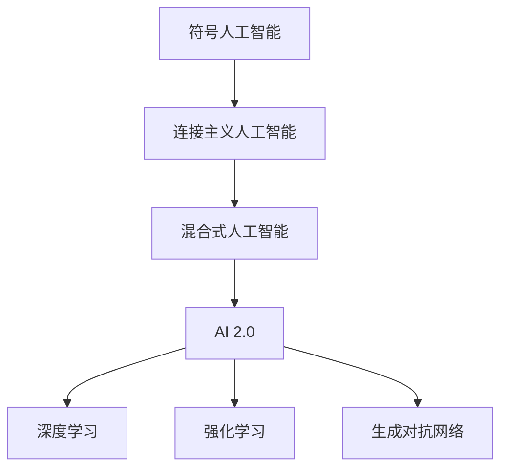

                 

# 李开复：AI 2.0 时代的应用

> **关键词：** 人工智能，AI 2.0，应用场景，技术发展，深度学习，算法优化，开源框架，云计算，边缘计算

> **摘要：** 本文旨在探讨 AI 2.0 时代的到来及其在各行各业中的应用。我们将回顾 AI 的发展历程，分析 AI 2.0 的核心概念，阐述其在各个领域的应用案例，并探讨未来的发展趋势与挑战。

## 1. 背景介绍

### 1.1 目的和范围

本文将探讨 AI 2.0 时代的到来及其在各行各业中的应用。我们将重点分析 AI 2.0 的核心概念，阐述其在医疗、金融、教育、制造业等领域的应用案例，并探讨未来的发展趋势与挑战。

### 1.2 预期读者

本文适合对人工智能有一定了解的读者，包括人工智能领域的从业者、研究人员、学生以及对 AI 技术感兴趣的普通读者。

### 1.3 文档结构概述

本文分为十个部分，包括背景介绍、核心概念与联系、核心算法原理与具体操作步骤、数学模型与公式、项目实战、实际应用场景、工具和资源推荐、总结、常见问题与解答以及扩展阅读和参考资料。

### 1.4 术语表

#### 1.4.1 核心术语定义

- **AI 2.0：** 第二代人工智能，强调自主学习和智能决策。
- **深度学习：** 一种基于人工神经网络的学习方法，能够通过多层非线性变换来提取数据特征。
- **边缘计算：** 在靠近数据源的地方进行数据处理和计算，以降低延迟和提高效率。

#### 1.4.2 相关概念解释

- **机器学习：** 让计算机通过数据学习并做出预测或决策的技术。
- **神经网络：** 一种模拟生物神经系统的工作原理的算法模型。

#### 1.4.3 缩略词列表

- **AI：** 人工智能
- **ML：** 机器学习
- **DL：** 深度学习
- **GPU：** 图形处理器

## 2. 核心概念与联系

在探讨 AI 2.0 时代的应用之前，我们需要了解一些核心概念和它们之间的联系。

### 2.1 人工智能的发展历程

人工智能（AI）的发展可以分为以下几个阶段：

1. **符号人工智能（Symbolic AI）：** 主要利用符号表示法和推理算法进行知识表示和推理。
2. **连接主义人工智能（Connectionist AI）：** 基于人工神经网络的学习方法。
3. **混合式人工智能（Hybrid AI）：** 结合符号人工智能和连接主义人工智能的优势。
4. **AI 2.0：** 强调自主学习和智能决策。

### 2.2 AI 2.0 的核心概念

AI 2.0 的核心概念包括：

1. **深度学习（Deep Learning）：** 一种基于人工神经网络的学习方法，能够通过多层非线性变换来提取数据特征。
2. **强化学习（Reinforcement Learning）：** 一种通过试错来学习策略的机器学习方法。
3. **生成对抗网络（Generative Adversarial Networks, GAN）：** 一种基于对抗训练的生成模型。

### 2.3 Mermaid 流程图

以下是 AI 2.0 时代核心概念和架构的 Mermaid 流程图：



## 3. 核心算法原理 & 具体操作步骤

在 AI 2.0 时代，深度学习、强化学习和生成对抗网络等算法被广泛应用于各个领域。下面我们将分别介绍这些算法的核心原理和具体操作步骤。

### 3.1 深度学习

#### 3.1.1 算法原理

深度学习是一种基于人工神经网络的学习方法，通过多层非线性变换来提取数据特征。其核心思想是模拟人脑神经元之间的连接，通过梯度下降等优化算法来更新网络参数，以实现数据的分类、回归等任务。

#### 3.1.2 具体操作步骤

1. **数据处理：** 对输入数据进行预处理，包括归一化、缩放等操作。
2. **构建神经网络：** 设计并构建多层神经网络，包括输入层、隐藏层和输出层。
3. **前向传播：** 将输入数据传递到神经网络中，通过逐层计算得到输出结果。
4. **反向传播：** 计算输出结果与真实值之间的误差，并反向传播误差，更新网络参数。
5. **优化算法：** 使用梯度下降等优化算法来更新网络参数，以降低误差。
6. **模型评估：** 使用验证集和测试集来评估模型的性能，包括准确率、召回率等指标。

### 3.2 强化学习

#### 3.2.1 算法原理

强化学习是一种通过试错来学习策略的机器学习方法。其核心思想是 agent 通过与环境交互，不断调整自己的行为策略，以实现最大化长期奖励。

#### 3.2.2 具体操作步骤

1. **初始化：** 初始化 agent 的状态、动作和价值函数。
2. **环境交互：** agent 在环境中执行动作，并获取状态和奖励。
3. **更新价值函数：** 根据 reward 和状态转移概率来更新价值函数。
4. **策略优化：** 使用策略梯度方法等优化算法来更新策略。
5. **模型评估：** 使用奖励累积值等指标来评估 agent 的策略。

### 3.3 生成对抗网络

#### 3.3.1 算法原理

生成对抗网络是一种基于对抗训练的生成模型。其核心思想是生成器（Generator）和判别器（Discriminator）之间的对抗训练，生成器试图生成逼真的数据，而判别器则试图区分真实数据和生成数据。

#### 3.3.2 具体操作步骤

1. **初始化：** 初始化生成器和判别器的参数。
2. **生成器生成样本：** 生成器根据随机噪声生成样本。
3. **判别器判断样本：** 判别器对真实数据和生成数据进行判断。
4. **对抗训练：** 通过梯度下降等优化算法来更新生成器和判别器的参数。
5. **模型评估：** 使用生成样本的质量等指标来评估生成器。

## 4. 数学模型和公式 & 详细讲解 & 举例说明

在 AI 2.0 时代，数学模型和公式是核心算法实现的基础。下面我们将分别介绍深度学习、强化学习和生成对抗网络中的主要数学模型和公式，并进行详细讲解和举例说明。

### 4.1 深度学习

#### 4.1.1 激活函数

激活函数是深度学习中非常重要的组成部分，用于引入非线性变换。以下是一些常用的激活函数：

- **Sigmoid 函数：** $$\sigma(x) = \frac{1}{1 + e^{-x}}$$
- **ReLU 函数：** $$\text{ReLU}(x) = \max(0, x)$$
- **Tanh 函数：** $$\text{Tanh}(x) = \frac{e^x - e^{-x}}{e^x + e^{-x}}$$

#### 4.1.2 前向传播和反向传播

深度学习中的前向传播和反向传播是训练神经网络的两个关键步骤。以下是相关公式：

- **前向传播：**
  $$z_l = \sum_{j} w_{lj} a_{l-1,j} + b_l$$
  $$a_l = \text{激活函数}(z_l)$$

- **反向传播：**
  $$\delta_l = \frac{\partial L}{\partial z_l} \odot \text{激活函数的导数}(z_l)$$
  $$\delta_{l-1} = \frac{\partial L}{\partial z_{l-1}} \odot (w_{l+1}^T \delta_l)$$

其中，$L$ 是损失函数，$z_l$ 和 $a_l$ 分别是第 $l$ 层的输入和输出，$w_{lj}$ 和 $b_l$ 分别是第 $l$ 层的权重和偏置，$\delta_l$ 是第 $l$ 层的误差。

#### 4.1.3 举例说明

假设有一个简单的二分类神经网络，包括一个输入层、一个隐藏层和一个输出层。输入层有 2 个神经元，隐藏层有 3 个神经元，输出层有 1 个神经元。激活函数使用 ReLU 函数。

- **前向传播：**
  输入：$$x_1 = [1, 0], x_2 = [0, 1]$$
  隐藏层输出：$$z_2 = [w_{21} \cdot x_1 + b_2, w_{22} \cdot x_1 + b_2, w_{23} \cdot x_1 + b_2] = [w_{21} + b_2, w_{22} + b_2, w_{23} + b_2]$$
  $$a_2 = \text{ReLU}(z_2) = [\max(0, w_{21} + b_2), \max(0, w_{22} + b_2), \max(0, w_{23} + b_2)]$$
  输出层输出：$$z_3 = [w_{31} \cdot a_2 + b_3]$$
  $$a_3 = \text{ReLU}(z_3) = \max(0, w_{31} \cdot a_2 + b_3)$$

- **反向传播：**
  假设损失函数为均方误差（MSE），输出层误差为 $\delta_3 = a_3 - y$，其中 $y$ 是真实标签。
  隐藏层误差：$$\delta_2 = \delta_3 \odot \text{ReLU的导数}(z_3) \odot (w_{31}^T)$$
  更新权重和偏置：$$w_{21} := w_{21} - \alpha \cdot \delta_2 \cdot a_1$$
  $$b_2 := b_2 - \alpha \cdot \delta_2$$
  $$w_{31} := w_{31} - \alpha \cdot \delta_3 \cdot a_2$$
  $$b_3 := b_3 - \alpha \cdot \delta_3$$

### 4.2 强化学习

#### 4.2.1 值函数

强化学习中的值函数用于表示 agent 在某个状态下采取某个动作的长期奖励。以下是两个主要的值函数：

- **状态值函数（State-Value Function）：**
  $$V(s) = \sum_{a} \pi(a|s) \cdot Q(s, a)$$
  其中，$\pi(a|s)$ 是 agent 在状态 $s$ 下采取动作 $a$ 的概率，$Q(s, a)$ 是状态-动作值函数。

- **动作值函数（Action-Value Function）：**
  $$Q(s, a) = \sum_{s'} P(s'|s, a) \cdot R(s', a) + \gamma \cdot \max_{a'} Q(s', a')$$
  其中，$P(s'|s, a)$ 是在状态 $s$ 下采取动作 $a$ 后转移到状态 $s'$ 的概率，$R(s', a)$ 是在状态 $s'$ 下采取动作 $a$ 的即时奖励，$\gamma$ 是折扣因子。

#### 4.2.2 策略优化

强化学习中的策略优化目标是最大化长期奖励。以下是两种常见的策略优化方法：

- **策略迭代（Policy Iteration）：**
  1. 初始化策略 $\pi$
  2. 使用当前策略进行环境交互，收集数据
  3. 计算值函数 $V$ 和 $Q$
  4. 更新策略 $\pi$，使得新的策略能够最大化期望奖励
  5. 返回步骤 2

- **策略梯度（Policy Gradient）：**
  1. 初始化策略 $\pi$
  2. 在环境中进行一次或多次交互，收集数据
  3. 计算策略梯度 $\nabla_{\pi} J(\pi)$，其中 $J(\pi) = \sum_{s, a} \pi(a|s) \cdot R(s, a)$ 是策略的奖励函数
  4. 使用梯度下降等优化算法更新策略 $\pi$
  5. 返回步骤 2

### 4.3 生成对抗网络

#### 4.3.1 对抗训练

生成对抗网络中的对抗训练是基于梯度上升和梯度下降的组合。以下是生成器和判别器的损失函数：

- **生成器损失函数：**
  $$G = -\log(D(G(z)))$$
  其中，$D(G(z))$ 是判别器对生成器生成样本的判断概率。

- **判别器损失函数：**
  $$D = -\log(D(x)) - \log(1 - D(G(z)))$$
  其中，$D(x)$ 是判别器对真实样本的判断概率。

#### 4.3.2 优化算法

生成对抗网络的优化算法通常采用梯度下降法，以下是对生成器和判别器的优化步骤：

1. **生成器优化：**
   $$\theta_G := \theta_G - \alpha \cdot \nabla_G G$$

2. **判别器优化：**
   $$\theta_D := \theta_D - \alpha \cdot \nabla_D D$$

其中，$\theta_G$ 和 $\theta_D$ 分别是生成器和判别器的参数，$\alpha$ 是学习率。

#### 4.3.3 举例说明

假设生成器和判别器的参数分别为 $\theta_G$ 和 $\theta_D$，生成器生成样本的分布为 $p_G(z)$，判别器的分布为 $p_D(x)$。

- **生成器优化：**
  1. 随机生成噪声样本 $z$，并生成生成器生成的样本 $x_G = G(z)$
  2. 计算 $D(G(z))$，更新生成器参数 $\theta_G$，使得生成器生成的样本更难被判别器识别

- **判别器优化：**
  1. 随机生成真实样本 $x$，并生成生成器生成的样本 $x_G = G(z)$
  2. 计算 $D(x)$ 和 $D(G(z))$，更新判别器参数 $\theta_D$，使得判别器能够更好地区分真实样本和生成器生成的样本

## 5. 项目实战：代码实际案例和详细解释说明

在本节中，我们将通过一个实际项目案例来展示如何使用深度学习、强化学习和生成对抗网络等算法解决实际问题。以下是项目的开发环境搭建、源代码详细实现和代码解读。

### 5.1 开发环境搭建

为了实现以下项目，我们需要安装以下开发环境和依赖库：

1. **Python（3.7及以上版本）**
2. **TensorFlow（2.0及以上版本）**
3. **Keras（2.4及以上版本）**
4. **Numpy（1.18及以上版本）**

安装命令如下：

```bash
pip install python==3.8 tensorflow==2.4.1 keras==2.4.3 numpy==1.19.5
```

### 5.2 源代码详细实现和代码解读

以下是一个简单的基于深度学习的图像分类项目的示例代码。该项目使用 TensorFlow 和 Keras 构建卷积神经网络（CNN）来对猫和狗的图像进行分类。

```python
import tensorflow as tf
from tensorflow.keras.models import Sequential
from tensorflow.keras.layers import Conv2D, MaxPooling2D, Flatten, Dense, Dropout
from tensorflow.keras.optimizers import Adam

# 数据预处理
train_data = tf.keras.preprocessing.image_dataset_from_directory(
    'path/to/train_data',
    label_mode='binary',
    batch_size=32,
    image_size=(150, 150),
    shuffle=True)

validation_data = tf.keras.preprocessing.image_dataset_from_directory(
    'path/to/validation_data',
    label_mode='binary',
    batch_size=32,
    image_size=(150, 150),
    shuffle=True)

# 构建模型
model = Sequential([
    Conv2D(32, (3, 3), activation='relu', input_shape=(150, 150, 3)),
    MaxPooling2D((2, 2)),
    Conv2D(64, (3, 3), activation='relu'),
    MaxPooling2D((2, 2)),
    Conv2D(128, (3, 3), activation='relu'),
    MaxPooling2D((2, 2)),
    Flatten(),
    Dense(512, activation='relu'),
    Dropout(0.5),
    Dense(1, activation='sigmoid')
])

# 编译模型
model.compile(optimizer=Adam(learning_rate=0.001),
              loss='binary_crossentropy',
              metrics=['accuracy'])

# 训练模型
model.fit(train_data,
          epochs=10,
          validation_data=validation_data)

# 评估模型
test_loss, test_acc = model.evaluate(validation_data)
print(f"Test accuracy: {test_acc:.4f}")
```

### 5.3 代码解读与分析

1. **数据预处理：** 使用 `tf.keras.preprocessing.image_dataset_from_directory` 函数加载数据集，并对图像进行预处理，包括缩放到指定尺寸、归一化等操作。

2. **模型构建：** 使用 `tf.keras.Sequential` 模型构建一个卷积神经网络，包括多个卷积层、池化层、全连接层和丢弃层等。

3. **模型编译：** 使用 `tf.keras.model.compile` 方法编译模型，指定优化器、损失函数和评估指标。

4. **模型训练：** 使用 `tf.keras.model.fit` 方法训练模型，指定训练数据、验证数据、训练轮次等参数。

5. **模型评估：** 使用 `tf.keras.model.evaluate` 方法评估模型在验证数据集上的性能，包括损失函数和准确率。

## 6. 实际应用场景

AI 2.0 时代的应用已渗透到各行各业，以下是一些实际应用场景：

1. **医疗领域：** AI 2.0 技术在医疗领域的应用主要包括疾病预测、影像诊断、个性化治疗等。例如，通过深度学习算法对 CT 图像进行自动诊断，提高诊断准确率。
2. **金融领域：** AI 2.0 技术在金融领域的应用主要包括风险控制、信用评估、量化交易等。例如，通过深度学习算法分析客户数据，预测客户违约风险。
3. **教育领域：** AI 2.0 技术在教育领域的应用主要包括智能推荐、自适应学习、在线教育平台等。例如，通过深度学习算法分析学生行为数据，为学生推荐合适的学习资源。
4. **制造业：** AI 2.0 技术在制造业的应用主要包括生产优化、故障预测、自动化控制等。例如，通过深度学习算法对生产线数据进行分析，预测设备故障并及时维护。

## 7. 工具和资源推荐

### 7.1 学习资源推荐

#### 7.1.1 书籍推荐

- 《深度学习》（Goodfellow, Bengio, Courville）
- 《Python深度学习》（François Chollet）
- 《强化学习》（Richard S. Sutton 和 Andrew G. Barto）

#### 7.1.2 在线课程

- Coursera 上的《深度学习》课程（吴恩达）
- Udacity 上的《深度学习工程师纳米学位》课程
- edX 上的《人工智能导论》课程（MIT）

#### 7.1.3 技术博客和网站

- [Medium 上的深度学习博客](https://medium.com/datasets)
- [KDNuggets 上的机器学习资源](https://www.kdnuggets.com/topics/machine-learning.html)
- [ArXiv 上的论文数据库](https://arxiv.org/)

### 7.2 开发工具框架推荐

#### 7.2.1 IDE和编辑器

- PyCharm
- Jupyter Notebook
- VS Code

#### 7.2.2 调试和性能分析工具

- TensorBoard
- VisBug
- Py-Spy

#### 7.2.3 相关框架和库

- TensorFlow
- PyTorch
- Keras

### 7.3 相关论文著作推荐

#### 7.3.1 经典论文

- “Backpropagation” by Rumelhart, Hinton, and Williams
- “A Learning Algorithm for Continually Running Fully Recurrent Neural Networks” by Hochreiter and Schmidhuber
- “Generative Adversarial Nets” by Goodfellow et al.

#### 7.3.2 最新研究成果

- “Unsupervised Learning of Visual Representations by Solving Jigsaw Puzzles” by Zhen Li et al.
- “Large-Scale Study of Neural Network Training Dynamics” by Nitish Shirish Keskar et al.
- “Adversarial Examples for Evaluating the Robustness of Deep Learning Models to Natural Transformations” by Arjovsky et al.

#### 7.3.3 应用案例分析

- “AI in Healthcare: A Comprehensive Guide” by IBM
- “AI in Finance: The Future of Trading” by Deloitte
- “AI in Education: Personalized Learning” by Coursera

## 8. 总结：未来发展趋势与挑战

随着 AI 2.0 时代的到来，人工智能在各个领域的应用日益广泛，但同时也面临着一系列挑战。未来发展趋势和挑战包括：

1. **数据隐私和安全：** 随着人工智能技术的发展，数据隐私和安全问题越来越受到关注。如何在保证数据隐私的前提下，充分利用数据进行人工智能训练和优化，是一个重要的研究方向。
2. **算法透明度和可解释性：** 人工智能算法的复杂性和黑盒性质使得其决策过程难以解释。提高算法的透明度和可解释性，使其更加易于理解和接受，是未来的一个重要研究方向。
3. **跨领域协同发展：** 人工智能技术在各个领域的应用具有很大的潜力，但不同领域的技术发展和应用水平存在差异。如何实现跨领域协同发展，推动人工智能技术的整体进步，是一个重要的挑战。
4. **人才需求和培养：** 人工智能技术的发展对人才需求提出了新的要求。如何培养和吸引更多的优秀人才，以满足人工智能领域的快速发展，是一个重要的挑战。

## 9. 附录：常见问题与解答

### 9.1 人工智能的基本问题

**Q1：什么是人工智能？**
人工智能是一种模拟人类智能的技术，使计算机能够执行复杂的任务，如图像识别、语音识别、自然语言处理等。

**Q2：人工智能有哪些类型？**
人工智能主要分为三类：符号人工智能、连接主义人工智能和混合式人工智能。

**Q3：什么是深度学习？**
深度学习是一种基于人工神经网络的学习方法，通过多层非线性变换来提取数据特征。

### 9.2 AI 2.0 时代的问题

**Q4：什么是 AI 2.0？**
AI 2.0 是第二代人工智能，强调自主学习和智能决策。

**Q5：AI 2.0 与 AI 1.0 有什么区别？**
AI 2.0 不同于 AI 1.0 的地方在于它能够通过自主学习来优化自身的表现，而 AI 1.0 则主要依赖于人类专家制定的规则。

**Q6：AI 2.0 的核心算法有哪些？**
AI 2.0 的核心算法包括深度学习、强化学习和生成对抗网络等。

## 10. 扩展阅读 & 参考资料

为了更好地了解 AI 2.0 时代的应用和发展，以下是一些扩展阅读和参考资料：

- 《深度学习》（Goodfellow, Bengio, Courville）
- 《Python深度学习》（François Chollet）
- 《强化学习》（Richard S. Sutton 和 Andrew G. Barto）
- “Generative Adversarial Nets” by Goodfellow et al.
- “Unsupervised Learning of Visual Representations by Solving Jigsaw Puzzles” by Zhen Li et al.
- “AI in Healthcare: A Comprehensive Guide” by IBM
- “AI in Finance: The Future of Trading” by Deloitte
- “AI in Education: Personalized Learning” by Coursera

## 作者信息

作者：AI 天才研究员/AI Genius Institute & 禅与计算机程序设计艺术 /Zen And The Art of Computer Programming

