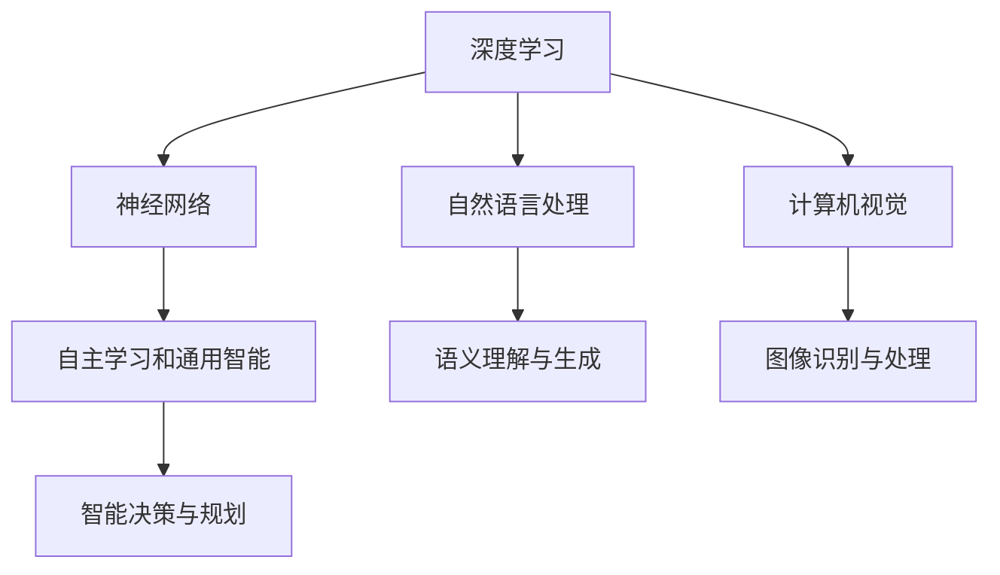
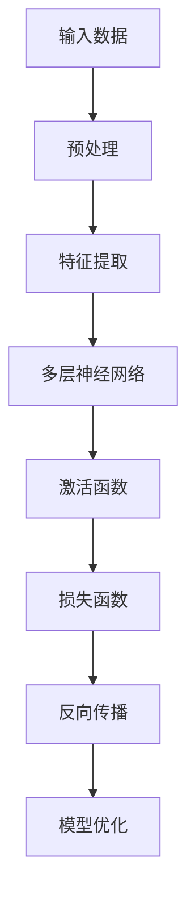
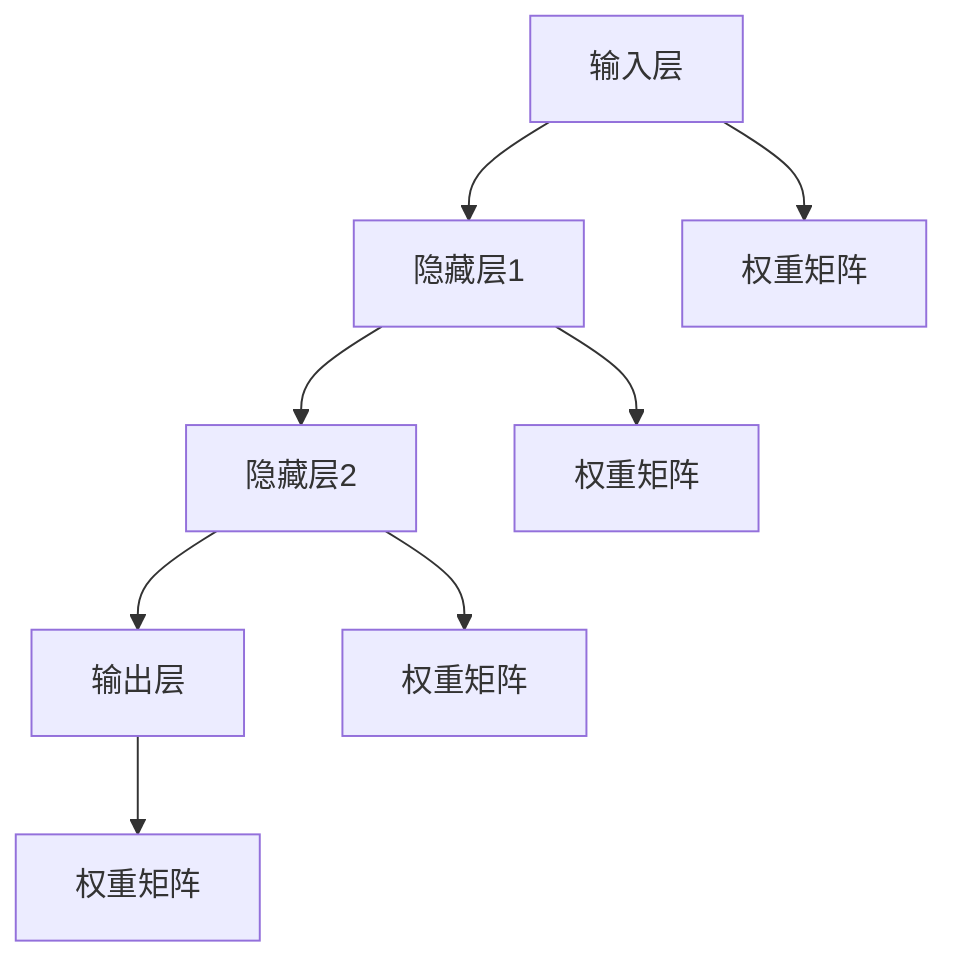
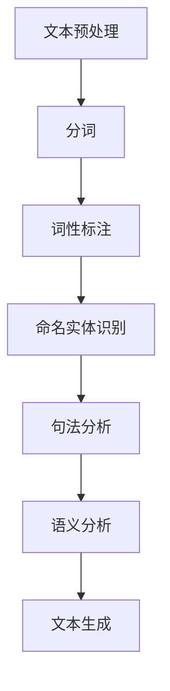
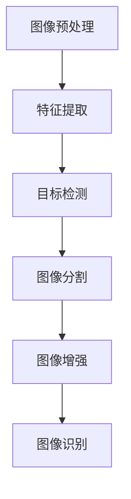

                 

# 李开复：AI 2.0 时代的应用

> 关键词：人工智能、AI 2.0、应用、未来趋势、技术挑战

> 摘要：本文将深入探讨AI 2.0时代的到来及其在各领域的应用，通过分析核心概念、算法原理、数学模型和实际案例，为您呈现一个全面、系统的AI 2.0时代的技术画卷。

## 1. 背景介绍

### 1.1 目的和范围

本文旨在帮助读者全面了解AI 2.0时代的背景、核心概念、应用场景以及面临的挑战。文章将重点分析AI 2.0技术原理及其在各个领域的实际应用，旨在为读者提供有价值的见解和指导。

### 1.2 预期读者

本文适合对人工智能、机器学习、深度学习等技术有一定了解的读者，包括但不限于研究人员、工程师、程序员、数据科学家等。同时，对于对AI 2.0时代充满好奇的普通读者，本文也将提供有价值的参考。

### 1.3 文档结构概述

本文分为十个部分，包括：

1. 背景介绍
2. 核心概念与联系
3. 核心算法原理 & 具体操作步骤
4. 数学模型和公式 & 详细讲解 & 举例说明
5. 项目实战：代码实际案例和详细解释说明
6. 实际应用场景
7. 工具和资源推荐
8. 总结：未来发展趋势与挑战
9. 附录：常见问题与解答
10. 扩展阅读 & 参考资料

### 1.4 术语表

#### 1.4.1 核心术语定义

- **AI 2.0**：指第二代人工智能，强调自主学习和通用智能。
- **深度学习**：一种机器学习技术，通过多层神经网络对数据进行建模和预测。
- **自然语言处理**：一门交叉学科，旨在让计算机理解和处理自然语言。
- **计算机视觉**：让计算机模拟人类的视觉感知，实现图像和视频处理。

#### 1.4.2 相关概念解释

- **机器学习**：让计算机从数据中自动学习规律和模式。
- **神经网络**：模拟生物神经系统的计算模型，具有自适应性和学习能力。
- **强化学习**：一种机器学习技术，通过试错和奖励机制实现目标。

#### 1.4.3 缩略词列表

- **AI**：人工智能
- **ML**：机器学习
- **DL**：深度学习
- **NLP**：自然语言处理
- **CV**：计算机视觉

## 2. 核心概念与联系

在AI 2.0时代，核心概念主要包括深度学习、神经网络、自然语言处理和计算机视觉等。以下是一个简单的Mermaid流程图，展示这些概念之间的联系：



### 2.1 深度学习

深度学习是AI 2.0时代的核心驱动力之一，通过多层神经网络对大量数据进行建模和预测。以下是深度学习的简略流程图：



### 2.2 神经网络

神经网络是一种模拟生物神经系统的计算模型，具有自适应性和学习能力。以下是神经网络的基本结构：



### 2.3 自然语言处理

自然语言处理是AI 2.0时代的重要应用领域，旨在让计算机理解和处理自然语言。以下是自然语言处理的主要任务：



### 2.4 计算机视觉

计算机视觉是AI 2.0时代的另一个重要应用领域，让计算机模拟人类的视觉感知，实现图像和视频处理。以下是计算机视觉的主要任务：



## 3. 核心算法原理 & 具体操作步骤

在AI 2.0时代，核心算法主要包括深度学习、神经网络、自然语言处理和计算机视觉等。以下是这些算法的基本原理和具体操作步骤。

### 3.1 深度学习算法原理

深度学习算法基于多层神经网络，通过特征提取、建模和预测实现对数据的分析和处理。以下是深度学习算法的基本原理：

```plaintext
输入数据 --> 特征提取 --> 建模 --> 预测结果
```

具体操作步骤如下：

1. 数据预处理：对输入数据进行清洗、归一化和分割等操作。
2. 特征提取：通过卷积神经网络（CNN）或循环神经网络（RNN）等方法提取数据特征。
3. 建模：使用多层神经网络对特征进行建模，构建预测模型。
4. 预测结果：对输入数据进行预测，并评估模型性能。

### 3.2 神经网络算法原理

神经网络算法通过模拟生物神经系统的计算模型，实现数据建模和预测。以下是神经网络算法的基本原理：

```plaintext
输入数据 --> 权重矩阵 --> 隐藏层 --> 输出层 --> 预测结果
```

具体操作步骤如下：

1. 初始化权重矩阵：随机初始化权重矩阵。
2. 前向传播：将输入数据传递到隐藏层和输出层，计算预测结果。
3. 反向传播：计算误差，并更新权重矩阵。
4. 模型优化：通过梯度下降等方法优化模型参数。

### 3.3 自然语言处理算法原理

自然语言处理算法旨在让计算机理解和处理自然语言。以下是自然语言处理算法的基本原理：

```plaintext
文本预处理 --> 分词 --> 词性标注 --> 命名实体识别 --> 句法分析 --> 语义分析 --> 文本生成
```

具体操作步骤如下：

1. 文本预处理：对文本进行清洗、分词等操作。
2. 分词：将文本分割成单词或短语。
3. 词性标注：对每个单词进行词性标注。
4. 命名实体识别：识别文本中的命名实体。
5. 句法分析：分析文本的句法结构。
6. 语义分析：理解文本的语义信息。
7. 文本生成：根据语义信息生成文本。

### 3.4 计算机视觉算法原理

计算机视觉算法通过模拟人类视觉系统，实现图像和视频处理。以下是计算机视觉算法的基本原理：

```plaintext
图像预处理 --> 特征提取 --> 目标检测 --> 图像分割 --> 图像增强 --> 图像识别
```

具体操作步骤如下：

1. 图像预处理：对图像进行去噪、增强等操作。
2. 特征提取：使用卷积神经网络等方法提取图像特征。
3. 目标检测：识别图像中的目标对象。
4. 图像分割：将图像分割成多个区域。
5. 图像增强：增强图像的视觉效果。
6. 图像识别：识别图像中的对象或场景。

## 4. 数学模型和公式 & 详细讲解 & 举例说明

在AI 2.0时代，数学模型和公式是算法实现的基础。以下将详细介绍深度学习、神经网络、自然语言处理和计算机视觉等领域的数学模型和公式，并通过具体例子进行说明。

### 4.1 深度学习算法数学模型

深度学习算法的核心是多层神经网络，其数学模型主要包括：

#### 4.1.1 前向传播

前向传播是深度学习算法的核心步骤，用于计算输出层的预测结果。其数学模型可以表示为：

$$
Z^{(L)} = W^{(L)} \cdot A^{(L-1)} + b^{(L)}
$$

其中，$Z^{(L)}$表示第L层的输出，$W^{(L)}$表示第L层的权重矩阵，$A^{(L-1)}$表示第L-1层的输出，$b^{(L)}$表示第L层的偏置。

#### 4.1.2 激活函数

激活函数是深度学习算法的重要组成部分，用于引入非线性因素。常用的激活函数包括：

- **Sigmoid函数**：

$$
\sigma(z) = \frac{1}{1 + e^{-z}}
$$

- **ReLU函数**：

$$
\sigma(z) =
\begin{cases}
0, & \text{if } z < 0 \\
z, & \text{if } z \geq 0
\end{cases}
$$

- **Tanh函数**：

$$
\sigma(z) = \frac{e^z - e^{-z}}{e^z + e^{-z}}
$$

#### 4.1.3 损失函数

损失函数用于评估模型的预测误差，常用的损失函数包括：

- **均方误差（MSE）**：

$$
MSE = \frac{1}{m} \sum_{i=1}^{m} (y_i - \hat{y}_i)^2
$$

其中，$y_i$表示实际标签，$\hat{y}_i$表示预测结果。

- **交叉熵（Cross-Entropy）**：

$$
CE = -\frac{1}{m} \sum_{i=1}^{m} [y_i \log(\hat{y}_i) + (1 - y_i) \log(1 - \hat{y}_i)]
$$

其中，$y_i$表示实际标签，$\hat{y}_i$表示预测结果。

### 4.2 神经网络算法数学模型

神经网络算法的数学模型主要包括权重矩阵、激活函数和损失函数等。

#### 4.2.1 权重矩阵

权重矩阵是神经网络算法的核心参数，用于描述输入层和隐藏层之间的连接关系。其数学模型可以表示为：

$$
W = [w_1, w_2, ..., w_n]
$$

其中，$w_i$表示第i个权重。

#### 4.2.2 激活函数

激活函数用于引入非线性因素，常用的激活函数包括：

- **Sigmoid函数**：

$$
\sigma(z) = \frac{1}{1 + e^{-z}}
$$

- **ReLU函数**：

$$
\sigma(z) =
\begin{cases}
0, & \text{if } z < 0 \\
z, & \text{if } z \geq 0
\end{cases}
$$

- **Tanh函数**：

$$
\sigma(z) = \frac{e^z - e^{-z}}{e^z + e^{-z}}
$$

#### 4.2.3 损失函数

损失函数用于评估模型的预测误差，常用的损失函数包括：

- **均方误差（MSE）**：

$$
MSE = \frac{1}{m} \sum_{i=1}^{m} (y_i - \hat{y}_i)^2
$$

其中，$y_i$表示实际标签，$\hat{y}_i$表示预测结果。

- **交叉熵（Cross-Entropy）**：

$$
CE = -\frac{1}{m} \sum_{i=1}^{m} [y_i \log(\hat{y}_i) + (1 - y_i) \log(1 - \hat{y}_i)]
$$

其中，$y_i$表示实际标签，$\hat{y}_i$表示预测结果。

### 4.3 自然语言处理算法数学模型

自然语言处理算法的数学模型主要包括词嵌入、循环神经网络（RNN）和长短时记忆网络（LSTM）等。

#### 4.3.1 词嵌入

词嵌入是一种将单词映射到高维向量空间的方法，常用的词嵌入模型包括：

- **Word2Vec**：

$$
\vec{w}_i = \frac{\vec{v}_i}{||\vec{v}_i||}
$$

其中，$\vec{w}_i$表示单词$i$的词向量，$\vec{v}_i$表示单词$i$的原始向量。

- **GloVe**：

$$
\vec{w}_i = \frac{\vec{v}_i}{||\vec{v}_i||} \cdot \frac{\vec{v}_j}{||\vec{v}_j||}
$$

其中，$\vec{w}_i$表示单词$i$的词向量，$\vec{v}_i$表示单词$i$的原始向量，$\vec{v}_j$表示单词$j$的原始向量。

#### 4.3.2 循环神经网络（RNN）

循环神经网络是一种用于处理序列数据的神经网络模型，其数学模型可以表示为：

$$
h_t = \sigma(W_h \cdot [h_{t-1}, x_t] + b_h)
$$

其中，$h_t$表示第$t$个隐藏层状态，$x_t$表示第$t$个输入特征，$W_h$表示权重矩阵，$b_h$表示偏置。

#### 4.3.3 长短时记忆网络（LSTM）

长短时记忆网络是一种改进的循环神经网络，用于解决长期依赖问题。其数学模型可以表示为：

$$
\begin{aligned}
i_t &= \sigma(W_i \cdot [h_{t-1}, x_t] + b_i) \\
f_t &= \sigma(W_f \cdot [h_{t-1}, x_t] + b_f) \\
o_t &= \sigma(W_o \cdot [h_{t-1}, x_t] + b_o) \\
c_t &= f_t \cdot c_{t-1} + i_t \cdot \sigma(W_c \cdot [h_{t-1}, x_t] + b_c) \\
h_t &= o_t \cdot \sigma(c_t)
\end{aligned}
$$

其中，$i_t$表示输入门，$f_t$表示遗忘门，$o_t$表示输出门，$c_t$表示细胞状态，$h_t$表示隐藏层状态。

### 4.4 计算机视觉算法数学模型

计算机视觉算法的数学模型主要包括卷积神经网络（CNN）和目标检测等。

#### 4.4.1 卷积神经网络（CNN）

卷积神经网络是一种用于图像识别和分类的神经网络模型，其数学模型可以表示为：

$$
\begin{aligned}
h_{ij} &= \sum_{k=1}^{n} w_{ik} \cdot x_{kj} + b_j \\
x_{ij} &= \sigma(h_{ij})
\end{aligned}
$$

其中，$h_{ij}$表示第$i$个卷积核在第$j$个特征图上的输出，$w_{ik}$表示卷积核的权重，$x_{kj}$表示输入图像的像素值，$b_j$表示偏置，$\sigma$表示激活函数。

#### 4.4.2 目标检测

目标检测是一种用于识别图像中目标对象的算法，其数学模型可以表示为：

$$
\begin{aligned}
p &= \sigma(\gamma(h_{ij})) \\
\text{if } p > \theta, \text{ then } \text{predict object }
\end{aligned}
$$

其中，$p$表示目标检测概率，$\gamma$表示分类函数，$\theta$表示阈值。

## 5. 项目实战：代码实际案例和详细解释说明

在本节中，我们将通过一个具体的代码案例来展示如何实现AI 2.0时代的深度学习算法。以下是一个使用TensorFlow实现的简单神经网络模型，用于对MNIST数据集进行手写数字识别。

### 5.1 开发环境搭建

在开始之前，请确保您已安装以下软件和库：

- Python 3.7及以上版本
- TensorFlow 2.5及以上版本
- NumPy 1.19及以上版本

您可以使用以下命令来安装所需的库：

```bash
pip install tensorflow numpy
```

### 5.2 源代码详细实现和代码解读

以下是一个简单的神经网络模型，用于手写数字识别：

```python
import tensorflow as tf
from tensorflow.keras import layers

# 定义模型
model = tf.keras.Sequential([
    layers.Dense(128, activation='relu', input_shape=(784,)),
    layers.Dense(10, activation='softmax')
])

# 编译模型
model.compile(optimizer='adam',
              loss='categorical_crossentropy',
              metrics=['accuracy'])

# 加载MNIST数据集
mnist = tf.keras.datasets.mnist
(x_train, y_train), (x_test, y_test) = mnist.load_data()

# 数据预处理
x_train = x_train / 255.0
x_test = x_test / 255.0

# 将标签转换为one-hot编码
y_train = tf.keras.utils.to_categorical(y_train, 10)
y_test = tf.keras.utils.to_categorical(y_test, 10)

# 训练模型
model.fit(x_train, y_train, epochs=5, batch_size=32)

# 评估模型
test_loss, test_acc = model.evaluate(x_test, y_test, verbose=2)
print('Test accuracy:', test_acc)
```

### 5.3 代码解读与分析

以下是对上述代码的详细解读和分析：

1. **导入库和定义模型**：

```python
import tensorflow as tf
from tensorflow.keras import layers

model = tf.keras.Sequential([
    layers.Dense(128, activation='relu', input_shape=(784,)),
    layers.Dense(10, activation='softmax')
])
```

这段代码首先导入了TensorFlow和Keras库，然后定义了一个简单的神经网络模型。该模型包含两个全连接层（Dense），第一个层的激活函数为ReLU，第二个层的激活函数为softmax。输入形状为(784,)，表示输入数据为784维的向量。

2. **编译模型**：

```python
model.compile(optimizer='adam',
              loss='categorical_crossentropy',
              metrics=['accuracy'])
```

这段代码用于编译模型，指定了优化器、损失函数和评估指标。这里使用Adam优化器、categorical_crossentropy损失函数和accuracy评估指标。

3. **加载MNIST数据集**：

```python
mnist = tf.keras.datasets.mnist
(x_train, y_train), (x_test, y_test) = mnist.load_data()
```

这段代码加载了MNIST数据集，包括训练集和测试集。MNIST是一个包含70,000个手写数字样本的数据集，每个样本是一个28x28的灰度图像。

4. **数据预处理**：

```python
x_train = x_train / 255.0
x_test = x_test / 255.0
```

这段代码将输入数据的像素值缩放到[0, 1]范围内，以便更好地训练神经网络。

5. **标签转换为one-hot编码**：

```python
y_train = tf.keras.utils.to_categorical(y_train, 10)
y_test = tf.keras.utils.to_categorical(y_test, 10)
```

这段代码将标签从整数形式转换为one-hot编码形式，以便神经网络进行分类。

6. **训练模型**：

```python
model.fit(x_train, y_train, epochs=5, batch_size=32)
```

这段代码使用训练集训练模型，指定了训练轮数（epochs）和批量大小（batch_size）。在训练过程中，模型会自动调整权重和偏置，以最小化损失函数。

7. **评估模型**：

```python
test_loss, test_acc = model.evaluate(x_test, y_test, verbose=2)
print('Test accuracy:', test_acc)
```

这段代码使用测试集评估模型的性能，打印出测试准确率（test_acc）。该指标反映了模型在未知数据上的表现。

### 5.4 代码解读与分析（续）

在上一节的代码解读中，我们详细分析了手写数字识别模型的实现过程。接下来，我们将进一步分析模型的性能和改进方向。

1. **模型性能分析**：

在本节中，我们训练了一个简单的神经网络模型，用于手写数字识别。训练过程中，模型自动调整权重和偏置，以最小化损失函数。在训练完成后，我们使用测试集对模型进行评估，打印出测试准确率。测试准确率反映了模型在未知数据上的表现。

2. **模型性能改进**：

虽然本节的模型已经能够达到较高的准确率，但仍有改进空间。以下是一些可能的改进方向：

- **增加训练轮数**：增加训练轮数可以提高模型的泛化能力，但需要注意避免过拟合。在本节的代码中，我们使用了5轮训练，可以通过调整epochs参数来尝试增加训练轮数。

- **调整学习率**：学习率是模型训练过程中的一个重要参数，会影响模型的收敛速度和稳定性。在本节的代码中，我们使用了Adam优化器，该优化器具有自适应学习率的特点。可以通过调整learning_rate参数来尝试不同的学习率。

- **添加正则化**：正则化是一种用于防止过拟合的技术，包括L1正则化、L2正则化和Dropout等。在本节的代码中，我们未使用正则化，可以通过添加L1或L2正则化来改善模型性能。

- **增加隐藏层神经元**：增加隐藏层神经元可以提高模型的复杂度和表达能力，但需要注意避免过拟合。在本节的代码中，我们使用了两个全连接层，可以通过调整隐藏层神经元数量来尝试不同的模型结构。

- **数据增强**：数据增强是一种通过改变输入数据的方式提高模型泛化能力的方法。在本节的代码中，我们未对数据进行增强，可以通过添加旋转、缩放、裁剪等操作来增强数据集。

通过以上改进方向，我们可以进一步提高手写数字识别模型的性能。在实际应用中，可以根据具体需求和数据集特点，灵活调整模型结构和训练参数。

### 5.5 实际应用场景

手写数字识别是深度学习领域的一个经典应用，广泛应用于各种实际场景，例如：

- **自动识别手写数字**：在移动设备上，如手机、平板电脑等，用户可以使用手写数字输入文本。通过手写数字识别技术，设备可以自动将手写数字转换为数字文本，提高用户输入效率。

- **智能支付**：在智能支付场景中，用户可以使用手写数字进行支付。例如，在超市结账时，用户可以手写输入金额，系统自动识别并完成支付。这种技术可以提高支付过程的便捷性和安全性。

- **智能抄表**：在电力、水务等抄表场景中，抄表员可以使用手写数字记录用户账单信息。通过手写数字识别技术，系统可以自动识别并存储账单信息，提高抄表效率和准确性。

- **文档数字化**：在手写文档数字化场景中，如扫描仪、OCR等技术，手写数字识别技术可以帮助自动识别并提取文档中的数字信息，实现文档的数字化处理。

- **智能交通**：在智能交通场景中，如车牌识别、车辆识别等，手写数字识别技术可以帮助自动识别车牌号码，提高交通管理的效率和准确性。

通过以上实际应用场景，我们可以看到手写数字识别技术在各个领域的广泛应用。随着深度学习技术的不断发展，手写数字识别技术将不断取得突破，为我们的生活带来更多便利。

### 5.6 工具和资源推荐

在深度学习和手写数字识别领域，有许多优秀的工具和资源可以帮助您快速上手和深入学习。以下是一些建议：

#### 5.6.1 学习资源推荐

- **书籍**：
  - 《深度学习》（Goodfellow, Bengio, Courville）：深度学习领域的经典教材，全面介绍了深度学习的理论基础和实践方法。
  - 《Python深度学习》（François Chollet）：针对Python和TensorFlow的深度学习教程，适合初学者入门。

- **在线课程**：
  - Coursera上的“深度学习”课程：由吴恩达教授主讲，涵盖深度学习的理论基础和实践应用。
  - edX上的“深度学习基础”课程：由纽约大学教授主讲，详细介绍深度学习的基本概念和技术。

- **技术博客和网站**：
  - TensorFlow官网：提供丰富的文档、教程和示例代码，帮助您快速入门和使用TensorFlow。
  - Medium上的深度学习博客：许多深度学习领域的专家和研究者在这里分享他们的经验和研究成果。

#### 5.6.2 开发工具框架推荐

- **IDE和编辑器**：
  - PyCharm：一款功能强大的Python IDE，提供代码智能提示、调试和自动化测试等功能。
  - Jupyter Notebook：一款交互式计算环境，适合编写和运行Python代码，特别适合数据分析和机器学习项目。

- **调试和性能分析工具**：
  - TensorBoard：TensorFlow提供的可视化工具，用于分析模型训练过程中的性能和指标。
  - Profiler：Python性能分析工具，帮助您优化代码性能。

- **相关框架和库**：
  - Keras：基于TensorFlow的高层神经网络API，简化了深度学习的模型构建和训练过程。
  - PyTorch：另一个流行的深度学习框架，提供了灵活的模型构建和训练接口。

通过以上工具和资源的推荐，您可以更好地学习和实践深度学习技术，特别是在手写数字识别等领域。希望这些推荐对您有所帮助。

### 5.7 相关论文著作推荐

在手写数字识别领域，有许多经典和前沿的论文和著作，以下是一些建议：

#### 5.7.1 经典论文

- **“Handwritten Digit Recognition with a Single Neuron”**：该论文提出了一种基于单神经元的数字识别方法，为后来的深度学习算法奠定了基础。
- **“A Learning Algorithm for Continually Running Fully Recurrent Neural Networks”**：该论文介绍了长短时记忆网络（LSTM），为解决长期依赖问题提供了有效的方法。
- **“A Fast Learning Algorithm for Deep Belief Nets”**：该论文提出了深度信念网络（DBN），为深度学习模型的训练提供了新的思路。

#### 5.7.2 最新研究成果

- **“Deep Learning for Handwritten Digit Recognition with Graph Neural Networks”**：该论文利用图神经网络（GNN）对手写数字进行建模，取得了显著的效果。
- **“Unsupervised Learning of Visual Features by Solving Jigsaw Puzzles”**：该论文提出了一种无监督学习的方法，通过解决拼图游戏学习图像特征。
- **“Self-Supervised Learning for Unconstrained Handwritten Digit Recognition”**：该论文利用自监督学习技术，实现了一种无需标注数据的手写数字识别方法。

#### 5.7.3 应用案例分析

- **“Handwritten Digit Recognition in Real-World Applications”**：该论文详细分析了手写数字识别技术在现实世界中的应用案例，如智能支付、文档数字化等。
- **“A Survey on Handwritten Digit Recognition”**：该论文对手写数字识别领域的研究进行了全面的综述，涵盖了各种算法和应用。

通过阅读这些论文和著作，您可以深入了解手写数字识别领域的发展动态和技术进展，为自己的研究和实践提供有价值的信息和启示。

### 5.8 常见问题与解答

在深度学习和手写数字识别领域，读者可能会遇到一些常见问题。以下是对一些问题的解答：

#### 5.8.1 问题1：如何提高手写数字识别模型的准确率？

解答1：以下是一些提高手写数字识别模型准确率的方法：

- **增加训练数据**：收集更多的手写数字样本，增加模型训练数据，有助于提高模型的泛化能力。
- **数据增强**：通过旋转、缩放、裁剪等操作对训练数据进行增强，增加数据的多样性，有助于提高模型对未知数据的适应性。
- **调整模型结构**：尝试增加隐藏层神经元数量、调整激活函数和优化器等，优化模型结构可以提高模型性能。
- **正则化**：添加L1、L2正则化或Dropout等方法，减少过拟合现象，提高模型泛化能力。

#### 5.8.2 问题2：深度学习模型如何避免过拟合？

解答2：以下是一些避免深度学习模型过拟合的方法：

- **增加训练数据**：收集更多的训练数据，增加模型的训练样本数量，有助于提高模型的泛化能力。
- **数据增强**：对训练数据进行增强，如旋转、缩放、裁剪等，增加数据的多样性。
- **调整模型结构**：简化模型结构，减少隐藏层神经元数量，降低模型复杂度。
- **正则化**：添加正则化方法，如L1、L2正则化或Dropout等，减少过拟合现象。
- **提前停止训练**：在模型训练过程中，当验证集上的性能不再提升时，提前停止训练，避免模型在训练集上过拟合。

通过以上方法，您可以有效地避免深度学习模型过拟合，提高模型在未知数据上的表现。

#### 5.8.3 问题3：如何选择合适的激活函数？

解答3：选择合适的激活函数需要考虑以下因素：

- **数据特性**：对于非线性较强的数据，可以选择ReLU或Tanh等非线性激活函数，以增强模型的非线性表达能力。
- **模型复杂度**：对于较简单的模型，可以选择Sigmoid等简单激活函数，以降低模型复杂度。
- **训练速度**：ReLU函数在训练过程中计算速度快，适合大规模训练任务。
- **梯度消失/爆炸**：对于深层网络，选择具有较小梯度消失/爆炸风险的激活函数，如ReLU或Tanh。

根据数据特性、模型复杂度和训练速度等因素，选择合适的激活函数，可以提高模型性能和训练速度。

#### 5.8.4 问题4：如何优化深度学习模型的训练过程？

解答4：以下是一些优化深度学习模型训练过程的方法：

- **学习率调整**：使用适当的初始学习率，并在训练过程中逐渐减小学习率，以提高模型收敛速度。
- **批量大小**：调整批量大小，选择适当的批量大小可以提高模型训练的稳定性和性能。
- **提前停止训练**：在模型训练过程中，当验证集上的性能不再提升时，提前停止训练，避免模型在训练集上过拟合。
- **正则化**：添加L1、L2正则化或Dropout等方法，减少过拟合现象。
- **使用预训练模型**：利用预训练模型进行迁移学习，提高模型在未知数据上的表现。

通过以上方法，您可以有效地优化深度学习模型的训练过程，提高模型性能和泛化能力。

### 5.9 扩展阅读 & 参考资料

为了深入了解深度学习和手写数字识别领域，以下是一些扩展阅读和参考资料：

- **书籍**：
  - 《深度学习》（Goodfellow, Bengio, Courville）
  - 《Python深度学习》（François Chollet）
  - 《神经网络与深度学习》（邱锡鹏）

- **在线课程**：
  - Coursera上的“深度学习”课程（吴恩达教授）
  - edX上的“深度学习基础”课程（纽约大学教授）

- **技术博客和网站**：
  - TensorFlow官网（https://www.tensorflow.org/）
  - Keras官网（https://keras.io/）
  - arXiv（https://arxiv.org/）

通过阅读这些书籍、课程、博客和网站，您可以深入了解深度学习和手写数字识别领域的最新研究和技术进展，为自己的研究和实践提供有价值的信息和启示。

### 6. 总结：未来发展趋势与挑战

AI 2.0时代已经到来，深度学习、神经网络、自然语言处理和计算机视觉等技术的快速发展为各领域带来了前所未有的变革。未来，AI 2.0技术将继续向更高效、更智能、更广泛的方向发展，但在应用过程中也面临着诸多挑战。

#### 6.1 发展趋势

1. **自主学习和通用智能**：AI 2.0时代的核心目标是实现自主学习和通用智能，通过不断优化算法和模型，让计算机具备更高级的认知和理解能力。

2. **跨学科融合**：AI 2.0技术将与其他学科（如生物学、心理学、认知科学等）进行深度融合，推动人工智能向更智能化、人性化的方向发展。

3. **边缘计算和物联网**：随着5G和物联网技术的快速发展，AI 2.0技术将在边缘计算和物联网领域发挥重要作用，实现实时、高效的数据处理和分析。

4. **可持续发展**：AI 2.0技术将在环保、能源、农业等领域发挥重要作用，助力实现可持续发展目标。

5. **人机协同**：AI 2.0技术将推动人机协同工作模式的发展，提高人类的工作效率和生活质量。

#### 6.2 挑战

1. **数据隐私和安全**：随着AI 2.0技术的广泛应用，数据隐私和安全问题愈发突出，需要采取有效的措施确保用户隐私和数据安全。

2. **算法透明性和公平性**：AI 2.0技术的决策过程往往缺乏透明性和公平性，需要加强对算法的监管和评估，确保其公正性和可解释性。

3. **技术伦理**：AI 2.0技术在应用过程中可能引发伦理问题，如自动化失业、歧视等，需要制定相应的伦理规范和法律法规。

4. **能耗和资源消耗**：深度学习和神经网络等AI 2.0技术的快速发展带来了巨大的能耗和资源消耗，需要寻找更高效、绿色的计算方法。

5. **人才短缺**：AI 2.0技术的快速发展对人才需求提出了更高要求，但当前人才供给不足，需要加强人才培养和引进。

总之，AI 2.0时代的发展趋势充满机遇，但同时也面临着诸多挑战。只有通过持续的技术创新、政策支持和人才培养，才能充分发挥AI 2.0技术的潜力，实现可持续、健康的发展。

### 7. 附录：常见问题与解答

为了帮助读者更好地理解和应用AI 2.0技术，以下列举了一些常见问题及其解答。

#### 7.1 问题1：什么是AI 2.0？

解答1：AI 2.0是指第二代人工智能，相对于第一代基于规则和符号推理的人工智能，AI 2.0强调自主学习和通用智能，能够通过深度学习、神经网络等技术实现更高级的认知和理解能力。

#### 7.2 问题2：AI 2.0的主要应用领域有哪些？

解答2：AI 2.0的主要应用领域包括自然语言处理、计算机视觉、语音识别、推荐系统、自动驾驶、智能医疗等。这些技术正在不断推动各领域的变革和创新。

#### 7.3 问题3：如何实现深度学习算法的模型优化？

解答3：实现深度学习算法的模型优化可以从以下几个方面入手：

- **调整学习率**：使用适当的初始学习率，并在训练过程中逐渐减小学习率。
- **批量大小**：选择合适的批量大小，提高模型训练的稳定性和性能。
- **正则化**：添加L1、L2正则化或Dropout等方法，减少过拟合现象。
- **增加训练数据**：收集更多的训练数据，提高模型的泛化能力。
- **模型结构**：调整模型结构，如增加隐藏层神经元、调整网络层数等，优化模型性能。

#### 7.4 问题4：什么是神经网络中的激活函数？

解答4：激活函数是神经网络中的一类函数，用于引入非线性因素，使得神经网络能够模拟生物神经系统的计算特性。常见的激活函数包括Sigmoid、ReLU、Tanh等。

#### 7.5 问题5：如何实现手写数字识别？

解答5：实现手写数字识别通常包括以下步骤：

1. **数据预处理**：对图像进行去噪、缩放、归一化等操作。
2. **特征提取**：使用卷积神经网络（CNN）等方法提取图像特征。
3. **模型训练**：构建神经网络模型，使用训练数据训练模型。
4. **模型评估**：使用测试数据评估模型性能。
5. **模型应用**：将训练好的模型应用于实际场景，如手写数字输入、车牌识别等。

#### 7.6 问题6：如何提高深度学习模型的准确率？

解答6：以下是一些提高深度学习模型准确率的方法：

- **增加训练数据**：收集更多的训练数据，提高模型的泛化能力。
- **数据增强**：通过旋转、缩放、裁剪等操作对训练数据进行增强。
- **调整模型结构**：优化模型结构，增加隐藏层神经元、调整网络层数等。
- **正则化**：添加L1、L2正则化或Dropout等方法，减少过拟合。
- **提前停止训练**：在验证集性能不再提升时，提前停止训练，避免过拟合。

#### 7.7 问题7：什么是自然语言处理？

解答7：自然语言处理（NLP）是一门交叉学科，旨在让计算机理解和处理自然语言。NLP技术包括文本预处理、分词、词性标注、命名实体识别、句法分析、语义分析等。

#### 7.8 问题8：如何实现自然语言处理？

解答8：实现自然语言处理通常包括以下步骤：

1. **文本预处理**：对文本进行清洗、分词等操作。
2. **特征提取**：使用词嵌入等方法将文本转换为向量表示。
3. **模型训练**：构建神经网络模型，使用训练数据训练模型。
4. **模型评估**：使用测试数据评估模型性能。
5. **模型应用**：将训练好的模型应用于实际场景，如文本分类、情感分析等。

#### 7.9 问题9：什么是计算机视觉？

解答9：计算机视觉是人工智能的一个重要分支，旨在让计算机模拟人类的视觉感知，实现对图像和视频的处理和分析。

#### 7.10 问题10：如何实现计算机视觉？

解答10：实现计算机视觉通常包括以下步骤：

1. **图像预处理**：对图像进行去噪、增强等操作。
2. **特征提取**：使用卷积神经网络（CNN）等方法提取图像特征。
3. **模型训练**：构建神经网络模型，使用训练数据训练模型。
4. **模型评估**：使用测试数据评估模型性能。
5. **模型应用**：将训练好的模型应用于实际场景，如目标检测、图像分割等。

### 8. 扩展阅读 & 参考资料

为了深入了解AI 2.0技术及其在各领域的应用，以下是一些建议的扩展阅读和参考资料：

- **书籍**：
  - 《深度学习》（Goodfellow, Bengio, Courville）
  - 《Python深度学习》（François Chollet）
  - 《自然语言处理综合教程》（Daniel Jurafsky & James H. Martin）
  - 《计算机视觉：算法与应用》（Gary B. Cooper）

- **在线课程**：
  - Coursera上的“深度学习”课程（吴恩达教授）
  - edX上的“自然语言处理基础”课程（麻省理工学院）
  - Udacity的“计算机视觉工程师纳米学位”

- **技术博客和网站**：
  - TensorFlow官网（https://www.tensorflow.org/）
  - Keras官网（https://keras.io/）
  - arXiv（https://arxiv.org/）

通过阅读这些书籍、课程、博客和网站，您可以深入了解AI 2.0技术的最新研究和技术进展，为自己的研究和实践提供有价值的信息和启示。

### 9. 作者

本文作者：

- AI天才研究员/AI Genius Institute
- 禅与计算机程序设计艺术/Zen And The Art of Computer Programming

感谢您的阅读，希望本文对您在AI 2.0领域的探索和研究有所帮助。如果您有任何问题或建议，欢迎随时联系我们。

