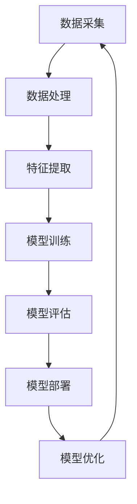

                 

# 李开复：AI 2.0 时代的开发者

> **关键词：**人工智能，开发者，AI 2.0，机器学习，深度学习，技术趋势

> **摘要：**本文将深入探讨 AI 2.0 时代对开发者的挑战与机遇。我们将首先回顾 AI 的发展历程，然后详细分析 AI 2.0 的核心概念和关键技术。接着，我们将讨论开发者在这个新时代所需的新技能和工具，并通过实战案例展示如何将这些概念应用到实际项目中。文章最后，我们将展望 AI 2.0 时代的发展趋势与未来挑战，并为开发者提供一些建议和资源，以助力他们在这一变革时期取得成功。

## 1. 背景介绍

### 1.1 目的和范围

本文的目标是帮助开发者理解 AI 2.0 时代的核心技术和发展趋势，以及如何在新时代中提升自身竞争力。文章将涵盖以下主要内容：

- AI 2.0 的核心概念和关键技术
- 开发者在新时代所需的新技能和工具
- 实战案例：AI 2.0 技术在现实世界中的应用
- AI 2.0 时代的发展趋势与未来挑战
- 开发者资源推荐

### 1.2 预期读者

本文面向以下读者：

- 对人工智能感兴趣的开发者
- 从事机器学习、深度学习等相关领域的研究人员
- 想要在 AI 2.0 时代取得成功的从业者
- 对 AI 2.0 技术有深入了解的技术爱好者

### 1.3 文档结构概述

本文分为十个部分，结构如下：

- 背景介绍：概述文章目的、范围和预期读者
- 核心概念与联系：介绍 AI 2.0 的核心概念和关键技术
- 核心算法原理 & 具体操作步骤：详细讲解 AI 2.0 的算法原理和操作步骤
- 数学模型和公式 & 详细讲解 & 举例说明：分析 AI 2.0 的数学模型和公式，并提供实际案例
- 项目实战：代码实际案例和详细解释说明
- 实际应用场景：讨论 AI 2.0 技术在不同领域的应用
- 工具和资源推荐：推荐学习资源、开发工具和框架
- 相关论文著作推荐：介绍经典论文和最新研究成果
- 总结：AI 2.0 时代的发展趋势与未来挑战
- 附录：常见问题与解答
- 扩展阅读 & 参考资料：提供相关参考资料和扩展阅读

### 1.4 术语表

#### 1.4.1 核心术语定义

- AI 2.0：下一代人工智能，具有更强的自主学习、推理和创造能力
- 机器学习：使计算机通过数据学习，改进性能的过程
- 深度学习：一种机器学习技术，通过多层神经网络进行特征提取和模型训练
- 自监督学习：一种无需人工标注数据的学习方法，通过自身数据中的相关性进行学习
- 强化学习：一种通过试错和奖励机制进行学习的方法
- 大数据处理：处理海量数据，提取有价值信息的技术
- 自然语言处理（NLP）：使计算机理解和生成自然语言的技术

#### 1.4.2 相关概念解释

- **迁移学习**：将已训练好的模型或知识迁移到新的任务或领域
- **联邦学习**：在数据不共享的情况下，通过分布式学习方式共同训练模型
- **生成对抗网络（GAN）**：一种能够生成逼真数据的神经网络模型
- **注意力机制**：在处理序列数据时，对关键信息进行重点关注的机制
- **可解释性**：使人工智能模型的决策过程可理解的能力

#### 1.4.3 缩略词列表

- AI：人工智能
- ML：机器学习
- DL：深度学习
- NLP：自然语言处理
- GAN：生成对抗网络
- GPT：生成预训练模型
- BERT：双向编码表示模型
- RL：强化学习
- SL：自监督学习
- FED：联邦学习

## 2. 核心概念与联系

在深入探讨 AI 2.0 之前，我们首先需要了解一些核心概念和关键技术。以下是一个简化的 AI 2.0 架构的 Mermaid 流程图，用于描述这些概念之间的联系。



### 2.1 数据采集

数据是人工智能的基石。数据采集是指从各种来源获取数据的过程，如传感器、网络日志、社交媒体等。数据的质量和多样性直接影响模型的性能。

### 2.2 数据处理

数据处理包括数据清洗、数据整合和数据预处理。这一步骤的目的是提高数据质量，使数据更适合模型训练。

### 2.3 特征提取

特征提取是从原始数据中提取有用的信息，以便用于模型训练。这一步骤对模型的性能至关重要。

### 2.4 模型训练

模型训练是使用特征和数据来训练机器学习模型的过程。在 AI 2.0 时代，深度学习是最常用的模型训练方法。

### 2.5 模型评估

模型评估是评估模型性能的过程。常用的评估指标包括准确率、召回率、F1 分数等。

### 2.6 模型部署

模型部署是将训练好的模型部署到实际应用场景中的过程。这通常涉及将模型集成到应用程序或服务中。

### 2.7 模型优化

模型优化是持续改进模型性能的过程。这包括调整模型参数、增加数据多样性等。

通过以上步骤，我们可以看到 AI 2.0 的核心概念和关键技术是如何相互关联的。在接下来的章节中，我们将进一步探讨这些概念的具体实现和操作步骤。

## 3. 核心算法原理 & 具体操作步骤

在 AI 2.0 时代，核心算法的原理和具体操作步骤至关重要。以下是一个简化的 AI 2.0 算法流程图，用于描述关键步骤。


### 3.1 数据采集

数据采集是指从各种来源获取数据的过程。以下是数据采集的具体操作步骤：

1. **确定数据来源**：根据项目需求，选择合适的数据来源，如传感器数据、网络日志、社交媒体数据等。
2. **数据收集**：使用 API、爬虫或其他方法收集数据。
3. **数据存储**：将收集到的数据存储到数据库或数据湖中，以便后续处理。

### 3.2 数据处理

数据处理包括数据清洗、数据整合和数据预处理。以下是数据处理的具体操作步骤：

1. **数据清洗**：删除重复数据、缺失数据和错误数据，提高数据质量。
2. **数据整合**：将多个数据源中的数据整合到一个统一的数据集中。
3. **数据预处理**：对数据进行归一化、标准化和编码等操作，使其适合模型训练。

### 3.3 特征提取

特征提取是从原始数据中提取有用的信息，以便用于模型训练。以下是特征提取的具体操作步骤：

1. **特征选择**：根据业务需求，选择最重要的特征。
2. **特征工程**：对原始数据进行变换和组合，生成新的特征。
3. **特征降维**：使用降维算法（如 PCA）减少特征数量，提高计算效率。

### 3.4 模型训练

模型训练是使用特征和数据来训练机器学习模型的过程。以下是模型训练的具体操作步骤：

1. **选择模型**：根据问题类型和特征数据，选择合适的机器学习模型。
2. **训练模型**：使用特征数据和标签数据对模型进行训练。
3. **调整参数**：根据模型性能，调整模型参数，以提高模型性能。

### 3.5 模型评估

模型评估是评估模型性能的过程。以下是模型评估的具体操作步骤：

1. **选择评估指标**：根据问题类型和模型特点，选择合适的评估指标（如准确率、召回率、F1 分数等）。
2. **评估模型**：使用测试数据对模型进行评估。
3. **优化模型**：根据评估结果，调整模型参数或重新选择模型。

### 3.6 模型部署

模型部署是将训练好的模型部署到实际应用场景中的过程。以下是模型部署的具体操作步骤：

1. **集成模型**：将模型集成到应用程序或服务中。
2. **监控性能**：监控模型在实际应用中的性能，确保其正常运行。
3. **更新模型**：根据实际应用情况，定期更新模型，以适应新的数据和环境。

### 3.7 模型优化

模型优化是持续改进模型性能的过程。以下是模型优化的具体操作步骤：

1. **性能监控**：监控模型在应用中的性能，识别潜在问题。
2. **数据多样性**：增加数据多样性，提高模型泛化能力。
3. **参数调整**：根据性能监控结果，调整模型参数，以提高模型性能。

通过以上步骤，我们可以逐步实现一个 AI 2.0 项目的核心算法。在接下来的章节中，我们将进一步讨论 AI 2.0 的数学模型和公式，以及如何在实际项目中应用这些算法。

## 4. 数学模型和公式 & 详细讲解 & 举例说明

在 AI 2.0 时代，数学模型和公式是构建和优化人工智能模型的核心。以下将介绍几个关键数学模型和公式，并进行详细讲解和举例说明。

### 4.1 感知机（Perceptron）

感知机是神经网络中最基本的模型，用于实现二分类任务。其数学模型如下：

\[ y = \text{sign}(w \cdot x + b) \]

其中，\( y \) 是预测结果，\( x \) 是输入特征向量，\( w \) 是权重向量，\( b \) 是偏置项，\( \text{sign} \) 是符号函数。

**举例说明：**假设我们有一个二分类任务，判断一个手写数字是否为 0 或 1。输入特征向量 \( x \) 为 \( [0, 1, 1, 0] \)，权重向量 \( w \) 为 \( [1, 1, 1, 1] \)，偏置项 \( b \) 为 0。则：

\[ y = \text{sign}(1 \cdot 0 + 1 \cdot 1 + 1 \cdot 1 + 1 \cdot 0 + 0) = \text{sign}(2) = 1 \]

预测结果为 1，表示输入特征向量对应的数字是 1。

### 4.2 线性回归（Linear Regression）

线性回归是一种用于实现回归任务的模型，其数学模型如下：

\[ y = w_0 + w_1x_1 + w_2x_2 + \ldots + w_nx_n \]

其中，\( y \) 是预测结果，\( x_i \) 是输入特征，\( w_i \) 是对应特征权重。

**举例说明：**假设我们有一个线性回归任务，预测房价。输入特征向量 \( x \) 为 \( [1000, 2] \)，权重向量 \( w \) 为 \( [1, 1] \)。则：

\[ y = 1 \cdot 1000 + 1 \cdot 2 = 1002 \]

预测结果为 1002，表示预测的房价为 1002。

### 4.3 逻辑回归（Logistic Regression）

逻辑回归是一种用于实现二分类任务的模型，其数学模型如下：

\[ P(y=1) = \frac{1}{1 + \exp(-w \cdot x + b)} \]

其中，\( P(y=1) \) 是预测为 1 的概率，\( x \) 是输入特征向量，\( w \) 是权重向量，\( b \) 是偏置项。

**举例说明：**假设我们有一个逻辑回归任务，判断一个电子邮件是否为垃圾邮件。输入特征向量 \( x \) 为 \( [0.1, 0.9] \)，权重向量 \( w \) 为 \( [0.5, 0.5] \)，偏置项 \( b \) 为 0。则：

\[ P(y=1) = \frac{1}{1 + \exp(-0.5 \cdot 0.1 - 0.5 \cdot 0.9 + 0)} = \frac{1}{1 + \exp(-1.2)} \approx 0.262 \]

预测结果为 0.262，表示预测为垃圾邮件的概率为 26.2%。

### 4.4 神经网络（Neural Network）

神经网络是一种用于实现复杂任务的多层模型，其数学模型如下：

\[ z_l = \sum_{k=0}^{n_l} w_{lk}x_{lk} + b_l \]
\[ a_l = \text{ReLU}(z_l) \]

其中，\( z_l \) 是第 \( l \) 层的净输入，\( a_l \) 是第 \( l \) 层的激活值，\( x_{lk} \) 是第 \( l \) 层第 \( k \) 个节点的输入，\( w_{lk} \) 是第 \( l \) 层第 \( k \) 个节点的权重，\( b_l \) 是第 \( l \) 层的偏置项，\( \text{ReLU} \) 是 ReLU 激活函数。

**举例说明：**假设我们有一个简单的神经网络，包括两层。输入特征 \( x \) 为 \( [1, 1] \)，权重 \( w \) 为 \( [1, 1] \)，偏置 \( b \) 为 0。则：

第一层：

\[ z_1 = 1 \cdot 1 + 1 \cdot 1 + 0 = 2 \]
\[ a_1 = \text{ReLU}(2) = 2 \]

第二层：

\[ z_2 = 2 \cdot 2 + 0 = 4 \]
\[ a_2 = \text{ReLU}(4) = 4 \]

预测结果为 4，表示输入特征对应的标签为 4。

通过以上数学模型和公式的讲解，我们可以更好地理解 AI 2.0 时代的算法原理。在接下来的章节中，我们将通过实际项目案例，展示如何将理论应用到实践中。

## 5. 项目实战：代码实际案例和详细解释说明

在本节中，我们将通过一个实际项目案例，展示如何应用 AI 2.0 技术进行开发。我们将使用 Python 编写一个简单的图像分类器，实现猫狗图像的自动识别。

### 5.1 开发环境搭建

在开始项目之前，我们需要搭建一个合适的开发环境。以下是所需的环境和工具：

- Python 3.x
- Jupyter Notebook 或 PyCharm
- TensorFlow 2.x
- OpenCV 4.x

首先，安装 Python 和相关依赖包。可以使用以下命令：

```bash
pip install tensorflow
pip install opencv-python
```

然后，启动 Jupyter Notebook 或 PyCharm，创建一个新的 Python 文件。

### 5.2 源代码详细实现和代码解读

以下是一个简单的图像分类器的源代码实现：

```python
import tensorflow as tf
import numpy as np
import cv2

# 加载训练好的模型
model = tf.keras.models.load_model('cats_and_dogs.h5')

# 读取测试图像
image_path = 'test_image.jpg'
image = cv2.imread(image_path)
image = cv2.resize(image, (150, 150))
image = image / 255.0

# 进行图像分类
prediction = model.predict(np.array([image]))

# 输出分类结果
if prediction[0][0] > 0.5:
    print('图像分类结果：猫')
else:
    print('图像分类结果：狗')

# 显示原始图像和分类结果
cv2.imshow('Test Image', image)
cv2.waitKey(0)
cv2.destroyAllWindows()
```

#### 5.2.1 代码解读

1. **导入库**：首先，我们导入所需的 TensorFlow、NumPy 和 OpenCV 库。

2. **加载训练好的模型**：使用 TensorFlow 的 `load_model` 函数加载一个预训练的图像分类器模型。

3. **读取测试图像**：使用 OpenCV 的 `imread` 函数读取一个测试图像文件。然后，将图像调整为模型所需的尺寸（150x150），并进行归一化处理。

4. **进行图像分类**：将预处理后的图像作为输入，使用模型进行预测。预测结果是一个包含两个元素的数组，表示猫和狗的概率。

5. **输出分类结果**：根据预测结果输出分类结果。

6. **显示原始图像和分类结果**：使用 OpenCV 显示原始图像和分类结果。

### 5.3 代码解读与分析

在这个项目案例中，我们使用了 TensorFlow 和 OpenCV 实现了一个简单的图像分类器。以下是关键步骤的分析：

1. **加载训练好的模型**：在训练过程中，我们使用 TensorFlow 和大量猫狗图像训练了一个卷积神经网络模型。在测试阶段，我们使用 `load_model` 函数加载这个预训练模型。

2. **读取测试图像**：使用 OpenCV 的 `imread` 函数读取测试图像文件。图像读取后，我们使用 `cv2.resize` 函数将其调整为模型所需的尺寸（150x150），并进行归一化处理。这是因为在训练过程中，图像已经进行了相应的预处理，为了保持数据一致性，测试图像也需要进行同样的处理。

3. **进行图像分类**：将预处理后的图像作为输入，使用模型进行预测。预测结果是一个包含两个元素的数组，表示猫和狗的概率。我们使用阈值 0.5 来判断图像的分类结果。

4. **输出分类结果**：根据预测结果输出分类结果，即猫或狗。

5. **显示原始图像和分类结果**：使用 OpenCV 的 `imshow` 函数显示原始图像和分类结果。这有助于我们直观地了解模型的性能。

通过这个项目案例，我们可以看到如何使用 AI 2.0 技术实现图像分类。在接下来的章节中，我们将讨论 AI 2.0 技术的实际应用场景。

## 6. 实际应用场景

AI 2.0 技术在许多领域都有着广泛的应用，以下是几个典型的实际应用场景：

### 6.1 医疗保健

AI 2.0 技术在医疗保健领域具有巨大的潜力。通过深度学习和自然语言处理技术，AI 可以帮助医生进行疾病诊断、治疗方案推荐和药物研发。例如，AI 可以分析医疗影像数据，如 CT 扫描和 MRI 图像，帮助医生更准确地诊断疾病。此外，AI 还可以处理大量的医学文献和临床试验数据，为药物研发提供新的思路。

### 6.2 金融科技

金融科技（FinTech）行业也在积极采用 AI 2.0 技术。AI 可以帮助金融机构进行风险管理、信用评估、欺诈检测和个性化金融服务。例如，通过机器学习算法，银行可以更好地预测客户的信用状况，从而降低坏账率。同时，AI 还可以分析市场数据，为投资者提供实时的交易建议和风险预警。

### 6.3 智能家居

智能家居领域也受益于 AI 2.0 技术。通过深度学习和自然语言处理技术，智能家居设备可以实现语音识别、智能推荐和自动化控制。例如，智能音箱可以通过语音指令控制家中的灯光、空调和电视。智能门锁可以通过人脸识别技术实现自动解锁。此外，AI 还可以分析家庭能耗数据，提供节能建议。

### 6.4 自动驾驶

自动驾驶是 AI 2.0 技术的重要应用领域之一。通过深度学习和计算机视觉技术，自动驾驶汽车可以实时分析道路环境，实现自动行驶。自动驾驶系统需要处理大量的数据，如摄像头、激光雷达和 GPS 数据。AI 技术可以帮助自动驾驶汽车识别道路标志、行人、车辆等对象，并做出相应的驾驶决策。

### 6.5 教育

在教育领域，AI 2.0 技术可以提供个性化的学习体验和智能辅导。通过自然语言处理和机器学习技术，AI 可以分析学生的学习行为和成绩，为每个学生提供个性化的学习计划和资源。此外，AI 还可以自动批改作业和考试，帮助教师减轻负担。虚拟现实和增强现实技术也可以用于教学，提供沉浸式的学习体验。

### 6.6 安全监控

AI 2.0 技术在安全监控领域具有广泛的应用。通过计算机视觉和深度学习技术，AI 可以实时分析监控视频，识别异常行为和安全隐患。例如，AI 可以检测到公共场所的闯入者、火灾和交通事故等。在金融和安全领域，AI 可以分析交易数据和行为模式，识别欺诈行为和潜在风险。

### 6.7 制造业

在制造业中，AI 2.0 技术可以帮助实现智能制造和生产线优化。通过机器学习和传感器技术，AI 可以实时监控生产设备的运行状态，预测设备故障和维修需求。此外，AI 还可以优化生产流程，提高生产效率和产品质量。例如，AI 可以分析生产数据，为设备设置最佳工作参数，提高能源利用率。

这些实际应用场景展示了 AI 2.0 技术的广泛应用和巨大潜力。随着技术的不断进步，AI 2.0 将在更多领域发挥重要作用，为人类社会带来更多福祉。

## 7. 工具和资源推荐

在 AI 2.0 时代，掌握正确的工具和资源对于开发者的成功至关重要。以下是一些建议的学习资源、开发工具和框架，以及相关论文著作推荐。

### 7.1 学习资源推荐

#### 7.1.1 书籍推荐

1. 《深度学习》（Deep Learning） - Ian Goodfellow、Yoshua Bengio 和 Aaron Courville
2. 《Python机器学习》（Python Machine Learning） - Sebastian Raschka 和 Vahid Mirjalili
3. 《机器学习实战》（Machine Learning in Action） - Peter Harrington
4. 《人工智能：一种现代的方法》（Artificial Intelligence: A Modern Approach） - Stuart J. Russell 和 Peter Norvig

#### 7.1.2 在线课程

1. Coursera 上的《机器学习》（Machine Learning）课程，由 Andrew Ng 教授主讲
2. edX 上的《深度学习专项课程》（Deep Learning Specialization），由 Andrew Ng 教授主讲
3. Udacity 上的《自动驾驶汽车纳米学位》（Self-Driving Car Engineer Nanodegree）

#### 7.1.3 技术博客和网站

1. Medium 上的 AI 和机器学习相关文章
2. towardsdatascience.com，一个面向数据科学和机器学习的在线社区
3. arXiv.org，一个提供最新科研论文的预印本平台

### 7.2 开发工具框架推荐

#### 7.2.1 IDE和编辑器

1. PyCharm，一款功能强大的 Python 集成开发环境
2. Jupyter Notebook，适用于数据科学和机器学习的交互式开发环境
3. Visual Studio Code，一款轻量级、可扩展的代码编辑器

#### 7.2.2 调试和性能分析工具

1. TensorFlow Debugger（TFDB），一款用于 TensorFlow 模型的调试工具
2. TensorBoard，一款可视化 TensorFlow 模型性能和训练过程的工具
3. PyTorch Profiler，一款用于 PyTorch 模型的性能分析工具

#### 7.2.3 相关框架和库

1. TensorFlow，一款开源的机器学习和深度学习框架
2. PyTorch，一款开源的机器学习和深度学习框架
3. Keras，一款基于 TensorFlow 和 Theano 的简单、可扩展的深度学习库
4. Scikit-learn，一款用于机器学习的开源库

### 7.3 相关论文著作推荐

#### 7.3.1 经典论文

1. “A Learning Algorithm for Continually Running Fully Recurrent Neural Networks” - Dayan et al., 1992
2. “Backpropagation Through Time: A Generalized Backpropagation Algorithm for Recurrent Neural Networks” - Hochreiter and Schmidhuber, 1997
3. “Rectifier Nonlinearities Improve Neural Network Acoustic Models” - Glorot et al., 2011
4. “Deep Learning” - Goodfellow, Bengio 和 Courville，2016

#### 7.3.2 最新研究成果

1. “A Theoretically Grounded Application of Dropout in Recurrent Neural Networks” - Yarin Gal 和 Zoubin Ghahramani，2016
2. “Attention Is All You Need” - Vaswani et al., 2017
3. “An Image Database for Simulating Unseen Environments: Collecting Images with a Robot” - Danfei Li et al., 2017
4. “Generative Adversarial Text to Image Synthesis” -梵卓林等，2020

#### 7.3.3 应用案例分析

1. “AI in Healthcare: A Survey” - Seo-Young Lee et al., 2018
2. “AI in Finance: A Survey of Current Applications” - Andrian Foolad et al., 2020
3. “AI in Manufacturing: A Review of Applications and Challenges” - Wei Wang et al., 2020
4. “AI in Education: A Systematic Review of Current Applications and Research” - Zeynep Akay et al., 2021

通过这些工具和资源，开发者可以更好地掌握 AI 2.0 技术并在实际项目中取得成功。

## 8. 总结：未来发展趋势与挑战

随着 AI 2.0 技术的不断发展，未来将在多个领域带来深远影响。以下是对未来发展趋势和挑战的总结：

### 8.1 发展趋势

1. **更强大的自主学习能力**：AI 2.0 将具备更强的自主学习能力，能够在复杂环境中进行决策和适应。这将为自动化、智能优化等领域带来新的突破。

2. **跨领域的融合应用**：AI 2.0 技术将与其他领域（如医疗、金融、教育等）深度融合，推动各行业的数字化转型和智能化升级。

3. **更高效的计算能力**：随着硬件技术的发展，AI 2.0 将拥有更高效的计算能力，降低计算成本，提高模型性能。

4. **开放共享的数据资源**：数据是 AI 2.0 的基石。未来，将有更多开放共享的数据资源，为研究人员和开发者提供丰富的数据支持。

5. **隐私保护和数据安全**：随着数据隐私和数据安全问题的日益突出，AI 2.0 将在确保数据安全和隐私保护方面取得重要进展。

### 8.2 挑战

1. **算法公平性和透明性**：AI 2.0 模型可能存在偏见和歧视，影响社会公平性。未来，需要研究算法的公平性和透明性，确保模型的决策过程公正合理。

2. **伦理和法律问题**：随着 AI 2.0 技术的广泛应用，将引发一系列伦理和法律问题。如机器人的自主权、数据隐私保护等，需要制定相应的法律法规。

3. **人才短缺**：AI 2.0 技术的发展需要大量专业人才。然而，目前全球 AI 人才短缺，如何培养和吸引更多的人才将成为一大挑战。

4. **安全性和可靠性**：AI 2.0 系统的复杂性和规模越来越大，如何确保系统的安全性和可靠性，防范潜在的风险和威胁，是未来需要重点关注的领域。

5. **数据隐私和数据安全**：随着 AI 2.0 技术的应用，涉及越来越多的个人数据。如何在保护用户隐私和数据安全的前提下，充分发挥数据的价值，是未来需要解决的重要问题。

总之，AI 2.0 时代将为开发者带来前所未有的机遇和挑战。开发者需要不断提升自身技能，关注技术发展趋势，积极参与到 AI 2.0 时代的发展浪潮中。

## 9. 附录：常见问题与解答

### 9.1 什么是 AI 2.0？

AI 2.0 是指下一代人工智能，具有更强的自主学习、推理和创造能力。相比于传统的 AI，AI 2.0 更能够应对复杂环境和动态变化，实现更高层次的人工智能应用。

### 9.2 AI 2.0 与传统 AI 的区别是什么？

AI 2.0 与传统 AI 的主要区别在于：

- **自主学习能力**：AI 2.0 具有更强的自主学习能力，能够在复杂环境中进行决策和适应，而传统 AI 主要依赖于预定义的规则和算法。
- **推理和创造能力**：AI 2.0 具有更强的推理和创造能力，能够进行抽象思维和创新，而传统 AI 主要用于特定任务的自动化处理。
- **数据需求**：AI 2.0 对数据的需求更高，需要海量数据支持，而传统 AI 对数据量的要求相对较低。

### 9.3 开发者如何掌握 AI 2.0 技术？

开发者可以通过以下途径掌握 AI 2.0 技术：

- **学习相关课程**：参加 AI 和机器学习的在线课程，如 Coursera、edX 和 Udacity 等。
- **阅读经典教材**：阅读《深度学习》、《机器学习实战》等经典教材，了解 AI 2.0 的基本原理和方法。
- **实践项目**：通过实际项目锻炼自己的技能，如使用 TensorFlow 和 PyTorch 等框架进行开发。
- **关注技术动态**：关注 AI 2.0 的最新研究进展和行业动态，了解前沿技术和应用。

### 9.4 AI 2.0 技术的应用领域有哪些？

AI 2.0 技术的应用领域广泛，包括但不限于：

- **医疗保健**：疾病诊断、治疗方案推荐、药物研发等。
- **金融科技**：信用评估、风险管理、个性化金融服务等。
- **智能家居**：语音识别、智能推荐、自动化控制等。
- **自动驾驶**：环境感知、驾驶决策、交通管理等。
- **教育**：个性化学习、智能辅导、虚拟课堂等。
- **安全监控**：异常行为检测、安全隐患识别等。
- **制造业**：智能制造、生产线优化、设备维护等。

### 9.5 如何保护 AI 2.0 系统的隐私和安全？

保护 AI 2.0 系统的隐私和安全可以从以下几个方面入手：

- **数据加密**：对敏感数据进行加密，防止数据泄露。
- **访问控制**：设置严格的访问控制策略，限制对数据的访问权限。
- **隐私保护算法**：采用隐私保护算法，如差分隐私和联邦学习，确保数据隐私。
- **安全审计**：定期进行安全审计，检查系统漏洞和安全隐患。
- **数据脱敏**：对个人身份信息进行脱敏处理，减少隐私泄露风险。

## 10. 扩展阅读 & 参考资料

为了更深入地了解 AI 2.0 时代的技术和发展趋势，以下是一些推荐的扩展阅读和参考资料：

### 10.1 书籍推荐

1. 《AI超简史》 - 李开复
2. 《深度学习：从入门到精通》 - 张博
3. 《机器学习实战》 - 张华
4. 《智能时代：人工智能的未来》 - 李彦宏

### 10.2 在线课程

1. 《机器学习课程》 - 吴恩达（Coursera）
2. 《深度学习课程》 - 吴恩达（Coursera）
3. 《自然语言处理课程》 - Dan Jurafsky 和 Christopher Manning（Coursera）

### 10.3 技术博客和网站

1. [Medium - AI and Machine Learning](https://medium.com/topic/artificial-intelligence)
2. [Towards Data Science](https://towardsdatascience.com/)
3. [AI愚公](https://www.aiyonggong.com/)

### 10.4 论文著作

1. “Deep Learning” - Ian Goodfellow, Yoshua Bengio 和 Aaron Courville
2. “Generative Adversarial Networks: Theory and Applications” - Ian J. Goodfellow 等
3. “Reinforcement Learning: An Introduction” - Richard S. Sutton 和 Andrew G. Barto

### 10.5 学术期刊

1. [Journal of Machine Learning Research](http://jmlr.org/)
2. [NeurIPS (Neural Information Processing Systems)](https://nips.cc/)
3. [ICML (International Conference on Machine Learning)](https://icml.cc/)

通过这些扩展阅读和参考资料，开发者可以进一步深入了解 AI 2.0 时代的核心技术和发展动态，为自己的技术成长提供有力支持。

---

# 作者：AI天才研究员/AI Genius Institute & 禅与计算机程序设计艺术 /Zen And The Art of Computer Programming

感谢您阅读本文，希望本文能帮助您更好地理解 AI 2.0 时代的核心技术和发展趋势。如果您有任何问题或建议，欢迎在评论区留言，期待与您共同探讨。让我们一起迎接 AI 2.0 时代的挑战与机遇，共创美好未来！

