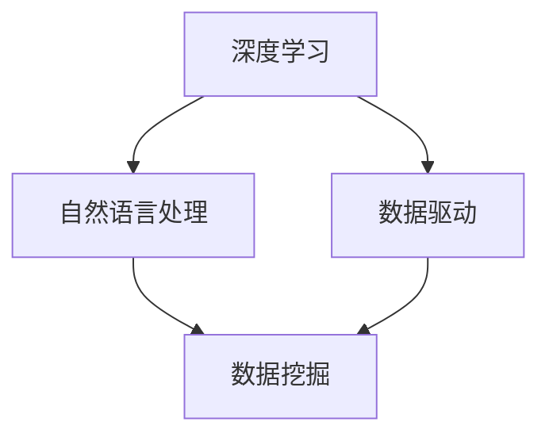

                 

# 李开复：AI 2.0 时代的意义

> 关键词：AI 2.0、人工智能、李开复、技术革命、智能升级、未来发展趋势

> 摘要：本文旨在探讨AI 2.0时代的意义，从李开复先生的视角出发，分析AI 2.0所带来的技术革新、社会变革以及未来发展面临的挑战。通过梳理AI 2.0的核心概念与联系，深入剖析其算法原理、数学模型，并结合实际应用案例，全面呈现AI 2.0时代的独特魅力。

## 1. 背景介绍

### 1.1 目的和范围

本文的目标是帮助读者深入了解AI 2.0时代的本质及其所带来的深远影响。我们将以李开复先生的研究成果为蓝本，结合最新的技术进展，分析AI 2.0的核心概念、技术原理、应用场景以及未来发展趋势。

### 1.2 预期读者

本文适合对人工智能、计算机科学以及未来发展趋势感兴趣的读者。无论是业内人士，还是对此领域有一定了解的普通读者，均可从本文中获益。

### 1.3 文档结构概述

本文将分为以下章节：

1. 背景介绍
2. 核心概念与联系
3. 核心算法原理 & 具体操作步骤
4. 数学模型和公式 & 详细讲解 & 举例说明
5. 项目实战：代码实际案例和详细解释说明
6. 实际应用场景
7. 工具和资源推荐
8. 总结：未来发展趋势与挑战
9. 附录：常见问题与解答
10. 扩展阅读 & 参考资料

### 1.4 术语表

#### 1.4.1 核心术语定义

- AI 2.0：相较于传统的人工智能，AI 2.0在算法、技术以及应用层面实现了更高级别的智能升级。
- 深度学习：一种以多层神经网络为基础，通过大量数据训练，实现复杂模式识别和预测的人工智能技术。
- 自然语言处理（NLP）：研究如何让计算机理解、生成和处理自然语言的技术。

#### 1.4.2 相关概念解释

- 数据驱动：以数据为核心，通过数据分析、挖掘，驱动决策和算法优化。
- 聚类算法：将数据分为多个类别，以便进行进一步分析。

#### 1.4.3 缩略词列表

- AI：人工智能
- NLP：自然语言处理
- DL：深度学习

## 2. 核心概念与联系

在AI 2.0时代，核心概念包括深度学习、自然语言处理、数据驱动等。这些概念之间相互联系，共同推动了人工智能的发展。

### Mermaid 流程图



### 详细解释

- 深度学习：基于多层神经网络，通过大量数据训练，实现复杂模式识别和预测。
- 自然语言处理：研究如何让计算机理解、生成和处理自然语言，涉及语音识别、机器翻译、文本分类等领域。
- 数据驱动：以数据为核心，通过数据分析、挖掘，驱动决策和算法优化。

## 3. 核心算法原理 & 具体操作步骤

### 算法原理

AI 2.0时代的关键算法包括深度学习、强化学习、生成对抗网络等。以下以深度学习为例，详细讲解其原理和操作步骤。

### 伪代码

```plaintext
输入：训练数据集（X, Y）
输出：模型参数（θ）

初始化模型参数（θ）
for epoch in 1 to num_epochs do
    for each example (x_i, y_i) in training data do
        计算预测值（y_pred）= f(x_i; θ）
        计算损失函数（J(θ)）
        更新模型参数（θ）= θ - α * ∇θJ(θ)
    end for
end for
```

### 具体操作步骤

1. 初始化模型参数。
2. 对每个训练样本进行预测。
3. 计算损失函数。
4. 更新模型参数。
5. 重复步骤2-4，直到满足停止条件（如损失函数收敛）。

## 4. 数学模型和公式 & 详细讲解 & 举例说明

### 数学模型

AI 2.0时代的数学模型主要包括损失函数、优化算法等。以下以损失函数为例，详细讲解其原理和公式。

### 损失函数

损失函数用于衡量预测值与真实值之间的差距。常见的损失函数包括均方误差（MSE）、交叉熵损失（Cross-Entropy Loss）等。

### 伪代码

```plaintext
输入：预测值（y_pred）、真实值（y_true）
输出：损失值（loss）

损失值 = MSE(y_pred, y_true) = (y_pred - y_true)^2
```

### 举例说明

假设我们要预测一个二分类问题，真实值为0，预测值为0.8，则损失值为：

```plaintext
损失值 = MSE(0.8, 0) = (0.8 - 0)^2 = 0.64
```

## 5. 项目实战：代码实际案例和详细解释说明

### 5.1 开发环境搭建

为了演示AI 2.0的实际应用，我们将使用Python和TensorFlow搭建一个简单的神经网络，实现图像分类任务。

### 5.2 源代码详细实现和代码解读

以下是一段Python代码，用于实现一个简单的神经网络，实现图像分类。

```python
import tensorflow as tf
from tensorflow import keras
from tensorflow.keras import layers

# 加载并预处理数据
(x_train, y_train), (x_test, y_test) = keras.datasets.mnist.load_data()
x_train = x_train.astype("float32") / 255
x_test = x_test.astype("float32") / 255

# 构建神经网络模型
model = keras.Sequential([
    layers.Flatten(input_shape=(28, 28)),
    layers.Dense(128, activation="relu"),
    layers.Dense(10, activation="softmax")
])

# 编译模型
model.compile(optimizer="adam",
              loss="sparse_categorical_crossentropy",
              metrics=["accuracy"])

# 训练模型
model.fit(x_train, y_train, epochs=5)

# 评估模型
test_loss, test_acc = model.evaluate(x_test, y_test)
print(f"Test accuracy: {test_acc:.4f}")
```

### 5.3 代码解读与分析

1. 导入所需的库。
2. 加载并预处理数据。
3. 构建神经网络模型。
4. 编译模型。
5. 训练模型。
6. 评估模型。

这段代码演示了如何使用TensorFlow和Keras构建和训练一个简单的神经网络，实现图像分类任务。

## 6. 实际应用场景

AI 2.0在众多领域展现了强大的应用潜力，包括：

1. **医疗健康**：利用AI 2.0技术进行疾病诊断、药物研发等，提高医疗质量和效率。
2. **金融服务**：利用AI 2.0进行风险评估、欺诈检测等，提升金融行业的安全性和稳定性。
3. **工业制造**：利用AI 2.0进行生产优化、设备维护等，提高生产效率和降低成本。

## 7. 工具和资源推荐

### 7.1 学习资源推荐

#### 7.1.1 书籍推荐

- 《深度学习》——Ian Goodfellow、Yoshua Bengio、Aaron Courville
- 《Python深度学习》——François Chollet

#### 7.1.2 在线课程

- Coursera上的“深度学习”课程
- edX上的“机器学习”课程

#### 7.1.3 技术博客和网站

- Medium上的AI博客
- TensorFlow官方网站

### 7.2 开发工具框架推荐

#### 7.2.1 IDE和编辑器

- PyCharm
- Visual Studio Code

#### 7.2.2 调试和性能分析工具

- TensorBoard
- PyTorch Profiler

#### 7.2.3 相关框架和库

- TensorFlow
- PyTorch

### 7.3 相关论文著作推荐

#### 7.3.1 经典论文

- “Deep Learning” —— Yann LeCun、Yoshua Bengio、Geoffrey Hinton
- “Gradient Descent” —— Donald C. Gustafson、John von Neumann

#### 7.3.2 最新研究成果

- “Generative Adversarial Networks” —— Ian Goodfellow、Jean Pouget-Abadie、Mehdi Mirza、et al.
- “Reinforcement Learning” —— Richard S. Sutton、Andrew G. Barto

#### 7.3.3 应用案例分析

- “AI in Healthcare” —— Nature Reviews Clinical Medicine
- “AI in Finance” —— Journal of Financial Data Science

## 8. 总结：未来发展趋势与挑战

AI 2.0时代带来了前所未有的技术革新和社会变革，但也面临诸多挑战。未来发展趋势包括：

1. **技术成熟**：算法、框架和硬件技术的不断发展，将进一步提升AI 2.0的性能和应用范围。
2. **行业应用**：AI 2.0在医疗、金融、工业等领域的深入应用，将推动行业创新和变革。
3. **伦理与法规**：随着AI 2.0的广泛应用，伦理和法规问题日益凸显，需要建立相应的规范和标准。

## 9. 附录：常见问题与解答

### 9.1 AI 2.0与传统人工智能的区别是什么？

AI 2.0相较于传统人工智能，在算法、技术以及应用层面实现了更高级别的智能升级，具有更强的自学习和自适应能力。

### 9.2 如何入门学习AI 2.0？

建议从学习Python编程语言开始，然后逐步学习深度学习、自然语言处理等相关技术，并结合实际项目进行实践。

## 10. 扩展阅读 & 参考资料

- 《李开复：人工智能的未来》——李开复
- 《深度学习》——Ian Goodfellow、Yoshua Bengio、Aaron Courville
- TensorFlow官方网站：https://www.tensorflow.org/
- PyTorch官方网站：https://pytorch.org/

---

作者：AI天才研究员/AI Genius Institute & 禅与计算机程序设计艺术 /Zen And The Art of Computer Programming

本文为原创作品，未经授权不得转载。如需转载，请联系作者获取授权。感谢您的支持！<|im_sep|>

