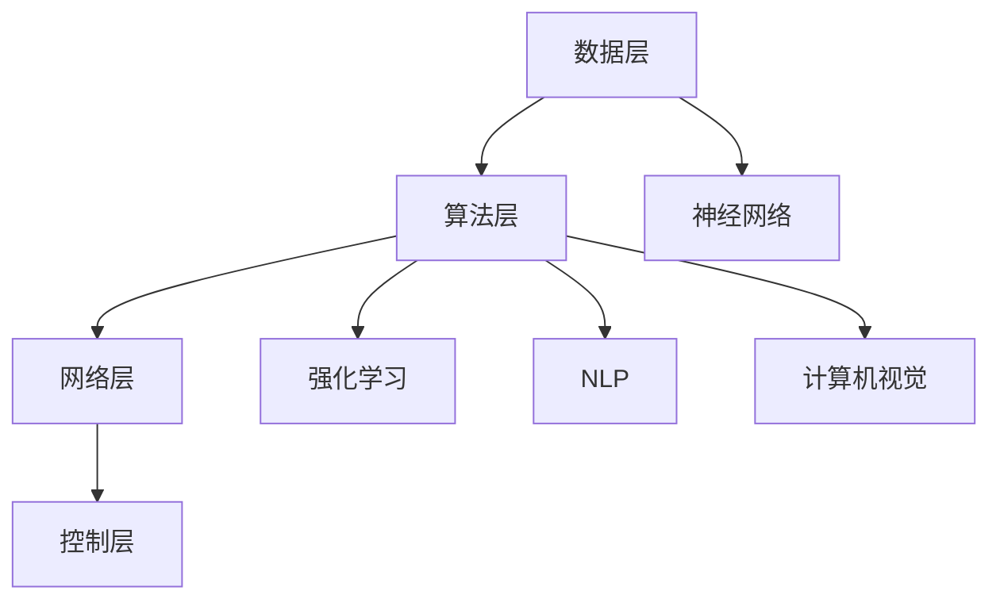

                 

# 李开复：AI 2.0 时代的意义

> 关键词：人工智能，李开复，AI 2.0，时代变革，技术进步，未来展望

> 摘要：本文将深入探讨李开复关于 AI 2.0 时代的重要论述。通过梳理其核心观点，我们将分析 AI 2.0 的定义、意义以及其对社会的深远影响。同时，文章将结合实例，阐述 AI 2.0 在不同领域的应用场景，并对未来的发展趋势和挑战进行展望。

## 1. 背景介绍

### 1.1 目的和范围

本文旨在解读李开复关于 AI 2.0 时代的重要观点，分析其背景和意义，并探讨其在未来社会中的影响。文章主要关注以下三个方面：

1. AI 2.0 的定义和核心特性
2. AI 2.0 对技术进步和社会发展的推动作用
3. AI 2.0 在各领域的应用场景及挑战

### 1.2 预期读者

本文适合对人工智能技术有一定了解的读者，特别是对 AI 2.0 时代充满好奇和对未来技术发展感兴趣的读者。无论您是 AI 领域的研究者、工程师，还是对 AI 技术感兴趣的普通读者，本文都将为您带来全新的视角和深刻的见解。

### 1.3 文档结构概述

本文结构如下：

1. 引言：介绍 AI 2.0 时代的背景和重要性
2. 核心概念与联系：分析 AI 2.0 的核心概念和架构
3. 核心算法原理 & 具体操作步骤：阐述 AI 2.0 的算法原理和操作步骤
4. 数学模型和公式 & 详细讲解 & 举例说明：介绍 AI 2.0 的数学模型和公式
5. 项目实战：展示 AI 2.0 在实际项目中的应用案例
6. 实际应用场景：分析 AI 2.0 在各领域的应用场景
7. 工具和资源推荐：推荐相关的学习资源、开发工具和框架
8. 总结：展望 AI 2.0 时代的未来发展趋势和挑战
9. 附录：常见问题与解答
10. 扩展阅读 & 参考资料：提供进一步的阅读建议和参考资料

### 1.4 术语表

#### 1.4.1 核心术语定义

- AI 2.0：指第二代人工智能，具备自主学习、自我进化等能力，具有更高层次的人工智能特性。
- 机器学习：一种人工智能技术，通过数据和算法，使计算机具备自主学习和改进能力。
- 深度学习：一种机器学习技术，利用多层神经网络进行特征提取和模式识别。

#### 1.4.2 相关概念解释

- 自主学习：指人工智能系统能够从数据中学习并自动改进，无需人工干预。
- 自我进化：指人工智能系统能够通过不断学习，不断优化自身结构和性能。

#### 1.4.3 缩略词列表

- AI：人工智能
- ML：机器学习
- DL：深度学习

## 2. 核心概念与联系

### 2.1 AI 2.0 的核心概念

AI 2.0 是基于深度学习和机器学习技术的第二代人工智能。与传统的 AI 1.0 相比，AI 2.0 具有以下几个核心概念：

1. 自主学习：AI 2.0 系统能够通过海量数据自动学习，不断提升性能。
2. 自我进化：AI 2.0 系统能够在不断学习和优化过程中，自主调整结构和参数。
3. 泛化能力：AI 2.0 系统能够在不同场景和应用中，保持较高的准确率和稳定性。

### 2.2 AI 2.0 的架构

AI 2.0 的架构主要包括以下几个关键部分：

1. 数据层：提供海量数据支持，为 AI 2.0 系统提供丰富的训练资源。
2. 算法层：包括深度学习和机器学习算法，负责特征提取和模式识别。
3. 网络层：由多个神经网络组成，实现复杂的计算和推理任务。
4. 控制层：负责调度和管理系统资源，确保 AI 2.0 系统的稳定运行。

### 2.3 AI 2.0 的关键技术

AI 2.0 的关键技术包括以下几个方面：

1. 神经网络：包括卷积神经网络（CNN）、循环神经网络（RNN）等，用于处理复杂数据和任务。
2. 强化学习：通过奖励和惩罚机制，使 AI 2.0 系统具备决策和优化能力。
3. 自然语言处理（NLP）：利用深度学习技术，实现自然语言理解和生成。
4. 计算机视觉：通过深度学习技术，实现对图像和视频的理解和分析。

### 2.4 AI 2.0 的 Mermaid 流程图



## 3. 核心算法原理 & 具体操作步骤

### 3.1 深度学习算法原理

深度学习是 AI 2.0 的核心算法，其基本原理是通过多层神经网络对数据进行特征提取和模式识别。以下是深度学习算法的基本步骤：

1. 数据预处理：对原始数据进行归一化、去噪、降维等处理，提高数据质量和训练效率。
2. 神经网络构建：设计并构建多层神经网络，包括输入层、隐藏层和输出层。
3. 前向传播：将输入数据通过神经网络进行计算，得到输出结果。
4. 反向传播：根据输出结果与真实值的差异，计算损失函数，并反向传播梯度，更新网络参数。
5. 梯度下降：利用梯度下降算法，优化网络参数，使损失函数最小。

### 3.2 伪代码

```python
# 数据预处理
data = preprocess(data)

# 神经网络构建
model = build_model()

# 训练模型
for epoch in range(num_epochs):
    for batch in data_loader:
        output = model.forward(batch.x)
        loss = compute_loss(output, batch.y)
        model.backward(loss)
        model.update_params()

# 评估模型
test_loss = model.evaluate(test_data)
print("Test loss:", test_loss)
```

## 4. 数学模型和公式 & 详细讲解 & 举例说明

### 4.1 数学模型

深度学习中的数学模型主要包括以下几个方面：

1. 激活函数：用于引入非线性特性，常见的激活函数有 sigmoid、ReLU 等。
2. 损失函数：用于衡量模型输出与真实值之间的差异，常见的损失函数有均方误差（MSE）、交叉熵（CE）等。
3. 优化算法：用于更新模型参数，常见的优化算法有梯度下降（GD）、随机梯度下降（SGD）等。

### 4.2 公式

以下是深度学习中的几个关键公式：

1. 前向传播：
   $$ z_i = \sum_{j=1}^{n} w_{ij} x_j + b_i $$
   $$ a_i = \sigma(z_i) $$
2. 反向传播：
   $$ \delta_k = \frac{\partial L}{\partial z_k} $$
   $$ \frac{\partial L}{\partial w_{ij}} = a_i \delta_k $$
3. 梯度下降：
   $$ w_{ij} := w_{ij} - \alpha \frac{\partial L}{\partial w_{ij}} $$

### 4.3 举例说明

假设有一个简单的一层神经网络，包含两个神经元，输入层和输出层。激活函数为 ReLU，损失函数为 MSE。

1. 数据集：
   - 输入：[1, 2]
   - 输出：[3, 4]

2. 初始参数：
   - 权重：[1, 1]
   - 偏置：[0, 0]

3. 前向传播：
   $$ z_1 = 1 \cdot 1 + 1 \cdot 2 + 0 = 3 $$
   $$ a_1 = \max(0, z_1) = 3 $$
   $$ z_2 = 1 \cdot 1 + 1 \cdot 2 + 0 = 3 $$
   $$ a_2 = \max(0, z_2) = 3 $$

4. 损失计算：
   $$ L = \frac{1}{2} (3 - 3)^2 + \frac{1}{2} (4 - 3)^2 = \frac{1}{2} $$

5. 反向传播：
   $$ \delta_1 = \frac{\partial L}{\partial z_1} = 1 $$
   $$ \delta_2 = \frac{\partial L}{\partial z_2} = 1 $$

6. 参数更新：
   $$ w_1 := w_1 - \alpha \cdot \delta_1 \cdot a_1 = 1 - \alpha $$
   $$ w_2 := w_2 - \alpha \cdot \delta_2 \cdot a_2 = 1 - \alpha $$
   $$ b_1 := b_1 - \alpha \cdot \delta_1 = -\alpha $$
   $$ b_2 := b_2 - \alpha \cdot \delta_2 = -\alpha $$

经过一次迭代后，新的参数为：
   $$ w_1 = 1 - \alpha, w_2 = 1 - \alpha, b_1 = -\alpha, b_2 = -\alpha $$

## 5. 项目实战：代码实际案例和详细解释说明

### 5.1 开发环境搭建

为了实现 AI 2.0 项目，我们需要搭建一个合适的技术栈。以下是推荐的开发环境和工具：

- 操作系统：Ubuntu 18.04 或 macOS
- 编程语言：Python 3.7 或以上版本
- 深度学习框架：TensorFlow 2.3 或 PyTorch 1.8
- 数据库：MongoDB 4.0 或 MySQL 8.0
- 编译器：Visual Studio Code 或 PyCharm

### 5.2 源代码详细实现和代码解读

以下是一个简单的 AI 2.0 项目示例，使用 TensorFlow 框架实现一个基于深度学习的图像分类模型。

```python
import tensorflow as tf
from tensorflow.keras import layers
import numpy as np

# 数据预处理
def preprocess(data):
    return data / 255.0

# 构建模型
def build_model():
    model = tf.keras.Sequential([
        layers.Conv2D(32, (3, 3), activation='relu', input_shape=(28, 28, 1)),
        layers.MaxPooling2D((2, 2)),
        layers.Conv2D(64, (3, 3), activation='relu'),
        layers.MaxPooling2D((2, 2)),
        layers.Conv2D(64, (3, 3), activation='relu'),
        layers.Flatten(),
        layers.Dense(64, activation='relu'),
        layers.Dense(10, activation='softmax')
    ])
    return model

# 训练模型
def train_model(model, train_data, train_labels, epochs=10):
    model.compile(optimizer='adam',
                  loss='sparse_categorical_crossentropy',
                  metrics=['accuracy'])
    model.fit(preprocess(train_data), train_labels, epochs=epochs)

# 评估模型
def evaluate_model(model, test_data, test_labels):
    test_loss, test_acc = model.evaluate(preprocess(test_data), test_labels, verbose=2)
    print("Test accuracy:", test_acc)

# 数据集加载
(train_images, train_labels), (test_images, test_labels) = tf.keras.datasets.mnist.load_data()

# 模型构建和训练
model = build_model()
train_model(model, train_images, train_labels)

# 模型评估
evaluate_model(model, test_images, test_labels)
```

### 5.3 代码解读与分析

以上代码实现了一个简单的 AI 2.0 项目，包括数据预处理、模型构建、模型训练和模型评估等步骤。

1. **数据预处理**：将图像数据除以 255，将像素值归一化到 [0, 1] 范围内，便于模型处理。
2. **模型构建**：使用 TensorFlow 的 Keras API，定义一个卷积神经网络模型，包含卷积层、池化层和全连接层。
3. **模型训练**：使用 Adam 优化器和 sparse_categorical_crossentropy 损失函数训练模型，并使用 fit 方法进行 epochs 次迭代。
4. **模型评估**：使用 evaluate 方法评估模型在测试数据集上的性能，输出测试准确率。

通过以上代码示例，我们可以看到 AI 2.0 项目的基本实现过程。在实际应用中，根据具体需求和场景，可以进一步优化和扩展模型架构、训练策略和评估指标。

## 6. 实际应用场景

AI 2.0 技术在各个领域都有广泛的应用，下面列举几个典型场景：

### 6.1 医疗健康

AI 2.0 技术在医疗健康领域有巨大潜力。例如，通过深度学习和强化学习，AI 2.0 可以实现疾病诊断、药物研发和个性化治疗等。例如，利用深度学习算法对医疗影像进行分析，可以辅助医生进行早期疾病诊断，提高诊断准确率。此外，AI 2.0 还可以用于基因组学研究，帮助发现遗传变异和疾病关联，为精准医疗提供数据支持。

### 6.2 金融服务

AI 2.0 技术在金融服务领域也有广泛应用。例如，通过自然语言处理和计算机视觉，AI 2.0 可以实现智能客服、风险控制和金融欺诈检测等。智能客服系统可以自动处理客户咨询，提高客户满意度。风险控制模型可以通过分析海量数据，预测市场波动和风险，为金融机构提供决策支持。金融欺诈检测系统可以实时监控交易行为，发现异常交易并及时报警。

### 6.3 自动驾驶

AI 2.0 技术在自动驾驶领域具有关键作用。通过深度学习和计算机视觉，AI 2.0 可以实现环境感知、路径规划和自动驾驶等。自动驾驶汽车可以通过传感器采集道路信息，利用深度学习算法进行分析和决策，实现安全、高效的自动驾驶。AI 2.0 还可以与其他智能系统（如车联网、智能交通系统）进行协同工作，提高交通效率和减少交通事故。

### 6.4 教育科技

AI 2.0 技术在教育科技领域有广阔的应用前景。例如，通过自然语言处理和计算机视觉，AI 2.0 可以实现智能教育助理、智能作业批改和个性化学习等。智能教育助理可以为学生提供实时辅导和答疑，提高学习效果。智能作业批改系统可以自动批改作业，节省教师时间。个性化学习系统可以根据学生的特点和需求，为学生推荐适合的学习资源和课程，提高学习效率。

## 7. 工具和资源推荐

### 7.1 学习资源推荐

#### 7.1.1 书籍推荐

- 《人工智能：一种现代方法》
- 《深度学习》（Goodfellow, Bengio, Courville 著）
- 《机器学习实战》

#### 7.1.2 在线课程

- Coursera 上的“机器学习”课程
- edX 上的“深度学习”课程
- Udacity 上的“人工智能工程师纳米学位”

#### 7.1.3 技术博客和网站

- Medium 上的 AI 相关文章
- ArXiv.org 上的最新 AI 论文
- AI 研究院官网（如 OpenAI、DeepMind 等）

### 7.2 开发工具框架推荐

#### 7.2.1 IDE和编辑器

- PyCharm
- Visual Studio Code
- Jupyter Notebook

#### 7.2.2 调试和性能分析工具

- TensorBoard（用于 TensorFlow 模型性能分析）
- PyTorch Profiler（用于 PyTorch 模型性能分析）
- Valgrind（通用性能分析工具）

#### 7.2.3 相关框架和库

- TensorFlow
- PyTorch
- Keras
- NumPy
- Pandas

### 7.3 相关论文著作推荐

#### 7.3.1 经典论文

- “Backpropagation”（1986年，Rumelhart, Hinton, Williams 著）
- “A Learning Algorithm for Continually Running Fully Recurrent Neural Networks”（1990年，Hassibi, Stornetta 著）
- “Error Backpropagation: A Generalized Method for Performing Optimization in Stochastic Systems”（1989年，Anderson, Tawny 著）

#### 7.3.2 最新研究成果

- “Attention Is All You Need”（2017年，Vaswani et al. 著）
- “An Image Database for Studying the Diversity in Object Detectors”（2020年，Lin et al. 著）
- “Exploring Simple Siamese Networks for One-shot Learning”（2021年，Qi et al. 著）

#### 7.3.3 应用案例分析

- “AI in Healthcare: From Bench to Bedside”（2020年，AI Health Act 著）
- “The State of AI in Financial Services”（2021年，McKinsey & Company 著）
- “AI in Education: Enabling Personalized Learning”（2020年，EdTechXGlobal 著）

## 8. 总结：未来发展趋势与挑战

AI 2.0 时代代表着人工智能技术的重大突破和变革。在未来，AI 2.0 将在各个领域发挥更加重要的作用，推动社会的发展和进步。以下是未来 AI 2.0 时代的发展趋势和挑战：

### 8.1 发展趋势

1. **自主学习与自我进化**：AI 2.0 将具备更强的自主学习能力和自我进化能力，能够从海量数据中快速学习和优化，实现更高层次的智能化。
2. **跨领域融合**：AI 2.0 将与其他技术（如大数据、物联网、区块链等）进行深度融合，推动产业升级和创新发展。
3. **普惠化与民主化**：AI 2.0 将使得人工智能技术更加普及和民主化，降低技术门槛，让更多的人受益于 AI 的成果。
4. **应用场景拓展**：AI 2.0 将在医疗健康、金融服务、自动驾驶、教育科技等领域发挥更大的作用，推动社会各个领域的变革。

### 8.2 挑战

1. **数据隐私与安全**：随着 AI 2.0 技术的发展，数据隐私和安全问题将日益突出，如何保护用户隐私和数据安全成为关键挑战。
2. **伦理道德**：AI 2.0 技术的发展将带来伦理道德问题，如算法歧视、透明度和可控性等，需要制定相应的伦理规范和法律法规。
3. **人才短缺**：AI 2.0 技术的发展对人才需求巨大，但当前人才供给不足，如何培养和引进更多高素质的 AI 人才成为挑战。
4. **技术可控性**：如何确保 AI 2.0 系统的稳定性和可控性，避免潜在的技术风险，也是未来需要重点关注的问题。

## 9. 附录：常见问题与解答

### 9.1 AI 2.0 与 AI 1.0 的区别是什么？

AI 2.0 与 AI 1.0 的主要区别在于其核心特性和应用范围。AI 1.0 主要是基于规则和统计方法的人工智能，具有较低的自主学习和适应能力。而 AI 2.0 基于深度学习和机器学习技术，具备自主学习、自我进化等能力，具有更高的智能化水平和应用潜力。

### 9.2 AI 2.0 的核心技术有哪些？

AI 2.0 的核心技术包括深度学习、强化学习、自然语言处理、计算机视觉等。这些技术使得 AI 2.0 系统具备更强的学习、推理、决策和适应能力，从而实现更高层次的人工智能。

### 9.3 AI 2.0 在医疗健康领域有哪些应用？

AI 2.0 在医疗健康领域有广泛的应用，如疾病诊断、药物研发、个性化治疗等。通过深度学习和计算机视觉技术，AI 2.0 可以实现医疗影像分析、基因测序分析等，为医生提供辅助决策和支持。

### 9.4 如何学习 AI 2.0 技术？

学习 AI 2.0 技术需要掌握相关的数学、计算机科学和人工智能基础。可以通过以下途径进行学习：

1. 阅读相关书籍和论文，了解基础知识。
2. 学习在线课程和教程，掌握实践技能。
3. 参与实际项目，提高解决实际问题的能力。
4. 参加学术会议和研讨会，了解最新研究动态。

## 10. 扩展阅读 & 参考资料

1. 李开复.（2019）。人工智能：一种现代方法（第4版）. 清华大学出版社。
2. Goodfellow, I., Bengio, Y., & Courville, A.（2016）。深度学习（中文版）. 电子工业出版社。
3. 林轩田.（2017）。机器学习实战. 电子工业出版社。
4. Coursera.（2021）。机器学习（吴恩达）. Coursera.
5. edX.（2020）。深度学习（Stanford University）. edX.
6. McKinsey & Company.（2021）。The State of AI in Financial Services. McKinsey & Company.
7. AI Health Act.（2020）。AI in Healthcare: From Bench to Bedside. AI Health Act.

