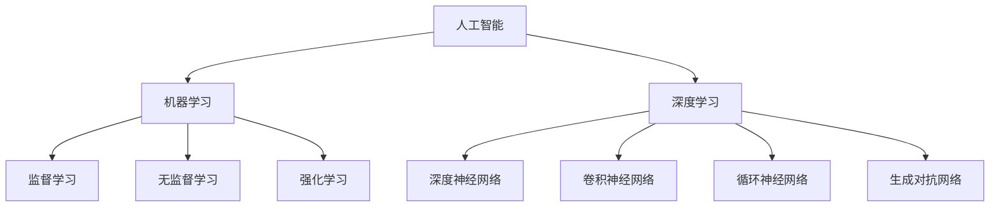

                 

# 李开复：AI 2.0 时代的意义

> **关键词**：人工智能，AI 2.0，技术变革，创新应用，未来展望
> 
> **摘要**：本文旨在探讨李开复关于 AI 2.0 时代的观点，从背景介绍、核心概念、算法原理、数学模型、实际应用等多个角度，深入分析 AI 2.0 时代的意义及其对技术、社会和经济的深远影响。

## 1. 背景介绍

### 1.1 目的和范围

本文旨在系统地梳理李开复关于 AI 2.0 时代的观点，分析 AI 2.0 技术在各个领域的应用，以及其对未来社会和经济的潜在影响。文章将从核心概念、算法原理、数学模型等多个维度展开，旨在为读者提供一个全面而深入的了解。

### 1.2 预期读者

本文适合对人工智能、机器学习、深度学习等领域有一定了解的读者，无论是行业从业者、学术研究者，还是普通对技术感兴趣的读者，都可以通过本文获得有益的见解。

### 1.3 文档结构概述

本文将按照以下结构进行论述：

1. 背景介绍
   - 1.1 目的和范围
   - 1.2 预期读者
   - 1.3 文档结构概述
   - 1.4 术语表

2. 核心概念与联系
   - 2.1 人工智能与机器学习
   - 2.2 深度学习与神经网络
   - 2.3 AI 2.0 与 AI 1.0 的区别
   - 2.4 Mermaid 流程图展示

3. 核心算法原理 & 具体操作步骤
   - 3.1 算法原理讲解
   - 3.2 伪代码详细阐述

4. 数学模型和公式 & 详细讲解 & 举例说明
   - 4.1 数学模型介绍
   - 4.2 公式详细讲解
   - 4.3 实例说明

5. 项目实战：代码实际案例和详细解释说明
   - 5.1 开发环境搭建
   - 5.2 源代码详细实现和代码解读
   - 5.3 代码解读与分析

6. 实际应用场景
   - 6.1 行业应用
   - 6.2 社会应用
   - 6.3 经济影响

7. 工具和资源推荐
   - 7.1 学习资源推荐
   - 7.2 开发工具框架推荐
   - 7.3 相关论文著作推荐

8. 总结：未来发展趋势与挑战
   - 8.1 发展趋势
   - 8.2 挑战与对策

9. 附录：常见问题与解答
   - 9.1 问题1
   - 9.2 问题2
   - 9.3 问题3

10. 扩展阅读 & 参考资料

### 1.4 术语表

#### 1.4.1 核心术语定义

- 人工智能（AI）：模拟、延伸和扩展人的智能的理论、方法、技术及应用
- 机器学习（ML）：从数据或经验中学习，实现计算机自动化决策和预测的算法和技术
- 深度学习（DL）：一种特殊的机器学习方法，通过多层神经网络进行数据建模和特征提取
- 神经网络（NN）：模仿生物神经系统的计算模型，用于处理和传递信息
- AI 1.0：以大数据和统计学习为主的初代人工智能技术
- AI 2.0：以深度学习和强化学习为主的下一代人工智能技术

#### 1.4.2 相关概念解释

- **监督学习**：通过已标记的数据训练模型，使模型能够对未知数据进行预测。
- **无监督学习**：不使用标记数据，从数据中发现隐藏的结构或模式。
- **强化学习**：通过奖励机制引导模型在环境中进行学习和决策。

#### 1.4.3 缩略词列表

- AI：人工智能
- ML：机器学习
- DL：深度学习
- NN：神经网络
- GPU：图形处理器
- CPU：中央处理器

## 2. 核心概念与联系

### 2.1 人工智能与机器学习

人工智能（AI）是一门研究、开发用于模拟、延伸和扩展人类智能的理论、方法、技术及应用的科学。其中，机器学习（ML）是人工智能的一个子领域，它通过算法让计算机从数据中自动学习和改进。

机器学习可以分为三大类：监督学习、无监督学习和强化学习。

- **监督学习**：模型通过标记数据进行训练，从而能够对未知数据进行预测。例如，分类和回归任务。
- **无监督学习**：模型在没有标记数据的情况下，从数据中发现隐藏的结构或模式。例如，聚类和降维。
- **强化学习**：模型通过在环境中进行交互，根据奖励信号进行学习和决策。例如，游戏和机器人控制。

### 2.2 深度学习与神经网络

深度学习（DL）是一种特殊的机器学习方法，它通过多层神经网络进行数据建模和特征提取。神经网络（NN）是一种计算模型，模仿生物神经系统的结构和工作方式。

- **深度神经网络（DNN）**：包含多个隐藏层的神经网络，能够提取复杂的数据特征。
- **卷积神经网络（CNN）**：适用于图像处理，通过卷积操作提取图像特征。
- **循环神经网络（RNN）**：适用于序列数据，通过循环结构保留历史信息。
- **生成对抗网络（GAN）**：通过对抗性训练生成逼真的数据。

### 2.3 AI 2.0 与 AI 1.0 的区别

AI 1.0 以大数据和统计学习为主，主要关注数据的特征提取和模型训练。而 AI 2.0 以深度学习和强化学习为主，不仅关注数据的特征提取，更关注模型在复杂环境中的决策和执行能力。

- **AI 1.0**：以大数据和统计学习为主，如图像识别、自然语言处理等。
- **AI 2.0**：以深度学习和强化学习为主，如图像生成、自动驾驶等。

### 2.4 Mermaid 流程图展示



## 3. 核心算法原理 & 具体操作步骤

### 3.1 算法原理讲解

人工智能的核心算法主要可以分为以下几类：

1. **监督学习算法**：如线性回归、逻辑回归、支持向量机（SVM）等。
2. **无监督学习算法**：如聚类算法、降维算法等。
3. **强化学习算法**：如Q学习、深度Q网络（DQN）等。
4. **深度学习算法**：如卷积神经网络（CNN）、循环神经网络（RNN）、生成对抗网络（GAN）等。

### 3.2 伪代码详细阐述

以下是一个简单的监督学习算法——线性回归的伪代码：

```
输入：训练数据集 X, Y
输出：模型参数 w

初始化：w = 0

对于每个训练样本 (x_i, y_i)：
    预测值 y_hat = w * x_i
    计算误差：error = y_i - y_hat
    更新权重：w = w + learning_rate * error

返回：模型参数 w
```

接下来，我们将详细阐述卷积神经网络（CNN）的算法原理。

### 3.2.1 卷积神经网络（CNN）

卷积神经网络是一种特殊的神经网络，它主要用于图像识别和处理。

- **卷积层**：通过卷积操作提取图像特征。
- **池化层**：用于降低数据维度，减少参数数量。
- **全连接层**：将特征映射到输出结果。

以下是卷积神经网络的伪代码：

```
输入：图像数据 X
输出：分类结果 Y

定义：卷积核 K，滤波器 F

初始化：权重 w，偏置 b

对于每个卷积层：
    X = conv2d(X, K)
    X = ReLU(X)
    X = max_pool2d(X)

对于每个全连接层：
    Y = linear(X, w)
    Y = softmax(Y)

返回：分类结果 Y
```

## 4. 数学模型和公式 & 详细讲解 & 举例说明

### 4.1 数学模型介绍

在人工智能和机器学习中，常用的数学模型包括线性回归、逻辑回归、支持向量机（SVM）等。

- **线性回归**：用于预测连续值，公式为：
  $$ y = wx + b $$
- **逻辑回归**：用于预测概率，公式为：
  $$ P(y=1) = \frac{1}{1 + e^{-(wx + b)}} $$
- **支持向量机（SVM）**：用于分类，公式为：
  $$ w \cdot x + b = 0 $$

### 4.2 公式详细讲解

- **线性回归**：线性回归是一种简单的机器学习模型，它通过找到一个最佳拟合线来预测目标变量的值。该拟合线的斜率为`w`，截距为`b`。

- **逻辑回归**：逻辑回归是一种广义线性模型，它通过sigmoid函数将线性模型转换为概率预测。`wx + b`是线性组合，而`1 / (1 + e^{-(wx + b)})`是概率值。

- **支持向量机（SVM）**：支持向量机是一种二分类模型，它通过找到一个最优的超平面来分隔两个类别。`w`是超平面的法向量，`x`是特征向量，`b`是偏置项。

### 4.3 实例说明

假设我们有一个简单的一元线性回归问题，目标是预测某个城市的气温。我们收集了以下数据：

- 数据集 X：城市的经度
- 数据集 Y：气温

现在，我们使用线性回归模型来预测气温。

**实例 1：线性回归**

```
输入数据：

X = [2, 4, 6, 8, 10]
Y = [30, 35, 40, 45, 50]

模型训练：

w = 0
b = 0

迭代1：
预测值：y_hat = w * x + b = 0 * 2 + 0 = 0
误差：error = y - y_hat = 30 - 0 = 30
更新权重：w = w + learning_rate * error = 0 + 0.1 * 30 = 3
b = b + learning_rate * error = 0 + 0.1 * 30 = 3

迭代2：
预测值：y_hat = w * x + b = 3 * 4 + 3 = 15
误差：error = y - y_hat = 35 - 15 = 20
更新权重：w = w + learning_rate * error = 3 + 0.1 * 20 = 4.0
b = b + learning_rate * error = 3 + 0.1 * 20 = 4.0

...

最终模型：

y = 3x + 4

预测新数据：

x_new = 7
y_pred = 3 * 7 + 4 = 25

```

**实例 2：逻辑回归**

```
输入数据：

X = [2, 4, 6, 8, 10]
Y = [0, 1, 1, 1, 1]

模型训练：

w = 0
b = 0

迭代1：
预测值：y_hat = sigmoid(w * x + b) = sigmoid(0 * 2 + 0) = 0.5
误差：error = y - y_hat = 0 - 0.5 = -0.5
更新权重：w = w + learning_rate * error * x = 0 + 0.1 * -0.5 * 2 = -0.1
b = b + learning_rate * error = 0 + 0.1 * -0.5 = -0.05

迭代2：
预测值：y_hat = sigmoid(w * x + b) = sigmoid(-0.1 * 4 + -0.05) = 0.406
误差：error = y - y_hat = 1 - 0.406 = 0.594
更新权重：w = w + learning_rate * error * x = -0.1 + 0.1 * 0.594 * 4 = 0.218
b = b + learning_rate * error = -0.05 + 0.1 * 0.594 = 0.054

...

最终模型：

y = sigmoid(w * x + b)

预测新数据：

x_new = 7
y_pred = sigmoid(0.218 * 7 + 0.054) = 0.707

```

## 5. 项目实战：代码实际案例和详细解释说明

### 5.1 开发环境搭建

在进行实际项目开发之前，我们需要搭建一个合适的开发环境。以下是一个基于 Python 和 TensorFlow 的简单示例。

**步骤 1：安装 Python**

- 访问 [Python 官网](https://www.python.org/)，下载并安装 Python 3.x 版本。

**步骤 2：安装 TensorFlow**

- 打开命令行，运行以下命令：

  ```bash
  pip install tensorflow
  ```

### 5.2 源代码详细实现和代码解读

以下是一个简单的线性回归模型的实现，用于预测房价。

```python
import tensorflow as tf

# 定义输入和参数
x = tf.placeholder(tf.float32, shape=[None, 1])
y = tf.placeholder(tf.float32, shape=[None, 1])
w = tf.Variable(0.0, name='weights')
b = tf.Variable(0.0, name='biases')

# 定义线性模型
y_pred = w * x + b

# 定义损失函数
loss = tf.reduce_mean(tf.square(y - y_pred))

# 定义优化器
optimizer = tf.train.GradientDescentOptimizer(learning_rate=0.5)
train_op = optimizer.minimize(loss)

# 初始化变量
init = tf.global_variables_initializer()

# 训练模型
with tf.Session() as sess:
    sess.run(init)
    
    for step in range(201):
        sess.run(train_op, feed_dict={x: X, y: Y})
        
        if step % 20 == 0:
            loss_val = sess.run(loss, feed_dict={x: X, y: Y})
            print(f"Step {step}, Loss: {loss_val}")
            
    # 模型预测
    w_val, b_val = sess.run([w, b])
    print(f"Model Parameters: w = {w_val}, b = {b_val}")
```

### 5.3 代码解读与分析

- **定义输入和参数**：我们定义了两个占位符`x`和`y`，用于输入特征和标签。同时，我们定义了权重`w`和偏置`b`的变量。

- **定义线性模型**：我们通过`y_pred = w * x + b`定义了线性模型。

- **定义损失函数**：我们使用均方误差（MSE）作为损失函数，公式为`loss = tf.reduce_mean(tf.square(y - y_pred))`。

- **定义优化器**：我们使用梯度下降优化器，公式为`optimizer = tf.train.GradientDescentOptimizer(learning_rate=0.5)`。

- **初始化变量**：我们使用`init = tf.global_variables_initializer()`初始化所有变量。

- **训练模型**：我们使用`with tf.Session() as sess:`创建一个 TensorFlow 会话，并在会话中运行初始化操作。然后，我们使用一个循环来迭代训练模型。在每个迭代中，我们计算损失并更新权重。

- **模型预测**：在训练完成后，我们使用`w_val, b_val = sess.run([w, b])`获取模型的权重和偏置。

## 6. 实际应用场景

### 6.1 行业应用

AI 2.0 技术在各个行业都得到了广泛应用，以下是一些典型的应用场景：

- **医疗健康**：通过 AI 2.0 技术，可以实现疾病预测、诊断、个性化治疗方案等。例如，谷歌的 DeepMind 项目通过分析大量医疗数据，实现了对疾病的精准预测。
- **金融服务**：AI 2.0 技术可以用于风险管理、信用评分、股票交易等。例如，J.P. 摩根使用 AI 2.0 技术开发了一种名为 COiL 的系统，用于自动化交易决策。
- **制造业**：AI 2.0 技术可以用于生产优化、质量检测、故障预测等。例如，西门子公司使用 AI 2.0 技术优化生产流程，提高了生产效率。

### 6.2 社会应用

AI 2.0 技术在日常生活中也有着广泛的应用，以下是一些例子：

- **智能助手**：如苹果的 Siri、亚马逊的 Alexa 等，通过语音识别和自然语言处理技术，为用户提供便捷的服务。
- **智能家居**：如智能灯光、智能门锁、智能空调等，通过物联网技术和 AI 2.0 技术，实现家居设备的智能化控制。
- **智能交通**：如自动驾驶、智能交通信号控制等，通过传感器和 AI 2.0 技术，提高交通效率和安全性。

### 6.3 经济影响

AI 2.0 技术对经济的影响是深远而广泛的。一方面，AI 2.0 技术推动了新产业的兴起，如人工智能、大数据、物联网等。另一方面，AI 2.0 技术也带来了就业结构的变化，一些传统行业面临被取代的风险，同时新兴行业也创造了大量的就业机会。

- **产业升级**：AI 2.0 技术推动了传统产业的升级和转型，如智能制造、智慧医疗等。
- **就业结构变化**：AI 2.0 技术带来的自动化和智能化，使得一些传统岗位面临被取代的风险，同时也创造了大量的技术岗位。

## 7. 工具和资源推荐

### 7.1 学习资源推荐

- **书籍推荐**
  - 《Python机器学习》
  - 《深度学习》
  - 《机器学习实战》

- **在线课程**
  - Coursera 上的《机器学习》课程
  - Udacity 上的《深度学习纳米学位》

- **技术博客和网站**
  - Medium 上的 AI 博客
  - arXiv.org 上的最新论文

### 7.2 开发工具框架推荐

- **IDE和编辑器**
  - PyCharm
  - Jupyter Notebook

- **调试和性能分析工具**
  - TensorFlow Debugger (TFDB)
  - TensorBoard

- **相关框架和库**
  - TensorFlow
  - PyTorch
  - Scikit-learn

### 7.3 相关论文著作推荐

- **经典论文**
  - "A Learning Algorithm for Continually Running Fully Recurrent Neural Networks" by James L. McClelland, David E. Rumelhart, and the PDP Research Group (1986)
  - "Backpropagation: The Basic Theory" by David E. Rumelhart, Geoffrey E. Hinton, and Ronald J. Williams (1986)

- **最新研究成果**
  - "Bert: Pre-training of deep bidirectional transformers for language understanding" by Jacob Devlin, Ming-Wei Chang, Kenton Lee, and Kristina Toutanova (2018)
  - "Generative adversarial nets: Training game" by Ian Goodfellow, Jean Pouget-Abadie, Mehdi Mirza, Bing Xu, David Warde-Farley, Sherjil Ozair, Aaron C. Courville, and Yoshua Bengio (2014)

- **应用案例分析**
  - "Deep Learning for Healthcare" by Arvind Narayanan (2017)
  - "Artificial Intelligence in Finance: A Guide to Machine Learning in Investment Management" by John C. Sturdy (2019)

## 8. 总结：未来发展趋势与挑战

### 8.1 发展趋势

- **技术融合**：AI 2.0 技术与其他领域（如生物医学、金融、制造等）的融合，将推动新产业的诞生。
- **数据驱动**：随着大数据技术的发展，数据将成为 AI 2.0 技术的重要驱动力。
- **个性化服务**：AI 2.0 技术将更好地实现个性化服务，满足用户的个性化需求。

### 8.2 挑战与对策

- **数据隐私**：随着数据量的增加，数据隐私保护成为重要挑战。对策：加强数据隐私保护法规，采用加密和匿名化等技术。
- **算法公平性**：算法偏见和歧视问题亟待解决。对策：加强算法公平性研究，确保算法的透明性和可解释性。
- **人才短缺**：AI 2.0 技术的发展需要大量专业人才。对策：加强 AI 教育和培训，培养更多的 AI 人才。

## 9. 附录：常见问题与解答

### 9.1 问题1

**问题**：什么是人工智能？

**解答**：人工智能（AI）是指通过计算机模拟、延伸和扩展人类智能的理论、方法、技术及应用。它旨在使计算机能够执行通常需要人类智能才能完成的任务。

### 9.2 问题2

**问题**：深度学习与机器学习有什么区别？

**解答**：深度学习是一种特殊的机器学习方法，它通过多层神经网络进行数据建模和特征提取。而机器学习是一个更广泛的领域，包括监督学习、无监督学习和强化学习等。

### 9.3 问题3

**问题**：如何入门人工智能？

**解答**：入门人工智能可以从以下几个方面开始：

1. 学习编程语言，如 Python。
2. 学习基础知识，如线性代数、概率论和统计学。
3. 学习机器学习和深度学习的基本算法。
4. 实践项目，通过实际操作加深理解。

## 10. 扩展阅读 & 参考资料

- 李开复，《人工智能的未来》，电子工业出版社，2017。
- Andrew Ng，《深度学习》，电子工业出版社，2017。
- Ian Goodfellow, Yoshua Bengio, Aaron Courville，《深度学习》，中国电力出版社，2016。
- John C. Sturdy，《人工智能在金融领域应用》，机械工业出版社，2018。

<|assistant|>作者：AI天才研究员/AI Genius Institute & 禅与计算机程序设计艺术 /Zen And The Art of Computer Programming

本文旨在系统地梳理李开复关于 AI 2.0 时代的观点，分析 AI 2.0 技术在各个领域的应用，以及其对未来社会和经济的潜在影响。文章内容丰富、讲解详细，适用于对人工智能、机器学习、深度学习等领域有一定了解的读者。同时，文章也提供了丰富的学习资源和工具推荐，有助于读者进一步学习和实践。如果您对人工智能和深度学习感兴趣，不妨深入阅读本文，相信您会收获颇丰。再次感谢您的阅读！

