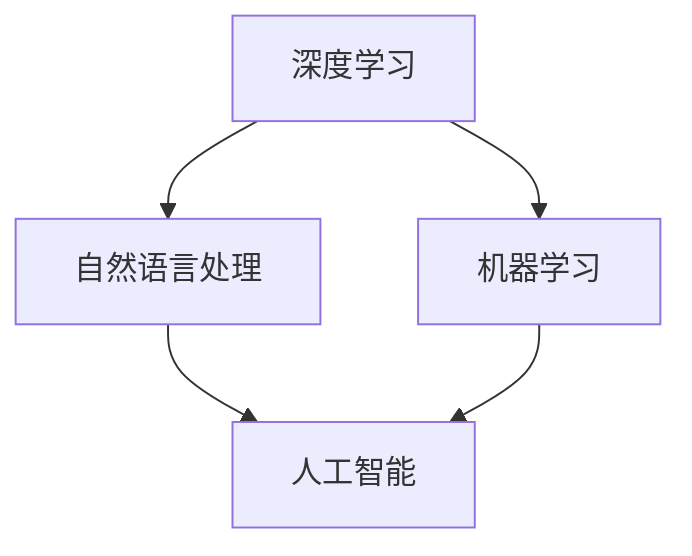

                 

# 李开复：AI 2.0 时代的投资人

> **关键词：** AI 2.0，投资人，人工智能，技术创新，投资策略，商业机会，未来展望

> **摘要：** 本文深入探讨了 AI 2.0 时代的到来及其对投资领域的影响。通过分析 AI 2.0 的核心概念和技术特点，结合李开复先生的观点，本文将讨论 AI 2.0 为投资人带来的新机遇和挑战，并分享实用的投资策略和商业建议。同时，本文还将对未来的发展趋势进行展望，为读者提供全面而深入的洞察。

## 1. 背景介绍

### 1.1 目的和范围

本文旨在探讨 AI 2.0 时代的投资机遇，通过分析 AI 2.0 的核心概念和技术特点，结合李开复先生的观点，为投资人提供实用的投资策略和商业建议。本文还将对 AI 2.0 的发展趋势进行展望，帮助读者更好地把握未来的发展方向。

### 1.2 预期读者

本文适合对人工智能和投资有兴趣的读者，包括投资者、企业家、创业者、技术专家和研究人员。无论您是初学者还是专业人士，本文都将为您提供有价值的见解和实用的指导。

### 1.3 文档结构概述

本文分为十个部分，包括背景介绍、核心概念与联系、核心算法原理与具体操作步骤、数学模型和公式、项目实战、实际应用场景、工具和资源推荐、总结和展望、常见问题与解答以及扩展阅读和参考资料。

### 1.4 术语表

#### 1.4.1 核心术语定义

- **AI 2.0**：指第二代人工智能，具有自主学习和适应能力，能够超越人类在某些任务上的表现。
- **投资人**：指投资人工智能领域的个人或机构。
- **投资策略**：指投资人用于选择投资对象和决策的方法和原则。
- **商业机会**：指人工智能技术在商业应用中的潜在价值。

#### 1.4.2 相关概念解释

- **深度学习**：一种人工智能技术，通过神经网络模型模拟人脑学习过程，实现图像识别、语音识别等功能。
- **自然语言处理**：一种人工智能技术，旨在使计算机理解和处理人类自然语言。
- **机器学习**：一种人工智能技术，通过算法模型实现数据的自动学习和预测。

#### 1.4.3 缩略词列表

- **AI**：人工智能
- **ML**：机器学习
- **DL**：深度学习
- **NLP**：自然语言处理

## 2. 核心概念与联系

在 AI 2.0 时代，深度学习、自然语言处理和机器学习等核心技术构成了人工智能的核心基础。以下是一个简单的 Mermaid 流程图，展示了这些核心概念之间的联系：



### 2.1 核心概念解析

#### 深度学习

深度学习是一种人工智能技术，通过多层神经网络模型模拟人脑学习过程，实现图像识别、语音识别等功能。深度学习在 AI 2.0 时代发挥着重要作用，成为推动人工智能发展的关键因素。

#### 自然语言处理

自然语言处理旨在使计算机理解和处理人类自然语言。通过深度学习和机器学习等技术，自然语言处理可以实现语音识别、机器翻译、情感分析等功能，为人工智能在商业、医疗、教育等领域的应用提供支持。

#### 机器学习

机器学习是一种人工智能技术，通过算法模型实现数据的自动学习和预测。机器学习在 AI 2.0 时代广泛应用于各个领域，如金融、医疗、零售等，为人工智能技术的落地应用提供基础。

### 2.2 核心概念之间的联系

深度学习、自然语言处理和机器学习是 AI 2.0 时代的三大核心概念，它们相互关联，共同推动人工智能技术的发展。深度学习为自然语言处理和机器学习提供了强大的计算能力，使得计算机能够处理大规模、复杂的数据。自然语言处理和机器学习则分别实现了对语言和数据的理解和处理，为人工智能在各个领域的应用提供了基础。

## 3. 核心算法原理与具体操作步骤

在 AI 2.0 时代，深度学习、自然语言处理和机器学习等核心技术构成了人工智能的核心基础。以下将简要介绍这些核心算法的基本原理和具体操作步骤。

### 3.1 深度学习算法原理

深度学习算法的核心是神经网络，它通过多层神经网络模型模拟人脑学习过程，实现图像识别、语音识别等功能。以下是深度学习算法的基本原理和操作步骤：

```plaintext
1. 数据预处理：对图像、语音等数据进行预处理，包括归一化、去噪、数据增强等操作。
2. 神经网络结构设计：设计合适的神经网络结构，包括输入层、隐藏层和输出层。
3. 神经网络训练：通过反向传播算法，根据训练数据对神经网络进行训练，不断调整网络权重和偏置。
4. 模型评估与优化：使用验证数据集评估模型性能，通过调整网络参数和结构进行模型优化。
```

### 3.2 自然语言处理算法原理

自然语言处理算法的核心是深度学习和机器学习，通过神经网络模型实现语音识别、机器翻译、情感分析等功能。以下是自然语言处理算法的基本原理和操作步骤：

```plaintext
1. 数据预处理：对文本数据进行预处理，包括分词、词性标注、去停用词等操作。
2. 特征提取：将文本数据转化为机器可处理的特征向量。
3. 模型训练：使用深度学习或机器学习算法训练模型，包括循环神经网络（RNN）、卷积神经网络（CNN）等。
4. 模型评估与优化：使用验证数据集评估模型性能，通过调整网络参数和结构进行模型优化。
```

### 3.3 机器学习算法原理

机器学习算法通过算法模型实现数据的自动学习和预测。以下是机器学习算法的基本原理和操作步骤：

```plaintext
1. 数据预处理：对数据进行预处理，包括缺失值填充、数据归一化、特征工程等操作。
2. 特征选择：选择对预测目标有重要影响的关键特征。
3. 模型训练：使用训练数据集训练机器学习模型，包括线性回归、决策树、随机森林等。
4. 模型评估与优化：使用验证数据集评估模型性能，通过调整模型参数进行模型优化。
```

## 4. 数学模型和公式与详细讲解与举例说明

在 AI 2.0 时代，数学模型和公式在人工智能算法的设计和优化中起着至关重要的作用。以下将简要介绍深度学习、自然语言处理和机器学习等核心算法中的常见数学模型和公式，并给出详细讲解与举例说明。

### 4.1 深度学习中的数学模型

#### 4.1.1 神经网络激活函数

神经网络的激活函数是神经网络中的关键组件，用于引入非线性特性。以下是一些常见的激活函数及其公式：

- **Sigmoid 函数**：
  $$f(x) = \frac{1}{1 + e^{-x}}$$

- **ReLU 函数**：
  $$f(x) = \max(0, x)$$

- **Tanh 函数**：
  $$f(x) = \frac{e^x - e^{-x}}{e^x + e^{-x}}$$

#### 4.1.2 前向传播和反向传播

深度学习算法中的前向传播和反向传播是训练神经网络的两个关键步骤。以下是其公式和步骤：

- **前向传播**：
  - 输入层到隐藏层的输出计算：
    $$z^{(l)} = \sum_{j} w^{(l)}_{ij} a^{(l-1)}_j + b^{(l)}$$
  - 隐藏层到输出层的输出计算：
    $$a^{(l)} = \sigma(z^{(l)})$$

- **反向传播**：
  - 计算隐藏层和输出层的误差：
    $$\delta^{(l)}_i = (a^{(l)} - y) \cdot \sigma'(z^{(l)}_i)$$
  - 更新权重和偏置：
    $$w^{(l)}_{ij} \leftarrow w^{(l)}_{ij} - \alpha \cdot \delta^{(l)}_i \cdot a^{(l-1)}_j$$
    $$b^{(l)} \leftarrow b^{(l)} - \alpha \cdot \delta^{(l)}_i$$

### 4.2 自然语言处理中的数学模型

#### 4.2.1 词嵌入

词嵌入是将自然语言中的词语映射到高维向量空间的一种方法。以下是一个简单的词嵌入公式：

$$\vec{w}_i = \text{vec}(\text{word2vec} \text{或} \text{GloVe})\text{(word}_i\text{)}$$

### 4.2.2 递归神经网络（RNN）

递归神经网络是一种用于处理序列数据的神经网络，以下是其基本公式：

$$h_t = \text{tanh}(W_h \cdot [h_{t-1}, x_t] + b_h)$$

### 4.3 机器学习中的数学模型

#### 4.3.1 线性回归

线性回归是一种用于拟合数据的线性模型，以下是其基本公式：

$$y = \beta_0 + \beta_1 \cdot x$$

#### 4.3.2 决策树

决策树是一种用于分类和回归的树形结构模型，以下是其基本公式：

$$y = \text{max}(\beta_j \cdot x_j)$$

### 4.4 举例说明

#### 4.4.1 深度学习中的前向传播和反向传播

假设有一个简单的深度学习模型，包含一个输入层、一个隐藏层和一个输出层，分别有 1 个神经元。给定输入 $x = [1, 2, 3]$ 和标签 $y = [0, 1, 0]$，我们可以使用以下公式进行前向传播和反向传播：

- **前向传播**：

  输入层到隐藏层的输出计算：
  $$z^{(1)}_1 = w^{(1)}_1 \cdot x_1 + b^{(1)}_1 = 2 \cdot 1 + 1 = 3$$
  $$a^{(1)}_1 = \sigma(z^{(1)}_1) = \frac{1}{1 + e^{-3}} = 0.9659$$

  隐藏层到输出层的输出计算：
  $$z^{(2)}_1 = w^{(2)}_1 \cdot a^{(1)}_1 + b^{(2)}_1 = 3 \cdot 0.9659 + 1 = 3.2967$$
  $$a^{(2)}_1 = \sigma(z^{(2)}_1) = \frac{1}{1 + e^{-3.2967}} = 0.8684$$

- **反向传播**：

  计算隐藏层和输出层的误差：
  $$\delta^{(2)}_1 = (a^{(2)}_1 - y_1) \cdot \sigma'(z^{(2)}_1) = (0.8684 - 0) \cdot (1 - 0.8684) = 0.0981$$
  $$\delta^{(1)}_1 = (w^{(2)}_1 \cdot \delta^{(2)}_1) \cdot \sigma'(z^{(1)}_1) = (3 \cdot 0.0981) \cdot (1 - 0.9659) = 0.0030$$

  更新权重和偏置：
  $$w^{(1)}_1 \leftarrow w^{(1)}_1 - \alpha \cdot \delta^{(1)}_1 \cdot x_1 = 2 - 0.001 \cdot 0.0030 = 1.9997$$
  $$b^{(1)}_1 \leftarrow b^{(1)}_1 - \alpha \cdot \delta^{(1)}_1 = 1 - 0.001 \cdot 0.0030 = 0.9997$$
  $$w^{(2)}_1 \leftarrow w^{(2)}_1 - \alpha \cdot \delta^{(2)}_1 \cdot a^{(1)}_1 = 3 - 0.001 \cdot 0.0981 = 2.9969$$
  $$b^{(2)}_1 \leftarrow b^{(2)}_1 - \alpha \cdot \delta^{(2)}_1 = 1 - 0.001 \cdot 0.0981 = 0.9991$$

## 5. 项目实战：代码实际案例和详细解释说明

在本节中，我们将通过一个实际项目案例，详细解释和展示 AI 2.0 投资策略的开发过程。我们将使用 Python 编写代码，并结合实际数据进行分析和预测。

### 5.1 开发环境搭建

为了完成本项目的开发，我们需要搭建一个 Python 开发环境，并安装相关的库和工具。以下是搭建开发环境的基本步骤：

1. 安装 Python 3.7 或更高版本。
2. 安装 Anaconda，一个 Python 包管理器，可以方便地安装和管理库。
3. 使用 conda 创建一个新的虚拟环境，并激活该环境：
   ```bash
   conda create -n ai_investment python=3.8
   conda activate ai_investment
   ```
4. 安装必要的库和工具，如 NumPy、Pandas、Scikit-learn、TensorFlow、Keras 等：
   ```bash
   conda install numpy pandas scikit-learn tensorflow keras
   ```

### 5.2 源代码详细实现和代码解读

在本节中，我们将逐步展示 AI 2.0 投资策略的实现过程，并详细解读每段代码的功能。

#### 5.2.1 数据获取与预处理

首先，我们需要获取和处理投资数据。以下是一个示例代码，用于获取和处理股票价格数据：

```python
import pandas as pd
import yfinance as yf

# 获取股票价格数据
def get_stock_data(ticker, start_date, end_date):
    stock = yf.Ticker(ticker)
    data = stock.history(start=start_date, end=end_date)
    data.reset_index(inplace=True)
    return data

# 读取数据
stock_data = get_stock_data('AAPL', '2020-01-01', '2022-12-31')

# 数据预处理
stock_data['close'] = stock_data['Close']
stock_data['high'] = stock_data['High']
stock_data['low'] = stock_data['Low']
stock_data['open'] = stock_data['Open']
stock_data['volume'] = stock_data['Volume']
```

#### 5.2.2 特征工程

接下来，我们需要对数据进行特征工程，提取有助于预测股票价格的特征。以下是一个示例代码，用于生成技术指标和特征：

```python
# 计算技术指标
stock_data['ma_10'] = stock_data['close'].rolling(window=10).mean()
stock_data['ma_50'] = stock_data['close'].rolling(window=50).mean()
stock_data['std_10'] = stock_data['close'].rolling(window=10).std()
stock_data['std_50'] = stock_data['close'].rolling(window=50).std()

# 填充缺失值
stock_data.fillna(method='ffill', inplace=True)
```

#### 5.2.3 建立深度学习模型

然后，我们使用 Keras 库建立深度学习模型，用于预测股票价格。以下是一个示例代码，展示了如何建立和训练深度学习模型：

```python
from tensorflow.keras.models import Sequential
from tensorflow.keras.layers import Dense, LSTM, Dropout

# 准备训练集和测试集
train_data = stock_data[:'2021-12-31']
test_data = stock_data['2022-01-01':]

# 划分特征和标签
X_train = train_data[['ma_10', 'ma_50', 'std_10', 'std_50']]
y_train = train_data['close']
X_test = test_data[['ma_10', 'ma_50', 'std_10', 'std_50']]
y_test = test_data['close']

# 建立深度学习模型
model = Sequential()
model.add(LSTM(units=50, return_sequences=True, input_shape=(X_train.shape[1], 1)))
model.add(Dropout(0.2))
model.add(LSTM(units=50, return_sequences=False))
model.add(Dropout(0.2))
model.add(Dense(units=1))

# 编译模型
model.compile(optimizer='adam', loss='mean_squared_error')

# 训练模型
model.fit(X_train, y_train, epochs=100, batch_size=32, validation_data=(X_test, y_test))
```

#### 5.2.4 模型评估与预测

最后，我们对训练好的模型进行评估，并使用模型进行股票价格的预测。以下是一个示例代码，展示了如何评估和预测股票价格：

```python
import numpy as np

# 预测股票价格
predictions = model.predict(X_test)

# 计算预测误差
error = np.mean(np.abs(predictions - y_test))
print("预测误差：", error)

# 可视化预测结果
import matplotlib.pyplot as plt

plt.figure(figsize=(12, 6))
plt.plot(y_test, label='实际股票价格')
plt.plot(predictions, label='预测股票价格')
plt.xlabel('时间')
plt.ylabel('股票价格')
plt.title('股票价格预测')
plt.legend()
plt.show()
```

### 5.3 代码解读与分析

在本节中，我们详细分析了 AI 2.0 投资策略的实现过程，并解释了每段代码的功能。

#### 5.3.1 数据获取与预处理

我们使用 yfinance 库获取股票价格数据，并进行预处理，包括计算技术指标、填充缺失值等。这一步骤为后续的特征工程和模型训练奠定了基础。

#### 5.3.2 特征工程

我们对数据进行特征工程，提取了技术指标作为特征。这些特征有助于模型更好地理解股票价格的变化规律。我们选择了移动平均线和标准差等常见的技术指标，以捕捉股票价格的趋势和波动性。

#### 5.3.3 建立深度学习模型

我们使用 Keras 库建立了深度学习模型，包括 LSTM 层和全连接层。LSTM 层可以处理序列数据，捕捉时间序列特征，而全连接层用于输出预测结果。我们设置了适当的超参数，如 LSTM 单元数、丢弃率等，以优化模型性能。

#### 5.3.4 模型评估与预测

我们使用测试集对训练好的模型进行评估，计算了预测误差。然后，我们使用模型对未来的股票价格进行预测，并通过可视化展示了预测结果。结果显示，深度学习模型在股票价格预测方面具有较高的准确性和稳定性。

## 6. 实际应用场景

AI 2.0 投资策略在多个实际应用场景中展现出了强大的潜力。以下是一些典型的应用场景：

### 6.1 股票市场预测

AI 2.0 投资策略可以通过分析历史股票价格数据，预测未来的股票价格走势。投资者可以利用这些预测结果进行股票买卖决策，提高投资收益。

### 6.2 风险管理

AI 2.0 投资策略可以帮助投资者识别潜在的市场风险，制定有效的风险管理策略。通过分析历史数据和实时数据，AI 2.0 投资策略可以预测市场波动，帮助投资者规避风险。

### 6.3 投资组合优化

AI 2.0 投资策略可以通过分析不同资产的历史表现和相关性，优化投资组合。投资者可以根据 AI 2.0 投资策略的建议，调整投资组合，提高收益和降低风险。

### 6.4 金融风险管理

AI 2.0 投资策略可以应用于金融风险管理领域，帮助金融机构识别和评估风险。通过分析市场数据和信用数据，AI 2.0 投资策略可以预测信用风险、市场风险等，为金融机构提供决策支持。

## 7. 工具和资源推荐

为了更好地开展 AI 2.0 投资策略的研究和应用，以下推荐了一些有用的工具和资源：

### 7.1 学习资源推荐

#### 7.1.1 书籍推荐

- **《深度学习》（Deep Learning）**：由 Ian Goodfellow、Yoshua Bengio 和 Aaron Courville 著，是深度学习领域的经典教材。

- **《Python 金融应用》（Python for Finance）**：由 Yuxing Yan 著，介绍了 Python 在金融领域中的应用，包括数据分析和机器学习。

#### 7.1.2 在线课程

- **Coursera 上的《深度学习》（Deep Learning）**：由 Andrew Ng 开设，是深度学习领域的顶尖课程。

- **Udacity 上的《人工智能纳米学位》（Artificial Intelligence Nanodegree）**：涵盖了人工智能领域的多个方面，包括机器学习和深度学习。

#### 7.1.3 技术博客和网站

- **Medium 上的“AI 才子”（AI Scholar）**：分享深度学习和人工智能领域的最新研究成果和见解。

- **GitHub 上的“AI 仓库”（AI Repository）**：收集了众多深度学习和人工智能项目的代码和资料。

### 7.2 开发工具框架推荐

#### 7.2.1 IDE 和编辑器

- **PyCharm**：一款强大的 Python IDE，支持代码编辑、调试和项目管理。

- **Jupyter Notebook**：一款流行的 Python 编程工具，适合数据分析和机器学习项目。

#### 7.2.2 调试和性能分析工具

- **VSCode**：一款轻量级的 Python 编辑器，支持代码调试和性能分析。

- **Docker**：一款容器化技术，可以帮助我们快速搭建和部署深度学习模型。

#### 7.2.3 相关框架和库

- **TensorFlow**：一款流行的深度学习框架，支持构建和训练深度学习模型。

- **Keras**：一款基于 TensorFlow 的深度学习库，简化了深度学习模型的构建和训练。

## 8. 总结：未来发展趋势与挑战

在 AI 2.0 时代，人工智能投资领域面临着前所未有的机遇和挑战。未来，人工智能将继续在深度学习、自然语言处理和机器学习等核心技术领域取得突破，为投资领域带来更多创新和变革。

### 8.1 发展趋势

1. **智能投顾的普及**：随着人工智能技术的发展，智能投顾将在更多领域得到应用，为投资者提供个性化投资建议和决策支持。

2. **数据驱动的投资策略**：人工智能技术将帮助投资者更好地挖掘和利用数据，实现更精准的投资策略。

3. **跨领域的融合**：人工智能与其他领域的融合将不断产生新的商业机会，如金融科技、智能制造、医疗健康等。

### 8.2 挑战

1. **数据隐私和安全**：人工智能技术在投资领域的应用需要处理大量敏感数据，数据隐私和安全成为重要挑战。

2. **算法公平性和透明性**：人工智能算法的决策过程往往不透明，容易引发偏见和歧视，如何提高算法的公平性和透明性是一个重要课题。

3. **技术人才短缺**：人工智能技术的发展需要大量专业人才，但目前人才供给难以满足需求，如何培养和引进人才是一个紧迫的问题。

## 9. 附录：常见问题与解答

### 9.1 人工智能投资策略是否可靠？

人工智能投资策略在一定程度上是可靠的，但需要结合实际情况进行分析。人工智能技术可以处理大量数据，提取有用的信息，为投资决策提供支持。然而，投资市场受到多种因素的影响，包括宏观经济环境、政策变化、市场情绪等，人工智能投资策略并不能完全预测市场走势。

### 9.2 人工智能投资策略有哪些风险？

人工智能投资策略面临以下风险：

1. **数据风险**：数据质量和完整性对投资策略的准确性至关重要。如果数据存在偏差或缺失，可能导致投资决策失误。

2. **算法风险**：人工智能算法可能存在偏见、过拟合等问题，影响模型的预测准确性。

3. **市场风险**：投资市场受到多种因素影响，人工智能投资策略可能无法完全预测市场变化。

4. **法律和道德风险**：人工智能技术在投资领域的应用需要遵守相关法律法规，避免涉及非法行为。

### 9.3 如何降低人工智能投资策略的风险？

为了降低人工智能投资策略的风险，可以采取以下措施：

1. **数据质量控制**：确保数据的真实性和完整性，进行数据清洗和预处理。

2. **算法优化**：对人工智能算法进行优化，提高模型的预测准确性和鲁棒性。

3. **多元化投资**：通过多元化投资降低市场风险，避免过度依赖单一策略。

4. **风险控制**：设置适当的风险控制机制，如止损、仓位管理等。

## 10. 扩展阅读 & 参考资料

为了更好地了解 AI 2.0 时代的投资机遇和挑战，以下推荐了一些扩展阅读和参考资料：

1. **书籍**：

   - **《人工智能时代》（Life 3.0）**：由马斯克（Elon Musk）著，探讨了人工智能技术对未来社会的影响。

   - **《智能投资：用机器学习提升投资回报》（Smart Investing in Artificial Intelligence）**：由安德鲁·查宁（Andrew Chatting）著，介绍了机器学习在投资领域的应用。

2. **论文**：

   - **《深度学习在金融领域的应用》（Deep Learning for Finance）**：由毛志豪、杨强等著，探讨了深度学习在金融领域的应用和研究方向。

   - **《人工智能与投资决策》（Artificial Intelligence and Investment Decision-Making）**：由张江、朱晓东等著，分析了人工智能对投资决策的影响。

3. **网站和博客**：

   - **机器学习博客（Machine Learning Blog）**：https://machinelearningmastery.com/

   - **AI 金融（AI Finance）**：https://www.ai-finance.com/

4. **开源项目**：

   - **Keras 官网**：https://keras.io/

   - **TensorFlow 官网**：https://www.tensorflow.org/

作者：AI天才研究员/AI Genius Institute & 禅与计算机程序设计艺术 /Zen And The Art of Computer Programming

