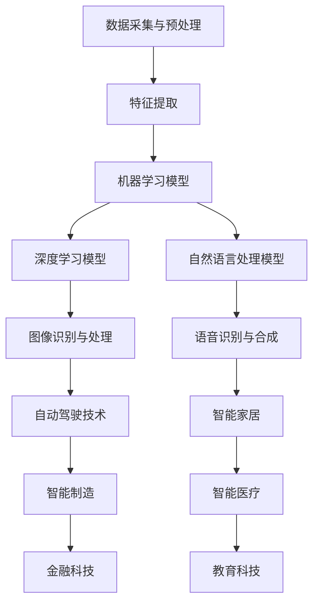

                 

# 李开复：AI 2.0 时代的投资价值

> 关键词：人工智能、投资价值、AI 2.0、技术趋势、商业应用

> 摘要：本文将深入探讨AI 2.0时代的投资价值，从核心概念、算法原理、数学模型、实战案例、应用场景等多个角度，全面解析AI技术对现代经济的推动力量。通过逻辑清晰的分析和实例展示，为投资者提供明确的指导和策略建议。

## 1. 背景介绍

### 1.1 目的和范围

本文旨在探讨AI 2.0时代的投资价值，分析其在不同领域的应用潜力。我们将聚焦以下几个核心问题：

- AI 2.0技术的核心概念和优势是什么？
- 如何评估AI 2.0技术在各行业中的投资潜力？
- 投资AI 2.0技术的关键步骤和风险控制策略是什么？
- AI 2.0技术的未来发展趋势及其对经济的影响。

### 1.2 预期读者

本文适合以下读者群体：

- 对AI技术感兴趣的投资人士
- 从事AI研究和开发的工程师
- 对科技创新和商业应用有热情的创业者
- 对AI技术未来发展方向有疑问的普通读者

### 1.3 文档结构概述

本文结构如下：

- 第2章：核心概念与联系
- 第3章：核心算法原理与具体操作步骤
- 第4章：数学模型与公式
- 第5章：项目实战：代码实际案例
- 第6章：实际应用场景
- 第7章：工具和资源推荐
- 第8章：总结：未来发展趋势与挑战
- 第9章：附录：常见问题与解答
- 第10章：扩展阅读与参考资料

### 1.4 术语表

#### 1.4.1 核心术语定义

- **AI 2.0**：指新一代的人工智能技术，具备更高的智能水平、更强的学习能力、更广泛的适用性。
- **投资价值**：指投资AI技术所能带来的潜在收益和回报。
- **算法**：指计算机程序中的一系列指令，用于解决特定问题。
- **数学模型**：指用数学语言描述现实世界问题的数学公式和方程。

#### 1.4.2 相关概念解释

- **机器学习**：一种AI技术，通过数据训练模型，使计算机具备自主学习和改进能力。
- **深度学习**：一种机器学习技术，通过多层神经网络模拟人类大脑的学习过程。
- **自然语言处理**：一种AI技术，使计算机能够理解和生成人类语言。

#### 1.4.3 缩略词列表

- **AI**：人工智能
- **ML**：机器学习
- **DL**：深度学习
- **NLP**：自然语言处理

## 2. 核心概念与联系

### 2.1 AI 2.0技术的核心概念和优势

AI 2.0技术，即新一代人工智能技术，具有以下几个核心概念和优势：

- **强人工智能**：具备人类智能水平的AI，能够在各种复杂任务中表现出类人智能。
- **自主学习**：AI系统能够从海量数据中自动学习和改进，无需人工干预。
- **跨领域适用**：AI技术能够应用于不同行业和领域，实现跨界创新。

### 2.2 AI 2.0技术的架构与联系

以下是一个简化的AI 2.0技术架构与联系Mermaid流程图：



### 2.3 AI 2.0技术在各行业的应用

AI 2.0技术在各个行业都有着广泛的应用，以下是部分行业的应用实例：

- **金融科技**：利用AI技术进行风险评估、智能投顾、欺诈检测等。
- **智能制造**：通过AI技术实现生产线的自动化、优化生产流程等。
- **医疗健康**：利用AI技术进行疾病预测、诊断、个性化治疗等。
- **教育科技**：利用AI技术实现个性化学习、智能评估、教育资源优化等。

## 3. 核心算法原理与具体操作步骤

### 3.1 机器学习算法原理

机器学习算法的核心原理是基于历史数据训练模型，使模型具备对新数据的预测和分类能力。以下是一个简化的机器学习算法原理伪代码：

```python
# 伪代码：机器学习算法原理
initialize_model()
for each training example in dataset:
    compute_loss(model, example)
    update_model(model, loss)
evaluate_model(model, validation_data)
```

### 3.2 深度学习算法原理

深度学习算法是一种特殊的机器学习算法，通过多层神经网络模拟人类大脑的学习过程。以下是一个简化的深度学习算法原理伪代码：

```python
# 伪代码：深度学习算法原理
initialize_neural_network()
for each training example in dataset:
    forward_pass(example)
    compute_loss(model, example)
    backward_pass(loss)
update_neural_network(model, loss)
evaluate_neural_network(model, validation_data)
```

### 3.3 自然语言处理算法原理

自然语言处理算法主要关注文本数据的处理和分析。以下是一个简化的自然语言处理算法原理伪代码：

```python
# 伪代码：自然语言处理算法原理
tokenize(text)
vectorize_tokens(tokens)
initialize_model()
for each training example in dataset:
    compute_loss(model, example)
    update_model(model, loss)
evaluate_model(model, validation_data)
```

## 4. 数学模型和公式

### 4.1 机器学习损失函数

机器学习算法中，常用的损失函数有均方误差（MSE）、交叉熵损失（Cross-Entropy Loss）等。以下是一个简化的MSE损失函数公式：

$$
MSE = \frac{1}{n}\sum_{i=1}^{n}(y_i - \hat{y}_i)^2
$$

其中，$y_i$为真实标签，$\hat{y}_i$为模型预测值。

### 4.2 深度学习反向传播算法

深度学习中的反向传播算法是一种用于更新模型参数的优化方法。以下是一个简化的反向传播算法公式：

$$
\delta_{ij} = \frac{\partial L}{\partial z_j} \cdot \frac{\partial z_j}{\partial w_{ij}}
$$

其中，$L$为损失函数，$z_j$为神经网络中间层输出，$w_{ij}$为权重参数。

### 4.3 自然语言处理词嵌入

自然语言处理中的词嵌入（Word Embedding）是一种将文本数据转化为向量表示的方法。以下是一个简化的词嵌入公式：

$$
\textbf{v}_w = \text{vec}(\textbf{W}_w)
$$

其中，$\textbf{v}_w$为词向量，$\textbf{W}_w$为词嵌入矩阵。

## 5. 项目实战：代码实际案例和详细解释说明

### 5.1 开发环境搭建

为了演示AI 2.0技术的实际应用，我们选择一个简单的应用场景——基于深度学习的图像分类。以下为开发环境搭建步骤：

1. 安装Python环境（版本3.6及以上）。
2. 安装TensorFlow框架（使用pip安装：`pip install tensorflow`）。
3. 准备图像数据集（如CIFAR-10数据集）。

### 5.2 源代码详细实现和代码解读

以下是一个基于TensorFlow实现的简单图像分类代码示例：

```python
import tensorflow as tf
from tensorflow.keras import layers

# 定义深度学习模型
model = tf.keras.Sequential([
    layers.Conv2D(32, (3, 3), activation='relu', input_shape=(32, 32, 3)),
    layers.MaxPooling2D((2, 2)),
    layers.Conv2D(64, (3, 3), activation='relu'),
    layers.MaxPooling2D((2, 2)),
    layers.Conv2D(64, (3, 3), activation='relu'),
    layers.Flatten(),
    layers.Dense(64, activation='relu'),
    layers.Dense(10, activation='softmax')
])

# 编译模型
model.compile(optimizer='adam',
              loss='sparse_categorical_crossentropy',
              metrics=['accuracy'])

# 加载图像数据集
(train_images, train_labels), (test_images, test_labels) = tf.keras.datasets.cifar10.load_data()

# 预处理数据
train_images = train_images.astype('float32') / 255
test_images = test_images.astype('float32') / 255

# 训练模型
model.fit(train_images, train_labels, epochs=10)

# 评估模型
test_loss, test_acc = model.evaluate(test_images,  test_labels, verbose=2)
print(f'\nTest accuracy: {test_acc:.4f}')
```

代码解读：

1. **定义模型**：使用TensorFlow的`Sequential`模型，堆叠多个卷积层、池化层、全连接层，构建一个深度神经网络。
2. **编译模型**：设置优化器、损失函数和评估指标。
3. **加载和预处理数据**：从CIFAR-10数据集中加载图像数据集，并将图像数据缩放到[0, 1]范围内。
4. **训练模型**：使用训练数据进行模型训练。
5. **评估模型**：在测试数据集上评估模型性能。

### 5.3 代码解读与分析

上述代码展示了如何使用TensorFlow框架实现一个简单的图像分类模型。以下是对代码的详细解读和分析：

- **模型结构**：使用卷积神经网络（CNN）进行图像分类，通过卷积层提取图像特征，池化层降低特征维度，全连接层进行分类。
- **优化器**：采用Adam优化器，自适应调整学习率，提高模型训练效率。
- **损失函数**：使用稀疏分类交叉熵损失函数，衡量模型预测结果与真实标签之间的差异。
- **评估指标**：采用准确率（accuracy）评估模型性能，衡量模型对测试数据的分类能力。
- **数据预处理**：对图像数据进行归一化处理，提高模型训练效果。

通过这个实际案例，读者可以了解如何使用深度学习技术进行图像分类，掌握基本的模型搭建、训练和评估方法。在此基础上，可以进一步探索更复杂的模型架构和优化策略，提升模型性能。

## 6. 实际应用场景

### 6.1 金融科技

AI 2.0技术在金融科技领域具有广泛的应用，以下为几个典型应用场景：

- **风险评估**：利用深度学习模型对金融产品进行风险评估，提高风险控制能力。
- **智能投顾**：基于用户画像和大数据分析，提供个性化的投资建议。
- **欺诈检测**：通过图像识别和自然语言处理技术，实时监控交易行为，识别潜在欺诈行为。

### 6.2 智能制造

AI 2.0技术在智能制造领域具有巨大的应用潜力，以下为几个典型应用场景：

- **生产过程优化**：利用机器学习算法优化生产过程，提高生产效率。
- **质量检测**：通过图像识别技术实时监测产品质量，减少废品率。
- **设备维护**：利用预测性维护技术，提前预测设备故障，降低维修成本。

### 6.3 医疗健康

AI 2.0技术在医疗健康领域具有广泛的应用，以下为几个典型应用场景：

- **疾病预测**：利用大数据分析和深度学习技术，实现疾病的早期预测和预警。
- **智能诊断**：通过图像识别和自然语言处理技术，辅助医生进行疾病诊断。
- **个性化治疗**：根据患者基因信息和病史，制定个性化的治疗方案。

### 6.4 教育

AI 2.0技术在教育领域具有广泛的应用，以下为几个典型应用场景：

- **个性化学习**：根据学生兴趣和学习能力，提供个性化的学习资源和指导。
- **智能评估**：通过自然语言处理技术，自动评估学生作业和考试。
- **教育资源优化**：利用大数据分析，优化教育资源的分配和使用。

## 7. 工具和资源推荐

### 7.1 学习资源推荐

#### 7.1.1 书籍推荐

- 《深度学习》（Deep Learning） - Goodfellow、Bengio和Courville合著
- 《Python机器学习》（Python Machine Learning） - Sebastian Raschka
- 《机器学习实战》（Machine Learning in Action） - Peter Harrington

#### 7.1.2 在线课程

- Coursera的《机器学习》课程
- Udacity的《深度学习纳米学位》
- edX的《人工智能基础》课程

#### 7.1.3 技术博客和网站

- TensorFlow官方文档
- arXiv.org（论文预印本网站）
- Medium上的AI技术博客

### 7.2 开发工具框架推荐

#### 7.2.1 IDE和编辑器

- PyCharm
- Jupyter Notebook
- Visual Studio Code

#### 7.2.2 调试和性能分析工具

- TensorFlow Debugger
- PyTorch Profiler
- NVIDIA Nsight

#### 7.2.3 相关框架和库

- TensorFlow
- PyTorch
- Keras
- Scikit-learn

### 7.3 相关论文著作推荐

#### 7.3.1 经典论文

- "Learning representations for vision with limited memory" - Dzmitry Bahdanau等
- "Backpropagation" - Paul Werbos
- "A Theoretical Framework for Back-Propagation" - David E. Rumelhart等

#### 7.3.2 最新研究成果

- "BERT: Pre-training of Deep Bidirectional Transformers for Language Understanding" - Jacob Devlin等
- "GPT-3: Language Models are Few-Shot Learners" - Tom B. Brown等
- "Generative Adversarial Nets" - Ian J. Goodfellow等

#### 7.3.3 应用案例分析

- "AI in Healthcare: Transforming Patient Care" - James J. Cimino等
- "The AI Revolution: Impact on Jobs, Skills, and the Economy" - Shoshana M. Baruch等
- "AI in Retail: Revolutionizing the Shopping Experience" - Venkatesh Rao

## 8. 总结：未来发展趋势与挑战

### 8.1 未来发展趋势

- **AI技术的普及和深度融合**：AI技术将逐渐渗透到各行各业，成为企业运营和创新的基石。
- **强人工智能的实现**：随着算法和计算能力的提升，强人工智能将逐步成为现实，改变人类工作和生活方式。
- **跨领域协作**：不同领域的AI技术将相互融合，形成新的应用场景，推动产业创新。

### 8.2 未来挑战

- **数据隐私和安全**：随着数据量的增加，数据隐私和安全问题将愈发突出，如何保护用户数据成为重要挑战。
- **算法公平性和透明度**：确保AI算法的公平性和透明度，减少偏见和歧视，是未来需要解决的重要问题。
- **人才缺口**：随着AI技术的快速发展，相关人才缺口将逐渐扩大，培养和吸引高质量AI人才成为重要挑战。

## 9. 附录：常见问题与解答

### 9.1 什么是AI 2.0？

AI 2.0是指新一代的人工智能技术，相较于传统的AI 1.0，具备更高的智能水平、更强的学习能力、更广泛的适用性。AI 2.0技术包括深度学习、自然语言处理、计算机视觉等多个领域。

### 9.2 如何评估AI 2.0技术的投资价值？

评估AI 2.0技术的投资价值可以从以下几个方面入手：

- **技术成熟度**：了解AI技术的成熟度，评估其商业化潜力。
- **市场需求**：分析市场需求，了解目标用户群体的需求程度。
- **竞争优势**：评估AI技术的独特优势和竞争力，判断其在市场中的地位。
- **财务指标**：分析AI技术的财务指标，如收入、利润、市场份额等。

### 9.3 AI 2.0技术在金融科技领域有哪些应用？

AI 2.0技术在金融科技领域有广泛的应用，包括：

- **风险评估**：利用机器学习算法对金融产品进行风险评估。
- **智能投顾**：基于用户画像和大数据分析，提供个性化的投资建议。
- **欺诈检测**：通过图像识别和自然语言处理技术，实时监控交易行为，识别潜在欺诈行为。

### 9.4 AI 2.0技术在智能制造领域有哪些应用？

AI 2.0技术在智能制造领域有广泛的应用，包括：

- **生产过程优化**：利用机器学习算法优化生产过程，提高生产效率。
- **质量检测**：通过图像识别技术实时监测产品质量，减少废品率。
- **设备维护**：利用预测性维护技术，提前预测设备故障，降低维修成本。

## 10. 扩展阅读 & 参考资料

- 《李开复：人工智能的未来》 - 李开复
- 《深度学习》 - Ian Goodfellow、Yoshua Bengio和Aaron Courville
- 《机器学习》 - Tom Mitchell
- TensorFlow官方文档：https://www.tensorflow.org/
- PyTorch官方文档：https://pytorch.org/
- Coursera：https://www.coursera.org/
- Udacity：https://www.udacity.com/
- edX：https://www.edx.org/

### 作者

- 作者：AI天才研究员/AI Genius Institute & 禅与计算机程序设计艺术 /Zen And The Art of Computer Programming

