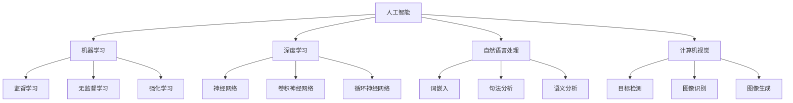

                 

# 李开复：AI 2.0 时代的投资价值

> 关键词：人工智能，投资价值，AI 2.0，技术进步，未来趋势，策略建议

> 摘要：本文深入探讨AI 2.0时代的投资价值，分析当前人工智能领域的核心进展和潜在机会。通过梳理核心概念、算法原理、数学模型、实战案例，提供投资者对未来AI市场的洞察和建议。

## 1. 背景介绍

### 1.1 目的和范围

本文旨在为投资者提供AI 2.0时代的投资价值分析。我们将从多个维度探讨人工智能的发展趋势，包括技术进步、行业应用和投资机会。本文主要涵盖以下几个内容：

1. 人工智能核心概念和原理
2. 当前AI技术的进展和应用场景
3. 投资AI领域的策略建议
4. 实战案例和代码解析
5. 未来AI市场的趋势和挑战

### 1.2 预期读者

本文适合以下读者群体：

1. 对人工智能感兴趣的投资者
2. 在AI领域工作的工程师和技术人员
3. 对技术趋势和未来投资有研究的读者
4. 对AI 2.0时代感兴趣的科技爱好者

### 1.3 文档结构概述

本文结构如下：

1. 背景介绍
   - 目的和范围
   - 预期读者
   - 文档结构概述
   - 术语表

2. 核心概念与联系
   - 人工智能基础概念
   - 相关技术原理
   - Mermaid流程图

3. 核心算法原理 & 具体操作步骤
   - 算法伪代码
   - 操作步骤详解

4. 数学模型和公式 & 详细讲解 & 举例说明
   - 数学公式
   - 模型解释
   - 实例分析

5. 项目实战：代码实际案例和详细解释说明
   - 开发环境搭建
   - 源代码实现
   - 代码解读与分析

6. 实际应用场景
   - 行业应用
   - 实战案例

7. 工具和资源推荐
   - 学习资源
   - 开发工具框架
   - 相关论文著作

8. 总结：未来发展趋势与挑战
   - 发展趋势
   - 挑战与建议

9. 附录：常见问题与解答
   - 问题与解答

10. 扩展阅读 & 参考资料

### 1.4 术语表

#### 1.4.1 核心术语定义

- 人工智能（AI）：模拟人类智能行为的计算机系统。
- 机器学习（ML）：从数据中学习规律和模式，提高计算机性能的方法。
- 深度学习（DL）：一种机器学习技术，使用多层神经网络模拟人脑。
- 自然语言处理（NLP）：使计算机能够理解和生成自然语言。
- 计算机视觉（CV）：使计算机能够理解和解析视觉信息。

#### 1.4.2 相关概念解释

- AI 1.0：指早期的AI技术，主要基于规则和符号逻辑。
- AI 2.0：指基于深度学习和大数据的AI技术，实现更高级的认知和推理能力。
- 投资价值：指投资者在投资AI领域所获得的潜在回报。
- 投资策略：指投资者在AI市场中进行投资的具体方法和计划。

#### 1.4.3 缩略词列表

- ML：机器学习
- DL：深度学习
- NLP：自然语言处理
- CV：计算机视觉
- AI 1.0：第一代人工智能
- AI 2.0：第二代人工智能

## 2. 核心概念与联系

### 2.1 人工智能基础概念

人工智能（AI）是一门交叉学科，结合了计算机科学、数学、统计学、神经科学等多个领域。AI的目标是创建能够模拟、延伸和扩展人类智能的计算机系统。人工智能主要分为两大类：

- **弱人工智能（Narrow AI）**：专注于特定任务，如语音识别、图像分类等。
- **强人工智能（General AI）**：具备人类水平的广泛认知能力，能够在多种任务中表现优异。

### 2.2 相关技术原理

人工智能的核心技术包括：

- **机器学习（ML）**：一种通过数据驱动的方式让计算机自动学习和改进的技术。ML主要分为监督学习、无监督学习和强化学习。

- **深度学习（DL）**：基于多层神经网络的机器学习技术，通过层层提取特征，实现复杂模式的识别。

- **自然语言处理（NLP）**：使计算机能够理解和生成自然语言的技术，涉及词法、句法、语义和语音等方面。

- **计算机视觉（CV）**：使计算机能够理解和解析视觉信息的技术，包括图像识别、目标检测和图像生成等。

### 2.3 Mermaid流程图

为了更好地理解人工智能的核心概念和联系，我们可以使用Mermaid流程图来展示各个技术领域之间的关系：



这个流程图展示了人工智能的核心技术领域以及它们之间的联系。通过这个图，我们可以清晰地看到各个子领域是如何相互关联和促进的。

## 3. 核心算法原理 & 具体操作步骤

### 3.1 算法原理

在AI 2.0时代，深度学习（DL）是最为重要的算法之一。深度学习通过多层神经网络，对输入数据进行特征提取和模式识别。以下是一个简单的深度学习算法原理：

1. **前向传播（Forward Propagation）**：输入数据通过网络中的每一层，每一层都会对该数据进行加权求和并加上偏置，然后通过激活函数进行处理，最终输出结果。
2. **反向传播（Back Propagation）**：根据输出结果与实际结果的差异，计算损失函数，并将损失反向传播到网络的每一层，更新网络的权重和偏置。

### 3.2 具体操作步骤

以下是一个深度学习算法的具体操作步骤：

1. **初始化权重和偏置**：随机初始化网络中的权重和偏置。
2. **前向传播**：输入数据通过网络，计算每层的输出。
    ```python
    for layer in layers:
        output = layer.forward(input)
        input = output
    ```
3. **计算损失**：计算实际输出与预期输出的差异。
    ```python
    loss = loss_function(output, target)
    ```
4. **反向传播**：根据损失函数，计算每层的梯度，并更新权重和偏置。
    ```python
    for layer in layers:
        gradient = layer.backward(loss)
        weights, biases = layer.weights, layer.biases
    ```
5. **迭代训练**：重复步骤2-4，直到网络达到期望的准确度。

## 4. 数学模型和公式 & 详细讲解 & 举例说明

### 4.1 数学模型

深度学习中的数学模型主要包括前向传播和反向传播。以下是一个简单的数学模型：

1. **前向传播**：
    $$ z_l = \sigma(W_l \cdot a_{l-1} + b_l) $$
    其中，$a_{l-1}$是前一层输出，$W_l$和$b_l$分别是权重和偏置，$\sigma$是激活函数。

2. **反向传播**：
    $$ \delta_l = \frac{\partial L}{\partial z_l} \cdot \frac{\partial \sigma}{\partial z_l} $$
    其中，$L$是损失函数，$\delta_l$是梯度。

### 4.2 详细讲解

1. **前向传播**：

   在前向传播过程中，我们通过加权求和并加上偏置，然后通过激活函数来处理输入数据。这个过程中，每一层的输出都是前一层输出的函数。例如，对于多层感知器（MLP）网络，前向传播可以表示为：

   $$ a_l = \sigma(W_l \cdot a_{l-1} + b_l) $$

   其中，$\sigma$是激活函数，通常选择为Sigmoid函数或ReLU函数。

2. **反向传播**：

   在反向传播过程中，我们通过计算损失函数对每一层的偏导数，来更新网络的权重和偏置。反向传播的核心是梯度下降法。梯度下降法的基本思想是，沿着损失函数梯度的反方向更新网络参数，以最小化损失函数。

   $$ \frac{\partial L}{\partial W_l} = \delta_l \cdot a_{l-1} $$
   $$ \frac{\partial L}{\partial b_l} = \delta_l $$

### 4.3 举例说明

假设我们有一个两层神经网络，输入层有3个神经元，隐藏层有2个神经元，输出层有1个神经元。激活函数使用ReLU函数。输入数据为：

$$ x = [1, 2, 3] $$

权重和偏置初始化为：

$$ W_1 = \begin{bmatrix} 0.1 & 0.2 & 0.3 \\ 0.4 & 0.5 & 0.6 \end{bmatrix}, b_1 = \begin{bmatrix} 0.1 \\ 0.2 \end{bmatrix} $$
$$ W_2 = \begin{bmatrix} 0.1 & 0.2 \\ 0.3 & 0.4 \end{bmatrix}, b_2 = \begin{bmatrix} 0.1 \\ 0.2 \end{bmatrix} $$

前向传播过程：

$$ z_1 = W_1 \cdot x + b_1 = \begin{bmatrix} 0.1 & 0.2 & 0.3 \\ 0.4 & 0.5 & 0.6 \end{bmatrix} \cdot \begin{bmatrix} 1 \\ 2 \\ 3 \end{bmatrix} + \begin{bmatrix} 0.1 \\ 0.2 \end{bmatrix} = \begin{bmatrix} 2.1 \\ 3.2 \end{bmatrix} $$
$$ a_1 = \sigma(z_1) = \begin{bmatrix} 2.1 \\ 3.2 \end{bmatrix} $$

$$ z_2 = W_2 \cdot a_1 + b_2 = \begin{bmatrix} 0.1 & 0.2 \\ 0.3 & 0.4 \end{bmatrix} \cdot \begin{bmatrix} 2.1 \\ 3.2 \end{bmatrix} + \begin{bmatrix} 0.1 \\ 0.2 \end{bmatrix} = \begin{bmatrix} 0.73 \\ 1.8 \end{bmatrix} $$
$$ a_2 = \sigma(z_2) = \begin{bmatrix} 0.87 \\ 0.99 \end{bmatrix} $$

反向传播过程：

$$ \delta_2 = (t - a_2) \cdot \frac{d\sigma}{dz_2} = (1 - \begin{bmatrix} 0.87 \\ 0.99 \end{bmatrix}) \cdot \begin{bmatrix} 0.1 & 0.2 \\ 0.3 & 0.4 \end{bmatrix} = \begin{bmatrix} 0.13 & 0.08 \\ 0.39 & 0.24 \end{bmatrix} $$
$$ \delta_1 = W_2^T \cdot \delta_2 \cdot \frac{d\sigma}{dz_1} = \begin{bmatrix} 0.1 & 0.2 \\ 0.3 & 0.4 \end{bmatrix}^T \cdot \begin{bmatrix} 0.13 & 0.08 \\ 0.39 & 0.24 \end{bmatrix} \cdot \begin{bmatrix} 0 & 0 \\ 1 & 1 \end{bmatrix} = \begin{bmatrix} 0.041 & 0.026 \\ 0.119 & 0.076 \end{bmatrix} $$

权重和偏置更新：

$$ W_1 = W_1 - \alpha \cdot \delta_1 \cdot a_{l-1}^T $$
$$ b_1 = b_1 - \alpha \cdot \delta_1 $$
$$ W_2 = W_2 - \alpha \cdot \delta_2 \cdot a_{l-1}^T $$
$$ b_2 = b_2 - \alpha \cdot \delta_2 $$

其中，$\alpha$是学习率。

## 5. 项目实战：代码实际案例和详细解释说明

### 5.1 开发环境搭建

为了实现一个简单的深度学习模型，我们需要搭建一个合适的开发环境。以下是搭建过程：

1. 安装Python（建议版本3.8以上）
2. 安装TensorFlow，可以使用以下命令：
    ```bash
    pip install tensorflow
    ```
3. 安装NumPy，可以使用以下命令：
    ```bash
    pip install numpy
    ```
4. 安装Matplotlib，可以使用以下命令：
    ```bash
    pip install matplotlib
    ```

### 5.2 源代码详细实现和代码解读

以下是一个简单的深度学习模型代码实现，用于实现一个线性回归任务：

```python
import tensorflow as tf
import numpy as np
import matplotlib.pyplot as plt

# 设置随机种子，确保结果可复现
tf.random.set_seed(0)

# 准备数据集
x = np.random.normal(size=100)
y = 2 * x + 1 + np.random.normal(size=100)

# 创建模型
model = tf.keras.Sequential([
    tf.keras.layers.Dense(units=1, input_shape=[1])
])

# 编译模型
model.compile(optimizer='sgd', loss='mean_squared_error')

# 训练模型
model.fit(x, y, epochs=100)

# 画出训练过程
plt.plot(x, y, 'ro', label='original data')
plt.plot(x, model.predict(x), label='predicted line')
plt.legend()
plt.show()
```

**代码解读**：

1. 导入所需的库。
2. 设置随机种子。
3. 准备一个简单的线性回归数据集。
4. 创建一个包含一个Dense层的模型，该层有一个单位输出和单个输入。
5. 编译模型，选择随机梯度下降（SGD）优化器和均方误差（MSE）损失函数。
6. 训练模型，指定训练轮数。
7. 使用Matplotlib绘制训练数据点和预测线。

### 5.3 代码解读与分析

1. **数据准备**：

   数据集由100个随机生成的点组成，每个点都遵循线性关系$y = 2x + 1$。

2. **模型创建**：

   创建一个简单的线性回归模型，包含一个Dense层。Dense层是一个全连接层，它接受单个输入并输出单个单位。在这里，我们假设输入和输出都是一维的。

3. **模型编译**：

   选择SGD作为优化器，MSE作为损失函数。SGD是一种常用的优化算法，适用于小数据集和高维问题。MSE用于计算预测值与实际值之间的差异。

4. **模型训练**：

   使用fit方法训练模型，指定训练轮数为100。在每一轮训练中，模型都会根据当前权重和偏置更新预测值，并计算损失。通过多次迭代，模型可以逐渐减小损失，提高预测准确性。

5. **结果可视化**：

   使用Matplotlib绘制原始数据点和模型预测的直线。这有助于我们直观地了解模型的性能和准确性。

通过这个简单的示例，我们可以看到如何使用TensorFlow搭建一个深度学习模型，并对其进行训练和评估。这个示例虽然是线性的，但也可以扩展到更复杂的模型和任务。

## 6. 实际应用场景

### 6.1 行业应用

人工智能在各个行业都取得了显著的进展，以下是一些典型的应用场景：

1. **医疗健康**：AI可以帮助医生进行诊断、个性化治疗和药物研发。例如，通过计算机视觉技术，AI可以分析医学影像，检测病变和组织结构。
2. **金融**：AI用于风险管理、交易策略和客户服务。例如，机器学习模型可以分析市场数据，预测股票价格和风险。
3. **零售**：AI可以帮助零售商进行库存管理、推荐系统和客户行为分析。例如，基于自然语言处理技术，AI可以分析客户评论，提供个性化的购物建议。
4. **自动驾驶**：计算机视觉和深度学习技术使自动驾驶成为可能。例如，自动驾驶汽车使用摄像头和激光雷达收集环境信息，通过深度学习算法进行路径规划和避障。

### 6.2 实战案例

以下是一个关于AI在医疗健康领域的实战案例：

**案例：基于深度学习的肺癌检测**

肺癌是导致癌症死亡的主要原因之一。为了提高早期检测的准确性，研究人员使用深度学习技术对CT扫描图像进行肺癌检测。

1. **数据收集**：收集大量的肺癌和正常CT扫描图像。
2. **数据预处理**：对图像进行标准化和增强，以提高模型的性能。
3. **模型训练**：使用深度学习模型（如卷积神经网络）对图像进行分类，训练模型以识别肺癌。
4. **模型评估**：使用测试数据集评估模型的性能，调整模型参数以提高准确性。
5. **部署应用**：将模型部署到医疗系统中，用于肺癌的早期检测。

通过这个案例，我们可以看到AI技术在医疗健康领域的应用潜力。深度学习模型可以处理大量数据，提高诊断的准确性和效率，为医生提供更好的决策支持。

## 7. 工具和资源推荐

### 7.1 学习资源推荐

#### 7.1.1 书籍推荐

1. 《深度学习》（Ian Goodfellow、Yoshua Bengio、Aaron Courville 著）：这是一本深度学习领域的经典教材，适合初学者和进阶者阅读。
2. 《Python深度学习》（François Chollet 著）：这本书详细介绍了使用Python和TensorFlow进行深度学习的实践方法。

#### 7.1.2 在线课程

1. 《深度学习》（吴恩达，Coursera）：这是一门广受欢迎的在线课程，适合初学者入门深度学习。
2. 《动手学深度学习》（Manning Publications）：这是一本基于PyTorch的深度学习实践指南，适合有一定基础的读者。

#### 7.1.3 技术博客和网站

1. [Medium](https://medium.com/topic/deep-learning)：这是一个包含大量深度学习相关文章的博客平台。
2. [AI Journal](https://aijournal.com/): 这是一个关于人工智能最新研究和技术文章的在线杂志。

### 7.2 开发工具框架推荐

#### 7.2.1 IDE和编辑器

1. PyCharm：这是一个功能强大的Python IDE，适合深度学习和机器学习项目。
2. Jupyter Notebook：这是一个流行的交互式计算环境，适合快速实验和演示。

#### 7.2.2 调试和性能分析工具

1. TensorBoard：这是一个TensorFlow的调试和性能分析工具，可以可视化模型的损失函数、激活函数等。
2. PyTorch Profiler：这是一个PyTorch的性能分析工具，可以帮助开发者优化模型性能。

#### 7.2.3 相关框架和库

1. TensorFlow：这是一个开源的深度学习框架，由谷歌开发。
2. PyTorch：这是一个开源的深度学习框架，由Facebook开发。
3. Keras：这是一个高级神经网络API，支持TensorFlow和PyTorch。

### 7.3 相关论文著作推荐

#### 7.3.1 经典论文

1. “Backpropagation”（1986，Rumelhart, Hinton, Williams）：这篇论文提出了反向传播算法，是深度学习的基础。
2. “A Theoretical Framework for General Learning” (1995，Hinton)：这篇论文提出了深度信念网络，推动了深度学习的进展。

#### 7.3.2 最新研究成果

1. “Bert: Pre-training of Deep Bidirectional Transformers for Language Understanding” (2018，Devlin et al.)：这篇论文提出了BERT模型，推动了自然语言处理的发展。
2. “Generative Adversarial Nets” (2014，Goodfellow et al.)：这篇论文提出了生成对抗网络（GAN），推动了生成模型的研究。

#### 7.3.3 应用案例分析

1. “Deep Learning for Healthcare” (2016，Esteva et al.)：这篇综述文章讨论了深度学习在医疗健康领域的应用。
2. “AI in Autonomous Driving” (2020，Berg et al.)：这篇综述文章讨论了人工智能在自动驾驶领域的应用。

## 8. 总结：未来发展趋势与挑战

### 8.1 未来发展趋势

1. **技术进步**：随着计算能力的提升和算法的优化，深度学习和人工智能将继续发展，解决更多复杂问题。
2. **跨界融合**：人工智能与其他领域（如医疗、金融、教育等）的融合将推动技术创新和应用拓展。
3. **开源生态**：更多的开源工具和框架将促进人工智能技术的发展，降低开发门槛。
4. **商业化落地**：人工智能技术将在更多行业得到商业化应用，带来巨大的经济和社会效益。

### 8.2 挑战与建议

1. **数据隐私与安全**：随着数据规模的扩大，数据隐私和安全问题将日益突出，需要制定相应的法律法规和防护措施。
2. **算法透明性与可解释性**：深度学习模型通常具有黑盒特性，难以解释其决策过程，需要开发更透明和可解释的算法。
3. **伦理与道德**：人工智能的发展需要遵循伦理和道德原则，避免对人类和社会造成负面影响。
4. **人才培养**：人工智能领域需要更多具备跨学科背景和创新能力的人才，应加强教育和培训工作。

## 9. 附录：常见问题与解答

### 9.1 问题1：如何入门人工智能？

**解答**：入门人工智能可以从以下几个步骤开始：

1. 学习Python编程语言，掌握基本的编程技能。
2. 学习线性代数、概率论和统计学，为深度学习打下数学基础。
3. 学习机器学习和深度学习的基本概念和算法。
4. 参加在线课程和实际项目，提升实践能力。

### 9.2 问题2：如何选择合适的深度学习框架？

**解答**：选择深度学习框架应考虑以下几点：

1. **项目需求**：根据项目需求选择合适的框架，如TensorFlow适用于大规模模型，PyTorch适合快速实验。
2. **社区支持**：选择拥有强大社区支持的框架，可以获得更好的技术支持和学习资源。
3. **易用性**：选择易用性和文档丰富的框架，降低开发门槛。
4. **兼容性**：选择与现有系统兼容的框架，确保项目集成和迁移的便捷性。

## 10. 扩展阅读 & 参考资料

1. Goodfellow, I., Bengio, Y., & Courville, A. (2016). *Deep Learning*.
2. Chollet, F. (2017). *Python Deep Learning*.
3. Devlin, J., Chang, M. W., Lee, K., & Toutanova, K. (2019). *Bert: Pre-training of Deep Bidirectional Transformers for Language Understanding*.
4. Goodfellow, I., Pouget-Abadie, J., Mirza, M., Xu, B., Warde-Farley, D., Ozair, S., & Bengio, Y. (2014). *Generative Adversarial Nets*.

