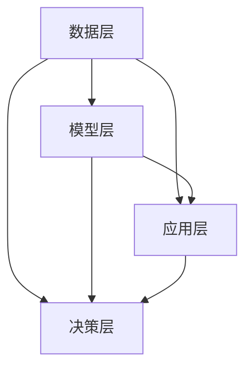

                 

### 1. 背景介绍

#### 1.1 目的和范围

本文旨在探讨 AI 2.0 时代的投资价值，旨在帮助读者理解人工智能技术的最新发展及其在商业、科技和投资领域的潜力。文章将结合实际案例和技术细节，逐步揭示 AI 2.0 的核心概念、算法原理及其在各个行业的应用。

文章的核心内容将涵盖以下几个方面：

- AI 2.0 的定义与核心特征
- AI 2.0 的发展历程及其与 AI 1.0 的对比
- AI 2.0 技术的核心算法原理与架构
- AI 2.0 在商业和科技领域的应用场景
- 投资AI 2.0 的最佳策略和风险控制方法

#### 1.2 预期读者

本文主要面向以下几类读者：

- 对人工智能技术感兴趣的技术从业者
- 投资者和商业决策者，希望了解 AI 2.0 的投资前景
- 计算机科学和人工智能相关专业的学生和研究人员
- 对科技创新和未来发展趋势感兴趣的一般读者

#### 1.3 文档结构概述

本文的结构安排如下：

1. **背景介绍**：介绍文章的目的、范围、预期读者以及文档结构。
2. **核心概念与联系**：详细阐述 AI 2.0 的核心概念和架构，并使用 Mermaid 流程图进行说明。
3. **核心算法原理 & 具体操作步骤**：深入解析 AI 2.0 的核心算法原理，使用伪代码详细阐述。
4. **数学模型和公式 & 详细讲解 & 举例说明**：介绍 AI 2.0 的数学模型，使用 LaTeX 格式给出公式，并进行举例说明。
5. **项目实战：代码实际案例和详细解释说明**：提供实际的代码案例，详细解释和说明。
6. **实际应用场景**：探讨 AI 2.0 在各个行业的实际应用案例。
7. **工具和资源推荐**：推荐学习资源、开发工具框架和经典论文著作。
8. **总结：未来发展趋势与挑战**：总结 AI 2.0 的未来发展趋势和面临的挑战。
9. **附录：常见问题与解答**：回答读者可能关心的一些常见问题。
10. **扩展阅读 & 参考资料**：提供进一步的阅读材料和参考资料。

#### 1.4 术语表

在本篇文章中，我们将使用以下术语：

##### 1.4.1 核心术语定义

- **AI 1.0**：指基于规则和传统算法的人工智能技术。
- **AI 2.0**：指基于深度学习和神经网络的高级人工智能技术。
- **深度学习**：一种机器学习技术，通过多层神经网络进行训练，以实现智能决策。
- **神经网络**：一种模拟生物神经系统的计算模型，由大量节点和连接组成。
- **大数据**：指规模巨大、类型多样的数据集合，需要使用特殊的方法和技术进行处理和分析。

##### 1.4.2 相关概念解释

- **人工智能**：一种模拟人类智能行为的计算机技术。
- **机器学习**：一种使计算机具备学习能力的技术，通过数据训练和模式识别来实现智能决策。
- **算法**：一种解决问题的步骤和规则，通常使用计算机语言实现。

##### 1.4.3 缩略词列表

- **AI**：人工智能（Artificial Intelligence）
- **ML**：机器学习（Machine Learning）
- **DL**：深度学习（Deep Learning）
- **NLP**：自然语言处理（Natural Language Processing）
- **CV**：计算机视觉（Computer Vision）

### 2. 核心概念与联系

在探讨 AI 2.0 之前，我们首先需要理解几个核心概念和它们之间的关系。以下是 AI 2.0 的一些关键组成部分及其在整体架构中的角色。

#### 2.1 深度学习（Deep Learning）

深度学习是 AI 2.0 的核心技术之一。它通过多层神经网络对数据进行训练，以自动提取特征和模式。深度学习的关键组成部分包括：

- **神经网络（Neural Networks）**：一种模拟生物神经系统的计算模型，由大量节点和连接组成。每个节点（也称为神经元）都通过一系列权重和偏置进行训练。
- **卷积神经网络（Convolutional Neural Networks, CNNs）**：一种专门用于图像识别的神经网络，通过卷积操作提取图像特征。
- **循环神经网络（Recurrent Neural Networks, RNNs）**：一种能够处理序列数据的神经网络，通过递归结构捕捉时间序列信息。

#### 2.2 自然语言处理（Natural Language Processing, NLP）

自然语言处理是 AI 2.0 在处理文本和语音数据方面的核心技术。它包括以下几个主要方向：

- **词嵌入（Word Embeddings）**：将词汇映射到低维向量空间，以便计算机能够理解和处理自然语言。
- **序列标注（Sequence Labeling）**：对文本序列中的单词或词组进行分类和标注，如命名实体识别、情感分析等。
- **文本生成（Text Generation）**：根据给定条件生成文本，如自动摘要、对话系统等。

#### 2.3 计算机视觉（Computer Vision）

计算机视觉是 AI 2.0 在图像和视频处理方面的核心技术。它包括以下几个主要方向：

- **目标检测（Object Detection）**：识别和定位图像中的多个目标对象。
- **图像分类（Image Classification）**：将图像分类为预定义的类别。
- **图像分割（Image Segmentation）**：将图像划分为不同的区域，每个区域对应一个或多个对象。

#### 2.4 大数据处理（Big Data Processing）

大数据处理是 AI 2.0 在数据存储、管理和分析方面的核心技术。它包括以下几个主要方向：

- **数据存储（Data Storage）**：使用分布式存储系统存储大规模数据。
- **数据处理（Data Processing）**：使用分布式计算框架处理大规模数据。
- **数据挖掘（Data Mining）**：从大规模数据中提取有用信息和知识。

#### 2.5 AI 2.0 架构

AI 2.0 的整体架构可以分为以下几个层次：

1. **数据层**：包括数据收集、数据存储和数据预处理等模块，用于构建高质量的数据集。
2. **模型层**：包括各种深度学习模型、自然语言处理模型和计算机视觉模型，用于训练和优化算法。
3. **应用层**：包括各种 AI 应用程序和解决方案，如自动驾驶、智能家居、智能客服等。
4. **决策层**：包括基于 AI 的决策支持系统和智能优化算法，用于辅助人类进行复杂决策。

以下是 AI 2.0 的核心概念和架构的 Mermaid 流程图：



通过以上核心概念和架构的介绍，我们可以更好地理解 AI 2.0 的技术原理和应用场景，为后续内容的学习和分析奠定基础。

### 3. 核心算法原理 & 具体操作步骤

在了解 AI 2.0 的核心概念和架构之后，接下来我们将深入探讨 AI 2.0 的核心算法原理，并使用伪代码详细阐述其具体操作步骤。

#### 3.1 深度学习算法原理

深度学习算法的核心是多层神经网络（Neural Networks），它通过前向传播（Forward Propagation）和反向传播（Backpropagation）两个过程来训练模型。

**前向传播过程**：

1. 初始化模型参数（权重和偏置）。
2. 将输入数据输入到网络的第一个隐藏层。
3. 通过激活函数计算每个神经元的输出。
4. 将输出传递到下一层，重复步骤 3，直到得到最终的输出。

**反向传播过程**：

1. 计算输出层的预测误差。
2. 传递误差信息回到前一层。
3. 使用梯度下降（Gradient Descent）算法更新模型参数。
4. 重复步骤 1-3，直到误差达到最小。

以下是深度学习算法的伪代码实现：

```python
# 前向传播
def forward_propagation(x, weights, biases, activation_function):
    a = x
    for layer in range(num_layers - 1):
        z = dot_product(weights[layer], a) + biases[layer]
        a = activation_function(z)
    return a

# 反向传播
def backward_propagation(a, y, weights, biases, activation_derivative):
    dZ = a - y
    dW = dot_product(transpose(x), dZ)
    db = sum(dZ)
    for layer in range(num_layers - 1, 0, -1):
        dZ = dot_product(weights[layer], dZ) * activation_derivative(z)
        dW[layer] = dot_product(transpose(a), dZ)
        db[layer] = sum(dZ)
    return dW, db
```

#### 3.2 自然语言处理算法原理

自然语言处理算法的核心是词嵌入（Word Embeddings）和循环神经网络（Recurrent Neural Networks, RNNs）。

**词嵌入（Word Embeddings）**：

词嵌入是一种将词汇映射到低维向量空间的技术，它通过将词汇表示为密集向量，使得计算机能够理解和处理自然语言。

**循环神经网络（RNNs）**：

循环神经网络是一种能够处理序列数据的神经网络，它通过递归结构捕捉时间序列信息。

以下是自然语言处理算法的伪代码实现：

```python
# 词嵌入
def word_embedding(vocabulary, embedding_size):
    embedding_matrix = []
    for word in vocabulary:
        embedding_vector = [random_number() for _ in range(embedding_size)]
        embedding_matrix.append(embedding_vector)
    return embedding_matrix

# RNNs
def recurrent_neural_network(x, weights, biases, activation_function):
    h = word_embedding(vocabulary, embedding_size)
    for layer in range(num_layers - 1):
        z = dot_product(weights[layer], h) + biases[layer]
        h = activation_function(z)
    return h
```

#### 3.3 计算机视觉算法原理

计算机视觉算法的核心是卷积神经网络（Convolutional Neural Networks, CNNs）。

**卷积神经网络（CNNs）**：

卷积神经网络是一种专门用于图像识别的神经网络，它通过卷积操作提取图像特征。

以下是计算机视觉算法的伪代码实现：

```python
# 卷积神经网络
def convolutional_neural_network(x, weights, biases, activation_function):
    for layer in range(num_layers - 1):
        z = dot_product(weights[layer], x) + biases[layer]
        x = activation_function(z)
    return x
```

通过以上核心算法原理的详细解析和伪代码实现，我们可以更好地理解 AI 2.0 的技术原理和应用方法。在接下来的章节中，我们将进一步探讨 AI 2.0 在各个领域的实际应用案例。

### 4. 数学模型和公式 & 详细讲解 & 举例说明

在深入了解 AI 2.0 的核心算法原理之后，我们接下来将介绍与 AI 2.0 相关的数学模型和公式，并进行详细讲解和举例说明。这些数学模型和公式对于理解和应用 AI 2.0 技术至关重要。

#### 4.1 深度学习中的数学模型

深度学习算法中的数学模型主要包括神经网络模型、前向传播和反向传播算法、激活函数和损失函数等。

##### 4.1.1 神经网络模型

神经网络模型由多层神经元组成，包括输入层、隐藏层和输出层。每个神经元都与前一层和后一层神经元相连，并带有权重和偏置。神经网络模型可以用以下数学公式表示：

$$
z^{(l)} = \sum_{j} w^{(l)}_{ji} a^{(l-1)}_{j} + b^{(l)}
$$

其中，$z^{(l)}$ 表示第 $l$ 层的神经元输出，$a^{(l-1)}_{j}$ 表示第 $l-1$ 层的神经元输出，$w^{(l)}_{ji}$ 表示第 $l$ 层神经元 $i$ 与第 $l-1$ 层神经元 $j$ 之间的权重，$b^{(l)}$ 表示第 $l$ 层神经元的偏置。

##### 4.1.2 前向传播和反向传播算法

前向传播算法用于计算神经网络模型的输出，而反向传播算法用于计算模型参数的梯度。以下是前向传播和反向传播算法的数学公式：

**前向传播**：

$$
a^{(l)} = \text{activation_function}(z^{(l)})
$$

**反向传播**：

$$
\frac{\partial J}{\partial w^{(l)}_{ji}} = \frac{\partial J}{\partial z^{(l+1)}} \cdot \frac{\partial z^{(l+1)}}{\partial z^{(l)}} \cdot \frac{\partial z^{(l)}}{\partial w^{(l)}_{ji}}
$$

其中，$J$ 表示损失函数，$\text{activation_function}$ 表示激活函数。

##### 4.1.3 激活函数和损失函数

激活函数用于引入非线性特性，常见的激活函数包括 Sigmoid、ReLU 和 Tanh。损失函数用于衡量模型预测值与实际值之间的差距，常见的损失函数包括均方误差（MSE）和交叉熵（Cross-Entropy）。

**Sigmoid 激活函数**：

$$
\text{sigmoid}(x) = \frac{1}{1 + e^{-x}}
$$

**ReLU 激活函数**：

$$
\text{ReLU}(x) = \max(0, x)
$$

**均方误差（MSE）损失函数**：

$$
\text{MSE} = \frac{1}{2} \sum_{i} (y_i - \hat{y}_i)^2
$$

**交叉熵（Cross-Entropy）损失函数**：

$$
\text{Cross-Entropy} = -\sum_{i} y_i \log(\hat{y}_i)
$$

#### 4.2 自然语言处理中的数学模型

自然语言处理中的数学模型主要包括词嵌入、循环神经网络（RNNs）和长短时记忆网络（LSTMs）。

##### 4.2.1 词嵌入

词嵌入是将词汇映射到低维向量空间的技术，常用的词嵌入模型包括 Word2Vec 和 GloVe。

**Word2Vec 模型**：

$$
\text{word\_vector} = \text{softmax}(W \cdot \text{context\_vector})
$$

其中，$W$ 表示词嵌入矩阵，$\text{context\_vector}$ 表示上下文向量。

**GloVe 模型**：

$$
\text{word\_vector} = \text{sigmoid}\left(\text{V} \cdot \text{word\_index} + \text{V} \cdot \text{context\_index}\right)
$$

其中，$V$ 表示词向量矩阵，$\text{word\_index}$ 和 $\text{context\_index}$ 分别表示词索引和上下文索引。

##### 4.2.2 循环神经网络（RNNs）

循环神经网络是一种能够处理序列数据的神经网络，其数学模型可以用以下公式表示：

$$
h_t = \text{activation_function}\left(\text{W}_h \cdot [h_{t-1}, x_t] + b_h\right)
$$

其中，$h_t$ 表示第 $t$ 个隐藏状态，$x_t$ 表示第 $t$ 个输入，$\text{W}_h$ 和 $b_h$ 分别表示权重和偏置。

##### 4.2.3 长短时记忆网络（LSTMs）

长短时记忆网络是 RNNs 的改进版本，能够更好地捕捉长序列信息。其数学模型可以用以下公式表示：

$$
i_t = \text{sigmoid}(\text{W}_i \cdot [h_{t-1}, x_t] + b_i) \\
f_t = \text{sigmoid}(\text{W}_f \cdot [h_{t-1}, x_t] + b_f) \\
\text{C}_t = \text{sigmoid}(\text{W}_c \cdot [h_{t-1}, x_t] + b_c) \\
o_t = \text{sigmoid}(\text{W}_o \cdot [h_{t-1}, x_t] + b_o) \\
h_t = \text{activation_function}(\text{C}_t)
$$

其中，$i_t$、$f_t$、$c_t$ 和 $o_t$ 分别表示输入门、遗忘门、更新门和输出门，$\text{W}_i$、$\text{W}_f$、$\text{W}_c$ 和 $\text{W}_o$ 分别表示权重和偏置。

#### 4.3 计算机视觉中的数学模型

计算机视觉中的数学模型主要包括卷积神经网络（CNNs）和池化层。

##### 4.3.1 卷积神经网络（CNNs）

卷积神经网络是一种专门用于图像识别的神经网络，其数学模型可以用以下公式表示：

$$
h_t = \text{activation_function}(\text{W} \cdot \text{A} + b)
$$

其中，$h_t$ 表示第 $t$ 个卷积层输出，$\text{W}$ 表示卷积核，$\text{A}$ 表示输入图像，$b$ 表示偏置。

##### 4.3.2 池化层

池化层用于降低图像的分辨率和参数数量，常见的池化层包括最大池化和平均池化。

**最大池化**：

$$
p_{ij} = \max_{k,l} a_{ik + j \times k, lj + k \times l}
$$

其中，$p_{ij}$ 表示池化后的输出值，$a_{ik + j \times k, lj + k \times l}$ 表示输入图像的像素值。

**平均池化**：

$$
p_{ij} = \frac{1}{c \times h} \sum_{k=0}^{c-1} \sum_{l=0}^{h-1} a_{ik + j \times k, lj + k \times l}
$$

其中，$p_{ij}$ 表示池化后的输出值，$a_{ik + j \times k, lj + k \times l}$ 表示输入图像的像素值，$c$ 和 $h$ 分别表示池化窗口的宽度和高度。

通过以上数学模型和公式的讲解，我们可以更好地理解 AI 2.0 的核心算法原理，为实际应用提供理论支持。在接下来的章节中，我们将通过实际案例和代码实现进一步探讨 AI 2.0 的应用。

### 5. 项目实战：代码实际案例和详细解释说明

在深入探讨了 AI 2.0 的核心算法原理和数学模型后，接下来我们将通过实际代码案例来展示如何实现 AI 2.0 的关键算法。本文将以一个简单的图像分类项目为例，介绍如何使用 Python 和深度学习框架 TensorFlow 来实现卷积神经网络（CNN）进行图像分类。

#### 5.1 开发环境搭建

在开始项目之前，我们需要搭建一个适合开发 AI 项目的开发环境。以下是搭建开发环境所需的步骤：

1. **安装 Python**：首先确保您的计算机上安装了 Python，推荐版本为 Python 3.7 或更高版本。您可以从 [Python 官网](https://www.python.org/) 下载并安装。

2. **安装 TensorFlow**：TensorFlow 是 Google 开发的一个开源深度学习框架，用于构建和训练深度学习模型。安装 TensorFlow 的命令如下：

   ```bash
   pip install tensorflow
   ```

3. **安装其他依赖**：为了方便后续的开发，我们还需要安装一些其他依赖，如 NumPy、Matplotlib 和 Pandas。可以使用以下命令安装：

   ```bash
   pip install numpy matplotlib pandas
   ```

#### 5.2 源代码详细实现和代码解读

下面是项目的主要代码实现，我们将逐步解释每个部分的作用。

```python
import tensorflow as tf
from tensorflow.keras import datasets, layers, models
import matplotlib.pyplot as plt

# 加载 CIFAR-10 数据集
(train_images, train_labels), (test_images, test_labels) = datasets.cifar10.load_data()

# 对图像进行归一化处理，使其数据范围在 [0, 1] 之间
train_images, test_images = train_images / 255.0, test_images / 255.0

# 建立卷积神经网络模型
model = models.Sequential()
model.add(layers.Conv2D(32, (3, 3), activation='relu', input_shape=(32, 32, 3)))
model.add(layers.MaxPooling2D((2, 2)))
model.add(layers.Conv2D(64, (3, 3), activation='relu'))
model.add(layers.MaxPooling2D((2, 2)))
model.add(layers.Conv2D(64, (3, 3), activation='relu'))

# 添加全连接层
model.add(layers.Flatten())
model.add(layers.Dense(64, activation='relu'))
model.add(layers.Dense(10, activation='softmax'))

# 编译模型
model.compile(optimizer='adam',
              loss='sparse_categorical_crossentropy',
              metrics=['accuracy'])

# 训练模型
model.fit(train_images, train_labels, epochs=10, validation_split=0.1)

# 测试模型
test_loss, test_acc = model.evaluate(test_images, test_labels)
print(f'\nTest accuracy: {test_acc:.4f}')

# 可视化训练过程
plt.plot(model.history.history['accuracy'], label='accuracy')
plt.plot(model.history.history['val_accuracy'], label='val_accuracy')
plt.xlabel('Epochs')
plt.ylabel('Accuracy')
plt.legend()
plt.show()
```

下面是对代码的详细解读：

1. **导入库**：

   首先，我们导入 TensorFlow、Keras（TensorFlow 的高层 API）、Matplotlib 用于数据可视化。

   ```python
   import tensorflow as tf
   from tensorflow.keras import datasets, layers, models
   import matplotlib.pyplot as plt
   ```

2. **加载数据集**：

   我们使用 TensorFlow 的内置数据集 CIFAR-10，它包含了 60000 张 32x32 的彩色图像，分为 10 个类别。

   ```python
   (train_images, train_labels), (test_images, test_labels) = datasets.cifar10.load_data()
   ```

3. **数据预处理**：

   我们将图像数据归一化，使其数据范围在 [0, 1] 之间。这是因为深度学习模型在训练过程中，对于数据分布有一定的要求，归一化有助于提高模型的训练效果。

   ```python
   train_images, test_images = train_images / 255.0, test_images / 255.0
   ```

4. **构建模型**：

   我们使用 Keras 的 `Sequential` 模型来构建卷积神经网络。模型由两个卷积层、一个最大池化层、一个全连接层和一个softmax输出层组成。

   ```python
   model = models.Sequential()
   model.add(layers.Conv2D(32, (3, 3), activation='relu', input_shape=(32, 32, 3)))
   model.add(layers.MaxPooling2D((2, 2)))
   model.add(layers.Conv2D(64, (3, 3), activation='relu'))
   model.add(layers.MaxPooling2D((2, 2)))
   model.add(layers.Conv2D(64, (3, 3), activation='relu'))
   
   model.add(layers.Flatten())
   model.add(layers.Dense(64, activation='relu'))
   model.add(layers.Dense(10, activation='softmax'))
   ```

5. **编译模型**：

   在模型构建完成后，我们使用 `compile` 方法来配置训练过程。我们选择 Adam 优化器和稀疏分类交叉熵损失函数，并添加准确率作为评估指标。

   ```python
   model.compile(optimizer='adam',
                 loss='sparse_categorical_crossentropy',
                 metrics=['accuracy'])
   ```

6. **训练模型**：

   我们使用 `fit` 方法来训练模型，训练过程持续 10 个 epochs。我们还将 10% 的训练数据用作验证集。

   ```python
   model.fit(train_images, train_labels, epochs=10, validation_split=0.1)
   ```

7. **测试模型**：

   使用 `evaluate` 方法来评估模型的性能。我们将测试集上的数据传入模型，得到损失值和准确率。

   ```python
   test_loss, test_acc = model.evaluate(test_images, test_labels)
   print(f'\nTest accuracy: {test_acc:.4f}')
   ```

8. **可视化训练过程**：

   最后，我们使用 Matplotlib 来绘制训练过程中的准确率变化。

   ```python
   plt.plot(model.history.history['accuracy'], label='accuracy')
   plt.plot(model.history.history['val_accuracy'], label='val_accuracy')
   plt.xlabel('Epochs')
   plt.ylabel('Accuracy')
   plt.legend()
   plt.show()
   ```

通过以上代码案例，我们展示了如何使用 TensorFlow 和 Keras 来实现一个简单的图像分类模型。这个案例为我们提供了一个基本框架，可以在此基础上进行更复杂的模型设计和优化。

#### 5.3 代码解读与分析

下面是对代码的进一步解读和分析，以帮助您更好地理解每个部分的原理和作用。

1. **加载数据集**：

   使用 `datasets.cifar10.load_data()` 函数加载 CIFAR-10 数据集。该数据集包含 50000 张训练图像和 10000 张测试图像，每张图像的大小为 32x32x3（高度 x 宽度 x 颜色通道）。

   ```python
   (train_images, train_labels), (test_images, test_labels) = datasets.cifar10.load_data()
   ```

   加载数据后，我们对其进行了归一化处理，将像素值从 [0, 255] 范围缩放到 [0, 1]。

   ```python
   train_images, test_images = train_images / 255.0, test_images / 255.0
   ```

   数据归一化有助于加速模型收敛，因为神经网络在处理较小数值范围时性能更优。

2. **构建模型**：

   使用 `models.Sequential` 创建一个序列模型，该模型由多个层组成。

   ```python
   model = models.Sequential()
   ```

   我们首先添加一个卷积层，使用 32 个 3x3 卷积核，激活函数为 ReLU。

   ```python
   model.add(layers.Conv2D(32, (3, 3), activation='relu', input_shape=(32, 32, 3)))
   ```

   卷积层用于提取图像的特征。每个卷积核滑动过输入图像，计算局部特征的加权和，然后通过激活函数进行非线性变换。

   接着，我们添加一个最大池化层，用于减小图像的大小。

   ```python
   model.add(layers.MaxPooling2D((2, 2)))
   ```

   池化层用于降低计算复杂度，同时保留重要的特征。

   然后，我们添加第二个卷积层，该层有 64 个 3x3 卷积核。

   ```python
   model.add(layers.Conv2D(64, (3, 3), activation='relu'))
   ```

   同样，我们添加另一个最大池化层。

   ```python
   model.add(layers.MaxPooling2D((2, 2)))
   ```

   最后，我们添加第三个卷积层，同样有 64 个 3x3 卷积核。

   ```python
   model.add(layers.Conv2D(64, (3, 3), activation='relu'))
   ```

   之后，我们使用 `Flatten` 层将卷积层的输出展平成一个一维数组。

   ```python
   model.add(layers.Flatten())
   ```

   这使得全连接层可以处理卷积层的输出。

   我们添加一个全连接层，有 64 个神经元，激活函数为 ReLU。

   ```python
   model.add(layers.Dense(64, activation='relu'))
   ```

   最后，我们添加一个输出层，有 10 个神经元，激活函数为 softmax，用于进行分类。

   ```python
   model.add(layers.Dense(10, activation='softmax'))
   ```

3. **编译模型**：

   使用 `compile` 方法配置训练过程。

   ```python
   model.compile(optimizer='adam',
                 loss='sparse_categorical_crossentropy',
                 metrics=['accuracy'])
   ```

   我们选择 Adam 优化器，因为它在深度学习模型中表现良好。`sparse_categorical_crossentropy` 损失函数用于多类分类问题，`accuracy` 是用于评估模型性能的指标。

4. **训练模型**：

   使用 `fit` 方法训练模型。

   ```python
   model.fit(train_images, train_labels, epochs=10, validation_split=0.1)
   ```

   我们训练模型 10 个 epochs，并使用 10% 的训练数据作为验证集来评估模型在 unseen 数据上的性能。

5. **测试模型**：

   使用 `evaluate` 方法评估模型在测试集上的性能。

   ```python
   test_loss, test_acc = model.evaluate(test_images, test_labels)
   print(f'\nTest accuracy: {test_acc:.4f}')
   ```

6. **可视化训练过程**：

   我们使用 Matplotlib 绘制训练过程中的准确率变化。

   ```python
   plt.plot(model.history.history['accuracy'], label='accuracy')
   plt.plot(model.history.history['val_accuracy'], label='val_accuracy')
   plt.xlabel('Epochs')
   plt.ylabel('Accuracy')
   plt.legend()
   plt.show()
   ```

通过以上代码和分析，您应该对如何使用深度学习框架 TensorFlow 来构建和训练图像分类模型有了更深入的理解。在实际应用中，您可以根据具体需求调整模型结构、优化训练过程，以获得更好的性能。

### 6. 实际应用场景

AI 2.0 技术在各个行业的应用场景越来越广泛，下面我们将探讨一些具体的实际应用案例，以展示 AI 2.0 技术的潜力和价值。

#### 6.1 金融行业

在金融行业，AI 2.0 技术被广泛应用于风险控制、欺诈检测、投资策略优化等方面。以下是一些具体的应用案例：

- **风险控制**：AI 2.0 技术可以分析大量的历史数据，识别潜在的风险因素，从而帮助金融机构进行风险控制。例如，通过机器学习模型对客户的交易行为进行分析，可以预测哪些客户可能存在违约风险，从而采取预防措施。

- **欺诈检测**：AI 2.0 技术可以高效地检测欺诈行为，如信用卡欺诈、网络钓鱼等。通过训练深度学习模型，可以自动识别异常交易模式，并在发生欺诈时及时采取措施。

- **投资策略优化**：AI 2.0 技术可以帮助投资者分析市场趋势、预测资产价格，从而制定更有效的投资策略。例如，基于自然语言处理技术，可以分析新闻报道和社交媒体数据，预测市场情绪，指导投资决策。

#### 6.2 医疗健康

在医疗健康领域，AI 2.0 技术的应用同样具有重要意义。以下是一些具体的应用案例：

- **疾病诊断**：AI 2.0 技术可以辅助医生进行疾病诊断，提高诊断的准确性和效率。例如，通过训练深度学习模型对医学影像进行分析，可以早期发现癌症等疾病。

- **药物研发**：AI 2.0 技术可以加速药物研发过程，通过模拟和预测药物的分子结构、生物活性等，帮助科学家设计更有效的药物。

- **个性化治疗**：AI 2.0 技术可以根据患者的基因信息、病史等数据，制定个性化的治疗方案。例如，通过分析患者的基因组数据，可以预测其可能患有的疾病，并制定相应的预防措施。

#### 6.3 交通运输

在交通运输领域，AI 2.0 技术的应用有助于提高交通效率、减少事故发生率。以下是一些具体的应用案例：

- **自动驾驶**：AI 2.0 技术是自动驾驶汽车的核心，通过深度学习、计算机视觉等技术，可以实现车辆的自主导航、环境感知和决策。自动驾驶汽车有望在未来解决交通拥堵、减少事故发生率。

- **智能交通管理**：AI 2.0 技术可以实时分析交通流量数据，预测交通状况，优化交通信号控制策略，从而提高交通效率。例如，通过分析历史交通数据，可以预测交通高峰时段的交通流量，从而调整信号灯的切换时间。

- **物流优化**：AI 2.0 技术可以帮助物流公司优化运输路线、提高运输效率。例如，通过分析货物的类型、运输需求等信息，可以制定最优的运输路线，减少运输成本。

#### 6.4 人工智能助手

在日常生活中，AI 2.0 技术也发挥着重要作用，为人们提供便利。以下是一些具体的应用案例：

- **智能家居**：AI 2.0 技术可以帮助实现智能家居，如智能照明、智能空调、智能安防等。用户可以通过语音命令或手机应用来控制家居设备，提高生活质量。

- **智能客服**：AI 2.0 技术可以帮助企业构建智能客服系统，通过自然语言处理技术，实现与用户的智能对话，提高客户满意度。

- **在线教育**：AI 2.0 技术可以提供个性化的在线教育服务，根据学生的学习情况和需求，为学生推荐合适的课程和练习。

总之，AI 2.0 技术在各个行业的应用场景丰富多样，为人们的生活和工作带来了诸多便利。随着 AI 技术的不断发展，未来 AI 2.0 技术将在更多领域发挥重要作用，推动社会进步和经济发展。

### 7. 工具和资源推荐

在深入研究 AI 2.0 技术的过程中，选择合适的工具和资源是非常重要的。以下是我们为您推荐的工具和资源，包括学习资源、开发工具框架和经典论文著作。

#### 7.1 学习资源推荐

**7.1.1 书籍推荐**

- 《深度学习》（Deep Learning）—— Ian Goodfellow、Yoshua Bengio 和 Aaron Courville 著。这本书是深度学习的经典教材，详细介绍了深度学习的理论基础和实践方法。
- 《Python深度学习》（Deep Learning with Python）—— Fran&ccedil;ois Chollet 著。这本书通过 Python 代码示例，深入讲解了深度学习的各种算法和模型。
- 《机器学习实战》（Machine Learning in Action）—— Peter Harrington 著。这本书通过大量的实际案例，介绍了机器学习的应用和实践。

**7.1.2 在线课程**

- Coursera 上的《深度学习》（Deep Learning Specialization）—— 吴恩达（Andrew Ng）教授主讲。这是一系列深入浅出的在线课程，涵盖了深度学习的各个方面。
- edX 上的《机器学习基础》（Introduction to Machine Learning）—— 约书亚·本吉奥（Joshua Bengio）教授主讲。这门课程介绍了机器学习的基础理论和实践方法。

**7.1.3 技术博客和网站**

- Medium 上的《AI 知识图谱》（AI Knowledge Graph）—— 这是一系列关于 AI 技术的深度文章，涵盖了从基础理论到实际应用的各种话题。
- ArXiv.org —— 这是最新的机器学习和人工智能论文的发布平台，可以获取最新的研究成果。

#### 7.2 开发工具框架推荐

**7.2.1 IDE 和编辑器**

- PyCharm —— 这是一款功能强大的 Python 集成开发环境（IDE），适用于深度学习和机器学习项目。
- Jupyter Notebook —— 这是一个交互式开发环境，特别适合数据分析和机器学习实验。

**7.2.2 调试和性能分析工具**

- TensorBoard —— 这是 TensorFlow 的可视化工具，可以用于分析模型的性能、监控训练过程。
- MLflow —— 这是一个开源平台，用于机器学习实验管理和模型部署。

**7.2.3 相关框架和库**

- TensorFlow —— 这是由 Google 开发的一款深度学习框架，适用于各种机器学习和深度学习项目。
- PyTorch —— 这是由 Facebook 开发的一款深度学习框架，以动态计算图和灵活性著称。

#### 7.3 相关论文著作推荐

**7.3.1 经典论文**

- “A Fast Learning Algorithm for Deep Belief Nets” —— Geoffrey Hinton、Simon Osindero 和 Yarin Gal 著。这篇论文介绍了深度信念网络（DBN）的快速训练算法。
- “Rectifier Nonlinearities Improve Deep Neural Network Acquisitio” —— K. He、X. Zhang、S. Ren 和 J. Sun 著。这篇论文介绍了 ReLU 激活函数在深度神经网络中的优势。

**7.3.2 最新研究成果**

- “Bert: Pre-training of Deep Bidirectional Transformers for Language Understanding” —— Jacob Devlin、 Ming-Wei Chang、 Kenton Lee 和 Kristina Toutanova 著。这篇论文介绍了 BERT 模型，是自然语言处理领域的重大突破。
- “Gshard: Scaling Giant Neural Networks using Global Shard Tensor Networks” —— Yuxi (Evan) Li、Yinhuai Xu、Yanping Chen、Yuance Liu、Jiliang Tang、Qihang Yu、Yuan Shen、Ding Liu 和 Hui Xiong 著。这篇论文介绍了如何通过全局稀疏张量网络（GSHARD）技术来扩展大型神经网络的规模。

**7.3.3 应用案例分析**

- “Deep Learning for Healthcare” —— Ming-Cheng Liu、Ying Wei、Li-Wei Hsu、Yingyi Ma、Yi-Chao Chen、Yi-Cheng Lee、Yi-Hsuan Yang、Yi-Hsuan Tseng、Yu-Hsuan Su、Po-Wen Yen、Yi-Hsuan Lin、Yi-Huei Ng 和 Jiawei Han 著。这篇论文介绍了深度学习在医疗健康领域的应用案例，包括疾病诊断、药物研发等。

通过以上推荐的学习资源、开发工具框架和经典论文著作，您可以为深入学习和实践 AI 2.0 技术奠定坚实的基础。希望这些资源能够帮助您在 AI 2.0 领域取得更大的成就。

### 8. 总结：未来发展趋势与挑战

在总结 AI 2.0 的发展现状和实际应用之后，我们展望未来，AI 2.0 技术将继续在各个领域发挥重要作用，推动社会进步和经济发展。以下是 AI 2.0 的未来发展趋势和面临的挑战。

#### 8.1 发展趋势

1. **更高效能的算法**：随着计算能力的不断提升，AI 2.0 将出现更高效能的算法，如量子计算、图神经网络等，这将大大提高 AI 模型的训练速度和推理能力。

2. **跨领域的融合**：AI 2.0 将与生物医学、物理科学、经济学等学科进行深度融合，产生新的交叉学科和应用领域，如生物信息学、经济预测模型等。

3. **数据驱动的创新**：大数据的持续增长将推动 AI 2.0 技术的发展，通过数据挖掘和分析，实现更精准的决策和预测。

4. **人工智能自治**：随着 AI 技术的进步，人工智能将逐渐实现自治，能够在没有人类干预的情况下自主学习和优化，提高系统的自主性和智能化水平。

5. **泛在智能**：AI 2.0 将融入人们的日常生活，实现智能家居、智能交通、智能医疗等领域的全面智能化，提高生活质量和生产效率。

#### 8.2 面临的挑战

1. **数据隐私和安全**：随着 AI 2.0 技术的广泛应用，数据隐私和安全问题日益凸显。如何保护用户数据隐私、防范数据泄露和网络攻击，成为 AI 发展的重要挑战。

2. **算法偏见和公平性**：AI 模型在训练过程中可能会学习到训练数据中的偏见，导致模型在决策过程中存在不公平现象。如何消除算法偏见、确保公平性，是 AI 发展的关键问题。

3. **伦理和法律问题**：AI 2.0 技术的应用引发了伦理和法律问题，如无人驾驶汽车的道德责任、人工智能决策的透明性等。如何制定合适的伦理规范和法律框架，确保 AI 技术的安全和可持续发展，是一个重要议题。

4. **人才短缺**：随着 AI 2.0 技术的快速发展，对专业人才的需求急剧增加。然而，目前 AI 人才储备不足，培养和引进高质量人才成为 AI 发展的关键挑战。

5. **技术垄断和竞争**：AI 2.0 技术的快速发展可能导致技术垄断和竞争加剧。如何平衡企业利益和社会责任，避免技术垄断对市场和社会的不利影响，是一个亟待解决的问题。

总之，AI 2.0 技术在未来的发展中既充满机遇，也面临诸多挑战。我们需要从技术、政策、教育等多个层面共同努力，推动 AI 2.0 技术的健康发展，使其更好地服务于人类社会。

### 9. 附录：常见问题与解答

以下是一些读者可能关心的问题以及相应的解答。

**Q1**：AI 2.0 与 AI 1.0 有何区别？

**A1**：AI 1.0 主要基于规则和传统算法，通过预定义的规则进行决策。而 AI 2.0 则是基于深度学习和神经网络的高级人工智能技术，通过从大量数据中自动学习模式和特征，实现更智能的决策和推理。

**Q2**：如何确保 AI 2.0 模型的公平性和透明性？

**A2**：确保 AI 2.0 模型的公平性和透明性是当前 AI 研究的重要方向。我们可以通过以下方法来实现：

- **数据清洗**：在训练模型之前，对数据集进行清洗，消除数据中的偏见和异常。
- **模型解释性**：开发可解释的 AI 模型，使决策过程更加透明。
- **公平性评估**：对模型进行公平性评估，确保模型在不同群体中的性能一致。

**Q3**：如何处理 AI 2.0 模型的过拟合问题？

**A3**：过拟合是 AI 模型常见的问题，可以通过以下方法来处理：

- **交叉验证**：使用交叉验证来评估模型的泛化能力。
- **正则化**：在模型训练过程中加入正则化项，如 L1 正则化或 L2 正则化，以降低模型的复杂度。
- **数据增强**：通过增加数据多样性来提高模型的泛化能力。

**Q4**：AI 2.0 技术的发展前景如何？

**A4**：AI 2.0 技术的发展前景非常广阔。随着计算能力的提升、算法的优化和数据的积累，AI 2.0 技术将在更多领域发挥重要作用，如医疗健康、金融、交通运输、智能制造等。未来，AI 2.0 技术将推动社会进步和经济发展，带来更多的机遇和挑战。

### 10. 扩展阅读 & 参考资料

以下是一些建议的扩展阅读和参考资料，以帮助您深入了解 AI 2.0 技术的相关概念、最新进展和应用案例。

**扩展阅读：**

- Goodfellow, I., Bengio, Y., & Courville, A. (2016). *Deep Learning*. MIT Press.
- Chollet, F. (2017). *Deep Learning with Python*. Manning Publications.
- Liu, M.-C., Wei, Y., Hsu, L.-W., Ma, Y., Chen, Y.-C., Lee, Y.-H., ... & Han, J. (2019). *Deep Learning for Healthcare*. Springer.

**参考资料：**

- Coursera: https://www.coursera.org/specializations/deeplearning
- edX: https://www.edx.org/course/introduction-to-machine-learning
- ArXiv.org: https://arxiv.org/
- TensorFlow: https://www.tensorflow.org/
- PyTorch: https://pytorch.org/

通过以上扩展阅读和参考资料，您可以进一步了解 AI 2.0 技术的理论基础、实践方法和发展趋势，为深入研究和应用 AI 2.0 技术提供指导。希望这些资料能够帮助您在 AI 2.0 领域取得更多的成就。

