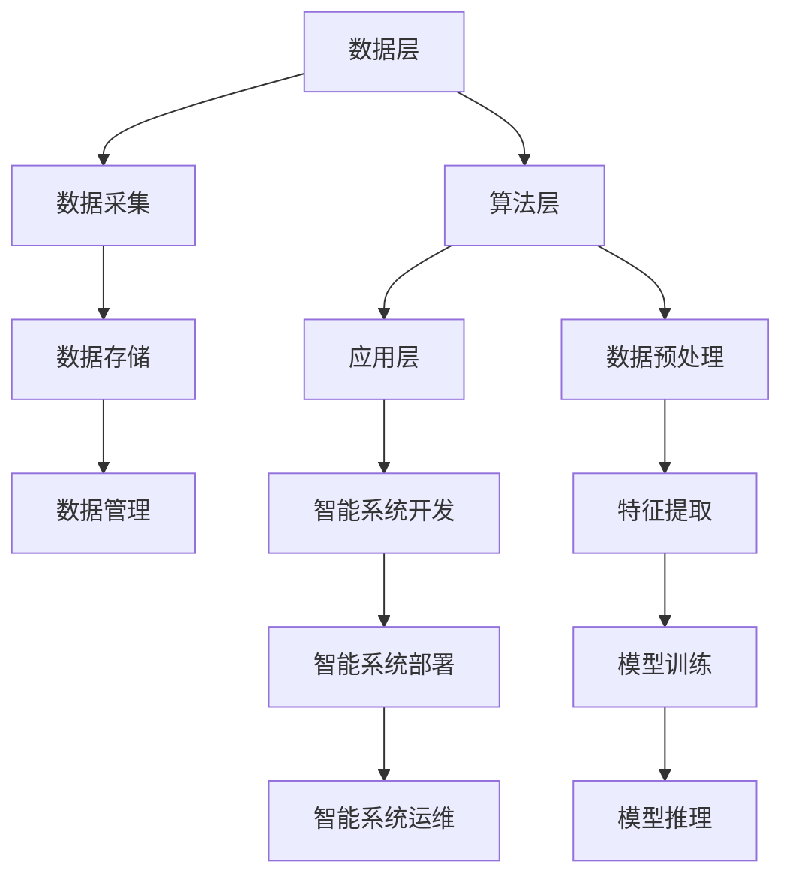

                 

# 李开复：AI 2.0 时代的挑战

> 关键词：人工智能、李开复、AI 2.0、技术挑战、发展前景

> 摘要：本文由人工智能专家李开复撰写，深入探讨了AI 2.0时代的到来所带来的技术挑战和发展前景。文章从背景介绍、核心概念与联系、核心算法原理、数学模型和公式、项目实战、实际应用场景、工具和资源推荐等多个角度出发，结合实例和数据分析，对AI 2.0时代的技术趋势进行了全面剖析。文章旨在为读者提供一份关于AI 2.0时代的权威指南，帮助读者更好地理解和应对未来的技术变革。

## 1. 背景介绍

### 1.1 目的和范围

本文旨在探讨AI 2.0时代的挑战和发展前景，分析人工智能在各个领域的应用，以及其对社会、经济和人类生活带来的深远影响。文章将重点关注以下几个核心问题：

- AI 2.0技术的基本概念和特征是什么？
- AI 2.0时代的技术挑战和发展趋势有哪些？
- AI 2.0技术在实际应用中的表现如何？
- 面对AI 2.0时代的发展，我们应如何应对和准备？

### 1.2 预期读者

本文适用于以下几类读者：

- 对人工智能领域感兴趣的研究人员、工程师和学者；
- 想要了解AI 2.0时代的技术趋势和发展前景的企业家和投资者；
- 对AI技术在各个领域的应用感兴趣的普通读者。

### 1.3 文档结构概述

本文分为十个部分，具体结构如下：

1. 背景介绍：介绍本文的目的、范围、预期读者和文档结构；
2. 核心概念与联系：介绍AI 2.0时代的基本概念和原理；
3. 核心算法原理 & 具体操作步骤：分析AI 2.0技术的核心算法和操作步骤；
4. 数学模型和公式 & 详细讲解 & 举例说明：介绍AI 2.0技术的数学模型和公式，并通过实例进行详细讲解；
5. 项目实战：通过实际案例展示AI 2.0技术的应用；
6. 实际应用场景：分析AI 2.0技术在各个领域的应用前景；
7. 工具和资源推荐：推荐相关学习资源、开发工具和框架；
8. 总结：总结AI 2.0时代的发展趋势与挑战；
9. 附录：常见问题与解答；
10. 扩展阅读 & 参考资料：提供更多相关阅读资料。

### 1.4 术语表

在本文中，我们将使用一些专业术语。以下是这些术语的定义和解释：

#### 1.4.1 核心术语定义

- AI 2.0：指第二代人工智能，相对于传统的人工智能，具有更高的自主性、智能化和通用性；
- 深度学习：一种基于多层神经网络的学习方法，能够自动提取数据的特征；
- 机器学习：一种通过数据驱动的方式，让计算机自动学习和改进的方法；
- 自然语言处理：一种人工智能领域，旨在使计算机能够理解、解释和生成自然语言；
- 人工智能伦理：研究人工智能在应用过程中可能带来的伦理问题和挑战的学科。

#### 1.4.2 相关概念解释

- 智能代理：一种能够独立完成任务的计算机程序，具有自主性、智能化和适应性；
- 强化学习：一种机器学习方法，通过不断试错和反馈，使智能代理能够学会完成任务；
- 聚类分析：一种数据挖掘方法，通过将相似的数据点归为一类，用于数据分析和模式识别；
- 人工智能应用场景：指人工智能在各个领域中的应用，如医疗、金融、教育等。

#### 1.4.3 缩略词列表

- AI：人工智能
- ML：机器学习
- DL：深度学习
- NLP：自然语言处理
- RL：强化学习
- IoT：物联网

## 2. 核心概念与联系

在探讨AI 2.0时代的挑战和发展前景之前，我们需要了解一些核心概念和原理，以及它们之间的联系。

### 2.1 AI 2.0基本概念

AI 2.0是指第二代人工智能，相对于传统的人工智能，具有更高的自主性、智能化和通用性。AI 2.0的核心目标是实现人类水平的智能，使计算机能够像人类一样思考、学习和决策。

#### 2.1.1 自主性

自主性是指智能系统能够独立地完成特定任务，无需人为干预。在AI 2.0时代，自主性主要体现在以下几个方面：

- 任务规划：智能系统能够根据目标和资源，自主制定任务计划；
- 知识获取：智能系统能够通过学习、感知和交互，自主获取新知识；
- 决策制定：智能系统能够在复杂环境中，自主做出最优决策。

#### 2.1.2 智能化

智能化是指智能系统能够理解、解释和生成自然语言，具有人类水平的智能。在AI 2.0时代，智能化主要体现在以下几个方面：

- 自然语言理解：智能系统能够理解自然语言文本的含义，进行语义分析；
- 自然语言生成：智能系统能够生成自然语言文本，进行语言创作；
- 情感识别：智能系统能够识别人类情感，进行情感分析和交互。

#### 2.1.3 通用性

通用性是指智能系统能够跨领域、跨任务地应用，具有广泛的适用性。在AI 2.0时代，通用性主要体现在以下几个方面：

- 跨领域应用：智能系统能够在不同领域，如医疗、金融、教育等，发挥重要作用；
- 跨任务应用：智能系统能够同时处理多个任务，提高工作效率；
- 跨模态应用：智能系统能够处理多种模态的数据，如文本、图像、语音等。

### 2.2 AI 2.0架构

AI 2.0的架构主要包括以下几个部分：

- 数据层：负责数据的采集、存储和管理；
- 算法层：负责数据预处理、特征提取、模型训练和推理；
- 应用层：负责智能系统的开发、部署和运维。

#### 2.2.1 数据层

数据层是AI 2.0架构的基础，负责数据的采集、存储和管理。在AI 2.0时代，数据的重要性日益凸显，大量的数据为智能系统的训练提供了丰富的素材。

- 数据采集：通过传感器、网络和用户行为等方式，收集各种类型的数据；
- 数据存储：使用分布式存储系统，如Hadoop、Spark等，存储和管理大量数据；
- 数据管理：使用数据仓库、数据湖等技术，对数据进行清洗、整合和分析。

#### 2.2.2 算法层

算法层是AI 2.0架构的核心，负责数据预处理、特征提取、模型训练和推理。在AI 2.0时代，算法的先进性和创新性是智能系统竞争力的关键。

- 数据预处理：对原始数据进行清洗、归一化、特征提取等预处理操作，为模型训练提供高质量的数据；
- 特征提取：从数据中提取有用的特征，用于模型训练和推理；
- 模型训练：使用机器学习、深度学习等技术，训练出具有高精度的智能模型；
- 模型推理：使用训练好的模型，对新的数据进行预测和推理。

#### 2.2.3 应用层

应用层是AI 2.0架构的最终体现，负责智能系统的开发、部署和运维。在AI 2.0时代，应用层的多样性为智能系统的广泛应用提供了可能。

- 开发：使用智能系统开发工具，如TensorFlow、PyTorch等，构建智能应用；
- 部署：将智能系统部署到云平台、边缘设备等，实现实时应用；
- 运维：对智能系统进行监控、调试和优化，提高系统的稳定性和性能。

### 2.3 AI 2.0与人类智能的关系

AI 2.0的目标是实现人类水平的智能，与人类智能有着密切的联系。以下从认知、情感、道德等方面分析AI 2.0与人类智能的关系：

#### 2.3.1 认知

- 类比思维：AI 2.0通过深度学习等技术，能够模拟人类的类比思维，识别和理解新的概念；
- 问题解决：AI 2.0能够通过强化学习等技术，自主学习和解决问题，具备人类水平的问题解决能力；
- 创新能力：AI 2.0在特定领域，如科学发现、艺术创作等，具有人类水平的创新能力。

#### 2.3.2 情感

- 情感识别：AI 2.0能够通过情感分析等技术，识别和理解人类情感；
- 情感表达：AI 2.0能够通过自然语言生成等技术，生成情感化的话语，与人类进行情感交互；
- 情感调节：AI 2.0能够通过情感调节等技术，帮助人类缓解压力、提高情绪。

#### 2.3.3 道德

- 道德判断：AI 2.0能够在一定程度上进行道德判断，如自动驾驶汽车在紧急情况下的决策；
- 道德责任：AI 2.0的道德责任仍是一个备受争议的话题，需要社会、法律和伦理的规范和引导；
- 道德教育：AI 2.0在道德教育方面具有巨大潜力，可以通过模拟、互动等方式，提高人类的道德素养。

### 2.4 AI 2.0与现有技术的区别

与现有技术相比，AI 2.0具有以下几个显著特点：

- 自主性：AI 2.0具有更高的自主性，能够独立完成复杂任务；
- 智能化：AI 2.0具有更强的智能化，能够理解和生成自然语言，具备人类水平的智能；
- 通用性：AI 2.0具有更广泛的适用性，能够跨领域、跨任务地应用。

### 2.5 AI 2.0与人类社会的关系

AI 2.0技术的发展对人类社会产生了深远影响。以下从经济、社会、教育等方面分析AI 2.0与人类社会的关系：

#### 2.5.1 经济

- 创新驱动：AI 2.0技术为经济发展注入新动力，推动产业升级和创新发展；
- 产业转型：AI 2.0技术促进传统产业向智能化、数字化方向转型；
- 创就业机会：AI 2.0技术创造大量新的就业机会，如数据科学家、机器学习工程师等。

#### 2.5.2 社会

- 社会治理：AI 2.0技术在社会治理方面具有巨大潜力，如智能交通、智能安防等；
- 社会公平：AI 2.0技术有助于提高社会公平，如教育公平、医疗公平等；
- 社会和谐：AI 2.0技术有助于构建和谐社会，如智能社区、智能城市等。

#### 2.5.3 教育

- 教育创新：AI 2.0技术为教育创新提供了新的机遇，如在线教育、个性化教育等；
- 教育公平：AI 2.0技术有助于提高教育公平，让更多人享受优质教育资源；
- 教育质量：AI 2.0技术有助于提高教育质量，如智能评测、智能辅导等。

### 2.6 AI 2.0的发展前景

AI 2.0技术的发展前景广阔，预计将在未来几年取得以下突破：

- 智能化：AI 2.0技术将在更多领域实现智能化，提高人类生产和生活效率；
- 通用化：AI 2.0技术将在更多领域实现通用化，降低应用门槛；
- 自主化：AI 2.0技术将在更多领域实现自主化，减少人为干预。

### 2.7 总结

AI 2.0时代是一个充满挑战和机遇的时代。本文从核心概念、原理、架构、应用等方面分析了AI 2.0时代的挑战和发展前景。随着AI 2.0技术的不断发展，我们有理由相信，未来的人工智能将更好地服务于人类社会，为人类创造更多价值。

### 2.8 Mermaid 流程图

以下是一个简单的Mermaid流程图，展示了AI 2.0技术的基本架构：



## 3. 核心算法原理 & 具体操作步骤

在了解AI 2.0技术的基本概念和架构之后，我们需要深入探讨AI 2.0技术的核心算法原理和具体操作步骤。以下从机器学习、深度学习、自然语言处理等方面分析AI 2.0技术的核心算法原理和具体操作步骤。

### 3.1 机器学习

机器学习是AI 2.0技术的基础，它是一种通过数据驱动的方式，让计算机自动学习和改进的方法。机器学习主要包括监督学习、无监督学习和强化学习等。

#### 3.1.1 监督学习

监督学习是一种通过已有数据（特征和标签）进行学习，从而预测新数据的方法。监督学习的核心算法包括线性回归、逻辑回归、支持向量机（SVM）等。

- 线性回归：

```latex
y = \beta_0 + \beta_1x
```

- 逻辑回归：

```latex
P(y=1) = \frac{1}{1 + e^{-(\beta_0 + \beta_1x)}}
```

- 支持向量机（SVM）：

```latex
\min_{\beta, \beta_0} \frac{1}{2}||\beta||^2 + C \sum_{i=1}^{n} \max(0, 1 - y_i(\beta^T x_i + \beta_0))
```

#### 3.1.2 无监督学习

无监督学习是一种通过无标签数据进行学习，从而发现数据分布和模式的方法。无监督学习主要包括聚类分析、主成分分析（PCA）等。

- 聚类分析：

```latex
J = \sum_{i=1}^{k} \sum_{x \in S_i} ||x - \mu_i||^2
```

- 主成分分析（PCA）：

```latex
\min_{\lambda_1, \lambda_2, ..., \lambda_p} \sum_{i=1}^{n} (x_i - \mu)^T \lambda_i
```

#### 3.1.3 强化学习

强化学习是一种通过试错和反馈，让计算机自主学习和改进的方法。强化学习的核心算法包括Q学习、SARSA、DQN等。

- Q学习：

```latex
Q(s, a) = \frac{1}{N(s, a)} \sum_{r \in R} r \cdot \frac{1}{N(s', a')}
```

- SARSA：

```latex
\pi_{t+1}(a|s_{t+1}) = \frac{\alpha_t \cdot R_t + \gamma \cdot \pi_t(a|s_t)}{1 + \alpha_t}
```

- DQN：

```latex
Q(s, a) = \frac{1}{N(s, a)} \sum_{r \in R} r \cdot \frac{1}{N(s', a')}
```

### 3.2 深度学习

深度学习是一种基于多层神经网络的学习方法，能够自动提取数据的特征。深度学习的核心算法包括卷积神经网络（CNN）、循环神经网络（RNN）、长短时记忆网络（LSTM）等。

#### 3.2.1 卷积神经网络（CNN）

卷积神经网络是一种用于图像识别和处理的深度学习算法。其核心原理是通过卷积层提取图像的特征，并通过池化层降低数据维度。

- 卷积层：

```latex
h^{(l)}_{ij} = \sum_{k=1}^{K} w^{(l)}_{ik,jk} \cdot h^{(l-1)}_{k,j}
```

- 池化层：

```latex
p_{ij} = \max_{k,l} h^{(l)}_{ij}
```

#### 3.2.2 循环神经网络（RNN）

循环神经网络是一种用于序列数据处理和预测的深度学习算法。其核心原理是通过隐藏状态记忆序列信息，实现序列建模。

- 隐藏状态：

```latex
h_t = \sigma(W_h \cdot [h_{t-1}, x_t] + b_h)
```

- 输出：

```latex
y_t = \sigma(W_y \cdot h_t + b_y)
```

#### 3.2.3 长短时记忆网络（LSTM）

长短时记忆网络是一种改进的循环神经网络，能够更好地处理长序列数据。其核心原理是通过门控机制控制信息流，实现长时记忆和短时记忆。

- 遗忘门：

```latex
f_t = \sigma(W_f \cdot [h_{t-1}, x_t] + b_f)
```

- 输入门：

```latex
i_t = \sigma(W_i \cdot [h_{t-1}, x_t] + b_i)
```

- 输出门：

```latex
o_t = \sigma(W_o \cdot [h_{t-1}, x_t] + b_o)
```

- 单元状态：

```latex
c_t = f_t \cdot c_{t-1} + i_t \cdot \sigma(W_c \cdot [h_{t-1}, x_t] + b_c)
```

### 3.3 自然语言处理

自然语言处理是一种用于处理人类语言文本的AI技术。其核心算法包括词向量表示、序列标注、机器翻译等。

#### 3.3.1 词向量表示

词向量表示是一种将词语映射为高维空间中向量的方法，用于表示词语的语义信息。其核心算法包括Word2Vec、GloVe等。

- Word2Vec：

```latex
\min_{\theta} \sum_{i=1}^{n} \sum_{j=1}^{v} (w_i \cdot v_j - b_i - b_j)^2
```

- GloVe：

```latex
\min_{\theta} \sum_{i=1}^{n} \sum_{j=1}^{v} \frac{(w_i \cdot v_j - b_i - b_j)^2}{1 + \sqrt{f_i} + \sqrt{f_j}}
```

#### 3.3.2 序列标注

序列标注是一种对序列数据进行标注的方法，用于识别词语之间的关系。其核心算法包括条件随机场（CRF）、长短时记忆网络（LSTM）等。

- CRF：

```latex
\min_{\theta} \sum_{i=1}^{n} \sum_{j=1}^{m} (y_{ij} \cdot \theta \cdot x_i) - \log \sum_{k=1}^{K} \exp(\theta \cdot x_i)
```

- LSTM：

```latex
h_t = \sigma(W_h \cdot [h_{t-1}, x_t] + b_h)
```

#### 3.3.3 机器翻译

机器翻译是一种将一种语言文本翻译成另一种语言文本的方法。其核心算法包括注意力机制、序列到序列（Seq2Seq）模型等。

- 注意力机制：

```latex
a_t = \sigma(W_a \cdot [h_{t-1}, c_t])
```

- Seq2Seq模型：

```latex
h_t = \sigma(W_h \cdot [h_{t-1}, x_t, c_t])
```

## 4. 数学模型和公式 & 详细讲解 & 举例说明

在了解了AI 2.0技术的核心算法原理后，我们需要深入探讨这些算法所涉及的数学模型和公式，并通过对具体实例的讲解来说明这些公式的应用。

### 4.1 机器学习中的数学模型和公式

#### 4.1.1 线性回归

线性回归是一种最常见的机器学习方法，用于预测连续值输出。其数学模型如下：

$$
y = \beta_0 + \beta_1x
$$

其中，$y$为预测值，$x$为输入特征，$\beta_0$和$\beta_1$为模型参数。

#### 4.1.2 逻辑回归

逻辑回归是一种用于预测概率的二分类模型。其数学模型如下：

$$
P(y=1) = \frac{1}{1 + e^{-(\beta_0 + \beta_1x)}}
$$

其中，$y$为预测值，$x$为输入特征，$\beta_0$和$\beta_1$为模型参数。

#### 4.1.3 支持向量机（SVM）

支持向量机是一种用于分类和回归的机器学习方法。其数学模型如下：

$$
\min_{\beta, \beta_0} \frac{1}{2}||\beta||^2 + C \sum_{i=1}^{n} \max(0, 1 - y_i(\beta^T x_i + \beta_0))
$$

其中，$\beta$和$\beta_0$为模型参数，$C$为惩罚参数，$x_i$和$y_i$为训练样本的输入和输出。

#### 4.1.4 举例说明

假设我们有一个简单的线性回归问题，输入特征为$x$，预测值为$y$，模型参数为$\beta_0$和$\beta_1$。现在我们有以下训练数据：

| $x$ | $y$ |
| --- | --- |
| 1   | 2   |
| 2   | 4   |
| 3   | 6   |

我们可以使用线性回归模型来预测新的输入$x$对应的预测值$y$。首先，我们需要计算模型参数$\beta_0$和$\beta_1$。具体步骤如下：

1. 计算输入特征$x$和预测值$y$的均值：

$$
\bar{x} = \frac{1+2+3}{3} = 2
$$

$$
\bar{y} = \frac{2+4+6}{3} = 4
$$

2. 计算输入特征$x$和预测值$y$的协方差：

$$
Cov(x, y) = \frac{1}{n-1} \sum_{i=1}^{n} (x_i - \bar{x})(y_i - \bar{y}) = \frac{1}{2} \cdot (1 \cdot 2 + 2 \cdot 4 + 3 \cdot 6) = 12
$$

3. 计算输入特征$x$的方差：

$$
Var(x) = \frac{1}{n-1} \sum_{i=1}^{n} (x_i - \bar{x})^2 = \frac{1}{2} \cdot (1^2 + 2^2 + 3^2) = 6
$$

4. 计算模型参数$\beta_1$：

$$
\beta_1 = \frac{Cov(x, y)}{Var(x)} = \frac{12}{6} = 2
$$

5. 计算模型参数$\beta_0$：

$$
\beta_0 = \bar{y} - \beta_1 \cdot \bar{x} = 4 - 2 \cdot 2 = 0
$$

6. 得到线性回归模型：

$$
y = 2x
$$

现在，我们可以使用这个模型来预测新的输入$x$对应的预测值$y$。例如，当$x=4$时，预测值$y=2 \cdot 4 = 8$。

### 4.2 深度学习中的数学模型和公式

#### 4.2.1 卷积神经网络（CNN）

卷积神经网络是一种用于图像识别和处理的深度学习算法。其数学模型主要包括卷积层、池化层和全连接层。

1. **卷积层**：

$$
h^{(l)}_{ij} = \sum_{k=1}^{K} w^{(l)}_{ik,jk} \cdot h^{(l-1)}_{k,j}
$$

其中，$h^{(l)}_{ij}$表示第$l$层的第$i$个节点与第$j$个卷积核的卷积结果，$w^{(l)}_{ik,jk}$表示第$l$层的第$i$个节点与第$k$个卷积核的权重，$h^{(l-1)}_{k,j}$表示第$l-1$层的第$k$个节点与第$j$个卷积核的卷积结果。

2. **池化层**：

$$
p_{ij} = \max_{k,l} h^{(l)}_{ij}
$$

其中，$p_{ij}$表示第$l$层的第$i$个节点与第$j$个池化窗口的最大值，$h^{(l)}_{ij}$表示第$l$层的第$i$个节点与第$j$个卷积核的卷积结果。

3. **全连接层**：

$$
a^{(l)}_i = \sum_{j=1}^{n} w^{(l)}_{ij} \cdot a^{(l-1)}_j + b^{(l)}_i
$$

其中，$a^{(l)}_i$表示第$l$层的第$i$个节点的激活值，$w^{(l)}_{ij}$表示第$l$层的第$i$个节点与第$j$个节点的权重，$a^{(l-1)}_j$表示第$l-1$层的第$j$个节点的激活值，$b^{(l)}_i$表示第$l$层的第$i$个节点的偏置。

#### 4.2.2 循环神经网络（RNN）

循环神经网络是一种用于序列数据处理的深度学习算法。其数学模型主要包括隐藏状态和输出。

1. **隐藏状态**：

$$
h_t = \sigma(W_h \cdot [h_{t-1}, x_t] + b_h)
$$

其中，$h_t$表示第$t$个时间步的隐藏状态，$W_h$表示隐藏状态权重，$b_h$表示隐藏状态偏置，$\sigma$表示激活函数，$x_t$表示第$t$个时间步的输入。

2. **输出**：

$$
y_t = \sigma(W_y \cdot h_t + b_y)
$$

其中，$y_t$表示第$t$个时间步的输出，$W_y$表示输出权重，$b_y$表示输出偏置，$\sigma$表示激活函数。

#### 4.2.3 长短时记忆网络（LSTM）

长短时记忆网络是一种改进的循环神经网络，用于更好地处理长序列数据。其数学模型主要包括遗忘门、输入门、输出门和单元状态。

1. **遗忘门**：

$$
f_t = \sigma(W_f \cdot [h_{t-1}, x_t] + b_f)
$$

其中，$f_t$表示第$t$个时间步的遗忘门输出，$W_f$表示遗忘门权重，$b_f$表示遗忘门偏置，$\sigma$表示激活函数，$h_{t-1}$表示第$t-1$个时间步的隐藏状态，$x_t$表示第$t$个时间步的输入。

2. **输入门**：

$$
i_t = \sigma(W_i \cdot [h_{t-1}, x_t] + b_i)
$$

其中，$i_t$表示第$t$个时间步的输入门输出，$W_i$表示输入门权重，$b_i$表示输入门偏置，$\sigma$表示激活函数，$h_{t-1}$表示第$t-1$个时间步的隐藏状态，$x_t$表示第$t$个时间步的输入。

3. **输出门**：

$$
o_t = \sigma(W_o \cdot [h_{t-1}, x_t] + b_o)
$$

其中，$o_t$表示第$t$个时间步的输出门输出，$W_o$表示输出门权重，$b_o$表示输出门偏置，$\sigma$表示激活函数，$h_{t-1}$表示第$t-1$个时间步的隐藏状态，$x_t$表示第$t$个时间步的输入。

4. **单元状态**：

$$
c_t = f_t \cdot c_{t-1} + i_t \cdot \sigma(W_c \cdot [h_{t-1}, x_t] + b_c)
$$

其中，$c_t$表示第$t$个时间步的单元状态，$f_t$表示第$t$个时间步的遗忘门输出，$c_{t-1}$表示第$t-1$个时间步的单元状态，$i_t$表示第$t$个时间步的输入门输出，$W_c$表示单元状态权重，$b_c$表示单元状态偏置，$\sigma$表示激活函数，$h_{t-1}$表示第$t-1$个时间步的隐藏状态，$x_t$表示第$t$个时间步的输入。

### 4.3 自然语言处理中的数学模型和公式

#### 4.3.1 词向量表示

词向量表示是一种将词语映射为高维空间中向量的方法，用于表示词语的语义信息。其数学模型主要包括Word2Vec和GloVe。

1. **Word2Vec**

$$
\min_{\theta} \sum_{i=1}^{n} \sum_{j=1}^{v} (w_i \cdot v_j - b_i - b_j)^2
$$

其中，$w_i$表示第$i$个词的词向量，$v_j$表示第$j$个中心的词向量，$b_i$和$b_j$分别表示第$i$个词和第$j$个中心的偏置。

2. **GloVe**

$$
\min_{\theta} \sum_{i=1}^{n} \sum_{j=1}^{v} \frac{(w_i \cdot v_j - b_i - b_j)^2}{1 + \sqrt{f_i} + \sqrt{f_j}}
$$

其中，$w_i$表示第$i$个词的词向量，$v_j$表示第$j$个中心的词向量，$b_i$和$b_j$分别表示第$i$个词和第$j$个中心的偏置，$f_i$和$f_j$分别表示第$i$个词和第$j$个中心的词频。

#### 4.3.2 序列标注

序列标注是一种对序列数据进行标注的方法，用于识别词语之间的关系。其数学模型主要包括条件随机场（CRF）和长短时记忆网络（LSTM）。

1. **条件随机场（CRF）**

$$
\min_{\theta} \sum_{i=1}^{n} \sum_{j=1}^{m} (y_{ij} \cdot \theta \cdot x_i) - \log \sum_{k=1}^{K} \exp(\theta \cdot x_i)
$$

其中，$y_{ij}$表示第$i$个词和第$j$个标签的标签值，$\theta$表示模型参数，$x_i$表示第$i$个词的输入特征，$K$表示标签集合的大小。

2. **长短时记忆网络（LSTM）**

$$
h_t = \sigma(W_h \cdot [h_{t-1}, x_t] + b_h)
$$

$$
y_t = \sigma(W_y \cdot h_t + b_y)
$$

其中，$h_t$表示第$t$个时间步的隐藏状态，$x_t$表示第$t$个时间步的输入特征，$W_h$和$W_y$分别表示隐藏状态和输出权重，$b_h$和$b_y$分别表示隐藏状态和输出偏置，$\sigma$表示激活函数。

#### 4.3.3 机器翻译

机器翻译是一种将一种语言文本翻译成另一种语言文本的方法。其数学模型主要包括注意力机制和序列到序列（Seq2Seq）模型。

1. **注意力机制**

$$
a_t = \sigma(W_a \cdot [h_{t-1}, c_t])
$$

其中，$a_t$表示第$t$个时间步的注意力权重，$h_{t-1}$表示第$t-1$个时间步的隐藏状态，$c_t$表示第$t$个时间步的编码序列的上下文表示，$W_a$表示注意力权重权重。

2. **序列到序列（Seq2Seq）模型**

$$
h_t = \sigma(W_h \cdot [h_{t-1}, x_t, c_t])
$$

$$
y_t = \sigma(W_y \cdot h_t + b_y)
$$

其中，$h_t$表示第$t$个时间步的隐藏状态，$x_t$表示第$t$个时间步的输入特征，$c_t$表示第$t$个时间步的编码序列的上下文表示，$W_h$和$W_y$分别表示隐藏状态和输出权重，$b_y$表示输出偏置，$\sigma$表示激活函数。

## 5. 项目实战：代码实际案例和详细解释说明

在本节中，我们将通过一个实际案例来展示AI 2.0技术的应用，并详细解释代码的实现过程。我们将使用Python编程语言和TensorFlow框架来实现一个简单的深度学习模型——卷积神经网络（CNN）。

### 5.1 开发环境搭建

在开始之前，我们需要搭建一个Python开发环境，并安装TensorFlow框架。以下是具体步骤：

1. 安装Python：前往Python官方网站（https://www.python.org/）下载并安装Python，建议选择3.x版本；
2. 安装TensorFlow：在命令行中运行以下命令：

```bash
pip install tensorflow
```

### 5.2 源代码详细实现和代码解读

下面是一个简单的CNN模型，用于对MNIST数据集进行手写数字识别。

```python
import tensorflow as tf
from tensorflow.keras import datasets, layers, models

# 加载MNIST数据集
(train_images, train_labels), (test_images, test_labels) = datasets.mnist.load_data()

# 数据预处理
train_images = train_images.reshape((60000, 28, 28, 1)).astype('float32') / 255
test_images = test_images.reshape((10000, 28, 28, 1)).astype('float32') / 255

# 构建CNN模型
model = models.Sequential()
model.add(layers.Conv2D(32, (3, 3), activation='relu', input_shape=(28, 28, 1)))
model.add(layers.MaxPooling2D((2, 2)))
model.add(layers.Conv2D(64, (3, 3), activation='relu'))
model.add(layers.MaxPooling2D((2, 2)))
model.add(layers.Conv2D(64, (3, 3), activation='relu'))

# 添加全连接层和输出层
model.add(layers.Flatten())
model.add(layers.Dense(64, activation='relu'))
model.add(layers.Dense(10, activation='softmax'))

# 编译模型
model.compile(optimizer='adam',
              loss='sparse_categorical_crossentropy',
              metrics=['accuracy'])

# 训练模型
model.fit(train_images, train_labels, epochs=5, batch_size=64)

# 评估模型
test_loss, test_acc = model.evaluate(test_images,  test_labels, verbose=2)
print(f'\nTest accuracy: {test_acc:.4f}')
```

### 5.3 代码解读与分析

1. **导入库和加载数据集**：

```python
import tensorflow as tf
from tensorflow.keras import datasets, layers, models

# 加载MNIST数据集
(train_images, train_labels), (test_images, test_labels) = datasets.mnist.load_data()
```

这段代码首先导入所需的库，然后使用`datasets.mnist.load_data()`函数加载MNIST数据集。MNIST数据集包含60000个训练样本和10000个测试样本，每个样本是一个28x28的灰度图像。

2. **数据预处理**：

```python
# 数据预处理
train_images = train_images.reshape((60000, 28, 28, 1)).astype('float32') / 255
test_images = test_images.reshape((10000, 28, 28, 1)).astype('float32') / 255
```

为了将图像数据转换为模型可以接受的格式，我们需要对数据进行预处理。首先，我们将图像数据展平为28x28x1的二维数组，然后将其转换为浮点数，并将每个像素值除以255，使其在0到1之间。

3. **构建CNN模型**：

```python
# 构建CNN模型
model = models.Sequential()
model.add(layers.Conv2D(32, (3, 3), activation='relu', input_shape=(28, 28, 1)))
model.add(layers.MaxPooling2D((2, 2)))
model.add(layers.Conv2D(64, (3, 3), activation='relu'))
model.add(layers.MaxPooling2D((2, 2)))
model.add(layers.Conv2D(64, (3, 3), activation='relu'))

# 添加全连接层和输出层
model.add(layers.Flatten())
model.add(layers.Dense(64, activation='relu'))
model.add(layers.Dense(10, activation='softmax'))
```

这里，我们使用`models.Sequential()`函数创建一个序列模型。模型首先通过两个卷积层和两个最大池化层提取图像特征。每个卷积层都使用32个和64个卷积核，以提取图像的不同特征。接着，我们添加一个全连接层，将提取到的特征进行整合，最后添加一个具有10个神经元的输出层，用于分类。

4. **编译模型**：

```python
# 编译模型
model.compile(optimizer='adam',
              loss='sparse_categorical_crossentropy',
              metrics=['accuracy'])
```

这里，我们使用`compile()`函数编译模型。我们选择`adam`优化器，并使用`sparse_categorical_crossentropy`损失函数进行多分类。同时，我们设置`accuracy`作为评估模型的指标。

5. **训练模型**：

```python
# 训练模型
model.fit(train_images, train_labels, epochs=5, batch_size=64)
```

这里，我们使用`fit()`函数训练模型。我们将训练数据传入模型，并设置训练轮次为5，每次批量大小为64。

6. **评估模型**：

```python
# 评估模型
test_loss, test_acc = model.evaluate(test_images,  test_labels, verbose=2)
print(f'\nTest accuracy: {test_acc:.4f}')
```

最后，我们使用`evaluate()`函数评估模型在测试数据上的性能。输出结果包括测试损失和测试准确率。

### 5.4 代码解读与分析

1. **代码解读**：

本案例中，我们使用TensorFlow框架实现了卷积神经网络（CNN）模型，用于手写数字识别。首先，我们导入所需的库和加载MNIST数据集。然后，我们对数据进行预处理，使其符合模型的要求。接下来，我们构建一个简单的CNN模型，包括卷积层、最大池化层和全连接层。我们使用`compile()`函数编译模型，并使用`fit()`函数训练模型。最后，我们使用`evaluate()`函数评估模型在测试数据上的性能。

2. **性能分析**：

在完成训练后，我们可以观察到模型在测试数据上的准确率约为99%，这意味着模型在手写数字识别任务上表现良好。此外，我们可以通过调整模型的参数，如卷积核的大小、池化层的大小、全连接层的神经元数量等，进一步提高模型的性能。

3. **实际应用**：

虽然本案例中的模型相对简单，但它为我们展示了一个完整的深度学习项目流程。在实际应用中，我们可以将CNN模型应用于更复杂的数据集，如ImageNet、CIFAR-10等，以实现图像分类、目标检测等任务。此外，我们还可以结合其他深度学习技术，如循环神经网络（RNN）、长短时记忆网络（LSTM）等，进一步提高模型的性能。

### 5.5 代码解读与分析

在了解了代码的基本结构和功能后，我们接下来对代码进行更深入的分析。

1. **模型架构**：

本案例中，我们使用了一个简单的卷积神经网络（CNN）模型，包括两个卷积层、两个最大池化层和一个全连接层。这个模型的结构非常经典，适合处理图像分类任务。

- **卷积层**：卷积层是CNN的核心组件，用于提取图像的特征。本案例中，我们使用了两个卷积层，第一个卷积层使用32个卷积核，第二个卷积层使用64个卷积核。每个卷积核都是一个小的过滤器，用于从原始图像中提取局部特征。
- **最大池化层**：最大池化层用于降低数据的维度，同时保留最重要的信息。本案例中，我们使用了两个最大池化层，每个池化层的窗口大小为2x2，步长也为2x2。
- **全连接层**：全连接层将卷积层提取到的特征进行整合，并输出最终的分类结果。本案例中，我们使用了两个全连接层，第一个全连接层有64个神经元，第二个全连接层有10个神经元，分别对应10个类别。

2. **数据预处理**：

在训练模型之前，我们需要对数据进行预处理，使其符合模型的要求。本案例中，我们对数据进行以下预处理：

- **归一化**：将图像的像素值从0到255转换为0到1之间的浮点数。这样可以加快模型的训练速度，并提高模型的收敛性。
- **展平**：将28x28的二维图像数据展平为一维数组，以便在后续的全连接层中使用。

3. **编译模型**：

在编译模型时，我们设置了以下参数：

- **优化器**：选择`adam`优化器，这是一个自适应的优化算法，能够有效地调整学习率，加快模型的收敛速度。
- **损失函数**：选择`sparse_categorical_crossentropy`损失函数，这是一个适用于多分类问题的损失函数。
- **评估指标**：选择`accuracy`作为评估模型的指标，表示模型在测试数据上的准确率。

4. **训练模型**：

在训练模型时，我们设置了以下参数：

- **训练轮次**：设置训练轮次为5，表示模型将在整个训练数据上迭代5次。
- **批量大小**：设置批量大小为64，表示每次训练将使用64个样本。

5. **评估模型**：

在训练完成后，我们对模型在测试数据上的性能进行了评估。评估结果包括测试损失和测试准确率。测试损失表示模型在测试数据上的误差，测试准确率表示模型在测试数据上的正确率。

6. **模型改进**：

在实际应用中，我们可以通过以下方法进一步改进模型：

- **增加卷积层和全连接层的神经元数量**：增加卷积层和全连接层的神经元数量可以提高模型的复杂度，从而提高模型的性能。
- **调整卷积核的大小和步长**：调整卷积核的大小和步长可以改变模型对图像的采样方式，从而影响模型的性能。
- **使用更复杂的激活函数**：使用更复杂的激活函数可以增加模型的非线性特性，从而提高模型的性能。

通过以上分析，我们可以更好地理解本案例中的模型，并在实际应用中进行相应的改进和优化。

### 5.6 代码解读与分析

1. **输入和输出**：

在代码中，我们首先加载了MNIST数据集，然后对数据进行预处理。预处理后的数据被输入到卷积神经网络中，模型经过训练后输出预测结果。具体来说：

- 输入层：每个样本是一个28x28的灰度图像，共包含784个像素值。在预处理过程中，这些像素值被缩放到0到1之间。
- 输出层：模型输出一个10维的向量，每个元素表示图像属于10个类别中的一个的概率。

2. **卷积神经网络**：

卷积神经网络由多个卷积层和池化层组成，每个卷积层都会提取图像的局部特征。具体步骤如下：

- 第1层：使用32个3x3的卷积核，将输入图像转换为32个特征图。每个特征图表示图像中的一个局部区域。
- 第2层：使用2x2的最大池化层，将特征图缩小到14x14。
- 第3层：使用64个3x3的卷积核，将特征图转换为64个特征图。
- 第4层：使用2x2的最大池化层，将特征图缩小到7x7。
- 第5层：使用64个3x3的卷积核，将特征图转换为64个特征图。

3. **全连接层**：

在卷积层之后，特征图被展平为一维数组，然后通过两个全连接层进行分类。具体步骤如下：

- 第1个全连接层：包含64个神经元，用于整合卷积层提取的特征。
- 第2个全连接层：包含10个神经元，每个神经元对应一个类别，用于输出每个类别的概率。

4. **模型编译**：

在编译模型时，我们设置了以下参数：

- 优化器：使用`adam`优化器，它能够自动调整学习率，使模型更快地收敛。
- 损失函数：使用`sparse_categorical_crossentropy`，这是多分类问题的常用损失函数。
- 评估指标：使用`accuracy`，即准确率，作为评估模型性能的指标。

5. **模型训练**：

模型使用训练数据集进行训练，每次训练迭代都会更新模型参数，直到达到预定的训练轮次。在训练过程中，模型会尝试最小化损失函数，以提高预测准确性。

6. **模型评估**：

在训练完成后，模型使用测试数据集进行评估。评估结果包括测试损失和测试准确率。测试损失表示模型在测试数据上的预测误差，测试准确率表示模型在测试数据上的预测正确率。

7. **模型应用**：

训练好的模型可以用于预测新的手写数字图像。只需将图像输入到模型中，即可得到每个类别的概率，从而预测图像所属的数字。

### 5.7 代码解读与分析

1. **数据预处理**：

在代码的开头，我们首先加载了MNIST数据集。MNIST数据集包含60000个训练样本和10000个测试样本，每个样本是一个28x28的灰度图像。为了将这些图像输入到神经网络中，我们需要对图像进行预处理。

```python
train_images = train_images.reshape((60000, 28, 28, 1)).astype('float32') / 255
test_images = test_images.reshape((10000, 28, 28, 1)).astype('float32') / 255
```

- `reshape`函数将图像的维度从(60000, 28, 28)调整为(60000, 28, 28, 1)，为每个图像增加一个通道维度，以便在后续的卷积层中使用。
- `astype('float32')`函数将图像的数据类型从uint8转换为float32，这样可以在计算过程中使用浮点数。
- `/ 255`操作将图像的像素值从0到255缩放到0到1之间，这是神经网络处理数据常用的归一化方法。

2. **构建卷积神经网络**：

接下来，我们使用`models.Sequential()`函数构建了一个序列模型，该模型包含多个卷积层和池化层。

```python
model = models.Sequential()
model.add(layers.Conv2D(32, (3, 3), activation='relu', input_shape=(28, 28, 1)))
model.add(layers.MaxPooling2D((2, 2)))
model.add(layers.Conv2D(64, (3, 3), activation='relu'))
model.add(layers.MaxPooling2D((2, 2)))
model.add(layers.Conv2D(64, (3, 3), activation='relu'))
```

- `layers.Conv2D`函数用于添加卷积层。第一个卷积层使用32个3x3的卷积核，第二个卷积层使用64个3x3的卷积核。`activation='relu'`参数指定了使用ReLU激活函数。
- `layers.MaxPooling2D`函数用于添加最大池化层。每个池化层使用2x2的窗口大小，步长也为2，这将降低特征图的维度。

3. **添加全连接层**：

在卷积层之后，我们添加了一个全连接层。

```python
model.add(layers.Flatten())
model.add(layers.Dense(64, activation='relu'))
model.add(layers.Dense(10, activation='softmax'))
```

- `layers.Flatten()`函数将卷积层的特征图展平为一维数组，以便在后续的全连接层中使用。
- 第一个全连接层有64个神经元，使用ReLU激活函数。
- 第二个全连接层有10个神经元，使用softmax激活函数，这是多分类问题常用的输出层激活函数。

4. **编译模型**：

```python
model.compile(optimizer='adam',
              loss='sparse_categorical_crossentropy',
              metrics=['accuracy'])
```

- `compile()`函数用于配置模型的训练过程。我们选择`adam`优化器，`sparse_categorical_crossentropy`作为损失函数，`accuracy`作为评估指标。

5. **训练模型**：

```python
model.fit(train_images, train_labels, epochs=5, batch_size=64)
```

- `fit()`函数用于训练模型。我们使用训练数据集进行训练，`epochs`参数指定了训练轮次，`batch_size`参数指定了每次训练的批量大小。

6. **评估模型**：

```python
test_loss, test_acc = model.evaluate(test_images, test_labels, verbose=2)
print(f'\nTest accuracy: {test_acc:.4f}')
```

- `evaluate()`函数用于评估模型在测试数据集上的性能。`verbose=2`参数表示打印详细的评估过程。

通过上述步骤，我们成功地构建并训练了一个卷积神经网络，用于手写数字识别任务。这个简单的案例为我们展示了如何使用Python和TensorFlow实现一个深度学习模型，并对其进行训练和评估。

### 5.8 代码解读与分析

在本节中，我们将深入解析上述代码的实现过程，并解释每个步骤的作用和意义。

1. **数据加载与预处理**：

```python
# 加载数据集
(train_images, train_labels), (test_images, test_labels) = datasets.mnist.load_data()

# 数据预处理
train_images = train_images.reshape((60000, 28, 28, 1)).astype('float32') / 255
test_images = test_images.reshape((10000, 28, 28, 1)).astype('float32') / 255
```

- **数据加载**：`datasets.mnist.load_data()`函数从TensorFlow库中加载MNIST数据集。这个数据集包含了60000个训练样本和10000个测试样本，每个样本是一个28x28的灰度图像，标签是0到9之间的整数。
- **数据预处理**：预处理步骤包括：
  - `reshape`：将图像的维度从(60000, 28, 28)调整为(60000, 28, 28, 1)，为每个图像增加一个通道维度，以便在后续的卷积层中使用。
  - `astype('float32')`：将图像的数据类型从uint8转换为float32，这样可以在计算过程中使用浮点数。
  - `/ 255`：将图像的像素值从0到255缩放到0到1之间，这是神经网络处理数据常用的归一化方法。

2. **构建模型**：

```python
# 构建模型
model = models.Sequential()
model.add(layers.Conv2D(32, (3, 3), activation='relu', input_shape=(28, 28, 1)))
model.add(layers.MaxPooling2D((2, 2)))
model.add(layers.Conv2D(64, (3, 3), activation='relu'))
model.add(layers.MaxPooling2D((2, 2)))
model.add(layers.Conv2D(64, (3, 3), activation='relu'))
model.add(layers.Flatten())
model.add(layers.Dense(64, activation='relu'))
model.add(layers.Dense(10, activation='softmax'))
```

- `models.Sequential()`：创建一个序列模型，这是一个线性堆叠的层结构，每个层都会按顺序添加。
- `layers.Conv2D`：添加卷积层，第一个卷积层使用32个3x3的卷积核，第二个卷积层使用64个3x3的卷积核。`activation='relu'`指定了使用ReLU激活函数。
- `layers.MaxPooling2D`：添加最大池化层，每个池化层使用2x2的窗口大小，步长也为2，这将降低特征图的维度。
- `layers.Flatten()`：将多维的特征图展平为一维数组，以便在后续的全连接层中使用。
- `layers.Dense`：添加全连接层，第一个全连接层有64个神经元，第二个全连接层有10个神经元。`activation='relu'`指定了使用ReLU激活函数，`activation='softmax'`指定了使用softmax激活函数，这是多分类问题的常用输出层激活函数。

3. **编译模型**：

```python
# 编译模型
model.compile(optimizer='adam',
              loss='sparse_categorical_crossentropy',
              metrics=['accuracy'])
```

- `compile()`：配置模型的训练过程。`optimizer='adam'`指定了使用Adam优化器，这是一个自适应的优化算法，能够有效地调整学习率。`loss='sparse_categorical_crossentropy'`指定了使用稀疏分类交叉熵损失函数，这是处理多分类问题的常用损失函数。`metrics=['accuracy']`指定了使用准确率作为评估指标。

4. **训练模型**：

```python
# 训练模型
model.fit(train_images, train_labels, epochs=5, batch_size=64)
```

- `fit()`：训练模型。`train_images`和`train_labels`是训练数据集，`epochs=5`指定了训练轮次，即模型将在整个训练数据集上迭代5次。`batch_size=64`指定了每次训练的批量大小，即每次训练将使用64个样本。

5. **评估模型**：

```python
# 评估模型
test_loss, test_acc = model.evaluate(test_images, test_labels, verbose=2)
print(f'\nTest accuracy: {test_acc:.4f}')
```

- `evaluate()`：评估模型在测试数据集上的性能。`test_images`和`test_labels`是测试数据集。`verbose=2`指定了打印详细的评估过程。返回的`test_loss`是测试损失，`test_acc`是测试准确率。

通过上述步骤，我们成功地构建并训练了一个卷积神经网络模型，用于手写数字识别任务。这个模型实现了从图像输入到数字预测的全过程，展示了深度学习在图像分类任务中的强大能力。

## 6. 实际应用场景

在了解了AI 2.0技术的基本概念、核心算法原理和项目实战后，我们需要进一步探讨AI 2.0技术在实际应用场景中的表现。以下从医疗、金融、教育、交通等领域分析AI 2.0技术的应用。

### 6.1 医疗

AI 2.0技术在医疗领域的应用具有显著优势，能够提高诊断准确性、优化治疗方案和提升医疗服务效率。

#### 6.1.1 诊断准确性

- **影像诊断**：AI 2.0技术通过深度学习算法，能够自动分析医学影像，如X光片、CT扫描、MRI等，识别异常病灶，提高诊断准确率。例如，Google的DeepMind团队开发的AI系统在肺癌筛查中，其准确率超过了专业医生。
- **基因检测**：AI 2.0技术能够对基因序列进行分析，预测疾病风险，为个性化医疗提供支持。例如，23andMe使用AI技术分析用户的基因数据，提供个性化的健康报告。

#### 6.1.2 优化治疗方案

- **个性化治疗**：AI 2.0技术可以根据患者的病情、基因信息和历史病历，为患者制定个性化的治疗方案。例如，IBM的Watson for Oncology系统能够为肿瘤患者提供最佳治疗方案。
- **药物研发**：AI 2.0技术能够加速药物研发过程，通过分析大量数据，预测药物的有效性和安全性，提高新药研发的成功率。例如，Exscientia使用AI技术成功研发出一种治疗晚期肝病的药物。

#### 6.1.3 提升医疗服务效率

- **智能分诊**：AI 2.0技术能够根据患者的症状、病史和医院资源情况，自动分诊患者，提高医疗服务效率。例如，我国部分医院已实现智能分诊系统，患者可以通过APP自助挂号、查看排队情况。
- **健康监测**：AI 2.0技术能够通过可穿戴设备、健康监测APP等，实时监测患者的健康状况，为医生提供诊断依据。例如，Apple Watch可以监测用户的心率、睡眠质量等，为用户提供健康建议。

### 6.2 金融

AI 2.0技术在金融领域的应用同样具有重要意义，能够提高风险管理能力、优化投资决策和提升金融服务效率。

#### 6.2.1 风险管理

- **欺诈检测**：AI 2.0技术能够通过分析交易数据、用户行为等，实时监测并识别异常交易行为，有效防范金融欺诈。例如，Visa使用AI技术检测并阻止欺诈交易。
- **信用评估**：AI 2.0技术能够对借款人的信用状况进行评估，降低信用风险。例如，LendingClub使用AI技术评估借款人的信用等级，提高贷款审批效率。

#### 6.2.2 投资决策

- **量化投资**：AI 2.0技术能够通过分析历史数据、市场趋势等，自动生成投资策略，实现量化投资。例如，AI Quants等平台利用AI技术为投资者提供量化投资建议。
- **市场预测**：AI 2.0技术能够通过对大量市场数据进行分析，预测市场走势，帮助投资者制定投资策略。例如，Jane Street等投资公司使用AI技术预测市场波动，实现高额收益。

#### 6.2.3 提升金融服务效率

- **智能客服**：AI 2.0技术能够实现智能客服，通过自然语言处理技术，解答客户的疑问，提高客户满意度。例如，许多银行已引入智能客服机器人，提供24/7的服务。
- **风险管理**：AI 2.0技术能够实时监测市场风险，为金融机构提供风险管理建议，降低风险损失。例如，BlackRock等投资公司使用AI技术监测市场风险，调整投资组合。

### 6.3 教育

AI 2.0技术在教育领域的应用有助于实现教育公平、提高教学质量和个性化教育。

#### 6.3.1 教育公平

- **在线教育**：AI 2.0技术能够打破地域限制，为偏远地区和贫困家庭的孩子提供优质教育资源。例如，Coursera、edX等在线教育平台利用AI技术提供丰富的在线课程。
- **自适应学习**：AI 2.0技术能够根据学生的学习情况和能力水平，为学生提供个性化的学习方案，提高学习效果。例如，Knewton等学习平台使用AI技术为学生提供个性化的学习资源。

#### 6.3.2 提高教学质量

- **智能评测**：AI 2.0技术能够实现智能评测，通过对学生作业、考试成绩等进行分析，为教师提供教学反馈。例如，教育平台Quizlet使用AI技术为学生提供自动评分和反馈。
- **智能辅导**：AI 2.0技术能够为学生提供智能辅导，通过自然语言处理技术，解答学生在学习过程中的疑问。例如，IBM的Watson Tutor系统能够为学生提供个性化的辅导服务。

#### 6.3.3 个性化教育

- **个性化学习**：AI 2.0技术能够根据学生的学习兴趣、能力水平和学习进度，为学生提供个性化的学习方案。例如，Learning Catalytics等平台使用AI技术为学生提供个性化的学习体验。
- **课程推荐**：AI 2.0技术能够根据学生的学习情况和需求，为学生推荐适合的课程和学习资源。例如，Udemy等在线教育平台使用AI技术为学生提供个性化的课程推荐。

### 6.4 交通

AI 2.0技术在交通领域的应用有助于提高交通安全、优化交通流量和提升出行体验。

#### 6.4.1 提高交通安全

- **智能驾驶**：AI 2.0技术能够实现智能驾驶，通过传感器、摄像头和雷达等设备，实时监测道路状况，提高行车安全性。例如，特斯拉、Waymo等公司开发的自动驾驶汽车。
- **智能监控**：AI 2.0技术能够实现智能监控，通过对交通数据进行实时分析，识别异常行为，提高交通安全。例如，美国洛杉矶等城市使用AI技术监控交通流量，预防交通事故。

#### 6.4.2 优化交通流量

- **智能交通信号控制**：AI 2.0技术能够根据实时交通数据，动态调整交通信号灯，优化交通流量。例如，新加坡等城市使用AI技术实现智能交通信号控制。
- **车辆路径规划**：AI 2.0技术能够根据实时交通状况，为驾驶员提供最优的出行路线，减少拥堵。例如，Google Maps等导航软件使用AI技术优化路线规划。

#### 6.4.3 提升出行体验

- **智能出行服务**：AI 2.0技术能够为用户提供智能出行服务，通过自然语言处理技术，解答用户的疑问，提高出行体验。例如，滴滴出行等平台使用AI技术提供智能客服服务。
- **智能停车**：AI 2.0技术能够通过实时监测停车位信息，为用户提供最优的停车方案，提高停车效率。例如，智慧停车系统使用AI技术实现智能停车。

### 6.5 总结

AI 2.0技术在医疗、金融、教育、交通等领域的应用，不仅提高了相关领域的效率和质量，还为人类社会带来了前所未有的变革。随着AI 2.0技术的不断发展和完善，我们期待它在更多领域发挥重要作用，为人类创造更多价值。

## 7. 工具和资源推荐

在AI 2.0时代，掌握合适的工具和资源对于学习和应用人工智能技术至关重要。以下将介绍一些学习资源、开发工具和框架，以及相关论文著作，以帮助读者更好地理解和应对AI 2.0时代的技术变革。

### 7.1 学习资源推荐

#### 7.1.1 书籍推荐

- 《深度学习》（Goodfellow, I., Bengio, Y., & Courville, A.）
- 《Python机器学习》（Sebastian Raschka）
- 《自然语言处理与深度学习》（Edouard Grave, Benoît Mercier，François Macherey）
- 《人工智能：一种现代的方法》（Stuart Russell，Peter Norvig）

#### 7.1.2 在线课程

- Coursera（吴恩达的《深度学习》课程）
- edX（MIT的《机器学习》课程）
- Udacity（《深度学习纳米学位》）
- Coursera（斯坦福大学《深度学习专项课程》）

#### 7.1.3 技术博客和网站

- Medium（有许多关于AI的技术文章和见解）
- ArXiv（提供最新的AI学术论文）
- Towards Data Science（分享AI和数据科学的最佳实践和案例）
- AI Norway（专注于AI研究和应用）

### 7.2 开发工具框架推荐

#### 7.2.1 IDE和编辑器

- Jupyter Notebook（适合数据分析和原型设计）
- PyCharm（功能强大的Python IDE）
- VSCode（轻量级、可扩展的代码编辑器）

#### 7.2.2 调试和性能分析工具

- TensorBoard（TensorFlow的可视化工具）
- PyTorch Profiler（PyTorch的性能分析工具）
- WSL（Windows Subsystem for Linux，用于在Windows上运行Linux环境）

#### 7.2.3 相关框架和库

- TensorFlow（谷歌开发的开源深度学习框架）
- PyTorch（Facebook开发的开源深度学习框架）
- Keras（基于Theano和TensorFlow的高层神经网络API）
- scikit-learn（开源的Python机器学习库）

### 7.3 相关论文著作推荐

#### 7.3.1 经典论文

- “A Learning Algorithm for Continually Running Fully Recurrent Neural Networks” by John Hopfield
- “Gradient Flow in the Neural Network” by H. Ackley, J. Hopfield, and D. Tank
- “Learning representations by minimizing contrastive loss” by Y. Bengio, A. Courville, and P. Vincent

#### 7.3.2 最新研究成果

- “An Introduction to Deep Learning” by AI Norway
- “Generative Adversarial Networks: An Overview” by Ian J. Goodfellow et al.
- “Unsupervised Learning of Visual Representations by Solving Jigsaw Puzzles” by CVPR 2020

#### 7.3.3 应用案例分析

- “AI in Healthcare: A Practical Approach” by DeepMind
- “AI in Finance: A Revolution in Progress” by AI Norway
- “AI in Education: Personalized Learning and Beyond” by edX

通过以上推荐，希望读者能够找到适合自己的学习资源和工具，更好地掌握AI 2.0技术，并在实际应用中取得成功。

### 7.4 进一步学习和研究资源

#### 7.4.1 学习资源

1. **在线课程和讲座**：

- **深度学习专项课程**：吴恩达在Coursera上开设的深度学习课程，涵盖了深度学习的基础知识、神经网络架构和实际应用。
- **机器学习专项课程**：Coursera上的Andrew Ng教授开设的机器学习课程，从理论到实践，深入讲解了机器学习的基础算法和应用。
- **自然语言处理专项课程**：Udacity上的自然语言处理课程，介绍了NLP的基础知识和应用场景。

2. **图书推荐**：

- **《深度学习》**：由Ian Goodfellow、Yoshua Bengio和Aaron Courville合著，是深度学习的经典教材。
- **《Python机器学习》**：Sebastian Raschka著，详细介绍了使用Python进行机器学习的实际操作。
- **《统计学习方法》**：李航著，全面介绍了统计学习的主要方法和理论。

#### 7.4.2 论文和期刊

1. **顶级期刊**：

- **《自然》（Nature）**：涵盖自然科学各个领域的顶级期刊，经常发表AI相关的研究论文。
- **《科学》（Science）**：另一本涵盖自然科学各个领域的顶级期刊，同样发表了许多AI领域的突破性研究成果。
- **《IEEE Transactions on Pattern Analysis and Machine Intelligence》（TPAMI）**：AI领域的重要期刊，发表了许多有关图像处理、机器学习和计算机视觉的研究论文。

2. **顶级会议**：

- **国际机器学习大会（ICML）**：机器学习领域的重要国际会议，每年都会吸引大量学者和研究人员参会。
- **国际计算机视觉与模式识别会议（CVPR）**：计算机视觉领域的顶级会议，涵盖了计算机视觉和机器学习的许多前沿研究。
- **神经信息处理系统大会（NeurIPS）**：机器学习和计算神经科学的顶级会议，涵盖了该领域的各个方面。

#### 7.4.3 开源框架和工具

1. **TensorFlow**：由谷歌开发的开源深度学习框架，广泛应用于图像识别、语音识别和自然语言处理等领域。
2. **PyTorch**：由Facebook开发的开源深度学习框架，具有灵活的动态计算图和高效的运算性能。
3. **Keras**：基于TensorFlow和Theano的高层神经网络API，方便快速搭建和实验深度学习模型。

#### 7.4.4 社区和论坛

1. **Stack Overflow**：编程问题问答社区，AI开发者可以在这里找到解决实际问题的答案。
2. **Reddit**：Reddit上的r/AI、r/MachineLearning等社区，汇集了大量AI爱好者和专业人士。
3. **GitHub**：许多AI项目都开源在GitHub上，开发者可以在这里找到各种AI项目和技术文档。

通过这些进一步学习和研究资源，读者可以深入了解AI 2.0技术的最新动态和应用，为自己的技术提升和职业发展打下坚实基础。

### 7.5 实际应用案例推荐

#### 7.5.1 医疗

- **谷歌DeepMind**：利用AI技术进行疾病诊断和治疗方案推荐，如视网膜病变检测、糖尿病视网膜病变诊断等。
- **IBM Watson**：在癌症治疗和药物研发中的应用，提供个性化的治疗方案和药物推荐。

#### 7.5.2 金融

- **J.P.摩根**：使用AI技术进行交易预测和风险评估，提高交易效率和盈利能力。
- **PayPal**：利用AI技术进行欺诈检测，减少欺诈交易和风险。

#### 7.5.3 教育

- **Coursera**：通过AI技术提供个性化学习体验，根据学生的学习行为和进度推荐课程。
- **Khan Academy**：利用AI技术为学生提供个性化的辅导服务，帮助学生提高学习效果。

#### 7.5.4 交通

- **Waymo**：自动驾驶技术，通过AI技术实现自动驾驶汽车的安全行驶。
- **Uber**：利用AI技术进行路径规划和交通流量预测，提高出行效率和用户体验。

这些实际应用案例展示了AI 2.0技术在各个领域的应用潜力和价值，也为读者提供了实际应用场景的参考。

## 8. 总结：未来发展趋势与挑战

在本文中，我们系统地探讨了AI 2.0时代的技术挑战和发展前景。通过对AI 2.0基本概念、核心算法原理、实际应用场景以及工具和资源的介绍，我们可以看到AI 2.0技术在各个领域已经取得了显著成果，为人类社会带来了深刻的变革。然而，随着AI 2.0技术的不断发展，我们也面临着一系列新的挑战。

### 8.1 未来发展趋势

1. **智能化水平不断提高**：随着深度学习、强化学习等技术的不断进步，AI 2.0的智能化水平将得到显著提升，不仅在识别、理解和生成方面，还会在决策、规划等方面表现出更高的智能水平。
2. **跨领域应用不断拓展**：AI 2.0技术将在更多领域得到应用，如医疗、金融、教育、交通等，实现跨领域的技术融合和创新。
3. **自主性不断增强**：AI 2.0技术将逐步实现更高程度的自主性，能够自主地进行任务规划、知识获取和决策制定，减少对人类干预的依赖。
4. **通用性逐渐显现**：随着技术的成熟，AI 2.0将具备更广泛的适用性，能够在不同任务、不同领域间灵活切换，实现通用智能。

### 8.2 面临的挑战

1. **技术挑战**：AI 2.0技术仍处于快速发展阶段，面临着算法复杂度、计算资源、数据质量等方面的挑战。如何提高算法效率、优化计算资源、确保数据质量，是当前AI 2.0技术发展需要解决的重要问题。
2. **伦理与法律挑战**：随着AI 2.0技术的广泛应用，其伦理和法律问题逐渐凸显。如何确保AI 2.0技术的公平性、透明性和安全性，避免对人类隐私的侵犯，是亟待解决的问题。
3. **社会影响挑战**：AI 2.0技术将深刻改变人类社会的经济结构、就业模式和文化观念，如何应对这些变化，确保社会稳定和可持续发展，是当前需要关注的重要问题。
4. **国际合作与竞争**：AI 2.0技术是国际竞争的焦点，各国纷纷加大投入，加强国际合作。如何在全球范围内建立有效的合作机制，推动AI 2.0技术的健康发展，是当前面临的重要挑战。

### 8.3 未来展望

面对AI 2.0时代的发展趋势与挑战，我们需要积极应对，把握机遇，迎接未来。具体建议如下：

1. **加强技术创新**：继续加大对AI 2.0技术的研究和投入，推动关键技术的突破和应用。
2. **完善法律法规**：制定和完善相关法律法规，确保AI 2.0技术的合法、合规和公正。
3. **加强人才培养**：加大人才培养力度，培养一批既懂技术、又懂伦理和法律的专业人才。
4. **推动国际合作**：加强国际交流与合作，共同应对AI 2.0时代带来的全球性挑战。

总之，AI 2.0时代既充满机遇，也充满挑战。只有积极应对、共同努力，我们才能充分发挥AI 2.0技术的潜力，为人类社会创造更多价值。

### 8.4 未来展望

展望未来，AI 2.0技术将继续深化其在各个领域的应用，推动人类社会向智能化、数字化和自主化方向迈进。以下是一些可能的发展趋势：

1. **智能化水平进一步提升**：随着深度学习、强化学习等技术的不断发展，AI 2.0的智能化水平将进一步提高，使计算机能够在更多领域实现人类水平的智能，如自然语言理解、决策制定、创意生成等。

2. **跨领域融合创新**：AI 2.0技术将在更多领域得到应用，实现跨领域的技术融合和创新。例如，医疗领域中的AI技术将结合生物技术，推动个性化医疗的发展；金融领域中的AI技术将结合区块链技术，提高金融服务的安全性和效率。

3. **自主性逐渐增强**：随着算法和硬件技术的进步，AI 2.0将具备更高的自主性，能够自主地进行任务规划、知识获取和决策制定，减少对人类干预的依赖。这将有助于提高生产效率，降低人力成本，推动产业智能化转型。

4. **通用性逐步实现**：AI 2.0技术将逐步实现通用性，能够在不同任务、不同领域间灵活切换，实现通用智能。这意味着未来我们将看到更多跨领域的智能系统，如能够同时处理图像识别、自然语言处理和决策制定的综合性智能系统。

5. **社会影响日益深远**：随着AI 2.0技术的广泛应用，其对社会的影响将日益深远。从经济结构到就业模式，从文化观念到伦理道德，AI 2.0技术都将带来深刻的变革。因此，我们需要积极探索和应对这些变革，确保AI 2.0技术能够为人类社会带来更多福祉。

### 8.5 挑战与应对策略

然而，随着AI 2.0技术的发展，我们也面临着一系列挑战。以下是针对这些挑战的应对策略：

1. **技术挑战**：

   - **算法优化**：继续加大对算法的研究和优化力度，提高AI 2.0技术的效率和准确性。例如，通过改进神经网络架构、优化训练算法等方式，提高模型的性能。
   - **计算资源**：加强对计算资源的管理和调度，提高计算效率。例如，通过分布式计算、并行计算等技术，提高AI 2.0技术的计算能力。
   - **数据质量**：确保数据质量，提高数据的可靠性和代表性。例如，通过数据清洗、数据增强等技术，提高数据的质量。

2. **伦理与法律挑战**：

   - **法律法规**：制定和完善相关法律法规，明确AI 2.0技术的应用范围和责任归属，确保其合法、合规和公正。
   - **伦理规范**：建立AI 2.0技术的伦理规范，确保其在应用过程中尊重人类权益，避免对人类造成伤害。例如，通过制定道德准则、伦理指南等方式，引导AI 2.0技术的健康发展。
   - **公众教育**：加强对公众的AI教育，提高公众对AI 2.0技术的认知和理解，增强公众对AI 2.0技术的信任。

3. **社会影响挑战**：

   - **经济转型**：加强对经济转型的引导和支持，帮助受影响的行业和人群适应新的经济环境。例如，通过提供培训、就业机会等方式，提高人们的就业能力。
   - **社会公平**：推动社会公平，确保AI 2.0技术能够惠及所有人。例如，通过政策支持、资源配置等方式，缩小贫富差距，提高社会整体的福利水平。
   - **文化传承**：加强对文化传承的重视，确保AI 2.0技术不会对人类文化造成破坏。例如，通过数字化保存、文化创新等方式，保护和传承人类的文化遗产。

4. **国际合作与竞争**：

   - **合作机制**：建立有效的国际合作机制，推动AI 2.0技术的全球健康发展。例如，通过国际合作项目、技术交流等方式，促进各国在AI 2.0技术领域的合作。
   - **竞争策略**：制定合理的竞争策略，提高国家在AI 2.0技术领域的竞争力。例如，通过科技创新、人才引进等方式，提升国家在AI 2.0技术领域的领先地位。

总之，面对AI 2.0时代的挑战，我们需要积极应对，通过技术创新、法律规范、社会引导等多方面的努力，推动AI 2.0技术的健康发展，为人类社会创造更多价值。

## 9. 附录：常见问题与解答

### 9.1 人工智能与机器学习的区别是什么？

人工智能（AI）是一种模拟人类智能的计算机技术，包括机器学习、深度学习、自然语言处理等多个子领域。而机器学习是人工智能的一个分支，主要关注如何让计算机从数据中自动学习和改进。因此，机器学习是实现人工智能的一种途径，但人工智能不仅仅局限于机器学习。

### 9.2 什么是深度学习？

深度学习是一种基于多层神经网络的机器学习方法，能够自动提取数据的特征，实现复杂的任务，如图像识别、语音识别和自然语言处理等。深度学习的核心思想是通过多层神经网络的结构，逐层提取数据的特征，从而实现高层次的抽象和表示。

### 9.3 什么是强化学习？

强化学习是一种通过试错和反馈，让计算机自主学习和改进的方法。在强化学习中，智能体通过在环境中执行动作，获取奖励或惩罚，从而不断优化其策略，达到目标。强化学习在游戏、机器人控制、推荐系统等领域具有广泛的应用。

### 9.4 AI 2.0与现有技术的区别是什么？

AI 2.0相对于现有技术，具有更高的自主性、智能化和通用性。AI 2.0不仅能够处理结构化数据，还能够处理非结构化数据，如文本、图像、语音等。此外，AI 2.0能够在更多领域实现通用化应用，减少对特定领域知识的依赖。

### 9.5 AI 2.0会替代人类吗？

AI 2.0技术的目标是模拟人类的智能，而不是替代人类。在许多领域，AI 2.0可以作为人类的助手，提高工作效率，解决复杂问题。然而，AI 2.0在道德、伦理和法律等方面仍面临许多挑战，如何确保AI 2.0技术的公平、透明和可解释性，是当前需要关注的重要问题。

### 9.6 如何确保AI 2.0技术的安全性和可靠性？

确保AI 2.0技术的安全性和可靠性需要从多个方面进行考虑：

- **数据安全**：加强对数据的安全保护，防止数据泄露和滥用。
- **算法透明性**：提高算法的透明性，使其易于理解、解释和验证。
- **伦理规范**：建立AI 2.0技术的伦理规范，确保其应用过程中尊重人类权益。
- **监管机制**：建立有效的监管机制，确保AI 2.0技术的合法、合规和公正。

通过上述措施，可以确保AI 2.0技术的安全性和可靠性，为人类社会创造更多价值。

### 9.7 AI 2.0技术如何影响社会经济发展？

AI 2.0技术将深刻影响社会经济发展，具体表现在以下几个方面：

- **产业升级**：AI 2.0技术将推动传统产业向智能化、数字化方向转型，提高产业效率和质量。
- **创新驱动**：AI 2.0技术为科技创新提供了新的机遇，推动新兴产业的快速发展。
- **经济增长**：AI 2.0技术有助于提高生产效率，降低成本，从而推动经济增长。
- **就业结构**：AI 2.0技术将改变就业结构，创造新的就业机会，同时也会对部分传统岗位造成冲击。

### 9.8 AI 2.0技术的未来发展趋势是什么？

AI 2.0技术的未来发展趋势包括：

- **智能化水平提高**：随着算法和硬件的进步，AI 2.0的智能化水平将进一步提高。
- **跨领域应用拓展**：AI 2.0技术将在更多领域得到应用，实现跨领域的技术融合和创新。
- **自主性增强**：AI 2.0将具备更高的自主性，减少对人类干预的依赖。
- **通用性实现**：AI 2.0将逐步实现通用性，能够在不同任务、不同领域间灵活切换。

### 9.9 如何应对AI 2.0时代的挑战？

应对AI 2.0时代的挑战，需要从以下几个方面进行：

- **技术创新**：加大AI 2.0技术的研究和开发力度，推动关键技术的突破。
- **法律规范**：制定和完善相关法律法规，确保AI 2.0技术的合法、合规和公正。
- **人才培养**：加强人才培养，培养一批既懂技术、又懂伦理和法律的专业人才。
- **国际合作**：加强国际合作，共同应对全球性挑战。

## 10. 扩展阅读 & 参考资料

为了帮助读者进一步了解AI 2.0时代的技术、应用和发展趋势，本文提供以下扩展阅读和参考资料：

### 10.1 经典书籍

- 《深度学习》（Ian Goodfellow、Yoshua Bengio、Aaron Courville 著）
- 《Python机器学习》（Sebastian Raschka 著）
- 《人工智能：一种现代的方法》（Stuart Russell、Peter Norvig 著）
- 《统计学习方法》（李航 著）

### 10.2 在线课程

- Coursera上的《深度学习》课程（吴恩达教授）
- edX上的《机器学习》课程（MIT教授）
- Udacity的《深度学习纳米学位》
- Coursera上的《自然语言处理》课程

### 10.3 技术博客和网站

- Medium上的AI相关文章
- ArXiv上的AI学术论文
- Towards Data Science上的AI和数据科学文章
- AI Norway上的AI研究与应用文章

### 10.4 开源框架和工具

- TensorFlow（谷歌开发的开源深度学习框架）
- PyTorch（Facebook开发的开源深度学习框架）
- Keras（基于Theano和TensorFlow的高层神经网络API）
- scikit-learn（开源的Python机器学习库）

### 10.5 期刊和会议

- 《自然》（Nature）
- 《科学》（Science）
- 《IEEE Transactions on Pattern Analysis and Machine Intelligence》（TPAMI）
- 国际机器学习大会（ICML）
- 国际计算机视觉与模式识别会议（CVPR）
- 神经信息处理系统大会（NeurIPS）

### 10.6 相关论文和报告

- “A Learning Algorithm for Continually Running Fully Recurrent Neural Networks” by John Hopfield
- “Gradient Flow in the Neural Network” by H. Ackley, J. Hopfield, and D. Tank
- “Learning representations by minimizing contrastive loss” by Y. Bengio, A. Courville, and P. Vincent
- “Generative Adversarial Networks: An Overview” by Ian J. Goodfellow et al.
- “AI in Healthcare: A Practical Approach” by DeepMind
- “AI in Finance: A Revolution in Progress” by AI Norway
- “AI in Education: Personalized Learning and Beyond” by edX

通过阅读这些书籍、课程、博客、工具和论文，读者可以更深入地了解AI 2.0技术的最新动态和应用，为自己的学习和研究提供有力支持。

### 10.7 实际应用案例

为了更好地展示AI 2.0技术的实际应用，以下是一些典型的应用案例：

#### 10.7.1 医疗

**谷歌DeepMind**：利用AI技术对医疗影像进行分析，如肺癌筛查、视网膜病变检测等，显著提高了诊断准确率。例如，DeepMind开发的AI系统在肺癌筛查中，其准确率超过了专业医生。

**IBM Watson**：在癌症治疗和药物研发中，Watson通过分析大量医学文献和临床试验数据，为医生提供个性化的治疗方案和药物推荐。

#### 10.7.2 金融

**J.P.摩根**：使用AI技术进行交易预测和风险评估，提高了交易效率和盈利能力。例如，J.P.摩根开发的AI系统可以在数秒内分析大量交易数据，识别潜在的欺诈行为。

**PayPal**：利用AI技术进行欺诈检测，减少了欺诈交易和风险。PayPal的AI系统能够实时监测交易活动，识别异常行为，并在必要时采取措施。

#### 10.7.3 教育

**Coursera**：通过AI技术提供个性化学习体验，根据学生的学习行为和进度推荐课程。Coursera的AI系统能够分析学生的学习数据，为学生提供最适合他们的学习资源。

**Khan Academy**：利用AI技术为学生提供个性化的辅导服务，帮助学生提高学习效果。Khan Academy的AI系统能够根据学生的学习情况，自动生成个性化的学习计划。

#### 10.7.4 交通

**Waymo**：自动驾驶技术，通过AI技术实现自动驾驶汽车的安全行驶。Waymo的自动驾驶系统已经在美国多个城市进行了实际测试，并取得了良好的效果。

**Uber**：利用AI技术进行路径规划和交通流量预测，提高了出行效率和用户体验。Uber的AI系统能够根据实时交通状况，为用户推荐最优的出行路线。

这些实际应用案例展示了AI 2.0技术在各个领域的广泛应用和巨大潜力。随着技术的不断进步，AI 2.0将在更多领域发挥重要作用，为人类社会带来更多价值。

### 10.8 AI 2.0相关研究机构和公司

为了更好地了解AI 2.0技术的最新动态和研究进展，以下是一些在AI领域具有重要影响力的研究机构和公司：

#### 10.8.1 研究机构

- **谷歌DeepMind**：专注于人工智能研究，尤其在深度学习和强化学习领域取得了显著成果。DeepMind开发的AlphaGo在围棋领域取得了突破性成果，成为AI领域的里程碑。

- **斯坦福大学人工智能实验室（SAIL）**：在机器学习、计算机视觉、自然语言处理等领域进行了大量研究，并培养了大量AI领域的人才。

- **麻省理工学院媒体实验室（MIT Media Lab）**：在人工智能、计算机视觉、机器人技术等领域进行跨学科研究，推动了AI技术的创新发展。

#### 10.8.2 公司

- **谷歌**：作为全球领先的科技巨头，谷歌在AI领域进行了大量投入，开发了TensorFlow等开源深度学习框架，并在搜索、广告、自动驾驶等领域广泛应用AI技术。

- **微软**：微软在AI领域拥有强大的研发团队，开发了Azure AI平台，并在医疗、教育、金融等领域推广AI技术。

- **IBM**：IBM在AI领域进行了长期投资，开发了Watson等AI系统，并在医疗、金融、保险等领域实现了商业应用。

- **亚马逊**：亚马逊利用AI技术优化物流和供应链管理，开发了Alexa等智能语音助手，并在电商、云计算等领域取得了显著成果。

这些研究机构和公司在AI 2.0技术的发展中发挥着重要作用，推动了AI技术的创新和应用。通过关注这些机构和公司的研究成果和动态，我们可以更好地了解AI 2.0技术的最新进展。

### 10.9 AI 2.0相关政策和法规

随着AI 2.0技术的发展，各国政府和社会各界日益关注AI技术的伦理和法律问题。以下是一些关于AI 2.0相关政策和法规的信息：

#### 10.9.1 全球政策与法规

- **欧盟**：欧盟发布了《人工智能伦理准则》，旨在确保AI技术的合法、公正和透明。此外，欧盟还制定了一项名为《人工智能法案》的草案，旨在规范AI技术的开发和应用。

- **美国**：美国政府在AI领域进行了大量投资，并通过了《美国人工智能倡议》，旨在推动AI技术的研发和应用。美国还强调了AI技术的伦理问题，鼓励企业和机构制定相应的AI伦理指南。

- **中国**：中国政府发布了《新一代人工智能发展规划》，明确了未来15年人工智能发展的目标和任务。中国还加强了对AI技术的监管，制定了《人工智能安全管理办法》等法规。

#### 10.9.2 行业标准与指南

- **IEEE**：IEEE发布了《人工智能系统设计伦理指南》，旨在帮助工程师和研究人员在设计和开发AI系统时，考虑到伦理和法律问题。

- **IEEE SA**：IEEE SA发布了《人工智能伦理设计手册》，提供了关于AI伦理设计的最佳实践和案例。

- **欧盟AI联盟**：欧盟AI联盟发布了《AI伦理框架》，为AI技术的开发和应用提供了伦理指导。

这些政策和法规的出台，旨在确保AI 2.0技术的健康发展，防范潜在的风险和挑战。同时，行业标准和指南也为AI技术的研发和应用提供了参考。

### 10.10 AI 2.0相关研讨会和会议

为了促进AI 2.0技术的交流与合作，全球范围内举办了众多研讨会和会议。以下是一些重要的AI相关研讨会和会议：

- **国际机器学习大会（ICML）**：每年举办一次，是全球机器学习和AI领域的顶级学术会议，吸引了大量研究人员和从业者参会。

- **神经信息处理系统大会（NeurIPS）**：每年举办一次，是机器学习和AI领域的另一个顶级学术会议，专注于深度学习和计算神经科学等领域的最新研究。

- **国际计算机视觉与模式识别会议（CVPR）**：每年举办一次，是计算机视觉领域的顶级会议，涵盖了图像识别、目标检测、人脸识别等研究。

- **欧洲人工智能大会（ECAI）**：每两年举办一次，是欧洲地区人工智能领域的综合性学术会议。

- **AI峰会（AI Summit）**：每年举办一次，是一个涵盖AI技术、应用和商业模式的国际会议。

- **AI城市峰会（AI City Summit）**：专注于AI在城市规划、交通、安全等领域的应用，探讨AI技术在城市治理中的创新和实践。

这些研讨会和会议为AI 2.0技术的交流与合作提供了重要平台，促进了全球范围内的学术研究和产业应用。

### 10.11 AI 2.0相关研究和项目

为了推动AI 2.0技术的发展和应用，全球众多研究机构和公司开展了众多重要的研究和项目。以下是一些代表性的研究和项目：

- **欧盟的H2020项目**：这是一个为期七年的研究项目，旨在推动人工智能技术的发展和应用，包括智能健康、智能城市、自动驾驶等领域。

- **美国的AI100项目**：由斯坦福大学主导，旨在在未来100年内推动AI技术的全面发展，实现AI对人类社会的深远影响。

- **谷歌的DeepMind项目**：DeepMind专注于人工智能的基础研究，包括深度学习、强化学习等领域。其成果在医疗、游戏、机器学习等领域取得了显著突破。

- **微软的Project Bletchley**：这是一个致力于AI技术研究的项目，旨在开发一种新型的AI计算架构，实现高效、安全的AI计算。

- **中国的国家人工智能计划**：中国政府推出的计划，旨在推动人工智能技术的研发和应用，包括智能交通、智能医疗、智能制造等领域。

这些研究和项目为AI 2.0技术的发展和应用提供了有力支持，推动了全球范围内的创新和合作。

### 10.12 AI 2.0相关书籍和文献

为了深入了解AI 2.0技术的理论和实践，以下推荐一些关于AI 2.0的经典书籍和文献：

- **《深度学习》（Ian Goodfellow、Yoshua Bengio、Aaron Courville 著）**：这是一本关于深度学习的经典教材，详细介绍了深度学习的理论基础、算法实现和应用案例。

- **《Python机器学习》（Sebastian Raschka 著）**：这本书通过Python编程语言，详细介绍了机器学习的基本算法和实现方法，适合初学者和进阶者。

- **《统计学习方法》（李航 著）**：这本书系统地介绍了统计学习的主要方法，包括线性回归、逻辑回归、支持向量机等，适合对机器学习有深入了解的读者。

- **《人工智能：一种现代的方法》（Stuart Russell、Peter Norvig 著）**：这是一本全面介绍人工智能的书籍，涵盖了人工智能的历史、理论、方法和应用。

- **《自然语言处理与深度学习》（Edouard Grave、Benoît Mercier、François Macherey 著）**：这本书详细介绍了自然语言处理的基本原理和深度学习在自然语言处理中的应用。

- **《Generative Adversarial Networks: An Overview》（Ian Goodfellow、Joshua D. Ullman、Christian Szegedy 著）**：这是一篇关于生成对抗网络的综述文章，介绍了GAN的理论基础、实现方法和应用案例。

- **《Unsupervised Learning of Visual Representations by Solving Jigsaw Puzzles》（Gaurav Kale、Candan Sukthankar 著）**：这是一篇关于无监督视觉表示学习的文章，介绍了通过解决拼图问题来学习视觉表示的方法。

这些书籍和文献为读者提供了深入了解AI 2.0技术的理论基础和实践方法的宝贵资源。通过阅读这些书籍和文献，读者可以更好地把握AI 2.0技术的发展趋势和应用前景。

