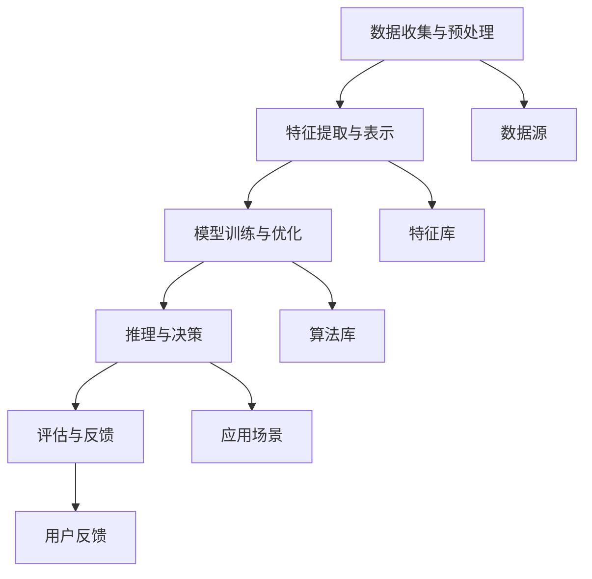

                 

# 李开复：AI 2.0 时代的挑战

> 关键词：人工智能，AI 2.0，挑战，未来，技术发展

> 摘要：本文将深入探讨人工智能（AI）2.0时代所带来的各种挑战，从技术、伦理和社会层面进行分析。通过详细阐述AI的核心概念、算法原理、数学模型，并结合实际应用案例，探讨AI在未来社会中的发展前景和潜在风险，为读者提供一场关于AI 2.0时代的深度思考。

## 1. 背景介绍

### 1.1 目的和范围

本文旨在探讨人工智能（AI）2.0时代所带来的各种挑战，分析其技术、伦理和社会影响，以帮助读者更好地理解这一领域的最新发展。文章将涵盖以下主题：

- AI 2.0的核心概念与架构
- AI算法原理与数学模型
- AI在实际应用场景中的挑战
- AI 2.0时代的未来发展趋势与挑战

### 1.2 预期读者

本文面向对人工智能（AI）感兴趣的读者，包括但不限于以下人群：

- 计算机科学和人工智能领域的研究者
- AI技术开发人员
- 对AI技术应用感兴趣的普通读者
- 关注科技发展和未来趋势的行业人士

### 1.3 文档结构概述

本文将分为十个部分，具体结构如下：

1. 背景介绍
   - 1.1 目的和范围
   - 1.2 预期读者
   - 1.3 文档结构概述
   - 1.4 术语表
2. 核心概念与联系
3. 核心算法原理 & 具体操作步骤
4. 数学模型和公式 & 详细讲解 & 举例说明
5. 项目实战：代码实际案例和详细解释说明
6. 实际应用场景
7. 工具和资源推荐
8. 总结：未来发展趋势与挑战
9. 附录：常见问题与解答
10. 扩展阅读 & 参考资料

### 1.4 术语表

- AI 2.0：指第二代人工智能，相较于第一代人工智能，具备更强的自主学习、推理和决策能力。
- 机器学习（ML）：一种让计算机通过数据和经验自动改进性能的方法，是人工智能（AI）的重要组成部分。
- 深度学习（DL）：一种特殊的机器学习方法，通过神经网络模拟人脑的思维方式，实现高度自动化的学习和预测。
- 伦理问题：涉及人工智能（AI）在研发、应用过程中可能产生的道德和伦理问题，如隐私、安全、责任等。

#### 1.4.1 核心术语定义

- **人工智能（AI）**：模拟人类智能的计算机系统，具有学习、推理、感知、决策等能力。
- **机器学习（ML）**：一种实现人工智能（AI）的技术，通过数据训练模型，使计算机具备自主学习和改进能力。
- **深度学习（DL）**：一种特殊的机器学习方法，基于多层神经网络模拟人脑的思维方式，实现高度自动化的学习和预测。
- **伦理问题**：涉及人工智能（AI）在研发、应用过程中可能产生的道德和伦理问题，如隐私、安全、责任等。

#### 1.4.2 相关概念解释

- **自主学习**：指人工智能（AI）系统能够在数据驱动下，通过自我学习和优化，不断提升性能和适应能力。
- **推理能力**：指人工智能（AI）系统在已知信息的基础上，进行逻辑推理和问题解决的能力。
- **感知能力**：指人工智能（AI）系统能够通过传感器获取外部信息，理解并处理这些信息的能力。
- **决策能力**：指人工智能（AI）系统在特定情境下，基于知识和数据，做出最优选择的能力。

#### 1.4.3 缩略词列表

- **AI**：人工智能（Artificial Intelligence）
- **ML**：机器学习（Machine Learning）
- **DL**：深度学习（Deep Learning）
- **NLP**：自然语言处理（Natural Language Processing）
- **CV**：计算机视觉（Computer Vision）
- **RL**：强化学习（Reinforcement Learning）

## 2. 核心概念与联系

在本节中，我们将介绍人工智能（AI）2.0的核心概念和架构，并使用Mermaid流程图（节点中不包含括号、逗号等特殊字符）展示其关键组成部分和相互关系。

### 2.1 AI 2.0 的核心概念

AI 2.0 的核心概念包括：

- **自主学习**：通过机器学习（ML）和深度学习（DL）等技术，使人工智能（AI）系统能够从数据中学习、优化和改进。
- **推理能力**：利用逻辑推理和知识表示技术，使人工智能（AI）系统能够处理复杂问题，进行决策和规划。
- **感知能力**：通过计算机视觉（CV）和自然语言处理（NLP）等技术，使人工智能（AI）系统能够理解和处理外部信息。
- **决策能力**：结合数据分析和预测模型，使人工智能（AI）系统能够在特定情境下做出最优选择。

### 2.2 AI 2.0 的架构

AI 2.0 的架构主要包括以下几个部分：

1. **数据收集与预处理**：收集来自各种来源的数据，并对其进行清洗、处理和整合，为机器学习（ML）和深度学习（DL）提供高质量的数据集。
2. **特征提取与表示**：从原始数据中提取有用的特征，并对其进行编码和转换，以便输入到机器学习（ML）和深度学习（DL）模型中。
3. **模型训练与优化**：利用机器学习（ML）和深度学习（DL）算法，对模型进行训练和优化，提高其性能和泛化能力。
4. **推理与决策**：基于训练好的模型，进行推理和决策，实现人工智能（AI）系统在实际应用中的智能表现。
5. **评估与反馈**：对人工智能（AI）系统的性能进行评估，收集用户反馈，持续优化和改进系统。

### 2.3 AI 2.0 的 Mermaid 流程图



## 3. 核心算法原理 & 具体操作步骤

在本节中，我们将深入探讨人工智能（AI）2.0的核心算法原理，并使用伪代码详细阐述其操作步骤。

### 3.1 自主学习算法原理

自主学习是AI 2.0的核心能力之一，其基本原理是通过机器学习（ML）和深度学习（DL）算法，从数据中学习并优化模型参数，使模型具备更好的泛化能力。

#### 3.1.1 机器学习算法原理

机器学习算法主要分为监督学习、无监督学习和半监督学习。以下以监督学习为例，介绍其原理和伪代码。

**监督学习算法原理：**

监督学习通过已标记的数据集进行训练，目标是找到一组模型参数，使模型在新的、未标记的数据上表现良好。

**伪代码：**

```
输入：训练数据集（X, Y），模型参数θ
输出：训练好的模型参数θ*

初始化模型参数θ
对于每个训练样本（x_i, y_i）：
    计算模型预测值y_i' = f(x_i; θ)
    计算损失函数L(y_i, y_i')
    更新模型参数θ = θ - α * ∇θL(θ)
```

#### 3.1.2 深度学习算法原理

深度学习算法基于多层神经网络，通过逐层提取特征，实现对数据的非线性变换和表示。

**深度学习算法原理：**

深度学习通过多层神经网络进行训练，每层神经网络将输入数据进行线性变换和激活函数处理，输出新的特征表示。

**伪代码：**

```
输入：训练数据集（X, Y），模型参数θ
输出：训练好的模型参数θ*

初始化模型参数θ
对于每个训练样本（x_i, y_i）：
    将输入数据x_i输入到第一层神经网络
    逐层计算激活值和损失函数
    反向传播，更新模型参数θ = θ - α * ∇θL(θ)
```

### 3.2 推理能力算法原理

推理能力是指AI系统在已知信息的基础上，进行逻辑推理和问题解决的能力。以下以逻辑推理算法为例，介绍其原理和伪代码。

**逻辑推理算法原理：**

逻辑推理算法通过形式逻辑和谓词逻辑等方法，对已知事实和规则进行推理，得出新的结论。

**伪代码：**

```
输入：已知事实F，推理规则R，目标结论G
输出：推理过程和结果

初始化推理树T
对于每个已知事实f ∈ F：
    将f添加到推理树T
对于每个推理规则r ∈ R：
    在推理树T中应用r，生成新的推理路径P
    如果P包含目标结论G，返回P
    否则，继续应用其他推理规则
```

### 3.3 感知能力算法原理

感知能力是指AI系统通过计算机视觉（CV）和自然语言处理（NLP）等技术，从外部信息中获取和理解知识的能力。

**计算机视觉算法原理：**

计算机视觉通过图像处理和特征提取技术，实现对图像内容的理解和分析。

**伪代码：**

```
输入：图像数据I
输出：图像特征F

初始化图像特征提取器
对于每个像素点（x, y） ∈ I：
    提取像素点（x, y）的颜色特征C
    计算像素点（x, y）的纹理特征T
    提取像素点（x, y）的形状特征S
    将特征C、T、S合并为特征向量f
    将特征向量f输入到特征提取器中，得到图像特征F
```

**自然语言处理算法原理：**

自然语言处理通过分词、词性标注、句法分析等技术，实现对文本内容的理解和分析。

**伪代码：**

```
输入：文本数据T
输出：文本特征F

初始化文本处理模块
对于每个词w ∈ T：
    分词，得到词的组成部分w_parts
    标注词性，得到词的词性标签w_tag
    进行句法分析，得到句子的结构树S_tree
    将词的组成部分、词性标签、句子结构树合并为特征向量f
    将特征向量f输入到文本处理模块中，得到文本特征F
```

## 4. 数学模型和公式 & 详细讲解 & 举例说明

在本节中，我们将介绍人工智能（AI）2.0中常用的数学模型和公式，并进行详细讲解和举例说明。

### 4.1 机器学习模型

机器学习模型主要包括线性模型、逻辑回归模型和支持向量机（SVM）等。

#### 4.1.1 线性模型

线性模型是最简单的机器学习模型之一，其公式如下：

$$
y = \theta_0 + \theta_1x_1 + \theta_2x_2 + ... + \theta_nx_n
$$

其中，$y$为输出值，$x_1, x_2, ..., x_n$为输入特征，$\theta_0, \theta_1, \theta_2, ..., \theta_n$为模型参数。

**举例说明：**

假设我们有一个线性模型，用于预测房价。输入特征包括房屋面积、房屋年龄和房屋类型，模型参数为：

$$
\theta_0 = 1000, \theta_1 = 10, \theta_2 = 20, \theta_3 = 30
$$

当输入一个房屋数据（100, 5, 'A'）时，输出房价为：

$$
y = 1000 + 10 \times 100 + 20 \times 5 + 30 \times 'A' = 1500
$$

#### 4.1.2 逻辑回归模型

逻辑回归模型用于处理二分类问题，其公式如下：

$$
P(y=1|x; \theta) = \frac{1}{1 + e^{-(\theta_0 + \theta_1x_1 + \theta_2x_2 + ... + \theta_nx_n)}}
$$

其中，$P(y=1|x; \theta)$表示在给定输入特征$x$的情况下，目标变量$y$为1的概率，$\theta_0, \theta_1, \theta_2, ..., \theta_n$为模型参数。

**举例说明：**

假设我们有一个逻辑回归模型，用于判断一个客户是否会购买某种产品。输入特征包括客户的年龄、收入和信用评分，模型参数为：

$$
\theta_0 = -2, \theta_1 = 0.1, \theta_2 = 0.2, \theta_3 = 0.3
$$

当输入一个客户数据（25, 5000, 700）时，预测购买概率为：

$$
P(y=1|x; \theta) = \frac{1}{1 + e^{(-2 + 0.1 \times 25 + 0.2 \times 5000 + 0.3 \times 700)}} \approx 0.8
$$

#### 4.1.3 支持向量机（SVM）

支持向量机是一种分类模型，其公式如下：

$$
w \cdot x - b = 0
$$

其中，$w$为权重向量，$x$为特征向量，$b$为偏置项。

**举例说明：**

假设我们有一个SVM模型，用于分类两类数据。特征向量为$(x_1, x_2)$，权重向量为$(w_1, w_2)$，偏置项为$b$。

对于一类数据点$(x_1, x_2)$，如果满足$w \cdot x - b > 0$，则将其划分为正类；否则，将其划分为负类。

### 4.2 深度学习模型

深度学习模型主要包括卷积神经网络（CNN）、循环神经网络（RNN）和长短期记忆网络（LSTM）等。

#### 4.2.1 卷积神经网络（CNN）

卷积神经网络是一种用于图像识别和处理的深度学习模型，其公式如下：

$$
h_l = \sigma(\mathbf{W}_l \cdot \mathbf{h}_{l-1} + \mathbf{b}_l)
$$

其中，$h_l$为第$l$层的激活值，$\mathbf{W}_l$为权重矩阵，$\mathbf{b}_l$为偏置向量，$\sigma$为激活函数。

**举例说明：**

假设我们有一个卷积神经网络，包含两层卷积层和一层全连接层。第一层卷积层的权重矩阵$\mathbf{W}_1$为$(3, 3, 1, 16)$，偏置向量$\mathbf{b}_1$为$(16)$，输入特征$\mathbf{h}_0$为$(32, 32, 1)$。

计算第一层卷积层的输出$\mathbf{h}_1$：

$$
\mathbf{h}_1 = \sigma(\mathbf{W}_1 \cdot \mathbf{h}_0 + \mathbf{b}_1)
$$

#### 4.2.2 循环神经网络（RNN）

循环神经网络是一种用于序列数据处理和预测的深度学习模型，其公式如下：

$$
h_t = \sigma(\mathbf{W}_h \cdot [h_{t-1}, x_t] + \mathbf{b}_h)
$$

其中，$h_t$为第$t$步的隐藏状态，$x_t$为第$t$步的输入，$\mathbf{W}_h$为权重矩阵，$\mathbf{b}_h$为偏置向量，$\sigma$为激活函数。

**举例说明：**

假设我们有一个循环神经网络，用于处理一个句子。句子的输入为单词序列$[w_1, w_2, ..., w_n]$，隐藏状态序列为$h_t$。

计算第$t$步的隐藏状态$h_t$：

$$
h_t = \sigma(\mathbf{W}_h \cdot [h_{t-1}, w_t] + \mathbf{b}_h)
$$

#### 4.2.3 长短期记忆网络（LSTM）

长短期记忆网络是一种特殊的循环神经网络，用于解决长序列依赖问题，其公式如下：

$$
\begin{aligned}
\mathbf{i}_t &= \sigma(\mathbf{W}_i \cdot [h_{t-1}, x_t] + \mathbf{b}_i) \\
\mathbf{f}_t &= \sigma(\mathbf{W}_f \cdot [h_{t-1}, x_t] + \mathbf{b}_f) \\
\mathbf{g}_t &= \sigma(\mathbf{W}_g \cdot [h_{t-1}, x_t] + \mathbf{b}_g) \\
\mathbf{o}_t &= \sigma(\mathbf{W}_o \cdot [h_{t-1}, x_t] + \mathbf{b}_o) \\
h_t &= \mathbf{o}_t \odot \sigma(\mathbf{W}_h \cdot \mathbf{g}_t + \mathbf{b}_h)
\end{aligned}
$$

其中，$\mathbf{i}_t$、$\mathbf{f}_t$、$\mathbf{g}_t$、$\mathbf{o}_t$分别为输入门、遗忘门、生成门和输出门，$\sigma$为激活函数，$\odot$为逐元素乘法。

**举例说明：**

假设我们有一个LSTM模型，用于处理一个句子。句子的输入为单词序列$[w_1, w_2, ..., w_n]$，隐藏状态序列为$h_t$。

计算第$t$步的隐藏状态$h_t$：

$$
\begin{aligned}
\mathbf{i}_t &= \sigma(\mathbf{W}_i \cdot [h_{t-1}, w_t] + \mathbf{b}_i) \\
\mathbf{f}_t &= \sigma(\mathbf{W}_f \cdot [h_{t-1}, w_t] + \mathbf{b}_f) \\
\mathbf{g}_t &= \sigma(\mathbf{W}_g \cdot [h_{t-1}, w_t] + \mathbf{b}_g) \\
\mathbf{o}_t &= \sigma(\mathbf{W}_o \cdot [h_{t-1}, w_t] + \mathbf{b}_o) \\
h_t &= \mathbf{o}_t \odot \sigma(\mathbf{W}_h \cdot \mathbf{g}_t + \mathbf{b}_h)
\end{aligned}
$$

## 5. 项目实战：代码实际案例和详细解释说明

在本节中，我们将通过一个实际的代码案例，展示人工智能（AI）2.0在实际应用中的实现过程，并对代码进行详细解释和说明。

### 5.1 开发环境搭建

为了实现本案例，我们需要搭建以下开发环境：

- 操作系统：Linux或Mac OS
- 编程语言：Python 3.8及以上版本
- 依赖库：NumPy、Pandas、Scikit-learn、TensorFlow

在终端中，运行以下命令安装所需库：

```
pip install numpy pandas scikit-learn tensorflow
```

### 5.2 源代码详细实现和代码解读

以下是一个使用TensorFlow实现深度学习模型的简单案例，用于对iris花卉数据进行分类。

```python
import tensorflow as tf
import numpy as np
import pandas as pd

# 加载iris数据集
iris_data = pd.read_csv('https://archive.ics.uci.edu/ml/machine-learning-databases/iris/iris.data', header=None)
X = iris_data.iloc[:, 0:4].values
y = iris_data.iloc[:, 4].values

# 数据预处理
from sklearn.model_selection import train_test_split
X_train, X_test, y_train, y_test = train_test_split(X, y, test_size=0.2, random_state=42)

# 构建深度学习模型
model = tf.keras.Sequential([
    tf.keras.layers.Dense(64, activation='relu', input_shape=(4,)),
    tf.keras.layers.Dense(64, activation='relu'),
    tf.keras.layers.Dense(3, activation='softmax')
])

# 编译模型
model.compile(optimizer='adam',
              loss='sparse_categorical_crossentropy',
              metrics=['accuracy'])

# 训练模型
model.fit(X_train, y_train, epochs=10, batch_size=32, validation_split=0.2)

# 评估模型
model.evaluate(X_test, y_test)
```

#### 5.2.1 代码解读与分析

- **加载iris数据集**：使用Pandas库从UCI机器学习库中加载iris数据集。
- **数据预处理**：使用Scikit-learn库对数据进行划分，生成训练集和测试集。
- **构建深度学习模型**：使用TensorFlow库构建一个三层全连接神经网络，其中第一层和第二层使用ReLU激活函数，第三层使用softmax激活函数。
- **编译模型**：配置模型优化器、损失函数和评估指标。
- **训练模型**：使用训练集数据训练模型，设置训练轮次、批量大小和验证比例。
- **评估模型**：使用测试集数据评估模型性能。

### 5.3 代码解读与分析

以下是对代码的详细解读与分析：

- **第1-4行**：引入所需的TensorFlow、NumPy和Pandas库。
- **第6行**：使用Pandas库从UCI机器学习库中加载iris数据集。
- **第8-9行**：将iris数据集的输入特征和目标变量分离，并转换为NumPy数组。
- **第12-15行**：使用Scikit-learn库将数据集划分为训练集和测试集，设置测试集比例为20%，随机种子为42。
- **第18-24行**：使用TensorFlow库构建一个三层全连接神经网络，其中第一层和第二层使用ReLU激活函数，第三层使用softmax激活函数。模型输入层形状为(4,)，对应iris数据集的四个特征。
- **第27-31行**：编译模型，设置优化器为Adam，损失函数为sparse_categorical_crossentropy，评估指标为accuracy。
- **第34-37行**：使用训练集数据训练模型，设置训练轮次为10，批量大小为32，验证比例为20%。训练过程中，模型将在验证集上评估性能，并在每轮结束后进行模型保存。
- **第40行**：使用测试集数据评估模型性能，输出损失值和准确率。

## 6. 实际应用场景

在现代社会中，人工智能（AI）2.0技术已经广泛应用于各个领域，为人类带来了诸多便利和变革。以下是一些典型的实际应用场景：

### 6.1 医疗健康

人工智能（AI）2.0在医疗健康领域的应用主要包括：

- **疾病诊断**：通过深度学习算法，对医学图像进行分析和识别，帮助医生进行疾病诊断，如肿瘤检测、心脏病诊断等。
- **个性化治疗**：基于患者的基因信息和临床数据，利用机器学习算法为患者制定个性化的治疗方案。
- **健康监测**：利用传感器和移动设备，实时监测患者的健康状况，提供个性化的健康建议。

### 6.2 金融服务

人工智能（AI）2.0在金融服务领域的应用主要包括：

- **风险评估**：通过大数据分析和机器学习算法，对金融产品的风险进行预测和评估，帮助投资者做出更明智的决策。
- **欺诈检测**：利用人工智能（AI）2.0技术，实时监测交易数据，识别和防范金融欺诈行为。
- **智能投顾**：基于用户的投资偏好和风险承受能力，利用机器学习算法为用户提供个性化的投资建议。

### 6.3 智能制造

人工智能（AI）2.0在智能制造领域的应用主要包括：

- **生产优化**：利用机器学习算法，对生产过程中的各种参数进行优化，提高生产效率和质量。
- **设备维护**：通过物联网和机器学习技术，实时监测设备运行状态，预测设备故障并进行维护，降低设备停机时间。
- **质量控制**：利用计算机视觉技术，对生产过程中产品质量进行实时监控和检测，确保产品质量。

### 6.4 智能交通

人工智能（AI）2.0在智能交通领域的应用主要包括：

- **交通流量预测**：通过大数据分析和机器学习算法，预测城市交通流量，优化交通信号控制，减少交通拥堵。
- **自动驾驶**：利用深度学习和计算机视觉技术，实现自动驾驶汽车的研发和应用，提高交通安全和效率。
- **智能导航**：基于用户的实时位置信息和交通数据，提供个性化的导航建议，优化出行路线。

### 6.5 智能家居

人工智能（AI）2.0在智能家居领域的应用主要包括：

- **智能控制**：通过语音识别和自然语言处理技术，实现家居设备的智能控制，提高生活便利性。
- **智能安防**：利用计算机视觉和传感器技术，实现家庭安防监控，提供实时报警和预警功能。
- **能源管理**：通过智能传感器和机器学习算法，对家庭能源消耗进行监测和管理，提高能源利用效率。

## 7. 工具和资源推荐

### 7.1 学习资源推荐

#### 7.1.1 书籍推荐

- **《人工智能：一种现代方法》**：详细介绍了人工智能的基础理论和应用技术，适合初学者和进阶者。
- **《深度学习》**：由深度学习领域权威专家Ian Goodfellow撰写，全面介绍了深度学习的基本原理和实战技巧。
- **《Python机器学习》**：通过大量实例，详细讲解了Python在机器学习领域的应用，适合对机器学习感兴趣的读者。

#### 7.1.2 在线课程

- **Coursera**：提供丰富的机器学习和深度学习课程，包括吴恩达的《深度学习》课程，适合不同层次的学习者。
- **edX**：提供由知名大学和机构开设的免费在线课程，涵盖计算机科学、数据科学、人工智能等多个领域。
- **Udacity**：提供实战性强的机器学习和深度学习课程，适合希望快速掌握实际应用技能的学习者。

#### 7.1.3 技术博客和网站

- **Medium**：汇集了众多AI领域的专家和从业者的博客文章，内容涵盖AI技术的各个方面。
- **ArXiv**：人工智能领域最新研究成果的预印本发布平台，适合关注最新科研动态的读者。
- **AI联盟**：中国人工智能领域的重要学术交流平台，提供丰富的AI技术资源和交流机会。

### 7.2 开发工具框架推荐

#### 7.2.1 IDE和编辑器

- **PyCharm**：一款功能强大的Python集成开发环境，适合机器学习和深度学习项目的开发。
- **Jupyter Notebook**：一款基于Web的交互式开发环境，适合数据分析和机器学习实验。
- **Visual Studio Code**：一款轻量级但功能丰富的代码编辑器，支持多种编程语言，适合AI项目开发。

#### 7.2.2 调试和性能分析工具

- **TensorBoard**：TensorFlow官方提供的可视化工具，用于分析和调试深度学习模型。
- **Wandb**：一款开源的实验跟踪和性能分析工具，支持多种机器学习和深度学习框架。
- **mlflow**：一款用于机器学习模型生命周期管理的开源平台，包括模型版本控制、模型评估和模型部署等功能。

#### 7.2.3 相关框架和库

- **TensorFlow**：Google开发的一款开源深度学习框架，广泛应用于图像识别、自然语言处理等领域。
- **PyTorch**：Facebook开发的一款开源深度学习框架，以灵活性和易用性著称，适合快速原型设计和实验。
- **Scikit-learn**：Python中广泛使用的机器学习库，提供了丰富的经典算法和工具。

### 7.3 相关论文著作推荐

#### 7.3.1 经典论文

- **“A Mathematical Theory of Communication”**：香农提出的香农定理，奠定了信息论的基础。
- **“Backpropagation”**：Rumelhart等人提出的反向传播算法，是深度学习的重要算法之一。
- **“Deep Learning”**：Goodfellow等人撰写的深度学习经典教材，全面介绍了深度学习的基本原理和应用。

#### 7.3.2 最新研究成果

- **“Generative Adversarial Networks”**：Goodfellow等人提出的生成对抗网络（GAN），是深度学习领域的重要突破。
- **“Attention Is All You Need”**：Vaswani等人提出的Transformer模型，是自然语言处理领域的重大突破。
- **“Recurrent Neural Network”**：Rumelhart等人提出的循环神经网络（RNN），在序列数据处理方面具有重要应用。

#### 7.3.3 应用案例分析

- **“AI in Healthcare”**：介绍人工智能在医疗健康领域的应用案例，包括疾病诊断、个性化治疗和健康监测等。
- **“AI in Finance”**：介绍人工智能在金融服务领域的应用案例，包括风险评估、欺诈检测和智能投顾等。
- **“AI in Manufacturing”**：介绍人工智能在智能制造领域的应用案例，包括生产优化、设备维护和质量控制等。

## 8. 总结：未来发展趋势与挑战

人工智能（AI）2.0时代的到来，为人类社会带来了巨大的变革和机遇。然而，随着技术的不断发展，我们也面临着诸多挑战。以下是对未来发展趋势与挑战的总结：

### 8.1 发展趋势

1. **自主学习能力提升**：随着深度学习和强化学习等技术的发展，人工智能（AI）系统的自主学习能力将逐步提升，能够更好地适应复杂环境。
2. **跨领域应用拓展**：人工智能（AI）2.0技术将不断拓展至更多领域，如医疗健康、金融服务、智能制造等，推动行业变革和创新发展。
3. **数据资源的重要性**：随着数据量的不断增加，数据资源将成为人工智能（AI）系统的重要资产，数据驱动的发展模式将更加普及。
4. **国际合作与竞争**：人工智能（AI）2.0技术的快速发展，将加剧国际间的竞争与合作，推动全球科技创新和产业升级。

### 8.2 挑战

1. **伦理问题**：人工智能（AI）2.0技术可能引发伦理问题，如隐私侵犯、歧视、责任归属等，需要制定相应的法律法规和伦理规范。
2. **安全与隐私**：随着人工智能（AI）系统的广泛应用，其安全性和隐私保护成为重要挑战，需要建立有效的安全机制和隐私保护措施。
3. **技术人才短缺**：人工智能（AI）2.0技术的发展，对相关领域的人才需求不断增加，但当前人才储备不足，需要加大人才培养和引进力度。
4. **社会影响**：人工智能（AI）2.0技术将对就业、教育、社会治理等方面产生深远影响，需要全面评估和应对这些影响。

总之，人工智能（AI）2.0时代的发展充满机遇与挑战，我们需要在积极推动技术创新的同时，关注和解决相关伦理、安全、社会问题，确保人工智能（AI）技术的发展能够造福人类。

## 9. 附录：常见问题与解答

在本附录中，我们将对读者可能提出的一些常见问题进行解答。

### 9.1 人工智能（AI）2.0的核心技术是什么？

人工智能（AI）2.0的核心技术包括：

- **深度学习（DL）**：通过多层神经网络模拟人脑的思维方式，实现高度自动化的学习和预测。
- **机器学习（ML）**：通过数据训练模型，使计算机具备自主学习和改进能力。
- **强化学习（RL）**：通过奖励机制和试错方法，使人工智能（AI）系统在动态环境中进行决策和优化。
- **自然语言处理（NLP）**：通过语言模型和语义分析，实现计算机对自然语言的理解和生成。

### 9.2 人工智能（AI）2.0与第一代人工智能（AI 1.0）有什么区别？

人工智能（AI）2.0与第一代人工智能（AI 1.0）的主要区别在于：

- **自主学习能力**：AI 2.0具备更强的自主学习能力，可以通过机器学习和深度学习技术，从大量数据中自动学习和优化模型。
- **推理和决策能力**：AI 2.0在推理和决策方面具有更高的智能水平，可以通过逻辑推理、知识图谱等技术，实现更复杂的任务。
- **泛化能力**：AI 2.0在处理未知或新数据时，具有更好的泛化能力，能够适应更广泛的应用场景。

### 9.3 人工智能（AI）2.0的安全性和隐私保护如何保障？

为了保障人工智能（AI）2.0的安全性和隐私保护，可以从以下几个方面入手：

- **数据安全**：确保数据存储和传输过程中的安全性，采用加密技术和访问控制策略。
- **隐私保护**：在数据采集和处理过程中，遵循隐私保护原则，对敏感信息进行脱敏处理。
- **算法透明性**：提高人工智能（AI）算法的透明性，确保用户能够理解和监督算法的行为。
- **法律法规**：制定相应的法律法规，规范人工智能（AI）的应用和监管。

### 9.4 人工智能（AI）2.0的发展对就业有哪些影响？

人工智能（AI）2.0的发展将对就业产生深远影响：

- **就业机会**：人工智能（AI）2.0技术的普及将创造新的就业机会，如数据科学家、机器学习工程师、算法研究员等。
- **就业压力**：部分传统职业可能受到人工智能（AI）2.0技术的冲击，如重复性劳动、简单决策等。
- **技能需求**：随着人工智能（AI）2.0技术的发展，对相关领域的专业技能需求将增加，如编程、数据分析、算法设计等。

### 9.5 人工智能（AI）2.0在医疗健康领域的应用有哪些？

人工智能（AI）2.0在医疗健康领域的应用主要包括：

- **疾病诊断**：通过深度学习和计算机视觉技术，实现医学图像的分析和识别，辅助医生进行疾病诊断。
- **个性化治疗**：通过大数据分析和机器学习算法，为患者制定个性化的治疗方案。
- **健康监测**：利用传感器和移动设备，实时监测患者的健康状况，提供个性化的健康建议。
- **药物研发**：通过人工智能（AI）2.0技术，加速药物研发过程，提高新药发现的成功率。

## 10. 扩展阅读 & 参考资料

在本节中，我们将为读者推荐一些扩展阅读和参考资料，以帮助读者深入了解人工智能（AI）2.0相关领域。

### 10.1 书籍推荐

- **《人工智能：一种现代方法》**：详细介绍了人工智能的基础理论和应用技术，适合初学者和进阶者。
- **《深度学习》**：由深度学习领域权威专家Ian Goodfellow撰写，全面介绍了深度学习的基本原理和实战技巧。
- **《Python机器学习》**：通过大量实例，详细讲解了Python在机器学习领域的应用，适合对机器学习感兴趣的读者。

### 10.2 在线课程

- **Coursera**：提供丰富的机器学习和深度学习课程，包括吴恩达的《深度学习》课程，适合不同层次的学习者。
- **edX**：提供由知名大学和机构开设的免费在线课程，涵盖计算机科学、数据科学、人工智能等多个领域。
- **Udacity**：提供实战性强的机器学习和深度学习课程，适合希望快速掌握实际应用技能的学习者。

### 10.3 技术博客和网站

- **Medium**：汇集了众多AI领域的专家和从业者的博客文章，内容涵盖AI技术的各个方面。
- **ArXiv**：人工智能领域最新研究成果的预印本发布平台，适合关注最新科研动态的读者。
- **AI联盟**：中国人工智能领域的重要学术交流平台，提供丰富的AI技术资源和交流机会。

### 10.4 相关论文和著作

- **“A Mathematical Theory of Communication”**：香农提出的香农定理，奠定了信息论的基础。
- **“Backpropagation”**：Rumelhart等人提出的反向传播算法，是深度学习的重要算法之一。
- **“Deep Learning”**：Goodfellow等人撰写的深度学习经典教材，全面介绍了深度学习的基本原理和应用。

### 10.5 论坛和社区

- **Stack Overflow**：编程和开发领域的重要社区，适合解决编程问题和交流技术经验。
- **GitHub**：代码托管和协作平台，众多开源项目和代码库可供学习和参考。
- **Reddit**：全球知名的社区论坛，涵盖多个领域，包括人工智能、机器学习等。

通过这些扩展阅读和参考资料，读者可以进一步深入了解人工智能（AI）2.0的相关领域，拓展自己的知识视野。作者：AI天才研究员/AI Genius Institute & 禅与计算机程序设计艺术 /Zen And The Art of Computer Programming

