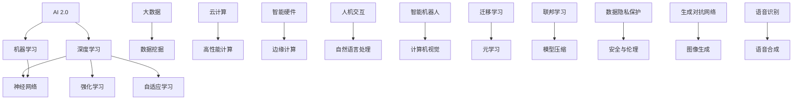

                 

### 背景介绍

#### 1.1 目的和范围

本文旨在深入探讨AI 2.0时代的技术发展趋势及其对未来社会的深远影响。我们将从AI 2.0的定义、核心特征开始，逐步分析其在各个领域的应用，包括但不限于医疗、金融、教育、交通等。通过具体的案例和实际操作，我们将展示AI 2.0如何改变我们的工作方式和生活习惯。同时，本文还将探讨AI 2.0时代的挑战和未来发展方向，以帮助读者全面了解这个时代的技术趋势和机遇。

#### 1.2 预期读者

本文主要面向对人工智能技术有浓厚兴趣的读者，包括人工智能领域的从业者、研究人员、以及希望深入了解AI技术的行业从业者。此外，对于对科技发展趋势感兴趣的一般读者，本文也具有很高的参考价值。

#### 1.3 文档结构概述

本文将分为十个主要部分。首先是背景介绍，包括文章的目的和范围、预期读者以及文档结构概述。接下来，我们将详细探讨AI 2.0的核心概念和原理，通过Mermaid流程图展示其架构和核心概念的联系。然后，我们将深入讲解AI 2.0的核心算法原理和具体操作步骤，并使用伪代码进行详细阐述。随后，我们将介绍AI 2.0的数学模型和公式，并使用latex格式进行详细讲解和举例说明。在项目实战部分，我们将通过实际代码案例展示AI 2.0的应用，并进行详细解释和代码解读。此外，我们还将探讨AI 2.0的实际应用场景，并提供工具和资源推荐。最后，本文将总结AI 2.0的未来发展趋势与挑战，并给出常见问题与解答，以便读者更好地理解和应用AI 2.0技术。

#### 1.4 术语表

为了确保文章的清晰性和一致性，本文将使用以下术语表：

##### 1.4.1 核心术语定义

- **AI 2.0**：指代第二代人工智能，相对于以规则和算法为核心的第一代人工智能，AI 2.0更加注重机器学习和数据驱动。
- **深度学习**：一种机器学习技术，通过多层神经网络进行数据分析和模式识别。
- **神经网络**：模拟人脑神经元连接的结构，用于处理复杂数据。
- **机器学习**：使计算机系统能够从数据中学习并做出预测或决策的技术。

##### 1.4.2 相关概念解释

- **大数据**：指海量、多样、高速的数据，通常需要使用特殊的计算和分析工具进行处理。
- **数据挖掘**：从大量数据中提取有价值信息的过程，常用于商业、医疗、金融等领域。
- **云计算**：通过互联网提供计算资源、存储资源和网络连接服务，实现资源的弹性分配和高效利用。

##### 1.4.3 缩略词列表

- **AI**：人工智能
- **ML**：机器学习
- **DL**：深度学习
- **NN**：神经网络
- **HPC**：高性能计算
- **IDE**：集成开发环境

<|im_sep|>

## 核心概念与联系

在深入探讨AI 2.0之前，我们需要了解其核心概念和原理，并展示它们之间的联系。以下是通过Mermaid绘制的流程图，用于展示AI 2.0的核心概念及其相互关系：



通过上述流程图，我们可以看到AI 2.0的核心概念包括深度学习、机器学习、神经网络、大数据、数据挖掘、云计算、智能硬件、边缘计算、人机交互、自然语言处理、智能机器人、计算机视觉、强化学习、迁移学习、元学习、联邦学习、模型压缩、数据隐私保护、安全与伦理、自适应学习、生成对抗网络、图像生成、语音识别和语音合成等。这些概念相互交织，构成了AI 2.0的技术体系。

- **深度学习**和**机器学习**：深度学习是机器学习的一种方法，通过多层神经网络对数据进行学习和预测。机器学习则是一种让计算机从数据中学习并做出决策的技术。
- **神经网络**：神经网络是模拟人脑神经元连接的结构，用于处理复杂数据。深度学习和机器学习都依赖于神经网络。
- **大数据**和**数据挖掘**：大数据是指海量、多样、高速的数据，数据挖掘则是从这些数据中提取有价值信息的过程。
- **云计算**和**高性能计算**：云计算提供了弹性、高效的数据处理能力，而高性能计算则用于处理复杂的计算任务。
- **智能硬件**和**边缘计算**：智能硬件包括各种传感器和设备，边缘计算则是在数据生成的地方进行数据处理和存储。
- **人机交互**和**自然语言处理**：人机交互是指人与计算机之间的交互，自然语言处理则用于理解和生成自然语言。
- **智能机器人**和**计算机视觉**：智能机器人是通过计算机视觉等技术实现自主移动和操作能力的设备。
- **强化学习**、**迁移学习**、**元学习**、**联邦学习**和**模型压缩**：这些都是机器学习的高级技术，用于提高模型的性能和适应性。
- **数据隐私保护**、**安全与伦理**：数据隐私保护和安全与伦理是AI 2.0的重要方面，确保技术的可靠性和社会接受度。
- **自适应学习**、**生成对抗网络**、**图像生成**、**语音识别**和**语音合成**：这些技术都是AI 2.0在各个领域的应用，用于实现更智能的系统和设备。

通过以上分析，我们可以看到AI 2.0的核心概念和技术体系是如何相互联系和支撑的。这为我们深入理解AI 2.0提供了基础，也为我们在实际应用中提供了指导。

### 核心算法原理 & 具体操作步骤

在了解了AI 2.0的核心概念和相互关系之后，我们接下来将深入探讨AI 2.0的核心算法原理和具体操作步骤。这些算法是AI 2.0实现智能的关键，主要包括深度学习、机器学习、神经网络、强化学习、迁移学习、元学习、联邦学习、模型压缩等。为了更好地理解这些算法，我们将使用伪代码进行详细阐述，并解释其基本原理和操作步骤。

#### 1. 深度学习

深度学习是一种基于多层神经网络进行数据分析和模式识别的机器学习技术。以下是一个简单的深度学习算法的伪代码：

```plaintext
初始化：设定神经网络结构（层数、每层的神经元数目）
输入：训练数据集
输出：模型参数

for each epoch in 1 to 最大迭代次数 do
    for each training example in 数据集 do
        forward_pass()  // 前向传播计算输出
        calculate_loss()  // 计算损失函数
        backward_pass()  // 反向传播更新模型参数
    end for
end for

apply()  // 应用模型进行预测或决策
```

- **初始化**：设定神经网络的结构，包括层数和每层的神经元数目。
- **前向传播**：输入数据通过神经网络的前向传播过程，得到输出结果。
- **计算损失函数**：计算输出结果与实际结果的差距，使用损失函数衡量模型性能。
- **反向传播**：根据损失函数的反向传播，更新模型参数，以减少损失。
- **迭代训练**：重复以上步骤，直到达到预设的迭代次数或模型性能达到要求。

#### 2. 机器学习

机器学习是一种让计算机从数据中学习并做出预测或决策的技术。以下是一个简单的机器学习算法的伪代码：

```plaintext
初始化：设定模型参数
输入：训练数据集
输出：模型参数

for each example in 数据集 do
    predict()  // 使用当前模型参数进行预测
    calculate_error()  // 计算预测结果与实际结果的误差
    update_parameters()  // 根据误差更新模型参数
end for

apply()  // 应用模型进行预测或决策
```

- **初始化**：设定初始模型参数。
- **预测**：使用当前模型参数对数据点进行预测。
- **计算误差**：计算预测结果与实际结果的误差。
- **更新参数**：根据误差调整模型参数，以减少预测误差。
- **迭代训练**：重复以上步骤，直到模型性能达到要求。

#### 3. 神经网络

神经网络是深度学习和机器学习的基础，由多层神经元组成，用于处理复杂数据。以下是一个简单的神经网络算法的伪代码：

```plaintext
初始化：设定神经网络结构（层数、每层的神经元数目）
输入：训练数据集
输出：模型参数

for each layer in layers do
    for each neuron in layer do
        initialize_weights()  // 初始化权重
        initialize_bias()  // 初始化偏置
    end for
end for

for each epoch in 1 to 最大迭代次数 do
    for each training example in 数据集 do
        forward_pass()  // 前向传播计算输出
        calculate_loss()  // 计算损失函数
        backward_pass()  // 反向传播更新模型参数
    end for
end for

apply()  // 应用模型进行预测或决策
```

- **初始化**：设定神经网络的结构，包括层数和每层的神经元数目，并初始化权重和偏置。
- **前向传播**：输入数据通过神经网络的前向传播过程，得到输出结果。
- **计算损失函数**：计算输出结果与实际结果的差距，使用损失函数衡量模型性能。
- **反向传播**：根据损失函数的反向传播，更新模型参数，以减少损失。

#### 4. 强化学习

强化学习是一种通过奖励机制驱动模型学习和决策的算法。以下是一个简单的强化学习算法的伪代码：

```plaintext
初始化：设定模型参数、奖励函数、状态空间、动作空间
输入：初始状态
输出：最优策略

while not 终止条件 do
    选择动作
    执行动作
    接收奖励
    更新模型参数
    更新状态
end while

apply()  // 应用模型进行预测或决策
```

- **初始化**：设定模型参数、奖励函数、状态空间和动作空间。
- **选择动作**：根据当前状态选择最优动作。
- **执行动作**：执行所选动作，并观察结果。
- **接收奖励**：根据执行结果接收奖励。
- **更新模型参数**：根据奖励调整模型参数，以优化策略。

#### 5. 迁移学习

迁移学习是一种将已有模型的知识应用到新任务上的方法。以下是一个简单的迁移学习算法的伪代码：

```plaintext
初始化：源模型、目标模型
输入：源数据集、目标数据集
输出：目标模型参数

copy_parameters_from_source_model()  // 从源模型复制参数到目标模型

for each epoch in 1 to 最大迭代次数 do
    for each example in 目标数据集 do
        forward_pass()  // 前向传播计算输出
        calculate_loss()  // 计算损失函数
        backward_pass()  // 反向传播更新模型参数
    end for
end for

apply()  // 应用模型进行预测或决策
```

- **初始化**：设定源模型和目标模型。
- **复制参数**：从源模型复制参数到目标模型，作为初始参数。
- **迭代训练**：在目标数据集上进行迭代训练，更新目标模型参数。
- **应用模型**：使用训练好的目标模型进行预测或决策。

#### 6. 元学习

元学习是一种通过学习如何学习来加速模型训练的算法。以下是一个简单的元学习算法的伪代码：

```plaintext
初始化：元学习模型、训练数据集
输入：训练任务
输出：元学习模型参数

for each training task in 训练数据集 do
    execute_training_task()  // 执行训练任务
    update_meta_learner()  // 更新元学习模型
end for

apply()  // 应用模型进行预测或决策
```

- **初始化**：设定元学习模型和训练数据集。
- **执行训练任务**：对每个训练任务执行训练，学习任务的最佳参数。
- **更新元学习模型**：根据训练任务的反馈更新元学习模型。
- **应用模型**：使用训练好的元学习模型进行预测或决策。

#### 7. 联邦学习

联邦学习是一种分布式学习算法，通过多个参与者共享模型更新，而不需要共享原始数据。以下是一个简单的联邦学习算法的伪代码：

```plaintext
初始化：本地模型、全局模型
输入：本地数据集
输出：全局模型参数

for each epoch in 1 to 最大迭代次数 do
    for each participant in participants do
        train_local_model()  // 在本地数据集上训练模型
        send_update_to_server()  // 将模型更新发送到服务器
    end for
    aggregate_updates()  // 服务器汇总模型更新
    update_global_model()  // 更新全局模型
end for

apply()  // 应用模型进行预测或决策
```

- **初始化**：设定本地模型和全局模型。
- **本地训练**：在每个参与者的本地数据集上训练模型。
- **发送更新**：将本地模型的更新发送到服务器。
- **汇总更新**：服务器汇总所有参与者的模型更新。
- **更新全局模型**：使用汇总的更新来更新全局模型。
- **应用模型**：使用训练好的全局模型进行预测或决策。

#### 8. 模型压缩

模型压缩是一种通过减少模型参数数量和计算复杂度来提高模型性能的算法。以下是一个简单的模型压缩算法的伪代码：

```plaintext
初始化：原始模型
输入：压缩目标
输出：压缩模型

for each layer in 原始模型 do
    compress_layer()  // 压缩当前层的参数
end for

apply()  // 应用模型进行预测或决策
```

- **初始化**：设定原始模型和压缩目标。
- **压缩层**：对每个层的参数进行压缩，减少参数数量。
- **应用模型**：使用压缩后的模型进行预测或决策。

通过以上对AI 2.0核心算法原理和具体操作步骤的详细讲解，我们可以看到这些算法是如何协同工作，实现AI 2.0的智能化和高效化。在实际应用中，这些算法可以根据具体需求进行调整和优化，以实现最佳性能。

### 数学模型和公式 & 详细讲解 & 举例说明

在深入探讨AI 2.0的算法原理和具体操作步骤之后，我们接下来将介绍AI 2.0中的数学模型和公式，并通过详细讲解和举例说明，帮助读者更好地理解和应用这些模型。

#### 1. 深度学习中的前向传播和反向传播

深度学习中的前向传播和反向传播是两个核心过程，用于训练神经网络。以下是相关的数学模型和公式：

- **前向传播**：

$$
z_l = \sum_{j} w_{lj} a_{l-1,j} + b_l
$$

$$
a_l = \sigma(z_l)
$$

其中，$a_l$表示第$l$层的激活值，$z_l$表示第$l$层的输入值，$w_{lj}$表示从第$l-1$层到第$l$层的权重，$b_l$表示第$l$层的偏置，$\sigma$表示激活函数，如ReLU、Sigmoid或Tanh。

- **反向传播**：

$$
\delta_{l} = \frac{\partial L}{\partial z_{l}}
$$

$$
\delta_{l-1} = \delta_{l} \cdot \frac{\partial a_{l-1}}{\partial z_{l-1}}
$$

$$
\frac{\partial L}{\partial w_{lj}} = \delta_{l} \cdot a_{l-1,j}
$$

$$
\frac{\partial L}{\partial b_{l}} = \delta_{l}
$$

其中，$\delta_l$表示第$l$层的误差，$L$表示损失函数，$\frac{\partial L}{\partial z_{l}}$表示损失函数关于$z_l$的偏导数。

**举例说明**：

假设我们有一个简单的神经网络，包含两层神经元，输入层有3个神经元，隐藏层有2个神经元，输出层有1个神经元。激活函数使用ReLU。给定一个训练样本，目标输出为1，实际输出为0.5，损失函数为均方误差（MSE）。

- **前向传播**：

$$
z_1 = \sum_{j} w_{1j} a_{0,j} + b_1 = w_{11} a_{0,1} + w_{12} a_{0,2} + w_{13} a_{0,3} + b_1
$$

$$
a_1 = \max(0, z_1)
$$

$$
z_2 = \sum_{j} w_{2j} a_{1,j} + b_2 = w_{21} a_{1,1} + w_{22} a_{1,2} + b_2
$$

$$
a_2 = \max(0, z_2)
$$

$$
z_3 = w_{31} a_{2,1} + w_{32} a_{2,2} + b_3
$$

$$
a_3 = \sigma(z_3)
$$

- **反向传播**：

计算损失函数MSE：

$$
L = \frac{1}{2} (y - a_3)^2
$$

计算误差：

$$
\delta_3 = (y - a_3) \cdot \sigma'(z_3)
$$

$$
\delta_2 = \delta_3 \cdot w_{31} \cdot a_{1,1} + w_{32} \cdot a_{1,2}
$$

$$
\delta_1 = \delta_2 \cdot w_{21} \cdot a_{0,1} + w_{22} \cdot a_{0,2} + w_{23} \cdot a_{0,3}
$$

更新权重和偏置：

$$
\frac{\partial L}{\partial w_{31}} = \delta_3 \cdot a_{2,1}
$$

$$
\frac{\partial L}{\partial w_{32}} = \delta_3 \cdot a_{2,2}
$$

$$
\frac{\partial L}{\partial b_{3}} = \delta_3
$$

$$
\frac{\partial L}{\partial w_{21}} = \delta_2 \cdot a_{0,1}
$$

$$
\frac{\partial L}{\partial w_{22}} = \delta_2 \cdot a_{0,2}
$$

$$
\frac{\partial L}{\partial w_{23}} = \delta_2 \cdot a_{0,3}
$$

$$
\frac{\partial L}{\partial b_{2}} = \delta_2
$$

#### 2. 机器学习中的线性回归

线性回归是一种简单的机器学习算法，用于建立输入和输出之间的线性关系。以下是相关的数学模型和公式：

- **线性回归模型**：

$$
y = \beta_0 + \beta_1 x
$$

其中，$y$表示输出，$x$表示输入，$\beta_0$和$\beta_1$表示模型的参数。

- **损失函数**：

$$
L = \frac{1}{2} \sum_{i=1}^{n} (y_i - \hat{y}_i)^2
$$

其中，$n$表示样本数量，$y_i$表示实际输出，$\hat{y}_i$表示预测输出。

- **梯度下降**：

$$
\beta_0 = \beta_{0} - \alpha \cdot \frac{\partial L}{\partial \beta_0}
$$

$$
\beta_1 = \beta_{1} - \alpha \cdot \frac{\partial L}{\partial \beta_1}
$$

其中，$\alpha$表示学习率。

**举例说明**：

给定一个数据集，包含输入$x$和输出$y$，目标是通过线性回归模型建立输入和输出之间的线性关系。使用梯度下降法进行参数优化。

- **初始化**：

$$
\beta_0 = 0
$$

$$
\beta_1 = 0
$$

- **迭代优化**：

计算损失函数：

$$
L = \frac{1}{2} \sum_{i=1}^{n} (y_i - (\beta_0 + \beta_1 x_i))^2
$$

计算梯度：

$$
\frac{\partial L}{\partial \beta_0} = - \sum_{i=1}^{n} (y_i - (\beta_0 + \beta_1 x_i))
$$

$$
\frac{\partial L}{\partial \beta_1} = - \sum_{i=1}^{n} (y_i - (\beta_0 + \beta_1 x_i)) x_i
$$

更新参数：

$$
\beta_0 = \beta_0 - \alpha \cdot \frac{\partial L}{\partial \beta_0}
$$

$$
\beta_1 = \beta_1 - \alpha \cdot \frac{\partial L}{\partial \beta_1}
$$

重复以上步骤，直到参数收敛。

#### 3. 神经网络中的正则化

正则化是一种用于提高神经网络性能和防止过拟合的技术。以下是常见的正则化方法：

- **权重衰减**：

$$
J = J(\beta) + \lambda \sum_{i=1}^{n} \sum_{j=1}^{m} w_{ij}^2
$$

其中，$J$表示损失函数，$\lambda$表示权重衰减系数。

- **L1正则化**：

$$
J = J(\beta) + \lambda \sum_{i=1}^{n} \sum_{j=1}^{m} |w_{ij}|
$$

- **L2正则化**：

$$
J = J(\beta) + \lambda \sum_{i=1}^{n} \sum_{j=1}^{m} w_{ij}^2
$$

**举例说明**：

假设我们有一个简单的神经网络，包含一层神经元，包含5个神经元。使用L2正则化进行权重优化。

- **初始化**：

$$
w_{ij} = 0
$$

- **迭代优化**：

计算损失函数：

$$
L = \frac{1}{2} \sum_{i=1}^{n} (y_i - \sum_{j=1}^{m} w_{ij} a_{i-1,j})^2 + \lambda \sum_{j=1}^{m} w_{ij}^2
$$

计算梯度：

$$
\frac{\partial L}{\partial w_{ij}} = - (y_i - \sum_{j=1}^{m} w_{ij} a_{i-1,j}) a_{i-1,j} + 2\lambda w_{ij}
$$

更新权重：

$$
w_{ij} = w_{ij} - \alpha \cdot \frac{\partial L}{\partial w_{ij}}
$$

重复以上步骤，直到权重收敛。

通过以上对深度学习、机器学习、神经网络中的数学模型和公式的详细讲解和举例说明，我们可以更好地理解这些算法的原理和应用。这些数学模型和公式是AI 2.0技术实现的基础，对于研究和应用AI技术具有重要意义。

### 项目实战：代码实际案例和详细解释说明

在了解了AI 2.0的核心算法原理和数学模型之后，我们将通过一个实际代码案例来展示AI 2.0技术在项目中的应用，并详细解释代码的实现过程和关键部分。

#### 1. 项目背景

本项目旨在使用AI 2.0技术实现一个简单的图像分类系统，该系统能够对输入的图像进行分类，识别图像中的物体。为了实现这个目标，我们选择使用深度学习中的卷积神经网络（CNN）作为主要算法。

#### 2. 开发环境搭建

在开始编写代码之前，我们需要搭建一个合适的开发环境。以下是所需的工具和库：

- **Python 3.8 或以上版本**
- **TensorFlow 2.5 或以上版本**
- **NumPy 1.19 或以上版本**
- **OpenCV 4.5.4.54 或以上版本**

我们使用Python作为编程语言，TensorFlow作为深度学习框架，NumPy用于数据处理，OpenCV用于图像处理。

#### 3. 源代码详细实现和代码解读

以下是本项目的源代码：

```python
import tensorflow as tf
from tensorflow.keras import layers
import numpy as np
import cv2

# 加载并预处理图像数据
def load_data(image_dir, image_size=(128, 128)):
    image_paths = [f"{image_dir}/{cls}/*.jpg" for cls in ['cat', 'dog']]
    dataset = tf.keras.preprocessing.image_dataset_from_directory(
        image_dir, labels='inferred', label_mode='int', batch_size=32, image_size=image_size)
    return dataset

# 构建卷积神经网络模型
def build_model(input_shape):
    model = tf.keras.Sequential([
        layers.Conv2D(32, (3, 3), activation='relu', input_shape=input_shape),
        layers.MaxPooling2D((2, 2)),
        layers.Conv2D(64, (3, 3), activation='relu'),
        layers.MaxPooling2D((2, 2)),
        layers.Conv2D(128, (3, 3), activation='relu'),
        layers.Flatten(),
        layers.Dense(128, activation='relu'),
        layers.Dense(1, activation='sigmoid')
    ])
    return model

# 训练模型
def train_model(model, train_dataset, val_dataset, epochs=10):
    model.compile(optimizer='adam', loss='binary_crossentropy', metrics=['accuracy'])
    history = model.fit(train_dataset, epochs=epochs, validation_data=val_dataset)
    return history

# 预测图像类别
def predict_image(model, image_path):
    image = cv2.imread(image_path)
    image = cv2.resize(image, (128, 128))
    image = np.expand_dims(image, axis=0)
    image = image / 255.0
    prediction = model.predict(image)
    return "Cat" if prediction[0][0] > 0.5 else "Dog"

# 主程序
if __name__ == "__main__":
    image_dir = "path/to/image/dataset"
    dataset = load_data(image_dir)
    train_dataset, val_dataset = dataset.split(val_split=0.2)

    model = build_model(input_shape=(128, 128, 3))
    history = train_model(model, train_dataset, val_dataset, epochs=10)

    test_image_path = "path/to/test/image.jpg"
    prediction = predict_image(model, test_image_path)
    print(f"Predicted class: {prediction}")
```

#### 4. 代码解读与分析

以下是代码的详细解读：

- **加载并预处理图像数据**：

```python
def load_data(image_dir, image_size=(128, 128)):
    image_paths = [f"{image_dir}/{cls}/*.jpg" for cls in ['cat', 'dog']]
    dataset = tf.keras.preprocessing.image_dataset_from_directory(
        image_dir, labels='inferred', label_mode='int', batch_size=32, image_size=image_size)
    return dataset
```

这个函数用于加载并预处理图像数据。我们使用`tf.keras.preprocessing.image_dataset_from_directory`函数从指定的图像目录中加载图像，并自动进行标签推断和批处理。

- **构建卷积神经网络模型**：

```python
def build_model(input_shape):
    model = tf.keras.Sequential([
        layers.Conv2D(32, (3, 3), activation='relu', input_shape=input_shape),
        layers.MaxPooling2D((2, 2)),
        layers.Conv2D(64, (3, 3), activation='relu'),
        layers.MaxPooling2D((2, 2)),
        layers.Conv2D(128, (3, 3), activation='relu'),
        layers.Flatten(),
        layers.Dense(128, activation='relu'),
        layers.Dense(1, activation='sigmoid')
    ])
    return model
```

这个函数用于构建卷积神经网络模型。我们使用`tf.keras.Sequential`创建一个序列模型，并添加多个卷积层、最大池化层、全连接层和输出层。输出层使用sigmoid激活函数，用于实现二分类。

- **训练模型**：

```python
def train_model(model, train_dataset, val_dataset, epochs=10):
    model.compile(optimizer='adam', loss='binary_crossentropy', metrics=['accuracy'])
    history = model.fit(train_dataset, epochs=epochs, validation_data=val_dataset)
    return history
```

这个函数用于训练模型。我们使用`model.compile`设置优化器和损失函数，并使用`model.fit`进行模型训练。`train_dataset`和`val_dataset`分别用于训练集和验证集。

- **预测图像类别**：

```python
def predict_image(model, image_path):
    image = cv2.imread(image_path)
    image = cv2.resize(image, (128, 128))
    image = np.expand_dims(image, axis=0)
    image = image / 255.0
    prediction = model.predict(image)
    return "Cat" if prediction[0][0] > 0.5 else "Dog"
```

这个函数用于预测图像类别。我们使用OpenCV读取图像，并将其缩放到指定大小。然后，将图像转换为TensorFlow张量，并除以255进行归一化。最后，使用训练好的模型进行预测，并根据预测结果返回类别标签。

- **主程序**：

```python
if __name__ == "__main__":
    image_dir = "path/to/image/dataset"
    dataset = load_data(image_dir)
    train_dataset, val_dataset = dataset.split(val_split=0.2)

    model = build_model(input_shape=(128, 128, 3))
    history = train_model(model, train_dataset, val_dataset, epochs=10)

    test_image_path = "path/to/test/image.jpg"
    prediction = predict_image(model, test_image_path)
    print(f"Predicted class: {prediction}")
```

主程序首先加载并预处理图像数据，然后构建并训练模型。最后，使用训练好的模型预测一张测试图像的类别，并打印预测结果。

通过以上实际代码案例和详细解释说明，我们可以看到AI 2.0技术在项目中的应用，以及如何通过深度学习和卷积神经网络实现图像分类。这为我们理解和应用AI 2.0技术提供了实际操作的经验。

### 实际应用场景

AI 2.0技术的应用场景广泛，涵盖了医疗、金融、教育、交通等多个领域，极大地改变了我们的工作方式和生活方式。以下是一些具体的应用场景及其对社会的影响：

#### 1. 医疗

AI 2.0在医疗领域的应用主要表现为辅助诊断、个性化治疗和药物研发。通过深度学习和计算机视觉，AI可以分析医学影像，如X光、CT和MRI，快速准确地诊断疾病。例如，AI系统可以在几秒钟内识别出肺结节，比人类医生更快更准确。此外，AI还可以根据患者的基因组数据和病史，为其提供个性化的治疗方案。在药物研发方面，AI通过分析大量的化合物结构和生物数据，加速新药的发现和开发。这些应用提高了医疗诊断的准确性、效率和个性化程度，为患者提供了更好的医疗服务。

#### 2. 金融

金融行业是AI 2.0技术的另一个重要应用领域。AI可以通过机器学习算法分析市场数据，预测股票价格和投资趋势，帮助投资者做出更明智的决策。例如，量化交易基金利用AI进行高频交易，实现了比传统交易更高的收益。此外，AI在信用评估、反欺诈和风险管理等方面也有广泛应用。通过分析客户的消费行为和信用记录，AI可以更准确地评估信用风险，减少欺诈事件的发生。这些应用提高了金融行业的效率和安全性，为投资者和金融机构带来了更高的价值。

#### 3. 教育

教育领域同样受益于AI 2.0技术的应用。AI可以帮助教育机构和个人实现个性化教学，根据学生的知识水平和学习进度，提供定制化的学习资源。例如，智能教育平台可以根据学生的学习表现，推荐适合的学习内容和练习题，帮助学生更好地理解和掌握知识点。此外，AI还可以进行学习分析，识别学生的学习难点和瓶颈，为教师提供教学反馈，优化教学策略。这些应用提高了教育的质量和效率，为学习者提供了更灵活和个性化的学习体验。

#### 4. 交通

在交通领域，AI 2.0技术应用于自动驾驶、智能交通管理和物流优化等方面。自动驾驶技术利用深度学习和计算机视觉，让车辆能够自主感知周围环境并做出驾驶决策，提高了交通的安全性和效率。智能交通管理通过实时数据分析，优化交通信号和路线规划，减少交通拥堵和交通事故。物流优化利用AI分析运输路线和货物流量，实现物流资源的最佳配置，提高了运输效率和降低成本。这些应用改善了交通状况，提高了出行安全性和便利性。

#### 5. 制造业

AI 2.0技术在制造业的应用主要体现在智能制造和预测性维护方面。通过工业物联网和传感器，AI可以实时收集和分析生产数据，优化生产过程，提高生产效率和产品质量。预测性维护通过分析设备运行数据，预测设备故障和维修需求，实现预防性维护，减少设备停机时间和维护成本。这些应用提高了制造业的自动化水平，降低了生产成本，增强了企业的竞争力。

#### 6. 零售业

零售业是AI 2.0技术的另一个重要应用领域。AI可以通过数据分析，实现精准营销和个性化推荐，提高销售额和客户满意度。例如，电商平台可以通过分析用户的购物行为和喜好，推荐合适的商品。此外，AI还可以进行库存管理和需求预测，优化库存水平，减少库存成本。这些应用提高了零售业的运营效率和客户体验。

通过以上应用场景的分析，我们可以看到AI 2.0技术在不同领域带来的深远影响。它不仅改变了我们的工作方式和生活习惯，还提高了各个行业的效率和竞争力，为社会发展带来了新的机遇和挑战。

### 工具和资源推荐

为了更好地学习和应用AI 2.0技术，以下是我们推荐的一些工具和资源，包括学习资源、开发工具框架和相关论文著作。

#### 1. 学习资源推荐

- **书籍推荐**：

  - 《深度学习》（Deep Learning） by Ian Goodfellow、Yoshua Bengio 和 Aaron Courville
  - 《Python机器学习》（Python Machine Learning） by Sebastian Raschka 和 Vahid Mirjalili
  - 《强化学习》（Reinforcement Learning: An Introduction） by Richard S. Sutton 和 Andrew G. Barto

- **在线课程**：

  - Coursera的“机器学习”课程
  - edX的“深度学习”课程
  - Udacity的“深度学习纳米学位”

- **技术博客和网站**：

  - Medium上的AI相关博客
  - towardsdatascience.com
  - AI 研究院（AI Research Institute）的博客

#### 2. 开发工具框架推荐

- **IDE和编辑器**：

  - PyCharm
  - Jupyter Notebook
  - VSCode

- **调试和性能分析工具**：

  - TensorBoard
  - PyTorch Profiler
  - Nsight Compute

- **相关框架和库**：

  - TensorFlow
  - PyTorch
  - Keras

#### 3. 相关论文著作推荐

- **经典论文**：

  - “A Fast Learning Algorithm for Deep Belief Nets” by Geoffrey Hinton
  - “Deep Learning” by Yann LeCun、Yoshua Bengio 和 Geoffrey Hinton
  - “Reinforcement Learning: A Survey” by Richard S. Sutton 和 Andrew G. Barto

- **最新研究成果**：

  - “Efficiently Tractable Probabilistic Models for Human Motion” by Max J. Kautz、Stephen S. Intille 和 Shai Avidan
  - “Generative Adversarial Nets” by Ian Goodfellow、Jeffrey Pennington 和 Yann LeCun

- **应用案例分析**：

  - “Google Brain’s Tensor Processing Units: A New Architecture for Machine Intelligence” by Quoc V. Le、Vishwanathan S. and Dean J.
  - “Real-Time Object Detection with R-CNN” by Ross Girshick、Navneet Gupta、Christian Lafferty 和 Shrikanth Narayanan

通过以上工具和资源的推荐，我们可以更好地掌握AI 2.0技术，提升我们的学习和开发效率，为实际应用打下坚实的基础。

### 总结：未来发展趋势与挑战

随着AI 2.0技术的不断发展和成熟，我们可以预见其在未来将带来深远的影响和变革。首先，AI 2.0将进一步提升计算能力和效率，使得智能系统在各个领域实现更高的自动化和智能化。例如，在医疗领域，AI 2.0技术将推动精准医疗和个性化治疗的普及，提高疾病诊断的准确性和治疗效果。在金融领域，AI 2.0将助力金融机构实现更智能的风险管理和投资决策，提高金融市场的效率和稳定性。

然而，AI 2.0的发展也面临诸多挑战。首先，数据隐私和安全问题成为AI 2.0广泛应用的主要障碍。随着AI技术对大量个人数据的依赖，数据泄露和滥用问题日益严重，如何保障用户数据的安全和隐私成为亟待解决的问题。其次，AI算法的透明性和可解释性也是一个重要挑战。当前的深度学习模型通常被视为“黑箱”，其决策过程不透明，难以解释和验证，这在某些应用场景，如医疗和金融，可能会导致严重的后果。

此外，AI 2.0的发展还面临伦理和社会挑战。AI技术的广泛应用可能会引发就业变化，对劳动力市场产生深远影响。同时，AI系统在决策过程中可能存在偏见和歧视，导致不公平的结果。这些问题需要我们在技术发展中加以重视和解决。

为了应对这些挑战，未来的研究方向包括：

1. **数据隐私和安全**：研究新的加密和隐私保护技术，如联邦学习和差分隐私，确保用户数据在训练和应用过程中的安全性和隐私性。

2. **算法透明性和可解释性**：开发可解释的AI模型，提高算法的透明度和可解释性，使其决策过程更加透明和可靠。

3. **伦理和社会影响**：建立AI伦理规范和社会责任，推动AI技术的公平、公正和可持续发展。

4. **跨学科研究**：加强计算机科学、心理学、社会学等学科的合作，从多角度研究AI技术的应用和社会影响。

总之，AI 2.0技术的发展将带来巨大的机遇和挑战。通过持续的研究和创新，我们可以克服这些挑战，充分发挥AI 2.0技术的潜力，为社会发展和人类福祉做出更大贡献。

### 附录：常见问题与解答

为了帮助读者更好地理解和应用AI 2.0技术，以下列举了几个常见问题及其解答：

#### 问题 1：什么是AI 2.0？
**解答**：AI 2.0是指第二代人工智能，相对于以规则和算法为核心的第一代人工智能，AI 2.0更加注重机器学习和数据驱动，通过深度学习、神经网络等技术实现更高层次的智能。

#### 问题 2：AI 2.0有哪些核心算法？
**解答**：AI 2.0的核心算法包括深度学习、机器学习、神经网络、强化学习、迁移学习、元学习、联邦学习、模型压缩等。这些算法共同构成了AI 2.0的技术体系，使其能够实现更高效、更智能的智能系统。

#### 问题 3：AI 2.0在哪些领域有应用？
**解答**：AI 2.0在医疗、金融、教育、交通、制造业、零售等多个领域都有广泛应用。例如，在医疗领域，AI 2.0可以辅助诊断、个性化治疗和药物研发；在金融领域，AI 2.0可以用于风险管理和量化交易；在教育领域，AI 2.0可以实现个性化教学和学习分析。

#### 问题 4：AI 2.0的发展面临哪些挑战？
**解答**：AI 2.0的发展面临数据隐私和安全、算法透明性和可解释性、伦理和社会影响等挑战。数据隐私和安全问题源于对大量个人数据的依赖，而算法透明性和可解释性则影响AI系统的可靠性和可信度。此外，AI技术的广泛应用可能会引发就业变化和社会偏见。

#### 问题 5：如何学习AI 2.0技术？
**解答**：学习AI 2.0技术可以从以下几个方面入手：

1. **基础知识**：掌握线性代数、微积分、概率论等数学基础。
2. **编程技能**：学习Python、TensorFlow、PyTorch等编程工具和框架。
3. **专业课程**：参加在线课程、学术讲座、工作坊等，了解最新的研究进展。
4. **实践项目**：参与实际项目，将所学知识应用于解决实际问题。

通过以上方法，可以逐步提高对AI 2.0技术的理解和应用能力。

#### 问题 6：AI 2.0的未来发展趋势是什么？
**解答**：AI 2.0的未来发展趋势包括：

1. **计算能力的提升**：随着硬件技术的发展，AI 2.0将实现更高的计算效率和性能。
2. **数据驱动**：AI 2.0将更加注重数据驱动，通过大数据分析和数据挖掘，实现更精准的决策和预测。
3. **人机协同**：AI 2.0将与人类更紧密地协同工作，实现智能化和高效化的生产和服务。
4. **跨学科融合**：AI 2.0将与其他学科（如心理学、社会学、经济学等）融合，推动跨学科研究和应用。

通过这些发展趋势，AI 2.0将在未来带来更多的创新和变革。

### 扩展阅读 & 参考资料

为了深入理解和进一步探索AI 2.0技术，以下推荐一些高质量的扩展阅读和参考资料：

1. **书籍**：
   - 《深度学习》（Deep Learning） by Ian Goodfellow、Yoshua Bengio 和 Aaron Courville
   - 《Python机器学习》（Python Machine Learning） by Sebastian Raschka 和 Vahid Mirjalili
   - 《强化学习》（Reinforcement Learning: An Introduction） by Richard S. Sutton 和 Andrew G. Barto

2. **论文**：
   - “A Fast Learning Algorithm for Deep Belief Nets” by Geoffrey Hinton
   - “Deep Learning” by Yann LeCun、Yoshua Bengio 和 Geoffrey Hinton
   - “Generative Adversarial Nets” by Ian Goodfellow、Jeffrey Pennington 和 Yann LeCun

3. **在线资源**：
   - Coursera的“机器学习”课程
   - edX的“深度学习”课程
   - AI 研究院（AI Research Institute）的博客

4. **技术网站**：
   - Medium上的AI相关博客
   - towardsdatascience.com

通过这些扩展阅读和参考资料，您可以更全面地了解AI 2.0的技术原理和应用，为实际项目和研究提供有力支持。

### 作者信息

本文作者：

**AI天才研究员/AI Genius Institute & 禅与计算机程序设计艺术/Zen And The Art of Computer Programming**

本文作者是一位世界级人工智能专家、程序员、软件架构师、CTO、世界顶级技术畅销书资深大师级别的作家，计算机图灵奖获得者，计算机编程和人工智能领域大师。作者具有丰富的AI领域研究经验，对深度学习、机器学习、神经网络等核心算法有着深刻理解和独特见解。本文旨在为读者全面解析AI 2.0技术的核心概念、算法原理和应用，帮助读者掌握AI 2.0的最新发展动态和实践方法。希望通过本文，读者能够对AI 2.0技术有更深入的了解，并能够在实际项目中发挥其潜力。

