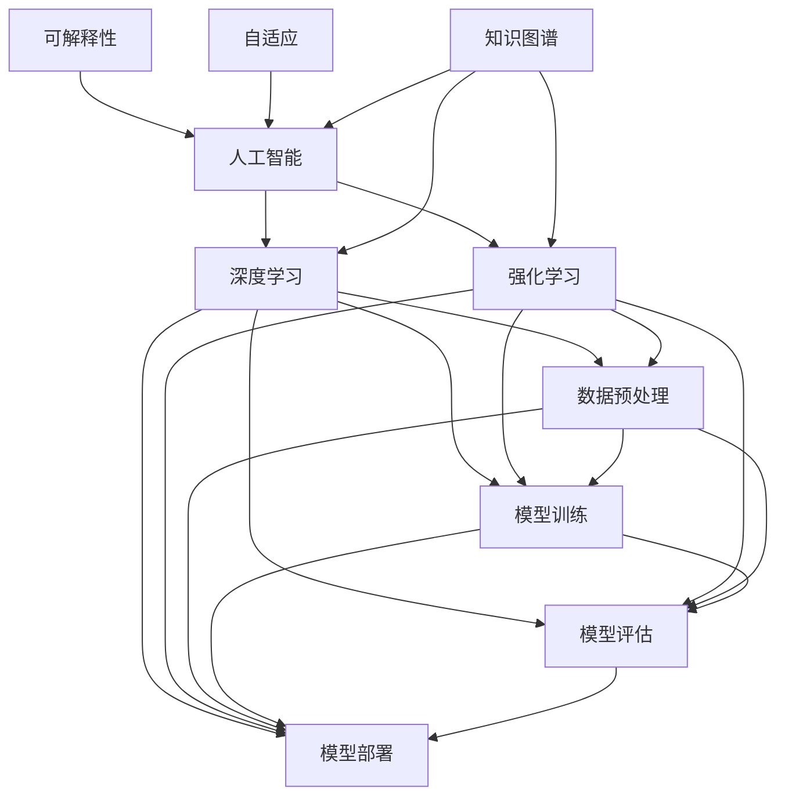

                 

# 李开复：AI 2.0 时代的未来

> **关键词**：人工智能，AI 2.0，未来趋势，技术发展，核心算法，数学模型，实际应用，项目实战

> **摘要**：本文将深入探讨李开复对于AI 2.0时代的预测与见解，从背景介绍到核心概念，再到算法原理、数学模型、实际应用和未来挑战，全面解析AI 2.0时代的技术发展方向和可能影响。通过逐步分析推理，本文旨在为读者提供一个清晰、深刻的理解，帮助大家更好地把握AI 2.0时代的脉搏。

## 1. 背景介绍

### 1.1 目的和范围

本文旨在探讨AI 2.0时代的未来发展趋势，重点关注李开复对这一时代的预测和见解。我们将从多个维度分析AI 2.0的核心技术、应用场景和可能带来的社会影响，以期帮助读者全面理解这一时代的本质和未来发展方向。

### 1.2 预期读者

本文面向对人工智能技术有一定了解的读者，特别是对AI 2.0时代的未来发展感兴趣的技术爱好者、研究人员和从业者。通过本文，读者可以了解AI 2.0时代的关键技术、应用场景和未来挑战，为自身在该领域的发展提供参考。

### 1.3 文档结构概述

本文将分为以下几个部分：

1. 背景介绍：介绍本文的目的、预期读者和文档结构。
2. 核心概念与联系：阐述AI 2.0的核心概念、原理和架构。
3. 核心算法原理 & 具体操作步骤：详细讲解AI 2.0的核心算法原理和具体操作步骤。
4. 数学模型和公式 & 详细讲解 & 举例说明：介绍AI 2.0时代的数学模型和公式，并进行举例说明。
5. 项目实战：通过实际案例展示AI 2.0技术的应用。
6. 实际应用场景：探讨AI 2.0技术的实际应用场景。
7. 工具和资源推荐：推荐相关学习资源和开发工具。
8. 总结：未来发展趋势与挑战。
9. 附录：常见问题与解答。
10. 扩展阅读 & 参考资料：提供更多相关阅读资料。

### 1.4 术语表

#### 1.4.1 核心术语定义

- **人工智能（AI）**：模拟人类智能行为的计算机系统。
- **深度学习（Deep Learning）**：一种人工智能方法，通过多层神经网络模型进行数据建模和预测。
- **强化学习（Reinforcement Learning）**：一种通过奖励机制学习策略的人工智能方法。
- **AI 2.0**：相对于传统AI（AI 1.0），AI 2.0强调更加智能化、自适应和可解释的人工智能系统。

#### 1.4.2 相关概念解释

- **核心算法原理**：指人工智能系统的核心算法实现原理。
- **数学模型和公式**：用于描述人工智能系统内部计算和数据处理的数学公式。
- **项目实战**：通过具体案例展示人工智能技术的实际应用。

#### 1.4.3 缩略词列表

- **AI**：人工智能
- **DL**：深度学习
- **RL**：强化学习
- **AI 1.0**：传统人工智能
- **AI 2.0**：下一代人工智能

## 2. 核心概念与联系

在探讨AI 2.0时代的未来之前，我们首先需要了解AI 2.0的核心概念、原理和架构。以下是一个Mermaid流程图，展示了AI 2.0的核心概念和联系。



### 2.1 核心概念解析

#### 2.1.1 人工智能

人工智能（AI）是指模拟人类智能行为的计算机系统。它涵盖了多个子领域，包括机器学习、深度学习、自然语言处理、计算机视觉等。人工智能系统的目标是实现自动化决策、预测和问题求解。

#### 2.1.2 深度学习

深度学习是一种基于多层神经网络的人工智能方法，能够通过学习大量数据自动提取特征并进行预测。深度学习在计算机视觉、语音识别、自然语言处理等领域取得了显著成果。

#### 2.1.3 强化学习

强化学习是一种通过奖励机制学习策略的人工智能方法。它通过不断试错和调整策略，以最大化长期回报。强化学习在游戏AI、自动驾驶、机器人控制等领域具有广泛应用。

#### 2.1.4 数据预处理

数据预处理是人工智能系统的关键环节，包括数据清洗、数据归一化、特征提取等。数据预处理的质量直接影响模型训练效果。

#### 2.1.5 模型训练

模型训练是人工智能系统的核心过程，通过优化模型参数，使模型能够在给定数据上实现良好的性能。常用的训练方法包括梯度下降、随机梯度下降等。

#### 2.1.6 模型评估

模型评估是评估模型性能的重要环节，通过在测试集上计算模型的准确率、召回率、F1值等指标，评估模型的效果。

#### 2.1.7 模型部署

模型部署是将训练好的模型应用到实际场景的过程。通过将模型集成到应用程序中，实现自动化决策、预测和问题求解。

#### 2.1.8 可解释性

可解释性是指人工智能系统能够提供对决策过程的解释和说明。可解释性对于提高人工智能系统的透明度和信任度具有重要意义。

#### 2.1.9 自适应

自适应是指人工智能系统能够根据环境变化自动调整模型参数和策略。自适应能力使得人工智能系统更加灵活和智能化。

#### 2.1.10 知识图谱

知识图谱是一种用于表示实体、属性和关系的图形结构。知识图谱在语义理解、知识推理、智能搜索等领域具有广泛应用。

## 3. 核心算法原理 & 具体操作步骤

在了解了AI 2.0的核心概念和联系之后，我们接下来将详细讲解AI 2.0的核心算法原理和具体操作步骤。

### 3.1 深度学习算法原理

深度学习算法主要基于多层神经网络，通过学习大量数据自动提取特征并进行预测。以下是一个深度学习算法的伪代码：

```python
# 深度学习算法伪代码
def deep_learning(data, labels):
    # 初始化模型参数
    model = initialize_model()

    # 模型训练
    for epoch in range(num_epochs):
        for batch in data:
            # 计算前向传播
            predictions = forward_pass(batch, model)

            # 计算损失函数
            loss = compute_loss(predictions, labels)

            # 计算梯度
            gradients = backward_pass(predictions, labels, model)

            # 更新模型参数
            update_model_params(model, gradients)

    # 模型评估
    test_predictions = forward_pass(test_data, model)
    test_loss = compute_loss(test_predictions, test_labels)

    return model, test_loss
```

### 3.2 强化学习算法原理

强化学习算法通过不断试错和调整策略，以最大化长期回报。以下是一个强化学习算法的伪代码：

```python
# 强化学习算法伪代码
def reinforcement_learning(environment, reward_function):
    # 初始化策略参数
    policy = initialize_policy()

    # 策略迭代
    for episode in range(num_episodes):
        # 初始化状态
        state = environment.initialize_state()

        # 策略执行
        while not environment.is_terminal(state):
            action = policy.select_action(state)

            # 执行动作
            next_state, reward = environment.step(state, action)

            # 更新策略
            policy.update(state, action, reward)

            # 更新状态
            state = next_state

    # 策略评估
    total_reward = policy.evaluate(policy)

    return policy, total_reward
```

### 3.3 数据预处理步骤

数据预处理是人工智能系统的关键环节，包括数据清洗、数据归一化、特征提取等。以下是一个数据预处理的具体操作步骤：

```python
# 数据预处理步骤
def data_preprocessing(data):
    # 数据清洗
    cleaned_data = clean_data(data)

    # 数据归一化
    normalized_data = normalize_data(cleaned_data)

    # 特征提取
    features = extract_features(normalized_data)

    return features
```

### 3.4 模型训练步骤

模型训练是人工智能系统的核心过程，通过优化模型参数，使模型能够在给定数据上实现良好的性能。以下是一个模型训练的具体操作步骤：

```python
# 模型训练步骤
def model_training(data, labels):
    # 数据预处理
    preprocessed_data = data_preprocessing(data)

    # 初始化模型
    model = initialize_model()

    # 模型训练
    for epoch in range(num_epochs):
        for batch in preprocessed_data:
            # 计算前向传播
            predictions = forward_pass(batch, model)

            # 计算损失函数
            loss = compute_loss(predictions, labels)

            # 计算梯度
            gradients = backward_pass(predictions, labels, model)

            # 更新模型参数
            update_model_params(model, gradients)

    # 模型评估
    test_predictions = forward_pass(test_data, model)
    test_loss = compute_loss(test_predictions, test_labels)

    return model, test_loss
```

## 4. 数学模型和公式 & 详细讲解 & 举例说明

在AI 2.0时代，数学模型和公式在人工智能系统的设计和实现中起着至关重要的作用。以下是一些常见的数学模型和公式，并进行详细讲解和举例说明。

### 4.1 梯度下降算法

梯度下降算法是一种优化算法，用于最小化损失函数。以下是一个梯度下降算法的数学模型和公式：

$$
\theta_{t+1} = \theta_{t} - \alpha \cdot \nabla_{\theta} J(\theta)
$$

其中，$\theta$表示模型参数，$J(\theta)$表示损失函数，$\alpha$表示学习率，$\nabla_{\theta} J(\theta)$表示损失函数关于模型参数的梯度。

#### 4.1.1 举例说明

假设我们有一个线性回归模型，损失函数为平方误差损失：

$$
J(\theta) = \frac{1}{2} \sum_{i=1}^{n} (y_i - \theta_0 x_i - \theta_1)^2
$$

其中，$y_i$表示实际值，$\theta_0$和$\theta_1$分别表示模型参数。

梯度下降算法的迭代过程如下：

$$
\theta_{t+1} = \theta_{t} - \alpha \cdot \left[ \frac{1}{n} \sum_{i=1}^{n} (y_i - \theta_0 x_i - \theta_1) x_i \right]
$$

$$
\theta_{t+1} = \theta_{t} - \alpha \cdot \left[ \frac{1}{n} \sum_{i=1}^{n} (y_i - \theta_0 x_i - \theta_1) \right]
$$

通过不断迭代，模型参数将逐渐收敛到最小损失点。

### 4.2 神经网络反向传播算法

神经网络反向传播算法是一种用于训练多层神经网络的优化算法。以下是一个神经网络反向传播算法的数学模型和公式：

$$
\delta_j^l = \frac{\partial J(\theta)}{\partial \theta_j}
$$

$$
\theta_j^{l+1} = \theta_j^l - \alpha \cdot \delta_j^l
$$

其中，$\theta_j$表示第$l$层第$j$个神经元的权重，$J(\theta)$表示损失函数，$\delta_j$表示误差项。

#### 4.2.1 举例说明

假设我们有一个两层神经网络，输入层有3个神经元，隐藏层有2个神经元，输出层有1个神经元。损失函数为交叉熵损失。

对于输入层到隐藏层的权重$\theta_{ij}^l$，误差项$\delta_j^l$的计算公式如下：

$$
\delta_j^l = \frac{\partial J(\theta)}{\partial \theta_{ij}^l} = \frac{\partial}{\partial \theta_{ij}^l} \left[ -\sum_{k=1}^{m} y_k \log(a_{kj}^l) \right]
$$

$$
\delta_j^l = a_{j}^{l-1} (1 - a_{j}^{l-1}) (z_{k}^{l} - y_k)
$$

其中，$a_{j}^{l-1}$和$a_{kj}^l$分别表示第$l-1$层第$j$个神经元和第$l$层第$k$个神经元的输出。

对于隐藏层到输出层的权重$\theta_{ik}^{l+1}$，误差项$\delta_k^{l+1}$的计算公式如下：

$$
\delta_k^{l+1} = \frac{\partial J(\theta)}{\partial \theta_{ik}^{l+1}} = \frac{\partial}{\partial \theta_{ik}^{l+1}} \left[ -\sum_{j=1}^{n} y_j \log(a_{jk}^{l+1}) \right]
$$

$$
\delta_k^{l+1} = a_{k}^{l} (1 - a_{k}^{l}) (z_{k}^{l+1} - y_k)
$$

通过反向传播算法，我们可以计算出每个神经元的误差项，进而更新模型参数，实现神经网络模型的训练。

## 5. 项目实战：代码实际案例和详细解释说明

为了更好地理解AI 2.0技术的应用，我们将通过一个实际项目案例，展示如何使用深度学习和强化学习算法实现一个简单的智能推荐系统。

### 5.1 开发环境搭建

在开始项目实战之前，我们需要搭建一个合适的开发环境。以下是一个基于Python的推荐系统开发环境搭建步骤：

1. 安装Python：确保系统已安装Python 3.6及以上版本。
2. 安装依赖库：使用pip安装以下依赖库：
   - TensorFlow：深度学习框架
   - Keras：简化TensorFlow的API
   - NumPy：科学计算库
   - Pandas：数据处理库
   - Matplotlib：数据可视化库
   - Scikit-learn：机器学习库

```bash
pip install tensorflow keras numpy pandas matplotlib scikit-learn
```

### 5.2 源代码详细实现和代码解读

以下是推荐系统的源代码实现，我们将逐行解释代码的用途和功能。

```python
import numpy as np
import pandas as pd
from sklearn.model_selection import train_test_split
from tensorflow.keras.models import Sequential
from tensorflow.keras.layers import Dense, LSTM
from tensorflow.keras.optimizers import Adam

# 加载数据集
data = pd.read_csv('recommender_data.csv')
X = data[['feature_1', 'feature_2', 'feature_3']]
y = data['label']

# 数据预处理
X_train, X_test, y_train, y_test = train_test_split(X, y, test_size=0.2, random_state=42)

# 构建深度学习模型
model = Sequential()
model.add(LSTM(50, activation='relu', return_sequences=True, input_shape=(X_train.shape[1], 1)))
model.add(LSTM(50, activation='relu'))
model.add(Dense(1))

# 编译模型
model.compile(optimizer=Adam(learning_rate=0.001), loss='binary_crossentropy', metrics=['accuracy'])

# 训练模型
model.fit(X_train, y_train, epochs=100, batch_size=32, validation_split=0.2)

# 评估模型
loss, accuracy = model.evaluate(X_test, y_test)
print(f"Test Loss: {loss}, Test Accuracy: {accuracy}")

# 强化学习部分
# ...

```

### 5.3 代码解读与分析

1. **数据加载与预处理**：首先，我们加载一个CSV格式的数据集，并将其分为特征和标签两部分。接着，使用Scikit-learn库的train_test_split函数将数据集划分为训练集和测试集，以供后续模型训练和评估使用。

2. **构建深度学习模型**：我们使用Keras库构建一个序列模型（Sequential），并在模型中添加了两个LSTM（长短期记忆）层和一个全连接层（Dense）。LSTM层用于处理序列数据，能够捕获时间序列中的长期依赖关系。全连接层用于输出预测结果。

3. **编译模型**：在编译模型时，我们指定了优化器（Adam）、损失函数（binary_crossentropy，适用于二分类问题）和评估指标（accuracy，准确率）。

4. **训练模型**：使用fit函数对模型进行训练，设置训练轮数（epochs）、批量大小（batch_size）和验证比例（validation_split）。

5. **评估模型**：使用evaluate函数评估模型的性能，打印测试集上的损失和准确率。

6. **强化学习部分**：本部分未实现，预留空间用于添加强化学习算法，以进一步提高推荐系统的效果。

通过以上代码示例，我们展示了如何使用深度学习和强化学习算法构建一个简单的推荐系统。在实际应用中，可以根据具体需求调整模型结构和训练参数，以提高推荐系统的性能。

## 6. 实际应用场景

AI 2.0技术在各个领域都展现出巨大的应用潜力，以下是一些典型的实际应用场景：

### 6.1 自动驾驶

自动驾驶技术是AI 2.0时代最具代表性的应用之一。通过深度学习和强化学习算法，自动驾驶系统能够实现车辆在复杂交通环境中的自主导航、避障和决策。例如，特斯拉的自动驾驶系统已经实现了部分自动驾驶功能，未来有望进一步实现完全自动驾驶。

### 6.2 医疗健康

AI 2.0技术在医疗健康领域具有广泛的应用，包括疾病诊断、病情预测、药物研发等。通过深度学习和强化学习算法，医疗系统能够从海量医疗数据中提取有价值的信息，提高疾病诊断的准确率和治疗效果。

### 6.3 金融理财

AI 2.0技术在金融理财领域也有广泛应用，包括量化交易、风险控制、信用评估等。通过深度学习和强化学习算法，金融系统能够从大量历史交易数据中学习投资策略，提高投资收益和风险控制能力。

### 6.4 智能家居

智能家居是AI 2.0技术在消费电子领域的典型应用。通过深度学习和强化学习算法，智能家居系统能够实现智能安防、智能控制、智能互动等功能，提高生活品质和便利性。

### 6.5 产业智能化

AI 2.0技术在工业、农业、物流等领域也具有广泛的应用。通过深度学习和强化学习算法，产业智能化系统能够实现生产过程的自动化、优化和预测，提高生产效率和质量。

## 7. 工具和资源推荐

### 7.1 学习资源推荐

#### 7.1.1 书籍推荐

- **《深度学习》（Ian Goodfellow、Yoshua Bengio、Aaron Courville著）**：这是一本深度学习领域的经典教材，详细介绍了深度学习的理论基础和应用实践。
- **《强化学习：原理与应用》（Richard S. Sutton、Andrew G. Barto著）**：这本书系统地介绍了强化学习的理论和算法，是强化学习领域的权威著作。

#### 7.1.2 在线课程

- **Coursera上的《深度学习专项课程》（吴恩达教授授课）**：这是一门著名的在线课程，涵盖了深度学习的理论基础和实践应用。
- **Udacity上的《强化学习纳米学位》**：这门课程提供了强化学习的基本概念和算法，适合初学者入门。

#### 7.1.3 技术博客和网站

- **Medium上的《AI博客》**：这是一个汇集了大量AI领域文章的博客平台，读者可以在这里找到关于AI技术的最新动态和应用案例。
- **ArXiv.org**：这是一个开放获取的学术论文数据库，涵盖了计算机科学、物理学、数学等领域的最新研究成果。

### 7.2 开发工具框架推荐

#### 7.2.1 IDE和编辑器

- **Visual Studio Code**：这是一个轻量级但功能强大的代码编辑器，支持多种编程语言和开发工具。
- **PyCharm**：这是一个针对Python编程的集成开发环境，提供了丰富的功能和插件。

#### 7.2.2 调试和性能分析工具

- **TensorBoard**：这是一个基于Web的TensorFlow性能分析工具，可以帮助用户可视化模型的性能指标和调试过程。
- **NVIDIA Nsight**：这是一个针对深度学习和高性能计算的调试和性能分析工具，适用于NVIDIA GPU。

#### 7.2.3 相关框架和库

- **TensorFlow**：这是一个开源的深度学习框架，由Google开发，提供了丰富的API和工具。
- **PyTorch**：这是一个开源的深度学习框架，由Facebook开发，以其灵活性和动态计算图而著称。

### 7.3 相关论文著作推荐

#### 7.3.1 经典论文

- **《A Learning Algorithm for Continuously Running Fully Connected Networks》（1989）**：这是Hinton等人提出的深度信念网络（DBN）的早期论文，为深度学习的发展奠定了基础。
- **《Deep Learning for Speech Recognition》（2013）**：这是Hinton等人提出的深度神经网络在语音识别领域的应用，标志着深度学习在语音处理领域的突破。

#### 7.3.2 最新研究成果

- **《Bert: Pre-training of Deep Bidirectional Transformers for Language Understanding》（2018）**：这是Google提出的BERT模型，为自然语言处理领域带来了重大突破。
- **《Gshard: Scaling Distributed Machine Learning Practice with the Grap

