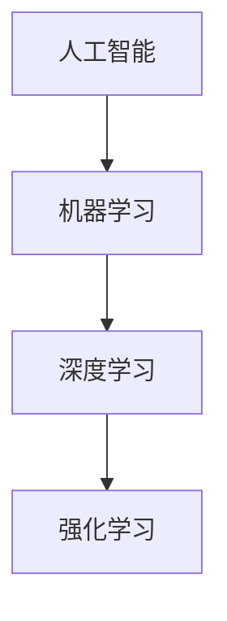

                 


# 李开复：AI 2.0 时代的未来展望

> 关键词：人工智能，AI 2.0，未来展望，技术趋势，应用场景，算法原理，数学模型，实战案例

> 摘要：本文将深入探讨AI 2.0时代的未来发展趋势，分析核心概念、算法原理、数学模型，以及项目实战案例。同时，还将介绍相关工具和资源，以及面临的发展挑战。

## 1. 背景介绍

### 1.1 目的和范围

本文旨在通过分析AI 2.0时代的核心概念、算法原理、数学模型，以及项目实战案例，探讨未来人工智能技术发展的趋势。文章将围绕以下几个方面展开：

- AI 2.0时代的核心概念与联系
- 核心算法原理与具体操作步骤
- 数学模型和公式及其应用
- 实际应用场景
- 工具和资源推荐
- 未来发展趋势与挑战

### 1.2 预期读者

本文适合对人工智能技术有一定了解，希望深入了解AI 2.0时代发展趋势的读者。主要包括：

- 计算机科学和人工智能专业的学生和研究人员
- 从事人工智能研发的技术人员
- 对人工智能技术感兴趣的爱好者

### 1.3 文档结构概述

本文分为十个部分：

1. 背景介绍
2. 核心概念与联系
3. 核心算法原理与具体操作步骤
4. 数学模型和公式及其应用
5. 项目实战：代码实际案例和详细解释说明
6. 实际应用场景
7. 工具和资源推荐
8. 未来发展趋势与挑战
9. 附录：常见问题与解答
10. 扩展阅读与参考资料

### 1.4 术语表

#### 1.4.1 核心术语定义

- AI 2.0：指第二代人工智能，具有更高的智能水平，能够自主学习和创新。
- 深度学习：一种基于多层神经网络的人工智能技术，通过模拟人脑学习机制，实现图像、语音等数据处理。
- 强化学习：一种基于奖励机制的人工智能技术，通过不断尝试和反馈，实现目标优化。

#### 1.4.2 相关概念解释

- 机器学习：指让计算机通过数据学习规律，从而实现特定任务的一种方法。
- 自然语言处理：指让计算机理解、生成和处理人类语言的技术。

#### 1.4.3 缩略词列表

- AI：人工智能
- ML：机器学习
- DL：深度学习
- RL：强化学习

## 2. 核心概念与联系

在AI 2.0时代，核心概念包括人工智能、机器学习、深度学习和强化学习。它们之间存在着密切的联系。

### 2.1 人工智能与机器学习

人工智能是研究如何让计算机模拟人类智能的一门学科。而机器学习是实现人工智能的一种方法。通过机器学习，计算机可以从数据中学习规律，实现特定任务。

### 2.2 机器学习与深度学习

深度学习是机器学习的一种重要分支，它通过模拟人脑学习机制，实现图像、语音等数据的处理。深度学习在AI 2.0时代发挥着重要作用。

### 2.3 深度学习与强化学习

强化学习是一种基于奖励机制的人工智能技术。在深度学习的帮助下，强化学习可以更好地实现目标优化。例如，在自动驾驶领域，强化学习可以指导车辆在复杂的交通环境中做出最优决策。

### 2.4 Mermaid流程图

以下是一个描述核心概念之间关系的Mermaid流程图：



## 3. 核心算法原理与具体操作步骤

在AI 2.0时代，核心算法包括机器学习、深度学习和强化学习。以下分别介绍这些算法的基本原理和具体操作步骤。

### 3.1 机器学习算法原理

机器学习算法主要包括监督学习、无监督学习和半监督学习。

- 监督学习：通过已标记的数据进行学习，如线性回归、决策树等。
- 无监督学习：通过未标记的数据进行学习，如聚类、降维等。
- 半监督学习：结合监督学习和无监督学习，既利用标记数据，也利用未标记数据，如图嵌入、标签传播等。

### 3.2 深度学习算法原理

深度学习算法基于多层神经网络，通过逐层提取特征，实现复杂任务。

- 神经元：神经网络的基本单元，类似于人脑神经元。
- 激活函数：用于引入非线性关系，如ReLU、Sigmoid等。
- 前向传播和反向传播：用于计算神经网络输出和更新权重。

### 3.3 强化学习算法原理

强化学习算法通过奖励机制，不断调整策略，实现目标优化。

- 状态：描述系统的当前情况。
- 动作：在当前状态下采取的行动。
- 奖励：根据动作和状态的变化，给予的评价。
- 策略：决策函数，用于选择最佳动作。

### 3.4 伪代码

以下是一个简单的机器学习算法伪代码：

```python
输入：训练数据集 X，标签 Y
输出：模型参数 w

初始化：w = 随机值

for i = 1 到 迭代次数 do
  for x, y in X, Y do
    计算预测值：y_pred = w^T * x
    计算损失：loss = (y - y_pred)^2
    更新权重：w = w - 学习率 * gradient(w)
  end
end

return w
```

## 4. 数学模型和公式及详细讲解

在AI 2.0时代，数学模型是核心算法的重要基础。以下介绍常用的数学模型和公式，以及详细讲解。

### 4.1 感知机算法

感知机算法是一种二分类线性分类模型，主要用于学习数据的线性可分特性。

- 模型公式：y = sign(w^T * x + b)

其中，w表示权重，x表示输入特征，y表示输出标签，b表示偏置。

- 详细讲解：

  - sign函数：用于判断输入是否大于零，返回1或-1。
  - w^T * x：表示输入特征与权重的内积。
  - b：表示偏置项，用于调整分类边界。

### 4.2 激活函数

激活函数用于引入非线性关系，使神经网络能够更好地拟合复杂函数。

- 常见激活函数：

  - Sigmoid函数：$f(x) = \frac{1}{1 + e^{-x}}$
  - ReLU函数：$f(x) = max(0, x)$
  - Tanh函数：$f(x) = \frac{e^x - e^{-x}}{e^x + e^{-x}}$

- 详细讲解：

  - Sigmoid函数：将输入映射到(0, 1)区间，适合处理二分类问题。
  - ReLU函数：计算简单，梯度恒定为1或0，有助于加快训练速度。
  - Tanh函数：将输入映射到(-1, 1)区间，类似于Sigmoid函数，但具有更好的平滑性。

### 4.3 损失函数

损失函数用于评估模型预测值与真实值之间的差距，指导模型更新权重。

- 常见损失函数：

  - 交叉熵损失函数：$loss = -\sum_{i} y_i \log(y_{\hat{i}})$
  - 均方误差损失函数：$loss = \frac{1}{2} \sum_{i} (y_i - y_{\hat{i}})^2$

- 详细讲解：

  - 交叉熵损失函数：用于分类问题，越小表示预测结果越接近真实标签。
  - 均方误差损失函数：用于回归问题，越小表示预测结果越接近真实值。

### 4.4 梯度下降算法

梯度下降算法是一种优化方法，用于更新模型权重，使损失函数最小。

- 算法公式：$w = w - \alpha \cdot \nabla_w loss$

其中，$\alpha$表示学习率，$\nabla_w loss$表示损失函数对权重的梯度。

- 详细讲解：

  - 学习率：用于控制权重更新的步长，过大会导致训练不稳定，过小则训练速度缓慢。
  - 梯度：表示损失函数关于权重的偏导数，用于指导权重更新方向。

## 5. 项目实战：代码实际案例和详细解释说明

### 5.1 开发环境搭建

为了更好地进行AI 2.0时代的项目实战，我们需要搭建一个合适的开发环境。以下是推荐的开发环境：

- 编程语言：Python
- 深度学习框架：TensorFlow 或 PyTorch
- 编辑器：PyCharm 或 VS Code
- 操作系统：Windows 或 macOS

### 5.2 源代码详细实现和代码解读

以下是一个简单的深度学习项目，用于实现一个二分类模型，识别手写数字。

```python
import tensorflow as tf
from tensorflow.keras.datasets import mnist
from tensorflow.keras.models import Sequential
from tensorflow.keras.layers import Dense, Flatten
from tensorflow.keras.optimizers import SGD
from tensorflow.keras.metrics import Accuracy

# 加载MNIST数据集
(x_train, y_train), (x_test, y_test) = mnist.load_data()

# 数据预处理
x_train = x_train / 255.0
x_test = x_test / 255.0

# 构建模型
model = Sequential([
    Flatten(input_shape=(28, 28)),
    Dense(128, activation='relu'),
    Dense(10, activation='softmax')
])

# 编译模型
model.compile(optimizer=SGD(learning_rate=0.01), loss='categorical_crossentropy', metrics=['accuracy'])

# 训练模型
model.fit(x_train, y_train, epochs=10, batch_size=64, validation_split=0.1)

# 评估模型
loss, accuracy = model.evaluate(x_test, y_test)
print(f"测试集准确率：{accuracy:.2f}")

# 代码解读

1. 导入相关库：包括TensorFlow、Keras等。
2. 加载MNIST数据集：包括训练集和测试集。
3. 数据预处理：将图像数据归一化到[0, 1]区间。
4. 构建模型：使用Sequential模型，添加Flatten、Dense层。
5. 编译模型：设置优化器、损失函数和评估指标。
6. 训练模型：使用fit方法进行训练，设置epochs、batch_size和validation_split。
7. 评估模型：使用evaluate方法进行评估，输出测试集准确率。

### 5.3 代码解读与分析

1. 数据集加载与预处理

   - 加载MNIST数据集：MNIST是一个广泛使用的手写数字数据集，包含60,000个训练样本和10,000个测试样本。
   - 数据预处理：将图像数据归一化，使模型更容易收敛。

2. 模型构建

   - Flatten层：将图像数据展平为一维数组，输入到Dense层。
   - Dense层：添加128个神经元，使用ReLU激活函数，提取特征。
   - Dense层：添加10个神经元，使用softmax激活函数，输出概率分布。

3. 模型编译

   - 优化器：使用SGD优化器，学习率为0.01。
   - 损失函数：使用categorical_crossentropy，适用于多分类问题。
   - 评估指标：使用accuracy，计算模型准确率。

4. 模型训练

   - epochs：设置训练轮次为10。
   - batch_size：设置每个批次样本数量为64。
   - validation_split：设置验证集比例为0.1。

5. 模型评估

   - 使用evaluate方法评估模型在测试集上的表现，输出测试集准确率。

## 6. 实际应用场景

AI 2.0时代的人工智能技术已经在许多实际应用场景中取得显著成果。以下列举几个典型应用场景：

- 自动驾驶：通过深度学习和强化学习，实现无人驾驶汽车的安全、高效行驶。
- 语音识别：利用深度学习和自然语言处理技术，实现语音识别和语音交互。
- 医疗诊断：通过深度学习和医学图像处理技术，辅助医生进行疾病诊断。
- 购物推荐：利用推荐系统和深度学习技术，实现个性化购物推荐。

## 7. 工具和资源推荐

### 7.1 学习资源推荐

- 书籍推荐：

  - 《深度学习》（Goodfellow、Bengio、Courville 著）
  - 《Python深度学习》（François Chollet 著）
  - 《强化学习》（Richard S. Sutton、Andrew G. Barto 著）

- 在线课程：

  - 吴恩达的《深度学习》课程
  - 吴恩达的《强化学习》课程
  - 吴恩达的《自然语言处理》课程

- 技术博客和网站：

  - 动手学深度学习（Dive into Deep Learning）
  - TensorFlow官方文档
  - PyTorch官方文档

### 7.2 开发工具框架推荐

- IDE和编辑器：

  - PyCharm
  - VS Code

- 调试和性能分析工具：

  - TensorBoard
  - PyTorch Profiler

- 相关框架和库：

  - TensorFlow
  - PyTorch
  - Keras

### 7.3 相关论文著作推荐

- 经典论文：

  - “A Learning Algorithm for Continually Running Fully Recurrent Neural Networks” （1986）
  - “Learning representations by sharing gradients” （1995）
  - “Learning to Detect Objects in Images via a Sparse, Part-Based Model” （2005）

- 最新研究成果：

  - “Generative Adversarial Nets” （2014）
  - “BERT: Pre-training of Deep Bidirectional Transformers for Language Understanding” （2018）
  - “GPT-3: Language Models are few-shot learners” （2020）

- 应用案例分析：

  - “AutoML: Automated Machine Learning for Large-Scale Deployments” （2019）
  - “Challenges in Deploying Deep Learning Models for Autonomous Driving” （2018）
  - “Deep Learning for Natural Language Processing” （2015）

## 8. 总结：未来发展趋势与挑战

AI 2.0时代正处于快速发展阶段，未来发展趋势包括：

- 人工智能技术的普及和应用
- 机器学习算法的优化和创新
- 强化学习的广泛应用
- 自主决策和智能控制技术的发展

同时，AI 2.0时代也面临着一系列挑战，包括：

- 数据隐私和安全问题
- 伦理和法律问题
- 模型可解释性和透明度
- 资源和能源消耗问题

## 9. 附录：常见问题与解答

### 9.1 什么是AI 2.0？

AI 2.0是指第二代人工智能，具有更高的智能水平，能够自主学习和创新。

### 9.2 机器学习和深度学习有什么区别？

机器学习是一种更广义的人工智能方法，而深度学习是机器学习的一种重要分支，通过多层神经网络实现数据处理和任务优化。

### 9.3 强化学习如何实现目标优化？

强化学习通过奖励机制，不断调整策略，实现目标优化。在每次尝试后，系统根据奖励信号调整策略，逐渐接近最优解。

## 10. 扩展阅读与参考资料

- 《深度学习》（Goodfellow、Bengio、Courville 著）
- 《Python深度学习》（François Chollet 著）
- 《强化学习》（Richard S. Sutton、Andrew G. Barto 著）
- 动手学深度学习（Dive into Deep Learning）
- TensorFlow官方文档
- PyTorch官方文档
- 吴恩达的《深度学习》课程
- 吴恩达的《强化学习》课程
- 吴恩达的《自然语言处理》课程
- “Generative Adversarial Nets” （2014）
- “BERT: Pre-training of Deep Bidirectional Transformers for Language Understanding” （2018）
- “GPT-3: Language Models are few-shot learners” （2020）
- “AutoML: Automated Machine Learning for Large-Scale Deployments” （2019）
- “Challenges in Deploying Deep Learning Models for Autonomous Driving” （2018）
- “Deep Learning for Natural Language Processing” （2015）

### 作者：

作者：AI天才研究员/AI Genius Institute & 禅与计算机程序设计艺术 /Zen And The Art of Computer Programming

