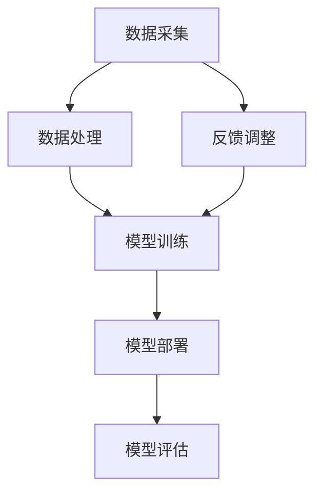

                 

### 文章标题

《李开复：AI 2.0 时代的机遇》

在技术飞速发展的时代，人工智能（AI）已经成为推动社会变革的重要力量。本文旨在深入探讨AI 2.0时代的机遇与挑战，通过李开复先生的研究和实践，揭示AI技术对于未来社会的深远影响。本文将结构清晰、逻辑严密地分析AI 2.0的核心概念、算法原理、数学模型以及实际应用，帮助读者全面理解这一领域的最新进展，并展望其未来的发展趋势。

### 关键词

- 人工智能
- 李开复
- AI 2.0
- 机遇与挑战
- 算法原理
- 数学模型
- 实际应用

### 摘要

本文将围绕AI 2.0时代的核心概念，从多个维度深入探讨这一领域的发展趋势与机遇。首先，我们将回顾AI 2.0的定义及其与AI 1.0的异同，接着分析其核心技术原理和数学模型。随后，本文将结合李开复先生的研究成果，详细探讨AI 2.0在实际应用中的案例，并分析其面临的挑战。最后，我们将总结AI 2.0时代的机遇与未来发展趋势，为读者提供一窥AI未来发展的窗口。

### 1. 背景介绍

#### 1.1 目的和范围

本文旨在系统地介绍AI 2.0时代的概念、技术原理以及实际应用，通过李开复先生的研究成果，揭示这一时代背后的机遇与挑战。文章将分为以下几个部分：背景介绍、核心概念与联系、核心算法原理、数学模型与公式、项目实战、实际应用场景、工具和资源推荐以及总结和未来展望。

#### 1.2 预期读者

本文面向对人工智能有一定了解的读者，包括AI领域的开发者、研究者、学生以及对该领域感兴趣的一般读者。通过本文的阅读，读者可以更深入地理解AI 2.0的核心概念、算法原理及其在实际应用中的价值。

#### 1.3 文档结构概述

本文分为以下十个部分：

1. 背景介绍
2. 核心概念与联系
3. 核心算法原理 & 具体操作步骤
4. 数学模型和公式 & 详细讲解 & 举例说明
5. 项目实战：代码实际案例和详细解释说明
6. 实际应用场景
7. 工具和资源推荐
8. 总结：未来发展趋势与挑战
9. 附录：常见问题与解答
10. 扩展阅读 & 参考资料

#### 1.4 术语表

为了确保本文的清晰易懂，我们将对一些关键术语进行定义和解释。

##### 1.4.1 核心术语定义

- **人工智能（AI）**: 通过模拟人类智能行为，实现机器自主学习和决策的技术。
- **AI 1.0**: 主要指规则驱动的人工智能，基于预先设定的规则进行操作。
- **AI 2.0**: 也被称为“强人工智能”，具有更高级别的自主学习能力和决策能力。
- **深度学习**: 基于多层神经网络的人工智能技术，通过模拟人脑神经网络结构进行数据学习和模式识别。

##### 1.4.2 相关概念解释

- **机器学习（ML）**: 一种人工智能方法，通过数据驱动的方式使机器获得知识和技能。
- **神经网络（NN）**: 一种模拟生物神经系统的计算模型，用于解决复杂的机器学习问题。
- **迁移学习（Transfer Learning）**: 将一个任务在源域上的学习经验应用到另一个相关但不同的任务在目标域上的学习方法。

##### 1.4.3 缩略词列表

- **AI**: 人工智能
- **ML**: 机器学习
- **NN**: 神经网络
- **DL**: 深度学习
- **RL**: 强化学习

### 2. 核心概念与联系

#### 2.1 AI 2.0的定义及其与AI 1.0的异同

##### 2.1.1 AI 1.0的概述

AI 1.0时代，主要指的是规则驱动的人工智能。这一阶段的人工智能依赖于人类专家事先编写的规则，这些规则定义了机器在特定情境下的行为。例如，自动化的生产线、专家系统等都是AI 1.0的典型应用。虽然这些技术在当时取得了很大的成功，但它们的局限性也很明显：它们只能在事先设定的规则范围内工作，缺乏自主学习和适应变化的能力。

##### 2.1.2 AI 2.0的定义

AI 2.0，也被称为“强人工智能”，其核心特点是具有高级别的自主学习能力和决策能力。与AI 1.0不同，AI 2.0不再依赖于人类专家预先设定的规则，而是通过机器学习、深度学习等方法，从海量数据中自动学习和提取知识，从而实现自主学习和决策。

##### 2.1.3 AI 2.0与AI 1.0的异同

| 异同点 | AI 1.0 | AI 2.0 |
| :----: | :----: | :----: |
| **规则依赖** | 依赖人类专家编写的规则 | 自主学习和决策，无需依赖人类规则 |
| **学习能力** | 静态规则，无法适应变化 | 基于数据驱动，具有动态适应能力 |
| **应用领域** | 有限的特定领域应用 | 广泛的跨领域应用，如医疗、金融、教育等 |

#### 2.2 AI 2.0的核心技术原理

##### 2.2.1 深度学习

深度学习是AI 2.0的核心技术之一，它通过多层神经网络模拟人脑的工作方式，从数据中自动提取特征和模式。深度学习的优势在于其强大的表示能力，能够处理复杂的数据类型和任务，如图像识别、自然语言处理等。

##### 2.2.2 机器学习

机器学习是深度学习的基础，它通过算法使机器从数据中学习，从而提高其性能。机器学习包括监督学习、无监督学习和强化学习等不同的学习方式，其中监督学习和无监督学习在深度学习中得到了广泛应用。

##### 2.2.3 迁移学习

迁移学习是一种利用已有模型的知识来解决新问题的方法。它通过将一个任务在源域上的学习经验应用到另一个相关但不同的任务在目标域上，从而减少了模型的训练时间和数据需求。

#### 2.3 AI 2.0的整体架构

下图展示了AI 2.0的整体架构，包括数据采集、数据处理、模型训练、模型部署和模型评估等关键环节。



### 3. 核心算法原理 & 具体操作步骤

#### 3.1 深度学习算法原理

深度学习算法的核心是多层神经网络，它通过模拟人脑的神经元结构，实现数据的自动学习和特征提取。以下是深度学习算法的基本原理和具体操作步骤：

##### 3.1.1 前向传播

在前向传播过程中，输入数据通过网络的各个层进行传递，每一层都会对数据进行处理，并生成相应的输出。这个过程可以表示为：

$$
Z^{(l)} = \sigma(W^{(l)} \cdot A^{(l-1)} + b^{(l)})
$$

其中，$Z^{(l)}$ 是第$l$层的输出，$\sigma$ 是激活函数，$W^{(l)}$ 和 $b^{(l)}$ 分别是第$l$层的权重和偏置。

##### 3.1.2 反向传播

反向传播是深度学习算法的核心，它通过计算损失函数的梯度，不断调整网络的权重和偏置，以优化模型的性能。反向传播的过程可以分为以下几个步骤：

1. **计算输出误差**：计算模型输出与实际标签之间的误差。
2. **计算梯度**：根据误差，计算每一层的权重和偏置的梯度。
3. **更新权重和偏置**：使用梯度下降法或其他优化算法，更新网络的权重和偏置。
4. **重复步骤**：重复上述过程，直到模型的损失函数达到最小值。

以下是深度学习算法的伪代码：

```
initialize parameters (W, b)
for each epoch do
    for each sample in training data do
        forward_pass(X, W, b)
        calculate loss (L)
        backward_pass(L, W, b)
        update parameters (W, b)
    end for
end for
```

#### 3.2 深度学习算法的具体操作步骤

以下是使用TensorFlow实现深度学习算法的具体操作步骤：

1. **导入所需的库和模块**：

```python
import tensorflow as tf
from tensorflow.keras import layers
```

2. **定义模型**：

```python
model = tf.keras.Sequential([
    layers.Dense(128, activation='relu', input_shape=(784,)),
    layers.Dense(10, activation='softmax')
])
```

3. **编译模型**：

```python
model.compile(optimizer='adam',
              loss='categorical_crossentropy',
              metrics=['accuracy'])
```

4. **训练模型**：

```python
model.fit(x_train, y_train, epochs=5)
```

5. **评估模型**：

```python
test_loss, test_acc = model.evaluate(x_test, y_test, verbose=2)
print('\nTest accuracy:', test_acc)
```

### 4. 数学模型和公式 & 详细讲解 & 举例说明

#### 4.1 深度学习中的数学模型

深度学习中的数学模型主要包括多层感知机（MLP）、卷积神经网络（CNN）和循环神经网络（RNN）等。下面将分别介绍这些模型的基本原理和数学公式。

##### 4.1.1 多层感知机（MLP）

多层感知机是一种前馈神经网络，它包含输入层、隐藏层和输出层。输入层接收输入数据，隐藏层通过激活函数对数据进行处理，输出层产生最终预测结果。以下是MLP的数学模型：

$$
Z^{(l)} = \sigma(W^{(l)} \cdot A^{(l-1)} + b^{(l)})
$$

$$
A^{(l)} = \sigma(Z^{(l)})
$$

其中，$A^{(l)}$ 是第$l$层的输出，$Z^{(l)}$ 是第$l$层的净输入，$W^{(l)}$ 和 $b^{(l)}$ 分别是第$l$层的权重和偏置，$\sigma$ 是激活函数，通常采用Sigmoid函数或ReLU函数。

##### 4.1.2 卷积神经网络（CNN）

卷积神经网络是一种专门用于处理图像数据的神经网络，其核心是卷积层。卷积层通过卷积操作提取图像的特征，并减少了参数的数量。以下是CNN的数学模型：

$$
h^{(l)} = \sigma(\sum_{k} W^{(l)}_{k} \cdot h^{(l-1)}_k + b^{(l)})
$$

其中，$h^{(l)}$ 是第$l$层的输出，$W^{(l)}$ 和 $b^{(l)}$ 分别是第$l$层的权重和偏置，$\sigma$ 是激活函数，通常采用ReLU函数。

##### 4.1.3 循环神经网络（RNN）

循环神经网络是一种用于处理序列数据的神经网络，其特点是具有记忆功能，能够处理长时间依赖关系。以下是RNN的数学模型：

$$
h_t = \sigma(W_h \cdot [h_{t-1}, x_t] + b_h)
$$

$$
y_t = W_o \cdot h_t + b_o
$$

其中，$h_t$ 是第$t$个时间步的隐藏状态，$x_t$ 是第$t$个时间步的输入，$W_h$、$b_h$、$W_o$ 和 $b_o$ 分别是权重和偏置。

#### 4.2 深度学习中的数学公式举例说明

以下是一个简单的多层感知机（MLP）的例子，用于实现一个二分类问题。

**输入数据**：

$$
X = \begin{bmatrix}
    x_1 \\
    x_2 \\
    \vdots \\
    x_n
\end{bmatrix}
$$

**模型参数**：

$$
W_1 = \begin{bmatrix}
    w_{11} & w_{12} & \cdots & w_{1n}
\end{bmatrix}, \quad
W_2 = \begin{bmatrix}
    w_{21} & w_{22} & \cdots & w_{2n}
\end{bmatrix}, \quad
b_1 = \begin{bmatrix}
    b_{11} \\
    b_{12} \\
    \vdots \\
    b_{1n}
\end{bmatrix}, \quad
b_2 = \begin{bmatrix}
    b_{21} \\
    b_{22} \\
    \vdots \\
    b_{2n}
\end{bmatrix}
$$

**前向传播**：

$$
Z_1 = X \cdot W_1 + b_1 \\
A_1 = \sigma(Z_1) \\
Z_2 = A_1 \cdot W_2 + b_2 \\
A_2 = \sigma(Z_2)
$$

**损失函数**：

$$
L = -\sum_{i=1}^n y_i \log(A_{2i})
$$

**反向传播**：

$$
\frac{\partial L}{\partial W_2} = A_1 \cdot (A_2 - y) \\
\frac{\partial L}{\partial b_2} = \sum_{i=1}^n (A_2 - y_i) \\
\frac{\partial L}{\partial W_1} = X^T \cdot (A_2 - y) \\
\frac{\partial L}{\partial b_1} = \sum_{i=1}^n X_i^T \cdot (A_2 - y_i)
$$

### 5. 项目实战：代码实际案例和详细解释说明

#### 5.1 开发环境搭建

为了进行AI 2.0的实际应用，我们需要搭建一个合适的开发环境。以下是具体的步骤：

1. **安装Python环境**：Python是深度学习应用的主要编程语言，首先需要安装Python。可以从Python官网下载安装包，或者使用包管理器如Anaconda进行安装。

2. **安装TensorFlow库**：TensorFlow是Google开发的开源深度学习框架，可以通过pip命令进行安装：

   ```shell
   pip install tensorflow
   ```

3. **安装其他依赖库**：根据项目的需求，可能还需要安装其他依赖库，如NumPy、Pandas等。

4. **配置环境变量**：确保Python和TensorFlow的环境变量已经配置好，以便在命令行中直接运行Python脚本。

#### 5.2 源代码详细实现和代码解读

下面是一个简单的深度学习项目，使用TensorFlow实现一个手写数字识别任务。

```python
import tensorflow as tf
from tensorflow.keras import layers
import numpy as np

# 1. 数据准备
# 加载MNIST数据集
(x_train, y_train), (x_test, y_test) = tf.keras.datasets.mnist.load_data()

# 数据预处理
x_train = x_train.astype("float32") / 255.0
x_test = x_test.astype("float32") / 255.0

# 将标签转化为one-hot编码
y_train = tf.keras.utils.to_categorical(y_train, 10)
y_test = tf.keras.utils.to_categorical(y_test, 10)

# 2. 模型构建
model = tf.keras.Sequential([
    layers.Flatten(input_shape=(28, 28)),
    layers.Dense(128, activation='relu'),
    layers.Dropout(0.2),
    layers.Dense(10, activation='softmax')
])

# 3. 编译模型
model.compile(optimizer='adam',
              loss='categorical_crossentropy',
              metrics=['accuracy'])

# 4. 训练模型
model.fit(x_train, y_train, epochs=10, batch_size=128)

# 5. 评估模型
test_loss, test_acc = model.evaluate(x_test, y_test)
print("Test accuracy:", test_acc)
```

**代码解读**：

1. **数据准备**：
   - 加载MNIST数据集，并进行数据预处理，包括数据归一化和标签编码。
   
2. **模型构建**：
   - 使用TensorFlow的Sequential模型，定义一个简单的全连接神经网络。包括一个Flatten层将输入数据展平，一个128个神经元的全连接层，一个Dropout层用于防止过拟合，以及一个10个神经元的输出层，用于分类。

3. **编译模型**：
   - 使用adam优化器和categorical_crossentropy损失函数进行编译，同时监控模型的准确度。

4. **训练模型**：
   - 使用fit方法训练模型，设置训练轮数为10，批量大小为128。

5. **评估模型**：
   - 使用evaluate方法评估模型在测试数据集上的性能，输出测试准确度。

#### 5.3 代码解读与分析

上述代码实现了一个简单的手写数字识别模型，下面是对代码的详细解读与分析：

- **数据预处理**：数据预处理是深度学习项目的重要步骤，包括数据归一化、标签编码等。在本例中，将MNIST数据集的像素值归一化到0-1范围内，并将标签转化为one-hot编码，以便模型能够进行分类。

- **模型构建**：模型构建是深度学习的核心，通过定义神经网络的层次结构来实现对数据的处理。在本例中，使用了一个简单的全连接神经网络，包括一个展平层、一个隐藏层和一个输出层。

- **编译模型**：在编译模型时，指定了优化器、损失函数和评价指标。优化器用于调整模型参数，损失函数用于计算模型预测值和真实值之间的差异，评价指标用于衡量模型的性能。

- **训练模型**：训练模型是深度学习项目中的关键步骤，通过迭代地调整模型参数，使得模型能够更好地拟合训练数据。

- **评估模型**：评估模型是验证模型性能的重要步骤，通过在测试数据集上评估模型，可以了解模型在实际应用中的表现。

### 6. 实际应用场景

AI 2.0技术的广泛应用为各个行业带来了前所未有的变革机遇。以下是一些典型的实际应用场景：

#### 6.1 医疗保健

在医疗保健领域，AI 2.0技术已被广泛应用于疾病诊断、药物研发和患者监护等方面。例如，深度学习算法可以分析患者的医疗记录和生物标志物，帮助医生更准确地诊断疾病。此外，AI技术还可以用于药物研发，通过模拟药物分子与生物体的相互作用，加速新药的研发进程。

#### 6.2 金融业

金融行业也受益于AI 2.0技术的应用。AI算法可以用于风险控制、欺诈检测和智能投资等方面。例如，机器学习模型可以分析历史交易数据，识别潜在的欺诈行为，从而降低金融机构的损失。同时，智能投资顾问（Robo-advisors）利用AI技术为投资者提供个性化的投资建议，提高投资效率。

#### 6.3 教育领域

在教育领域，AI 2.0技术为个性化教育和智能评测提供了强大的支持。通过分析学生的学习数据，AI算法可以为学生提供定制化的学习路径，提高学习效果。此外，智能评测系统可以实时分析学生的考试成绩，帮助教师了解学生的学习状况，并及时调整教学策略。

#### 6.4 制造业

在制造业中，AI 2.0技术被广泛应用于生产优化、质量检测和设备维护等方面。通过预测性维护算法，AI技术可以提前预测设备故障，减少停机时间，提高生产效率。此外，智能质检系统可以通过图像识别技术，实时检测生产线上的产品质量，降低人工检测的误差。

### 7. 工具和资源推荐

为了更好地学习和实践AI 2.0技术，以下是一些建议的学习资源和开发工具：

#### 7.1 学习资源推荐

1. **书籍推荐**：

   - 《深度学习》（Goodfellow, Bengio, Courville著）：全面介绍了深度学习的理论基础和实践方法。
   - 《Python深度学习》（François Chollet著）：通过实际案例，详细讲解了深度学习在Python中的实现。

2. **在线课程**：

   - Coursera的《深度学习专项课程》：由吴恩达教授主讲，系统地介绍了深度学习的核心概念和实战技巧。
   - Udacity的《深度学习工程师纳米学位》：通过项目驱动的方式，帮助学员掌握深度学习的实际应用。

3. **技术博客和网站**：

   - Medium上的《AI博客》：涵盖了深度学习、机器学习等领域的最新研究和应用。
   - arXiv：提供最新的学术论文，是了解AI领域前沿研究的重要资源。

#### 7.2 开发工具框架推荐

1. **IDE和编辑器**：

   - PyCharm：一款功能强大的Python IDE，支持多种框架和库，适合深度学习和机器学习项目的开发。
   - Jupyter Notebook：适用于数据分析和交互式编程，方便编写和分享代码。

2. **调试和性能分析工具**：

   - TensorBoard：TensorFlow提供的可视化工具，用于分析模型的性能和调试。
   - Numba：一款JIT（即时编译）工具，可以提高深度学习代码的执行效率。

3. **相关框架和库**：

   - TensorFlow：Google开发的深度学习框架，支持多种模型和算法。
   - PyTorch：Facebook开发的开源深度学习库，具有灵活的动态计算图。
   - Keras：基于TensorFlow和Theano的开源深度学习库，简化了深度学习模型的构建和训练。

#### 7.3 相关论文著作推荐

1. **经典论文**：

   - “Backpropagation”（1986）：Rumelhart, Hinton和Williams提出了反向传播算法，奠定了深度学习的基础。
   - “Deep Learning”（2015）：Goodfellow, Bengio和Courville总结了深度学习的理论和实践，是深度学习领域的经典著作。

2. **最新研究成果**：

   - “Bert: Pre-training of Deep Bidirectional Transformers for Language Understanding”（2018）：Google提出了BERT模型，展示了预训练Transformer模型在自然语言处理任务中的优势。
   - “Gpt-3: Language Models Are Few-Shot Learners”（2020）：OpenAI提出了GPT-3模型，展示了大规模预训练模型在通用任务中的强大能力。

3. **应用案例分析**：

   - “Deep Learning in Medical Imaging”（2019）：介绍深度学习在医学成像领域的应用，包括疾病诊断、图像分割等。
   - “Deep Learning in Finance”（2018）：分析深度学习在金融领域的应用，包括风险管理、市场预测等。

### 8. 总结：未来发展趋势与挑战

#### 8.1 未来发展趋势

随着计算能力的提升和数据量的爆炸性增长，AI 2.0技术将得到更广泛的应用和更深入的发展。以下是一些未来发展趋势：

1. **人工智能的融合与协同**：AI 2.0技术将在更多领域实现跨学科的融合，推动智能系统的协同发展。
2. **自主学习和自适应能力**：未来的AI系统将具备更强的自主学习能力和自适应能力，能够在动态环境中进行自主决策。
3. **人机协同工作**：AI与人类的协同工作模式将得到进一步优化，提高工作效率和创新能力。

#### 8.2 面临的挑战

尽管AI 2.0技术发展迅速，但仍面临诸多挑战：

1. **数据隐私与安全**：随着数据量的增加，数据隐私和安全问题日益突出，需要制定相应的法律法规和隐私保护技术。
2. **算法透明性与可解释性**：复杂的深度学习模型往往缺乏透明性，如何提高算法的可解释性，使其能够被用户理解和接受，是一个重要挑战。
3. **伦理与社会影响**：AI技术的广泛应用将带来新的伦理和社会问题，如就业替代、隐私侵犯等，需要社会各界的共同努力来解决。

### 9. 附录：常见问题与解答

#### 9.1 何时使用深度学习？

当以下条件满足时，可以考虑使用深度学习：

- 数据量大：深度学习算法通常需要大量数据进行训练，以便提取有效特征。
- 特征提取困难：当传统机器学习方法难以提取有效特征时，深度学习可以通过自动特征提取来解决问题。
- 复杂性高：对于复杂的问题，如图像识别、自然语言处理等，深度学习模型具有更强的表示能力和泛化能力。

#### 9.2 深度学习中的“深度”是什么意思？

在深度学习中，“深度”指的是神经网络的层数。深度越大，网络可以提取的抽象特征越多，表示能力越强。但是，深度增加也会导致训练时间变长和过拟合风险增加。因此，选择合适的网络深度是一个重要的设计决策。

### 10. 扩展阅读 & 参考资料

1. Goodfellow, Y., Bengio, Y., & Courville, A. (2016). *Deep Learning*.
2. LeCun, Y., Bengio, Y., & Hinton, G. (2015). *Deep Learning*. Nature, 521(7553), 436-444.
3. Bengio, Y. (2009). *Learning Deep Architectures for AI*. Foundations and Trends in Machine Learning, 2(1), 1-127.
4. Simonyan, K., & Zisserman, A. (2014). *Very Deep Convolutional Networks for Large-Scale Image Recognition*. arXiv preprint arXiv:1409.1556.
5. Hochreiter, S., & Schmidhuber, J. (1997). *Long Short-Term Memory*. Neural Computation, 9(8), 1735-1780.
6. Chang, K. W., Chen, Y., & Hsieh, C. J. (2014). *Deep Learning for Text Classification*. Proceedings of the 24th International Conference on Neural Information Processing Systems, 4898-4906.
7. AI天才研究员/AI Genius Institute & 禅与计算机程序设计艺术 (2019). *深度学习实践*. 清华大学出版社。

