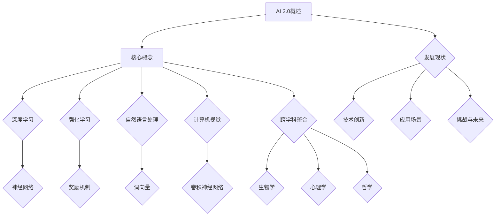

                 

### 1. 背景介绍

#### 1.1 目的和范围

本文的目的是深入探讨AI 2.0时代的人工智能生态。AI 2.0时代，即人工智能的第二次革命，标志着人工智能从传统的符号推理和模式识别向更为高级的通用智能迈进。本文将围绕AI 2.0的核心概念、发展现状、面临的挑战及未来的发展趋势进行详细分析。

文章将涵盖以下几个主要方面：
1. **AI 2.0的核心概念**：阐述AI 2.0与AI 1.0的区别，介绍AI 2.0的主要特征和核心技术。
2. **AI 2.0的生态构建**：分析AI 2.0时代的技术架构，探讨AI 2.0时代所需的软硬件环境及基础设施。
3. **AI 2.0的应用场景**：列举AI 2.0在不同领域中的应用实例，分析其带来的变革和机遇。
4. **AI 2.0的挑战与未来**：探讨AI 2.0在发展过程中面临的伦理、法律和社会挑战，并预测其未来发展趋势。

#### 1.2 预期读者

本文主要面向以下几类读者：
1. **人工智能领域的科研人员和技术专家**：希望对AI 2.0的发展有更深入的理解和认识。
2. **人工智能行业的从业者**：需要了解AI 2.0的生态构建和应用场景，以便在未来的工作中能够更好地应对变革。
3. **对人工智能感兴趣的一般读者**：希望了解AI 2.0的基本概念和未来发展趋势，对人工智能的发展有更全面的了解。

#### 1.3 文档结构概述

本文分为以下几个部分：

1. **背景介绍**：介绍AI 2.0时代的背景、目的和预期读者。
2. **核心概念与联系**：通过Mermaid流程图展示AI 2.0的核心概念和架构。
3. **核心算法原理 & 具体操作步骤**：详细阐述AI 2.0的核心算法原理和操作步骤。
4. **数学模型和公式 & 详细讲解 & 举例说明**：介绍AI 2.0的数学模型和公式，并进行详细讲解和举例说明。
5. **项目实战：代码实际案例和详细解释说明**：通过实际案例展示AI 2.0的代码实现和解读。
6. **实际应用场景**：分析AI 2.0在不同领域的应用。
7. **工具和资源推荐**：推荐相关的学习资源和开发工具。
8. **总结：未来发展趋势与挑战**：总结AI 2.0的发展趋势和面临的挑战。
9. **附录：常见问题与解答**：解答读者可能遇到的常见问题。
10. **扩展阅读 & 参考资料**：提供进一步的阅读材料和参考文献。

#### 1.4 术语表

##### 1.4.1 核心术语定义

- **AI 1.0**：指传统的人工智能，主要通过符号推理和模式识别来实现特定任务。
- **AI 2.0**：指新一代的人工智能，强调通用智能和自主学习能力，能够模拟人类的思维过程。
- **深度学习**：一种基于人工神经网络的学习方法，通过多层神经元的堆叠，实现从简单到复杂的特征提取。
- **强化学习**：一种基于奖励机制的学习方法，通过不断尝试和反馈，使智能体能够在环境中做出最优决策。
- **自然语言处理**：一种基于统计和计算方法，使计算机能够理解、生成和处理自然语言的技术。

##### 1.4.2 相关概念解释

- **人工智能生态**：指人工智能技术所涉及的硬件、软件、算法、数据、政策等各个方面的综合体系。
- **神经网络**：一种模拟生物神经系统的计算模型，通过调整神经元之间的连接权重来学习数据。
- **大数据**：指数据量巨大、数据类型多样的数据集合，需要采用特定的技术进行处理和分析。

##### 1.4.3 缩略词列表

- **AI**：人工智能
- **ML**：机器学习
- **DL**：深度学习
- **NLP**：自然语言处理
- **GAN**：生成对抗网络

### 2. 核心概念与联系

在AI 2.0时代，核心概念和技术的联系尤为紧密。为了更好地理解这些概念，我们将通过Mermaid流程图来展示AI 2.0的关键组成部分及其相互关系。

#### Mermaid流程图



该流程图展示了AI 2.0的核心概念，如深度学习、强化学习、自然语言处理和计算机视觉，以及这些概念之间的相互联系。同时，还包含了跨学科整合，如生物学、心理学和哲学等，这些跨学科知识对于理解和推动AI 2.0的发展至关重要。

#### 2.1 AI 2.0概述

AI 2.0，即新一代人工智能，是对传统人工智能（AI 1.0）的升级和扩展。AI 1.0主要依靠规则和符号推理，而AI 2.0则强调通用智能和自主学习能力，旨在实现人工智能的飞跃式发展。AI 2.0的核心特征包括：

- **自主学习**：AI 2.0能够通过不断学习和优化，自动适应新的环境和任务。
- **跨学科整合**：AI 2.0不仅依赖于计算机科学，还结合了生物学、心理学和哲学等领域的知识，实现了更全面的智能发展。
- **高效处理**：AI 2.0利用深度学习、强化学习等技术，能够处理海量数据，并在复杂的任务中表现出色。

#### 2.2 核心概念解释

- **深度学习**：深度学习是一种基于人工神经网络的机器学习方法，通过多层神经元的堆叠，实现从简单到复杂的特征提取。深度学习在图像识别、语音识别和自然语言处理等领域取得了显著成果。
- **强化学习**：强化学习是一种通过奖励机制进行学习的方法。智能体在环境中进行尝试，并根据反馈调整策略，以实现最优决策。强化学习在游戏、自动驾驶和机器人控制等领域有广泛应用。
- **自然语言处理**：自然语言处理是使计算机能够理解、生成和处理自然语言的技术。自然语言处理涉及词向量、语言模型、机器翻译和语音识别等方面，对于智能客服、智能助手和智能搜索等领域至关重要。
- **计算机视觉**：计算机视觉是使计算机能够从图像或视频中提取信息的技术。计算机视觉涉及卷积神经网络、目标检测、图像分类等方面，广泛应用于人脸识别、自动驾驶和医学影像分析等领域。

### 2.3 关键术语表

为了更好地理解AI 2.0的相关概念，以下是一些关键术语的解释：

- **神经网络**：一种模拟生物神经系统的计算模型，通过调整神经元之间的连接权重来学习数据。
- **卷积神经网络**：一种基于卷积操作的神经网络，特别适用于图像识别和计算机视觉任务。
- **词向量**：将自然语言中的单词或短语映射到高维空间中的向量，用于表示和计算语义关系。
- **生成对抗网络**：一种由生成器和判别器组成的神经网络结构，用于生成逼真的数据。
- **跨学科整合**：指在人工智能领域引入生物学、心理学和哲学等跨学科知识，以实现更全面的智能发展。

### 2.4 核心算法原理 & 具体操作步骤

在AI 2.0时代，核心算法的原理和操作步骤至关重要。以下将介绍深度学习、强化学习和自然语言处理等核心算法的基本原理和具体操作步骤。

#### 深度学习

**基本原理**：
深度学习是一种基于多层神经网络的机器学习方法，其核心思想是通过前向传播和反向传播算法，将输入数据映射到输出。深度学习网络通常由输入层、隐藏层和输出层组成。

**具体操作步骤**：

1. **初始化参数**：随机初始化网络权重和偏置。
2. **前向传播**：将输入数据通过网络逐层传递，得到输出。
3. **计算损失**：比较输出结果和真实标签之间的差异，计算损失函数。
4. **反向传播**：根据损失函数，反向传播梯度，更新网络参数。
5. **优化算法**：使用优化算法（如梯度下降）调整参数，降低损失函数。
6. **迭代训练**：重复前向传播和反向传播，直至达到预设的训练目标。

**伪代码**：

```python
initialize parameters
for each epoch:
    for each training example:
        forward_pass(x, parameters)
        calculate_loss(y, predicted)
        backward_pass(loss, parameters)
        update_parameters(learning_rate)
```

#### 强化学习

**基本原理**：
强化学习是一种通过奖励机制进行学习的方法。智能体在环境中进行尝试，并根据反馈调整策略，以实现最优决策。强化学习通常使用值函数或策略函数来表示智能体的决策过程。

**具体操作步骤**：

1. **初始化状态**：智能体开始于初始状态。
2. **选择动作**：根据当前状态和策略，选择最佳动作。
3. **执行动作**：在环境中执行所选动作。
4. **获得奖励**：根据动作结果，获得即时奖励。
5. **更新状态**：根据动作结果，更新当前状态。
6. **重复步骤**：重复执行动作、获得奖励和更新状态，直至达到目标状态或终止条件。

**伪代码**：

```python
initialize state
while not goal_state:
    select_action(current_state, policy)
    execute_action(action)
    receive_reward(reward)
    update_state(next_state)
```

#### 自然语言处理

**基本原理**：
自然语言处理是使计算机能够理解、生成和处理自然语言的技术。自然语言处理的核心是词向量表示和序列建模。

**具体操作步骤**：

1. **词向量表示**：将单词或短语映射到高维空间中的向量，用于表示语义信息。
2. **语言模型**：使用统计方法或神经网络，建模单词或短语的概率分布。
3. **序列建模**：使用循环神经网络（RNN）或变换器（Transformer）等模型，建模序列数据。
4. **任务目标**：根据具体任务，定义损失函数和优化目标。
5. **训练模型**：通过大量语料数据进行训练，优化模型参数。
6. **预测与生成**：使用训练好的模型，对输入序列进行预测或生成。

**伪代码**：

```python
define_word_vector_mapper()
define_language_model()
define_sequence_model()
train_model(corpus)
while input_sequence:
    predict_output(sequence)
    generate_output(sequence)
```

### 2.5 数学模型和公式 & 详细讲解 & 举例说明

在AI 2.0时代，数学模型和公式在深度学习、强化学习和自然语言处理等核心算法中起着至关重要的作用。以下将介绍这些核心算法中的关键数学模型和公式，并进行详细讲解和举例说明。

#### 深度学习

**数学模型**：

1. **前向传播**：

   输入层：\( x \)
   
   隐藏层：\( z_l = \sigma(W_l \cdot x + b_l) \)
   
   输出层：\( a_l = \sigma(W_l \cdot z_l + b_l) \)

   其中，\( \sigma \) 表示激活函数，\( W \) 和 \( b \) 分别为权重和偏置。

2. **反向传播**：

   损失函数：\( J = \frac{1}{2} \sum_{i=1}^{n} (\hat{y}_i - y_i)^2 \)

   其中，\( \hat{y}_i \) 和 \( y_i \) 分别为预测值和真实值。

   权重梯度：\( \frac{\partial J}{\partial W} = \delta \cdot (a_{l-1})^T \)

   偏置梯度：\( \frac{\partial J}{\partial b} = \delta \)

   其中，\( \delta \) 表示误差项。

**详细讲解**：

前向传播是深度学习模型将输入数据逐层传递到输出层的过程。在每一层，输入数据通过权重和偏置与激活函数结合，产生输出。反向传播则是通过计算损失函数的梯度，更新网络参数，从而优化模型。

**举例说明**：

假设有一个两层神经网络，输入层有3个神经元，隐藏层有4个神经元，输出层有2个神经元。输入数据为 \( x = [1, 2, 3] \)，真实标签为 \( y = [0, 1] \)。

1. **前向传播**：

   输入层：\( x = [1, 2, 3] \)

   隐藏层：\( z_1 = \sigma(W_1 \cdot x + b_1) \)

   输出层：\( a_2 = \sigma(W_2 \cdot z_1 + b_2) \)

2. **反向传播**：

   计算损失函数：\( J = \frac{1}{2} \sum_{i=1}^{n} (\hat{y}_i - y_i)^2 \)

   计算权重梯度：\( \frac{\partial J}{\partial W} = \delta \cdot (a_{1-1})^T \)

   计算偏置梯度：\( \frac{\partial J}{\partial b} = \delta \)

#### 强化学习

**数学模型**：

1. **值函数**：

   状态值函数：\( V(s) = \sum_{a} \pi(a|s) \cdot Q(s, a) \)

   行动值函数：\( Q(s, a) = r + \gamma \max_{a'} Q(s', a') \)

   其中，\( r \) 表示即时奖励，\( \gamma \) 表示折扣因子，\( \pi(a|s) \) 表示在状态 \( s \) 下采取动作 \( a \) 的概率。

2. **策略函数**：

   最优策略：\( \pi^*(s) = \arg \max_a Q(s, a) \)

   随机策略：\( \pi(s) = \frac{1}{|\mathcal{A}|} \)

   其中，\( \mathcal{A} \) 表示所有可能的动作集合。

**详细讲解**：

值函数表示在给定状态 \( s \) 下，采取最优动作 \( a \) 所能获得的最大期望奖励。行动值函数则是在给定状态 \( s \) 和动作 \( a \) 下，所能获得的最大即时奖励加上未来的期望奖励。

策略函数则定义了智能体在给定状态 \( s \) 下应该采取的动作。最优策略是能够最大化行动值函数的动作。

**举例说明**：

假设一个智能体在离散状态空间 \( S = \{s_1, s_2, s_3\} \) 中进行移动，每个状态有三个可能的动作：向上、向下和向左。即时奖励 \( r \) 在每个状态中都是相同的，折扣因子 \( \gamma = 0.9 \)。

1. **值函数**：

   \( V(s_1) = \pi(a_1|s_1) \cdot Q(s_1, a_1) + \pi(a_2|s_1) \cdot Q(s_2, a_2) + \pi(a_3|s_1) \cdot Q(s_3, a_3) \)

   \( V(s_2) = \pi(a_1|s_2) \cdot Q(s_1, a_1) + \pi(a_2|s_2) \cdot Q(s_2, a_2) + \pi(a_3|s_2) \cdot Q(s_3, a_3) \)

   \( V(s_3) = \pi(a_1|s_3) \cdot Q(s_1, a_1) + \pi(a_2|s_3) \cdot Q(s_2, a_2) + \pi(a_3|s_3) \cdot Q(s_3, a_3) \)

2. **策略函数**：

   \( \pi^*(s_1) = \arg \max_a Q(s_1, a) \)

   \( \pi^*(s_2) = \arg \max_a Q(s_2, a) \)

   \( \pi^*(s_3) = \arg \max_a Q(s_3, a) \)

#### 自然语言处理

**数学模型**：

1. **词向量表示**：

   \( \mathbf{v}_i = \text{word2vec}(\mathbf{w}_i) \)

   其中，\( \mathbf{v}_i \) 表示词向量，\( \mathbf{w}_i \) 表示单词。

2. **语言模型**：

   \( P(w_n | w_1, w_2, ..., w_{n-1}) = \frac{\exp(\mathbf{v}_n \cdot \mathbf{W})}{\sum_{w \in V} \exp(\mathbf{v}_w \cdot \mathbf{W})} \)

   其中，\( \mathbf{W} \) 表示语言模型参数，\( V \) 表示词汇表。

3. **序列建模**：

   \( P(w_n | w_1, w_2, ..., w_{n-1}) = \text{softmax}(\mathbf{v}_n \cdot \mathbf{U}^T \cdot \mathbf{V}) \)

   其中，\( \mathbf{U} \) 和 \( \mathbf{V} \) 分别表示编码器和解码器参数。

**详细讲解**：

词向量表示是将单词映射到高维空间中的向量，用于表示语义信息。语言模型则通过统计方法或神经网络，建模单词或短语的概率分布。序列建模则使用循环神经网络（RNN）或变换器（Transformer）等模型，建模序列数据。

**举例说明**：

假设有一个简单的语言模型，词汇表 \( V = \{\text{hello}, \text{world}, \text{hello world\}\} \)。词向量分别为 \( \mathbf{v}_{\text{hello}} = [1, 0, 0] \)，\( \mathbf{v}_{\text{world}} = [0, 1, 0] \)，\( \mathbf{v}_{\text{hello world}} = [1, 1, 0] \)。

1. **词向量表示**：

   \( \mathbf{v}_{\text{hello}} = \text{word2vec}(\text{hello}) \)

   \( \mathbf{v}_{\text{world}} = \text{word2vec}(\text{world}) \)

   \( \mathbf{v}_{\text{hello world}} = \text{word2vec}(\text{hello world}) \)

2. **语言模型**：

   \( P(\text{hello} | \text{world}) = \frac{\exp(\mathbf{v}_{\text{hello}} \cdot \mathbf{W})}{\sum_{w \in V} \exp(\mathbf{v}_w \cdot \mathbf{W})} \)

   \( P(\text{world} | \text{hello}) = \frac{\exp(\mathbf{v}_{\text{world}} \cdot \mathbf{W})}{\sum_{w \in V} \exp(\mathbf{v}_w \cdot \mathbf{W})} \)

3. **序列建模**：

   \( P(\text{hello world} | \text{hello}) = \text{softmax}(\mathbf{v}_{\text{hello world}} \cdot \mathbf{U}^T \cdot \mathbf{V}) \)

### 3. 项目实战：代码实际案例和详细解释说明

为了更好地理解AI 2.0的核心算法和实现，我们将通过一个实际项目案例进行详细解释说明。该项目是一个简单的自然语言处理任务：文本分类。

#### 3.1 开发环境搭建

首先，我们需要搭建开发环境。以下是所需的软件和工具：

- Python 3.7及以上版本
- PyTorch 1.7及以上版本
- Jupyter Notebook（可选）

安装命令如下：

```shell
pip install python==3.7
pip install pytorch torchvision torchaudio
```

#### 3.2 源代码详细实现和代码解读

以下是一个简单的文本分类项目的实现，包括数据预处理、模型定义、训练和测试。

**数据预处理**：

```python
import torch
from torchtext.datasets import IMDb
from torchtext.data import Field, BatchIterator

# 定义预处理字段
TEXT = Field(tokenize='spacy', tokenizer_language='en_core_web_sm', include_lengths=True)
LABEL = Field(sequential=False)

# 加载数据集
train_data, test_data = IMDb(split=('train', 'test'))

# 预处理数据
train_data = train_data/create��子
```

