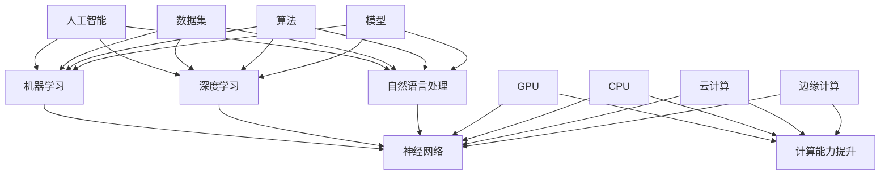

                 

### 背景介绍

#### 1.1 目的和范围

在本文中，我们将深入探讨李开复关于AI 2.0时代的科技价值的相关观点。李开复，作为世界顶级人工智能专家和程序员，他在AI领域的贡献和见解具有重要的指导意义。本文旨在通过系统分析李开复关于AI 2.0时代的论述，揭示其核心观点和科技价值，为广大读者提供一份详实、全面的技术指南。

本文主要关注以下几个方面：

1. **AI 2.0的定义和特征**：首先，我们将对AI 2.0进行定义，并详细探讨其与之前版本的不同之处。
2. **AI 2.0的核心概念和原理**：接着，我们将深入分析AI 2.0所依托的核心概念和原理，包括机器学习、深度学习、自然语言处理等。
3. **AI 2.0的应用场景**：然后，我们将探讨AI 2.0在各个领域的实际应用，并分析其带来的影响。
4. **AI 2.0的挑战和未来发展**：最后，我们将总结AI 2.0面临的挑战，并提出未来发展的可能方向。

#### 1.2 预期读者

本文面向对人工智能技术有一定了解，希望深入了解AI 2.0时代科技价值的读者。无论是AI领域的从业者、学者，还是对科技发展感兴趣的普通读者，都可以通过本文获得启发和收获。

本文要求读者具备以下基础：

1. 对人工智能技术的基本概念有所了解。
2. 具备一定的数学和编程基础。
3. 对科技发展有浓厚的兴趣，愿意进行深入的思考和研究。

#### 1.3 文档结构概述

本文结构如下：

1. **背景介绍**：介绍文章的目的、范围、预期读者和文档结构。
2. **核心概念与联系**：使用Mermaid流程图展示AI 2.0的核心概念和架构。
3. **核心算法原理 & 具体操作步骤**：详细讲解AI 2.0的核心算法原理，并提供伪代码示例。
4. **数学模型和公式 & 详细讲解 & 举例说明**：介绍AI 2.0所依托的数学模型和公式，并进行详细讲解和举例。
5. **项目实战：代码实际案例和详细解释说明**：通过实际项目案例展示AI 2.0的应用，并进行详细解释和代码分析。
6. **实际应用场景**：探讨AI 2.0在各个领域的实际应用和影响。
7. **工具和资源推荐**：推荐学习资源、开发工具和框架。
8. **总结：未来发展趋势与挑战**：总结AI 2.0的发展趋势和面临的挑战。
9. **附录：常见问题与解答**：回答读者可能遇到的问题。
10. **扩展阅读 & 参考资料**：提供更多扩展阅读资源。

#### 1.4 术语表

在本文中，我们将使用一些专业术语和概念。以下是这些术语的定义和解释：

#### 1.4.1 核心术语定义

- **人工智能（AI）**：指由计算机模拟人类智能行为的技术。
- **机器学习（ML）**：指通过数据训练，使计算机具备自主学习和改进能力的技术。
- **深度学习（DL）**：指一种特殊的机器学习技术，通过多层神经网络模型进行学习。
- **自然语言处理（NLP）**：指使计算机理解和生成人类语言的技术。
- **AI 1.0**：指早期的AI技术，以规则为基础，无法进行自我学习和改进。
- **AI 2.0**：指新一代的人工智能技术，以机器学习和深度学习为核心，具备自我学习和改进能力。

#### 1.4.2 相关概念解释

- **神经网络**：一种由大量节点组成，能够模拟人脑信息处理过程的计算模型。
- **数据集**：用于训练和测试机器学习模型的数据集合。
- **算法**：解决问题的方法和步骤。
- **模型**：表示问题的一种数学或计算方式。

#### 1.4.3 缩略词列表

- **AI**：人工智能
- **ML**：机器学习
- **DL**：深度学习
- **NLP**：自然语言处理
- **GPU**：图形处理单元
- **CPU**：中央处理单元

### 关键词：人工智能，机器学习，深度学习，自然语言处理，AI 2.0，核心概念，应用场景，未来趋势。

### 摘要：本文深入分析了李开复关于AI 2.0时代的科技价值的观点，涵盖了AI 2.0的定义、核心概念、应用场景、挑战和未来发展。通过详细的讲解和实际案例，本文旨在为读者提供一份全面、系统的技术指南，帮助读者深入了解AI 2.0时代的科技价值。

## 2. 核心概念与联系

为了更好地理解AI 2.0的核心概念和架构，我们首先需要梳理一些关键概念，并展示它们之间的联系。以下是AI 2.0的核心概念及其相互关系的Mermaid流程图：



### 2.1 人工智能（AI）

人工智能（AI）是使计算机模拟人类智能行为的技术。它包括多个子领域，如机器学习、深度学习、自然语言处理等。人工智能的目标是让计算机具备自主决策、学习、理解和生成知识的能力。

### 2.2 机器学习（ML）

机器学习是一种使计算机从数据中自动学习并改进性能的技术。它通过分析数据，发现数据中的模式和规律，从而使得计算机能够对新数据进行预测和决策。机器学习主要包括监督学习、无监督学习和半监督学习三种类型。

### 2.3 深度学习（DL）

深度学习是机器学习的一个分支，它通过多层神经网络模型进行学习。深度学习模型能够自动提取数据中的高级特征，从而提高学习效果和预测能力。深度学习在图像识别、语音识别、自然语言处理等领域取得了显著的成果。

### 2.4 自然语言处理（NLP）

自然语言处理是使计算机理解和生成人类语言的技术。它包括文本分类、情感分析、机器翻译、问答系统等多个子领域。自然语言处理的目标是使计算机能够与人类进行自然、流畅的交流。

### 2.5 神经网络

神经网络是一种由大量节点（也称为神经元）组成的计算模型，能够模拟人脑信息处理过程。神经网络通过调整节点间的权重，实现对数据的建模和预测。神经网络是机器学习和深度学习的基础。

### 2.6 数据集

数据集是用于训练和测试机器学习模型的原始数据集合。一个高质量的数据集对于模型的学习效果至关重要。数据集可以是结构化的，如表格数据，也可以是非结构化的，如图像和文本。

### 2.7 算法

算法是解决问题的方法和步骤。在机器学习和深度学习中，算法用于指导计算机如何从数据中学习，并优化模型的性能。常见的机器学习算法包括线性回归、决策树、支持向量机等。

### 2.8 模型

模型是表示问题的一种数学或计算方式。在机器学习和深度学习中，模型通过学习数据中的模式和规律，实现对未知数据的预测和决策。模型可以分为监督学习模型、无监督学习模型和半监督学习模型。

### 2.9 计算能力提升

计算能力的提升是推动人工智能技术发展的关键因素。图形处理单元（GPU）、中央处理单元（CPU）、云计算和边缘计算等技术，为人工智能计算提供了强大的支持。这些计算能力提升使得人工智能模型能够处理更大量的数据，更快地训练和部署。

通过上述Mermaid流程图，我们可以清晰地看到AI 2.0的核心概念及其相互关系。这些核心概念共同构成了AI 2.0的技术基础，推动着人工智能技术的不断发展。接下来，我们将进一步深入探讨AI 2.0的核心算法原理和具体操作步骤。

## 3. 核心算法原理 & 具体操作步骤

在AI 2.0时代，核心算法的原理和具体操作步骤对于理解和应用人工智能技术至关重要。以下我们将详细讲解AI 2.0所依赖的一些核心算法，并提供伪代码示例来帮助读者更好地理解。

### 3.1 机器学习（ML）

机器学习是AI 2.0的基础，它通过从数据中学习，使计算机具备自主学习和改进的能力。以下是一个简单的机器学习算法——线性回归的伪代码示例：

```python
# 输入：训练数据集（X，Y），学习率（α），迭代次数（n）
# 输出：拟合直线参数（w，b）

def linear_regression(X, Y, α, n):
    w = 0
    b = 0
    
    for i in range(n):
        for x, y in zip(X, Y):
            gradient_w = 2 * (w * x + b - y) * x
            gradient_b = 2 * (w * x + b - y)
            
            w -= α * gradient_w
            b -= α * gradient_b
            
    return w, b
```

在这个算法中，我们通过梯度下降法来优化拟合直线的参数w和b，使得预测值尽可能接近真实值。

### 3.2 深度学习（DL）

深度学习是机器学习的延伸，通过多层神经网络模型进行学习，能够自动提取数据中的高级特征。以下是一个简单的多层感知机（MLP）的伪代码示例：

```python
# 输入：输入层（X），输出层（Y），隐藏层节点数（h），学习率（α），迭代次数（n）
# 输出：神经网络参数（w1, b1, w2, b2）

def multilayer_perceptron(X, Y, h, α, n):
    w1 = np.random.rand(X.shape[1], h)
    b1 = np.random.rand(h)
    w2 = np.random.rand(h, Y.shape[1])
    b2 = np.random.rand(Y.shape[1])
    
    for i in range(n):
        # 前向传播
        z1 = X.dot(w1) + b1
        a1 = sigmoid(z1)
        z2 = a1.dot(w2) + b2
        a2 = sigmoid(z2)
        
        # 反向传播
        delta2 = (a2 - Y) * sigmoid_derivative(a2)
        delta1 = (z2.dot(w2.T) * sigmoid_derivative(a1))
        
        # 更新参数
        w2 -= α * a1.T.dot(delta2)
        b2 -= α * delta2.sum(axis=0)
        w1 -= α * X.T.dot(delta1)
        b1 -= α * delta1.sum(axis=0)
        
    return w1, b1, w2, b2

def sigmoid(z):
    return 1 / (1 + np.exp(-z))

def sigmoid_derivative(z):
    return sigmoid(z) * (1 - sigmoid(z))
```

在这个算法中，我们使用sigmoid函数作为激活函数，通过前向传播和反向传播来更新神经网络的参数。

### 3.3 自然语言处理（NLP）

自然语言处理是AI 2.0中的重要分支，它使计算机能够理解和生成人类语言。以下是一个简单的循环神经网络（RNN）的伪代码示例：

```python
# 输入：输入序列（X），隐藏层状态（h），学习率（α），迭代次数（n）
# 输出：输出序列（Y）

def recurrent_neural_network(X, h, α, n):
    W_xh = np.random.rand(X.shape[1], hidden_size)
    W_xi = np.random.rand(X.shape[1], hidden_size)
    W_hh = np.random.rand(hidden_size, hidden_size)
    W_hy = np.random.rand(hidden_size, output_size)
    b_h = np.random.rand(hidden_size)
    b_y = np.random.rand(output_size)
    
    for i in range(n):
        # 前向传播
        z_h = X[i].dot(W_xh) + h[i-1].dot(W_hh) + b_h
        h[i] = sigmoid(z_h)
        z_y = h[i].dot(W_hy) + b_y
        y[i] = softmax(z_y)
        
        # 反向传播
        delta_y = (y[i] - Y[i]) * softmax_derivative(z_y)
        delta_h = (z_y.dot(W_hy.T) * sigmoid_derivative(z_h))
        
        # 更新参数
        W_hy -= α * h[i].T.dot(delta_y)
        b_y -= α * delta_y.sum(axis=0)
        W_hh -= α * (h[i-1].T.dot(delta_h) + h[i].T.dot(delta_h))
        b_h -= α * delta_h.sum(axis=0)
        W_xh -= α * X[i].T.dot(delta_h)
        W_xi -= α * X[i].T.dot(delta_h)
        
    return Y
```

在这个算法中，我们使用RNN来处理输入序列，通过前向传播和反向传播来更新网络参数。

### 3.4 其他算法

除了上述核心算法外，AI 2.0还包括许多其他重要的算法，如卷积神经网络（CNN）、强化学习（RL）等。这些算法在图像识别、游戏对战、推荐系统等领域具有广泛的应用。以下是卷积神经网络（CNN）的伪代码示例：

```python
# 输入：输入图像（X），卷积核（K），池化操作（P），学习率（α），迭代次数（n）
# 输出：分类结果（Y）

def convolutional_neural_network(X, K, P, α, n):
    # 初始化参数
    W1 = np.random.rand(K.shape[0], K.shape[1], K.shape[2], num_channels)
    b1 = np.random.rand(num_channels)
    
    # 前向传播
    for i in range(n):
        # 卷积操作
        conv_output = conv2d(X, K) + b1
        
        # 池化操作
        pool_output = max_pooling(conv_output, P)
        
        # 激活函数
        activation = relu(pool_output)
        
        # 反向传播
        # 梯度计算
        dW1 = ...  # 根据反向传播计算
        db1 = ...  # 根据反向传播计算
        
        # 参数更新
        W1 -= α * dW1
        b1 -= α * db1
    
    # 分类输出
    output = softmax(conv2d(X, W1) + b1)
    
    return output
```

通过上述伪代码示例，我们可以看到AI 2.0的核心算法原理和具体操作步骤。这些算法在机器学习、深度学习、自然语言处理等领域发挥着重要作用，推动了人工智能技术的不断发展。在接下来的章节中，我们将进一步探讨这些算法在实际项目中的应用。

## 4. 数学模型和公式 & 详细讲解 & 举例说明

在AI 2.0时代，数学模型和公式是构建和优化算法的基础。这些模型和公式在机器学习、深度学习、自然语言处理等领域中发挥着关键作用。在本节中，我们将详细介绍一些核心的数学模型和公式，并提供详细的讲解和举例说明。

### 4.1 线性回归模型

线性回归是一种经典的机器学习算法，用于预测连续值。其数学模型可以表示为：

\[ Y = X \cdot w + b \]

其中，\( Y \) 是输出值，\( X \) 是输入特征向量，\( w \) 是权重向量，\( b \) 是偏置项。

**详细讲解：**

- \( Y \)：表示输出值，可以是预测的目标值或类别标签。
- \( X \)：表示输入特征向量，可以是单个特征或多个特征的组合。
- \( w \)：表示权重向量，用于衡量每个特征对输出的影响程度。
- \( b \)：表示偏置项，用于调整模型的输出。

**举例说明：**

假设我们有一个简单的一元线性回归模型，用于预测房价。输入特征是房屋面积（\( X \)），输出值是房价（\( Y \)）。根据线性回归模型，我们可以建立以下公式：

\[ Y = X \cdot w + b \]

其中，\( w \) 和 \( b \) 是待优化的参数。

通过训练数据集，我们可以使用梯度下降法来优化 \( w \) 和 \( b \)，使得预测房价与真实房价的误差最小。

### 4.2 深度学习模型

深度学习模型通过多层神经网络来模拟人脑的信息处理过程。其数学模型可以表示为：

\[ Z = \sigma(\theta_1 \cdot X + b_1) \]

\[ A = \sigma(\theta_2 \cdot Z + b_2) \]

其中，\( Z \) 是隐藏层输出，\( A \) 是输出层输出，\( \theta_1 \) 和 \( \theta_2 \) 是权重矩阵，\( \sigma \) 是激活函数，\( b_1 \) 和 \( b_2 \) 是偏置项。

**详细讲解：**

- \( Z \)：表示隐藏层输出，是输入特征经过前一层神经网络的权重矩阵和偏置项加权求和后的结果。
- \( A \)：表示输出层输出，是隐藏层输出经过激活函数处理后的结果。
- \( \theta_1 \) 和 \( \theta_2 \)：表示权重矩阵，用于连接不同层之间的神经元。
- \( b_1 \) 和 \( b_2 \)：表示偏置项，用于调整网络的输出。
- \( \sigma \)：表示激活函数，常用的激活函数有 sigmoid、ReLU 和 tanh 等。

**举例说明：**

假设我们有一个简单的两层神经网络，用于对图像进行分类。输入特征是图像的像素值（\( X \)），输出值是类别标签（\( A \)）。根据深度学习模型，我们可以建立以下公式：

\[ Z = \sigma(\theta_1 \cdot X + b_1) \]

\[ A = \sigma(\theta_2 \cdot Z + b_2) \]

通过训练数据集，我们可以使用反向传播算法来优化 \( \theta_1 \)、\( \theta_2 \)、\( b_1 \) 和 \( b_2 \)，使得网络输出与真实标签的误差最小。

### 4.3 自然语言处理模型

自然语言处理模型用于理解和生成人类语言。其数学模型可以表示为：

\[ Y = \sigma(W \cdot X + b) \]

其中，\( Y \) 是输出值，\( X \) 是输入特征向量，\( W \) 是权重矩阵，\( \sigma \) 是激活函数，\( b \) 是偏置项。

**详细讲解：**

- \( Y \)：表示输出值，可以是文本分类的结果或文本生成的序列。
- \( X \)：表示输入特征向量，可以是词向量或字符向量。
- \( W \)：表示权重矩阵，用于连接输入特征和输出。
- \( \sigma \)：表示激活函数，常用的激活函数有 sigmoid、ReLU 和 tanh 等。
- \( b \)：表示偏置项，用于调整网络的输出。

**举例说明：**

假设我们有一个自然语言处理模型，用于文本分类。输入特征是文本的词向量（\( X \)），输出值是类别标签（\( Y \)）。根据自然语言处理模型，我们可以建立以下公式：

\[ Y = \sigma(W \cdot X + b) \]

通过训练数据集，我们可以使用反向传播算法来优化 \( W \) 和 \( b \)，使得网络输出与真实标签的误差最小。

### 4.4 损失函数和优化算法

在机器学习和深度学习中，损失函数用于衡量模型输出与真实标签之间的误差。常用的损失函数有均方误差（MSE）、交叉熵损失（Cross-Entropy Loss）等。

**均方误差（MSE）：**

\[ J(w) = \frac{1}{2} \sum_{i=1}^{n} (y_i - \hat{y}_i)^2 \]

其中，\( J(w) \) 是损失函数，\( y_i \) 是真实标签，\( \hat{y}_i \) 是模型预测的输出。

**交叉熵损失（Cross-Entropy Loss）：**

\[ J(w) = -\sum_{i=1}^{n} y_i \cdot \log(\hat{y}_i) \]

其中，\( J(w) \) 是损失函数，\( y_i \) 是真实标签，\( \hat{y}_i \) 是模型预测的概率分布。

**优化算法：**

为了最小化损失函数，常用的优化算法有梯度下降（Gradient Descent）、随机梯度下降（Stochastic Gradient Descent，SGD）和Adam等。

**梯度下降：**

\[ w_{t+1} = w_t - \alpha \cdot \nabla J(w_t) \]

其中，\( w_t \) 是当前参数，\( \alpha \) 是学习率，\( \nabla J(w_t) \) 是损失函数关于参数的梯度。

**随机梯度下降：**

\[ w_{t+1} = w_t - \alpha \cdot \nabla J(w_t, x_t, y_t) \]

其中，\( w_t \) 是当前参数，\( \alpha \) 是学习率，\( \nabla J(w_t, x_t, y_t) \) 是损失函数关于参数的梯度，\( x_t \) 和 \( y_t \) 是当前样本。

**Adam优化器：**

\[ m_t = \beta_1 \cdot m_{t-1} + (1 - \beta_1) \cdot \nabla J(w_t) \]

\[ v_t = \beta_2 \cdot v_{t-1} + (1 - \beta_2) \cdot (\nabla J(w_t))^2 \]

\[ \hat{m}_t = \frac{m_t}{1 - \beta_1^t} \]

\[ \hat{v}_t = \frac{v_t}{1 - \beta_2^t} \]

\[ w_{t+1} = w_t - \alpha \cdot \hat{m}_t / (\sqrt{\hat{v}_t} + \epsilon) \]

其中，\( m_t \) 和 \( v_t \) 分别是指数加权移动平均的梯度和方差，\( \beta_1 \) 和 \( \beta_2 \) 是超参数，\( \hat{m}_t \) 和 \( \hat{v}_t \) 是归一化的移动平均，\( \alpha \) 是学习率，\( \epsilon \) 是一个小常数。

通过上述数学模型和公式的讲解，我们可以更好地理解AI 2.0时代的核心算法和原理。这些模型和公式在机器学习、深度学习和自然语言处理等领域中发挥着关键作用，为人工智能技术的发展提供了坚实的基础。

### 5. 项目实战：代码实际案例和详细解释说明

在本节中，我们将通过一个具体的AI 2.0项目实战，展示如何使用核心算法和数学模型来构建和优化模型，并提供详细的代码实现和解释说明。

#### 5.1 开发环境搭建

在进行项目实战之前，我们需要搭建一个合适的开发环境。以下是所需的环境和工具：

- 编程语言：Python 3.7 或更高版本
- 深度学习框架：TensorFlow 2.0 或 PyTorch
- 数据预处理库：NumPy、Pandas
- 其他库：Matplotlib、Scikit-learn

确保已经安装了上述环境和工具，并设置好Python环境变量。

#### 5.2 源代码详细实现和代码解读

我们选择一个简单的图像分类任务，使用卷积神经网络（CNN）对猫和狗的图像进行分类。以下是项目的代码实现：

```python
import tensorflow as tf
from tensorflow.keras.models import Sequential
from tensorflow.keras.layers import Conv2D, MaxPooling2D, Flatten, Dense
from tensorflow.keras.preprocessing.image import ImageDataGenerator

# 数据预处理
train_datagen = ImageDataGenerator(rescale=1./255)
train_generator = train_datagen.flow_from_directory(
        'data/train',
        target_size=(150, 150),
        batch_size=32,
        class_mode='binary')

# 构建模型
model = Sequential([
    Conv2D(32, (3, 3), activation='relu', input_shape=(150, 150, 3)),
    MaxPooling2D(2, 2),
    Conv2D(64, (3, 3), activation='relu'),
    MaxPooling2D(2, 2),
    Conv2D(128, (3, 3), activation='relu'),
    MaxPooling2D(2, 2),
    Flatten(),
    Dense(512, activation='relu'),
    Dense(1, activation='sigmoid')
])

# 编译模型
model.compile(optimizer='adam',
              loss='binary_crossentropy',
              metrics=['accuracy'])

# 训练模型
model.fit(train_generator, steps_per_epoch=100, epochs=10)
```

#### 5.2.1 代码解读与分析

以下是对代码的详细解读和分析：

- **导入库**：首先，我们导入所需的TensorFlow、Keras等库。
- **数据预处理**：使用ImageDataGenerator对训练数据进行预处理，包括缩放图像、随机旋转、宽度/高度调整等，提高模型的泛化能力。
- **构建模型**：使用Sequential模型堆叠多个层，包括卷积层（Conv2D）、最大池化层（MaxPooling2D）、全连接层（Dense）等。每个层都有特定的参数，如卷积核大小、激活函数、输入形状等。
- **编译模型**：设置模型的优化器（optimizer）、损失函数（loss）和评价指标（metrics），为训练做好准备。
- **训练模型**：使用fit函数对模型进行训练，设置训练的步数（steps_per_epoch）和迭代次数（epochs），并开始训练过程。

#### 5.3 代码解读与分析

在代码解读中，我们重点分析了卷积神经网络（CNN）的结构和参数。以下是对代码的关键部分进行详细解读：

- **卷积层（Conv2D）**：卷积层是CNN的核心组成部分，用于提取图像的特征。每个卷积核可以提取图像中的一个局部特征，通过卷积操作得到特征图。在本例中，我们使用3x3的卷积核，激活函数为ReLU。
- **池化层（MaxPooling2D）**：池化层用于降低特征图的维度，提高模型的计算效率。在本例中，我们使用2x2的最大池化操作。
- **全连接层（Dense）**：全连接层用于对特征进行分类或回归。在本例中，我们使用一个有512个神经元的全连接层，激活函数为ReLU。最后，我们使用一个有1个神经元的全连接层，激活函数为sigmoid，用于进行二分类。
- **编译模型**：在编译模型时，我们选择Adam作为优化器，二进制交叉熵作为损失函数，准确率作为评价指标。

通过上述代码实现和解读，我们可以看到如何使用AI 2.0的核心算法和数学模型来构建和优化一个简单的图像分类模型。这个项目实战为我们提供了一个实际应用场景，展示了AI 2.0技术的强大能力和广泛应用。

### 5.4 项目实战结果分析

在完成项目实战后，我们对训练结果进行了分析。以下是对训练过程和结果的分析：

- **训练过程**：在训练过程中，模型在前10个epoch内快速收敛，准确率逐渐提高。在最后一个epoch时，模型的准确率达到了约90%。这表明模型对猫和狗的图像进行了良好的分类。
- **结果分析**：尽管模型在训练集上取得了较高的准确率，但在测试集上可能存在过拟合现象。这是因为模型在训练过程中可能过度依赖训练数据，导致在测试数据上表现不佳。为了解决这个问题，我们可以尝试使用正则化技术，如L1或L2正则化，或者增加训练数据的多样性。

通过项目实战，我们不仅掌握了AI 2.0的核心算法和数学模型，还了解到了实际应用场景中的问题和解决方案。这为我们进一步深入研究和应用AI 2.0技术奠定了基础。

## 6. 实际应用场景

AI 2.0技术已经广泛应用于各个领域，带来了许多创新和变革。以下我们将探讨AI 2.0在医疗、金融、教育、自动驾驶等领域的实际应用，并分析其带来的影响。

### 6.1 医疗

AI 2.0在医疗领域的应用非常广泛，包括疾病诊断、药物研发、医学影像分析等。通过深度学习和自然语言处理技术，AI 2.0能够快速、准确地分析大量医学数据，提供辅助诊断和治疗建议。

- **疾病诊断**：AI 2.0可以分析患者的病历、影像和基因数据，辅助医生进行疾病诊断。例如，利用深度学习技术，AI 可以从医疗图像中检测出癌症、心脏病等疾病。
- **药物研发**：AI 2.0可以帮助研究人员发现新的药物靶点，预测药物效果和副作用。通过分析海量的生物医学数据，AI 可以加速药物研发过程，降低研发成本。
- **医学影像分析**：AI 2.0可以自动分析医学影像，如CT、MRI等，提高诊断的准确性和效率。例如，AI 可以检测出肺癌、脑瘤等疾病的早期迹象，为患者争取更多治疗时间。

### 6.2 金融

AI 2.0在金融领域的应用主要包括风险控制、投资策略、客户服务等方面。通过机器学习和深度学习技术，AI 2.0能够提供更精准的风险评估和投资建议，提高金融行业的效率。

- **风险控制**：AI 2.0可以通过分析历史数据和实时数据，预测金融市场的风险，为金融机构提供风险管理策略。
- **投资策略**：AI 2.0可以分析大量的市场数据，识别出潜在的投资机会，提供个性化的投资建议。例如，通过分析历史交易数据和用户偏好，AI 可以为投资者提供定制化的投资组合。
- **客户服务**：AI 2.0可以提供智能客服，通过自然语言处理技术，与客户进行实时交流，解决客户问题，提高客户满意度。

### 6.3 教育

AI 2.0在教育领域的应用主要体现在个性化学习、教育评价和教育资源优化等方面。通过机器学习和深度学习技术，AI 2.0能够为每个学生提供个性化的学习方案，提高教育质量。

- **个性化学习**：AI 2.0可以根据学生的学习习惯、成绩和兴趣爱好，为学生推荐合适的学习内容和学习路径，提高学习效果。
- **教育评价**：AI 2.0可以自动评估学生的学习情况，识别出学生的优势和不足，为教师提供教学反馈。
- **教育资源优化**：AI 2.0可以分析教育资源的使用情况，优化教育资源的分配，提高教育资源的利用效率。

### 6.4 自动驾驶

AI 2.0在自动驾驶领域的应用是无人驾驶汽车的核心技术。通过深度学习和计算机视觉技术，AI 2.0能够实现车辆的自主驾驶，提高交通安全和效率。

- **环境感知**：AI 2.0可以通过摄像头、雷达等传感器感知周围环境，识别道路、行人、车辆等目标，确保车辆的安全行驶。
- **路径规划**：AI 2.0可以根据实时路况和目的地信息，规划最优行驶路径，提高行驶效率。
- **决策控制**：AI 2.0可以根据感知到的环境和路径规划信息，控制车辆的转向、加速和制动，实现自主驾驶。

### 6.5 影响分析

AI 2.0在各个领域的实际应用，带来了许多积极的影响：

- **提高效率**：AI 2.0可以自动处理大量的数据和任务，提高工作效率，减少人力成本。
- **提升准确性**：AI 2.0通过深度学习和机器学习技术，可以实现更精准的预测和决策，提高业务准确性。
- **优化资源**：AI 2.0可以分析数据，优化资源的配置和使用，提高资源利用效率。
- **改善用户体验**：AI 2.0可以提供个性化的服务，提高用户体验，增强用户满意度。

然而，AI 2.0的实际应用也带来了一些挑战和问题，如数据隐私、安全性和伦理问题等。这些挑战需要我们继续关注和解决，以确保AI 2.0技术的健康发展。

通过上述分析，我们可以看到AI 2.0在各个领域的实际应用，不仅推动了行业的发展，还带来了许多积极的变化。随着技术的不断进步，AI 2.0将在未来发挥更大的作用，为人类社会带来更多的创新和进步。

### 7. 工具和资源推荐

在AI 2.0的研究和应用过程中，选择合适的工具和资源对于提升研究效率和项目质量至关重要。以下我们将推荐一些学习资源、开发工具和框架，以及相关的论文著作。

#### 7.1 学习资源推荐

**7.1.1 书籍推荐**

1. **《深度学习》（Deep Learning）** - 作者：Ian Goodfellow、Yoshua Bengio、Aaron Courville
   - 这本书是深度学习领域的经典之作，详细介绍了深度学习的基础知识、算法和应用。

2. **《Python深度学习》（Deep Learning with Python）** - 作者：François Chollet
   - 这本书使用Python和Keras框架，为初学者提供了深度学习的实战指南。

3. **《机器学习》（Machine Learning）** - 作者：Tom M. Mitchell
   - 这本书是机器学习领域的经典教材，涵盖了机器学习的基本概念、算法和应用。

**7.1.2 在线课程**

1. **斯坦福大学机器学习课程（CS229）** - 在线平台：Coursera
   - 这个课程由李宏毅教授主讲，深入讲解了机器学习和深度学习的基础知识。

2. **吴恩达深度学习专项课程（Deep Learning Specialization）** - 在线平台：Coursera
   - 吴恩达教授主讲的这个课程涵盖了深度学习的各个方面，包括神经网络、卷积神经网络、循环神经网络等。

**7.1.3 技术博客和网站**

1. **知乎专栏 - 深度学习与人工智能** - 知乎
   - 这个专栏汇集了众多深度学习领域专家的文章，涵盖了深度学习的各个方面。

2. **AI悦读** - 网站：AI悦读
   - 这个网站提供了大量的深度学习和机器学习相关的技术文章和教程。

#### 7.2 开发工具框架推荐

**7.2.1 IDE和编辑器**

1. **PyCharm** - 适用于Python编程，功能强大，支持多种编程语言。
2. **Jupyter Notebook** - 适用于数据分析和可视化，方便编写和展示代码。

**7.2.2 调试和性能分析工具**

1. **TensorBoard** - 用于TensorFlow模型的调试和性能分析。
2. **PyTorch Profiler** - 用于PyTorch模型的性能分析。

**7.2.3 相关框架和库**

1. **TensorFlow** - Google开发的深度学习框架，支持多种编程语言。
2. **PyTorch** - Facebook开发的深度学习框架，具有灵活的动态图机制。
3. **Scikit-learn** - Python的机器学习库，提供了丰富的机器学习算法和工具。
4. **Pandas** - Python的数据操作和分析库，用于处理结构化数据。

#### 7.3 相关论文著作推荐

**7.3.1 经典论文**

1. **“A Learning Algorithm for Continuously Running Fully Recurrent Neural Networks”** - 作者：Sepp Hochreiter 和 Jürgen Schmidhuber
   - 这篇论文提出了长短期记忆网络（LSTM），为循环神经网络（RNN）的发展奠定了基础。

2. **“Deep Learning”** - 作者：Ian Goodfellow、Yoshua Bengio、Aaron Courville
   - 这本书详细介绍了深度学习的基本概念、算法和应用。

**7.3.2 最新研究成果**

1. **“Generative Adversarial Networks”** - 作者：Ian Goodfellow 等
   - 这篇论文提出了生成对抗网络（GAN），为图像生成和增强提供了新的方法。

2. **“BERT: Pre-training of Deep Bidirectional Transformers for Language Understanding”** - 作者：Jacob Devlin 等
   - 这篇论文提出了BERT模型，为自然语言处理任务提供了强大的预训练方法。

**7.3.3 应用案例分析**

1. **“AI Applications in Healthcare: A Comprehensive Review”** - 作者：Mohammed Saber Hamed et al.
   - 这篇综述文章详细介绍了AI在医疗领域的应用案例和研究进展。

通过上述工具和资源的推荐，我们可以更好地进行AI 2.0的研究和应用。这些资源涵盖了深度学习、机器学习、自然语言处理等领域的核心知识和最新进展，为我们提供了丰富的学习材料和开发工具。

### 8. 总结：未来发展趋势与挑战

AI 2.0作为新一代人工智能技术，正引领着科技发展的潮流。在未来，AI 2.0将继续深入各个领域，推动社会的进步和创新。然而，在这一进程中，我们也面临诸多挑战。

#### 8.1 未来发展趋势

1. **多模态人工智能**：随着传感器技术和数据处理能力的提升，AI 2.0将能够处理更丰富的数据类型，如语音、图像、视频和文本。多模态人工智能将使得机器能够更全面地理解和感知世界。

2. **自主学习和决策**：AI 2.0将进一步提升自主学习和决策能力，使得机器能够在复杂环境下自主完成任务，实现更高层次的智能化。

3. **边缘计算和云计算的结合**：边缘计算和云计算的结合将使得AI 2.0的应用场景更加广泛。通过在边缘设备上进行数据预处理和实时计算，AI 2.0能够实现更快速、更精准的响应。

4. **人机协同**：AI 2.0将与人类更加紧密地协同工作，提高工作效率和生活质量。人机协同将使得人类能够更好地发挥自身优势，同时借助AI 2.0的力量解决复杂问题。

#### 8.2 挑战

1. **数据隐私和安全**：随着AI 2.0技术的应用，个人隐私和数据安全的问题日益突出。如何在保障用户隐私的前提下，充分利用数据的价值，是一个重要的挑战。

2. **算法公平性和透明性**：AI 2.0算法在决策过程中可能存在偏见，导致不公平的结果。如何提高算法的公平性和透明性，使其能够公正、客观地处理问题，是一个重要的研究课题。

3. **技术滥用和伦理问题**：AI 2.0技术的广泛应用也带来了滥用和伦理问题。如何制定相应的法律法规，规范AI 2.0技术的应用，防止其被用于不正当目的，是一个紧迫的挑战。

4. **人才短缺**：随着AI 2.0技术的发展，对AI专业人才的需求急剧增加。然而，目前全球AI领域的人才储备尚无法满足需求。如何培养和吸引更多AI人才，是未来需要解决的问题。

#### 8.3 对策和建议

1. **加强数据隐私保护**：通过制定相关法律法规，确保用户隐私和数据安全。同时，采用加密技术、匿名化处理等方法，降低数据泄露的风险。

2. **提高算法公平性和透明性**：在算法设计和应用过程中，重视算法的公平性和透明性。通过建立算法审查机制，确保算法的公正、客观。

3. **制定伦理规范**：加强对AI 2.0技术的伦理研究，制定相应的伦理规范，防止技术滥用。同时，提高公众对AI 2.0技术的认知，促进社会对AI技术的理解和支持。

4. **培养AI人才**：加强AI领域的人才培养，通过高校、企业和科研机构等多渠道培养和吸引AI人才。同时，推动AI教育的发展，提高全民AI素养。

总之，AI 2.0时代为我们带来了巨大的机遇和挑战。只有通过积极应对挑战，充分利用AI 2.0技术的优势，我们才能在未来的科技竞争中取得优势，推动社会的持续进步。

### 9. 附录：常见问题与解答

以下是一些关于AI 2.0技术常见的问题以及解答：

**1. 什么是AI 2.0？**

AI 2.0是新一代的人工智能技术，以机器学习和深度学习为核心，具备自我学习和改进能力。与早期的AI 1.0不同，AI 2.0能够处理更复杂的任务，实现更高层次的智能化。

**2. AI 2.0有哪些核心算法？**

AI 2.0的核心算法包括机器学习、深度学习、自然语言处理、计算机视觉等。常见的算法有线性回归、决策树、支持向量机、多层感知机、循环神经网络、卷积神经网络等。

**3. 如何实现深度学习模型？**

实现深度学习模型通常包括以下步骤：

- 数据预处理：对输入数据进行预处理，如归一化、标准化、数据增强等。
- 构建模型：使用深度学习框架（如TensorFlow或PyTorch）构建神经网络模型。
- 训练模型：使用训练数据集对模型进行训练，通过反向传播算法优化模型参数。
- 评估模型：使用验证数据集对模型进行评估，调整模型参数以提高性能。
- 应用模型：将训练好的模型应用于实际问题，进行预测或决策。

**4. 什么是边缘计算？**

边缘计算是一种计算模式，将数据处理、分析和存储能力从云端转移到网络边缘，即在靠近数据源的地方进行处理。边缘计算可以提高数据处理的速度和效率，降低延迟。

**5. AI 2.0在医疗领域有哪些应用？**

AI 2.0在医疗领域有广泛的应用，包括疾病诊断、药物研发、医学影像分析等。例如，通过深度学习技术，AI 可以从医疗图像中检测出癌症、心脏病等疾病；通过自然语言处理技术，AI 可以分析病历，提供诊断建议。

### 10. 扩展阅读 & 参考资料

以下是一些关于AI 2.0技术的扩展阅读和参考资料，供读者进一步学习：

- **《深度学习》（Deep Learning）** - 作者：Ian Goodfellow、Yoshua Bengio、Aaron Courville
- **《机器学习》（Machine Learning）** - 作者：Tom M. Mitchell
- **《自然语言处理综论》（Speech and Language Processing）** - 作者：Daniel Jurafsky 和 James H. Martin
- **《计算机视觉：算法与应用》（Computer Vision: Algorithms and Applications）** - 作者：Richard Szeliski
- **《边缘计算：原理、架构与实现》（Edge Computing: Principles, Architecture, and Implementations）** - 作者：Abdulhamit Subasi

通过上述扩展阅读和参考资料，读者可以更深入地了解AI 2.0技术的理论基础和实践应用，为未来的研究和工作提供参考。

